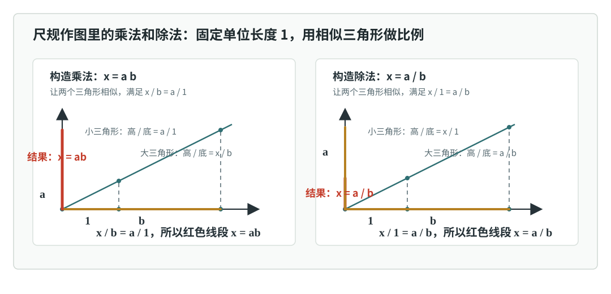
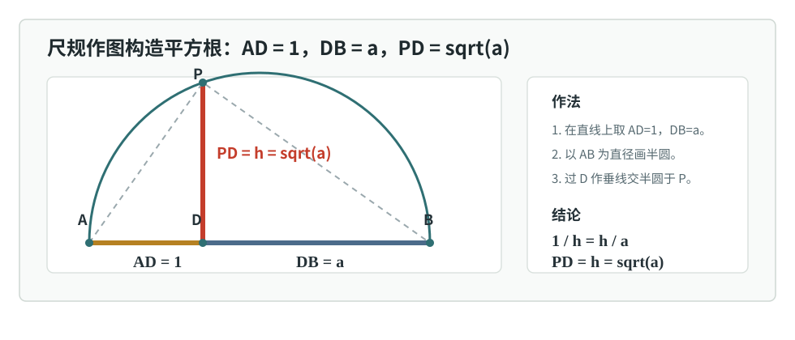
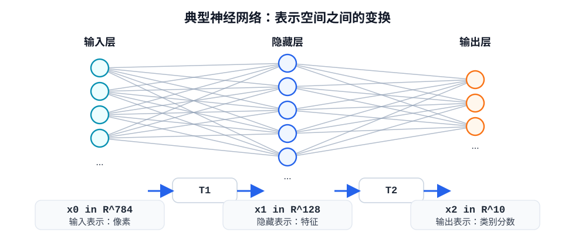
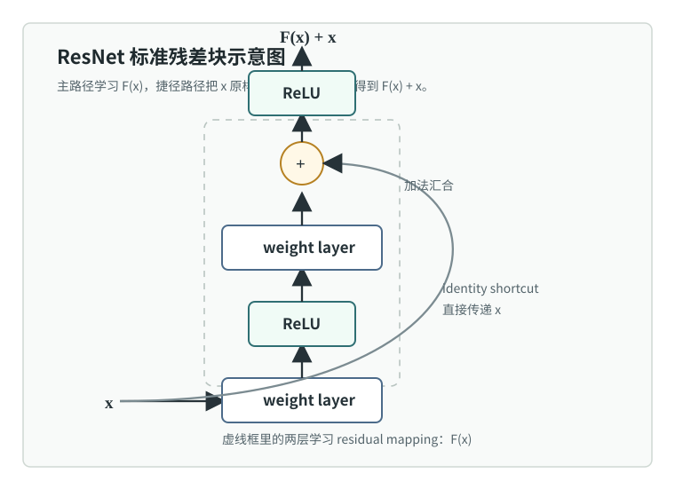
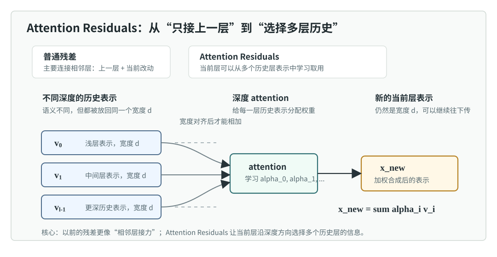

# 普通工科生也能看懂的抽象代数：换个角度看数学

很多人第一次听到“抽象代数”，会以为它是把高中代数、线性代数再往难处推一层：更多符号、更多定义、更多看不出用途的证明。

但这个理解并不准确。

抽象代数真正想做的事情，不是把具体计算变得更复杂，而是换一种视角看数学对象。它关心的不是某个数具体等于多少，也不是某个公式怎样展开，而是：

- 一批对象之间可以做什么操作？
- 这些操作满足什么规则？
- 哪些对象虽然长得不一样，却有相同的规则？
- 哪些变化只是表面变化，背后的规则其实没有变？

这就是抽象代数最核心的主题：结构。

整数、矩阵、多项式、函数、旋转、置换，看起来不像同一种东西。整数可以加减乘除，矩阵可以相乘，函数可以先做一个再做另一个，图形可以旋转，座位可以重新排列。表面上，它们分别属于不同数学分支；但抽象代数会问：如果暂时不看它们的外形，只看“操作规则”，它们之间有没有共同模式？

这就是抽象代数带来的巨大转向。它不是只研究某一种对象，而是研究对象背后的组织方式。它把数学从“算某个东西”推进到“理解一类规则”。

从这个意义上说，抽象代数有一点数学革命的味道：它改变了我们看数学的方式。过去我们容易把整数、矩阵、函数、图形动作分在不同抽屉里；抽象代数却说，先别急着按外表分类，先看它们背后的结构。很多原来看似无关的东西，会突然站到同一张地图上。

这也是为什么抽象代数会显得“抽象”：它故意跳出某个具体分支的框框。在线性代数里我们研究矩阵，在几何里研究旋转，在函数里研究复合，在算术里研究加法和乘法；抽象代数会问，这些地方是不是反复出现了同一种规则。如果是，就应该把这套规则单独拎出来研究。

## 一、换一个角度看数学：从对象看到结构

抽象代数的入口，不是先背“群、环、域”的定义，而是先换一个角度看数学。

我们平时学数学，常常先盯着对象本身：

- 这是一个整数。
- 这是一个矩阵。
- 这是一个多项式。
- 这是一个函数。
- 这是一个几何旋转。

这种看法当然有用。整数有整数的算法，矩阵有矩阵的算法，多项式有多项式的展开方式，函数有函数的求导，也可以先做一个函数再做另一个函数。但抽象代数会往后退一步问：

> 如果暂时不看这些对象长什么样，只看它们能做什么操作，以及这些操作满足什么规律，会发生什么？

这一步就是视角变化。

从这个视角看，整数不只是一个个数，矩阵不只是一个数字表，多项式不只是带着 `x` 的表达式，函数也不只是画在坐标系里的曲线。它们都可以被看成某个系统里的对象；这些对象之间可以做操作；操作又满足一些稳定规律。

这就是抽象代数说的结构。

### 什么是结构

在这一章里，可以先把结构理解成一句话：

> 结构 = 对象集合 + 运算或关系 + 这些运算或关系满足的规则。

这句话有三层意思。

第一，有一批对象。

这些对象可以是整数、实数、矩阵、多项式、函数，也可以是旋转、平移、反射、置换这类操作本身。

第二，这批对象之间有某种运算或关系。

整数可以相加，矩阵可以相乘，函数可以先做一个再做另一个，旋转也可以先做一个再做另一个。比如先旋转 90 度，再旋转 180 度，合起来就是旋转 270 度。

第三，这些运算或关系满足稳定规则。

比如整数加法满足结合律：

$$
(a+b)+c=a+(b+c)
$$

它还存在一个什么都不改变的元素 0：

$$
a+0=a
$$

每个整数也都有一个可以把它抵消回 0 的相反数：

$$
a+(-a)=0
$$

这些公式看起来很简单，但它们说明了一件事：整数在加法下面不是一堆散乱的数字，而是一个有组织的系统。抽象代数关心的，就是这种组织方式。

所以，抽象代数不是把数学变得更玄，而是把注意力从“具体对象是什么”转向“对象之间的结构是什么”。它会问：

- 这里有哪些对象？
- 对象之间允许做什么操作？
- 操作以后是否还留在原来的对象集合里？
- 连续操作时，括号位置是否影响结果？
- 有没有一个什么都不改变的单位元素？
- 一个操作能不能被撤销？

这些问题不是在增加复杂度，而是在帮我们看清楚一个数学系统的骨架。

### 同一批对象，换一种操作，结构就变了

结构不是对象自己天然唯一携带的标签。同一批对象，只要关注的操作不同，就可能形成不同结构。

还是看整数。

如果只看整数加法，那么我们研究的是：

$$
(\mathbb{Z},+)
$$

这里的对象集合是整数 `Z`，关注的运算是加法 `+`。在这个结构里，0 是单位元，每个整数都有加法逆元，任意两个整数相加以后仍然是整数。

但如果同时关心加法和乘法，那么我们研究的是：

$$
(\mathbb{Z},+,\times)
$$

这时问题变得更丰富：我们不只问加法怎样工作，还要问乘法怎样工作，以及加法和乘法之间怎样配合。比如乘法对加法满足分配律：

$$
a(b+c)=ab+ac
$$

所以，结构不是只由对象决定的，还由我们选择关注哪些运算、哪些关系决定。抽象代数不是看到一个集合就结束，而是继续问：这个集合上有什么操作？这些操作共同形成了什么结构？

### 同一个符号，可能对应不同结构

同样叫“乘法”，不代表背后就是同一种结构。

实数乘法、矩阵乘法、多项式乘法、向量点积、向量外积、函数逐点乘法，看起来都用了“乘法”的想法，但它们的对象、算法和结果类型都不同。

函数里还要特别区分两种运算。逐点乘法是：

$$
h(x)=f(x)g(x)
$$

函数复合是：

$$
(g\circ f)(x)=g(f(x))
$$

前者是在同一个输入上把两个函数值相乘，后者是先做一个函数再做另一个函数。它们都是“把两个函数变成一个新函数”，但规则完全不同。

所以结构视角不会只看符号名字。它会追问：这个运算作用在哪些对象上？输出是什么？满足哪些规则？能不能和别的数学对象共享同一套规则？

### 结构视角能解决什么问题

结构视角至少解决三类问题。

第一，它帮助我们避免误用规则。矩阵乘法和实数乘法都写成“乘法”，但实数乘法可以交换顺序，矩阵乘法通常不行。如果只看符号，很容易把不该用的规则搬过去。

第二，它帮助我们发现不同对象的共通处。整数加法、正方形旋转、可逆函数、可逆矩阵来自不同数学分支，但它们都可以出现“可组合、可撤销”的结构。看见这个共通处以后，我们就可以用同一种语言研究它们。

第三，它帮助我们复用推理。只要某个结论只依赖一套结构规则，那么它就不只属于某个具体例子，而可以用于所有满足这套规则的对象。这就是抽象代数真正省力的地方。

这也是结构视角最有冲击力的地方：它让数学不再只是“按对象分科”，而是可以“按结构贯通”。同一套结构一旦被看见，算术、几何、线性代数、函数、机器学习里的变换，都可能被放进同一种语言里讨论。

## 二、抽象代数要寻找什么：不同对象背后的统一性

理解了“结构”以后，就可以说出抽象代数真正想找的东西：统一性。

它不是满足于分别研究整数、矩阵、多项式、函数、旋转、置换，而是问：

> 这些看起来不同的对象，背后有没有同一套结构规则？

如果有，我们就可以用同一种语言研究它们。

这就是抽象代数里的“抽象”二字。抽象不是为了远离具体，而是为了从很多具体例子里提取共同模式。

所以，后面定义“群”“环”“域”这些概念时，真正目的不是给数学增加名字，而是把反复出现的共同结构命名。名字一旦定下来，我们就可以围绕这套结构积累推理，而不是每遇到一个新对象就重新开始。

### 从一个具体例子看统一性

看一个正方形。把它绕中心旋转，可以旋转：

- 0 度
- 90 度
- 180 度
- 270 度

这四个动作做完以后，正方形看起来仍然和原来重合。更重要的是，这些旋转可以组合。

比如：

$$
90^\circ + 180^\circ = 270^\circ
$$

再比如：

$$
270^\circ + 90^\circ = 360^\circ
$$

但旋转 360 度和什么都不做一样，所以它等价于 0 度。

这件事和“模 4 加法”非常像。

这里只关心正方形能和自己重合的四种旋转状态：

$$
0^\circ,\ 90^\circ,\ 180^\circ,\ 270^\circ
$$

把它们分别编号成：

$$
0,\ 1,\ 2,\ 3
$$

这时“旋转 90 度”就相当于“加 1”，“旋转 180 度”就相当于“加 2”。转四次回到原位，对应的就是：

$$
3+1 \equiv 0 \pmod{4}
$$

这和“旋转 270 度以后再旋转 90 度，回到原位”是同一个规则。

所以，正方形的四个旋转动作和模 4 加法，虽然一个来自几何，一个来自算术，但背后的结构是相同的。抽象代数关心的正是这种相同。

它不满足于说“这两个东西有点像”。它要给出精确语言：

- 什么叫两个结构相同？
- 什么叫运算规则被保留？
- 什么叫一个结构只是换了一种表示？
- 什么叫不同对象本质上遵守同一套规则？

这就是后面要讲的同态和同构。

### 一个统一结构的例子：群

再看一批更广的例子：

- 整数在加法下
- 非零实数在乘法下
- 可逆函数在“先做一个函数，再做另一个函数”下
- 正方形旋转在连续旋转下
- 重新排列在连续重排下
- 可逆矩阵在矩阵乘法下

这些对象表面上分属算术、函数、几何、集合和线性代数，但它们有一个共同模式：两个操作合起来仍然合法，连续做三个或更多操作时可以重新分组，有一个什么都不做的元素，每个操作都可以撤销。

> 满足这套规则的结构，就叫群。

这里先不展开群论，只看它的意义：群把很多分散现象放进同一个框架里。整数加法、正方形旋转、可逆函数、可逆矩阵不再是互不相干的例子，而是共享一套“可组合、可撤销”的结构规则。

共同规则说明统一性，额外差异说明结构还可以继续细分。比如整数加法可以交换顺序，可逆矩阵乘法通常不可以；它们都可以是群，但不是完全一样的群。

所以抽象代数的视角可以概括成一句话：

> 不先问对象长什么样，而先问它们遵守什么结构；不只看一个例子怎么计算，而要找出许多例子背后的同一套规则。

## 三、从集合、运算与关系搭出结构

前面一直在说结构：

> 结构 = 对象集合 + 运算或关系 + 这些运算或关系满足的规则。

这一节就按这个顺序把这句话拆开。抽象代数后面会讲群、环、域、同态、商结构，但它们都离不开几个最底层的概念：集合、运算、关系，以及这些运算或关系满足的规则。

这几个词看起来很基础，但它们决定了后面所有代数结构到底是在什么对象上建立的。

换句话说，这一节不是在补符号常识，而是在拆开“结构”这台机器的零件。集合规定对象范围，运算和关系规定对象之间怎样连接，规则决定这些连接能不能形成一种稳定结构。

### 集合：先说清楚对象是谁

集合就是一批对象放在一起。

比如：

$$
\mathbb{Z}=\{\ldots,-2,-1,0,1,2,\ldots\}
$$

表示所有整数。

再比如：

$$
\mathbb{R}
$$

表示所有实数。

还可以有更具体的集合：

$$
S=\{\text{红},\text{蓝},\text{绿}\}
$$

或者：

$$
R=\{0^\circ,90^\circ,180^\circ,270^\circ\}
$$

这里 `R` 可以表示正方形绕中心旋转后仍然和自己重合的四种旋转。

集合本身只回答一个问题：

> 哪些对象在我们的讨论范围内？

这一步很重要。因为一个运算能不能做、做完以后结果是否合法，都要看结果是否还留在这个集合里。

比如在整数集合里：

$$
2+3=5
$$

结果还是整数。

但：

$$
2\div 3=\frac{2}{3}
$$

结果不是整数。

所以，如果我们只在整数集合里讨论，普通除法就不是一个总能留在整数里的运算。

这就是为什么抽象代数总要先说清楚“在哪个集合上”。

### 元素：集合里的单个对象

集合里的单个对象叫元素。

如果 `a` 是集合 `S` 里的元素，就写成：

$$
a\in S
$$

如果 `a` 不在集合 `S` 里，就写成：

$$
a\notin S
$$

比如：

$$
3\in\mathbb{Z}
$$

但：

$$
\frac{1}{2}\notin\mathbb{Z}
$$

这些符号本身不难。真正重要的是：以后我们说“在某个集合上定义运算”，意思就是这个运算的输入和输出都要围绕这个集合来判断。

### 运算：把对象组合成对象

集合说清楚对象是谁以后，下一步就可以问：这些对象之间能不能组合？

运算是在生成新对象。

比如整数加法：

$$
2+3=5
$$

输入两个整数，输出一个整数。

矩阵乘法也是运算。输入两个矩阵，输出一个矩阵。

函数也可以有运算，但这里要分清两种常见情况。

一种是函数的逐点乘法。给两个函数 `f` 和 `g`，可以定义一个新函数 `h`：

$$
h(x)=f(x)g(x)
$$

这时我们是在同一个输入 `x` 上分别算 `f(x)` 和 `g(x)`，再把两个数相乘。

另一种是函数复合，也就是先做一个函数，再做另一个函数：

$$
(g\circ f)(x)=g(f(x))
$$

这里输入两个函数 $f$ 和 $g$，输出一个新函数 $g\circ f$。它和逐点乘法不是一回事。

还可以沿用前面的彩色球例子，但这次集合里放的不是彩色球本身，而是彩色球的重新排列方式。比如有三个位置：

$$
(\text{红球},\text{蓝球},\text{绿球})
$$

一次操作可以是“交换红球和蓝球”，也可以是“交换蓝球和绿球”。把所有可能的重新排列方式放在一起，得到一个集合。这个集合里的元素不是球，而是“怎样重排这些球”的操作。

现在定义运算 `*`：

> A * B 表示先做重排 A，再做重排 B。

比如：

$$
A=\text{交换红球和蓝球}
$$

$$
B=\text{交换蓝球和绿球}
$$

那么 `A * B` 就是一个新的重排操作：先交换红球和蓝球，再交换蓝球和绿球。它的结果仍然是一种重新排列方式。

这里的 `*` 不是普通乘法，而是“连续执行两个重排操作”。关键不在于对象是不是数字，而在于规则是否明确：给定两个输入，输出能不能被确定下来，并且输出是否还在同一个集合里。

在抽象代数里，最常见的是二元运算。所谓二元运算，就是一次吃进两个对象，吐出一个对象。

可以写成：

$$
*:S\times S\to S
$$

这句话的意思是：

- 输入来自集合 `S` 的两个元素。
- 用某种规则 `*` 把它们组合起来。
- 输出仍然是集合 `S` 里的一个元素。

比如整数加法可以看成一个函数：

$$
add: ℤ × ℤ → ℤ
$$

意思是两个整数相加，结果还是整数。

这里把加法临时叫作 `add`，是为了强调：加法不是天上掉下来的符号，它也是一个有输入、有输出的规则。

### 封闭性：结果必须留在集合里

二元运算最先要检查的是封闭性。

如果我们说在集合 `S` 上定义了一个运算 `*`，通常意味着：

$$
a,b\in S \quad\Rightarrow\quad a*b\in S
$$

这就是说：只要输入在集合里，输出也必须在集合里。

整数加法满足封闭性：

$$
2,3\in\mathbb{Z},\quad 2+3=5\in\mathbb{Z}
$$

整数乘法也满足封闭性：

$$
2\cdot 3=6\in\mathbb{Z}
$$

但整数除法不满足封闭性：

$$
2,3\in\mathbb{Z},\quad 2\div 3=\frac{2}{3}\notin\mathbb{Z}
$$

所以，普通除法不是整数集合上的二元运算。

这个判断非常关键。很多时候，一个操作在更大的集合里合法，在更小的集合里就不合法。

比如：

- 在实数里，非零数可以相除。
- 在整数里，很多除法结果会跑到整数外面。
- 在可逆矩阵里，两个可逆矩阵相乘仍然可逆。
- 但两个任意矩阵相乘以后，不一定可逆。

所以抽象代数总是先问：

> 这个运算到底定义在哪个集合上？做完以后还留在这个集合里吗？

### 运算规则：结构从这里开始出现

有了集合和运算以后，结构就开始出现了。

但仅仅有运算还不够。我们还要问这个运算满足哪些规则。

比如：

- 是否满足结合律？
- 是否满足交换律？
- 有没有单位元？
- 每个元素有没有逆元？
- 如果有两个运算，它们之间是否满足分配律？

这些规则决定了这个结构到底是哪一类结构。

如果一个集合上有一个运算，并且满足封闭性、结合律、单位元、逆元，那么它就是群。

如果它还有第二个运算，并且两个运算像加法和乘法那样配合起来，就会走向环和域。

### 关系：对象之间是否满足某种判断

除了运算，集合上的对象之间还可以有关系。

运算是在生成新对象，关系则是在判断两个对象是否满足某个条件。

比如：

$$
2+3=5
$$

这是运算。

而：

$$
2<3
$$

这是关系。

再比如在整数里，可以定义一个关系：

> `a` 和 `b` 有相同的奇偶性。

这就是说：

- 2 和 4 有关系，因为它们都是偶数。
- 3 和 7 有关系，因为它们都是奇数。
- 2 和 3 没有关系，因为一个是偶数，一个是奇数。

在平面上的点之间可以定义“距离小于 1”的关系；在集合之间可以定义“包含于”的关系；在向量之间可以定义“垂直”的关系。

关系的作用是帮助我们把对象组织起来。后面讲商结构时，最重要的一类关系就是等价关系。

### 等价关系：把对象分成一类一类

等价关系可以理解成一种“看作同类”的规则。

比如整数里，我们可以说：

> 如果两个整数除以 4 的余数相同，就把它们看作同类。

这样：

$$
1,5,9,13,\ldots
$$

属于同一类，因为它们除以 4 都余 1。

同样：

$$
0,4,8,12,\ldots
$$

属于同一类，因为它们除以 4 都余 0。

这就是模 4 的基本直觉。我们不再关心两个整数具体差多少，而是只关心它们除以 4 的余数是否一样。

一个关系要成为等价关系，通常要满足三件事。

#### 自反性

每个对象都和自己等价。

比如任何整数和自己除以 4 的余数当然一样。

#### 对称性

如果 `a` 和 `b` 等价，那么 `b` 和 `a` 也等价。

比如 1 和 5 除以 4 的余数一样，那么 5 和 1 除以 4 的余数也一样。

#### 传递性

如果 `a` 和 `b` 等价，`b` 和 `c` 等价，那么 `a` 和 `c` 也等价。

比如 1、5、9 除以 4 都余 1，所以它们都在同一类里。

等价关系的作用，是把一个集合切成若干个互不重叠的类。每个类里放的是“按照某个标准看起来一样”的对象。

这件事很重要。抽象代数里很多结构，都是从“把某些差异忽略掉”开始的。模运算就是最简单的例子：它忽略具体整数大小，只保留余数结构。

所以，集合、运算和关系不是抽象代数的“预备废话”。它们是在搭地基：

- 集合决定对象范围。
- 运算决定对象怎样组合。
- 运算规则决定对象组合以后形成什么结构。
- 关系决定对象之间怎样比较或归类。
- 等价关系决定怎样把对象分成同类。

理解了这些，后面再看群、环、域，就不会觉得是在背一堆凭空出现的定义。

## 四、群：描述可逆操作的语言

前面已经见过群的雏形：

> 满足封闭性、结合律、单位元、逆元这套规则的结构，就叫群。

现在正式把它说清楚。

群不是一种具体对象，而是一种结构。它可以出现在整数里，也可以出现在旋转里、函数里、矩阵里、重新排列里。只要一批对象配上一种运算，并且满足同一套规则，我们就可以用“群”这个词来描述它。

群特别适合描述对称性、变换、置换和可逆操作，是因为这些例子里的“对象”常常不是静止的东西，而是一个个可以执行的动作：

- 旋转正方形，是一种几何变换。
- 重新排列一组元素，是一种置换。
- 从 X 到 X 的可逆函数，是一种把对象搬到另一个位置、又能搬回来的变换。
- 可逆矩阵，是线性空间里的可逆线性变换。

这些动作都可以连续执行。先做一个动作，再做另一个动作，仍然得到一个同类动作；什么都不做，是单位元；每个动作如果能被撤销，就有逆元。所以群抓住的不是对象长什么样，而是：

> 一批可连续执行、可保持在同一系统内、并且可撤销的操作，整体遵守什么规则？

这也是为什么群会成为描述对称性的语言。一个图形的对称性，就是那些做完以后图形看起来没有变的可逆变换；所有这些变换放在一起，通常就形成一个群。

### 群的正式定义

一个群通常记作：

$$
(G,*)
$$

这里 `G` 是对象集合，`*` 是定义在 `G` 上的运算。

如果它满足下面四条规则，就叫群。

#### 封闭性

任意两个元素 `a,b` 都在 `G` 里时，它们运算后的结果也在 `G` 里：

$$
a,b\in G \quad\Rightarrow\quad a*b\in G
$$

也就是说，运算不会把我们带出这个集合。

#### 结合律

任意三个元素 `a,b,c` 都在 `G` 里时：

$$
(a*b)*c=a*(b*c)
$$

也就是说，连续做三次运算时，括号怎么放不影响结果。

#### 单位元

集合里存在一个特殊元素 `e`，它和任何元素运算，都不改变那个元素：

$$
e*a=a
$$

并且：

$$
a*e=a
$$

这个 `e` 叫单位元。

不同群里的单位元长得不一样。整数加法里的单位元是 0，非零实数乘法里的单位元是 1，矩阵乘法里的单位元是单位矩阵。

#### 逆元

对每个元素 $a$，都能找到一个元素 $a^{-1}$，使得它们运算后回到单位元：

$$
a*a^{-1}=e
$$

并且：

$$
a^{-1}*a=e
$$

这个 $a^{-1}$ 叫 $a$ 的逆元。

这里的写法 $a^{-1}$ 不一定表示普通倒数。它只是表示“能把 $a$ 撤销掉的对象”。在整数加法里，$a$ 的逆元不是 $1/a$，而是 $-a$，因为：

$$
a+(-a)=0
$$

如果运算是普通乘法，就要特别注意 0。0 不能放进乘法群里，因为乘法群的单位元是 1，而不存在任何数 $b$ 使得：

$$
0\cdot b=1
$$

所以我们说“非零实数在乘法下是群”，写成：

$$
(\mathbb{R}\setminus\{0\},\times)
$$

而不是说“所有实数在乘法下是群”。这不是因为 0 很特殊所以被随便踢出去，而是因为它没有乘法逆元，无法满足群的第四条规则。

注意，这四条规则里没有要求：

$$
a*b=b*a
$$

也就是说，群不一定要求交换律。原因是很多重要结构本来就不交换，比如矩阵乘法、函数复合、空间变换的连续执行。它们仍然有封闭性、结合律、单位元和逆元，所以应该被群这个概念包括进来。

如果一个群额外满足交换律，才叫交换群，也叫阿贝尔群。可以把关系理解成：

> 阿贝尔群是群的一种特殊情况，不是群的默认要求。

### 怎么判断一个结构是不是群

判断一个结构是不是群，要先看它写成什么样。像 $(G,*)$ 这样的记号，前半部分 $G$ 是对象集合，后半部分 $*$ 是这批对象上的运算。

所以 $(\mathbb{Z},+)$ 的意思是：整数集合 $\mathbb{Z}$，在加法 $+$ 下形成的结构。$(\mathbb{R}\setminus\{0\},\times)$ 的意思是：去掉 0 的实数集合，在乘法 $\times$ 下形成的结构。

接下来检查四件事：

- 集合是什么？
- 运算是什么？
- 是否满足封闭性、结合律、单位元、逆元？
- 是否额外满足交换律？注意，重新分组不是交换顺序，交换律不是群的必需条件。

几个例子可以放在一起看：

- $(\mathbb{Z},+)$ 是群：整数相加仍是整数，加法满足结合律，0 是单位元，$a$ 的逆元是 $-a$。
- $(\mathbb{R}\setminus\{0\},\times)$ 是群：非零实数相乘仍是非零实数，乘法满足结合律，1 是单位元，$a$ 的逆元是 $1/a$。
- 可逆函数在函数复合下是群：两个可逆函数复合仍然可逆，函数复合满足结合律，恒等函数 $\operatorname{id}(x)=x$ 是单位元，反函数是逆元。
- 正方形旋转在连续旋转下是群：两个保持正方形重合的旋转连续做，结果仍然是这四种旋转之一；不旋转是单位元；每个旋转都可以反向转回来。
- 重新排列在连续重排下是群：两个重排连续做，结果仍然是一种重排；什么都不换是单位元；每个重排都可以反向恢复。
- 可逆矩阵在矩阵乘法下是群：两个可逆矩阵相乘仍然可逆，矩阵乘法满足结合律，单位矩阵 $I$ 是单位元，逆矩阵 $A^{-1}$ 是逆元。

一个典型反例是：

$$
(\mathbb{Z},\times)
$$

它不是群。虽然整数乘法有封闭性、结合律和单位元 1，但大多数整数没有乘法逆元。比如 2 的乘法逆元应该是 $1/2$，而 $1/2$ 不在整数集合里。

所以群可以先理解成：

> 一套可以连续执行、可以撤销、并且不会跑出系统外的操作。

这个直觉比死背定义更重要。后面讲子群、循环群、置换群和群作用时，都是在研究这种“可撤销操作系统”的内部结构。

### 为什么要定义群

到这里，读者很自然会问：为什么非要把这四条规则打包起来，专门起名叫“群”？

更好的理解方式是：**一旦我们认出某个东西是群，群结构会反过来逼出一些规则**。

先看两个最朴素的例子。

整数在加法下是群。两个整数相加还是整数；加法满足结合律；0 是单位元；每个整数 $a$ 都有相反数 $-a$。

非零实数在乘法下也是群。两个非零实数相乘还是非零实数；乘法满足结合律；1 是单位元；每个非零实数 $a$ 都有倒数 $1/a$。

这两个例子一个叫“加法”，一个叫“乘法”，但它们在群的视角下做的是同一件事：都在描述一套可以连续执行、可以撤销、并且不会跑出原系统的运算。

这就说明，群不是只属于某一种具体运算。它研究的是运算背后的共同结构。

看一个更有感觉的游戏例子：2x2x2 魔方。

2x2x2 魔方没有中心块和棱块，只有 8 个角块。我们可以先不管颜色好不好看，而是把它当成一个有限状态系统：

$$
\Omega=\{\text{所有能够从复原状态通过合法转动到达的 2x2x2 状态}\}
$$

每个状态可以粗略写成两部分：

$$
(\pi,o)
$$

其中 $\pi$ 记录 8 个角块分别被搬到了哪个位置，$o$ 记录每个角块的朝向。

接下来要定义“操作”。对 2x2x2 魔方来说，最自然的基本操作是转某一个面。按六个面来记，通常有：

- $U$：转上面。
- $D$：转下面。
- $R$：转右面。
- $L$：转左面。
- $F$：转前面。
- $B$：转后面。

每个面都可以顺时针转 $90^\circ$、逆时针转 $90^\circ$，或者转 $180^\circ$。所以如果把这些都当成一步操作，常见的基本转动一共有 18 个：

$$
U,U^{-1},U^2,\quad
D,D^{-1},D^2,\quad
R,R^{-1},R^2,\quad
L,L^{-1},L^2,\quad
F,F^{-1},F^2,\quad
B,B^{-1},B^2
$$

这里的 $U^{-1}$ 表示“反方向转上面一次”，也常写成 $U'$。$U^2$ 表示连续转两次上面，也就是转 $180^\circ$。注意 $U^2$ 的逆操作还是它自己：

$$
(U^2)^{-1}=U^2
$$

因为转两次以后，再转两次，就等于转满一圈回到原状。

这些基本转动之间的逆操作可以逐个配对：

$$
U^{-1}\leftrightarrow U,\quad
D^{-1}\leftrightarrow D,\quad
R^{-1}\leftrightarrow R,\quad
L^{-1}\leftrightarrow L,\quad
F^{-1}\leftrightarrow F,\quad
B^{-1}\leftrightarrow B
$$

而每个半圈操作都是自己的逆元：

$$
(U^2)^{-1}=U^2,\quad (D^2)^{-1}=D^2,\quad (R^2)^{-1}=R^2,\quad
(L^2)^{-1}=L^2,\quad (F^2)^{-1}=F^2,\quad (B^2)^{-1}=B^2
$$

不过，做群论建模时，选择哪些操作作为“基本操作”本身也是一种约定。如果只选六个顺时针转动 $U,D,R,L,F,B$，它们已经能生成逆时针转动和半圈转动，因为 $U^{-1}=U^3$，$U^2=UU$，其他面也一样。如果把 18 个都当成一步操作，得到的是另一种常见的“步数”定义。

下面把这 18 个一步转动记成一个移动集合：

$$
M=\{U,U^{-1},U^2,D,D^{-1},D^2,R,R^{-1},R^2,L,L^{-1},L^2,F,F^{-1},F^2,B,B^{-1},B^2\}
$$

一次转动，比如转上层 $U$、转右层 $R$、转前层 $F$，就是一个函数：

$$
U:\Omega\to\Omega,\qquad R:\Omega\to\Omega,\qquad F:\Omega\to\Omega
$$

它们把一个魔方状态变成另一个魔方状态。连续做两步，就是函数复合。比如：

$$
RU
$$

表示先做 $R$，再做 $U$。这里最像矩阵乘法的地方来了：**魔方操作一般不满足交换律**。

$$
RU\ne UR
$$

先转右面再转上面，和先转上面再转右面，最后角块的位置通常不同。这和矩阵乘法里的

$$
AB\ne BA
$$

是同一种警告：符号都像“乘法”，但顺序不能随便换。

现在把所有能由这些基本转动生成的操作放在一起：

$$
G=\langle M\rangle
$$

这里的 $G$ 不是状态集合本身，而是“所有合法操作”的集合。一个元素可能是 $R$，也可能是 $RUR^{-1}F$ 这样一整串公式。$M$ 里的动作是一步操作，$G$ 里的元素则可以是任意长的操作串。它们的运算是连续执行：

$$
A*B=\text{先做 }A\text{，再做 }B
$$

检查这套结构：

- 封闭性：两串合法操作连续做，合起来仍然是一串合法操作。
- 结合律：$(AB)C=A(BC)$。括号只是改变“怎么打包”，不改变真实执行顺序。
- 单位元：什么都不做，记作 $e$。
- 逆元：每一步都能反向做，所以每一串操作都能撤销。

所以 2x2x2 魔方的合法操作在“连续执行”下组成一个群。到这里，“群”已经不是一个名字，而是把智力游戏变成了可以推理的结构。

这里用 2x2x2 魔方，是为了让状态描述简单一点；下面这些关于操作、撤销和公式搬运的想法，对一般魔方同样适用。

最直接的一条是：**任何合法打乱都可以撤销**。如果一个打乱是：

$$
S=RUF
$$

那么求解它不需要神秘直觉。它的一个求解公式就是：

$$
S^{-1}=F^{-1}U^{-1}R^{-1}
$$

也就是先撤销最后一步，再撤销前一步。这不是魔方口诀，而是群的一般规则：

$$
(ABC)^{-1}=C^{-1}B^{-1}A^{-1}
$$

如果打乱过程不知道，只看到一个打乱后的状态，想找“最短解”，那已经是状态图上的最短路径问题。这个问题当然重要，但它的核心是图搜索。群论在这里要说的是另一件事：操作怎样组合、怎样撤销、公式怎样相乘。

群还会逼出消去律。这个名字听起来抽象，其实意思很朴素。

假设有两套魔方公式，并且它们是从同一个起始状态开始比较的。两套公式一开始都先做同一串操作 $A$；然后第一套接着做一串操作 $B$，第二套接着做另一串操作 $C$。如果这两套公式最后对魔方造成的效果完全一样，就可以写成：

$$
AB=AC
$$

现在问题是：能不能说 $B$ 和 $C$ 本来就是同一个效果？

可以。关键不是交换顺序，而是 $A$ 能撤销。因为 $A$ 有逆操作 $A^{-1}$，我们在两套公式前面都先接上 $A^{-1}$：

$$
A^{-1}AB=A^{-1}AC
$$

左边的 $A^{-1}A$ 会互相抵消，右边也一样，于是得到：

$$
B=C
$$

这就是消去律。它说的是：如果两个公式从同一个起始状态出发，有同一个开头，而且最终效果一样，那么这个共同开头不是差异来源，可以撤销掉，真正要比较的是后面两串操作 $B$ 和 $C$。整个过程没有交换 $A,B,C$ 的顺序，所以不需要交换律。

从群的角度看魔方，还有一个非常实用的公式模板：**把目标块临时搬到工作区，处理，再搬回原来的视角**。

先想象你手里有一个已经会用的小公式 $A$。这个公式只在某个固定的“工作区”好用：比如它会改变工作区里的几个块，而其他位置最后会恢复原样。

问题是，真实魔方里，你想改的块不一定正好在这个工作区里。

所以这里的“搬过去，处理，搬回来”不是说最后要交换工作区那几个固定位置上的块。工作区只是临时舞台；真正想处理的是魔方原来位置上的那几个目标块。

怎么办？做三步：

第一步，做一串操作 $P$，把目标块临时带到工作区。

第二步，做公式 $A$，让 $A$ 在工作区里完成它本来会做的事情。

第三步，做 $P^{-1}$，把第一步造成的临时搬动撤销。

整串公式就是：

$$
PAP^{-1}
$$

最后真正被改变的，是魔方原来位置上的那些目标块。于是，从最终效果看，就像同一个公式 $A$ 被搬到了目标块原本所在的位置使用。

这叫共轭。它的核心意思是：用 $P$ 改变公式 $A$ 的作用位置，再用 $P^{-1}$ 撤销这次临时改变，只留下 $A$ 对目标块产生的效果。

所以群视角下，魔方公式不是一堆要死背的动作，而是在利用几件很清楚的事：

- 非交换性：像矩阵乘法一样，操作顺序携带信息。
- 逆操作：把影响撤销，得到求解公式 $S^{-1}$。
- 共轭：把局部技巧临时搬到目标块所在的位置使用。

这就是定义群的意义：我们先证明某个具体系统满足群的四条规则，然后就能把群的一般结论搬进来。魔方里的“合法打乱一定能按反向步骤撤销”“共同前缀可以消去”“共轭能把一个公式搬到新的目标位置使用”，不是临时发明的技巧，而是所有群都共享的结构规则在魔方里的具体表现。

所以，群这个概念的意义不是“多背一个定义”，而是让我们有能力说：

> 我找到了一个结构；既然它是群，那么群的一般规则就会在这个具体系统里自动生效。

这就是抽象代数的革命性：它不满足于问“这个东西怎么算”，而是进一步问“这个系统允许哪些变换，哪些关系会被保留下来”。一旦这样看，很多数学对象就不再是孤立知识点，而是同一种结构在不同场景里的出现。

### 先记住几类常见的群

这里不需要一次性展开所有群论概念，但可以先记住三个最常见的名字：交换群、置换群和循环群。更重要的是，要知道它们各自在帮我们回答什么问题：有的群描述“加法式的结构”，有的群描述“对象被重新排列”，有的群描述“重复同一个操作”。

**交换群**，也叫阿贝尔群，指的是运算可以交换顺序的群：

$$
ab=ba
$$

最简单的例子是整数加法。你先加 2 再加 3，和先加 3 再加 2，结果一样：

$$
2+3=3+2
$$

所以整数在加法下是交换群。魔方操作通常不是交换群，因为先转右面再转上面，和先转上面再转右面，结果通常不同。

**置换群**，研究的是“重新排列”的群。最简单的例子是三个座位上的三个人：把第一个人换到第二个座位，把第二个人换到第三个座位，把第三个人换到第一个座位，这就是一次置换。所有这类重新排列，在“先重排一次，再重排一次”下组成群。魔方操作本质上也带有很强的置换味道：每次转动都会重新安排角块、棱块的位置，同时还会改变它们的朝向。

**循环群**，研究的是“重复做同一个操作”会产生什么结构。最简单的例子是时钟：每次把指针往前拨 1 小时，拨 12 次就回到原位。这个“反复拨 1 小时”的结构就是循环群。再比如把圆等分成 $n$ 份，每次旋转 $\frac{360^\circ}{n}$，连续旋转 $n$ 次也会回到原位，这 $n$ 个旋转操作组成一个循环群，通常记作 $C_n$。

传统抽象代数之所以很重视这三类群，是因为它们代表了群论的几条主线。

交换群代表“像加法一样”的世界，置换群代表“可逆重排”的世界，循环群代表“周期重复”的世界。它们不是孤立例子：一个让我们看到群怎样抽象加法，一个让我们看到群怎样描述重排，一个让我们看到群怎样描述周期。抽象代数都讲，是为了让读者意识到：群既能统一算术，也能统一对称和变换。

现在只要抓住区别就够了：交换群强调“能不能换顺序”，置换群强调“对象怎样被重新排列”，循环群强调“重复一个操作”。下一节会继续讲子群、生成元、同态、商群和群作用。

## 五、群论：继续研究“可撤销操作系统”

前面已经知道，群是一批对象配上一种运算，并且满足封闭性、结合律、单位元和逆元。

但真正的群论不会停在“判断它是不是群”。判断只是入口。接下来更重要的问题是：

- 一个大群里面有哪些小群？
- 一个群能不能由少数几个元素生成？
- 两个看起来不同的群，本质上是不是同一个结构？
- 一个群怎样作用到图形、集合或数据上？
- 能不能把一个复杂的群压缩成更简单的群？

这些问题，就是群论真正开始的地方。

### 子群：大群里面的小群

如果一个群 $G$ 里面有一部分元素，自己拿出来以后仍然能组成一个群，这一部分就叫 $G$ 的**子群**。

比如整数加法群：

$$
(\mathbb{Z},+)
$$

里面的所有偶数：

$$
2\mathbb{Z}=\{\ldots,-4,-2,0,2,4,\ldots\}
$$

在加法下也是一个群。

因为：

- 两个偶数相加还是偶数。
- 加法满足结合律。
- 0 是偶数，也是单位元。
- 一个偶数的相反数还是偶数。

所以 $(2\mathbb{Z},+)$ 是 $(\mathbb{Z},+)$ 的子群。

这说明子群不是随便挑几个元素，而是要挑出一个“内部仍然完整”的小系统。它继承了大群的运算，但自己也必须封闭、能撤销、有单位元。

反过来，所有奇数就不是 $\mathbb{Z}$ 的子群。因为两个奇数相加会变成偶数：

$$
1+3=4
$$

结果跑出了奇数集合，封闭性已经失败了。所以子群不是“从群里随便挑一部分”，而是要挑出一个运算后仍然留在内部的小系统。

子群有两个重要作用。第一，它是大群里面一个仍然完整的小系统。第二，它可以拿来给大群分组：如果两个元素之间的差异刚好落在这个子群里，我们就可以把它们看成同一类。后面讲陪集时，用的就是第二个作用。

### 生成元：少数动作生成整个群

很多群虽然元素很多，但不一定需要把每个元素都单独列出来。我们常常只需要少数几个基本元素，然后反复使用群里的运算，就能得到这个群的所有元素。

这些基本元素叫**生成元**。

比如整数加法群 $\mathbb{Z}$ 可以由 1 生成：

$$
\ldots,\ -3,\ -2,\ -1,\ 0,\ 1,\ 2,\ 3,\ \ldots
$$

都可以通过反复加 1 或反复加 $-1$ 得到。

所以可以写成：

$$
\mathbb{Z}=\langle 1\rangle
$$

这里的尖括号 $\langle 1\rangle$ 表示“由 1 生成出来的所有群元素”。在整数加法群里，这些元素就是所有整数。

魔方这里也可以换一种说法：把群元素看成“所有从复原状态出发能够到达的合法状态”。这时每个合法状态都对应一种“从复原态到这个状态的操作效果”。基本转动 $U,D,R,L,F,B$ 反复组合，就能到达所有合法状态。

如果强调操作视角，就说基本转动生成所有合法操作串；如果强调状态视角，就说基本转动生成所有合法状态。两种说法背后是同一件事：每个合法状态都可以看成某个合法操作作用在复原状态上的结果。

所以生成元的思想是：

> 不必列出群里的所有元素，只要找出能通过群运算产生它们的基本元素。

### 循环群：一个生成元就够了

如果一个群只靠一个元素就能生成，这个群就叫**循环群**。所以整数加法群 $(\mathbb{Z},+)$ 也是循环群，因为它由 1 生成：

$$
\mathbb{Z}=\langle 1\rangle
$$

这里要注意：循环群不一定是有限的。“循环”说的是由同一个元素不断重复生成，而不是一定真的绕一圈回到起点。整数加法群就是无限循环群。

有限循环群的例子是时钟。每次往前拨 1 小时：

$$
0\to 1\to 2\to \cdots \to 11\to 0
$$

拨 12 次以后回到原位。所有状态都由“往前拨 1 小时”这个动作反复得到，所以它是循环群。

模 $n$ 加法也是循环群：

$$
\mathbb{Z}/n\mathbb{Z}
$$

可以理解成只看余数：

$$
0,1,2,\ldots,n-1
$$

每次加 1，走完一圈又回到 0。

圆的 $n$ 等分旋转也一样。每次旋转 $\frac{360^\circ}{n}$，连续旋转 $n$ 次回到原位。这和模 $n$ 加法背后是同一个循环结构。

循环群重要，是因为它把“周期”这件事说清楚了：一个动作反复做，会经过哪些状态？什么时候回到起点？中间有没有提前重复？

### 置换群：研究重新排列

置换群研究的是对象怎样被重新排列。

比如有三个位置：

$$
(1,2,3)
$$

一次置换可以把它们变成：

$$
(2,3,1)
$$

意思是原来第 1 个位置的东西去了第 2 个位置，原来第 2 个位置的东西去了第 3 个位置，原来第 3 个位置的东西去了第 1 个位置。

所有三个对象的重新排列一共有 6 种。这 6 种置换在“先做一个重排，再做另一个重排”下组成一个群，叫 $S_3$。

置换群非常重要，因为很多群都可以看成“某种重新排列”。魔方每转一步，本质上就是在重新安排块的位置和朝向；矩阵换基也可以看成坐标表达的重排；程序里的变量重命名、图上的节点重编号，也都有置换的味道。

所以置换群给我们一种很具体的想法：

> 群不只是抽象符号，它常常就是一批可逆的重新排列。

### 同态与同构：结构怎样被保留

群论不只研究一个群内部怎样运转，也研究两个群之间怎样对应。

一个对应如果只是把元素随便配对，那没有太大意义。群论真正关心的是：这个对应有没有把运算规则一起带过去。

**同态**说的就是这种情况：

> 把原群里的元素对应到另一个群里，而且这个对应保留运算规则。

也就是说，对任意两个元素，都要满足：

> 先在原群里运算，再对应过去；和先分别对应过去，再在新群里运算，结果一样。

看一个例子。

原来的群是整数加法群：

$$
(\mathbb{Z},+)
$$

元素是所有整数，运算是普通加法。

新的群是模 4 加法群：

$$
(\mathbb{Z}/4\mathbb{Z},+)
$$

元素可以先粗略理解成四种余数：

$$
0,1,2,3
$$

运算是“先加起来，再看除以 4 的余数”。比如：

$$
3+2\equiv 1\pmod 4
$$

现在定义一个对应：

> 每个整数对应到它除以 4 的余数。

比如：

$$
7\mapsto 3,\qquad 10\mapsto 2
$$

因为 7 除以 4 余 3，10 除以 4 余 2。

现在检查这个对应有没有保留加法。

第一条路：先在整数里加，再取余数。

$$
7+10=17,\qquad 17\text{ 除以 }4\text{ 余 }1
$$

第二条路：先分别取余数，再在模 4 里加。

$$
7\mapsto 3,\qquad 10\mapsto 2,\qquad 3+2=5,\qquad 5\text{ 除以 }4\text{ 余 }1
$$

两条路都得到 1。

这不是只对 7 和 10 碰巧成立。对任意两个整数 $a,b$，都有：

$$
(a+b)\text{ 的余数 }=(a\text{ 的余数 }+b\text{ 的余数})\text{ 的余数}
$$

所以“取模 4”这个对应保留了加法结构。它就是一个群同态。

但是这个同态会丢信息：

$$
1\mapsto 1,\qquad 5\mapsto 1,\qquad 9\mapsto 1
$$

对应以后，你分不清原来是 1、5 还是 9。

所以，同态只要求“运算规则被保留”，不要求信息完全保留。

**同构**比同态更强。

同构要求两件事：

- 运算规则被保留。
- 信息不丢失，也就是两边元素能一一对应。

比如正方形旋转群和模 4 加法群就是同构的。

正方形有四种保持重合的旋转：

$$
0^\circ,\ 90^\circ,\ 180^\circ,\ 270^\circ
$$

模 4 加法群有四个元素：

$$
0,\ 1,\ 2,\ 3
$$

我们把它们对应起来：

$$
0^\circ\leftrightarrow 0,\qquad
90^\circ\leftrightarrow 1,\qquad
180^\circ\leftrightarrow 2,\qquad
270^\circ\leftrightarrow 3
$$

这个对应不丢信息：每个旋转对应唯一的数字，每个数字也对应唯一的旋转。

它也保留运算。比如：

$$
90^\circ+180^\circ=270^\circ
$$

对应到数字就是：

$$
1+2\equiv 3\pmod 4
$$

再比如：

$$
270^\circ+90^\circ=360^\circ
$$

转满一圈等于回到原位，对应数字 0；模 4 里也有：

$$
3+1\equiv 0\pmod 4
$$

所以这两个群虽然长得不一样，一个像几何旋转，一个像余数加法，但它们的结构完全一样。这种关系就叫同构。

可以把区别记成一句话：

> 同态保留运算，但可能丢信息；同构保留运算，而且不丢信息。

### 陪集与商群：把群压缩成更粗的结构

有时候，一个群给的信息太细。我们不想区分每个元素，而是想故意忽略一部分差异，把很多元素看成同一类。

这时子群就派上用场了。子群可以告诉我们：哪些差异可以忽略。

最熟悉的例子还是整数。

假设我们现在只关心“除以 4 的余数”。那么在这个视角下，下面这些数就没有区别：

$$
1,5,9,13,\ldots
$$

因为它们除以 4 都余 1。

换句话说，我们决定忽略“相差 4 的倍数”这种差异。

比如 1 和 5 不相等，但它们只差 4：

$$
5-1=4
$$

1 和 9 也不相等，但它们只差 8：

$$
9-1=8
$$

而 4、8、12 这些数都属于同一个子群：

$$
4\mathbb{Z}=\{\ldots,-8,-4,0,4,8,\ldots\}
$$

所以，$4\mathbb{Z}$ 在这里扮演的角色是：告诉我们哪些差异可以忽略。

一旦决定忽略 $4$ 的倍数，所有整数就会被分成四组。写法里的

$$
a+4\mathbb{Z}
$$

意思是：从 $a$ 出发，把 $4\mathbb{Z}$ 里的每个数都加上去。也就是：

$$
a+4\mathbb{Z}=\{a+h\mid h\in 4\mathbb{Z}\}
$$

比如：

$$
1+4\mathbb{Z}=\{\ldots,-7,-3,1,5,9,\ldots\}
$$

因为它就是把 $1$ 加到所有 $4$ 的倍数上。

完整地看，四组是：

$$
4\mathbb{Z}=\{\ldots,-8,-4,0,4,8,\ldots\}
$$

$$
1+4\mathbb{Z}=\{\ldots,-7,-3,1,5,9,\ldots\}
$$

$$
2+4\mathbb{Z}=\{\ldots,-6,-2,2,6,10,\ldots\}
$$

$$
3+4\mathbb{Z}=\{\ldots,-5,-1,3,7,11,\ldots\}
$$

这四组就是 $4\mathbb{Z}$ 在 $\mathbb{Z}$ 里的**陪集**。

大白话说：

- 子群 $4\mathbb{Z}$ 是“允许忽略的差异”。
- 陪集 $a+4\mathbb{Z}$ 是“和 $a$ 只差一个允许差异的所有元素”。

所以 $1,5,9,13$ 会在一起，不是因为它们数值接近，而是因为它们彼此相差的东西都属于 $4\mathbb{Z}$。

接下来，关键一步来了：我们不再把每个整数当成元素，而是把“整组整数”当成一个新元素。

也就是说，新结构里只有四个元素：

$$
4\mathbb{Z},\quad 1+4\mathbb{Z},\quad 2+4\mathbb{Z},\quad 3+4\mathbb{Z}
$$

它们分别代表：

- 余数 0 的所有整数。
- 余数 1 的所有整数。
- 余数 2 的所有整数。
- 余数 3 的所有整数。

这些“组”之间也能做加法。比如：

$$
(1+4\mathbb{Z})+(2+4\mathbb{Z})=3+4\mathbb{Z}
$$

意思是：余数 1 的那一组，加上余数 2 的那一组，会落到余数 3 的那一组。

再比如：

$$
(3+4\mathbb{Z})+(2+4\mathbb{Z})=1+4\mathbb{Z}
$$

因为：

$$
3+2=5
$$

而 5 除以 4 余 1。

这样，我们就把无限大的整数加法群，压缩成了一个只有四个元素的新群：

$$
\mathbb{Z}/4\mathbb{Z}
$$

这就叫**商群**。

可以把商群理解成一句话：

> 先规定哪些差异可以忽略，再把忽略这些差异后的“组”当成新元素来运算。

所以商群不是凭空造出来的新东西，而是把原来的群“压缩”以后得到的结构。它不再记住每个整数本身，只记住它属于哪一组。

这和前面讲等价关系的思想是连在一起的。等价关系负责回答：“哪些元素应该看成同一类？”商群进一步问：“这些类本身能不能继续组成一个群？”

这里先不展开正规子群的技术条件。暂时只要知道：不是每个子群都能随便拿来做商群；要让“组和组之间的运算”定义得好，需要额外条件。这个条件后面会叫**正规子群**。

### 群作用：群怎样作用到对象上

群本身是一批操作。群作用研究的是：这些操作具体作用在什么对象上？

比如正方形的旋转群，可以作用在正方形的四个顶点上。旋转 $90^\circ$，每个顶点都会被送到下一个顶点。

魔方群可以作用在魔方状态上。一个公式作用到一个状态上，就得到另一个状态。

置换群可以作用在有限集合上。一次置换作用到集合里的元素，就是把元素重新安排位置。

群作用的语言很重要，因为很多时候我们真正关心的不是群本身，而是它对某个空间、图形、数据或函数造成什么影响。

在机器学习里，这个思想会变得很有用。比如一张图片平移一点，内容没有变；一个点云旋转一下，物体还是同一个物体；一个集合里的元素换个顺序，集合表达的东西不应该改变。这里面都藏着“某个群作用在数据上”的想法。

于是会出现两个关键词：

- **不变量**：变换以后不变的量。
- **等变性**：输入怎样变，输出也按同样规则变。

比如图像分类希望对小平移比较不敏感；点云模型希望旋转输入以后，输出也能按可理解的方式变化；集合模型希望输入顺序改变以后，结果不乱。这些都可以用群作用、不变量和等变性的语言来组织。

### 群论这一段先抓住什么

现在不需要把群论所有定理都学完。先抓住几条主线就够了：

- 子群：大群里面仍然完整的小群。
- 生成元：用少数基本动作生成整个群。
- 循环群：一个动作反复做形成的群。
- 置换群：对象重新排列形成的群。
- 同态与同构：不同群之间怎样保持结构，什么时候本质相同。
- 陪集与商群：把群按某种等价关系压缩。
- 群作用：群里的操作怎样作用到集合、图形、状态或数据上。

这些概念会把“群是可撤销操作系统”这句话继续展开：不仅要知道系统能撤销，还要知道它有哪些内部小系统，怎样由基本动作生成，怎样和别的系统对应，怎样作用到外部对象上。

## 六、环：把加法和乘法组织起来

群只管一种运算。

比如 $(\mathbb{Z},+)$ 只看整数加法，它是一个群。可是我们平时研究整数，不会只关心加法，还会关心乘法：

$$
2+3=5,\qquad 2\cdot 3=6
$$

更重要的是，加法和乘法不是各玩各的。它们之间有配合规则，比如分配律：

$$
a(b+c)=ab+ac
$$

**环**就是用来描述这种结构的：一批对象上同时有加法和乘法，而且这两种运算按固定规则配合。

### 环：有加法，也有乘法

最熟悉的例子是整数：

$$
(\mathbb{Z},+,\times)
$$

在整数里：

- 加法部分 $(\mathbb{Z},+)$ 是交换群：能相加，有 0，有相反数，而且加法可以交换顺序。
- 乘法封闭：两个整数相乘还是整数。
- 乘法对加法满足分配律：$a(b+c)=ab+ac$，这说明乘法能分配到加法里面。

所以整数是一个环。

这个例子给出的直觉是：环不是只关心能不能算，而是关心加法和乘法怎样组织在一起。加法负责形成一个可以抵消的系统，乘法是另一种可以结合的运算，分配律负责让两种运算互相配合。

**“加法”和“乘法”是角色名**

到了抽象代数里，“加法”和“乘法”不一定非得是普通数字里的加法和乘法。关键是这两种运算扮演什么角色。

第一种运算扮演“加法”的角色：它要形成交换群。也就是说，可以相加，有 0，有相反数，而且顺序可以交换。

第二种运算扮演“乘法”的角色：它要满足结合律，并且要对“加法”满足分配律。

只要两种运算满足这套角色关系，就可以用环的语言来研究。

大白话说，环就是：

> 一批对象上有两种互相配合的运算；第一种像加法，能抵消；第二种像乘法，能结合；第二种还要能分配到第一种里面。

这里不要把一般环里的“乘法”理解成“重复加法”。在整数这个例子里，$3\times 4$ 可以理解成 3 个 4 相加；但这是整数算术里的特殊现象，不是环定义要求的关系。离开整数以后，矩阵乘法、多项式乘法、函数复合、算子复合里的“乘法”往往是另一种独立运算。抽象代数只要求它满足环的规则，不要求它一定来自重复加法。

稍微严格一点说，环是一批对象 $R$，配上两个运算 $+$ 和 $\times$，满足：

- $(R,+)$ 是交换群。
- 乘法 $\times$ 满足结合律。
- 乘法对加法满足分配律：$a(b+c)=ab+ac$，$(a+b)c=ac+bc$。

严格说，当我们说 $+$ 和 $\times$ 是 $R$ 上的运算时，已经默认它们的结果还在 $R$ 里，也就是封闭性。后面检查多项式、矩阵这些例子时，我会显式说“结果还是同类对象”，只是为了帮助读者确认这一步没有出问题。

这里“能做减法”不是额外随便加进去的规则，而是来自加法逆元：如果加法下每个元素都有相反数，那么减法就可以理解成“加上相反数”。

环里的乘法默认不要求交换律。也就是说，一般不要求：

$$
ab=ba
$$

如果乘法也满足交换律，这种环才叫**交换环**。整数、多项式是交换环；矩阵在矩阵加法和矩阵乘法下也能组成环，但矩阵乘法通常不交换，所以矩阵环通常不是交换环。

注意，环不一定要求每个非零元素都能做除法。比如在整数里：

$$
2\div 3=\frac{2}{3}
$$

结果不是整数。也就是说，整数里可以加、减、乘，但普通除法不总是留在整数里。

所以整数是环，但不是域。后面讲域时，会在环的基础上再加一个要求：每个非零元素都要有乘法逆元，也就是非零元素之间可以做除法。

### 多项式也是环

多项式也可以组成环。比如所有实系数多项式组成的集合：

$$
\mathbb{R}[x]
$$

里面的元素长这样：

$$
2x^2-3x+1
$$

现在按照环的定义检查。

第一，加法部分是交换群。两个多项式相加，结果还是多项式：

$$
(x^2+1)+(2x-3)=x^2+2x-2
$$

零多项式是加法单位元；每个多项式都有相反多项式，比如 $p(x)$ 的相反元是 $-p(x)$；多项式加法也可以交换顺序。

第二，乘法满足环需要的规则。两个多项式相乘，结果还是多项式：

$$
(x+1)(x-1)=x^2-1
$$

多项式乘法满足结合律，也对加法满足分配律：

$$
p(x)(q(x)+r(x))=p(x)q(x)+p(x)r(x)
$$

所以 $\mathbb{R}[x]$ 在多项式加法和多项式乘法下形成环。

而且这个环还是交换环，因为多项式乘法可以交换：

$$
p(x)q(x)=q(x)p(x)
$$

多项式环很重要，因为很多代数问题最后都会变成“研究多项式方程”。后面讲域扩张和伽罗瓦理论时，核心对象之一就是多项式。

### 矩阵也是环，但乘法不交换

再看矩阵。比如所有 $2\times 2$ 实矩阵组成的集合：

$$
M_2(\mathbb{R})
$$

这个集合在矩阵加法和矩阵乘法下也形成一个环。

同样按照环的定义检查。

第一，加法部分是交换群。两个 $2\times 2$ 矩阵相加，结果还是 $2\times 2$ 矩阵；零矩阵是加法单位元；每个矩阵 $A$ 都有相反矩阵 $-A$；矩阵加法也可以交换顺序。

第二，乘法满足环需要的规则。两个 $2\times 2$ 矩阵相乘，结果还是 $2\times 2$ 矩阵；矩阵乘法满足结合律；矩阵乘法对矩阵加法满足分配律：

$$
A(B+C)=AB+AC,\qquad (A+B)C=AC+BC
$$

所以 $M_2(\mathbb{R})$ 是一个环。

但矩阵环有一个很重要的特点：它通常不是交换环，因为矩阵乘法通常不交换。

$$
AB\ne BA
$$

所以环不一定要求乘法满足交换律。整数乘法、多项式乘法是交换的；矩阵乘法通常不是交换的。它们都可以是环，但不是同一种环。

这也再次说明：抽象代数不是只看符号是不是都写成“乘法”，而是看这个乘法到底满足哪些规则。

### 一个不是环的例子

为了避免只看正例，再看一个不是环的例子：自然数

$$
\mathbb{N}=\{0,1,2,3,\ldots\}
$$

在普通加法和普通乘法下，$\mathbb{N}$ 看起来很像整数：能加，能乘，乘法也能对加法分配。

但它不是环。问题出在加法部分：$(\mathbb{N},+)$ 不是交换群，因为很多自然数没有加法逆元。

比如：

$$
3+?=0
$$

在自然数里没有答案。也就是说，3 的相反数应该是 -3，但 -3 不在 $\mathbb{N}$ 里。

所以 $\mathbb{N}$ 在普通加法和普通乘法下不是环。

这个反例提醒我们：环不是“能加能乘就行”。必须按照定义检查，尤其要检查加法部分是不是交换群。

## 七、域与域扩张：从除法走向可构造性

前面讲环时，我们已经看到：一个结构里可以同时有“加法”和“乘法”。但环里不一定能做除法。

域要解决的就是这个问题。

大白话说：

> 域就是一个只有两个基本运算的系统：加法和乘法。减法由加法逆元给出，除法由乘法逆元给出。

不过这里要先强调一件事：域的基本运算仍然只有两个，通常写成加法和乘法。减法和除法不是额外加进来的第三、第四种基本运算。

减法来自加法群里的逆元。因为 $(F,+)$ 是交换群，每个元素 $a$ 都有加法逆元 $-a$，所以：

$$
b-a=b+(-a)
$$

除法来自乘法群里的逆元。因为非零元素在乘法下形成交换群，每个非零元素 $a$ 都有乘法逆元 $a^{-1}$，所以：

$$
\frac{b}{a}=b\cdot a^{-1}\qquad (a\ne 0)
$$

所以日常算术里看起来有加、减、乘、除四种动作；但在域的结构定义里，真正给定的只有两个基本运算：加法和乘法。减法和除法是由这两个群结构里的逆元派生出来的。

### 怎么判断一个结构是不是域

判断域时，先不要被“数”这个字带跑。我们要看的仍然是结构：

> 一批对象，两个运算，这两个运算满足什么规则？

严格说，一个域是一个集合 $F$，配上两个运算 $+$ 和 $\times$，满足三件事。

第一，加法部分是交换群：

$$
(F,+)
$$

是交换群。也就是说，加法封闭，满足结合律和交换律，有加法单位元 $0$，每个元素 $a$ 都有加法逆元 $-a$。正是这个加法逆元，让减法可以写成“加上相反数”。

第二，乘法部分也要是交换群，但这里不能让所有元素都参加，而是只看非零元素：

$$
(F\setminus\{0\},\times)
$$

是交换群。也就是说，非零元素相乘仍然非零，乘法满足结合律和交换律，有乘法单位元 $1$，每个非零元素 $a$ 都有乘法逆元 $a^{-1}$。

为什么要去掉 $0$？因为 $0$ 不可能有乘法逆元。乘法逆元的意思是：存在某个元素 $b$，使得

$$
0\cdot b=1
$$

但在普通数系里，$0$ 乘任何东西都是 $0$，不可能变成 $1$。所以如果要求乘法部分形成群，$0$ 必须排除在外。

第三，乘法要对加法满足分配律：

$$
a(b+c)=ab+ac,\qquad (a+b)c=ac+bc
$$

其中 $a,b,c\in F$。

所以可以把域记成一句话：

> 加法让整个 $F$ 形成交换群；乘法只看非零元素 $F\setminus\{0\}$，并让它们形成交换群；分配律把这两个运算接起来。

这句话和“$F$ 是域”是什么关系？通常定义下，它们不是谁比谁强、谁比谁弱，而是同一件事的两种说法。

也就是说，如果一个集合 $F$ 上有两个运算，并且：

1. $(F,+)$ 是交换群；
2. $(F\setminus\{0\},\times)$ 是交换群；
3. 乘法对加法满足分配律；

那么它就是域。反过来，如果 $F$ 是域，它也必须满足这三条。

唯一要小心的是，第二条不能写成“$(F,\times)$ 是交换群”。因为 $0$ 在 $F$ 里，而 $0$ 没有乘法逆元，所以整个 $F$ 不可能在乘法下形成群。必须写成 $F\setminus\{0\}$。

这里要注意：群本身不自带“0”这个概念。群只有单位元和逆元。域里的 $0$，指的是**加法群的单位元**，也就是加上它以后什么都不变的元素。乘法部分说“非零元素”，意思就是把这个加法单位元排除掉。

所以不要把普通实数里的数字 0 硬套到所有群里。一般群只有一个运算，只需要有一个单位元；这个单位元叫什么，要看具体运算。比如置换群的单位元是“什么都不换”的恒等置换，正方形旋转群的单位元是“旋转 0 度”。这些例子只有一个运算，还不是域。

域比较特殊，因为它同时有两个运算。第一个运算扮演“加法”，它的单位元被记作 $0$；第二个运算扮演“乘法”，它的单位元被记作 $1$。因此，在域里说“去掉 0”，准确意思是：做乘法群时，把加法群的单位元排除掉。

如果只想快速判断，可以按这个顺序检查：

1. 这批对象对加法、乘法是否封闭？
2. 加法是否形成交换群？
3. 去掉加法单位元 $0$ 后，乘法是否形成交换群？
4. 乘法是否对加法满足分配律？

四步都过，才是域。

### 域比环强在哪里

和环相比，域加强的地方主要在乘法。

环已经要求加法部分是交换群。乘法部分至少要满足：封闭、结合律，并且对加法满足分配律。也就是说，在环里，乘法必须能稳定地做下去，并且要和加法配合起来。

但环的乘法不一定交换，也不一定每个非零元素都有乘法逆元。至于乘法单位元 $1$，不同教材约定不完全一样：有的把它写进环的定义，有的把“有 $1$ 的环”单独叫作含幺环。这里先不用纠结这个差异，只要抓住一点：环不保证非零元素都能做除法。

域更强。域要求非零元素在乘法下也形成交换群。这里真正关键的是群里的**逆元要求**：每个非零元素 $a$ 都必须有乘法逆元 $a^{-1}$，使得

$$
a\cdot a^{-1}=1
$$

有了这个逆元，除以 $a$ 才能被理解成“乘以 $a^{-1}$”。所以域里能除，不是额外随便加进去的操作，而是乘法群的逆元性质带来的。

如果和交换环比较，关系更清楚：

- 一般环：乘法不一定交换，非零元素也不一定都有倒数。
- 交换环：乘法交换，但非零元素仍然不一定都有倒数。
- 域：乘法交换，并且每个非零元素都有倒数。

所以可以粗略记成：

> 域是一种更强的交换环：每个非零元素都有乘法逆元。

正因为有乘法逆元，除法才可以在域里稳定进行。除以 $a$，就是乘以 $a^{-1}$。

这里的 $+$ 和 $\times$ 不一定非得是普通数字里的加法和乘法。它们仍然是角色名：第一种运算扮演“加法”，第二种运算扮演“乘法”。只要满足上面这套规则，就可以用域的语言来研究。

### 例子：哪些是域，哪些不是域

有理数 $\mathbb{Q}$ 是域。两个有理数相加、相乘仍然是有理数；每个有理数都有相反数；每个非零有理数都有倒数。比如：

$$
\frac{2}{3}
$$

的倒数是：

$$
\frac{3}{2}
$$

仍然是有理数。

实数 $\mathbb{R}$ 和复数 $\mathbb{C}$ 也是域。它们都能稳定做加、减、乘、除。

整数 $\mathbb{Z}$ 不是域。它是交换环，但不是域。问题出在乘法逆元：$2$ 是整数，但：

$$
\frac{1}{2}
$$

不在整数里。所以整数里不能保证非零元素都能除。

再看一个有限例子。模 5 的数：

$$
\mathbb{Z}/5\mathbb{Z}=\{0,1,2,3,4\}
$$

在模 5 加法和模 5 乘法下是域。关键是每个非零元素都有乘法逆元：

这里先从定义说起。乘法逆元不是凭空来的，它是从“乘法单位元”定义出来的。模 5 乘法的单位元是 1，因为任何数乘以 1，余数都不变。于是，某个非零元素 $a$ 的乘法逆元，就是要找一个元素 $b$，使得：

$$
a\cdot b\equiv 1\pmod 5
$$

也就是说，在模 5 这个结构里，$a$ 和 $b$ 相乘以后等于乘法单位元 1。因为模 5 里“相等”看的就是除以 5 的余数，所以“等于 1”就等价于“余数是 1”。

$$
1^{-1}=1,\qquad 2^{-1}=3,\qquad 3^{-1}=2,\qquad 4^{-1}=4
$$

这里的 $2^{-1}=3$，不是说 $2$ 的普通倒数等于 $3$。它的意思是：在模 5 这个系统里，$2$ 和 $3$ 相乘以后，余数是 $1$。

比如：

$$
2\cdot 3=6\equiv 1\pmod 5
$$

所以 3 是 2 的乘法逆元。

同样：

$$
3\cdot 2=6\equiv 1\pmod 5
$$

所以 2 是 3 的乘法逆元。

再看 4：

$$
4\cdot 4=16\equiv 1\pmod 5
$$

所以 4 的乘法逆元就是它自己。

这就是模 5 里“可以除”的意思。比如要解：

$$
2x\equiv 1\pmod 5
$$

因为 2 的逆元是 3，两边乘以 3，就得到：

$$
x\equiv 3\pmod 5
$$

但模 6 的数：

$$
\mathbb{Z}/6\mathbb{Z}=\{0,1,2,3,4,5\}
$$

不是域。因为非零元素 2 没有乘法逆元。更直接地看：

$$
2\cdot 3=6\equiv 0\pmod 6
$$

两个非零元素相乘居然得到 0。这样一来，非零元素在乘法下连封闭成群都做不到。

这个例子很重要：模 $p$ 的整数在 $p$ 是素数时会形成域；模 $n$ 的整数在 $n$ 不是素数时通常不是域。

### 为什么域会引出域扩张

域扩张不是为了凭空造一个更大的数系，而是因为原来的域经常“不够用”。

比如有理数 $\mathbb{Q}$ 是域。它能稳定做加、减、乘、除。这里的“平方”不是新运算，而是乘法的重复使用：

$$
x^2=x\cdot x
$$

所以像 $x^2=2$ 这样的方程，仍然是在用域里已有的加法和乘法语言说话。

但如果我们想在 $\mathbb{Q}$ 里解方程：

$$
x^2=2
$$

在 $\mathbb{Q}$ 里没有答案。没有任何有理数平方等于 2。

这时有两种态度。

第一种态度是说：那就承认 $\mathbb{Q}$ 里解不了。

第二种态度是说：我想把这个方程的解也纳入讨论。也就是说，我想把 $\sqrt{2}$ 加进来。

但问题来了：如果只把一个孤零零的 $\sqrt{2}$ 塞进 $\mathbb{Q}$，它还不一定是域。因为域要求四则运算封闭。一旦加入 $\sqrt{2}$，你就必须同时允许：

$$
1+\sqrt{2},\qquad 3\sqrt{2},\qquad 5-2\sqrt{2},\qquad \frac{1}{1+\sqrt{2}}
$$

这些数也出现。

所以真正发生的不是“加一个数”，而是：

> 加入一个新数，并把为了保持域结构必须出现的所有数一起补齐。

这就是域扩张。

从 $\mathbb{Q}$ 出发，把 $\sqrt{2}$ 加进去，得到：

$$
\mathbb{Q}(\sqrt{2})
$$

它里面的数都可以写成：

$$
a+b\sqrt{2}
$$

其中 $a,b\in\mathbb{Q}$。比如：

$$
3+2\sqrt{2},\qquad 5-\sqrt{2},\qquad \frac{1}{1+\sqrt{2}}
$$

都应该在里面。

最后一个看起来不像 $a+b\sqrt{2}$，但其实可以化成：

$$
\frac{1}{1+\sqrt{2}}=\sqrt{2}-1
$$

所以它也在 $\mathbb{Q}(\sqrt{2})$ 里。

现在“为什么域会引出域扩张”就清楚了：

> 域让我们关心四则运算的封闭性；一旦原来的域不够解某个方程，我们就扩张它，同时保持新的系统仍然是域。

### 从域扩张看尺规作图

这个视角一出来，很多几何问题就会突然变成代数问题。

古希腊尺规作图只允许两种工具：无刻度直尺和圆规。表面看，这是几何问题：能不能画出某条线、某个角、某个正方形？

但抽象代数换了一个角度：

> 尺规作图能画出来的长度，对应哪些数？

假设一开始只给我们一条长度为 1 的线段。我们把这条长度记作数 $1$。以后每画出一个新点、新线段，就会得到一些新的长度；这些长度也可以看成新的数。

于是尺规作图可以翻译成一个代数过程：

> 从已知的数开始，每一步作图如果产生了新长度，就把对应的新数加入当前数系里。

这里的加法和乘法不是凭空说的。在线段长度上，尺规作图可以实现四则运算。

如果已经有两条长度分别为 $a$ 和 $b$ 的线段，那么：

- $a+b$：把两条线段首尾接起来，就得到长度 $a+b$。
- $a-b$：如果 $a>b$，在长度 $a$ 的线段上截去长度 $b$，剩下长度 $a-b$。
- $a\cdot b$：先固定单位长度 $1$，再用相似三角形构造一个长度 $x$，让它满足比例关系：

$$
\frac{x}{b}=\frac{a}{1}
$$

于是 $x=a\cdot b$。

- $\frac{a}{b}$：同样固定单位长度 $1$，用相似三角形构造一个长度 $x$，让它满足：

$$
\frac{x}{1}=\frac{a}{b}
$$

于是 $x=\frac{a}{b}$，其中 $b\ne 0$。

所以，如果某些长度已经能画出来，那么由它们经过加、减、乘、除得到的长度也能画出来。换成代数语言，就是这些已知长度会形成一个域。

接下来，如果某一步作图产生了一个原来域里没有的新长度，我们不是只加入一个孤零零的数，而是把它生成的域一起补齐。所以，连续尺规作图在代数上就对应一串域扩张。

特别重要的是：尺规作图可以构造平方根，但每一步最多也只能引入平方根。

先看平方根为什么能画出来。

如果已经能画出长度 $a$，我们把长度 $1$ 和长度 $a$ 放在同一条直线上，得到总长度 $1+a$。以这条总线段为直径画半圆，再在分点处作垂线，红色垂线长度记作 $h$。

这里用到一个基础事实：线段中点可以用尺规作出来。给定一条线段，分别以两个端点为圆心、用同样半径画两段圆弧，让它们在上下相交；连接两个交点，就得到这条线段的垂直平分线。垂直平分线和原线段的交点，就是中点。有了中点，就能以整条线段为直径画半圆。

为什么 $h$ 会等于 $\sqrt{a}$？设半圆上方的交点是 $P$，底边分点是 $D$，整条直径两端是 $A$ 和 $B$。那么：

$$
AD=1,\qquad DB=a,\qquad PD=h
$$

因为 $AB$ 是圆的直径，所以 $\angle APB$ 是直角。这里用到的是一个基础几何事实：**半圆上的圆周角是直角**。也就是说，如果 $P$ 在以 $AB$ 为直径的半圆上，那么 $AP$ 和 $BP$ 夹出的角一定是 $90^\circ$。

再看直角三角形 $APB$。从直角顶点 $P$ 向斜边 $AB$ 作高，垂足就是 $D$。这时两个小三角形 $\triangle APD$ 和 $\triangle DPB$ 相似，由相似比例得到：

$$
\frac{AD}{PD}=\frac{PD}{DB}
$$

代入 $AD=1$、$DB=a$、$PD=h$，得到：

$$
\frac{1}{h}=\frac{h}{a}
$$

所以：

$$
h^2=1\cdot a
$$

所以：

$$
h=\sqrt{a}
$$

这说明：只要 $a$ 已经能构造，$\sqrt{a}$ 也能构造。

那为什么尺规作图不能随便引入立方根、五次根，或者更高次的新数？这要看尺规每一步到底在解什么方程。

第一，尺规作图产生新点，通常是通过求交点得到的。交点只有三类：直线和直线的交点、直线和圆的交点、圆和圆的交点。

第二，直线方程是一次方程，圆方程带平方项。所以求这些交点时，最后最多会归结为一次方程或二次方程。一次方程只用加减乘除就能解；二次方程才可能需要开平方。

第三，如果当前已经能构造的长度形成一个域 $K$，那么下一步新长度最多是某个二次方程的解。也就是说，新长度最多来自一次开平方，长得像：

$$
\sqrt{d}
$$

其中 $d\in K$。把它加入进来，得到的最多是一个二次扩张：

$$
K(\sqrt{d})
$$

这里的“二次扩张”是什么意思？简单说，就是新加入的数满足一个二次方程，新域相对于旧域最多只多出一个“平方根方向”。

比如从 $\mathbb{Q}$ 加入 $\sqrt{2}$ 后，得到：

$$
\mathbb{Q}(\sqrt{2})
$$

里面的数都可以写成：

$$
a+b\sqrt{2}
$$

其中 $a,b\in\mathbb{Q}$。也就是说，这个新域里的数只需要两个基本方向：

$$
1,\quad \sqrt{2}
$$

所以我们说这个扩张的次数是 2。更一般地，$K(\sqrt{d})$ 里的数通常可以写成 $a+b\sqrt{d}$，其中 $a,b\in K$。这就是“最多二次”的意思。

第四，二次扩张的次数最多是 2。也就是说，每做一步尺规作图，扩张次数最多乘以 2。连续做很多步以后，总扩张次数只能是：

$$
1,\ 2,\ 4,\ 8,\ 16,\ldots
$$

也就是 $2$ 的幂。

这里的“$2$ 的幂”容易误会。它不是说只能出现 $2^2$ 这种数，而是说构造过程只能不断叠加二次关系：一次平方根、平方根里再开平方根、再继续开平方根。于是可能出现二次根、四次根、八次根这类由反复开平方得到的数。

比如：

$$
\sqrt[4]{2}=\sqrt{\sqrt{2}}
$$

它可以理解成连续开两次平方根，所以它属于这种“二次关系反复叠加”的范围。

但一般的立方根不一样。$\sqrt[3]{2}$ 不是通过反复开平方得到的；它满足的是三次方程：

$$
x^3-2=0
$$

三次关系不是由一串二次关系自然叠出来的。因此，一般立方根不能指望用尺规作出来。

所以这句话的意思不是“尺规作图只能画一个平方根”，而是：

> 每一步新增的代数复杂度最多是二次的；多步累积以后，总复杂度只能是 $2$ 的幂。

先记住它的味道：

> 尺规作图不是“手够不够巧”的问题，而是“这个数能不能通过一连串加减乘除和开平方得到”的问题。

于是古希腊三大难题就被翻译成代数判断。

**倍立方体**：给一个立方体，想作出体积翻倍的新立方体。边长需要变成：

$$
\sqrt[3]{2}
$$

但 $\sqrt[3]{2}$ 满足的是三次方程：

$$
x^3-2=0
$$

这个方程在有理数上不能分解，意思是 $\sqrt[3]{2}$ 不是通过一次或二次关系混进来的，而是真的带来一个三次扩张。换句话说，从 $\mathbb{Q}$ 加入 $\sqrt[3]{2}$，扩张次数是 3。

但尺规作图能产生的扩张次数只能是 $2$ 的幂，比如 1、2、4、8。3 不在这个列表里。所以 $\sqrt[3]{2}$ 不能只靠尺规构造出来，倍立方体也就不可能完成。

**三等分角**：不是所有角都能三等分。这里最好看一个具体例子：能不能用尺规把 $60^\circ$ 三等分，画出 $20^\circ$？

如果能画出 $20^\circ$，那么也就能构造出：

$$
\cos 20^\circ
$$

而三倍角公式告诉我们：

$$
\cos 3\theta=4\cos^3\theta-3\cos\theta
$$

令 $\theta=20^\circ$，那么 $3\theta=60^\circ$，所以：

$$
\cos 60^\circ=4\cos^3 20^\circ-3\cos 20^\circ
$$

又因为：

$$
\cos 60^\circ=\frac{1}{2}
$$

设 $x=\cos 20^\circ$，就得到：

$$
4x^3-3x=\frac{1}{2}
$$

也就是：

$$
8x^3-6x-1=0
$$

这个三次方程在有理数上不能分解成更低次的方程。也就是说，$\cos 20^\circ$ 带来的是三次结构，而尺规作图只能通过一串一次、二次关系，也就是加减乘除和反复开平方来得到新长度。

所以 $20^\circ$ 不能尺规构造出来，$60^\circ$ 也就不能被尺规三等分。

这说明三等分角失败，不是因为画法还不够聪明，而是因为某些角的三等分会要求三次扩张，超出了尺规作图允许的二次扩张链条。

**化圆为方**：想用尺规作出一个正方形，使它面积等于给定圆的面积。如果圆半径是 1，圆面积是：

$$
\pi
$$

正方形边长就要是：

$$
\sqrt{\pi}
$$

但 $\pi$ 是超越数，不是任何有理系数多项式方程的根。它比“不能通过开平方得到”还要强：它根本不是代数数。因此化圆为方也不可能。

这就是抽象代数非常有革命感的地方。它不是发明了一把更精细的尺子，而是直接换了问题的语言：把“能不能画出来”翻译成“这个数是否落在某类域扩张里”。一旦翻译完成，几何直觉再强也不能绕过代数结构。

所以域和域扩张要讲的不是“数系越来越大”这么简单，而是：

> 运算规则决定了你能到达哪些数，也决定了哪些目标永远到不了。

## 八、表示论：把抽象结构变成矩阵

前面讲群的时候，我们见过很多“操作”：

- 正方形旋转 $90^\circ$。
- 重新排列一个集合里的元素。
- 魔方里做一串公式。
- 函数先做一个、再做另一个。

这些东西表面上不一定像数字，也不一定像矩阵。但抽象代数关心的不是外表，而是它们的运算：两个操作怎样连续做，单位操作是什么，逆操作是什么。

表示论的本质，就是把这些抽象运算搬到线性空间里：

> 用线性变换来表示抽象操作，用线性变换的运算来模拟原来的代数运算。

也可以更直接地说：表示论是把原来的结构放进线性代数里，让结构不只停留在抽象定义上，而是可以被矩阵、向量和线性变换实际计算。

这里为什么又说线性变换，又说矩阵？可以这样理解。

线性变换是“动作”本身。比如在平面上旋转 $90^\circ$，这个动作不依赖你怎么画坐标轴。

矩阵是这个动作在某一套坐标里的写法。比如选定普通的 $x$ 轴和 $y$ 轴以后，旋转 $90^\circ$ 可以写成一个 $2\times 2$ 矩阵。换一套基，这个矩阵的样子可能会变，但它表达的仍然是同一个线性变换。

所以很多时候我们会说“把抽象结构变成矩阵”。但更准确地说，是先把抽象操作变成线性变换；选定坐标以后，线性变换才写成矩阵。表示论真正关心的是：原来的运算规则有没有被这些线性变换保留下来。

一旦抽象操作进入线性空间，线性代数工具就能上场：矩阵乘法、特征值、特征向量、不变子空间、矩阵分解，都可以用来研究原来的代数结构。

### 把抽象运算翻译成线性变换

先看一个非常具体的例子。

假设有四个位置，里面放着四个数：

$$
\begin{pmatrix}
x_1\\
x_2\\
x_3\\
x_4
\end{pmatrix}
$$

现在定义一个操作：**循环后移一格**。意思是第 1 个位置的内容移动到第 2 个位置，第 2 个移动到第 3 个，第 3 个移动到第 4 个，第 4 个回到第 1 个位置。也就是：

$$
(x_1,x_2,x_3,x_4)\mapsto (x_4,x_1,x_2,x_3)
$$

这个操作本来只是一个“重排规则”，还不是矩阵。但我们可以把它变成作用在四维向量上的线性变换：

$$
P=
\begin{pmatrix}
0 & 0 & 0 & 1\\
1 & 0 & 0 & 0\\
0 & 1 & 0 & 0\\
0 & 0 & 1 & 0
\end{pmatrix}
$$

于是：

$$
P
\begin{pmatrix}
x_1\\
x_2\\
x_3\\
x_4
\end{pmatrix}
=
\begin{pmatrix}
x_4\\
x_1\\
x_2\\
x_3
\end{pmatrix}
$$

这就是“把抽象运算翻译成线性变换”：原来只是“循环后移一格”这个操作，现在变成了一个线性变换 $P$。

而且运算规则也被保留下来了。循环后移两次，对应 $P^2$；循环后移三次，对应 $P^3$；循环后移四次回到原样，对应：

$$
P^4=I
$$

所以表示论不是随便给每个群元素配一个矩阵。关键是：原来结构里的运算规则，必须在新的线性空间里继续成立。

放回刚才的例子里看，事情其实很朴素。

原来的群 $G$，就是这几个循环移动操作组成的集合：

$$
\{\text{不动},\ \text{后移 1 格},\ \text{后移 2 格},\ \text{后移 3 格}\}
$$

向量空间 $V$，就是四个位置的状态空间：

$$
\begin{pmatrix}
x_1\\
x_2\\
x_3\\
x_4
\end{pmatrix}
$$

所谓“表示”，就是给每个抽象操作安排一个线性变换：

- 不动，对应单位变换 $I$。
- 后移 1 格，对应矩阵 $P$。
- 后移 2 格，对应 $P^2$。
- 后移 3 格，对应 $P^3$。

这个安排可以压缩写成：

$$
\rho:G\to GL(V)
$$

这里 $\rho$ 可以读成“把抽象操作翻译成线性变换的规则”。$GL(V)$ 表示 $V$ 上所有可逆线性变换组成的群。大白话说，就是所有能来回撤销的线性变换。

这个映射必须满足：

$$
\rho(g h)=\rho(g)\rho(h)
$$

意思是：群里的运算是“连续做操作”。在这个例子里，就是连续做循环后移。

比如先后移 1 格，再后移 2 格，整体等于后移 3 格。翻译成线性变换以后，也必须满足：

$$
P^2P=P^3
$$

也就是说，原来的群运算没有丢：后移操作的连续执行，被翻译成了线性变换的连续作用。选定坐标后，这条规则就表现为矩阵乘法。

它还会自动带来：

$$
\rho(e)=I
$$

群里的单位元 $e$，对应矩阵里的单位矩阵 $I$。

以及：

$$
\rho(g^{-1})=\rho(g)^{-1}
$$

群里的逆操作，对应矩阵里的逆矩阵。

所以表示论的核心不是“把东西写成矩阵”这么简单，而是：

> 把抽象结构里的运算，翻译成线性空间里的运算；矩阵只是选定坐标后的写法。

再用一句大白话总结：

> 表示论就是给抽象操作找一套线性版本，让我们可以用线性代数去算它、分解它、理解它。

### 一个例子：正方形旋转

看正方形的旋转群。只考虑绕中心旋转：

$$
0^\circ,\ 90^\circ,\ 180^\circ,\ 270^\circ
$$

这些旋转本身是几何操作。表示论会把它们变成平面上的矩阵。

旋转 $0^\circ$ 对应：

$$
\begin{pmatrix}
1 & 0\\
0 & 1
\end{pmatrix}
$$

旋转 $90^\circ$ 对应：

$$
\begin{pmatrix}
0 & -1\\
1 & 0
\end{pmatrix}
$$

旋转 $180^\circ$ 对应：

$$
\begin{pmatrix}
-1 & 0\\
0 & -1
\end{pmatrix}
$$

旋转 $270^\circ$ 对应：

$$
\begin{pmatrix}
0 & 1\\
-1 & 0
\end{pmatrix}
$$

为什么这叫表示？因为旋转的复合关系被矩阵乘法保留下来了。

比如连续做两次 $90^\circ$ 旋转，应该等于 $180^\circ$ 旋转。矩阵里也是：

$$
\begin{pmatrix}
0 & -1\\
1 & 0
\end{pmatrix}
\begin{pmatrix}
0 & -1\\
1 & 0
\end{pmatrix}
=
\begin{pmatrix}
-1 & 0\\
0 & -1
\end{pmatrix}
$$

这就是：

$$
\rho(R_{90})\rho(R_{90})=\rho(R_{180})
$$

几何里的“连续旋转”，被翻译成了矩阵里的“连续相乘”。

### 另一个例子：置换矩阵

再看重新排列。

假设有三个位置：

$$
(x_1,x_2,x_3)
$$

如果我们交换第 1 个和第 2 个位置，就得到：

$$
(x_2,x_1,x_3)
$$

这个操作也可以写成矩阵：

$$
\begin{pmatrix}
0 & 1 & 0\\
1 & 0 & 0\\
0 & 0 & 1
\end{pmatrix}
\begin{pmatrix}
x_1\\
x_2\\
x_3
\end{pmatrix}
=
\begin{pmatrix}
x_2\\
x_1\\
x_3
\end{pmatrix}
$$

这个矩阵就叫置换矩阵。

置换群里的“重排元素”，被表示成向量空间里的“矩阵乘向量”。连续做两次重排，对应两个置换矩阵相乘。

这件事在机器学习里非常常见。比如图神经网络关心节点重新编号以后，模型输出应该保持一致；Transformer 在没有位置编码时，对 token 置换有等变性。这些问题背后都可以用“置换怎样作用在向量空间上”来描述。

### 从群关系到图：BFS 搜索魔方最短路径

这里可以顺便把魔方例子说清楚。

魔方的每一次基本转动，比如转上面一层、转右面一层，都可以看成一个群元素。连续做两次转动，就是群里的乘法；撤销一步，就是取逆元；什么都不做，就是单位元。

如果选定一批基本操作，比如：

$$
\{U,D,L,R,F,B\}
$$

以及它们的逆操作，那么我们就可以把整个魔方群画成一张图。

这张图的点是什么？每个点是一个魔方状态，也可以理解成一个群元素。

这张图的边是什么？如果一个状态可以通过一次基本操作变到另一个状态，就在两个点之间连一条边。

这类图在代数里叫 Cayley 图。它把群内的关系变成了一张可以搜索的图。

为什么这张图是连通的？因为我们选的这些基本操作是魔方群的生成元。生成元的意思就是：从复原状态出发，不断做这些基本操作和它们的逆操作，可以到达群里的每一个状态。换成图语言就是：从单位元这个点出发，沿着边走，可以走到所有点。所以图是连通的。

BFS 在这里做什么？它从复原状态开始，一层一层往外扩：

- 0 步能到哪些状态？
- 1 步能到哪些状态？
- 2 步能到哪些状态？
- 3 步能到哪些状态？

第一次遇到目标状态时，走过的步数就是最短步数。这就是 BFS 搜索魔方最短路径的逻辑。

那表示论在这里做什么？它不是 BFS 本身，但它可以把每个魔方操作变成一个具体的线性变换。

比如把魔方的贴纸位置编号。一次转动会重新排列这些贴纸位置，所以它本质上是一个置换。置换可以写成置换矩阵。于是：

- 操作 $U$ 可以表示成矩阵 $\rho(U)$。
- 操作 $R$ 可以表示成矩阵 $\rho(R)$。
- 先做 $U$ 再做 $R$，对应矩阵连续作用。

也就是说，魔方里的操作公式：

$$
URF
$$

可以被翻译成线性变换的连续作用：

$$
\rho(U)\rho(R)\rho(F)
$$

这样，抽象的魔方操作就进入了线性代数世界。BFS 负责在 Cayley 图上搜索最短路径；表示论负责把群操作变成可以计算的线性变换。两者看的是同一个群结构，只是工具不同。

所以要分清：

> BFS 是搜索方法；Cayley 图来自群的生成元；表示论把群操作放进线性代数里计算。

### 表示论有什么用

表示论的价值是：它把抽象结构接到线性代数上，也就是把结构放进一个可以计算、分解和比较的线性世界里。

第一，它让抽象操作变得具体可算。魔方操作、置换、旋转本来只是“操作”，表示以后就变成线性变换；选定坐标后，还可以写成矩阵。

第二，它让我们能看见结构。BFS 可以在图上搜索最短路径，但矩阵表示可以进一步问：这个操作有没有周期？有没有不变子空间？能不能分解成更简单的部分？

第三，它让我们能看不变量。一个操作作用以后，哪些方向不变？哪些子空间被保留下来？这些问题在线性代数里可以用特征向量、不变子空间来研究。

第四，它让我们能设计模型。如果数据有某种对称性，表示论会问：这个对称性怎样作用在特征空间上？模型输出应该不变，还是应该跟着一起变？

这就接上了前面的不变量和等变性。

- 不变量：操作变了，答案不变。
- 等变性：操作变了，表示也按同样规则变。

表示论提供的是中间那座桥：

> 把抽象操作变成线性变换，让它们可以作用在向量空间上。

所以表示论不是“再学一堆矩阵公式”，而是抽象代数进入现代数学和机器学习的关键通道。它让我们不只知道“有对称性”，还知道这种对称性怎样在线性空间里发生作用，怎样被计算，怎样被分解。

## 九、代数视角怎么看深度学习网络

从工程视角看，神经网络是一堆层、一堆权重、一堆矩阵乘法、卷积、注意力和激活函数。

从代数视角看，可以先换一句话：

> 神经网络是在表示空间里，用一串变换不断改写表示。

这句话里有三个东西要分清。

**表示**：某一层当前保存的信息。比如图片输入可以是一串像素数字，隐藏层可以是一串特征数字，输出层可以是 10 个类别分数。表示不是“层”，而是层的输入或输出那组数字。

**表示空间**：这些表示允许待的地方。比如一张 $28\times 28$ 灰度图压平成 784 个数字，可以看成在 $\mathbb{R}^{784}$ 里；一个 128 维隐藏向量，可以看成在 $\mathbb{R}^{128}$ 里。宽度说的就是这个空间有多少个坐标。

**变换**：把一个表示改写成另一个表示的规则。Linear、Conv、Attention、LayerNorm、ReLU 都可以看成某种变换。层不是表示本身，层是变换。

先看一个小网络：输入是一张图片，中间变成隐藏表示，最后输出类别分数。

用符号写，就是：

$$
x_0\in\mathbb{R}^{784}
\xrightarrow{T_1}
x_1\in\mathbb{R}^{128}
\xrightarrow{T_2}
x_2\in\mathbb{R}^{10}
$$

这里 $x_0,x_1,x_2$ 是表示，$T_1,T_2$ 是变换。网络训练时，真正被优化的是权重参数；权重决定变换，变换作用在表示上，最后让表示越来越适合任务。

所以更准确地说：

> 权重在参数空间里被更新；权重定义出变换；变换把表示从一个空间带到另一个空间。

这就是代数视角的第一步：不要只盯着某个权重数值，而要看这些对象、变换和运算怎样组织成结构。

### 封闭性：为什么相加以后还是合法表示

神经网络里到处都有“相加”和“加权求和”。

一个神经元把输入按权重加起来；一个卷积核把局部像素按权重加起来；一个 attention 头把多个 value 按权重加起来；残差连接把原表示和学到的改动加起来。

这些操作能成立，背后靠的是线性空间的封闭性。

比如两个隐藏表示都在同一个空间里：

$$
u,v\in\mathbb{R}^{128}
$$

那么：

$$
0.3u+0.7v
$$

仍然在 $\mathbb{R}^{128}$ 里。它还是一个 128 维表示，下一层仍然知道怎么处理它。

但如果一个表示在 $\mathbb{R}^{784}$，另一个表示在 $\mathbb{R}^{128}$，就不能直接相加。维度不同，坐标含义也没有对齐。要相加，必须先用某个投影变换，把它们放到同一个表示空间里。

这句话非常重要：

> 线性组合不是随便加。只有在同一个表示空间里，相加才是合法的。

这也是为什么很多网络结构会刻意保持同宽。不是因为表示没有变化，而是为了让接口稳定。空间还是同一个工作台，但表示在这个空间里的位置、携带的信息、能被下一层读出的特征都在变。

### 环：为什么纯线性深度会塌成一层

再看变换本身。

如果一个线性层从 $\mathbb{R}^n$ 到 $\mathbb{R}^m$，它可以写成矩阵：

$$
A:\mathbb{R}^n\to\mathbb{R}^m
$$

如果另一个线性层 $B$ 也是从 $\mathbb{R}^n$ 到 $\mathbb{R}^m$，那么 $A+B$ 和 $0.3A+0.7B$ 仍然是从 $\mathbb{R}^n$ 到 $\mathbb{R}^m$ 的线性变换。这解释了为什么多分支线性路径可以汇合：只要输入空间和输出空间都对齐，线性组合以后还是同类变换。

如果进一步要求输入空间和输出空间相同，比如都是：

$$
A:\mathbb{R}^n\to\mathbb{R}^n
$$

那这些线性变换不仅可以相加，还可以连续复合。所有 $n\times n$ 矩阵在矩阵加法和矩阵乘法下形成矩阵环。这里的“乘法”就是变换复合：先做一个线性层，再做另一个线性层。

比如三层纯线性网络：

$$
x\mapsto W_3(W_2(W_1x))
$$

因为矩阵乘法可以合并：

$$
W=W_3W_2W_1
$$

整个网络等价于：

$$
x\mapsto Wx
$$

它看起来有三层，但本质上仍然是一层线性变换。

所以环在这里不是装饰词。它告诉我们：在线性变换这个结构内部，相加、复合、展开、合并都是合法的；也正因为太合法，纯线性深度会被合并掉。真正让深度产生新表达能力的，是 ReLU、GELU、归一化、注意力这类非线性或结构性变换，它们让网络不再只是“一个矩阵乘到底”。

这就是代数视角能帮我们看清的边界：

> 哪些深度只是形式上的？哪些结构真的改变了表达能力？

### 残差连接：同一个空间里保留原样，再学习改动

残差连接可以先理解成一句话：

> 不要每一层都重写表示；先保留原表示，再学一个改动。

公式是：

$$
x\mapsto x+\mathcal{F}(x)
$$

这里 $x$ 是原表示，$\mathcal{F}(x)$ 是主路径学出来的改动。要让这个加法合法，$x$ 和 $\mathcal{F}(x)$ 必须在同一个表示空间里。也就是说，它们宽度要一致，坐标含义要能对齐。

如果把主路径先简化成线性变换 $W$，残差块就像：

$$
(I+W)x=x+Wx
$$

$I$ 是恒等变换，表示“什么都不改”；$W$ 是学到的改动。在线性骨架里，$I$、$W$、$I+W$ 都属于同一个矩阵环，所以 $I+W$ 仍然是合法变换。

这解释了残差为什么有用。普通层像是在说：“这一层必须给出一个全新的表示。”残差层则说：“如果需要改，就学一个改动；如果暂时不需要改，让 $\mathcal{F}(x)\approx 0$，信息就近似原样通过。”

代数上看，它把“学一个完整变换”变成了“在恒等变换附近学一个扰动”。这不是训练技巧的小补丁，而是架构思想的变化：加法本身变成了一种网络设计动作。

严格说，完整 ResNet 通常不是一个环，因为里面有非线性、归一化、卷积等操作。但残差的线性骨架很清楚：只要表示空间对齐，加法就能合法地把“保留”和“改动”放在一起。

### CNN：用共享的局部规则，把细节组织成整体

CNN 的核心不是“有一个卷积公式”，而是一个结构假设：

> 图像里的局部模式会在不同位置重复出现，所以识别局部模式的规则应该共享。

一个 $3\times 3$ 卷积核会看当前位置附近的九个像素：

$$
\begin{array}{ccc}
w_{11} & w_{12} & w_{13}\\
w_{21} & w_{22} & w_{23}\\
w_{31} & w_{32} & w_{33}
\end{array}
$$

它在左上角用这一套权重，在中间也用这一套权重，在右下角还是用这一套权重。这就是平移结构：同一个局部规则，被搬到整张图的不同位置反复使用。

从代数视角看，卷积核是一条局部线性组合规则。它把小窗口里的像素按权重加起来，得到一个局部判断。训练以后，某个卷积核可能像边缘检测器，另一个可能像纹理检测器，还有一个可能对颜色变化敏感。

这些局部判断不会停在局部。第一层得到边缘、角点、纹理；第二层在这些特征通道上继续做线性组合，可能得到局部形状；更深层继续复合这些规则，逐渐得到部件和整体性质。

所以 CNN 把几个结构合在了一起：

- 局部线性组合：卷积核把小窗口压成一个判断。
- 平移共享：同一个卷积核在不同位置复用。
- 多通道混合：不同局部特征可以合成更复杂的特征。
- 深度复合：局部细节逐层组织成整体性质。

单通道、纯线性、理想边界条件下，卷积核连续作用很像交换环里的乘法：先做 $A$ 再做 $B$，和先做 $B$ 再做 $A$ 可以等价。但真实 CNN 有多通道、非线性、归一化、下采样，层的顺序通常不能换。

这也能解释一些 CNN 变种。Depthwise separable convolution 把空间卷积和通道混合拆开；group convolution 把通道分组再混合；Group Equivariant CNN 则把普通 CNN 的平移共享推广到旋转、翻转等群结构。它们共同的思想是：

> 先看数据里有什么结构，再把这个结构写进网络层。

### RNN：顺序就是不能交换的复合

RNN 的基本形式是：

$$
h_t=F(h_{t-1},x_t)
$$

每读一个 token，就用同一套规则 $F$ 更新一次状态。

从代数视角看，RNN 的核心是非交换复合。先读 $x_1$ 再读 $x_2$，通常不同于先读 $x_2$ 再读 $x_1$：

$$
F(F(h_0,x_1),x_2)
$$

通常不等于：

$$
F(F(h_0,x_2),x_1)
$$

所以 RNN 天然把顺序写进计算过程。序列不是集合，一串输入不是可以随便重排的对象。它的长处是尊重顺序，短处是信息和梯度要沿着很长的复合链传递，容易衰减或爆炸。LSTM、GRU 的门控，可以看成对这条复合链的改造：哪些信息保留，哪些信息更新，哪些信息遗忘。

### Transformer：attention 打通宽度方向，位置编码打破过大对称

Transformer 先做了一件很激进的事：它不再像 RNN 那样一步一步传递状态，而是让同一层里的 token 直接互相看见。

输入是一串 token 表示：

$$
X=(x_1,x_2,\ldots,x_n)
$$

普通 self-attention 会让每个 token 按权重汇总其他 token 的信息。大白话说：

> attention 打通的是同一深度里的横向信息流动。

这里的“横向”不是说维度坐标本身，而是说在同一层里，不同 token、不同位置的表示可以直接互相取信息。RNN 要沿时间一步步传，self-attention 则让同一层内部的很多位置直接发生联系。

但 self-attention 有一个结构问题：如果不加位置编码，它对 token 的重排是等变的。用符号写：

$$
\operatorname{Attn}(PX)=P\operatorname{Attn}(X)
$$

$P$ 是置换矩阵，表示重新排列 token。左边是“先重排，再做 attention”；右边是“先做 attention，再按同样方式重排”。两边一样，说明 self-attention 很尊重置换结构。

这对集合任务很好。集合没有天然顺序，输入顺序换了，输出也应该相应换或保持不变。

但语言不是集合：

$$
\text{狗 咬 人}
$$

和

$$
\text{人 咬 狗}
$$

词一样，顺序不同，意思完全不同。如果没有位置编码，模型就太尊重置换群了。

所以位置编码不是小补丁，而是在结构上告诉模型：

> 这里不是纯集合；位置有意义。

从抽象代数视角看，位置编码是在打破过大的对称性。相对位置、RoPE 这类设计更进一步：它们不只是告诉模型“这是第几个位置”，而是告诉模型位置之间怎样相互作用。

### 不变量与等变性：结构怎样约束模型

前面讲 CNN 和 Transformer 时，其实已经碰到了两个很重要的词：**不变量**和**等变性**。

不变量说的是：输入做了某种变换以后，输出答案不应该变。比如图像分类里，一个局部边缘从左边平移到右边，它仍然是同一种局部模式。CNN 通过卷积核共享，把这种平移结构写进模型里。

等变性说的是：输入变了，输出也跟着以同样方式变。Transformer 不加位置编码时，对 token 置换就是等变的：输入 token 怎样重排，输出表示也怎样重排。

用一句话区分：

> 不变量关心“答案不变”；等变性关心“表示跟着一起变”。

这两个概念很适合放在神经网络设计里看。因为模型不是随便处理数据，而是在回答：

- 哪些变化不应该影响答案？
- 哪些变化应该反映到表示里？
- 哪些过大的对称性必须打破？

CNN 保留平移结构，Transformer 用位置编码打破过大的置换对称，Group Equivariant CNN 把平移推广到旋转、翻转等群作用。这些都不是单纯换公式，而是在用结构约束模型。

### Attention Residuals：残差注意力打通深度方向

再看 Attention Residuals。

前面说 attention 打通的是同一层里的横向信息流动。Attention Residuals 想打通的是另一件事：

> 残差注意力打通深度方向的信息流动。

普通残差更像相邻层接力：第 $l$ 层主要接上一层的表示，再加上当前层算出的改动。Attention Residuals 则让当前层不只看上一层，而是可以从更早的多层表示里选择信息。

这里必须先回答一个问题：不同层的表示怎么能相加？

答案是：Transformer 通常让主干表示保持同一个宽度 $d_{\text{model}}$。第 1 层、第 2 层、第 20 层的表示含义当然不同，但它们都会被放回同一个 residual stream：

$$
v_i\in\mathbb{R}^d
$$

FFN 中间层可以临时变宽，multi-head attention 可以拆成多个 head，但最后都会投影回同一个宽度。这样做不是因为表示没变，而是为了保持接口稳定：每层都能接、能加、能继续往下传。

如果这些历史表示都在同一个空间里，就可以做线性组合：

$$
x_{\text{new}}=\sum_i \alpha_i v_i
$$

$v_i$ 是前面某一层留下的表示，$\alpha_i$ 是当前层给它的权重。普通 residual 可以理解成固定方式累加历史信息；Attention Residuals 则把这种固定累加改成对前面层输出的 softmax attention。

所以它和普通 self-attention 的区别是：

> 普通 self-attention 在同一深度里选 token 信息；Attention Residuals 在不同深度之间选层信息。

或者更直白一点：

> attention 打通宽度方向，残差注意力打通深度方向。

这不是说抽象代数直接发明了 Attention Residuals，而是结构视角会自然逼出这个问题：既然不同深度的表示已经被对齐到同一个宽度，并且线性组合以后仍然是合法表示，为什么相加的权重一定要固定？为什么不能让模型自己学“该从哪一层取多少信息”？

这就是从“固定残差通路”到“可学习深度路由”的变化。

### 从结构视角看网络设计

现在回头看，代数视角不是替我们调学习率，也不是把神经网络强行说成某个纯数学对象。它真正提供的是一套结构检查方法。

第一，先问对象是什么。是像素、token、隐藏表示、特征图，还是层输出？

第二，问对象住在哪个空间。它们能不能相加？维度和坐标含义有没有对齐？

第三，问允许哪些运算。是线性组合、复合、卷积、置换、平移，还是 attention 加权？

第四，问这些运算有没有封闭性。相加以后还是合法表示吗？复合以后还是同类变换吗？

第五，问哪些结构应该保留，哪些对称性应该打破。CNN 保留平移共享；RNN 保留顺序复合；Transformer 没有位置时太尊重置换，所以要加入位置信息；Attention Residuals 则把深度方向的固定累加改成可学习选择。

所以抽象代数的价值不是让公式更玄，而是让我们看清网络设计里的结构边界：

> 什么东西可以合法组合？什么东西组合以后会塌回原来的结构？什么新结构真的带来了新的表达能力？

这些问题一旦问出来，神经网络就不再只是堆层数和调参数，而是在设计一种尊重数据结构的计算系统。

## 十、学完抽象代数入口以后，还要学什么

这一章只是入口。它真正想建立的是一种眼光：

> 看到一个数学对象时，不只问它是什么，还要问它带着什么结构；看到一个公式时，不只问怎么算，还要问这个计算依赖哪些规则。

如果继续往机器学习方向走，后面可以沿着几条线学。

### 表示论与等变模型

表示论要继续学。因为它直接连接对称性、群作用、不变量和等变性。

机器学习里很多问题都在问：

- 图像旋转以后，答案要不要变？
- 图重新编号以后，模型输出应不应该一致？
- 分子旋转、平移以后，预测的能量或力应该怎样变化？
- 3D 点云换坐标系以后，模型内部表示应该怎样跟着变？

这些问题都不是单纯调参能解决的，而是结构问题。表示论、群作用、不变量、等变性，会进入 Group Equivariant CNN、图神经网络、几何深度学习、分子建模和物理启发模型。

### 线性代数、矩阵理论与矩阵分析

抽象代数告诉我们“结构是什么”，线性代数和矩阵分析会告诉我们“这些结构怎样计算、分解和稳定训练”。

机器学习里绕不开：

- 特征值和奇异值：理解线性变换怎样拉伸、压缩、旋转空间。
- 矩阵分解：PCA、SVD、低秩近似、谱方法。
- 正定矩阵：核方法、协方差、优化里的曲率。
- 矩阵范数和条件数：训练稳定性、误差放大、数值计算。

这条线会把表示论里的“线性变换”真正落到可计算工具上。

### 群作用、图结构与集合结构

前面已经看到：很多数据不是普通表格，而是带结构的对象。

图有节点和边，集合没有顺序，序列有顺序，图像有平移结构，3D 数据有旋转和平移结构。模型如果无视这些结构，就会浪费数据，也可能学到错误规律。

后面需要继续学：

- 群作用：操作怎样作用到数据上。
- 不变量：哪些变化不应该影响答案。
- 等变性：输入怎样变，表示或输出就怎样跟着变。
- 置换对称性：集合模型、图神经网络、attention 的结构基础。

这条线会直接进入现代结构化模型。

### 环、域与离散计算

环和域不只是纯数学对象。它们在编码、离散状态、有限域计算和符号系统里很重要。

比如：

- 有限域用于纠错码、哈希、密码学和一些离散建模问题。
- 多项式环用于信号处理、编码理论、代数几何和符号计算。
- 矩阵环帮助理解线性层、残差结构和线性系统。

机器学习主线里不一定每天都显式写“域”，但一旦进入编码、离散结构、有限状态空间、符号推理和可靠计算，这些概念会重新出现。

### 优化、概率与信息结构

抽象代数不是机器学习的全部。真正做机器学习，还必须继续学优化、概率和统计。

但抽象代数会改变你看这些内容的方式。你不会只问“这个损失函数怎么求导”，还会问：

- 参数空间有没有对称性？
- 不同参数是否表示同一个模型？
- 数据增强是不是在引入群作用？
- 模型输出应该保持不变，还是跟着输入一起变？
- 网络结构里的加法、复合、归一化、注意力，分别在组织什么结构？

这就是抽象代数对机器学习最重要的帮助：它不替代线性代数、概率论、优化论，但它提供了一种结构视角，让这些工具不再是散开的公式。

### 最后先记住一句话

抽象代数不是为了把数学讲得更远，而是为了把很多看似不同的东西放到同一套结构语言里。

群让我们理解操作和对称性；环让我们理解两种运算怎样配合；域让我们理解除法、方程和可构造性；表示论让我们把抽象结构变成线性空间里的动作；这些东西进入机器学习以后，就变成了不变量、等变性、表示空间、结构化网络和可复用的模型设计原则。

这就是继续学下去的路线：从公式走向结构，再从结构回到模型。

