# 普通工科生也能看懂的最优化方法

## 前言

最优化理论研究的是：在一组允许的对象中，怎样找到使某个数量最大或最小的对象。

这句话听起来很朴素。比如，在一个区间上寻找一元函数的最小值，在平面中寻找到若干点距离平方和最小的点，在所有连接两个端点的曲线中寻找长度最短的一条，在所有满足边界条件的轨迹中寻找能量消耗最少的一条。这些问题表面上来自不同领域，但抽象出来以后，都可以看成同一种数学结构：有一批候选对象，有一个评价这些对象好坏的数量，我们想从候选对象里挑出最好的那个。

更准确地说，优化不是把一个数、一个向量或一个矩阵本身“优化一下”，而是在某个集合中选择一个对象，使目标函数取到尽可能好的值。这个被选择的对象可以是实数变量、向量变量、矩阵变量，也可以是曲线、函数、概率分布或随时间变化的轨迹。目标也可以有很多种：长度最短、能量最小、误差最小、成本最低、收益最大、风险最小。

所以，最优化不是单纯研究“怎么算最小值”。如果只是在一元函数里求导、令导数等于零，那只是最优化理论的入口。真正的最优化理论关心的是一整套更一般的问题：

- 怎样把一个极值问题写成清楚的数学形式；
- 怎样判断一个候选点是否可能是最优解；
- 约束条件会怎样改变极值点的形状；
- 凸性为什么能把局部最优和全局最优联系起来；
- 对偶问题为什么能从另一个角度理解原问题；
- 当未知量不是有限维向量，而是函数时，怎样讨论极值；
- 当解析求解做不到时，怎样构造可靠的迭代方法。

从微积分的角度看，极值问题最早给人的印象是“求导等于零”。但这个说法很快就不够用了。因为最优点可能出现在边界上，可能受约束限制，可能只有局部最优而没有全局最优，也可能根本不是一个点，而是一整条曲线或一个函数。于是，最优化理论逐渐从微积分中的求极值技巧，发展成一套研究极值结构、约束结构、对偶结构和数值求解的数学语言。

变分法可以看成最优化思想在函数空间中的延伸。普通优化是在找最好的点，变分法是在找最好的函数。它把“极值点处一阶变化消失”的思想推广为“使泛函取极值的函数处第一变分为零”，并由此推出欧拉-拉格朗日方程、自然边界条件以及许多微分方程。

因此，本文不是把若干算法排成清单，而是沿着一个问题展开：当我们说“某个对象最优”时，这句话到底需要哪些数学条件来支撑？

很多最优化理论教材会把线性规划作为重要内容，甚至作为理解对偶性和算法设计的核心入口。本文暂不包括这部分内容，主要有两个原因。

第一，本文的主线不是从某一类标准模型出发，而是从“怎样刻画最优”这个问题出发，逐步进入无约束优化、约束最优性条件、凸性、对偶性和变分法。线性规划当然重要，但它会把叙述重心带向多面体几何、基可行解和专门算法，这和本文想强调的函数优化与变分思想不完全一致。

第二，本文希望把有限维优化和函数空间中的优化放在同一条线上理解。也就是说，我们更关心一个极值问题怎样从“找最优点”发展到“找最优函数”，以及第一变分、泛函导数和欧拉-拉格朗日方程为什么会出现。线性规划如果以后要写，更适合放在凸优化或运筹优化的专题文章里，而不是放在这篇以函数优化和变分法为主线的文章中。

本文的主线是：

$$
\text{有限维极值问题}
\longrightarrow
\text{最优性条件}
\longrightarrow
\text{约束与乘子}
\longrightarrow
\text{凸性与对偶}
\longrightarrow
\text{函数空间中的变分问题}
\longrightarrow
\text{数值求解方法}
\longrightarrow
\text{非凸问题}.
$$

## 一、优化问题的基本语言

### 从极值问题开始

最优化的起点，是普通微积分中的极值问题。

比如给定函数

$$
f(x)=x^2,
$$

我们知道它在 $x=0$ 处取到最小值。这个例子非常简单，但它已经包含了优化问题的基本组成：

- 有一个可以选择的量 $x$；
- 有一个评价 $x$ 好坏的函数 $f(x)$；
- 我们希望找到让 $f(x)$ 尽可能小的 $x$。

把这个结构写成符号，就是：

$$
\min_x f(x).
$$

这里的 $x$ 叫作变量、决策变量或优化变量，$f(x)$ 叫作目标函数。符号 $\min_x f(x)$ 的意思不是单纯计算一个数，而是寻找使目标函数达到最小的对象。

如果想同时强调最小值和取到最小值的位置，可以写成：

$$
f^\ast=\min_x f(x),
\qquad
x^\ast\in\arg\min_x f(x).
$$

这里 $f^\ast$ 是最优值，$x^\ast$ 是最优解。要注意，最优值通常是一个数，而最优解是使这个数达到的对象。一个问题可能有唯一最优解，也可能有很多个最优解。

比如

$$
f(x)=x^2
$$

的最优解是 $x^\ast=0$，最优值是 $f^\ast=0$。但如果

$$
f(x)=0
$$

对所有 $x$ 都成立，那么每个 $x$ 都是最优解，最优值仍然是 $0$。

### 变量、目标函数和可行域

更一般地，优化问题常写成：

$$
\min_{x\in C} f(x).
$$

这里 $C$ 是可行域，也就是允许选择的对象集合。如果没有额外限制，可以理解为 $C=\mathbb{R}^n$；如果有约束，$C$ 可能是一个区间、一个曲面、一块区域，或者由若干方程和不等式定义出来的集合。

这个写法把优化问题拆成三部分：

- 变量 $x$：我们可以调整什么；
- 目标函数 $f$：我们用什么标准评价好坏；
- 可行域 $C$：哪些选择是允许的。

很多优化问题的难点，并不在于目标函数本身有多复杂，而在于可行域的形状。比如在没有约束时，只要某个移动方向能让函数值降低，就可以尝试往那边走；但如果可行域是一条曲线、一个球面或一个带边界的区域，那么许多能降低函数值的方向会直接把点带出可行域。

所以，优化理论从一开始就不是只研究函数 $f$，也要研究变量所在空间和可行域的几何结构。

### 从一元函数到多元函数

前面的例子是 $f(x)=x^2$，这里的 $x$ 是一个实数。很多人第一次理解极值，都是从这种一元函数图像开始的：函数是一条曲线，最小值就是曲线上的最低点。

但微积分从一开始就不可能只停留在一条曲线上。Fermat 研究切线和极值时，已经在用“如果还能向左或向右变得更小，就不是极小点”这种思想；Newton 和 Leibniz 建立微积分以后，导数成了描述运动和变化的语言。可是真实的几何和力学问题很快就要求更多变量：空间中一个点的位置需要多个坐标，曲面高度要写成 $z=f(x,y)$，力学系统的状态也往往由许多坐标共同决定。

于是，一元微积分里的导数必须被推广。对曲面 $z=f(x,y)$ 来说，只问“导数是多少”已经不够了，因为可以沿 $x$ 方向变化，也可以沿 $y$ 方向变化，还可以沿任意斜方向变化。Euler 和 Lagrange 在力学、极值问题和变分法中大量使用这种多变量思想；偏导数、全微分和多变量极值条件也就在这种背景下变得自然。

到了 19 世纪，分析学开始追求更严格的形式。Cauchy 等人推动极限、连续、导数这些概念的严格化。Jacobi 研究多变量变换时，需要知道变量变换怎样改变局部体积，于是出现了由一阶偏导数组成的 Jacobian。Hesse 研究多变量函数的二阶变化和极值判别时，把二阶偏导数组成矩阵，也就是后来称为 Hessian 的对象。这样，一元函数里的“一阶导数”和“二阶导数”，就逐渐变成了多元函数里的梯度、Jacobian 和 Hessian。

现代记号里，多元优化通常把变量写成向量：

$$
x=(x_1,x_2,\ldots,x_n)\in\mathbb{R}^n,
$$

目标函数就变成

$$
f:\mathbb{R}^n\to\mathbb{R}.
$$

这时 $f(x)$ 仍然是一个数，但输入 $x$ 已经是一个向量。可以把它想象成：我们不再只沿着一条数轴移动，而是在 $n$ 维空间里选择一个点，使目标函数尽可能小。

一元函数中的导数 $f'(x)$，在多元函数中对应梯度：

$$
\nabla f(x)=
\begin{bmatrix}
\frac{\partial f}{\partial x_1}\\
\frac{\partial f}{\partial x_2}\\
\vdots\\
\frac{\partial f}{\partial x_n}
\end{bmatrix}
$$

梯度把各个坐标方向上的一阶变化率收集成一个向量。它告诉我们：如果从当前点出发，沿不同方向移动，函数值在一阶近似下会怎样变化。

这里也会遇到另一个术语：Jacobian，中文常译作雅可比矩阵。对本文讨论的目标函数 $f:\mathbb{R}^n\to\mathbb{R}$ 来说，输出始终是一个数，所以它的 Jacobian 是一个 $1\times n$ 的行向量：

$$
J_f(x)=
\begin{bmatrix}
\frac{\partial f}{\partial x_1}
&
\frac{\partial f}{\partial x_2}
&
\cdots
&
\frac{\partial f}{\partial x_n}
\end{bmatrix}
$$

而梯度 $\nabla f(x)$ 通常写成列向量。也就是说，对标量值函数来说，Jacobian 和梯度记录的是同一组一阶偏导数，只是常用排列方式不同：

$$
\nabla f(x)=J_f(x)^\top
$$

只有在讨论向量值映射 $F:\mathbb{R}^n\to\mathbb{R}^m$ 时，Jacobian 才真正表现为一个 $m\times n$ 的矩阵。优化里如果目标函数是标量值函数，最常用的还是梯度这个说法。

### 多元函数的链式法则

多元函数的链式法则说的是：如果一个函数的输入本身也在变化，那么函数值的变化要把每个输入变量造成的影响加起来。

先看一个二元函数

$$
H(u,v).
$$

如果 $u$ 和 $v$ 都依赖于同一个参数 $t$，也就是

$$
u=u(t),\qquad v=v(t),
$$

那么 $H(u(t),v(t))$ 对 $t$ 的导数是

$$
\frac{d}{dt}H(u(t),v(t))
=
\frac{\partial H}{\partial u}\frac{du}{dt}
+
\frac{\partial H}{\partial v}\frac{dv}{dt}.
$$

这里的加号来自两部分贡献：$u$ 变动会影响 $H$，$v$ 变动也会影响 $H$，总的一阶变化就是把这些影响加起来。

写成向量形式会更简洁。设

$$
z(t)=(z_1(t),z_2(t),\ldots,z_n(t)),
\qquad
f:\mathbb{R}^n\to\mathbb{R},
$$

那么

$$
\frac{d}{dt}f(z(t))
=
\nabla f(z(t))^\top z'(t).
$$

这其实就是“梯度”和“速度方向”的内积。$z'(t)$ 告诉我们输入点正在往哪个方向动，$\nabla f(z(t))$ 告诉我们函数在各个方向上怎样变化，二者内积就给出沿这条路径的变化率。

### 向量语言：方向、内积与正交

多元微积分比一元微积分多出来的核心困难，不只是变量变多了，而是“方向”变多了。一元函数只有向左、向右两个基本方向；多元函数中，从同一个点出发，可以沿无数个方向移动。因此，讨论函数怎样变化时，不能只问“导数是多少”，还要问“沿哪个方向看变化”。

设 $d$ 是一个方向向量。从当前点 $x$ 出发，沿 $d$ 走一个很小的步长 $\alpha$，新的点是 $x+\alpha d$。这时函数的一阶变化由内积决定：

$$
\nabla f(x)^\top d
$$

内积在这里不只是一个代数运算，它衡量的是梯度方向和移动方向之间的关系。

如果

$$
\nabla f(x)^\top d>0
$$

说明沿 $d$ 方向走，函数值在一阶近似下会上升；如果

$$
\nabla f(x)^\top d<0
$$

说明沿 $d$ 方向走，函数值会下降；如果

$$
\nabla f(x)^\top d=0
$$

说明沿 $d$ 方向走时，一阶近似下函数值不变。

因此可以把 $\nabla f(x)$ 理解成一个“变化方向的指示器”。它本身不是你必须走的方向，而是在告诉你：任意方向 $d$ 会让函数值怎样变化。$d$ 越贴近梯度方向，内积越大，函数上升越快；$d$ 越贴近负梯度方向，内积越负，函数下降越快；$d$ 如果和梯度正交，一阶变化就是零。

这里要区分两个常见方向：

- **梯度方向**：穿过等值面，指向函数值增加最快的方向。
- **切方向**：贴着等值面走，表示在当前约束或当前等值面上允许的一阶移动方向。

也就是说，梯度方向关心“怎么最快改变函数值”，切方向关心“怎么沿着当前几何对象移动”。两者不是同一种方向。对于一个等值面来说，切方向沿着面走，所以函数值一阶不变；梯度方向穿过面走，所以函数值变化最快。

这套语言还能解释梯度最重要的几何意义：梯度垂直于等值面。这里的“垂直”要通过切方向来理解。等值面本身不是一个向量，不能直接拿它和梯度做内积；说一个向量垂直于一条曲线或一个曲面，意思是它垂直于该点处所有允许沿着曲线或曲面移动的切方向。也就是说，梯度正交于等值面在该点的所有切方向。

先看最简单的二维例子：

$$
f(x,y)=x^2+y^2
$$

它的等值线是

$$
x^2+y^2=c
$$

也就是以原点为圆心的一圈圈圆。这个函数的梯度是

$$
\nabla f(x,y)=(2x,2y)
$$

在圆上的某一点，$(2x,2y)$ 指向从圆心向外的半径方向，而圆在这一点的切线方向与半径正交。圆的半径方向是 $(x,y)$，所以切方向 $d=(d_1,d_2)$ 应该满足

$$
(x,y)\cdot(d_1,d_2)=xd_1+yd_2=0
$$

现在就是在解一个很简单的线性方程：

$$
xd_1+yd_2=0
$$

我们只需要找一个非零解。令 $d_1=-y$，那么

$$
xd_1+yd_2
=
x(-y)+yd_2
=
-xy+yd_2
$$

要让它等于 $0$，可以取 $d_2=x$。于是得到一个切方向：

$$
d=(-y,x)
$$

当然，切方向不是唯一的。$(-2y,2x)$、$(3y,-3x)$ 这类非零倍数也都表示同一条切线方向，只是朝向或长度不同。

因为

$$
(x,y)\cdot(-y,x)=-xy+xy=0
$$

所以这个方向沿着圆转动，而不是向圆心内外移动。把它代入梯度与方向的内积：

$$
\nabla f(x,y)^\top d
=(2x,2y)\cdot(-y,x)
=-2xy+2xy
=0
$$

这说明沿切线方向移动时，函数值的一阶变化为零；也就是说，切方向与梯度方向正交。

一般地，考虑等值面

$$
f(x)=c
$$

它由所有函数值等于同一个常数 $c$ 的点组成。如果沿着这个等值面上的某个切方向 $d$ 移动，函数值一阶近似不变，所以必须有

$$
\nabla f(x)^\top d=0
$$

用向量空间的语言说，在点 $x$ 附近，所有满足

$$
\nabla f(x)^\top d=0
$$

的方向 $d$ 组成等值面的切空间。梯度 $\nabla f(x)$ 则是这个切空间的法方向：它和切空间里的每一个方向都正交。换句话说，梯度不是沿着等值面走的方向，而是垂直穿过等值面的方向；它指向函数值上升最快的方向，负梯度方向则指向函数值下降最快的方向。

后面反复出现的式子

$$
\nabla f(x)^\top d<0
$$

本质上是在问：方向 $d$ 和梯度 $\nabla f(x)$ 的夹角是否大于 $90^\circ$。如果内积为负，说明 $d$ 大体朝着负梯度一侧，沿这个方向走会下降。再往后讨论约束优化时，拉格朗日乘子和 KKT 条件也离不开这种“梯度、切方向、法方向、正交”的几何关系。

### Hessian 与二阶弯曲

一元函数中的二阶导数 $f''(x)$，在多元函数中对应 Hessian 矩阵：

$$
\nabla^2 f(x)=
\begin{bmatrix}
\frac{\partial^2 f}{\partial x_1^2}
&
\frac{\partial^2 f}{\partial x_1\partial x_2}
&
\cdots
&
\frac{\partial^2 f}{\partial x_1\partial x_n}\\
\frac{\partial^2 f}{\partial x_2\partial x_1}
&
\frac{\partial^2 f}{\partial x_2^2}
&
\cdots
&
\frac{\partial^2 f}{\partial x_2\partial x_n}\\
\vdots
&
\vdots
&
\ddots
&
\vdots\\
\frac{\partial^2 f}{\partial x_n\partial x_1}
&
\frac{\partial^2 f}{\partial x_n\partial x_2}
&
\cdots
&
\frac{\partial^2 f}{\partial x_n^2}
\end{bmatrix}
$$

Hessian 把二阶偏导数组织成一个矩阵，用来描述目标函数在不同方向上的弯曲程度。直观地说，一元函数的二阶导数告诉我们曲线在某一点附近是向上弯还是向下弯；多元函数也类似，只是方向变多了。站在曲面上的某一点，沿不同方向切一刀，会得到不同的截面曲线。Hessian 记录的就是这些截面曲线在该点附近的二阶弯曲信息。

因此，从一元到多元以后，熟悉的“导数”和“二阶导数”并没有消失，只是分别变成了梯度向量和 Hessian 矩阵。

### 局部最优、全局最优和鞍点

最优性有两个层次：局部最优和全局最优。

如果 $x^\ast$ 在整个可行域中都不比任何点差，也就是对所有 $x\in C$ 都有

$$
f(x^\ast)\le f(x),
$$

那么 $x^\ast$ 是全局极小点。

如果 $x^\ast$ 只是在自己附近不比别的点差，也就是存在一个邻域 $U$，使得对所有 $x\in C\cap U$ 都有

$$
f(x^\ast)\le f(x),
$$

那么 $x^\ast$ 是局部极小点。

全局最优当然更强，但也更难判断。很多时候，我们可以通过局部信息判断一个点是不是局部极小，却很难知道它是不是整个空间中最好的点。后面谈凸性时会看到，只有在某些额外结构下，局部最优才可以升级为全局最优。

除了局部极小点和全局极小点，多元优化里还会经常遇到一种特殊的点：鞍点。

鞍点不是局部极小点，也不是局部极大点。它的特点是：在某些方向上看，函数像是在上升；在另一些方向上看，函数却在下降。所以它不像碗底，也不像山顶，而像马鞍的中间位置。

最典型的例子是

$$
f(x,y)=x^2-y^2.
$$

在原点 $(0,0)$，梯度为

$$
\nabla f(0,0)=(0,0),
$$

所以从一阶信息看，原点像是一个“停住”的点。但它并不是极小点，也不是极大点。因为沿 $x$ 方向看，令 $y=0$，得到

$$
f(x,0)=x^2,
$$

这是一个向上开的碗；沿 $y$ 方向看，令 $x=0$，得到

$$
f(0,y)=-y^2,
$$

这是一个向下开的山顶。同一个点，在一个方向上像极小，在另一个方向上像极大，这就是鞍点。

下面这张图把 $f(x,y)=x^2-y^2$ 看成一个三维曲面。中间的原点就是鞍点：沿一个方向离开它，曲面往上升；沿另一个方向离开它，曲面往下降。

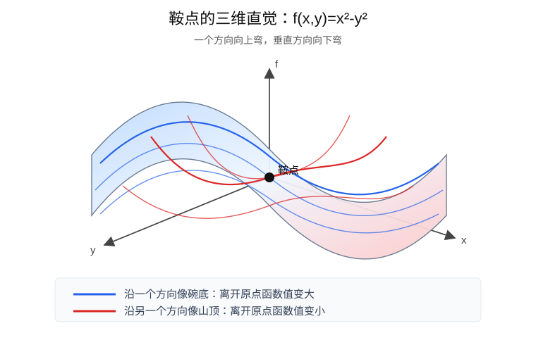

如果只看三维图还觉得抽象，可以再把曲面沿两个方向切开。下面这张图画的是两个截面：蓝色截面像碗底，红色截面像山顶。

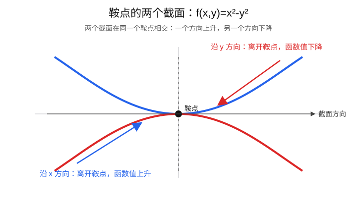

鞍点和局部极小点都会给寻找全局最优带来困难，但困难的性质不一样。局部极小点的问题在于，它在附近确实比周围点都好；一个只依赖局部下降的算法走到这里时，可能找不到继续下降的方向，于是停在一个“局部看起来已经不错、但全局并不是最好”的点上。

鞍点的问题更微妙：它附近仍然存在下降方向，但在鞍点处梯度可能为零。如果算法只看梯度大小，鞍点可能会伪装成一个需要停下来的点。所以，从全局最优的角度看，局部极小点可能是错误的终点，鞍点则可能是误导算法的平衡点。

二阶信息的作用之一，就是帮助区分局部极小点和鞍点：Hessian 正定时更像局部极小，Hessian 不定时则说明存在鞍点方向。

但要注意，二阶信息本身通常只能给出局部结论，不能直接推出全局最小。Hessian 正定说明函数在某一点附近像碗底，因此这个点可能是局部极小点；但它不能排除远处还有更低的地方。换句话说，二阶信息看的是“附近的曲率”，而全局最优问的是“整个可行域里有没有更好的点”。

只有在额外的全局结构条件下，局部判断才可能升级成全局结论。最典型的条件就是凸性。如果 $f$ 是凸函数，并且可行域也是凸的，那么任何局部极小点都是全局极小点；如果再有强凸性，甚至可以保证全局极小点唯一。所以，一阶和二阶条件负责刻画局部形状，凸性负责把局部最优和全局最优连接起来。

### 局部信息的作用

到这里，我们已经有了几个基本对象：目标函数、可行域、梯度、Hessian、局部最优、全局最优和鞍点。第一节只需要先建立这些语言。

真正进入无约束优化以后，我们会进一步问：怎样用梯度判断有没有下降方向？怎样用 Hessian 区分局部极小点和鞍点？这些就是下一节“最优性条件”要正式处理的问题。

### 约束怎样改变问题

有约束优化问题通常写成：

$$
\min_x f(x)
\quad
\text{s.t.}\quad
g_i(x)\le 0,\; h_j(x)=0.
$$

这里的 $g_i(x)\le 0$ 是不等式约束，$h_j(x)=0$ 是等式约束。它们共同定义了可行域。

约束的存在会让“下降”这件事变得更微妙。假设某个方向能让目标函数下降，但沿这个方向一走就违反约束，那么它就不是合法的优化方向。于是，有约束优化不只要问“哪个方向下降最快”，还要问“哪个方向既可行又下降”。

这就是拉格朗日乘子、KKT 条件、可行方向法、投影法和罚函数法出现的原因。它们都在处理同一个冲突：目标函数希望我们往某个方向走，约束条件却限制了哪些方向可以走。

### 从点到函数

到目前为止，变量 $x$ 似乎都是有限维向量。但很多极值问题的未知量不是一个点，而是一整个函数。

比如，给定两个端点，哪一条曲线最短？在所有可能轨迹中，哪一条使能量积分最小？在所有满足边界条件的函数中，哪一个让某个积分量达到极小？

这类问题不能只理解成“在空间里找一个最好的点”，而要理解成“在一批函数里找一个最好的函数”。这时目标不再是普通函数 $f(x)$，而是泛函。泛函的输入是函数，输出是一个数，用来评价整个函数的好坏。

形式上可以写成：

$$
\min_y J[y].
$$

这里 $y$ 代表候选函数，$J[y]$ 是这个函数对应的总评分或总代价。变分法研究的就是这类“在函数空间中找极值”的问题：我们不是调整一个有限维向量，而是在一批候选函数中寻找让 $J[y]$ 最小的那个函数。

从这个角度看，最优化理论和变分法并不是两门互不相干的学问。它们共享同一个核心问题：怎样描述最优对象，以及怎样判断某个对象是否最优。区别只在于，普通优化多在有限维空间中寻找最优点，变分法则在函数空间中寻找最优函数。

## 二、无约束优化与最优性条件

无约束优化研究的是最基本的一类问题：

$$
\min_{x\in\mathbb{R}^n} f(x).
$$

这里没有等式约束，也没有不等式约束，变量可以在整个空间中移动。因此，它最适合用来理解优化理论的核心问题：如果一个点真的是极小点，它必须满足什么条件？如果不能直接解出这个点，又该怎样一步步逼近它？

### 二阶 Taylor 展开与局部近似

无约束优化的最优性条件，最自然的来源是 Taylor 展开。它告诉我们：如果从当前点 $x$ 出发，沿某个方向 $d$ 走一个很小的步长 $\alpha$，函数值会怎样变化。

把多元函数限制在直线

$$
x+\alpha d
$$

上，就得到一个关于 $\alpha$ 的一元函数。若 $f$ 足够光滑，二阶 Taylor 展开给出：

$$
f(x+\alpha d)
\approx
f(x)
+\alpha\nabla f(x)^\top d
+\frac12\alpha^2 d^\top\nabla^2 f(x)d.
$$

这里有三部分：

- $f(x)$ 是当前点的函数值；
- $\alpha\nabla f(x)^\top d$ 是一阶变化；
- $\frac12\alpha^2 d^\top\nabla^2 f(x)d$ 是二阶变化。

梯度 $\nabla f(x)$ 负责描述一阶变化，Hessian 矩阵 $\nabla^2 f(x)$ 负责描述二阶曲率。接下来的一阶条件和二阶条件，本质上都是从这个展开式里读出来的。

为什么这里通常看一阶和二阶就够了？原因不是高阶项不存在，而是局部分析时它们往往更靠后。点 $x$ 附近走很小一步时，一阶项随 $\alpha$ 变化，二阶项随 $\alpha^2$ 变化，三阶和更高阶项则随更高次幂变化。步长足够小时，最先决定函数局部走势的通常是一阶项；如果一阶项消失，接下来最重要的就是二阶项。

因此，在光滑优化里，一阶导数和二阶导数通常已经能回答最基本的局部问题：有没有下降方向？驻点附近像不像极小点？会不会是鞍点？但这不意味着所有问题都只靠二阶就够。非光滑函数可能没有普通导数，高阶退化点可能一阶、二阶信息都消失，全局最优问题也不能只靠局部 Taylor 展开解决。所以更准确的说法是：一阶和二阶信息是光滑优化里最核心的局部分析工具，而不是解决一切优化问题的万能工具。

### 一阶必要条件

一阶必要条件的原型是 Fermat 极值条件。它说的是：如果一个可微函数在某个内点处取得局部极大或局部极小，那么这个点处的导数必须为零。对一元函数来说，如果 $f'(x^\ast)>0$，往左挪一点会更小；如果 $f'(x^\ast)<0$，往右挪一点会更小。因此内点局部极小只能满足

$$
f'(x^\ast)=0.
$$

多元情形也看 Taylor 展开的第一阶项。如果存在方向 $d$，使得

$$
\nabla f(x)^\top d<0
$$

那么当 $\alpha>0$ 足够小时，$f(x+\alpha d)<f(x)$，也就是说 $d$ 是下降方向。

如果 $\nabla f(x)\ne 0$，最直接的下降方向就是

$$
d=-\nabla f(x)
$$

因为

$$
\nabla f(x)^\top d
=
-\|\nabla f(x)\|^2<0
$$

所以，只要梯度向量不是零向量，就能沿负梯度方向下降。这里不要求每个偏导数都非零。比如二维情形中，即使

$$
\frac{\partial f}{\partial x_1}(x)=0,
\qquad
\frac{\partial f}{\partial x_2}(x)>0
$$

沿 $x_1$ 方向的一阶变化消失了，但取

$$
d=(0,-1)
$$

仍然有

$$
\nabla f(x)^\top d
=
-\frac{\partial f}{\partial x_2}(x)<0
$$

因此，在无约束、内点、可微的条件下，如果 $x^\ast$ 是局部极小点，就不能存在任何一阶下降方向，只能有

$$
\nabla f(x^\ast)=0.
$$

满足 $\nabla f(x)=0$ 的点叫作驻点。不过，驻点不一定是极小点，也可能是极大点或鞍点。这就是为什么一阶条件只是必要条件，不是充分条件。

这里还要注意“内点”和“无约束”这两个条件。如果最优点出现在边界上，导数不一定为零；如果问题带有约束，梯度也不一定为零，而是会和约束的方向达到某种平衡。这正是后面拉格朗日乘子和 KKT 条件要处理的问题。

### 二阶条件

一阶条件把我们带到驻点，但驻点可能是局部极小点、局部极大点，也可能是鞍点。为了进一步区分这些情形，需要回到 Taylor 展开的二阶项。

如果 $x$ 是驻点，也就是 $\nabla f(x)=0$，一阶项消失，主要剩下

$$
f(x+\alpha d)-f(x)
\approx
\frac12\alpha^2 d^\top\nabla^2 f(x)d.
$$

所以，在驻点附近，沿方向 $d$ 的局部弯曲主要由二次型

$$
d^\top\nabla^2 f(x)d
$$

决定。

如果对所有非零方向 $d$ 都有

$$
d^\top\nabla^2 f(x)d>0,
$$

那么 Hessian 矩阵 $\nabla^2 f(x)$ 是正定的，点附近在所有方向上都向上弯，局部像碗底。如果对所有非零方向 $d$ 都有

$$
d^\top\nabla^2 f(x)d<0,
$$

那么 Hessian 矩阵 $\nabla^2 f(x)$ 是负定的，点附近在所有方向上都向下弯，局部像山顶。

如果存在两个方向 $d_1,d_2$，使得

$$
d_1^\top\nabla^2 f(x)d_1>0,
\qquad
d_2^\top\nabla^2 f(x)d_2<0,
$$

那么同一个点附近，有的方向像碗底，有的方向像山顶。此时 Hessian 矩阵 $\nabla^2 f(x)$ 是不定的，对应的几何形状就是鞍点。

负的二阶方向会排除局部极小。假设 $x$ 是驻点，并且存在方向 $d$ 使得

$$
d^\top\nabla^2 f(x)d<0.
$$

因为 $\alpha^2>0$，所以当 $\alpha$ 足够小时，

$$
f(x+\alpha d)-f(x)
\approx
\frac12\alpha^2 d^\top\nabla^2 f(x)d<0.
$$

这说明沿这个方向走一小步，函数值会变小。因此 $x$ 不可能是局部极小点。

现在可以更准确地说二阶必要条件和二阶充分条件：

- 如果 $x^\ast$ 是无约束问题的内点局部极小点，并且 $f$ 二阶可微，那么
  $$
  \nabla^2 f(x^\ast)\succeq 0.
  $$
  这是二阶必要条件；
- 如果 $x^\ast$ 是驻点，并且
  $$
  \nabla^2 f(x^\ast)\succ 0,
  $$
  那么 $x^\ast$ 是严格局部极小点。这是二阶充分条件。

这些条件本质上都是局部条件。它们帮助我们判断一个点附近的形状，但一般不能直接保证全局最优。全局结论需要额外结构，比如凸性。

### 迭代算法的基本结构

知道最优性条件以后，下一步自然是：如果极小点不能直接解出来，怎样通过计算去寻找它？这里进入的就是数值优化方法。它和求解析表达式不同：解析方法希望把最优点直接写出来，数值方法则承认很多问题写不出闭式解，于是从一个初始点出发，反复产生新的候选点。

抽象地说，一个迭代算法通常有五件事：

```text
给定目标函数 f，初始点 x0

for k = 0, 1, 2, ...:
    根据当前点 x_k 收集局部信息
    产生一个候选方向 d_k 或候选点 z_k
    判断候选点是否比当前点更好
    接受更新，得到 x_{k+1}

    如果满足停止条件:
        停止，返回当前候选点
```

不同算法的差别，主要就在这些环节上。

基于导数的数值方法会用梯度、Hessian 或它们的近似信息来产生方向。梯度下降法用负梯度方向，Newton 法用二阶 Taylor 近似得到的 Newton 方向。无约束直接数值方法不显式使用导数，而是在当前点附近试探若干候选点，通过比较函数值决定往哪里走。

停止条件也要小心理解。算法停止并不自动意味着找到了全局最优点。对基于导数的方法来说，常见停止条件是梯度足够小，这通常只能说明当前点接近驻点；对直接方法来说，常见停止条件是试探步长已经很小，附近没有发现更好的点。这些都只是数值意义上的候选解，之后仍然需要结合二阶条件、凸性或问题本身的结构来判断它到底是什么。

### 基于导数的数值方法

基于导数的方法首先是一类数值方法。它们不是把最优点写成一个漂亮的解析表达式，而是从初始点出发，反复利用梯度、Hessian 或它们的近似信息产生下一步。梯度下降法是最典型的一阶数值方法；Newton 法则是最典型的二阶数值方法。

换句话说，Fermat 条件和二阶条件告诉我们“极小点附近应该满足什么”；基于导数的数值方法则把这些局部信息变成可执行的迭代步骤。它们的目标不是一次性解出闭式答案，而是在有限计算成本下逐步逼近一个好的候选点。

下面几个重点算法都按同一种方式读：先看伪代码，知道每一步在做什么；再看一个可以算出几步的小例子，理解它怎样从初始点逐步靠近最优点。

#### 梯度下降法

**输入信息要求**：需要能计算目标函数值和梯度 $\nabla f(x)$。目标函数最好有明确表达式，或者至少能通过自动微分、数值程序等方式稳定得到梯度；不需要知道最优点的解析表达式。

梯度下降法的迭代形式是：


$$
x_{k+1}=x_k-\alpha_k\nabla f(x_k)
$$

这里 $x_k$ 是第 $k$ 次迭代的位置，$\alpha_k>0$ 是步长。它只使用一阶信息：在当前位置看梯度，取负梯度作为下降方向，选一个步长，更新到下一个点。

写成算法就是：

```text
给定目标函数 f，初始点 x0，步长规则 alpha_k

for k = 0, 1, 2, ...:
    计算梯度 g_k = ∇f(x_k)

    如果 ||g_k|| 足够小:
        停止，返回 x_k

    选择步长 alpha_k > 0
    更新 x_{k+1} = x_k - alpha_k g_k
```

其中 `||g_k|| 足够小` 的意思是：梯度已经接近零，当前点附近没有明显的一阶下降方向，所以可以把它当作近似驻点。

看一个具体例子。我们最小化

$$
f(x,y)=x^2+2y^2.
$$

它的梯度是

$$
\nabla f(x,y)=(2x,4y).
$$

最优点先看一阶条件。驻点要满足

$$
\nabla f(x,y)=0,
$$

也就是

$$
2x=0,\qquad 4y=0.
$$

所以

$$
x^\ast=(0,0).
$$

这个例子比较特殊，因为 $f(x,y)=x^2+2y^2$ 是凸二次函数，所以这个唯一驻点同时也是全局极小点。梯度下降法并不直接跳到这个点，而是从 $(3,2)$ 出发，每一步都计算当前梯度，然后沿负梯度方向更新，函数值会逐渐变小。

如果取固定步长 $\alpha=0.1$，更新式就是

$$
(x_{k+1},y_{k+1})
=(x_k,y_k)-0.1(2x_k,4y_k).
$$

前几步可以直接算出来：

| 迭代次数 $k$ | $x_k$ | $y_k$ | $f(x_k,y_k)$ |
| --- | ---: | ---: | ---: |
| 0 | 3.000 | 2.000 | 17.000 |
| 1 | 2.400 | 1.200 | 8.640 |
| 2 | 1.920 | 0.720 | 4.723 |
| 3 | 1.536 | 0.432 | 2.733 |
| 4 | 1.229 | 0.259 | 1.644 |
| 5 | 0.983 | 0.156 | 1.015 |

可以看到，点的位置不断向 $(0,0)$ 靠近，函数值也持续下降。这里每一步都没有直接“解出最优点”，只是用当前梯度产生下一步；重复足够多次以后，才逐渐逼近全局极小点。

但对一般非凸函数来说，梯度下降法停止时只能说“找到一个近似驻点”，不能直接说“找到最优点”。这个驻点可能是局部极小点，也可能是鞍点；如果没有凸性等额外结构，它也不一定是全局最优。

梯度下降法最重要的问题不是公式本身，而是步长 $\alpha_k$ 怎么选。步长太小，下降很慢；步长太大，可能越过低点，甚至让函数值变大。实际算法中常见的做法包括固定步长、逐渐减小步长、线搜索等。

#### Newton 法

**输入信息要求**：需要能计算目标函数值、梯度 $\nabla f(x)$ 和 Hessian $\nabla^2 f(x)$，或者能稳定地近似这些信息。不需要知道最优点的解析表达式，但每一步要解一个由 Hessian 给出的线性方程。

Newton 法的名字来自很早的求根方法。Newton 在 1669 年已有相关思想，Raphson 在 1690 年给出更系统的代数形式，Simpson 在 1740 年给出更接近现代微积分写法的版本。但那时讨论的是“怎样求 $F(x)=0$ 的根”。在优化里，极小点通常要满足一阶条件 $\nabla f(x)=0$，所以 Newton 思想被用来求这个梯度方程的根。也就是说，现代优化里的 Newton 法不是简单地“比梯度下降更早的二阶优化算法”，而是把早期求根思想搬到了最优性条件上。

先看算法骨架：

```text
给定目标函数 f，初始点 x0

for k = 0, 1, 2, ...:
    计算梯度 g_k = ∇f(x_k)
    计算 Hessian 矩阵 H_k = ∇²f(x_k)

    如果 ||g_k|| 足够小:
        停止，返回 x_k

    解线性方程 H_k p_k = -g_k
    更新 x_{k+1} = x_k + p_k
```

这里的 $p_k$ 是第 $k$ 轮算出来的步子，不是新的点。新的点是 $x_k+p_k$。

为什么要解这个线性方程？Newton 法直接使用二阶 Taylor 近似来选下一步。把当前点 $x_k$ 附近的函数近似成一个二次函数：

$$
f(x_k+p)\approx f(x_k)+\nabla f(x_k)^\top p+\frac12 p^\top\nabla^2 f(x_k)p.
$$

这里可以把右边看成一个关于 $p$ 的新函数，记作局部二次模型

$$
m_k(p)=f(x_k)+\nabla f(x_k)^\top p+\frac12 p^\top\nabla^2 f(x_k)p.
$$

注意，此时 $x_k$ 是已经给定的当前点，$p$ 表示“从 $x_k$ 出发要走的位移”。Newton 法不是直接最小化原函数 $f$，而是先问：如果当前位置附近的函数真的长得像这个二次模型，那么这个模型的最低点在哪里？要让 $m_k(p)$ 取得极小，至少要满足一阶驻点条件。对 $p$ 求梯度：

$$
\nabla_p m_k(p)=\nabla f(x_k)+\nabla^2 f(x_k)p.
$$

令这个梯度为零，就得到模型驻点方程

$$
\nabla f(x_k)+\nabla^2 f(x_k)p=0.
$$

解出这个方程得到的具体步子记作 $p_k$，也就是 Newton 方向。它满足

$$
\nabla^2 f(x_k)p_k=-\nabla f(x_k).
$$

如果 Hessian 可逆，也可以写成

$$
p_k
=
-
\left(\nabla^2 f(x_k)\right)^{-1}
\nabla f(x_k).
$$

不过在实际计算中，通常不会真的先把 Hessian 矩阵求逆，而是直接解线性方程 $\nabla^2 f(x_k)p_k=-\nabla f(x_k)$。这样数值上更稳定，也更符合大规模计算的做法。

直观地说，梯度下降法只问“脚下最陡的下坡方向在哪里”，Newton 法还要问“这个方向弯得有多厉害”。Hessian 让算法知道不同方向的尺度差异：有的方向很窄，步子要小；有的方向很平，步子可以大。于是 Newton 步 $p_k$ 更像是在局部二次模型里直接朝“临时碗底”走。

看一个一维例子。最小化

$$
f(x)=e^x-x.
$$

它的一阶导数和二阶导数是

$$
f'(x)=e^x-1,\qquad f''(x)=e^x.
$$

最优点满足 $f'(x)=0$，所以 $e^x-1=0$，也就是 $x^\ast=0$。Newton 法的迭代为

$$
x_{k+1}
=x_k-\frac{f'(x_k)}{f''(x_k)}
=x_k-\frac{e^{x_k}-1}{e^{x_k}}.
$$

从 $x_0=2$ 出发，前几步是：

| 迭代次数 $k$ | $x_k$ | $f'(x_k)$ | $f(x_k)$ |
| --- | ---: | ---: | ---: |
| 0 | 2.000000 | 6.389056 | 5.389056 |
| 1 | 1.135335 | 2.112217 | 1.976882 |
| 2 | 0.456650 | 0.578776 | 1.122126 |
| 3 | 0.090052 | 0.094231 | 1.004179 |
| 4 | 0.003936 | 0.003943 | 1.000008 |
| 5 | 0.000008 | 0.000008 | 1.000000 |

这个例子能看出 Newton 法的典型特点：一开始从 $2$ 往 $0$ 靠近，越接近最优点，收敛越快。因为这个函数是凸函数，$f''(x)=e^x>0$，所以这里的驻点就是全局极小点。

多元情形也是同一个思想，只是二阶导数变成 Hessian 矩阵。例如对

$$
f(x,y)=x^2+2y^2,
$$

有

$$
\nabla f(x,y)=(2x,4y),\qquad
\nabla^2 f(x,y)=
\begin{bmatrix}
2&0\\
0&4
\end{bmatrix}.
$$

Hessian 告诉算法：$y$ 方向比 $x$ 方向弯得更厉害，所以两个方向的步子不能按同样尺度走。对这个二次函数，Newton 法一步就到 $(0,0)$。这不是因为 Newton 法总能一步找到最优点，而是因为目标函数本身正好就是二次函数，二阶 Taylor 近似没有误差。

这里也要注意：$m_k(p)$ 只是局部近似，不是原函数本身。如果离 $x_k$ 太远，二次模型可能不再可信。对一般函数，Newton 法是在每一步用一个局部二次模型近似原函数；如果 Hessian 正定，并且初始点离局部极小点足够近，它往往收敛很快。但如果 Hessian 不定，Newton 方向甚至可能不是下降方向，这时就需要阻尼 Newton 法、信赖域方法等修正。

#### 基于导数数值方法的发展线

读完梯度下降法和 Newton 法以后，可以把基于导数的数值优化方法放到一条发展线上看。这条线不是按“一阶一定早、二阶一定晚”的顺序机械展开，而是围绕同一个问题不断分化：怎样利用当前点附近的信息，构造一个既有用、又算得起的下一步？

如果从数值优化的角度看，第一条很自然的路线是：既然导数能告诉我们局部怎样下降，那就先用一阶导数构造可执行的下降算法。梯度下降法和最速下降法就是这条线的起点之一，通常追溯到 Cauchy 在 1847 年左右研究的最速下降思想。它解决的问题很朴素：很多极小点没法解析求出，那就从一个初始点出发，沿负梯度方向一步步把函数值压低。

最速下降法进一步把“走多远”单独拿出来处理，常常通过一维线搜索选择步长。这样改进了固定学习率过于粗糙的问题，但没有解决所有困难。尤其是在狭长谷地里，负梯度方向经常指向谷壁，算法可能来回摇摆，下降很慢。

Newton 法提供的是另一种思路：不只看一阶坡度，还看 Hessian 给出的二阶曲率。这样算法可以在当前位置附近搭一个局部二次模型，再通过解线性方程

$$
\nabla^2 f(x_k)p_k=-\nabla f(x_k)
$$

直接得到下一步。它改善了一阶方法只看坡度、对不同方向尺度不敏感的问题；但代价是每一步要计算 Hessian 并解线性方程组，高维时很贵，Hessian 不定时还可能给出不下降的方向。

拟 Newton 法就是在“梯度下降太慢、Newton 法太贵”之间长出来的。Davidon 1959 年的 variable metric 方法、Fletcher 和 Powell 1963/1964 年的 DFP 方法，以及 Broyden、Fletcher、Goldfarb、Shanno 在 1970 年形成的 BFGS 系列，都在处理同一个矛盾：二阶曲率信息很有用，但完整 Hessian 太贵。于是算法不每次重新计算 Hessian，而是利用相邻几步的梯度变化，逐步更新一个 Hessian 或逆 Hessian 的近似。

共轭梯度法由 Hestenes 和 Stiefel 在 1952 年提出，主要面向大规模二次型和线性方程组问题。它想解决的是梯度下降在狭长谷地里“左右横跳”的问题：普通梯度下降每一步都重新看当前位置最陡的下降方向，前一步刚取得的进展，后一步可能又被抵消。共轭梯度法构造一组彼此协调的搜索方向，让后面的步子尽量不破坏前面已经处理过的方向，更直接地沿谷底推进。

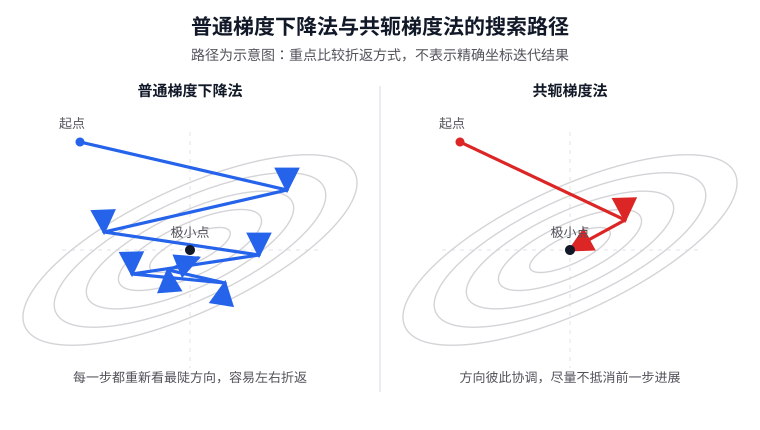

坐标下降法解决的是另一类计算现实。它没有一个像 Newton 法那样单一清楚的“发明年份”，但和 20 世纪上半叶的 relaxation / coordinate relaxation 思想关系很近，Southwell 在 1940 年左右的松弛方法就是重要背景。变量很多时，整体沿负梯度移动未必最方便；如果每次只固定其它变量、单独优化一个坐标或一个变量块，子问题反而可能很容易。它改进的不是方向最陡不最陡，而是每一步能不能更便宜、更容易实现。

随机梯度法的动机则来自统计和机器学习。Robbins 和 Monro 在 1951 年提出的随机近似方法，是这条线的重要源头。经验风险最小化中的目标函数常常是大量样本损失的平均值，标准梯度下降每一步都要扫完整个数据集，数据一大就太贵。随机梯度法不用完整梯度，而是用一个样本或一小批样本估计梯度，用更便宜但有噪声的方向替代精确方向。

所以，这些方法并不是按“一阶一定早、二阶一定晚”的顺序机械出现的，而是在不同问题压力下不断分化出来的：梯度下降把局部下降变成可执行迭代；最速下降认真处理步长；Newton 法引入曲率；拟 Newton 法降低二阶方法的成本；共轭梯度法减少重复摇摆；坐标下降法利用变量分块；随机梯度法用噪声换规模。它们都围绕同一个问题展开：怎样在当前点构造一个有用的搜索方向，并且以可以接受的成本向更低的函数值移动。

### 无约束直接数值方法

**输入信息要求**：通常只需要能评价目标函数值 $f(x)$，不要求梯度、Hessian，也不要求目标函数有方便的解析导数。目标函数甚至可以来自黑箱程序、实验或仿真，只要给定 $x$ 后能比较函数值大小即可。

无约束直接方法也是数值方法，只是它们不依赖导数。前面讲的梯度下降、Newton 法、拟 Newton 法，都默认我们能拿到比较可靠的导数信息；直接方法则连这个前提也放松了。它们不试图求出解析解，也不先写出梯度方程再解方程，而是通过一次次评价函数值、比较候选点好坏来推进。

很多实际优化问题并不满足“导数好算”这个前提。比如目标函数来自风洞实验、化学实验、工程仿真、统计拟合程序或一个很复杂的黑箱系统，你也许只能输入一组参数，然后等它吐出一个函数值。优化的目标仍然是找到一组尽可能好的参数，只是现在算法不能靠导数指路，只能靠一次次试参数、比较函数值，逐步逼近更优的参数。此时梯度可能不存在、太贵、噪声很大，或者根本没有解析表达式。

即使梯度可以计算，直接方法也仍然有价值。原因是梯度只反映当前位置的局部下降方向，不一定适合复杂地形里的长期推进；在 Rosenbrock 函数这种狭长弯谷里，梯度方法就可能频繁撞向谷壁。直接方法提醒我们：优化算法不只是在算导数，也是在设计搜索策略。什么时候试探、沿哪些方向试探、怎样从成功移动中更新方向，这些问题本身就值得研究。

无约束直接方法就是在这种背景下发展出来的。它们不先问“梯度是多少”，而是问一个更朴素的问题：我在当前点附近试几个位置，哪个位置的函数值更小？如果某个方向试出来更好，就往那里走；如果周围都没有变好，就缩小步长，重新试探。

最朴素的模式搜索法就是这个味道。假设当前点是 $x_k$。我们不计算 $\nabla f(x_k)$，而是在它附近选几个预设方向试探，比如二维中可以试：

$$
x_k\pm \Delta e_1,
\qquad
x_k\pm \Delta e_2.
$$

这里 $e_1,e_2$ 是坐标方向，$\Delta$ 是试探步长。如果某个试探点的函数值更小，就把当前点移动过去；如果所有试探点都没有变好，就缩小 $\Delta$，在更小范围内继续试探。

它的核心思想是：即使不知道梯度和 Hessian，也可以通过比较周围点的函数值来判断往哪里走更好。模式搜索法用“试探点的好坏”代替“一阶或二阶导数给出的局部模型”。

#### Rosenbrock 函数：为什么算法会撞谷壁

直接方法不是随便试几个点就够了，梯度方法也不是有了梯度就一路顺风。一个经典测试例子是 Rosenbrock 函数：

$$
f(x,y)=(1-x)^2+100(y-x^2)^2.
$$

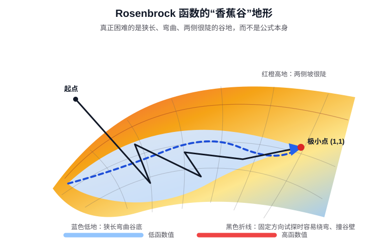

它的全局极小点在 $(1,1)$。这个函数看起来只是一个二元函数，但它的等高线很麻烦：低值区域不是一个圆形碗底，而是一条狭长、弯曲的谷。左边的曲面图能看出两侧谷壁很陡，右边的等高线图能看出谷底不是直线，而是弯着通向最终低点。

想象你站在这条沟谷的一侧。真正好的长期方向，是先贴近谷底，然后顺着谷底往前走，最后到达 $(1,1)$。但如果你并不正好站在谷底最低的那条线上，当前位置最陡的下降方向往往不是“沿沟往前”，而是“横着冲向沟底更深处”。这一步如果走得稍微大一点，就可能越过沟底，撞到另一侧谷壁；下一步梯度又把你拉回来。于是算法看起来一直在下降，却把很多步子花在左右修正上，向前推进反而很慢。

图里的两条路线是示意图，不是某次程序运行得到的精确轨迹。路线 A 对应最朴素的固定坐标方向模式搜索：每一步主要沿预先给定的方向，比如 $x$ 方向、$y$ 方向，去附近找更低的点。它容易反复横穿谷底，在两侧较高的谷壁之间来回修正。路线 B 则表示方向调整方法想做的事：从前面成功的移动中学出更贴合谷底走向的方向，进入谷底后尽量顺着谷底继续下降。

固定坐标轴的方法也容易撞谷壁，原因在于 Rosenbrock 函数的低谷大致沿着 $y=x^2$ 弯曲，而不是沿水平或竖直方向延伸。坐标方向是横平竖直的，谷底方向却是斜着并且不断转弯的。于是，沿 $x$ 方向或 $y$ 方向单独走，常常不是顺着谷底前进，而是带着一部分“横穿谷地”的成分。

Rosenbrock 函数常被用来测试优化算法，原因就在这里：它逼着算法处理“方向不对”和“尺度差异很大”的问题。梯度方法会暴露步长选择和曲率适配的困难；直接方法虽然不算导数，也同样会遇到搜索方向是否合适的问题。

#### Rosenbrock 方法：让搜索方向跟着地形转

Rosenbrock 方法由 H. H. Rosenbrock 在 1960 年提出。它不是专门用来最小化 Rosenbrock 函数的算法，而是一种无导数的直接搜索方法。它想解决的问题是：如果算法一开始只会沿坐标轴方向试探，那么遇到倾斜、狭长、弯曲的谷地时，能不能从已经成功的移动中学出新的搜索方向？

先看简化版伪代码：

```text
给定初始点 x0
给定初始搜索方向 d1, ..., dn
给定每个方向上的初始步长 Δ1, ..., Δn

for k = 0, 1, 2, ...
    1. 记本轮起点 x_start = xk

    2. 依次沿当前方向 di 试探
       如果 f(xk + Δi di) < f(xk)
           接受：xk = xk + Δi di
           适当放大 Δi
       否则如果 f(xk - Δi di) < f(xk)
           接受：xk = xk - Δi di
           适当放大 Δi
       否则
           不移动，并缩小 Δi

    3. 计算本轮总位移
       s = xk - x_start

    4. 如果 s 不太小
       把 s 看成这一轮学到的主要前进方向
       用它构造新的方向组，并做正交化和单位化

    5. 如果所有步长都已经很小，就停止
end
```

这里第 2 步仍然是直接搜索：只比较函数值，不需要梯度。第 3、4 步才是 Rosenbrock 方法和普通模式搜索的关键差别。普通模式搜索主要在固定方向附近试探；Rosenbrock 方法会把一整轮成功移动合起来看，判断总体上哪条方向更有效，然后把后续搜索方向转过去。

看一个二维例子。设一开始使用坐标轴方向：

$$
d_1=(1,0),\qquad d_2=(0,1).
$$

这两个 $d_i$ 不是候选点，而是“从当前点往哪些方向试”。令目标函数为

$$
f(x,y)=(x+y-2)^2+0.01(x-y)^2.
$$

这个函数的最低点是 $(1,1)$。因为第一项希望 $x+y=2$，第二项希望 $x-y=0$，两者合起来就是 $x=1,y=1$。

从

$$
x_{\text{start}}=(0,0)
$$

出发，此时 $f(0,0)=4$。这里的 $0.5$ 不是算法算出来的最优步长，而是我们人为给定的初始试探步长，记作

$$
\Delta_1=\Delta_2=0.5.
$$

直接搜索方法通常都要先给一个这样的试探尺度：太大了就可能试不出下降点，算法会缩小它；太小了则走得慢，算法可能在成功移动后放大它。这里取 $0.5$ 只是为了让手算例子足够短。

先沿 $d_1=(1,0)$ 试探：

$$
f(0.5,0)=2.2525<4,
$$

所以接受，当前点变为 $(0.5,0)$。再沿 $d_2=(0,1)$ 试探：

$$
f(0.5,0.5)=1<2.2525,
$$

所以继续接受，第一轮结束点为

$$
x_1=(0.5,0.5).
$$

如果初始试探步长不是 $0.5$，而是 $0.1$，逻辑并不会变，只是同样的移动会被拆成更多小步。比如仍从 $(0,0)$ 出发，沿 $d_1=(1,0)$ 连续试探，会得到

| 点 | 函数值 |
| --- | ---: |
| $(0,0)$ | 4.0000 |
| $(0.1,0)$ | 3.6101 |
| $(0.2,0)$ | 3.2404 |
| $(0.3,0)$ | 2.8909 |
| $(0.4,0)$ | 2.5616 |
| $(0.5,0)$ | 2.2525 |

这些点的函数值一直下降，所以算法会连续接受这些小步。接着沿 $d_2=(0,1)$ 继续试探，也会从 $(0.5,0)$ 逐步走到 $(0.5,0.5)$：

| 点 | 函数值 |
| --- | ---: |
| $(0.5,0.1)$ | 1.9616 |
| $(0.5,0.2)$ | 1.6909 |
| $(0.5,0.3)$ | 1.4404 |
| $(0.5,0.4)$ | 1.2101 |
| $(0.5,0.5)$ | 1.0000 |

所以，初始步长 $0.1$ 和 $0.5$ 的区别不只是数字不同，而是代表两种搜索节奏。步长 $0.5$ 比较大胆，函数评价次数少，如果方向大致对，很快就能推进；但在复杂地形里，它也更容易一步跨过狭窄低谷，或者试到一个函数值反而变大的点。步长 $0.1$ 更谨慎，每一步都小，比较不容易跨过细窄结构，但代价是要做更多次函数评价，推进速度慢。

这就是为什么直接搜索方法通常不把步长固定死。某个方向连续成功，说明这个方向上暂时比较顺，可以适当放大步长；某个方向反复失败，说明步子可能太大，或者方向不合适，就缩小步长重新试。Rosenbrock 方法在这个基础上再多做一步：它不仅调步长，还把这些成功的小步合成为一个新方向。也就是说，步长负责回答“走多远”，方向调整负责回答“以后主要往哪里走”。

在这个例子里，即使用 $0.1$ 这样的小步长，一整轮结束后，成功位移仍然可以总结出类似的对角方向。

这一轮的总位移是

$$
s=x_1-x_{\text{start}}=(0.5,0.5).
$$

这个 $s$ 不是预先给定的坐标轴方向，而是“先向右、再向上”两次成功试探合成出来的方向。它说明：从这一轮的结果看，真正有效的前进方向更像右上方的对角线，而不是单独的水平或竖直方向。因此下一轮可以把

$$
\frac{s}{\|s\|}
=
\frac{(0.5,0.5)}{\sqrt{0.5^2+0.5^2}}
=
\frac{(0.5,0.5)}{\sqrt{0.5}}
=
\left(\frac{1}{\sqrt2},\frac{1}{\sqrt2}\right)
$$

作为新的主搜索方向之一。第二轮从 $x_1=(0.5,0.5)$ 出发，沿这个方向走，点可以写成

$$
x_1+\alpha\frac{s}{\|s\|}
=(0.5,0.5)+\alpha\left(\frac{1}{\sqrt2},\frac{1}{\sqrt2}\right).
$$

这里的 $\alpha$ 不是凭空选的，也不是因为算法提前知道最低点。Rosenbrock 方法会沿新方向做一维搜索：把

$$
x(\alpha)
=(0.5,0.5)+\alpha\left(\frac{1}{\sqrt2},\frac{1}{\sqrt2}\right)
$$

代入目标函数，得到只含 $\alpha$ 的一元函数：

$$
f(x(\alpha))
=
\left(1+\sqrt2\alpha-2\right)^2
+0.01(0)^2
=
(\sqrt2\alpha-1)^2.
$$

现在问题变成在这条直线上最小化 $(\sqrt2\alpha-1)^2$。它的最小值在

$$
\sqrt2\alpha-1=0,
$$

所以线搜索会给出

$$
\alpha=\frac{1}{\sqrt2}=\frac{\sqrt2}{2}.
$$

用这个步长更新，就得到

$$
(0.5,0.5)+\frac{\sqrt2}{2}\left(\frac{1}{\sqrt2},\frac{1}{\sqrt2}\right)
=(1,1).
$$

代入目标函数：

$$
f(1,1)=(1+1-2)^2+0.01(1-1)^2=0.
$$

所以这一轮沿新方向搜索，可以直接到达最低点。前两轮可以概括为：

| 轮次 | 起点 | 本轮动作 | 终点 | 函数值 |
| --- | --- | --- | --- | ---: |
| 0 | $(0,0)$ | 沿坐标方向试探，先右移再上移 | $(0.5,0.5)$ | 1.000 |
| 1 | $(0.5,0.5)$ | 把 $(0.5,0.5)$ 总结成对角方向，沿新方向搜索 | $(1,1)$ | 0.000 |

这个例子很理想，不是说真实问题总能两轮到最优点。它说明的是 Rosenbrock 方法的关键动作：用函数值比较发现“组合起来的成功方向”，再把后续搜索方向转向这个方向。对于 Rosenbrock 函数那种弯曲山谷，方向不会一次转好，而是要随着迭代一轮一轮继续调整。

最后还要说一下正交化。原始 Rosenbrock 方法会更仔细地根据每个方向上的成功步长构造新方向，并对方向组做正交化处理。原因是：如果只把成功方向往前推，几个搜索方向可能会慢慢挤到一起，变得几乎平行。这样算法虽然看起来有很多方向，实际上却只是在一条窄线附近试探，容易漏掉旁边还能下降的方向。

正交化的作用，是让新的方向组既包含“刚才走得通的方向”，又保留和它不同的侧向试探能力。用山谷的语言说：算法发现沿谷底方向前进很有用，但它仍然需要保留一个大致横向的试探方向。如果横向某一侧更低，就说明当前路径偏到谷壁上了，需要修正；如果两侧都没有更低，才说明暂时比较贴近谷底。

所以，Rosenbrock 方法真正重要的地方不是某个具体公式，而是方向调整思想：直接方法虽然不算导数，但不能永远只沿固定坐标轴试探；它也可以从已经成功的移动中学习“地形大概朝哪里延伸”。

#### 其它直接方法：从固定试探到自适应试探

直接搜索方法在 20 世纪 50 到 60 年代快速发展，一个重要背景是计算机开始被用于实验数据拟合和工程设计。很多目标函数来自程序、实验或仿真，只能评价函数值，导数不容易拿到。于是，人们开始系统研究“不用导数也能优化”的算法。

Hooke 和 Jeeves 在 1961 年提出 direct search 的代表性方法。它的思想是把搜索分成两层：先在当前点附近做探索性试探，看看哪些方向能变好；如果找到整体上成功的移动，再沿这个成功趋势做模式移动。它解决的是“只知道函数值时，怎样设计有组织的试探”。

Rosenbrock 在 1960 年提出自动调整方向的方法，重点是让搜索方向跟着成功位移旋转，减少固定坐标轴带来的笨拙。Powell 在 1964 年提出方向集方法，也是在不用导数的前提下，通过线搜索和方向更新，尽量维护一组更有效的搜索方向。

Nelder-Mead 方法由 Nelder 和 Mead 在 1965 年提出。它走的是另一条路：不维护单个搜索方向，而是维护一组试探点，也就是一个 simplex。算法通过反射、扩张、收缩、压缩等操作，让这组点逐步挪向较优区域。它在低维黑箱优化中非常常见，但在高维或病态问题中也可能不稳定。

所以，直接方法的重点不是“完全不需要数学结构”，而是“在没有可靠导数信息时，怎样只凭函数值设计有效试探”。模式搜索法强调固定方向附近的试探；Hooke-Jeeves 方法加入探索和模式移动；Rosenbrock、Powell 方法尝试学习更合适的方向；Nelder-Mead 方法则让一组点自己变形前进。它们的共同优点是对导数要求低，缺点是高维时试探成本往往很高，效率通常不如能利用可靠导数信息的方法。

## 三、约束优化、拉格朗日乘子与 KKT 条件

约束优化的核心困难是：目标函数 $f$ 给出“怎样下降”的信息，约束函数 $h$ 或 $g_i$ 给出“哪些点允许选择”的限制。算法不能只看目标函数下降，还必须同时处理约束条件。

### 拉格朗日乘子法

拉格朗日乘子法主要处理等式约束。典型问题是：

$$
\min_x f(x)
\quad
\text{s.t.}\quad h(x)=0,
$$

这里 $h(x)=0$ 描述可行域。比如在二维里，它可能是一条曲线；在三维里，它可能是一张曲面。拉格朗日乘子法的做法很直接：引入一个新的未知数 $\lambda$，把目标函数和约束函数合在一起，构造拉格朗日函数

$$
L(x,\lambda)=f(x)+\lambda h(x).
$$

然后把 $x$ 和 $\lambda$ 都当作未知数，对拉格朗日函数关于它们同时求驻点：

$$
\nabla_x L(x,\lambda)=0,\qquad \frac{\partial L}{\partial \lambda}=0.
$$

第一组方程来自对 $x$ 求导，第二个方程来自对 $\lambda$ 求导。由于

$$
\frac{\partial L}{\partial \lambda}=h(x),
$$

所以对 $\lambda$ 求导等于零，正好把原来的约束 $h(x)=0$ 放回来了。把方程展开，就是

$$
\nabla f(x)+\lambda\nabla h(x)=0,\qquad h(x)=0.
$$

这个方程组就是拉格朗日乘子法真正要解的东西。这里的 $\lambda$ 就叫拉格朗日乘子。它不是提前选好的参数，而是和最优点 $x$ 一起求出来的未知数。

大白话说，原来的问题有两个要求：一方面希望 $f(x)$ 尽量小，另一方面又必须守住 $h(x)=0$ 这条限制。拉格朗日函数 $L(x,\lambda)=f(x)+\lambda h(x)$ 做的事，就是把这两个要求放进同一个方程组里处理。

所以，拉格朗日乘子法不是随便多造一个函数，也不是罚函数法。它是在同时写两类条件：对 $\lambda$ 求导，得到原来的约束 $h(x)=0$；对 $x$ 求导，得到梯度平衡条件 $\nabla f(x)+\lambda\nabla h(x)=0$。

#### 例子：直线上离原点最近的点

先看一个最小的例子：

$$
\min_{x,y} x^2+y^2
\quad
\text{s.t.}\quad
x+y=c.
$$

这个问题的意思是：在直线 $x+y=c$ 上，找离原点最近的点。目标函数和约束可以写成

$$
f(x,y)=x^2+y^2,\qquad h(x,y)=x+y-c.
$$

于是拉格朗日函数是

$$
L(x,y,\lambda)=x^2+y^2+\lambda(x+y-c).
$$

对 $x,y,\lambda$ 分别求偏导，并令它们为零：

$$
\frac{\partial L}{\partial x}=2x+\lambda=0
$$

$$
\frac{\partial L}{\partial y}=2y+\lambda=0
$$

$$
\frac{\partial L}{\partial \lambda}=x+y-c=0
$$

前两个方程给出

$$
x=-\frac{\lambda}{2},\qquad y=-\frac{\lambda}{2}.
$$

所以 $x=y$。再代入约束 $x+y=c$，得到

$$
x=y=\frac c2.
$$

继续代回 $2x+\lambda=0$，得到

$$
\lambda=-c.
$$

所以，当约束是 $x+y=10$ 时，最优点是

$$
(5,5),
$$

最小值是

$$
x^2+y^2=5^2+5^2=50,
$$

对应的乘子是 $\lambda=-10$。

#### 几何解释：为什么梯度会平衡

算完以后，再看这个例子的几何意义就清楚了。目标函数

$$
f(x,y)=x^2+y^2
$$

的等值线是一圈圈以原点为圆心的圆：

$$
x^2+y^2=r^2.
$$

半径 $r$ 越小，函数值越小；约束 $x+y=c$ 则是一条直线。比如 $c=10$ 时，我们不是在整个平面里找离原点最近的点，而是在直线 $x+y=10$ 上找离原点最近的点。想象从原点开始画圆：半径很小时，圆碰不到这条直线；半径慢慢变大，直到第一次碰到直线。这个“第一次碰到”的点就是 $(5,5)$，对应的圆是

$$
x^2+y^2=50.
$$

如果圆和直线相交成两个点，就说明还能在直线上找到更小的圆。例如 $(4,6)$ 和 $(6,4)$ 都满足 $x+y=10$，但

$$
4^2+6^2=52,
$$

比 $50$ 大。只有在 $(5,5)$ 处，最小的可接触圆和约束直线刚好相切，沿直线往两边走都会让圆半径变大，也就是让 $f$ 变大。因此这个切点就是约束下的最优点。

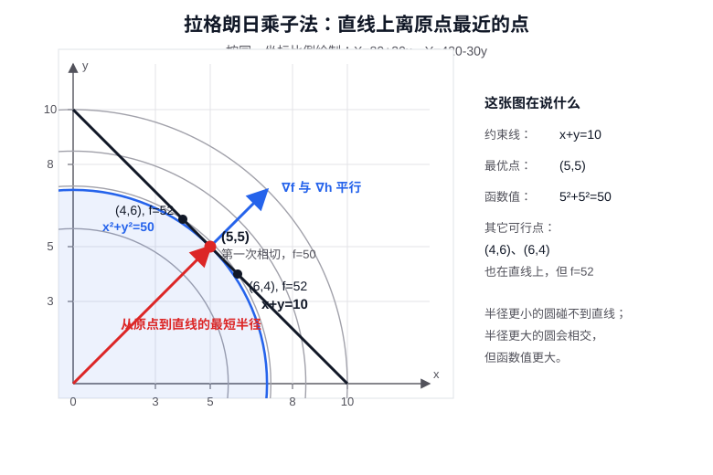

现在把这件事翻译成梯度语言。先看表面上的“平行”。约束函数是 $h(x,y)=x+y-c$，它的梯度是

$$
\nabla h(x,y)=(1,1).
$$

目标函数的梯度是

$$
\nabla f(x,y)=(2x,2y).
$$

在最优点 $(c/2,c/2)$ 处，

$$
\nabla f\left(\frac c2,\frac c2\right)=(c,c).
$$

因此 $\nabla f(c/2,c/2)$ 和 $\nabla h(c/2,c/2)$ 都沿着 $(1,1)$ 这个方向，只差一个倍数。也就是

$$
\nabla f(x^\ast)+\lambda\nabla h(x^\ast)=0.
$$

这就是常见说法：在约束最优点，目标函数的梯度和约束函数的梯度平行。直观上，最小圆和约束直线相切时，两条曲线有同一条切线，所以它们的法向量也平行；梯度正是各自等值线的法向量。

但这个“平行”只是结果，更核心的条件其实是“正交”。在约束问题里，点不能往任意方向移动，只能沿着约束集合的切方向移动。对直线 $x+y=c$ 来说，沿线移动时 $x$ 增加多少，$y$ 就要减少多少，所以一个切方向可以取

$$
d=(1,-1).
$$

沿这个方向，约束函数的一阶变化为

$$
\nabla h(x,y)^\top d=(1,1)\cdot(1,-1)=0.
$$

所以 $\nabla h$ 正交于约束直线的切方向，它指向的是约束直线的法向。目标函数在最优点也满足

$$
\nabla f\left(\frac c2,\frac c2\right)^\top d=(c,c)\cdot(1,-1)=0.
$$

这一步才是拉格朗日乘子法的几何核心：在约束下，所有允许的一阶移动都必须沿切方向。如果 $\nabla f$ 在某个切方向上还有分量，那么沿这个方向或反方向走一小步，就能让 $f$ 的一阶变化变负，从而继续下降。既然 $x^\ast$ 已经是约束下的局部极小点，$\nabla f(x^\ast)$ 就不能再有切向分量，于是

$$
\nabla f(x^\ast)^\top d=0
$$

对所有可行切方向 $d$ 都成立。也就是说，目标函数的梯度必须正交于约束集合的切空间。

现在就能把“正交”重新翻译回“平行”：约束梯度 $\nabla h(x^\ast)$ 也正交于同一组切方向，所以 $\nabla f(x^\ast)$ 和 $\nabla h(x^\ast)$ 都落在法向空间里。单个光滑等式约束下，法向空间由 $\nabla h(x^\ast)$ 张成，因此

$$
\nabla f(x^\ast)=-\lambda\nabla h(x^\ast),
$$

也就是

$$
\nabla f(x^\ast)+\lambda\nabla h(x^\ast)=0.
$$

所以不要把它理解成“目标函数梯度和约束函数这个对象正交”。更准确地说：目标函数梯度正交于可行切方向；约束梯度也正交于可行切方向；两者同属法向空间，所以表现为平行。这个观点和 Hilbert 空间里的正交投影很像：最佳点出现时，不是误差或梯度随便消失，而是它对所有允许调整的方向都没有分量。

从实际含义上看，$\lambda$ 还可以理解为约束对最优值的影响强弱。不过这个符号会随约束写法改变。这里我们写的是 $h(x,y)=x+y-c$，得到 $\lambda=-c$；如果把约束写成 $c-x-y=0$，乘子的符号会反过来，但最优点不变。

如果有多个等式约束：

$$
h_1(x)=0,\ldots,h_m(x)=0,
$$

条件就变成

$$
\nabla f(x^\ast)+\sum_{j=1}^m\lambda_j\nabla h_j(x^\ast)=0.
$$

也就是说，目标函数的梯度不一定要消失，但它必须能被这些约束的法向量组合抵消。这就是等式约束下的一阶最优性条件。

拉格朗日乘子法的历史动机也很自然。Euler 和 Lagrange 在研究力学、等周问题和变分问题时，经常遇到“在某个条件限制下取极值”的问题。乘子法的妙处在于，它把“目标函数”和“约束条件”放进同一个方程组里，让约束极值问题变成可以求解的代数或微分方程问题。

### KKT 条件

拉格朗日乘子法处理等式约束很自然，但很多优化问题还包含不等式约束，比如

$$
g_i(x)\le 0.
$$

拉格朗日乘子法解决的是“被等式约束绑在曲面上怎么取极值”。等式约束始终起作用，约束曲面始终限制可行方向，所以可以直接用乘子把目标函数梯度和约束法向量平衡起来。

不等式约束麻烦一些，因为它有“开关”结构：一条约束可能起作用，也可能完全不起作用。如果最优点在约束内部，也就是 $g_i(x^\ast)<0$，这条约束没有挡住任何方向；只有当 $g_i(x^\ast)=0$，最优点正好压在边界上时，它才像等式约束一样提供法向限制。

因此，KKT 条件要解决的不只是“梯度如何平衡”，还要回答“哪些边界真的参与平衡”。它把“目标函数想下降”和“约束边界不允许继续走”这两件事写成同一组条件，也是理解约束算法、对偶理论和凸优化的入口。

不过要先记住一点：在一般光滑优化里，KKT 条件通常还要求约束在最优点附近不要太退化，比如边界不能尖得无法用正常法向量描述。到了凸优化里，如果凸性和这类规则性条件都合适，KKT 条件就不只是局部必要条件，还可以成为判断全局最优的工具。

#### 四类条件

对于问题

$$
\min_x f(x)
\quad
\text{s.t.}\quad
g_i(x)\le 0,\quad h_j(x)=0,
$$

KKT 条件通常写成四类：

第一，原始可行性：

$$
g_i(x^\ast)\le 0,\qquad h_j(x^\ast)=0.
$$

也就是说，候选解首先必须满足原来的约束。

第二，对偶可行性：

$$
\mu_i\ge 0.
$$

这里 $\mu_i$ 是不等式约束 $g_i(x)\le 0$ 对应的乘子。它非负，直观上表示这条边界只能“挡住”你往不可行区域走，而不能反过来把你往外推。

第三，驻点条件：

$$
\nabla f(x^\ast)
+\sum_i\mu_i\nabla g_i(x^\ast)
+\sum_j\lambda_j\nabla h_j(x^\ast)
=0.
$$

这和拉格朗日乘子法很像：目标函数想下降的方向，被活跃约束的法向量平衡掉。

第四，互补松弛：

$$
\mu_i g_i(x^\ast)=0.
$$

这是 KKT 条件里最有味道的一条。它说的是：一条不等式约束要么没有卡住最优点，要么卡住了最优点。

难点也正藏在这里。如果只有一条不等式约束，活跃或非活跃只有两种情况；如果有 $m$ 条不等式约束，每条约束都有“参与”或“不参与”两种状态，朴素枚举活跃集合就有

$$
2^m
$$

种可能。$m=10$ 时是 $1024$ 种，$m=100$ 时就已经完全不可想象。互补松弛把这个组合结构写得很简洁，但它也提醒我们：不等式约束的难点不只是多了几条边界，而是多了一个“哪些边界真正起作用”的选择问题。

#### 活跃约束和互补松弛

如果 $g_i(x^\ast)<0$，说明最优点在这条约束内部，这条约束没有起作用，于是必须有 $\mu_i=0$。如果 $\mu_i>0$，说明这条约束确实在“用力”，那就必须有 $g_i(x^\ast)=0$，也就是最优点正好落在边界上。

可以把不等式约束分成两类看：

- **非活跃约束**：$g_i(x^\ast)<0$。最优点离边界还有距离，这条约束没有挡住任何方向，所以 $\mu_i=0$。
- **活跃约束**：$g_i(x^\ast)=0$。最优点正好在边界上，这条边界可能挡住继续下降的方向，所以 $\mu_i$ 可以大于 $0$。

因此，KKT 条件里的驻点方程并不是说所有约束都参与平衡，而是说只有活跃约束的法向量才可能参与平衡：

$$
\nabla f(x^\ast)
+\sum_{i:g_i(x^\ast)=0}\mu_i\nabla g_i(x^\ast)
+\sum_j\lambda_j\nabla h_j(x^\ast)
=0.
$$

这和等式约束的拉格朗日乘子法很接近，只是多了一个判断：不等式约束如果没有被碰到，就不应该出现在梯度平衡里。

#### 一个同时含等式和不等式的例子

看一个二维例子：

$$
\min_{x,y} (x-2)^2+y^2
\quad
\text{s.t.}\quad x+y=1,\quad x\le 0.
$$

这里既有等式约束，也有不等式约束。不等式已经符合 KKT 条件里 $g(x)\le 0$ 的写法，可以写成

$$
g(x,y)=x\le 0,
$$

等式约束写成

$$
h(x,y)=x+y-1=0.
$$

拉格朗日函数为

$$
L(x,y,\mu,\lambda)
=(x-2)^2+y^2+\mu x+\lambda(x+y-1),
$$

其中 $\mu\ge 0$ 是不等式约束的乘子，$\lambda$ 是等式约束的乘子。

下面直接列出 KKT 条件，并用互补松弛把可能情况分开求解。驻点条件为

$$
\begin{cases}
2(x-2)+\mu+\lambda=0,\\
2y+\lambda=0.
\end{cases}
$$

原始可行性为

$$
x\le 0,\qquad x+y-1=0.
$$

对偶可行性为

$$
\mu\ge 0.
$$

互补松弛为

$$
\mu x=0.
$$

关键在最后一条：$\mu x=0$ 说明两种情况至少有一种发生。

第一种情况，不等式约束不活跃。此时乘子 $\mu=0$。驻点条件变成

$$
\begin{cases}
2(x-2)+\lambda=0,\\
2y+\lambda=0.
\end{cases}
$$

两式相减得到

$$
x-y=2.
$$

再加上等式约束 $x+y=1$，解得

$$
x=\frac32,\qquad y=-\frac12.
$$

但这不满足 $x\le 0$，所以这种情况被排除。也就是说，如果假设边界没有起作用，会算出一个不可行点。

第二种情况，不等式约束活跃。此时 $x=0$。由等式约束 $x+y=1$ 得到 $y=1$。再看驻点条件：

$$
\begin{cases}
2(0-2)+\mu+\lambda=0,\\
2(1)+\lambda=0.
\end{cases}
$$

第二式给出 $\lambda=-2$。代回第一式：

$$
-4+\mu-2=0,
$$

得到

$$
\mu=6.
$$

它满足 $\mu\ge 0$，所以这一组解符合 KKT 条件：

$$
x^\ast=0,\qquad y^\ast=1,\qquad \mu=6,\qquad \lambda=-2.
$$

这里的关键是互补松弛。它把问题分成“边界不起作用”和“边界起作用”两种情况；第一种情况算出不可行点，被排除；第二种情况算出可行点，并且乘子非负，于是留下来。等式约束 $x+y=1$ 一定参与平衡，不等式约束 $x\le 0$ 则因为最优点正好碰到边界，所以也参与平衡，表现为 $\mu=6>0$。

#### KKT 条件的历史背景

KKT 条件的出现，要同时放在时代史和数学思想史里看。只从公式看，它像是拉格朗日乘子法多加了几条不等式规则；但从历史看，它其实是 20 世纪“有约束最优化”变成独立学科时长出来的语言。

先看时代史。二战前后，军事后勤、运输调度、工业生产、资源分配和经济计划中不断出现同一种问题：资源有限、条件很多，但目标仍然要尽量好。比如怎样分配原料，怎样安排运输，怎样在预算、产能和时间限制下提高效率。这类问题不再是古典力学里“一个粒子沿轨迹运动”的极值问题，而是大量变量、大量约束共同出现的决策问题。线性规划先在这种需求里爆发出来，因为很多约束可以近似写成线性不等式；但现实问题很快就会越过线性情形，变成带曲线边界、非线性成本和非线性响应的优化问题。KKT 条件正是在这种背景下变得必要：人们需要一套能处理非线性不等式约束的最优性语言。

再看数学思想史。18 世纪的 Euler 和 Lagrange 已经把等式约束下的极值问题讲得很漂亮：最优点处，目标函数的梯度要由约束的法向量平衡。但等式约束和不等式约束不同。等式约束永远起作用；不等式约束却有可能起作用，也可能不起作用。这就迫使数学家引入一个新的思想：边界有“活跃”和“非活跃”之分。互补松弛条件 $\mu_i g_i(x^\ast)=0$，正是这个思想的代数表达。

这也是 KKT 比拉格朗日乘子法难得多的地方。拉格朗日乘子法面对的通常是一条光滑约束曲线或一张光滑约束曲面，点始终被绑在上面；只要理解“目标梯度和约束法向量平衡”，主线就比较清楚。KKT 面对的却是一堆不等式边界：最优点可能在可行域内部，也可能在一条边界上，也可能在几条边界的交汇处。内部点不需要边界法向量，边界点才需要；有的边界虽然存在，但离最优点很远，根本不该参与方程。于是问题不再只是“梯度平不平衡”，而是还要判断“哪些边界在场、哪些边界缺席、在场的边界用多大力”。这就是为什么 KKT 必须同时有乘子非负、活跃约束和互补松弛这些条件。

线性规划给 KKT 提供了另一个关键观念：对偶变量。20 世纪 40 年代，Kantorovich、Dantzig、von Neumann、Gale、Kuhn、Tucker 等人的工作让线性规划和对偶性迅速发展起来。在线性规划里，每个约束都可以对应一个对偶变量，它可以解释成资源价格、边界压力或最优性证书。KKT 条件中的乘子继承了这种思想：约束不是静静摆在那里，它在最优点处可能“用力”，而乘子就是这种作用强弱的量化。

非线性规划则把问题从多面体推向曲面。线性规划的可行域由平面边界围成，几何结构相对清楚；非线性规划面对的是弯曲边界。Kuhn 和 Tucker 在 1951 年的《Nonlinear Programming》中，把乘子、可行性、驻点条件和互补松弛放到同一个框架里，使这类问题不再只是零散技巧，而成为可以系统研究的对象。

随后成熟起来的凸分析，又给 KKT 条件提供了更深的几何解释。Fenchel、Moreau、Rockafellar 等人在 1950s-1970s 推动凸集、支撑超平面、法锥、共轭函数和对偶理论系统化。用这套语言看，KKT 的驻点条件就是说：在最优点，目标函数想下降的方向被可行域的法锥挡住了。这样一来，KKT 不只是几条代数方程，而是关于“切方向、法方向、边界和对偶”的统一几何图像。

最后还有约束资格条件这条线。早期人们逐渐意识到，乘子条件并不是在任何怪异约束下都可靠。如果边界有尖点，约束梯度消失，或者多个约束的梯度严重相关，最优点可能存在，但乘子未必能正常描述它。Fritz John 条件和后来的 Mangasarian-Fromovitz 等约束资格条件，就是在回答：什么样的约束足够正常，才能保证 KKT 乘子存在。

所以 KKT 条件不是某个孤立公式突然出现，而是时代需求和数学思想共同推动的结果。时代需要处理大规模、有边界、有资源限制的决策问题；数学内部则逐渐准备好了对偶、活跃约束、法锥、非线性规划和约束资格这些语言。KKT 这三个字母分别来自 William Karush、Harold W. Kuhn 和 Albert W. Tucker：Karush 在 1939 年的硕士论文中已经得到相关条件，但没有正式发表；Kuhn 和 Tucker 在 1951 年系统发表并推广开来。后来学界注意到 Karush 更早的工作，才把名称改成 Karush-Kuhn-Tucker 条件。

### 约束优化中的数值方法

知道最优性条件以后，还要问怎样实际求解。前面的拉格朗日乘子法和 KKT 条件，给的是“最优点应该满足什么关系”。它们非常重要，但它们本身不等于一个总能直接执行的求解算法。

原因很简单。第一，KKT 条件往往是一组非线性方程和不等式，手算只适合很小的例子；变量一多，约束一多，就很难直接解出来。第二，不等式约束还有活跃和非活跃之分，而哪些约束最后会卡住最优点，通常一开始并不知道。如果有 $m$ 条不等式约束，朴素枚举所有活跃集合就有 $2^m$ 种可能，这会带来指数级复杂性。第三，实际问题里的目标函数和约束可能来自工程模型、实验数据或数值仿真，能算函数值和梯度已经不错，想把解析解写出来几乎不现实。

所以，最优性条件更像是“地图上的目标形状”：它告诉我们走到终点时应该看到什么；数值方法则是“真正走路的方法”：从一个初始点出发，一步一步找到越来越好的可行点，最后逼近满足最优性条件的点。约束优化的数值方法大致都在处理同一个矛盾：既要让目标函数下降，又不能破坏可行性。

#### 可行方向法

**输入信息要求**：通常需要能计算目标函数梯度 $\nabla f(x)$、约束函数值，以及活跃约束的梯度 $\nabla g_i(x)$、$\nabla h_j(x)$。它不要求直接写出约束最优解的解析表达式，但需要足够的局部信息来判断方向是否下降、是否一阶可行。

可行方向法的基本要求是：从一个可行点出发，每一步仍然尽量留在可行域中。也就是说，如果当前点 $x_k$ 已经满足约束，算法不会先跑到不可行区域再慢慢修正，而是直接寻找一个既不破坏约束、又能降低目标函数的方向 $d_k$。

这和无约束优化的差别很大。在无约束问题里，只要 $\nabla f(x_k)\ne 0$，负梯度方向通常就是一个自然下降方向。但在约束问题里，$-\nabla f(x_k)$ 可能直接指向可行域外面。目标函数当然想下降，可约束边界不允许你随便走。可行方向法要做的，就是在“想下降的方向”和“允许移动的方向”之间找一个交集。

对问题

$$
\min f(x)
\quad
\text{s.t.}\quad
g_i(x)\le 0,\quad h_j(x)=0,
$$

一个方向 $d$ 如果想成为当前点 $x_k$ 处的可行方向，至少要在一阶近似下不立刻违反约束。对等式约束 $h_j(x)=0$，沿方向 $d$ 小步移动后仍然贴着约束曲面走，一阶上需要

$$
\nabla h_j(x_k)^\top d=0.
$$

这表示 $d$ 落在等式约束的切方向里。对不等式约束，要分情况看。如果 $g_i(x_k)<0$，当前点离边界还有余量，这条约束暂时没有卡住移动方向；如果 $g_i(x_k)=0$，当前点正好在边界上，那么沿 $d$ 走时不能把 $g_i$ 推成正数，所以通常要求

$$
\nabla g_i(x_k)^\top d\le 0.
$$

这就是活跃不等式约束对方向的限制。同时，如果 $d$ 还要让目标函数下降，就希望

$$
\nabla f(x_k)^\top d<0.
$$

因此，可行方向法的核心不是单纯沿 $-\nabla f(x_k)$ 走，而是在“下降”和“可行”之间找一个共同允许的方向。找到方向以后，再通过线搜索选择步长 $\alpha_k>0$，并更新

$$
x_{k+1}=x_k+\alpha_k d_k.
$$

这里的步长也不能乱选。方向在一阶上可行，不代表走很大一步以后仍然可行，所以通常还要配合线搜索：既要保证函数值下降，又要保证新点仍满足约束，或者至少不明显违反约束。

抽象地写成伪代码，就是：

```text
给定初始可行点 x0

for k = 0, 1, 2, ...
    1. 找一个方向 dk
       它要满足：
       - 对目标函数是下降方向
       - 对当前活跃约束是一阶可行方向

    2. 沿 dk 做线搜索
       选择步长 αk > 0
       要求 xk + αk dk 仍然可行，并且 f 下降

    3. 更新
       x_{k+1} = xk + αk dk

    4. 如果找不到明显的可行下降方向，就停止
end
```

下面的 Frank-Wolfe 方法可以看成一个具体展开的可行方向法例子：它用线性化子问题来产生 $d_k$，再沿可行域内部的线段更新。

不同可行方向法的差别，主要在于怎样构造 $d_k$。Zoutendijk 可行方向法直接把“下降”和“可行”写成一组方向选择条件，每一步求一个满足这些条件的方向。Rosen 梯度投影法的想法更几何：如果负梯度方向会冲出可行域，就把它投影到约束允许的切空间里，只保留不会立刻破坏约束的那部分。既约梯度法则把变量分成两部分，利用约束消去一部分变量，只在剩下的自由变量上寻找下降方向。

#### 单纯形：最简单的凸多面体

在展开 Frank-Wolfe 方法之前，先补一个很有用的几何思想：单纯形思想。这里不是要讲线性规划里的单纯形法，而是借用它背后的直觉。

所谓单纯形，可以理解成最简单的凸多面体。一维里，单纯形是一条线段；二维里，是一个三角形；三维里，是一个四面体，也就是常说的三角锥。可以把四面体想成由四个顶点撑起来的最简单立体，每个面都是三角形。它们有一个共同特点：内部的点都可以由顶点做凸组合得到。比如三角形里的任意一点，都可以看成三个顶点按一定权重混合出来，权重非负，并且加起来等于 $1$。

从历史上看，单纯形首先不是一种算法，而是高维几何里的基本图形。平面几何里有三角形，立体几何里有四面体；当数学家开始系统研究 $n$ 维空间、凸包和多面体时，就需要一个统一的名字来指代这类“由最少顶点撑起的凸形状”。于是，线段、三角形、四面体以及更高维中的对应物，被放在同一个概念下面：simplex，也就是单纯形。

真正把单纯形思想变成优化算法，是 20 世纪 40 年代以后的事情。第二次世界大战前后，军事调度、运输、生产计划和资源分配都提出了大量“怎样在许多线性限制下做最好决策”的问题。变量很多，约束很多，靠手工枚举几乎不可能。Dantzig 在 1947 年提出线性规划的 simplex method，把几何图像变成了可执行的计算过程：可行域是由线性约束围成的多面体，线性目标函数的最优点通常在顶点上，算法就沿着多面体的边从一个顶点走到相邻顶点，逐步改善目标值。

所以，单纯形法的历史意义不只是“发明了一个算法”，而是把几何、代数和计算连在了一起。几何上，它看的是多面体的顶点和边；代数上，它对应约束方程组和基变量的切换；计算上，它给出了一个可以一步步执行的数值过程。这也是为什么它会成为线性规划的核心算法之一。

本文不展开线性规划的单纯形法，因为这里的主线不是线性规划，而是函数优化、约束优化和变分思想。但单纯形这个几何对象仍然值得先讲清楚，因为后面很多线性化子问题都会用到“顶点、边、凸组合”这套直觉。

#### 从单纯形到凸多边形：为什么线性子问题常看顶点

二维里的可行域不一定总是三角形。三角形只是二维单纯形，是最简单的情况。如果有很多个线性不等式约束，它们共同围出来的区域可能是四边形、五边形，或者更一般的凸多边形。例如

$$
x\ge 0,\quad y\ge 0,\quad x\le 1,\quad y\le 1
$$

围出来的就是一个正方形，而不是三角形。约束越多，可行域的边和顶点通常也越多。

可以把关系说得简单一点：单纯形是凸多边形、凸多面体中最简单的一类。二维里，三角形是最简单的凸多边形；四边形、五边形、六边形是更一般的凸多边形。三维里，四面体是最简单的凸多面体；立方体、棱柱体等是更一般的凸多面体。高维里也类似，$n$ 维单纯形由 $n+1$ 个顶点撑起来，是最基本的凸多面体。

所以，单纯形不是和凸多边形并列的另一个东西，而是这个大家族里最小、最清楚的模型。先理解单纯形，是因为它顶点少、结构简单；再推广到一般凸多边形或凸多面体，只是边和顶点变多了，核心直觉没有变。

这里最重要的直觉是：可行域描述的是“变量可以取哪些点”，目标函数描述的是“每个点对应的函数值”。在一个凸多边形或凸多面体上最小化线性函数时，线性函数没有弯曲的内部谷底，它更像一张整体倾斜的平面。函数值会沿某个方向整体变小，直到被可行域的边界挡住，常常最后停在某个顶点上。

本文不展开线性规划的单纯形法，但会保留这个几何直觉：许多线性子问题会自然地转向“看顶点”。下一节的 Frank-Wolfe 方法正是这样做的：原问题可以是非线性的，但每一步都会先变成一个线性子问题，再利用可行域的顶点结构来找方向。

#### Frank-Wolfe 方法

**输入信息要求**：需要能计算目标函数梯度 $\nabla f(x)$，并且能在可行域 $C$ 上求解线性子问题 $\min_{s\in C}\nabla f(x_k)^\top s$。它不要求把原问题解析解出来，也不要求每一步做投影。

Frank-Wolfe 方法适合处理这类问题：

$$
\min_{x\in C} f(x),
$$

其中 $C$ 是凸可行域。凸性的作用很直接：只要 $x$ 和 $s$ 都在 $C$ 中，线段

$$
(1-\alpha)x+\alpha s,\qquad 0\le \alpha\le 1
$$

也在 $C$ 中。Frank-Wolfe 每一步正是沿着两个可行点之间的线段走，所以凸性保证新点仍然可行。

算法骨架如下：

```text
给定初始可行点 x0

for k = 0, 1, 2, ...
    1. 计算当前梯度 ∇f(xk)

    2. 解线性子问题
       sk = argmin_{s in C} ∇f(xk)^T s

    3. 令搜索方向
       dk = sk - xk

    4. 沿 xk 到 sk 的线段选择步长
       αk in [0, 1]

    5. 更新
       x_{k+1} = xk + αk dk

    6. 如果 Frank-Wolfe gap 足够小，就停止
end
```

为什么要解线性子问题？因为在当前点 $x_k$ 附近，一阶 Taylor 近似给出

$$
f(x)\approx f(x_k)+\nabla f(x_k)^\top (x-x_k).
$$

其中 $f(x_k)$ 和 $-\nabla f(x_k)^\top x_k$ 都是常数，所以这个局部模型真正要比较的是

$$
\nabla f(x_k)^\top x.
$$

于是算法先在可行域里找

$$
s_k=\arg\min_{s\in C}\nabla f(x_k)^\top s.
$$

这个 $s_k$ 是“按当前梯度看，整个可行域里最顺着下降趋势的点”。然后用

$$
d_k=s_k-x_k
$$

作为搜索方向，并更新

$$
x_{k+1}=x_k+\alpha_k(s_k-x_k),\qquad 0\le \alpha_k\le 1.
$$

下面用一个三角形可行域手算几步。设

$$
C=\{(x,y):x\ge 0,\ y\ge 0,\ x+y\le 1\}.
$$

这个三角形的三个顶点是 $(0,0)$、$(1,0)$、$(0,1)$。我们要最小化

$$
f(x,y)=(x-0.8)^2+(y-0.6)^2.
$$

如果没有约束，最低点在 $(0.8,0.6)$；但它不满足 $x+y\le 1$，所以算法必须在三角形内寻找约束下的最优点。

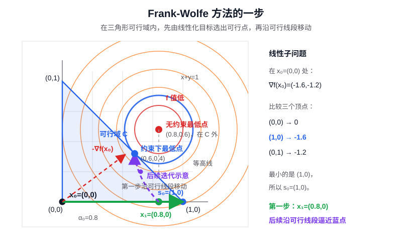

这个例子里，每一轮的线性子问题都在同一个三角形 $C$ 上求解。可行域不变，变的是线性函数的系数 $\nabla f(x_k)$。由于线性函数在三角形上没有内部谷底，所以每轮只需要比较三个顶点 $(0,0)$、$(1,0)$、$(0,1)$。

从 $x_0=(0,0)$ 出发，有

$$
\nabla f(0,0)=(-1.6,-1.2).
$$

Frank-Wolfe 不直接沿负梯度跳出去，而是先解线性子问题：

$$
s_0=\arg\min_{s\in C}(-1.6,-1.2)^\top s.
$$

比较三个顶点：

$$
(-1.6,-1.2)\cdot(0,0)=0,
$$

$$
(-1.6,-1.2)\cdot(1,0)=-1.6,
$$

$$
(-1.6,-1.2)\cdot(0,1)=-1.2.
$$

最小的是 $(1,0)$，所以

$$
s_0=(1,0).
$$

于是方向为

$$
d_0=s_0-x_0=(1,0).
$$

沿 $x_0$ 到 $s_0$ 的线段走：

$$
x_1=x_0+\alpha_0(s_0-x_0)=(\alpha_0,0),\qquad 0\le \alpha_0\le 1.
$$

把它代入原目标函数：

$$
f(\alpha_0,0)=(\alpha_0-0.8)^2+0.36.
$$

线搜索得到 $\alpha_0=0.8$，所以

$$
x_1=(0.8,0).
$$

下一轮在 $x_1$ 重新计算梯度：

$$
\nabla f(0.8,0)=(0,-1.2).
$$

线性子问题变成最小化 $(0,-1.2)^\top s$，比较三个顶点后选出

$$
s_1=(0,1),
$$

于是沿 $x_1$ 到 $s_1$ 的线段搜索：

$$
x_2=x_1+\alpha_1(s_1-x_1),\qquad 0\le \alpha_1\le 1.
$$

精确线搜索给出 $\alpha_1\approx0.366$，因此

$$
x_2\approx(0.507,0.366).
$$

第三轮继续同样的步骤。在 $x_2$ 处，

$$
\nabla f(x_2)\approx(-0.585,-0.468).
$$

比较三个顶点后，线性子问题选出

$$
s_2=(1,0).
$$

沿 $x_2$ 到 $s_2$ 线搜索，得到

$$
x_3\approx(0.584,0.309).
$$

前几轮可以概括为：

| 轮次 | 当前点 $x_k$ | 线性子问题选出的 $s_k$ | 线搜索后的新点 |
| --- | --- | --- | --- |
| 0 | $(0,0)$ | $(1,0)$ | $(0.8,0)$ |
| 1 | $(0.8,0)$ | $(0,1)$ | $(0.507,0.366)$ |
| 2 | $(0.507,0.366)$ | $(1,0)$ | $(0.584,0.309)$ |

可以看到，Frank-Wolfe 不是沿负梯度直接冲出可行域，而是每轮先用线性子问题选出一个可行点 $s_k$，再沿可行线段走一段。图中的紫色虚线表示的就是这种靠近过程。

停止时常用 Frank-Wolfe gap：

$$
g_k=\nabla f(x_k)^\top (x_k-s_k).
$$

如果 $g_k$ 很大，说明线性化模型还能在可行域里找到明显下降方向；如果 $g_k$ 接近 $0$，说明按当前梯度看，整个可行域里已经没有明显下降方向。对凸优化问题来说，这就是接近全局最优的信号。

最后确认这个例子的真正约束最优点。无约束最低点在三角形外面，所以约束最优点落在斜边 $x+y=1$ 上。令 $y=1-x$，得到

$$
\phi(x)=(x-0.8)^2+(1-x-0.6)^2
=(x-0.8)^2+(0.4-x)^2.
$$

对这个一元函数求导：

$$
\phi'(x)=2(x-0.8)+2(x-0.4)=4x-2.4.
$$

令 $\phi'(x)=0$，得到 $x=0.6$，于是 $y=0.4$。所以真正的约束最优点是

$$
x^\ast=(0.6,0.4).
$$

在这个点，

$$
\nabla f(0.6,0.4)=(-0.4,-0.4).
$$

线性子问题等价于让 $x+y$ 尽量大。由于可行域要求 $x+y\le 1$，斜边 $x+y=1$ 上的点在线性化模型里都一样好。因此 Frank-Wolfe gap 为 $0$：线性化模型已经找不到可行下降方向。这正是约束最优点的特征。

可行方向法的优点是迭代点始终有实际意义：如果每一步都可行，那么中途停止时也至少得到一个满足约束的候选解。它的困难也很明显：当可行域形状复杂时，寻找可行下降方向本身可能并不便宜；如果当前点靠近多个活跃约束，允许移动的方向会变得很窄，算法就可能前进得很慢。

#### 罚函数法

**输入信息要求**：需要能把约束违反程度写成一个可计算的罚项，从而构造罚函数 $\Phi_\rho(x)$。这要求原目标和约束至少能被评价；如果内层用梯度下降或 Newton 法，还需要罚函数的梯度或 Hessian；如果内层用直接搜索，则只需要能计算罚函数值。罚函数法不要求每个无约束子问题都有解析解。

罚函数法走的是另一条路线。它不一定要求每一步都严格可行，而是把“违反约束”这件事写进目标函数，让算法在降低原目标的同时，为违反约束付出代价。这样，有约束问题就可以被转化成一系列无约束问题。

##### 外点罚函数法

先看外点罚函数法的基本算法：

```text
给定带约束问题 min f(x)
给定一列逐渐增大的罚参数 ρ1, ρ2, ρ3, ...

for k = 1, 2, 3, ...
    1. 构造罚函数 Φ_{ρk}(x)
       原目标 f(x) + 约束违反惩罚

    2. 用无约束优化方法近似求解
       x_k ≈ argmin Φ_{ρk}(x)

    3. 如果 x_k 已经足够可行，并且变化很小
       停止，返回 x_k

    4. 增大罚参数 ρk，继续下一轮
end
```

它的核心是两层迭代：外层不断增大罚参数，让约束越来越“硬”；内层则把当前罚函数当成一个普通无约束问题去解。

例如对不等式约束 $g_i(x)\le 0$ 和等式约束 $h_j(x)=0$，可以构造外点罚函数

$$
\Phi_\rho(x)
=f(x)
+\rho\sum_i \max\{0,g_i(x)\}^2
+\rho\sum_j h_j(x)^2.
$$

这里 $\rho>0$ 是罚参数。若某个点违反了不等式约束，$\max\{0,g_i(x)\}$ 就会变成正数；若等式约束没有满足，$h_j(x)^2$ 也会产生惩罚。随着 $\rho$ 变大，违反约束的代价越来越高，无约束问题

$$
\min_x \Phi_\rho(x)
$$

的解就会被逐渐推向原问题的可行域。

看一个最简单的一维例子：

$$
\min_x (x-2)^2,\qquad \text{s.t.}\quad x\le 1.
$$

如果没有约束，最小点是 $x=2$；但它违反 $x\le 1$。所以原问题的约束最优点只能卡在边界上：

$$
x^\ast=1.
$$

外点罚函数可以写成

$$
\Phi_\rho(x)=(x-2)^2+\rho\max\{0,x-1\}^2.
$$

这里的 $\max\{0,x-1\}$ 表示只惩罚违反约束的部分：$x\le 1$ 时惩罚为 $0$，$x>1$ 时惩罚随 $x-1$ 增大。数值算法看到的不是“硬边界”，而是一个随着 $\rho$ 变大越来越陡的软惩罚。

固定一个罚参数 $\rho$ 后，$\Phi_\rho(x)$ 本身就是一个无约束优化问题。这个例子很简单，所以可以直接用 Fermat 条件，也就是令一阶导数为零，得到它的解析极小点：

$$
x_\rho=\frac{2+\rho}{1+\rho}.
$$

这里的 $x_\rho$ 表示：在罚参数固定为 $\rho$ 时，罚函数 $\Phi_\rho(x)$ 这个无约束问题的最小点。它不是原约束问题的精确解，而是“带着罚项之后，算法暂时愿意接受的最优位置”。

不过这只是这个一维二次例子太简单。一般使用罚函数法时，不一定能写出 $x_\rho$ 的解析表达式；这时就把每一个 $\min_x\Phi_{\rho_k}(x)$ 交给前面讲过的无约束数值方法来近似求解，比如梯度下降、Newton 法或直接搜索。实际计算时，不是只解一次问题，而是选一组越来越大的罚参数，反复求解对应的无约束子问题：

| 计算轮次 | 罚参数 $\rho$ | 本轮要求解的无约束问题 | 得到的 $x_\rho$ |
| ---: | ---: | --- | ---: |
| 1 | 1 | $\min_x\ (x-2)^2+1\cdot\max\{0,x-1\}^2$ | 1.500 |
| 2 | 4 | $\min_x\ (x-2)^2+4\cdot\max\{0,x-1\}^2$ | 1.200 |
| 3 | 9 | $\min_x\ (x-2)^2+9\cdot\max\{0,x-1\}^2$ | 1.100 |
| 4 | 99 | $\min_x\ (x-2)^2+99\cdot\max\{0,x-1\}^2$ | 1.010 |

如果把这些计算结果单独列出来，趋势更明显：

| 罚参数 $\rho$ | 罚函数极小点 $x_\rho$ | 是否接近可行边界 $x=1$ |
| ---: | ---: | --- |
| 1 | 1.500 | 还明显在外面 |
| 4 | 1.200 | 更靠近边界 |
| 9 | 1.100 | 已经很接近 |
| 99 | 1.010 | 几乎贴近边界 |

这个例子也暴露了外点罚函数法的一个重要特点：有限罚参数下，数值解通常并不会严格落在可行边界上。因为

$$
x_\rho=\frac{2+\rho}{1+\rho}
=1+\frac{1}{1+\rho},
$$

所以只要 $\rho$ 是有限正数，就有

$$
x_\rho>1.
$$

也就是说，在这个例子里，每一个有限罚参数对应的无约束解其实都还在可行域外面，只是违反量

$$
x_\rho-1=\frac{1}{1+\rho}
$$

越来越小。只有当 $\rho\to\infty$ 时，$x_\rho$ 才在极限意义下趋向真正的约束最优点 $x^\ast=1$。

所以，罚函数法不是一次把约束问题神奇地解掉，而是通过一串无约束问题逐步逼近原来的约束最优点。实际计算中，我们通常接受一个“约束违反足够小”的近似解，或者再配合可行化、投影、乘子法等手段改善可行性。这也是为什么单纯把罚参数一路调大并不总是好办法：罚参数越大，约束违反越小，但问题也可能变得越来越病态。

这里的“外点”容易让人误解，好像算法必须从可行域外面开始。其实不是。外点罚函数法的意思是：它允许迭代点在可行域外面，并通过罚项把违反约束的点往可行域方向推。初始点可以在外面，也可以在里面。

如果初始点已经在可行域内部，外点罚函数法仍然可以用，大概会出现下面几种情况。

第一种情况，原目标函数本身就想把点留在可行域内部。比如无约束最小点本来就满足约束，那么罚项一直是 $0$，外点罚函数法基本退化成普通无约束优化，最后会停在内部的最优点附近。

第二种情况，也是更常见的情况：原目标函数想把点往可行域外拉，而罚项负责把它往回推。刚开始罚参数 $\rho$ 比较小时，罚项不够强，算法可能从内部走到外部；随着 $\rho$ 变大，越界的代价越来越高，后面的无约束子问题会把解推回边界附近。前面这个例子就是这样：即使从 $x_0=0.5$ 这样的可行内点出发，罚函数 $\Phi_\rho(x)$ 的最小点仍然可能在 $x>1$，只是随着 $\rho$ 增大越来越靠近 $1$。

第三种情况，内层无约束算法本身也可能产生中间迭代点。即使某一轮罚函数的最终近似解接近可行域，内层求解过程中也不保证每一步都可行。所以外点罚函数法的特点不是“必须从外点出发”，而是“不要求始终可行”。它适合把约束违反逐步压小，但如果你希望每一步都有可行意义，就要用可行方向法、投影方法或内点方法。

##### 内点罚函数法

内点罚函数法，也常叫障碍函数法，则要求从可行域内部出发，并用一个会在边界附近变得很大的项阻止迭代点越过边界。比如对 $g_i(x)<0$，常见障碍项是

$$
-\frac{1}{t}\sum_i \log(-g_i(x)).
$$

当 $x$ 接近边界 $g_i(x)=0$ 时，$\log(-g_i(x))$ 会趋向 $-\infty$，整个障碍项会趋向 $+\infty$，算法自然不愿意撞到边界上。

罚函数法的好处是可以复用无约束优化工具，把复杂约束包装进目标函数里。它的代价是数值稳定性会变得敏感：罚参数太小，约束压不住；罚参数太大，问题可能变得病态，Hessian 条件数很差，迭代反而困难。增广拉格朗日法就是对这个问题的改进，它把罚函数和拉格朗日乘子结合起来，既惩罚约束违反，又显式更新乘子，通常比单纯把罚参数一路调大更稳定。

这些方法的共同思想是：有约束优化不能只看下降，还要同时处理可行性。算法设计的关键在于怎样平衡目标函数下降、约束满足程度和数值稳定性。

## 四、正则化、约束与对偶性

前面几节主要在讲“怎样找到极小点”。但很多实际问题里，光找到一个让目标函数小的解还不够。我们还会关心这个解是不是稳定、是不是太大、是不是太复杂、是不是对扰动过于敏感。正则化、约束和对偶性，就是围绕这些问题发展出来的语言。

### 正则化

#### 给最优解加上偏好

正则化的直觉很简单：在原来的目标函数之外，再加一个偏好项。典型形式是

$$
\min_x f(x)+\lambda R(x).
$$

这里 $f(x)$ 是原目标，$R(x)$ 衡量我们不希望出现的东西，比如解太大、变化太剧烈、结构太复杂。$\lambda>0$ 控制这种偏好有多强。作为软约束时，$\lambda$ 通常是人为设定和调节的超参数。

这个形式看起来很像拉格朗日函数，但两者的出发点不一样。正则化里的 $\lambda$ 通常是我们人为选择的偏好强度，也就是一个超参数：我愿意为了让解更小、更平滑、更稳定，牺牲多少原目标函数值。拉格朗日乘子里的 $\lambda$ 则通常来自约束问题本身，是和最优点一起由方程求出来的量，用来描述某个约束在最优点处的作用强度。也就是说，正则化是主动给目标函数加偏好；拉格朗日法是把已经存在的约束转写进目标函数。

比如

$$
\min_x (x-2)^2+\lambda x^2.
$$

第一项希望 $x$ 接近 $2$，第二项希望 $x$ 不要太大。$\lambda$ 越大，第二种要求越强，最后得到的 $x$ 就越会被往 $0$ 的方向拉。这个例子想说明的是：正则化不是附加装饰，它会改变“什么样的解更好”。

#### 软约束和硬约束

同一个偏好，也可以不放进目标函数，而是写成约束：

$$
\min_x f(x)
\quad
\text{s.t.}\quad R(x)\le c.
$$

这句话的意思是：我仍然想让 $f(x)$ 尽量小，但只允许选择那些 $R(x)$ 不太大的解。

这就引出两种写法的区别。正则化形式

$$
\min_x f(x)+\lambda R(x)
$$

像是软约束：可以让 $R(x)$ 大一点，但大了要付出代价。这里的 $\lambda$ 是人为设定的超参数，用来控制惩罚力度，回答的是“我愿意用多少目标函数值，换一个更规整的解”。

约束形式

$$
\min_x f(x)
\quad
\text{s.t.}\quad R(x)\le c
$$

像是硬约束：超过范围的点直接不能选。这里的 $c$ 控制允许范围，回答的是“解最多只能复杂到什么程度”。

所以二者的差别可以这样理解：正则化形式改变的是目标函数，它仍然在所有 $x$ 里搜索，只是让不喜欢的解变贵；约束形式改变的是可行域，它先把不允许的点排除掉，再在剩下的点里优化。前者更像偏好，后者更像规则。

#### 例子：传感器标定中的参数大小

假设我们在做一个传感器标定问题，需要用参数向量 $x$ 去拟合一组实验数据。$f(x)$ 表示拟合误差，越小越好。但工程上我们不希望参数太大，因为过大的参数可能意味着系统对噪声很敏感，或者执行器需要过高的增益。

一种写法是把这个偏好放进目标函数：

$$
\min_x f(x)+\lambda \|x\|^2.
$$

这里 $\|x\|^2$ 惩罚过大的参数，$\lambda$ 是人为设定的超参数，控制我们有多在意“参数不要太大”。这是一种软约束：参数可以大，但大了要付出额外代价。

另一种写法是直接限制参数大小：

$$
\min_x f(x)
\quad
\text{s.t.}\quad \|x\|^2\le c.
$$

这就是硬约束：只允许在半径不超过某个范围的参数集合里找最小拟合误差。两种写法背后的工程想法是一样的：不要为了把误差压低一点点，就选择一个过大、过敏感、不稳定的参数。

#### 例子：软约束和硬约束的手算比较

为了能直接算，把这个标定问题简化成一个参数 $x$。假设实验拟合误差是

$$
f(x)=(x-2)^2.
$$

没有任何限制时，最小点是 $x=2$。现在工程上觉得参数太大不稳，希望把它压小。

先看软约束写法。取 $\lambda=1$：

$$
\min_x (x-2)^2+x^2.
$$

对目标函数求导：

$$
2(x-2)+2x=0.
$$

所以

$$
4x-4=0,\qquad x=1.
$$

软约束的意思是：$x$ 不是不能超过某个范围，而是越大惩罚越重。这里原目标想选 $2$，正则项想把 $x$ 往 $0$ 拉，最后折中到 $1$。

再看硬约束写法。直接规定参数大小不能超过 $1$：

$$
\min_x (x-2)^2
\quad
\text{s.t.}\quad x^2\le 1.
$$

约束 $x^2\le 1$ 等价于 $-1\le x\le 1$。在这个区间里，$(x-2)^2$ 离 $2$ 越近越小，所以最优点是右端点

$$
x=1.
$$

在这个例子里，软约束取 $\lambda=1$ 和硬约束取 $c=1$ 恰好给出同一个解 $x=1$。但这不是说两种写法永远自动等价，而是说：在某些条件下，合适的 $\lambda$ 可以对应某个合适的约束半径 $c$。一个是调惩罚力度，一个是调允许范围。

它们不是在所有情况下都完全等价，但表达的是相近的思想：不要只追求目标函数小，还要控制解的形状、大小或复杂度。

### 对偶性

#### 把约束换一个角度看

对偶性听起来抽象，但它的起点其实很自然：约束不仅是限制，也可以被看成一种“价格”或“惩罚”。如果某个约束很紧，它对最优解影响很大；如果某个约束根本没有碰到，它的影响就很小。

先从一个标准的最小化问题开始：

$$
\min_x f(x)
\quad
\text{s.t.}\quad
g_i(x)\le 0,\qquad h_j(x)=0.
$$

通常用 $\lambda_i\ge 0$ 表示不等式约束 $g_i(x)\le 0$ 对应的乘子，用 $\nu_j$ 表示等式约束 $h_j(x)=0$ 对应的乘子。拉格朗日函数把目标函数和约束放在一起：

$$
L(x,\lambda,\nu)
=f(x)+\sum_i\lambda_i g_i(x)+\sum_j\nu_j h_j(x).
$$

这里有两个层次。原问题是在变量 $x$ 上优化；对偶问题则把乘子 $\lambda,\nu$ 当成新的变量。构造对偶函数时，先固定一组乘子，把 $L(x,\lambda,\nu)$ 暂时看成关于 $x$ 的函数，然后对所有 $x$ 取下确界。下确界用符号 $\inf$ 表示，可以先理解成“能压到的最低下界”：

$$
q(\lambda,\nu)=\inf_x L(x,\lambda,\nu).
$$

这个 $q(\lambda,\nu)$ 叫对偶函数。把这个符号拆开看：

- $\lambda,\nu$ 先固定住，不参与这一层优化；
- $\inf_x$ 表示让 $x$ 在它允许的整个取值空间里变化，寻找 $L(x,\lambda,\nu)$ 的下确界；
- 得到的结果只依赖于固定住的 $\lambda,\nu$，所以记成 $q(\lambda,\nu)$；
- $\min$ 要求最低值真的由某个 $x$ 取到；$\inf$ 不要求取到，只记录函数值能逼近到的最低下界；
- 如果这个下确界真的由某个 $x$ 取到，那么 $\inf$ 和 $\min$ 在数值上相同；如果取不到，就只能用 $\inf$ 表示。

这样得到的 $q$ 已经不是关于 $x$ 的函数了，而是关于乘子的函数。直观地说，它在问：如果我给每条约束指定一组价格，那么这组价格能给原问题提供一个多高的下界？

为什么 $q$ 可以看成一个界？如果 $x$ 是可行点，那么 $g_i(x)\le 0$、$h_j(x)=0$。又因为 $\lambda_i\ge 0$，所以每一项 $\lambda_i g_i(x)\le 0$；而等式约束项里，不管 $\nu_j$ 取什么值，都有 $\nu_j h_j(x)=0$。因此

$$
\sum_i\lambda_i g_i(x)\le 0,\qquad \sum_j\nu_j h_j(x)=0.
$$

代回拉格朗日函数，对任意可行点都有

$$
L(x,\lambda,\nu)
=f(x)+\sum_i\lambda_i g_i(x)+\sum_j\nu_j h_j(x)
\le f(x)+0+0
=f(x).
$$

而 $q(\lambda,\nu)$ 是 $L$ 对所有 $x$ 的下确界，所以对任意 $x$ 都有

$$
q(\lambda,\nu)\le L(x,\lambda,\nu).
$$

特别地，如果 $x$ 是可行点，就有

$$
q(\lambda,\nu)
\le L(x,\lambda,\nu)
\le f(x).
$$

这句话的意思是：同一个 $q(\lambda,\nu)$ 小于等于每一个可行点的 $f(x)$。既然它小于等于每一个候选值，那么它当然也小于等于这些候选值里面最小的那个。所有可行点的目标函数值可以看成一个集合：

$$
\{f(x): g_i(x)\le 0,\ h_j(x)=0\}.
$$

这个集合里最小的值，就是原问题的最优值。因此对所有可行点取最小值，得到

$$
q(\lambda,\nu)
\le
\inf_{x:\ g_i(x)\le 0,\ h_j(x)=0} f(x)
=p^\ast.
$$

这里 $p^\ast$ 表示原问题的最优值。于是，对偶函数给原问题最优值提供了一个下界。

这时为什么突然变成最大化？因为我们不是在最小化原目标函数，而是在寻找“最好的下界”。原问题的最优值 $p^\ast$ 是一个我们想接近的数；每组乘子 $(\lambda,\nu)$ 都给出一个不超过 $p^\ast$ 的数 $q(\lambda,\nu)$。如果一个下界太低，比如真正最优值是 $10$，但你只证明了它至少大于 $1$，这个界就很松；如果你能证明它至少大于 $9.9$，这个界就有用得多。

所以，对偶问题是在所有下界里挑最高的那个。下界越高，越贴近原问题的最优值。于是对偶问题写成

$$
\max_{\lambda\ge 0,\nu} q(\lambda,\nu).
$$

这并不矛盾：原问题是在找最小的函数值，对偶问题是在找最大的下界。一个从上面往下找最小值，一个从下面往上逼近它。换句话说，原问题问的是：在所有满足约束的点里，哪个点让目标函数最小？对偶问题问的是：怎样选择约束的价格，使得由这些价格给出的下界尽可能高、尽可能贴近原问题的最优值？

#### 例子：一个能直接算的对偶问题

再看一个同时含有等式约束和不等式约束、但仍然能直接算的小例子：

$$
\min_{x,y}\ x^2+y^2
\quad
\text{s.t.}\quad x+y=1,\qquad x\ge 0.8.
$$

这里的等式约束 $x+y=1$ 把可行点限制在一条直线上；不等式约束 $x\ge 0.8$ 又要求这条直线上的点不能落到 $x<0.8$ 的那一侧。

为了写拉格朗日函数，先把不等式约束改成标准形式

$$
0.8-x\le 0.
$$

对不等式约束引入乘子 $\lambda\ge 0$，对等式约束引入乘子 $\nu$，得到

$$
L(x,y,\lambda,\nu)
=x^2+y^2+\lambda(0.8-x)+\nu(x+y-1).
$$

现在按对偶问题的步骤来。第一步，固定 $\lambda,\nu$，把 $L$ 看成关于 $x,y$ 的函数，并对 $x,y$ 取下确界。由于这里是二次函数，可以直接令偏导数为 $0$：

$$
\frac{\partial L}{\partial x}=2x-\lambda+\nu=0,
\qquad
\frac{\partial L}{\partial y}=2y+\nu=0.
$$

于是

$$
x=\frac{\lambda-\nu}{2},
\qquad
y=-\frac{\nu}{2}.
$$

把这两个表达式代回拉格朗日函数，就得到只关于乘子 $\lambda,\nu$ 的对偶函数：

$$
q(\lambda,\nu)
=0.8\lambda-\nu
-\frac{(\nu-\lambda)^2}{4}
-\frac{\nu^2}{4}.
$$

第二步，对偶问题是最大化这个下界：

$$
\max_{\lambda\ge 0,\ \nu\in\mathbb{R}}
\left(
0.8\lambda-\nu
-\frac{(\nu-\lambda)^2}{4}
-\frac{\nu^2}{4}
\right).
$$

这个问题仍然只是一个关于 $\lambda,\nu$ 的二次优化问题。先对 $\nu$ 求偏导：

$$
\frac{\partial q}{\partial \nu}
=-1-\frac{\nu-\lambda}{2}-\frac{\nu}{2}
=0,
$$

得到

$$
\nu=\frac{\lambda}{2}-1.
$$

再对 $\lambda$ 求偏导：

$$
\frac{\partial q}{\partial \lambda}
=0.8+\frac{\nu-\lambda}{2}
=0,
$$

得到

$$
\lambda-\nu=1.6.
$$

联立两个方程，解得

$$
\lambda^\ast=1.2,
\qquad
\nu^\ast=-0.4.
$$

此时对偶函数值为

$$
q(1.2,-0.4)=0.68.
$$

再由前面的关系

$$
x=\frac{\lambda-\nu}{2},
\qquad
y=-\frac{\nu}{2},
$$

得到

$$
x^\ast=0.8,\qquad y^\ast=0.2.
$$

代回原目标函数：

$$
(x^\ast)^2+(y^\ast)^2
=0.8^2+0.2^2
=0.68.
$$

这就和对偶问题的最优值对上了。原问题是在满足 $x+y=1$、$x\ge 0.8$ 的点里找最小值；对偶问题是在乘子 $\lambda,\nu$ 里找最好的约束价格。这个例子里二者给出同一个最优值，所以对偶间隙为 $0$。

下面两张图画的是同一个问题的两个侧面。原问题在 $(x,y)$ 平面里看：目标函数的等高线是一圈圈圆，约束把可行点限制在直线 $x+y=1$ 上，并且还要求 $x\ge 0.8$。因此，最优点是这条可行直线最先碰到的那条低等高线上的点。

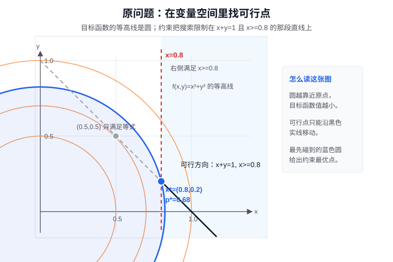

对偶问题不直接在 $(x,y)$ 平面里找点，而是在 $(\lambda,\nu)$ 这个乘子空间里找一个最好的下界。每一组乘子都会给出一个对偶函数值 $q(\lambda,\nu)$，它不会超过原问题的最优值；对偶问题要做的，是把这个下界尽量抬高。这个例子里最高下界正好是 $0.68$，和原问题最优值相等。

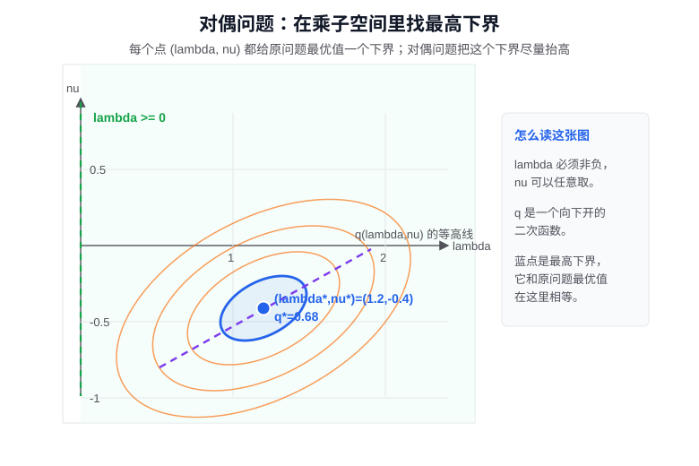

这个例子也说明了对偶问题为什么不是随便造出来的。我们先用拉格朗日函数把约束写进目标，再通过 $\inf_{x,y} L(x,y,\lambda,\nu)$ 消去原变量 $x,y$，最后得到一个只关于乘子的优化问题。原问题从“点 $(x,y)$”出发，对偶问题从“约束价格 $\lambda,\nu$”出发，两者是在看同一个优化问题的两个侧面。

#### 例子：资源约束的影子价格

这里要特别强调：影子价格本身首先是一种**分析约束的技术**，不是先有一个市场价格，再把它搬进数学里。

它借助拉格朗日乘子回答的是三个数学问题：哪条约束真的限制了最优解？如果把这条约束稍微放松一点，最优值会改善多少？如果把它稍微收紧一点，最优值又会损失多少？经济学里的“价格”说法，只是这种约束敏感性分析在资源配置问题中的一种解释。

影子价格不用另外换一个复杂例子，直接看上面这个问题就够了：

$$
\min_{x,y}\ x^2+y^2
\quad
\text{s.t.}\quad x+y=1,\qquad x\ge 0.8,
$$

我们已经算出最优点是

$$
x^\ast=0.8,\qquad y^\ast=0.2,
$$

最优值是

$$
p^\ast=0.68,
$$

对应不等式约束 $x\ge 0.8$ 的最优乘子是

$$
\lambda^\ast=1.2.
$$

这个 $\lambda^\ast=1.2$ 到底是什么意思？它说的是：如果约束边界 $x\ge 0.8$ 稍微动一下，最优值大约会动多少。

比如把约束收紧一点，从

$$
x\ge 0.8
$$

改成

$$
x\ge 0.81.
$$

因为还要满足 $x+y=1$，新的边界点就是

$$
x=0.81,\qquad y=0.19.
$$

新的目标函数值是

$$
0.81^2+0.19^2=0.6922.
$$

原来是 $0.68$，现在增加了

$$
0.6922-0.68=0.0122.
$$

边界只收紧了 $0.01$，最优值大约增加了 $0.012$。这和

$$
1.2\times 0.01=0.012
$$

非常接近。

反过来，如果把约束放松一点，从 $x\ge 0.8$ 改成 $x\ge 0.79$，新的边界点是

$$
x=0.79,\qquad y=0.21,
$$

目标函数值变成

$$
0.79^2+0.21^2=0.6682.
$$

它比原来的 $0.68$ 小了

$$
0.68-0.6682=0.0118,
$$

也大约等于

$$
1.2\times 0.01=0.012.
$$

所以，$\lambda^\ast=1.2$ 可以读成一句很朴素的话：在当前最优点附近，如果把约束边界收紧 $0.01$，最优值大约变差 $0.012$；如果把约束边界放松 $0.01$，最优值大约改善 $0.012$。

这就是“影子价格”。它不是市场上真实标出来的价格，而是优化问题自己告诉我们的边际价格：某个约束多卡一点，最优值会损失多少；某个约束放宽一点，最优值会改善多少。

也可以把这个例子直接理解成一个资源分配问题。总资源是 $1$，必须在两个用途之间分配，所以有

$$
x+y=1.
$$

目标函数 $x^2+y^2$ 可以理解成“分配得太偏时产生的代价”：某个用途拿得越多，它对应的平方代价增长越快。如果没有 $x\ge 0.8$ 这个要求，最自然的分配是

$$
x=0.5,\qquad y=0.5,
$$

因为这样最均衡，代价最低。

但是现在额外要求

$$
x\ge 0.8.
$$

这相当于说：用途 $x$ 至少要拿到 $80\%$ 的资源。这个要求会强行把分配从 $(0.5,0.5)$ 推到 $(0.8,0.2)$，代价也从均衡分配时的 $0.5$ 提高到 $0.68$。因此，这条约束确实“卡住”了最优解。

这时 $\lambda^\ast=1.2$ 就可以理解为提高最低配额的边际代价：如果把 $x$ 的最低要求从 $80\%$ 提高到 $81\%$，最优代价大约增加 $0.012$；如果把最低要求从 $80\%$ 降到 $79\%$，最优代价大约减少 $0.012$。所以影子价格不是另外讲一个抽象概念，而是在回答一个很具体的问题：这条最低配额约束，每多卡一点，会让最优目标值变坏多少？

这也解释了互补松弛的直觉：没有卡住最优点的约束，不应该有正的影子价格。比如在这个例子里，如果约束只是 $x\ge 0.4$，那么没有这个不等式时的最优点 $(0.5,0.5)$ 已经满足它；这条约束没有真正限制最优点，稍微改动它也不会影响最优值，所以对应乘子应该是 $0$。

现实经济系统里，一个很好的例子是电力市场里的节点边际电价。电网调度本质上也是一个优化问题：在满足各地用电需求的同时，尽量用成本低的发电机组供电；但电不能随便从任何地方送到任何地方，输电线路有容量上限。

如果线路不拥堵，便宜电厂的电可以比较顺畅地送到需要用电的地方，各个地点的电价差异就不会太大。可是一旦某条输电线路被用满，便宜电送不过去，系统就不得不启用当地更贵的发电机组。于是，同样是一度电，在不同地点的价格会变得不一样。

这个价格差背后就有影子价格的味道：被用满的输电线路是一条真正卡住最优调度的约束。如果这条线路能多传一点电，系统总发电成本就可能下降；它的影子价格衡量的就是“线路容量多放宽一点，最优调度能省下多少成本”。所以现实中的某些电价差异，并不只是市场随便定价，而是物理约束进入优化问题以后产生的价格信号。

这也是影子价格让人恍然大悟的地方：世界上很多价格并不是直接给某个商品本身定价，而是在给一个看不见的限制条件定价。输电线路的容量、机场跑道的时段、城市道路的拥堵空间、碳排放额度，本质上都可能因为“卡住了最优选择”而获得影子价格。

需要注意的是，影子价格是局部概念。它说的是“约束边界稍微变一点”时最优值的一阶变化，不能理解成无论放宽多少都永远按同一个价格变化。约束形式、单位选择、最大化还是最小化，都会影响乘子的符号解释；但背后的思想不变：对偶变量描述的是约束对最优值的边际作用。

#### 对偶问题是不是更容易

这个例子之后，要避免一个误解：对偶问题不一定比原问题变量更少，也不一定天然更容易。原问题的变量是 $x,y$，对偶问题的变量是 $\lambda,\nu$。在这个小例子里，两边都是两个变量，所以看起来只是换了一套坐标。

一般来说，如果原问题有很多约束，对偶问题里就会出现很多乘子。一个等式约束对应一个等式乘子，一个不等式约束对应一个非负乘子。因此，约束越多，对偶空间的维度也可能越高。对偶问题不是一种保证“降维”的魔法。

那为什么还要引入对偶问题？关键不在于变量一定变少，而在于问题的结构可能变得更清楚。原问题是在可行点里找最小值，对偶问题是在所有下界里找最高的下界。只要弱对偶成立，就有

$$
d^\ast\le p^\ast,
$$

其中 $p^\ast$ 是原问题最优值，$d^\ast$ 是对偶问题最优值。也就是说，对偶问题至少能告诉我们：原问题的最优值不可能低于 $d^\ast$。

如果我们在原问题里找到一个可行点 $\hat{x}$，它的目标函数值是 $f(\hat{x})$，同时对偶问题给出一个下界 $d^\ast$，那么一定有

$$
d^\ast\le p^\ast\le f(\hat{x}).
$$

右边的 $f(\hat{x})$ 是一个可行解给出的上界，左边的 $d^\ast$ 是对偶问题给出的下界。两者之间的差

$$
f(\hat{x})-d^\ast
$$

可以看成一个最优性误差证书。如果这个差很小，即使没有精确解出原问题，也可以说当前解已经非常接近最优。

更强的情况是强对偶成立，也就是

$$
d^\ast=p^\ast.
$$

这时，对偶问题就真的可以用来求原问题的最优值。前面的例子里，对偶问题最大化 $q(\lambda,\nu)$ 得到 $0.68$，原问题最小值也是 $0.68$，所以从对偶问题出发也能算出原问题的最优值。

有时对偶问题还可能比原问题更适合计算。原问题也许有复杂约束，变量之间绑得很紧；构造拉格朗日函数以后，某些变量可以通过 $\inf_x L$ 被消掉，问题就变成关于乘子的优化。有些算法正是利用这一点，把一个难问题拆成“先固定价格，再优化变量；再调整价格”的过程。

所以，对偶问题的价值可以概括成三点：它有时能直接帮我们求最优值；即使不能直接求出最优值，也能提供一个下界，帮助判断当前解离最优还有多远；同时，它还能解释约束本身的作用，让我们看清哪些约束真正重要。

#### 对偶性的数学思想

所谓对偶原理，最朴素地说，就是：一个数学问题常常有两种互相配对的表述。它们站在不同位置说话，用的对象也不同，但描述的是同一套结构。一个表述叫原问题，另一个表述叫对偶问题；如果二者配合得足够好，就可以从其中一边读出另一边的信息。

对偶思想不是简单的“换个名字”，而是把问题翻到一个互补的角度。原来的问题可能关心对象本身，对偶问题则关心限制这个对象的条件；原来的问题可能关心点，对偶问题则关心边界；原来的问题可能关心一个最小值，对偶问题则关心能够逼近这个最小值的界。两边看起来不同，但中间有一套翻译关系。

这种思想之所以重要，是因为很多问题正面看太复杂。直接找对象本身，可能无从下手；但如果研究它必须满足的所有限制、它对外部测试的所有反应、它能被哪些不等式夹住，结构反而会显露出来。对偶原理的力量就在这里：它不一定让问题变小，但常常让问题变得可分析。

从数学思想史看，对偶性反复出现，是因为数学一直在处理“对象”和“刻画对象的方式”之间的关系。一个对象可以由内部组成来描述，也可以由外部作用来描述；可以由它包含什么来描述，也可以由什么限制它来描述；可以由直接构造来描述，也可以由所有可能的检验来描述。对偶原理把这些互补描述组织成一对问题，并研究这两边什么时候等价、什么时候有间隙、什么时候一边比另一边更容易。

在优化里，对偶原理的形式尤其清楚。原问题问：在约束允许的范围内，哪个点让目标函数最小？用数学语言说，它是在可行目标函数值里取一个下确界：

$$
p^\ast=\inf\{f(x):x\ \text{满足约束}\}.
$$

对偶问题问的是另一件事：能不能利用约束构造一族不等式，让每一个不等式都给 $p^\ast$ 一个下界？每一组合法乘子都会给出一个下界 $q(\lambda,\nu)$，也就是

$$
q(\lambda,\nu)\le p^\ast.
$$

这些下界有的很低，有的比较贴近真正的最优值。于是对偶问题要做的，就是在所有这些下界里取上确界：

$$
d^\ast=\sup_{\lambda,\nu} q(\lambda,\nu).
$$

所以你看到的那个结构是对的：优化对偶的核心，就是**找到一族不等式下界，再用这些下界的上确界去逼近原问题的下确界**。强对偶成立时，这个上确界正好等于原问题的下确界：

$$
\sup_{\lambda,\nu} q(\lambda,\nu)
=
\inf\{f(x):x\ \text{满足约束}\}.
$$

于是，原问题是从变量空间往下找，对偶问题是从约束和乘子那里往上托。强对偶成立时，这两种方向最后碰到同一个数。

所以，对偶性的哲学不是“万物都有一个神秘反面”，而是更朴素也更有力的一句话：一个对象不只由它自己决定，也由它怎样被限制、怎样被测量、怎样被检验来决定。对偶原理就是把这种互补关系变成可计算、可证明、可比较的数学结构。

#### 对偶性的几个基本性质

对偶性背后有几条很重要的数学性质。这里先定性理解，不展开严格证明。

第一是弱对偶。对最小化问题来说，对偶问题给出原问题最优值的下界。也就是说，对偶问题算出来的值不会超过原问题真正能达到的最小值。这个性质很基础，即使原问题不是凸的，弱对偶也常常成立。

第二是对偶间隙。原问题的最优值和对偶问题的最优值之间，可能有差距，这个差距叫对偶间隙。如果这个差距为 $0$，就叫强对偶。强对偶的意思是：从原问题看和从对偶问题看，最后得到的是同一个最优值。

第三是强对偶的条件。在凸优化里，只要条件足够好，强对偶经常成立。这也是为什么凸优化特别重要：它不只是“局部极小就是全局极小”，还让约束、乘子和对偶之间的关系变得非常干净。到了非凸问题里，对偶间隙可能不为零，对偶问题给出的就只是一个有用但不一定精确的参考。

第四是互补松弛。它说的是：不等式约束如果没有卡住最优点，那么对应的乘子应该为 $0$；只有真正卡住最优点的活跃约束，乘子才可能不为 $0$。这和前面 KKT 条件里的互补松弛是同一件事。

第五是鞍点性质。在条件良好的凸优化问题里，原问题最优解和对偶问题最优解可以一起看成拉格朗日函数的一个鞍点：对原变量来说不能再下降，对乘子来说也不能再改进。这给 KKT 条件提供了另一种理解：最优点不是单方面的极小，而是“变量选择”和“约束价格”之间达到了平衡。

## 五、凸优化

前面几节一直在提醒一件事：一般优化问题很难。一个函数可能有很多局部极小点、鞍点和奇怪的边界行为；算法停下来时，我们常常只能说“这里看起来不能继续下降”，却不能立刻说“这就是全局最优”。

凸优化重要，就重要在它给出了一类结构特别好的问题。在这类问题里，局部判断可以升级成全局判断，约束和对偶的关系也变得更干净。它不是某一个具体算法，而是一套判断问题是否“好解”的数学语言。

### 凸集：线段不会跑出去

先看可行域。一个集合 $C$ 称为凸集，意思是：任意取其中两个点 $x,y\in C$，连接它们的整条线段仍然留在 $C$ 里。用公式写就是，对任意 $0\le t\le 1$，

$$
tx+(1-t)y\in C.
$$

这句话的几何意思很简单：在集合内部任意两点之间直走，不会走出集合。圆盘、线段、三角形、矩形、半平面都是凸集；月牙形、环形、两个分开的区域就不是凸集。

凸集的重要性在于，它让“可行方向”变得稳定。如果两个方案都满足约束，那么它们之间的折中方案也满足约束。这对优化非常关键，因为很多算法本质上都在做一件事：从一个可行点出发，向另一个更好的可行方向移动。如果可行域是凸的，中间过程就不容易突然掉出可行域。

### 凸函数：图像在弦线下方

再看目标函数。一个函数 $f$ 是凸函数，意思是：任意两个点之间，函数图像不会高过连接这两个函数值的直线。公式写成

$$
f(tx+(1-t)y)
\le
tf(x)+(1-t)f(y),
\qquad 0\le t\le 1.
$$

这就是 Jensen 不等式的基本形式。它表达的是一种“向上弯”的形状：一维里像碗，多维里像一个没有坑坑洼洼的碗形地形。注意这里说的是整体形状，不是某一个点附近的形状。

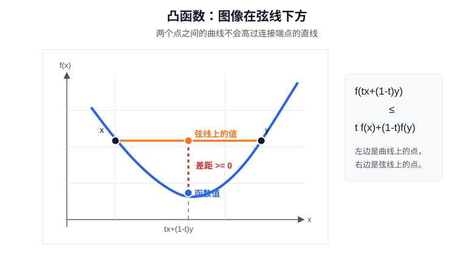

如果 $f$ 可微，凸性还有一个非常重要的一阶刻画：

$$
f(y)\ge f(x)+\nabla f(x)^\top (y-x).
$$

右边是函数在 $x$ 处的一阶 Taylor 线性近似。这个不等式说：凸函数的切平面永远在函数图像下方。也就是说，任何一点处的一阶近似，都可以给整个函数提供一个全局下界。这正是凸优化和对偶性能够配合得很好的原因。

### 为什么局部极小就是全局极小

凸优化最核心的结论是：如果 $f$ 是凸函数，$C$ 是凸集，那么问题

$$
\min_{x\in C} f(x)
$$

中的任何局部极小点，都是全局极小点。

直观地说，如果某个点只是局部最低，但远处还有一个更低的点，那么连接这两个点的线段仍然在凸集里。由于函数是凸的，沿这条线段走，函数值不会先无缘无故升高再降到更低处；它必须表现出某种整体下降趋势。这样一来，原来的点附近就应该能找到下降方向，和“局部极小”矛盾。

这就是凸优化和一般非凸优化的根本差别。非凸问题里，算法可能被局部极小点困住；凸问题里，只要你真的找到了局部极小点，就已经找到了全局极小点。对学习优化理论的人来说，这是一个非常大的简化。

### 一阶最优性条件

在无约束光滑凸优化中，最优性条件尤其干净。若 $f$ 可微且凸，那么

$$
\nabla f(x^\ast)=0
$$

不仅是局部极小点的必要条件，也是全局极小点的充分条件。

原因来自刚才的一阶刻画。对任意 $y$，凸性给出

$$
f(y)\ge f(x^\ast)+\nabla f(x^\ast)^\top (y-x^\ast).
$$

如果 $\nabla f(x^\ast)=0$，右边就变成

$$
f(y)\ge f(x^\ast).
$$

这说明所有点的函数值都不小于 $f(x^\ast)$，所以 $x^\ast$ 是全局极小点。这里的逻辑非常漂亮：一阶信息本来只是局部信息，但在凸性帮助下，它变成了全局结论。

如果有约束，情况也类似。最优点不一定满足 $\nabla f(x^\ast)=0$，因为可行域可能挡住了下降方向。此时一阶条件通常写成

$$
\nabla f(x^\ast)^\top (y-x^\ast)\ge 0,
\qquad \forall y\in C.
$$

这句话的意思是：从 $x^\ast$ 出发，朝任何可行点 $y$ 的方向看，一阶变化都不能让函数下降。换句话说，不是没有下降方向，而是所有可行方向都不再下降。

### 严格凸和强凸

凸函数还可以继续加强。严格凸比普通凸更强，它要求两点之间的函数值严格低于弦线。直观地说，严格凸函数不会出现一整段平底。因此，如果严格凸问题有最优解，这个最优解通常是唯一的。

强凸更进一步。它不仅要求函数向上弯，还要求至少有一定程度的弯曲。可以粗略理解为：碗底不能太平。强凸常写成

$$
f(y)\ge f(x)+\nabla f(x)^\top (y-x)+\frac{\mu}{2}\|y-x\|^2,
\qquad \mu>0.
$$

最后多出来的二次项说明，函数不只是躺在切平面上方，而且至少要比切平面高出一个二次量。强凸对算法收敛分析非常有用，因为它排除了过于平坦的谷底，让最优点附近的形状更稳定。

### 凸优化中的对偶性

对偶性在凸优化里特别重要，因为凸性让很多原本只是“下界”的东西变得精确。在一般非凸问题里，对偶问题可能只能给原问题一个较松的下界；但在条件合适的凸问题里，强对偶经常成立，原问题最优值和对偶问题最优值相等。

这也是为什么前面讲正则化、约束、KKT 和影子价格时，很多结论都要在凸优化里才最干净。凸性让局部最优变成全局最优，让 KKT 条件从必要条件变成充分条件，也让对偶问题不只是一个参考下界，而可能成为真正的求解方法。

### 次梯度：没有普通导数时怎么办

凸函数不一定处处光滑。最简单的例子是

$$
f(x)=|x|.
$$

它在 $x=0$ 处有一个尖角。左边的斜率是 $-1$，右边的斜率是 $1$，所以普通导数不存在。但从优化角度看，$x=0$ 明明就是全局最小点。如果我们只会用普通导数，就会在这里卡住：导数不存在，但最优性又非常清楚。

次梯度就是为了解决这个问题出现的。普通导数的逻辑是：在一个光滑点附近，用唯一的一阶线性近似描述函数的局部变化。可是凸函数即使在尖点处没有普通导数，也仍然可能存在一些从下方托住整个函数图像的直线。这样的直线叫支撑线；支撑线的斜率，就可以看成这个点的一个次梯度。

用公式说，一个向量 $g$ 是 $f$ 在 $x$ 处的次梯度，如果对任意 $y$ 都有

$$
f(y)\ge f(x)+g^\top(y-x).
$$

这个式子和可微凸函数的一阶刻画很像。区别只是：可微时，支撑线的斜率只能是 $\nabla f(x)$；不可微时，支撑线可能不止一条，于是次梯度也可能不止一个。

回到 $f(x)=|x|$。在 $x=0$ 处，任何斜率

$$
g\in[-1,1]
$$

都能给出一条从下方托住 $|x|$ 的支撑线，所以这些 $g$ 都是次梯度。所有次梯度组成的集合记作 $\partial f(0)$，这里就是

$$
\partial f(0)=[-1,1].
$$

为什么这对优化重要？因为凸优化中的最优性条件可以从

$$
\nabla f(x^\ast)=0
$$

推广成

$$
0\in \partial f(x^\ast).
$$

意思是：如果 $0$ 是某点的一个次梯度，那么这个点就有一条水平的支撑线托住函数图像；由于凸函数整体都在支撑线上方，这个点就是全局极小点。对于 $|x|$ 来说，$0\in[-1,1]$，所以 $x=0$ 是全局最小点。

次梯度的重要性就在这里：它把“导数不存在”的凸优化问题重新纳入最优性条件。很多带绝对值、最大值、分段线性函数或稀疏惩罚的问题，都要靠次梯度来分析。

### 凸优化中的数值方法

凸优化并不意味着问题一定能手算。实际问题往往维度很高、约束很多，仍然需要数值算法。只是因为凸性存在，算法的收敛和最优性判断会更可靠。

投影梯度法适合带简单凸约束的问题。它先沿负梯度方向走一步，如果走出了可行域，就投影回凸集。这个方法背后的想法很直接：既要下降，又要保持可行。

Frank-Wolfe 方法适合投影很贵、但在可行域上线性优化相对容易的问题。它不把点投影回可行域，而是每一步在可行域中找一个线性化目标最小的点，再沿着当前点和这个点之间的线段移动。

次梯度法可以看成梯度下降法在非光滑凸函数上的推广。当普通梯度不存在时，用某个次梯度代替梯度来构造下降步骤。它的单步信息比较粗糙，收敛通常比光滑情形慢，但它能处理很多有尖角、有绝对值、有最大值结构的问题。

ADMM 则适合变量可以分块、约束可以拆开的情形。它把问题拆成几个更容易处理的子问题，再通过乘子和惩罚项把这些子问题协调起来。它和前面讲过的增广拉格朗日思想关系很近。

所以，凸优化的价值不只在于“有一些好算法”，更在于它提供了一套稳定的分析框架：凸集描述可行域，凸函数描述目标形状，一阶条件连接局部和全局，次梯度处理尖点和非光滑性，对偶性解释约束，数值方法负责把这些理论落到可计算的迭代过程里。正因为这些工具能够彼此配合，凸优化才成为现代优化理论中最核心的一部分。

## 六、变分法：从最优点到最优函数

到目前为止，本文讨论的大多数优化问题，优化对象都是有限维的。它可以是一个数、一个向量，也可以是由很多参数组成的矩阵。无论维度多高，它们本质上仍然是有限个变量。

但数学和物理中还有另一类问题：我们要找的不是某几个数，而是一整条曲线、一个函数、一个轨迹，甚至一个场。比如，两点之间哪条曲线最短？一个力学系统会沿哪条轨迹运动？一张薄膜在边界固定时会形成什么形状？这些问题的未知量不是 $x\in\mathbb{R}^n$，而是一个函数 $y(x)$。

这就是变分法要处理的问题：在函数空间里寻找极值。

### 为什么叫变分法

“变分”这个名字，来自 variation，意思是“变化”“变动”“微小改动”。在普通微积分里，我们让一个数 $x$ 发生小变化，比如从 $x$ 变成 $x+\Delta x$，然后观察函数值 $f(x)$ 怎么变。变分法做的是同一件事，只是被改变的不再是一个数，而是一整个函数。

比如原来有一条曲线 $y(x)$，我们把它轻轻改成另一条曲线：

$$
y(x)+\varepsilon\eta(x).
$$

这里的 $\varepsilon\eta(x)$ 就是对原函数的一次“小变动”。变分法研究的就是：当函数本身发生这种小变动时，泛函 $J[y]$ 会怎样变化；如果 $J[y]$ 已经达到极小或极大，那么这种一阶变化应该满足什么条件。

所以，“变分法”这个名字可以直接理解成：研究函数发生微小变化时，某个整体量如何变化的方法。

从历史上看，变分法不是先从抽象函数空间里长出来的，而是从几何和力学问题中逼出来的。最著名的早期问题之一是最速下降曲线：给定两个点，小球在重力下从高处滑到低处，哪条轨道用时最短？这个问题在 1696 年由 Johann Bernoulli 提出，吸引了 Newton、Leibniz、Jakob Bernoulli 等人的注意。它的答案不是直线，而是摆线，这件事强烈说明：最短路径和最快路径不是同一个问题，必须把“整条曲线”当作优化对象来研究。

18 世纪，Euler 和 Lagrange 把这类问题系统化。Euler 研究最短线、测地线和力学中的极值问题，逐渐形成了用微分方程刻画最优曲线的方法；Lagrange 则进一步发展出更一般的符号和方法，把“对函数做微小改动”变成一种可计算的程序。后来常见的记号 $\delta J$，就是在表达泛函对函数扰动的一阶变化。

因此，变分法的历史背景很清楚：几何和力学不断提出“最优曲线”“最优轨迹”“最小作用量”这类问题，而普通的有限维微积分不够用了。变分法就是把微积分从“数的变化”推广到“函数的变化”。

### 从点优化到函数优化

普通优化问题寻找的是一个最优点：

$$
x^\ast=\arg\min_x f(x).
$$

这里的输入 $x$ 是一个数或向量，输出 $f(x)$ 是一个数。

变分问题寻找的是一个最优函数：

$$
y^\ast=\arg\min_y J[y].
$$

这里要注意符号的变化。$J[y]$ 的输入不是一个点，而是一个函数 $y$；输出仍然是一个数。这样的对象叫泛函。简单说，泛函就是“吃进去一个函数，吐出来一个数”的规则。

比如一条曲线 $y(x)$ 的长度可以写成某个积分。不同的函数 $y$ 对应不同的曲线，也就对应不同的长度。于是“找最短曲线”就可以写成：在所有满足端点条件的函数中，找一个让长度泛函最小的函数。

### 泛函的基本形式

变分法中最常见的一类泛函长这样：

$$
J[y]=\int_a^b F(x,y(x),y'(x))\,dx.
$$

这个公式一开始看可能有点密，但每一部分都有明确含义。

$y(x)$ 是我们要寻找的未知函数。$y'(x)$ 是这个函数的导数，表示曲线在每一点的斜率。$F$ 是被积函数，也叫 Lagrangian 或积分核；它告诉我们，在位置 $x$，函数值 $y(x)$ 和斜率 $y'(x)$ 会贡献多少“局部代价”。最后把这些局部代价从 $a$ 到 $b$ 积起来，就得到整条函数的总成本 $J[y]$。

所以，这个式子的意思是：一个函数的好坏，不只由某个点上的函数值决定，而是由整段区间上的累计效果决定。

### 函数空间中的扰动

有限维优化里，要判断 $x^\ast$ 是否最优，我们会看从 $x^\ast$ 出发沿某个方向 $d$ 小走一步：

$$
x^\ast+\alpha d.
$$

变分法里也做同样的事，只是对象从点变成了函数。假设当前函数是 $y(x)$，我们给它加一个很小的扰动：

$$
y_\varepsilon(x)=y(x)+\varepsilon\eta(x).
$$

这里 $\eta(x)$ 是扰动函数，表示我们想把原函数往哪个“函数方向”推一下。可以把原来的曲线想成一根软线，$\eta(x)$ 就是一套改动方案：它告诉我们在每个位置 $x$ 上，要把这根软线往上推一点、往下拉一点，还是保持不动。$\varepsilon$ 是一个很小的数，控制这套改动方案实际执行得有多明显。为了不改变端点，通常要求

$$
\eta(a)=\eta(b)=0.
$$

这样 $y_\varepsilon(a)=y(a)$、$y_\varepsilon(b)=y(b)$，也就是说扰动后的曲线仍然连接同样的两个端点。

现在把扰动后的函数代入泛函：

$$
\phi(\varepsilon)=J[y+\varepsilon\eta].
$$

注意，$\phi$ 是一个普通的一元函数。原因不是简单地说“$\varepsilon$ 是一个数”，而是因为此时 $y$ 和扰动方向 $\eta$ 都已经固定了；泛函 $J$ 会把整个函数 $y+\varepsilon\eta$ 计算成一个数。这样一来，真正还能变化的只剩下扰动幅度 $\varepsilon$，所以 $\phi$ 就变成了关于 $\varepsilon$ 的一元函数。这个转换很关键：原来我们在函数空间里动，现在通过 $\varepsilon$ 把问题暂时拉回到一元微积分。

这里要把两个条件单独拎出来。

**条件一：$\varepsilon=0$ 对应原函数。**

因为

$$
y_0=y+0\cdot\eta=y,
$$

所以 $\varepsilon=0$ 对应的正是原来的函数 $y$。当 $\varepsilon$ 取很小的正数或负数时，$y+\varepsilon\eta$ 就是在 $y$ 附近轻轻改动过的函数。

固定一个扰动方向 $\eta$ 以后，$\phi(\varepsilon)$ 实际上就是沿着这套改动方案观察 $J$ 的变化：

$$
\phi(\varepsilon)
=
J[y+\varepsilon\eta]
=
\int_a^b
F(x,y+\varepsilon\eta,y'+\varepsilon\eta')\,dx.
$$

这时问题已经变成普通的一元函数问题：$\varepsilon$ 变一点，$\phi(\varepsilon)$ 也跟着变一点。

**条件二：如果 $y$ 使泛函 $J$ 取极值，那么第一变分为零。**

如果 $y$ 真的是使泛函 $J$ 取极值的函数，那么在这条固定的扰动路线

$$
y+\varepsilon\eta
$$

上，$\varepsilon=0$ 对应的是原函数 $y$；把这条路线上的每个函数都代入泛函 $J$ 后，$\varepsilon=0$ 对应的泛函值应该是局部最小或局部最大。换句话说，$\varepsilon=0$ 应该是 $\phi(\varepsilon)$ 的极小点或极大点。于是根据一元微积分里的 Fermat 极值条件，有

$$
\delta J[y;\eta]
=
\phi'(0)=0.
$$

这里的 $\delta J[y;\eta]$ 就是第一变分，表示泛函 $J$ 在函数 $y$ 处、沿扰动方向 $\eta$ 的一阶变化。对固定的 $\eta$ 来说，它就是 $\phi'(0)$。

这只是对一个固定的 $\eta$ 来说。因为 $\eta$ 可以换成很多不同的允许扰动，所以如果 $y$ 真的是最优函数，$\delta J[y;\eta]=0$ 必须对每一个允许的 $\eta$ 都成立。也就是说，不管用哪一套小改动方案去试探 $y$，泛函的一阶变化都不能显出继续变好的一边。

这就是第一变分为零的思想。

### 分部积分为什么会用到

后面推导欧拉-拉格朗日方程时，会用到一次分部积分。先简单复习一下。普通一元微积分里有

$$
\int_a^b u(x)v'(x)\,dx
=
\left[u(x)v(x)\right]_a^b
-
\int_a^b u'(x)v(x)\,dx.
$$

它的作用可以理解成：把导数从 $v'(x)$ 身上“挪到” $u(x)$ 身上，同时多出一个边界项。

在变分法里，第一变分中会出现类似

$$
\int_a^b
\frac{\partial F}{\partial y'}\eta'\,dx
$$

这样的项。这里麻烦的是 $\eta'$，因为我们最后希望得到一个对任意扰动 $\eta$ 都成立的条件。分部积分的作用，就是把 $\eta'$ 上的导数挪走，变成只含 $\eta$ 的积分：

$$
\int_a^b
\frac{\partial F}{\partial y'}\eta'\,dx
=
\left[
\frac{\partial F}{\partial y'}\eta
\right]_a^b
-
\int_a^b
\frac{d}{dx}
\left(
\frac{\partial F}{\partial y'}
\right)\eta\,dx.
$$

如果端点固定，那么扰动满足 $\eta(a)=\eta(b)=0$，上面的边界项就会消失。这就是为什么固定端点问题里，分部积分之后可以得到干净的欧拉-拉格朗日方程。

### 第一变分和欧拉-拉格朗日方程

现在把这个思想继续算出来。下面会用到上一节突出的两个条件：

**条件一：$\varepsilon=0$ 对应原函数 $y$。**

**条件二：如果 $y$ 使泛函取极值，就必须有 $\delta J[y;\eta]=\phi'(0)=0$。**

设

$$
J[y]=\int_a^b F(x,y(x),y'(x))\,dx.
$$

由上面的定义，

$$
\phi(\varepsilon)
=
J[y+\varepsilon\eta]
=
\int_a^b
F(x,y+\varepsilon\eta,y'+\varepsilon\eta')\,dx.
$$

现在对 $\varepsilon$ 求导。积分区间 $[a,b]$ 不随 $\varepsilon$ 变化，所以可以把求导放进积分号里。积分号里真正随 $\varepsilon$ 变化的是

$$
y+\varepsilon\eta
$$

和第三个变量

$$
y'+\varepsilon\eta'.
$$

对这两个部分用多元函数的链式法则。加号的来源是：$F$ 会因为 $y+\varepsilon\eta$ 的变化而变，也会因为 $y'+\varepsilon\eta'$ 的变化而变，总变化要把这两部分加起来。

$$
\frac{d}{d\varepsilon}(y+\varepsilon\eta)=\eta,
\qquad
\frac{d}{d\varepsilon}(y'+\varepsilon\eta')=\eta'.
$$

于是直接得到

$$
\phi'(\varepsilon)
=
\int_a^b
\left[
\frac{\partial F}{\partial y}(x,y+\varepsilon\eta,y'+\varepsilon\eta')\,\eta
+
\frac{\partial F}{\partial y'}(x,y+\varepsilon\eta,y'+\varepsilon\eta')\,\eta'
\right]\,dx.
$$

**使用条件一。** 这和前面说的 $\varepsilon=0$ 对应原函数 $y$ 是同一件事。在 $\varepsilon=0$ 处取值时，扰动消失：

$$
y+\varepsilon\eta\big|_{\varepsilon=0}=y,
\qquad
y'+\varepsilon\eta'\big|_{\varepsilon=0}=y'.
$$

所以 $\frac{\partial F}{\partial y}(x,y+\varepsilon\eta,y'+\varepsilon\eta')$ 会变回 $\frac{\partial F}{\partial y}(x,y,y')$，$\frac{\partial F}{\partial y'}(x,y+\varepsilon\eta,y'+\varepsilon\eta')$ 会变回 $\frac{\partial F}{\partial y'}(x,y,y')$。下面公式里的偏导数默认都是在 $(x,y(x),y'(x))$ 处计算。于是得到

$$
\delta J[y;\eta]
=
\frac{d}{d\varepsilon}J[y+\varepsilon\eta]\bigg|_{\varepsilon=0}
=
\phi'(0)
=
\int_a^b
\left(
\frac{\partial F}{\partial y}\eta
+
\frac{\partial F}{\partial y'}\eta'
\right)\,dx.
$$

这里中间一步等于 $\phi'(0)$，是因为前面已经定义了 $\phi(\varepsilon)=J[y+\varepsilon\eta]$。

**使用条件二。** 如果 $y$ 是使泛函 $J$ 取极值的函数，那么对所有允许的扰动 $\eta$，都应该有

$$
\delta J[y;\eta]=0.
$$

上式里麻烦的是 $\eta'$。为了把条件写成只含 $\eta$ 的形式，对第二项做分部积分：

$$
\int_a^b
\frac{\partial F}{\partial y'}\eta'\,dx
=
\left[
\frac{\partial F}{\partial y'}\eta
\right]_a^b
-
\int_a^b
\frac{d}{dx}
\left(
\frac{\partial F}{\partial y'}
\right)\eta\,dx.
$$

这里的边界项

$$
\left[
\frac{\partial F}{\partial y'}\eta
\right]_a^b
$$

意思是“上端点的值减去下端点的值”：

$$
\left[
\frac{\partial F}{\partial y'}\eta
\right]_a^b
=
\frac{\partial F}{\partial y'}(b,y(b),y'(b))\eta(b)
-
\frac{\partial F}{\partial y'}(a,y(a),y'(a))\eta(a).
$$

由于扰动不改变端点，$\eta(a)=\eta(b)=0$，所以上式变成

$$
\frac{\partial F}{\partial y'}(b,y(b),y'(b))\cdot 0
-
\frac{\partial F}{\partial y'}(a,y(a),y'(a))\cdot 0
=0.
$$

这就是“边界项消失”的意思。于是第一变分变成

$$
\delta J[y;\eta]
=
\int_a^b
\left[
\frac{\partial F}{\partial y}
-
\frac{d}{dx}
\left(
\frac{\partial F}{\partial y'}
\right)
\right]\eta\,dx.
$$

这个式子要对所有扰动函数 $\eta$ 都等于 $0$。直观地说，既然 $\eta$ 可以在区间内部任意改变，那么括号里的系数本身必须为 $0$。于是得到欧拉-拉格朗日方程：

$$
\frac{\partial F}{\partial y}
-
\frac{d}{dx}
\left(
\frac{\partial F}{\partial y'}
\right)
=0.
$$

这个方程的意义非常大：它把“在函数空间里找最优函数”的问题，转化成了一个微分方程问题。原来未知的是整个函数 $y(x)$；现在我们知道它必须满足一个由 $F$ 决定的微分方程。

### 例子：两点之间的最短曲线

来看最经典的例子：在平面上，所有连接两点的曲线中，哪一条长度最短？

设曲线写成 $y(x)$，端点固定为

$$
y(a)=A,\qquad y(b)=B.
$$

为了和前面的标准形式对上，先把模板拿出来：

$$
J[y]=\int_a^b F(x,y,y')\,dx.
$$

现在最短曲线问题中的长度泛函是

$$
J[y]
=
\int_a^b \sqrt{1+(y')^2}\,dx.
$$

和模板逐项比较：

$$
F(x,y,y')
\quad \longleftrightarrow \quad
\sqrt{1+(y')^2}.
$$

所以这个问题的积分核就是

$$
F(x,y,y')=\sqrt{1+(y')^2}.
$$

这里虽然写成 $F(x,y,y')$，但右边其实不含 $x$，也不含 $y$，只含斜率 $y'$。接下来把它代入欧拉-拉格朗日方程：

$$
\frac{\partial F}{\partial y}
-
\frac{d}{dx}
\left(
\frac{\partial F}{\partial y'}
\right)
=0.
$$

先分别计算两项。因为 $F=\sqrt{1+(y')^2}$ 不含 $y$，所以

$$
\frac{\partial F}{\partial y}=0.
$$

因为它含有 $y'$，所以

$$
\frac{\partial F}{\partial y'}
=
\frac{y'}{\sqrt{1+(y')^2}}.
$$

把这两项代回去：

$$
0
-
\frac{d}{dx}
\left(
\frac{y'}{\sqrt{1+(y')^2}}
\right)
=0.
$$

也就是

$$
\frac{d}{dx}
\left(
\frac{y'}{\sqrt{1+(y')^2}}
\right)
=0.
$$

这说明

$$
\frac{y'}{\sqrt{1+(y')^2}}
$$

是常数。把这个常数记作 $C$，也就是

$$
\frac{y'}{\sqrt{1+(y')^2}}=C.
$$

这其实是一个关于 $y'$ 的代数方程。两边平方：

$$
\frac{(y')^2}{1+(y')^2}=C^2.
$$

整理得

$$
(y')^2
=
\frac{C^2}{1-C^2}.
$$

右边是常数，所以 $(y')^2$ 是常数。在同一条光滑曲线上，$y'$ 不能无缘无故在正负之间跳变，因此 $y'$ 本身也是常数。于是 $y(x)$ 必须是一次函数：

$$
y(x)=cx+d.
$$

也就是说，两点之间的最短曲线是直线。

这个例子很重要，因为它展示了变分法的基本套路：先把“曲线长度”写成泛函，再对函数做扰动，最后由第一变分为零推出微分方程。解这个微分方程，就得到最优函数。

### 例子：最速下降曲线

再看一个更有意思的例子：一个小球在重力作用下，从高处一点滑到低处一点，不考虑摩擦。问：哪条轨道能让小球用最短时间到达终点？

直觉上，很多人会先猜直线，因为两点之间直线最短。但这个问题要最小化的不是路程，而是时间。路径如果一开始下降得更陡，小球会更快获得速度；虽然路程可能变长，但后面跑得更快，总时间反而可能更短。这就是著名的最速下降曲线问题，也叫 brachistochrone 问题。

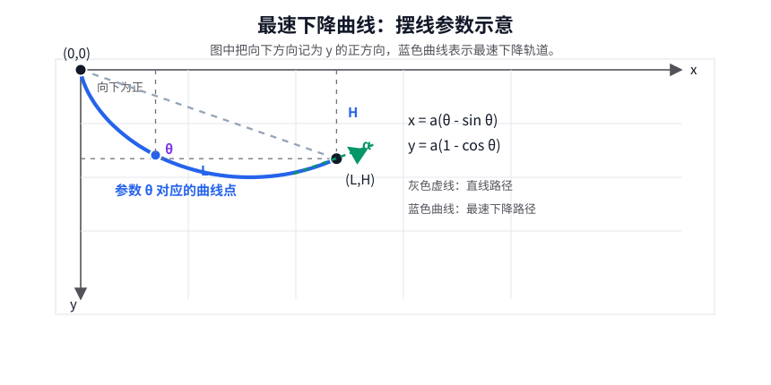

图中 $x$ 轴向右，$y$ 轴向下；$L$ 表示水平距离，$H$ 表示下降高度。$\theta$ 是摆线的参数，$\alpha$ 表示终点附近切线方向的几何角度。

为了写得简单，设起点是 $(0,0)$，终点是 $(L,H)$。这里 $L$ 表示水平距离，$H$ 表示下降高度；因为把向下方向记为正，所以 $H>0$。轨道写成函数 $y(x)$。曲线的一小段长度是

$$
ds=\sqrt{1+(y')^2}\,dx.
$$

小球从静止出发，下降高度为 $y$ 时，由能量守恒可得

$$
\frac12 mv^2=mgy,
$$

所以速度是

$$
v=\sqrt{2gy}.
$$

时间等于路程除以速度，因此总时间泛函为

$$
T[y]
=
\int_0^L
\frac{\sqrt{1+(y')^2}}{\sqrt{2gy}}\,dx.
$$

这里要最小化的不是长度泛函，而是时间泛函。为了和前面的标准形式对上，先把模板拿出来：

$$
J[y]=\int_a^b F(x,y,y')\,dx.
$$

现在最速下降问题中的时间泛函是

$$
T[y]
=
\int_0^L
\frac{\sqrt{1+(y')^2}}{\sqrt{2gy}}\,dx.
$$

和模板逐项比较：

$$
J[y]\quad \longleftrightarrow \quad T[y],
$$

$$
[a,b]\quad \longleftrightarrow \quad [0,L],
$$

$$
F(x,y,y')
\quad \longleftrightarrow \quad
\frac{\sqrt{1+(y')^2}}{\sqrt{2gy}}.
$$

所以这个问题的积分核就是

$$
F(x,y,y')
=
\frac{\sqrt{1+(y')^2}}{\sqrt{2gy}}.
$$

这里虽然写成 $F(x,y,y')$，但右边其实没有显式出现 $x$。它只依赖高度 $y$ 和斜率 $y'$。

如果直接代入欧拉-拉格朗日方程，

$$
\frac{\partial F}{\partial y}
-
\frac{d}{dx}
\left(
\frac{\partial F}{\partial y'}
\right)
=0,
$$

就会得到

$$
\frac{\partial}{\partial y}
\left(
\frac{\sqrt{1+(y')^2}}{\sqrt{2gy}}
\right)
-
\frac{d}{dx}
\left[
\frac{\partial}{\partial y'}
\left(
\frac{\sqrt{1+(y')^2}}{\sqrt{2gy}}
\right)
\right]
=0.
$$

其中两项分别是

$$
\frac{\partial F}{\partial y}
=
-
\frac{\sqrt{1+(y')^2}}{2\sqrt{2g}\,y^{3/2}},
$$

$$
\frac{\partial F}{\partial y'}
=
\frac{y'}{\sqrt{2gy}\sqrt{1+(y')^2}}.
$$

这已经是欧拉-拉格朗日方程的直接代入形式。不过这个方程继续展开会比较繁琐。由于这里的 $F$ 不显含 $x$，可以使用欧拉-拉格朗日方程的一个常用简化形式，叫 Beltrami 恒等式：

$$
F-y'\frac{\partial F}{\partial y'}=C,
$$

其中 $C$ 是常数。对这里的 $F$ 来说，前面已经算出

$$
\frac{\partial F}{\partial y'}
=
\frac{y'}{\sqrt{2gy}\sqrt{1+(y')^2}}.
$$

所以

$$
y'\frac{\partial F}{\partial y'}
=
\frac{(y')^2}{\sqrt{2gy}\sqrt{1+(y')^2}}.
$$

于是

$$
F-y'\frac{\partial F}{\partial y'}
=
\frac{\sqrt{1+(y')^2}}{\sqrt{2gy}}
-
\frac{(y')^2}{\sqrt{2gy}\sqrt{1+(y')^2}}.
$$

把第一项通分到同一个分母：

$$
\frac{\sqrt{1+(y')^2}}{\sqrt{2gy}}
=
\frac{1+(y')^2}{\sqrt{2gy}\sqrt{1+(y')^2}}.
$$

因此

$$
F-y'\frac{\partial F}{\partial y'}
=
\frac{1+(y')^2-(y')^2}{\sqrt{2gy}\sqrt{1+(y')^2}}
=
\frac{1}{\sqrt{2gy}\sqrt{1+(y')^2}}.
$$

因此

$$
\frac{1}{\sqrt{2gy}\sqrt{1+(y')^2}}=C.
$$

把常数重新整理一下，就得到

$$
y\left(1+(y')^2\right)=\text{常数}.
$$

这是一个常微分方程，因为未知函数只有一个自变量 $x$，方程里出现的是 $y$ 和它对 $x$ 的导数 $y'$。它可以先用分离变量法处理：把 $y'$ 看成 $dy/dx$，再改写成 $dx/dy$，让两边分别只含一个变量。后面真正算积分时，还会用到一个三角代换。下面把它解出来。

为了让后面的式子好看，把常数记成 $2a$，其中 $a>0$：

$$
y\left(1+(y')^2\right)=2a.
$$

于是

$$
1+(y')^2=\frac{2a}{y},
$$

所以

$$
(y')^2=\frac{2a-y}{y}.
$$

因为

$$
y'=\frac{dy}{dx},
$$

所以

$$
\frac{dx}{dy}
=
\sqrt{\frac{y}{2a-y}}.
$$

接下来做一个参数代换：

$$
y=a(1-\cos\theta).
$$

这个代换不是凭空来的，而是为了让根号里的

$$
\frac{y}{2a-y}
$$

变成三角函数。因为

$$
2a-y
=
2a-a(1-\cos\theta)
=
a(1+\cos\theta),
$$

所以

$$
\sqrt{\frac{y}{2a-y}}
=
\sqrt{\frac{1-\cos\theta}{1+\cos\theta}}
=
\tan\frac{\theta}{2}.
$$

另一方面，

$$
dy=a\sin\theta\,d\theta.
$$

于是

$$
dx
=
\sqrt{\frac{y}{2a-y}}\,dy
=
\tan\frac{\theta}{2}\,a\sin\theta\,d\theta.
$$

利用

$$
\tan\frac{\theta}{2}
=
\frac{\sin\theta}{1+\cos\theta},
$$

得到

$$
dx
=
a\frac{\sin^2\theta}{1+\cos\theta}\,d\theta
=
a(1-\cos\theta)\,d\theta.
$$

两边积分：

$$
x
=
a\int (1-\cos\theta)\,d\theta
=
a(\theta-\sin\theta)+\text{常数}.
$$

如果起点取在 $(0,0)$，对应 $\theta=0$，那么这个积分常数为 $0$。因此

$$
x=a(\theta-\sin\theta),
\qquad
y=a(1-\cos\theta),
$$

起点已经取成 $(0,0)$。当 $\theta=0$ 时，

$$
x=a(0-\sin 0)=0,
\qquad
y=a(1-\cos 0)=0,
$$

所以起点条件自动满足，也把积分常数定成了 $0$。

终点是 $(L,H)$。设到达终点时的参数是 $\theta_1$，那么必须有

$$
L=a(\theta_1-\sin\theta_1),
\qquad
H=a(1-\cos\theta_1).
$$

这就是用终点条件来决定参数的方程组。未知量是 $a$ 和 $\theta_1$，已知量是 $L$ 和 $H$。通常先把两个式子相除，消去 $a$：

$$
\frac{L}{H}
=
\frac{\theta_1-\sin\theta_1}{1-\cos\theta_1}.
$$

这个方程决定 $\theta_1$；求出 $\theta_1$ 以后，再由

$$
a=\frac{H}{1-\cos\theta_1}
$$

得到 $a$。于是摆线就被端点唯一地固定下来。

这就是一段摆线。也就是说，最速下降轨道是一个圆在直线上滚动时，圆周上一点画出的曲线的一段。

这个例子的意义非常大。它说明变分法不是简单地把“最短”问题换个写法，而是能处理更深的“最优过程”问题。最短路径看长度，最速下降看时间；目标泛函一变，最优曲线就可能完全不同。直线最短，但摆线最快。

### 边界条件和自然边界条件

上面的推导里，我们要求扰动满足

$$
\eta(a)=\eta(b)=0.
$$

这是因为端点固定。如果端点不固定，分部积分时留下的边界项就不能自动消失。这时除了欧拉-拉格朗日方程以外，还会出现额外的边界条件，通常叫自然边界条件。

这说明变分法不只关心区间内部的微分方程，也关心边界如何限制函数。不同的边界条件，会对应不同的物理或几何问题。比如固定端点、自由端点、固定斜率、边界落在某条曲线上，都会让最后得到的条件发生变化。

### 第二变分：候选解之后还要判断什么

**第一变分给出的是必要条件，不是充分条件。**

第一变分为零类似于有限维优化中的一阶条件。它告诉我们：在候选最优函数附近，所有允许方向上的一阶变化都消失了。也就是说，沿任何允许的微小扰动方向看过去，泛函值在一阶近似下都不会继续下降或上升。

这不是说第一变分理论不完整，而是说它回答的是：**谁有资格成为最优函数的候选者？** 对固定端点的光滑变分问题来说，这个必要条件就是欧拉-拉格朗日方程。满足这个方程的函数，才可能是使泛函取极值的函数；不满足这个方程，一般就可以找到某个扰动方向，让泛函值在一阶上发生变化。

因此，前面用第一变分计算最速下降曲线，并不是在宣称“只靠第一变分就完成了全部证明”。更准确地说，我们先用第一变分把可能的最优曲线筛出来：如果一条曲线连欧拉-拉格朗日方程都不满足，它就不可能是光滑意义下的最优曲线；满足方程以后，才进入下一步判断。对最速下降问题来说，这一步筛选出的曲线是摆线。

至于为什么这段摆线真的给出最短时间，经典变分法还需要继续做极小性论证。定性地说，这类论证要排除两种可能：第一，这条摆线只是一个“时间不再一阶变化”的驻留曲线，但附近稍微改一改反而更快；第二，还存在另一条完全不同的曲线，用时更短。第二变分、Jacobi 条件、Weierstrass 条件等工具，都是为了处理这类问题。本文不展开这些判别理论，只保留主线：第一变分把最速下降问题转化为可解的微分方程，而这个方程给出的候选曲线正是摆线。

但是，“有资格”不等于“已经确认是极小”。这一点和普通多元函数完全一样：$\nabla f(x)=0$ 只能说明 $x$ 是驻点，不能直接说明它是极小点、极大点还是鞍点。变分法里也是如此，$\delta J[y;\eta]=0$ 说明 $y$ 是候选最优函数，但还需要进一步判断它附近的形状。

这时就要看第二变分。它类似于有限维优化中的 Hessian，描述的是一阶变化消失以后，泛函值在二阶近似下怎样变化。如果第二变分对所有非零允许扰动方向都是正的，那么 $y$ 附近的泛函值会向上弯，通常对应局部极小；如果存在某个扰动方向让第二变分为负，就说明沿这个函数方向稍微改动 $y$，泛函值还能下降，因此 $y$ 不可能是局部极小。

所以，第一变分和第二变分不是互相替代的两套理论，而是分工不同：第一变分给出必要条件，把问题转化为微分方程；第二变分进一步判断这些候选解的极值性质。本文的主线是理解欧拉-拉格朗日方程从哪里来，因此只定性说明第二变分的角色，不展开它的完整判别理论。

### 带约束的变分问题

变分法也可以处理约束。比如我们可能要求函数满足某个积分约束：

$$
\int_a^b y(x)\,dx = M.
$$

这时可以引入拉格朗日乘子，把约束并入泛函：

$$
\widetilde J[y]
=
J[y]
+
\lambda
\left(
\int_a^b y(x)\,dx-M
\right).
$$

然后对新的泛函 $\widetilde J$ 做变分。可以看到，有限维优化中的乘子思想，在函数空间里仍然有效。区别只是：原来的未知量是有限维向量，现在未知量是函数。

### 变分法和微分方程

变分法和微分方程关系非常深。很多微分方程并不是凭空出现的，而是某个能量泛函、作用量泛函、时间泛函或长度泛函的最优性条件。换句话说，微分方程有时可以看成“某个函数最优时必须满足的方程”。

微分方程是怎么出现的？核心仍然是第一变分。我们先把要优化的对象写成一个泛函 $J[y]$，再考虑扰动后的函数 $y+\varepsilon\eta$。如果 $y$ 是候选最优函数，那么对所有允许的扰动方向 $\eta$，第一变分都应该为零。把具体的积分核 $F(x,y,y')$ 代入这个条件，并把式子整理出来，就会得到欧拉-拉格朗日方程。于是，一个“寻找最优函数”的问题，就变成了一个“求解微分方程”的问题。

最速下降曲线就是本文里最典型的例子。原问题问的是：小球从一个点滑到另一个较低的点，哪条轨道用时最短？这听起来像一个几何或物理问题，但写成时间泛函以后，它就变成了变分问题。对时间泛函做第一变分，会得到欧拉-拉格朗日方程；再利用这个问题的特殊结构，可以化成一个关于 $y$ 和 $y'$ 的常微分方程。最后解这个常微分方程，得到的候选最优曲线就是摆线。

类似的例子还有很多。两点之间的最短曲线，可以看成长度泛函取极小，最后得到直线。曲面上的最短路径是测地线问题，它把“在曲面上走哪条路最短”转化为微分方程。弹性杆或薄膜的平衡形状，可以看成能量泛函取极小：系统最后停下来的形状，往往正是能量不能再通过微小变形降低的形状。

力学中的最小作用量原理也是同一类思想。在拉格朗日力学里，一个系统的状态通常用广义坐标描述，系统的运动由拉格朗日量刻画。把拉格朗日量沿整条运动轨迹积分，就得到作用量。作用量本质上也是一个泛函：它的输入不是某一个时刻的位置，而是一整条运动轨迹；输出是一个数。

最小作用量原理说的是：真实运动轨迹要满足某种泛函最优化条件。更准确地说，不一定总是“最小”，而是要求作用量的一阶变化为零。也就是说，如果把真实轨迹稍微扰动一下，作用量在一阶近似下不会变小或变大。对作用量做变分，得到的欧拉-拉格朗日方程，正是拉格朗日力学中的运动方程。也就是说，力学方程可以从“轨迹使某个泛函的一阶变化为零”这个观点中推出。

所以，变分法不是在微分方程之外另起炉灶，而是在解释微分方程从哪里来。它告诉我们：很多方程背后都有一个“最优性来源”。先有泛函，后有扰动；先要求第一变分为零，再得到微分方程。

从本文的主线看，变分法是最优化理论的一次升维。前面我们问的是：怎样在有限维空间里找最优点？这里问的是：怎样在函数空间里找最优函数？答案仍然围绕同一个思想展开：看扰动、算一阶变化、写出最优性条件，再把条件转化成可分析的方程。

## 七、非凸优化

前面讲凸优化时，很多事情都显得很干净：局部极小点就是全局极小点，一阶条件往往可以直接刻画最优解，KKT 条件在合适条件下也能成为充分条件。但一般优化问题没有这么幸运。只要目标函数不是凸函数，图像就可能有多个谷底、山脊、平坦区域和鞍点。算法看到的只是当前位置附近的信息，却要在复杂地形里寻找尽量好的点。

非凸优化的基本困难可以用一句话概括：**局部信息不再等于全局结论。**

在光滑非凸问题中，我们仍然可以使用梯度和 Hessian。若 $\nabla f(x)\neq 0$，负梯度方向仍然是下降方向；若 $\nabla f(x)=0$，这个点仍然叫驻点。问题在于，驻点的含义变弱了：它可能是局部极小点，也可能是局部极大点，还可能是鞍点。即使 Hessian 正定，通常也只能说明这是局部极小点，不能直接推出它是全局最小点。

这和凸优化形成鲜明对比。凸函数的图像没有“隐藏的更低谷底”，所以一个满足一阶最优性条件的点可以成为全局最优点。非凸函数则不同：你站在一个小谷底里，附近所有方向都上坡，但远处可能还有一个更深的谷底。局部极小点不是错误的数学结论，它确实在附近最小；只是从全局最优的角度看，它可能不是我们真正想要的终点。

鞍点带来的困难又不一样。鞍点不是局部极小点，因为沿某些方向仍然可以下降；但在这些点附近，梯度可能很小，算法会误以为已经接近稳定状态。尤其在高维问题里，鞍点和近似鞍点很常见。梯度下降法如果只看一阶信息，可能会在这些平坦区域附近走得很慢。二阶信息的价值就在这里显现出来：如果 Hessian 有负特征值，就说明存在向下弯的方向，沿这个方向移动仍然可以降低目标函数。

因此，非凸优化里常见的目标会比“找到全局最优解”更谨慎。很多理论首先保证算法能找到一阶驻点，也就是让 $\|\nabla f(x)\|$ 足够小；进一步的理论会要求找到二阶驻点，也就是不仅梯度小，而且 Hessian 没有明显的负曲率方向。这样的点未必是全局最优，但至少排除了“还能沿一阶方向下降”和“还能沿明显负曲率方向下降”这两类局部问题。

数值方法在非凸问题中也要重新理解。梯度下降法仍然有意义，因为只要步长选得合适，每一步仍然可以让函数值下降。Newton 法也仍然有意义，因为 Hessian 能提供曲率信息；但如果 Hessian 不正定，Newton 方向未必是下降方向，这时就需要阻尼 Newton 法、信赖域方法或修正 Hessian 等策略。拟 Newton 法、共轭梯度法、随机扰动方法，也都可以看成在复杂地形中寻找更可靠搜索方向的办法。

这里还要注意一个现实问题：非凸优化并不总是悲观的。虽然一般非凸问题很难保证全局最优，但很多具体问题有额外结构。例如某些矩阵分解、低秩恢复、相位恢复和统计估计问题，虽然形式上非凸，却可能不存在糟糕的局部极小点；或者所有局部极小点都已经足够好。现代非凸优化理论很大一部分工作，就是研究这些特殊结构什么时候出现。

微分拓扑也给非凸优化提供了一种重要视角。优化里关心的驻点，在微分拓扑中可以看成函数在空间上的临界点；局部极小点、局部极大点和鞍点，则对应临界点附近不同的几何结构。Morse 理论大致说的是：如果一个光滑函数的临界点都不退化，那么这些临界点可以用 Hessian 的正负方向来分类，函数的整体形状也会被这些临界点组织起来。用优化语言说，这帮助我们理解“一个非凸地形到底由哪些谷底、山峰和鞍点拼出来”。

这种观点还有一个好处：它说明很多坏情形并不是稳定的。比如完全平坦的一大片驻点、Hessian 刚好有零特征值的退化点，往往对微小扰动很敏感；函数稍微改一点，结构就可能变成若干个更普通的非退化临界点。稳定流形和不稳定流形的思想，也可以帮助解释为什么某些鞍点虽然存在，但从随机初始点出发不一定容易正好停在上面。微分拓扑不替代梯度下降法或 Newton 法，但它能帮助我们看清非凸优化景观的整体骨架。

所以，非凸优化不是说“没有凸性就什么都做不了”。更准确地说，非凸优化要求我们降低对结论的轻率期待：不能只靠一阶条件宣布全局最优，也不能把一个数值算法停下来就当成已经找到最好答案。我们要问得更细：算法收敛到什么类型的点？这个点附近有没有下降方向？有没有负曲率方向？问题本身是否有特殊结构，使局部解也具有全局意义？

从本文的脉络看，非凸优化是对前面所有概念的一次压力测试。一阶条件仍然重要，但只给必要信息；二阶条件仍然重要，但主要帮助区分局部极小点和鞍点；数值算法仍然重要，但它们给出的往往是可计算的近似结论，而不是漂亮的解析答案。正因为如此，非凸优化自然通向下一节：机器学习中的训练问题通常就是大规模、高维、带噪声的非凸优化问题。

## 八、机器学习中的优化方法

前面一直在讲一般的函数优化。机器学习中的训练问题，可以看成这套语言的一个重要应用：给定一组参数 $\theta$，用损失函数衡量模型在数据上的误差，然后寻找让损失尽量小的参数。

最常见的形式是经验风险最小化：

$$
\min_\theta
\frac1N\sum_{i=1}^N \ell(f_\theta(x_i),y_i).
$$

这里 $\theta$ 是模型参数，$(x_i,y_i)$ 是训练样本，$\ell$ 是单个样本上的损失。这个式子仍然是一个无约束优化问题，只是目标函数通常非常大、非常非凸，而且参数维度可能达到百万、十亿甚至更高。

### 早期方法：先把学习写成可优化的目标

机器学习早期很多方法，本质上已经是优化问题。最小二乘法要找一条直线或一个线性函数，让预测误差平方和最小；逻辑回归要最小化交叉熵损失；支持向量机要在分类间隔和误差之间做权衡。这些方法的共同点是：先规定一个损失函数，再通过解析公式或数值算法去降低它。

#### 最小二乘法：从损失函数到闭式解

在线性模型里，这件事还比较直观。比如有一组样本 $(x_i,y_i)$，模型写成

$$
\hat y_i=wx_i+b.
$$

为了和矩阵形式统一，把参数写成向量

$$
\beta=
\begin{bmatrix}
w\\
b
\end{bmatrix},
$$

再把每个输入扩展成

$$
\widetilde x_i=
\begin{bmatrix}
x_i\\
1
\end{bmatrix}.
$$

这样预测式就可以统一写成

$$
\hat y_i=\widetilde x_i^\top\beta.
$$

最小二乘法会把所有样本的误差平方加起来：

$$
L(\beta)
=
\frac12\sum_{i=1}^N(\widetilde x_i^\top\beta-y_i)^2.
$$

如果预测值 $\hat y_i$ 和真实值 $y_i$ 差得大，这个样本对总损失的贡献就大；如果所有预测都接近真实值，总损失就小。训练模型就是调节参数向量 $\beta$，让这个总损失下降。

把所有 $\widetilde x_i^\top$ 按行排成设计矩阵 $X$，再把所有标签 $y_i$ 排成向量 $\mathbf y$，就得到更紧凑的矩阵形式：

$$
L(\beta)
=
\frac12\|X\beta-\mathbf y\|^2.
$$

对 $\beta$ 求梯度：

$$
\nabla L(\beta)
=
X^\top(X\beta-\mathbf y).
$$

令梯度为零，得到正规方程：

$$
X^\top X\beta=X^\top \mathbf y.
$$

如果 $X^\top X$ 可逆，就得到闭式解：

$$
\beta^\ast=(X^\top X)^{-1}X^\top \mathbf y.
$$

这就是正规方程思路：先把学习问题写成一个二次优化问题，再用一阶最优性条件直接解出参数。

#### 梯度下降法：用迭代代替直接求解

如果数据量较大，或者模型不方便直接解方程，就会使用数值迭代方法。这里先把符号说清楚：$N$ 表示样本数量，$d$ 表示每个样本的特征维数，也就是参数向量 $\beta$ 的维数。因此设计矩阵 $X$ 是一个 $N\times d$ 矩阵。

闭式解虽然漂亮，但它通常要先形成 $X^\top X$，再解一个 $d\times d$ 的线性方程组。形成 $X^\top X$ 大约需要 $O(Nd^2)$，矩阵分解或求逆通常需要 $O(d^3)$。当参数个数 $d$ 很大时，这一步会很贵。

梯度下降法的计算方式不同：它不一次性把答案解出来，而是从一个初始参数 $\beta_0$ 出发，反复计算当前梯度，再沿负梯度方向更新。第 $k$ 步的梯度是

$$
g_k=\nabla L(\beta_k)=X^\top(X\beta_k-\mathbf y).
$$

于是梯度下降法的迭代为

$$
\beta_{k+1}
=
\beta_k-\alpha g_k
=
\beta_k-\alpha X^\top(X\beta_k-\mathbf y),
$$

其中 $\alpha>0$ 是步长。这个式子清楚地分成两件事：先算当前梯度 $g_k$，再用优化算法的更新规则把 $\beta_k$ 改成 $\beta_{k+1}$。所以梯度下降法其实是外层框架：它只要求你能提供当前梯度，至于这个梯度是直接由公式算出来，还是由反向传播算出来，并不改变梯度下降法本身。

计算 $g_k$ 主要需要若干次矩阵向量乘法，单步计算量大约是 $O(Nd)$。如果迭代 $T$ 步，总计算量大约是 $O(TNd)$。粗略地说，形成 $X^\top X$ 更像是先把所有特征之间的两两关系都算出来；而梯度下降每一步只问“当前参数下误差往哪个方向下降”。它要迭代很多步，但每一步更轻，也更容易配合大规模数据、稀疏矩阵和小批量计算。

对逻辑回归这类光滑但没有简单闭式解的模型，也可以使用 Newton 法或拟 Newton 法。Newton 法利用 Hessian 给出的二阶曲率信息，通常收敛更快；拟 Newton 法则用迭代方式近似 Hessian，降低直接计算二阶矩阵的成本。

这个例子已经包含了机器学习优化的基本骨架：先对所有样本计算预测值，再把误差合成一个总损失，然后把总损失对参数的导数算出来，最后沿负梯度方向更新参数。这里算的是全量梯度；至于能不能每次只用一部分样本来估计梯度，是后面讨论随机梯度法时要回答的问题。

### 反向传播：把链式法则系统化

上面已经看到，梯度下降法本身很简单：给我当前梯度，我就沿负梯度方向更新参数。这里要把关系说清楚：**反向传播负责计算梯度，梯度下降法负责使用梯度更新参数。** 二者不是并列关系，而是包含关系。梯度下降法站在外层，它只要求你能提供当前梯度；这个梯度可以直接由公式算出来，也可以由反向传播算出来。

先用刚才的最小二乘例子看一眼。它的损失函数是

$$
L(\beta)=\frac12\|X\beta-\mathbf y\|^2.
$$

如果直接对 $\beta$ 求导，可以得到

$$
\nabla L(\beta)=X^\top(X\beta-\mathbf y).
$$

如果把它写成计算图，也能用反向传播算出同一个梯度。前向计算可以拆成

$$
s=X\beta,\qquad r=s-\mathbf y,\qquad L=\frac12 r^\top r.
$$

这里 $s$ 是模型预测向量，$r$ 是残差向量。反向传播从最后的损失 $L$ 开始。因为

$$
\frac{\partial L}{\partial r}=r,
$$

而 $r=s-\mathbf y$，所以

$$
\frac{\partial L}{\partial s}=r.
$$

又因为 $s=X\beta$，所以

$$
\frac{\partial L}{\partial \beta}
=
X^\top\frac{\partial L}{\partial s}
=
X^\top r
=
X^\top(X\beta-\mathbf y).
$$

这说明，反向传播不是一种新的梯度，也不是和矩阵求导矛盾的方法。它算出的仍然是同一个“损失函数对参数的偏导数”。只是在最小二乘里，直接写矩阵公式更干净；而把它写成计算图时，反向传播也会得到同样结果。

神经网络把这种计算图变得更长、更复杂。它不是一个单层公式，而是一串复合函数：前一层的输出变成后一层的输入，参数分散在许多层里。于是困难不再是“有了梯度以后怎么走”，而是“这么多层、这么多参数，梯度到底怎么高效算出来”。反向传播就是在这个位置发展出来的：它把多元函数的链式法则组织成一套系统算法，用来计算损失函数对每个参数的偏导数。

所以发展关系可以这样理解：**梯度下降法先提出外层更新框架，反向传播后来解决复杂模型里的梯度计算问题。** 反向传播算出的梯度，可以交给梯度下降法，也可以交给随机梯度法、带动量的方法或 Adam。优化算法可以不断改进，但它们通常都需要某种方式先得到梯度；在神经网络里，这个梯度主要靠反向传播得到。

先看一个最小的一层神经元。给定输入 $x$，参数是权重 $w$ 和偏置 $b$：

$$
z=wx+b,
\qquad
\hat y=\sigma(z),
\qquad
L=\frac12(\hat y-y)^2.
$$

这里也可以把参数写成向量：

$$
\theta=
\begin{bmatrix}
w\\
b
\end{bmatrix}.
$$

训练真正关心的不是 $z$ 对 $w$ 的导数，也不是 $\hat y$ 对 $z$ 的导数，而是最终损失 $L$ 对每个参数的导数：

$$
\frac{\partial L}{\partial w},
\qquad
\frac{\partial L}{\partial b}.
$$

原因很直接：我们要让损失 $L$ 变小，所以参数该往哪里改，必须看“参数变化会让最终损失怎样变化”。如果只算

$$
\frac{\partial z}{\partial w}=x,
$$

它只说明 $w$ 变一点时 $z$ 怎么变，还没有说明 $z$ 变了以后 $\hat y$ 怎么变，$\hat y$ 变了以后 $L$ 又怎么变。训练参数必须把整条影响链都算进去。

这条链是

$$
x \rightarrow z \rightarrow \hat y \rightarrow L.
$$

链式法则告诉我们：

$$
\frac{\partial L}{\partial w}
=
\frac{\partial L}{\partial \hat y}
\frac{\partial \hat y}{\partial z}
\frac{\partial z}{\partial w},
\qquad
\frac{\partial L}{\partial b}
=
\frac{\partial L}{\partial \hat y}
\frac{\partial \hat y}{\partial z}
\frac{\partial z}{\partial b}.
$$

这就是为什么反向传播一定从最后的损失函数开始。最后的损失 $L$ 是训练目标，所有参数都要问同一个问题：我改变一点，会让最终的 $L$ 怎样改变？反向传播就是把这个问题从输出端一层一层传回参数端。

具体算一遍。因为

$$
L=\frac12(\hat y-y)^2,
$$

所以

$$
\frac{\partial L}{\partial \hat y}=\hat y-y.
$$

又因为 $\hat y=\sigma(z)$，所以

$$
\frac{\partial L}{\partial z}
=
\frac{\partial L}{\partial \hat y}
\frac{\partial \hat y}{\partial z}
=
(\hat y-y)\sigma'(z).
$$

把这个量记作

$$
\delta=\frac{\partial L}{\partial z}.
$$

它可以理解成传到 $z$ 这里的误差信号。由于参数 $w,b$ 直接出现在 $z=wx+b$ 里，接下来立刻得到

$$
\frac{\partial L}{\partial w}
=
\frac{\partial L}{\partial z}
\frac{\partial z}{\partial w}
=
\delta x,
\qquad
\frac{\partial L}{\partial b}
=
\frac{\partial L}{\partial z}
\frac{\partial z}{\partial b}
=
\delta.
$$

因此

$$
\nabla_\theta L
=
\begin{bmatrix}
\partial L/\partial w\\
\partial L/\partial b
\end{bmatrix}
=
\begin{bmatrix}
\delta x\\
\delta
\end{bmatrix}.
$$

如果已经有了这个梯度，梯度下降法才会做下一步：

$$
\theta\leftarrow \theta-\alpha\nabla_\theta L.
$$

也就是

$$
w\leftarrow w-\alpha\delta x,
\qquad
b\leftarrow b-\alpha\delta.
$$

这两行更新式属于优化算法，不属于反向传播本身。反向传播只负责提供 $\partial L/\partial w$ 和 $\partial L/\partial b$；优化算法决定如何使用这些偏导数。这一区分很重要，因为后面讨论随机梯度法、动量法、Adam 等方法时，改进的主要是“怎么用梯度走下一步”，而不是“怎么把梯度算出来”。

多层网络也一样。第 $l$ 层前向计算

$$
z_l=W_la_{l-1}+b_l,
\qquad
a_l=\sigma(z_l).
$$

反向传播从最后的损失开始，把误差信号一层一层传回来：

$$
\delta_l=(W_{l+1}^\top\delta_{l+1})\odot\sigma'(z_l).
$$

这里 $\odot$ 表示逐元素相乘。拿到第 $l$ 层的误差信号以后，这一层参数的梯度就是

$$
\frac{\partial L}{\partial W_l}=\delta_l a_{l-1}^\top,
\qquad
\frac{\partial L}{\partial b_l}=\delta_l.
$$

所以反向传播真正关心的是层与层之间的递推关系：后一层的误差怎样变成前一层的误差，每一层的误差又怎样变成这一层参数的梯度。

### 实际训练中：框架怎样计算梯度

实际训练中，用户通常不会手工推导上面那些偏导数，而是把前向计算写给框架。框架根据前向计算自动建立两张彼此对应的图：一张是前馈网络，用来算数值；另一张是反馈网络，也就是反向计算图，用来算梯度。

比如一层神经元可以拆成四个前向算子：

$$
u=wx,\qquad z=u+b,\qquad \hat y=\sigma(z),\qquad L=\frac12(\hat y-y)^2.
$$

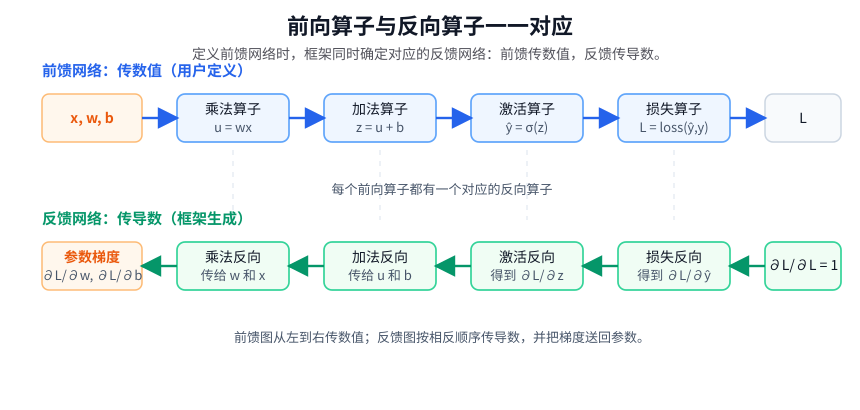

前馈网络从左到右工作。给定 $x,w,b$，乘法算子算出 $u$，加法算子算出 $z$，激活算子算出 $\hat y$，损失算子算出 $L$。这一遍传的是普通数值。

反馈网络从右到左工作。它不是另一个要训练的模型，而是由前馈网络自动确定的导数传播图。每个前向算子在框架里都有一个已经写好的反向算子：前向算子负责“怎样从输入算出输出”，反向算子负责“如果输出端传回来一个梯度，应该怎样把它分给输入端”。

乘法算子就是一个最小例子。前向时有

$$
u=wx.
$$

反向时，如果后面传回来 $\partial L/\partial u$，乘法算子的反向规则就是

$$
\frac{\partial L}{\partial w}
=
\frac{\partial L}{\partial u}x,
\qquad
\frac{\partial L}{\partial x}
=
\frac{\partial L}{\partial u}w.
$$

加法算子也一样。前向时有

$$
z=u+b.
$$

反向时，传回来的梯度会原样分给两个输入，因为

$$
\frac{\partial z}{\partial u}=1,
\qquad
\frac{\partial z}{\partial b}=1.
$$

激活算子同样有自己的反向规则。前向里如果用了 ReLU，反向时就看前向保存的输入 $z$：当 $z>0$，梯度照样传过去；当 $z<0$，梯度变成 $0$。这说明为什么前馈网络不只是算出最终损失，还要保存必要的中间值：反馈网络常常需要用这些中间值来计算局部导数。

因此，框架里的自动微分不是“重新推导整个网络的导数”，也不是用很小的扰动试出来梯度，而是把前向算子和反向算子一一配对。定义前馈网络时，反馈网络的结构也随之确定。前向顺序是

$$
x,w,b \rightarrow u \rightarrow z \rightarrow \hat y \rightarrow L,
$$

反向顺序则是

$$
L \rightarrow \hat y \rightarrow z \rightarrow u \rightarrow w,b.
$$

反向传播开始时，损失节点先给自己一个初始梯度：

$$
\frac{\partial L}{\partial L}=1.
$$

然后损失算子的反向规则把梯度传给 $\hat y$，激活算子的反向规则把梯度传给 $z$，加法算子的反向规则把梯度传给 $u$ 和 $b$，乘法算子的反向规则把梯度传给 $w$ 和 $x$。整件事就是：前馈网络传值到损失，反馈网络把损失对各处的偏导数传回参数。

如果某个参数通过多条路径影响损失，框架会把不同路径传回来的梯度加起来。比如同一个权重在不同样本、不同位置或不同时间步里被重复使用，每条路径都会贡献一部分梯度，最后累加成这个参数的总梯度。这正是多元函数链式法则在计算图上的表现。

这类自动微分通常叫反向模式自动微分。它特别适合机器学习，因为训练时常见的是“很多参数，一个标量损失”：输入是大量参数，输出只有一个损失值。反向模式的好处是，只要做一次前向传播和一次反向传播，就能得到所有参数对这个标量损失的梯度。如果对每个参数分别用数值差分试探，参数有多少个就要额外试多少次，几乎不可接受。

不同框架记录计算图的方式略有不同。PyTorch 更常见的是动态图：程序每跑一次前向计算，就按这次实际执行的运算临时搭出一张图；TensorFlow 和 JAX 也可以把计算过程编译成更优化的图。无论外层形式怎样，核心思想都是一样的：前向阶段执行算子并保存必要中间值，反向阶段调用对应的反向算子并累积梯度。

到这里为止，我们仍然只是在计算梯度，还没有讨论优化算法。前馈网络、反馈网络和优化算法之间的分工可以这样理解：前馈网络回答“当前参数下损失是多少”；反馈网络回答“损失对每个参数的偏导数是多少”；优化算法回答“知道这些偏导数以后，参数下一步怎么改”。这就为后面讨论优化器留下了位置：优化器可以换，梯度下降法、带动量的方法、Adam 都可以使用同一套反向传播算出来的梯度。

从历史上看，反向传播并不是一开始就作为深度学习工具出现的。它的数学根源可以追溯到反向模式自动微分：如果一个复杂函数由许多简单运算复合而成，就可以先正向计算函数值，再反向高效计算所有输入变量的导数。20 世纪 70 年代，Paul Werbos 把这种思想系统地用于神经网络训练；到 1986 年，Rumelhart、Hinton 和 Williams 的工作让反向传播成为训练多层神经网络的核心方法。后来深度学习框架把这件事工程化：用户写前向网络，系统自动生成并执行对应的反向计算。

这套前向算子和反向算子一一对应的机制，也解释了深层网络里的梯度消失和梯度爆炸。网络越深，反向传播要串起来的反向算子就越多；导数在很多层之间连续相乘。如果这些乘积的尺度长期小于 $1$，越往前传梯度越小，前面的层几乎学不动，这就是梯度消失；如果这些乘积的尺度长期大于 $1$，梯度会越传越大，训练会变得不稳定，这就是梯度爆炸。

很多现代网络结构和训练技术，本质上都是在让这串反向算子更稳定。ReLU 等激活函数减少了 sigmoid 在饱和区导数接近零的问题；合理初始化希望让信号和梯度的尺度在层间保持稳定；BatchNorm、LayerNorm 等归一化方法让中间变量的尺度更可控；梯度裁剪可以直接限制过大的梯度。

### 残差网络：给梯度一条更短的路

残差网络解决梯度问题的方式特别有代表性。普通深层网络可以粗略看成一层接一层：

$$
x_{l+1}=F_l(x_l).
$$

前向时，信息必须经过 $F_l$；反向时，梯度也必须经过 $F_l$ 对应的反向算子。如果很多层的局部导数都偏小，梯度就会越传越弱。

残差块把前向结构改成

$$
x_{l+1}=x_l+F_l(x_l).
$$

这里多出来的 $x_l$ 就是捷径连接，也叫 skip connection。它的意思是：这一层不必从零开始学习一个完整变换，只要学习一个修正量 $F_l(x_l)$；原来的输入 $x_l$ 可以直接加到输出里。

关键在反向传播。对

$$
x_{l+1}=x_l+F_l(x_l)
$$

求导时，会出现两条梯度通道：一条经过 $F_l$，另一条来自恒等映射 $x_l\mapsto x_l$。恒等映射的导数是 $1$，所以反向传播时，梯度可以有一部分直接传回前一层，不必完全依赖 $F_l$ 那串复杂导数。

直观地说，普通深层网络像是让梯度穿过一长串狭窄管道；残差网络在旁边开了一条近似直通的路。即使某些层的反向算子让梯度变小，捷径连接仍然能保留一部分梯度信号。这就是残差网络为什么能训练非常深的模型的重要原因。

当然，残差连接不是单独解决所有问题。它通常还会和归一化、合适初始化、学习率调度、梯度裁剪等方法一起使用。但从反向传播的角度看，它最核心的贡献很清楚：前向网络多了一条捷径，反向网络也就多了一条更短、更稳定的导数通道。

### 现代优化器：怎样改造梯度信息

如果每一步都用全部 $N$ 个样本计算完整梯度，代价会很高。随机梯度法的想法是：每次只抽取一个样本或一个小批量样本，得到一个带噪声的梯度估计，然后用它更新参数：

$$
\theta_{k+1}=\theta_k-\alpha_k \widehat{\nabla L}(\theta_k).
$$

这里 $\widehat{\nabla L}(\theta_k)$ 不是完整梯度，而是由小批量数据估计出来的梯度。它可能不够精确，但计算便宜得多。深度学习训练之所以能处理大规模数据，一个关键原因就是这种“小批量随机近似”把一次昂贵的大优化，变成了大量便宜的局部更新。

现代优化器大多不是推翻梯度下降法，而是在梯度下降法的基础上改造搜索方向、步长和尺度。

第一条线是加入动量。普通随机梯度法每一步都跟着当前小批量梯度走，方向会抖动。动量法会保留过去梯度的加权平均，让更新方向更平滑。直观地说，它不是每一步都完全听当前梯度的，而是让过去一段时间的下降趋势也参与决策。

第二条线是自适应步长。不同参数的梯度尺度可能差别很大，如果所有参数共用同一个学习率，有些方向可能走得太快，有些方向又几乎不动。AdaGrad、RMSProp、Adam 这类方法会记录每个参数方向上梯度大小的历史信息，再给不同参数分配不同的有效步长。

Adam 可以看成动量和自适应尺度的结合。它同时维护梯度的一阶矩估计和二阶矩估计：一阶矩可以理解为带动量的平均下降方向，二阶矩可以理解为每个参数方向上梯度大小的历史尺度。于是，每个参数都能获得一个自适应的步长。

后来更常用的是 AdamW。它关心的不是下降方向本身，而是正则化怎样进入更新。对普通 SGD 来说，$L_2$ 正则化和权重衰减在形式上几乎等价；但对 Adam 这类自适应优化器来说，$L_2$ 项会被二阶矩缩放，导致正则化也被自适应机制改变。AdamW 的做法是把权重衰减从梯度更新中拆出来，让“优化损失”和“收缩权重”成为两个相对独立的动作。

第三条线是利用更强的预条件信息。Adam 主要按逐坐标的历史梯度尺度调整步长，而 Shampoo、SOAP、Muon 等方法则尝试利用矩阵结构或近似二阶结构，让优化器知道不同参数方向之间的关系。它们追问的是同一个问题：在高维参数空间里，能不能用比单个坐标尺度更丰富的信息，构造更好的搜索方向？

### 高维非凸地形：Morse 视角能帮什么

现代机器学习优化还有一个困难：目标函数通常是高维非凸函数。参数可能有上百万甚至上百亿个，损失地形里会出现大量驻点、鞍点和平坦区域。这个时候，经典凸优化里“满足一阶条件就是全局最优”的好事通常不再成立。

Morse 理论给这里提供的是一种几何语言，而不是一个直接按按钮求最优解的算法。它关心光滑函数的临界点，也就是梯度为零的点。Morse 引理告诉我们，在非退化临界点附近，函数可以被局部坐标写成一种标准二次型：有些方向向上弯，有些方向向下弯。向上弯的方向像谷底，向下弯的方向说明仍然可以下降。

这和前面讲 Hessian 的二阶信息正好接上。若 Hessian 正定，临界点附近像局部谷底；若 Hessian 不定，就有鞍点方向。Morse 理论把这种局部判断放进更大的几何图景里：一个高维非凸函数的整体地形，可以理解为许多临界点以及它们之间的上升、下降通道组织起来的结构。

在算法上，这个观点会影响我们对“找到最优点”的期待。高维非凸问题里，很多时候更现实的目标不是立刻证明全局最优，而是先避免明显坏的点：让梯度足够小，同时避免 Hessian 有明显负曲率方向。随机初始化、随机扰动、噪声梯度、负曲率搜索等方法，都可以帮助算法不被鞍点长期困住。

所以，Morse 视角的作用不是替代 Adam 或 SGD，而是解释这些算法为什么可以在复杂地形里工作得比想象中好：许多鞍点虽然存在，但并不一定稳定；如果一个点附近有下降通道，随机扰动或二阶信息就可能把算法推离那里。真正困难的是那些局部极小点和全局极小点之间的差距，以及高维平坦区域对收敛速度和泛化能力的影响。

所以，机器学习里的优化方法并没有脱离本文前面的数学主线。反向传播是链式法则在大型复合函数上的系统应用；随机梯度法是一阶下降方向的随机近似；Adam/AdamW 是动量、自适应尺度和正则化的工程化组合；Morse 理论和二阶几何则帮助我们理解高维非凸地形中的驻点、鞍点和局部极小点。

参考资料可以从几篇代表性工作读起：Robbins 和 Monro 的[随机近似方法](https://cir.nii.ac.jp/crid/1362262946383268736)；Kingma 和 Ba 的 [Adam](https://doi.org/10.48550/arXiv.1412.6980)；Loshchilov 和 Hutter 的 [AdamW / Decoupled Weight Decay](https://papers.cool/arxiv/1711.05101)；Google 团队的 [Lion](https://github.com/google/automl/blob/master/lion/README.md)；近年面向大模型训练的 [SOAP](https://dblp.org/rec/journals/corr/abs-2409-11321.html) 和 [Muon](https://github.com/KellerJordan/muon)；以及 2025 年关于机器学习优化方法的[系统综述](https://www.mdpi.com/2227-7390/13/13/2210)。

## 九、历史脉络回看

回头看，最优化方法的发展不是一串孤立技巧，而是不断回应新的困难：先要知道怎样刻画最优，再要知道怎样在有限计算中逼近最优；先从无约束问题开始，再处理约束、非光滑、大规模数据和高维模型。

| 时间 | 人物或工作 | 解决的问题 |
| --- | --- | --- |
| 1669、1690、1740 | Newton、Raphson、Simpson 推动 Newton 法成形 | 用局部近似快速求方程根，后来变成求 $\nabla f(x)=0$ 的优化工具 |
| 1744、1755 | Euler 和 Lagrange 发展变分法 | 把“找最优曲线/函数”转化成微分方程 |
| 18 世纪 | Euler、Lagrange 推动乘子思想 | 处理等式约束下的极值条件 |
| 约 1847 | Cauchy 的最速下降思想 | 用一阶导数构造可迭代的下降算法 |
| 1939、1951 | Karush、Kuhn、Tucker 的 KKT 条件 | 把乘子法推广到不等式约束 |
| 1951 | Robbins-Monro 随机近似 | 用噪声估计处理期望或大样本目标 |
| 1952 | Hestenes-Stiefel 共轭梯度法 | 减少二次型问题中梯度下降的重复摇摆 |
| 1956 | Frank-Wolfe 方法 | 在凸约束中避免昂贵投影 |
| 1959-1970 | Davidon、Fletcher、Powell、Broyden、Goldfarb、Shanno 的拟 Newton 线 | 用近似 Hessian 降低 Newton 法成本 |
| 1960-1965 | Rosenbrock、Hooke-Jeeves、Powell、Nelder-Mead 等直接搜索方法 | 在导数不可用或不可靠时只靠函数值优化 |
| 1960s-1970s | 投影、近端、增广拉格朗日和 ADMM 等方法成形 | 系统处理约束、非光滑和可分结构 |
| 2014 以后 | Adam、AdamW、Shampoo、Lion、SOAP、Muon 等深度学习优化器 | 在大规模、高维、噪声梯度下平衡速度、稳定性、显存和泛化 |

这条历史线的主角一直在变化，但核心问题没有变：我们能拿到什么信息？梯度、曲率、函数值、样本小批量、约束结构，还是参数矩阵的几何结构？每一种新方法，本质上都是在不同计算条件下回答同一个问题：怎样用手头的信息，走出更可靠的一步。

## 十、与后续章节的连接

本文是分析路线中的入口之一。它向后连接到：

- [实变函数与测度论](../02-real-analysis-and-measure-theory/)：理解积分、测度、概率测度和泛函中的积分结构；
- [泛函分析](../03-functional-analysis/)：理解函数空间、算子、弱收敛、Hilbert 空间和投影理论；
- [偏微分方程和动力系统](../04-pde-and-dynamical-systems/)：理解梯度流、演化方程和连续时间优化；
- [信息几何和最优传输](../../03-geometry-for-machine-learning/04-information-geometry-and-optimal-transport/)：理解分布空间上的几何结构、Wasserstein 距离和 Kantorovich 对偶。

所以，本文最好不要被理解成一组零散算法的清单。它的核心是同一个问题在不同空间、不同约束和不同结构下的变化：

$$
\text{怎样刻画最优}
\quad
\text{以及}
\quad
\text{怎样逼近最优}.
$$

