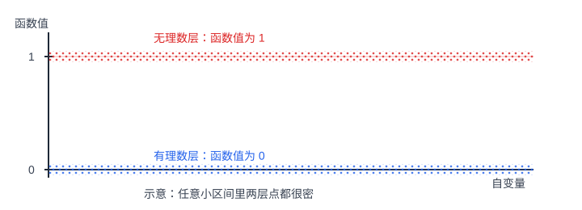
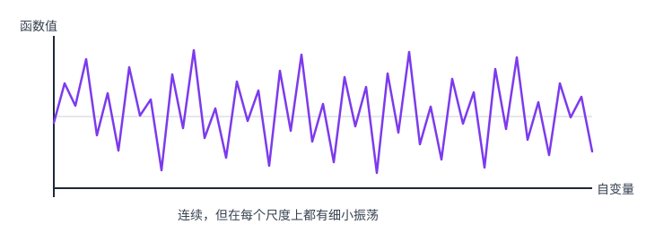
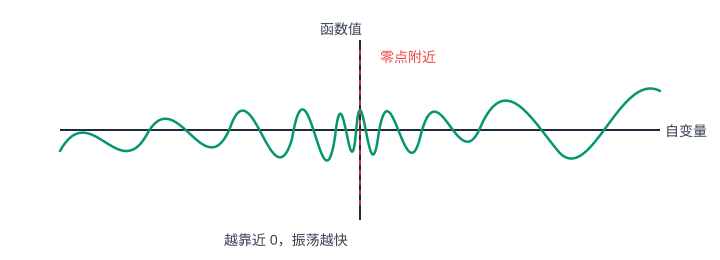
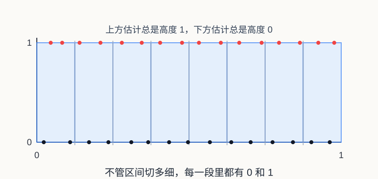
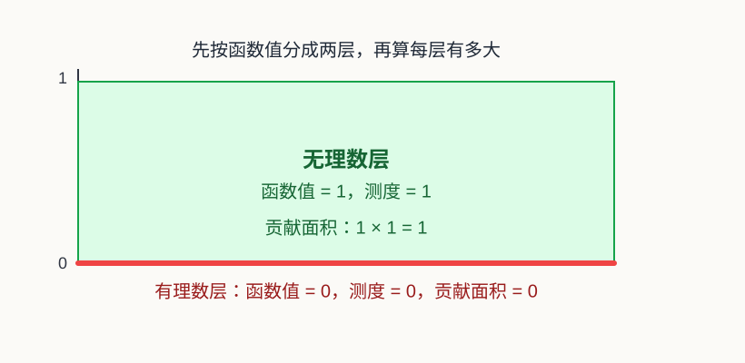
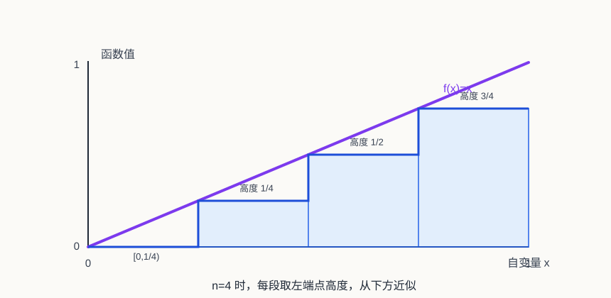
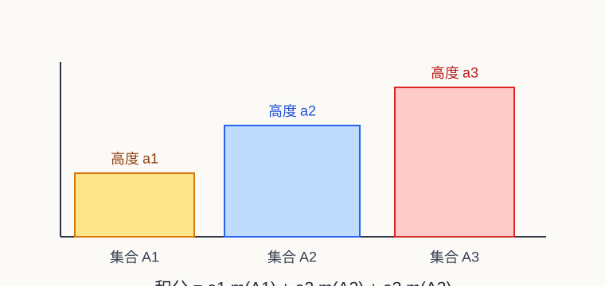
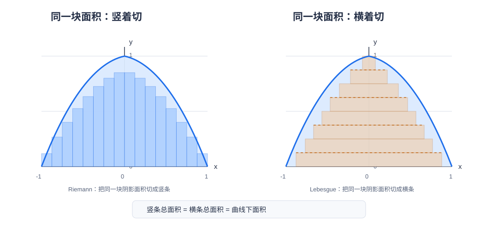

# 普通工科生也能看懂的实变函数和测度论

## 一、前言

这篇文章主要面向普通工科背景的读者，目标不是推导实变函数里的全部定理，而是先解释几个核心概念从哪里来、为什么要提出它们，以及怎样用测度的概念重新理解概率论里学过的数学期望、密度函数、分布函数和随机变量。

这是本文最核心的目的：很多工科概率论课程会直接给出密度函数、分布函数、期望公式和各种积分计算，但为了降低门槛，往往会把背后的测度结构模糊化处理。这样做足够应付计算，却不太容易真正理解“期望到底是在对什么积分”“密度到底是谁相对于谁的密度”“为什么有些分布没有密度但仍然可以谈期望”这些问题。实变函数与测度论就是把这些概念重新说清楚的语言。

本文默认读者已经学过高等数学或数学分析里的基本概念，包括极限、连续、导数、Riemann 积分、函数列的简单极限直觉，以及常见的一元微积分计算。比如，Cauchy 的 `epsilon-delta` 极限定义、连续函数的基本性质、Riemann 积分的几何直觉，都会被当作已有背景，而不会在这里重新严格展开。

但这并不意味着读者需要已经熟练掌握严格证明。本文更关心的是：当微积分里那些“足够好”的函数不再够用，或者当概率论里的“分布、密度、期望”需要更清楚的底层定义时，数学家为什么要引入可测集、测度、可测函数和 Lebesgue 积分这些新概念。

实变函数这门课最容易让人困惑的地方在于：它一上来就讲集合、点集、测度、可测函数，像是突然离开了微积分。但如果沿着一条主线看，它其实很朴素：我们希望把微积分里的积分推广到更一般的函数上，于是引入 Lebesgue 积分；为了定义 Lebesgue 积分，又必须先定义集合的“长度”，也就是测度；为了知道哪些函数可以用这种方式积分，又需要可测集和可测函数。

所以这篇文章暂时按下面这条线展开：

1. Riemann 积分有什么不足。
2. Lebesgue 积分换了什么思路。
3. Lebesgue 测度如何给集合定义“长度”。
4. 概率测度如何把“长度”换成“概率”。
5. 数学期望为什么本质上是 Lebesgue 积分。
6. 密度函数到底是相对于某个测度的 Radon-Nikodym 导数。
7. 集合的势为什么会出现在这里。
8. 外测度和可测集在整套理论中扮演什么角色。
9. 这些概念怎样连接到机器学习中的经验风险与泛化误差。

## 二、Riemann 积分的不足

如果只看大学高数里的例子，Riemann 积分几乎没有什么问题。我们算多项式、三角函数、指数函数、分段连续函数的积分，它都工作得很好。于是很多人第一次学实变函数时会有一个疑问：既然微积分已经能算面积、算体积、算期望，为什么还要重新发明一套 Lebesgue 积分？

答案要从 19 世纪分析学的发展说起。

### 分析学为什么开始关心病态函数

早期微积分主要服务于几何和物理问题。那时人们研究的函数大多很规整：曲线是光滑的，面积是可以想象的，导数和积分也常常来自速度、力、运动轨迹这些直观对象。

但到了 19 世纪，数学家开始追问更基础的问题：什么是函数？什么是连续？什么是极限？什么样的函数一定可积？什么样的函数可以逐项求极限、逐项积分、逐项求导？

一旦这些问题被严格化，许多反直觉的例子就出现了。比如：

#### 到处不连续：Dirichlet 函数

第一类是到处不连续的函数。典型例子是 Dirichlet 函数：

$$
D(x)=
\begin{cases}
0, & x \in \mathbb{Q},\\
1, & x \notin \mathbb{Q}.
\end{cases}
$$

由于任意小区间里都有有理数和无理数，它在每一点附近都无法稳定下来。这种函数在直觉上像是“整个区间里同时铺满了 0 和 1 两层点”。严格说，真实的 Dirichlet 函数图像无法靠有限采样画出来；上图只是用两层密集点阵表示这种稠密性。

#### 处处连续但处处不可导：Weierstrass 函数

第二类是处处连续但处处不可导的函数。典型例子是 Weierstrass 函数：

$$
W(x)=\sum_{n=0}^{\infty} a^n \cos(b^n \pi x).
$$

其中 `0 < a < 1`，`b` 是正奇数，并且参数满足某些条件时，`W(x)` 会处处连续但处处不可导。比如可以记住一个具体例子：`a = 1/2`，`b = 13`。

它的图像连续不断，但每个局部都充满细小振荡，没有任何一点存在普通意义下的切线。可以把它想象成一条极其粗糙的山脊线：远看是一条连着的曲线，放大以后发现全是小锯齿；再放大，小锯齿上还有更小的锯齿。普通光滑曲线在足够小的范围里会越来越像一条直线，而 Weierstrass 函数不管放大多少次，都不会变得平整。这个例子击碎了一个很自然但错误的直觉：连续曲线不一定“摸起来是光滑的”。

#### 任意小区间里剧烈震荡：sin(1/x)

第三类是在任意小区间里都剧烈震荡的函数。典型例子是：

$$
f(x)=
\begin{cases}
\sin(1/x), & x \ne 0,\\
0, & x = 0.
\end{cases}
$$

当 `x` 越靠近 0，`1/x` 越大，函数就在 `-1` 和 `1` 之间越来越快地振荡。注意这里的问题主要集中在 0 附近：离 0 远一点，它还是一个很正常的连续函数。

这些例子常被称为“病态函数”。这个词并不是说它们不合法，而是说它们挑战了早期微积分建立在几何直觉上的想象。数学家慢慢意识到：如果只靠“画得出来的曲线”和“直观面积”，分析学的基础是不够稳的。

不过这里要分清楚：并不是每一个病态函数都会卡住 Riemann 积分。Weierstrass 函数虽然处处不可导，但它仍然处处连续，所以在闭区间上仍然可以 Riemann 积分。它卡住的是“连续曲线应该局部像直线、应该有切线”这种微积分直觉。`sin(1/x)` 在 0 附近振荡越来越快，但如果人为规定 $f(0)=0$，它只是在 0 这一点不连续，在闭区间上仍然是 Riemann 可积的。它卡住的是“靠近某一点时函数值应该逐渐稳定下来”这种极限直觉。

真正直接卡住 Riemann 积分的是 Dirichlet 函数这一类例子。它的问题不是某一个点附近不好，而是每一个小区间里都有有理数和无理数，函数值总是在 0 和 1 之间跳来跳去。这样 Riemann 积分按小区间估计面积时，上方估计和下方估计永远合不到一起。

实变函数论就是在这种背景下发展起来的。它可以看成是数学分析的进一步严格化和扩展：数学分析已经开始用极限语言重新整理连续、导数、积分这些概念，而实变函数则继续追问，当函数不再那么光滑、间断点不再只是有限多个、极限过程不再那么规整时，这些概念还能不能成立。它关心的问题依然是微积分里的老问题：连续、极限、可导、可积、收敛。但研究对象从“足够好的函数”扩展到实数轴或欧氏空间上的一般实值函数，要求也变得更严格。

### Riemann 积分在做什么

在这个背景下，我们再回忆 Riemann 积分在做什么。

假设要计算一个函数在 `[a, b]` 上的积分。Riemann 积分的做法是把定义域 `[a, b]` 切成很多小区间，在每个小区间上选一个点，用这个点的函数值当作高度，然后把所有小矩形面积加起来。

粗略说，Riemann 积分是先切分自变量所在的区间，再用每个小区间上的函数高度近似这一小块的面积，最后把这些小面积加起来。

当函数连续或分段连续时，这个方法非常可靠。因为区间切得足够细以后，每个小区间里的函数值变化不会太离谱，小矩形就能很好地逼近曲线下面积。

但这个方法有一个隐藏前提：函数在很小的区间里应该比较稳定。至少，随着区间越切越细，上方估计和下方估计应该能靠近同一个数。

Dirichlet 函数这样的病态函数，正是从这里把 Riemann 积分卡住了。

### 从 Dirichlet 函数看两种积分的差别

最经典的例子是 Dirichlet 函数：

$$
f(x)=
\begin{cases}
0, & x\in\mathbb{Q},\\
1, & x\notin\mathbb{Q}.
\end{cases}
$$

这个函数的麻烦在于，有理数和无理数都在实数轴上稠密。也就是说，在任意小的区间里，都一定既有有理数，也有无理数。

于是无论我们怎样切分 `[0, 1]`，每个小区间里函数值都既能取到 0，也能取到 1。用 Riemann 积分的语言说：

- 每个小区间上的下确界是 0。
- 每个小区间上的上确界是 1。
- 所以下和始终是 0。
- 上和始终是 1。

区间切得再细也没用。上和和下和无法逼近同一个数，因此 Dirichlet 函数在 `[0, 1]` 上 Riemann 不可积。

这个例子很重要，因为它说明 Riemann 积分不是“所有面积问题”的最终答案。它对连续函数很好，对分段连续函数也很好，但面对更一般的函数时，它会失效。

Lebesgue 积分换了一种看法：既然按 $x$ 的位置切总是混在一起，那就按函数值分层。

Dirichlet 函数只有两层：

- 函数值为 0 的地方，是 $[0,1]$ 里的有理数。
- 函数值为 1 的地方，是 $[0,1]$ 里的无理数。

如果用测度来理解“这一层有多大”，那么有理数这一层长度为 0，无理数这一层长度为 1。

这里第一次出现 $dm$，先解释一下。以前在微积分里我们常写 $\int f(x)\,dx$，可以把 $dx$ 理解成“沿着 x 轴按长度累加”。在 Lebesgue 积分里，我们更明确地写成 $\int f\,dm$，意思是“按照测度 $m$ 来累加”。当 $m$ 是实数轴上的 Lebesgue 测度时，它在普通区间上就是长度，所以对连续函数来说，$\int f\,dm$ 和 $\int f(x)\,dx$ 会给出同样结果。

区别在于，$dx$ 这个记号更像微积分里的传统写法，默认我们在处理一段一段的区间；$dm$ 则提醒我们：真正参与积分的是一个测度 $m$。它不只会量普通区间，也可以讨论有理数集、无理数集、函数值某一层对应的点集这些更复杂的集合。因此从 Lebesgue 积分看：

$$
\int_0^1 f\,dm
=0\cdot m([0,1]\cap\mathbb{Q})
+1\cdot m([0,1]\setminus\mathbb{Q})
=1.
$$

这个公式可以这样读：

- $\int_0^1 f\,dm$ 表示把函数 $f$ 对 Lebesgue 测度 $m$ 做积分。这里的 $m$ 可以先理解成“长度”。
- $[0,1]\cap\mathbb{Q}$ 表示 $[0,1]$ 里面的有理数，也就是函数值等于 0 的那一层。
- $[0,1]\setminus\mathbb{Q}$ 表示 $[0,1]$ 里面不是有理数的点，也就是无理数那一层，函数值等于 1。
- $0\cdot m([0,1]\cap\mathbb{Q})$ 的意思是：有理数这一层的函数值是 0，这一层的长度是 0，所以贡献是 0。
- $1\cdot m([0,1]\setminus\mathbb{Q})$ 的意思是：无理数这一层的函数值是 1，这一层的长度是 1，所以贡献是 1。

把两层贡献加起来，就是 $0+1=1$。所以这个公式不是在做神秘运算，而是在说：按函数值分成两堆，每一堆用“这一堆的函数值”乘以“这一堆的长度”，最后相加。Riemann 积分纠结的是“每一小段里函数稳不稳定”，Lebesgue 积分问的是“每一种函数值对应的点集有多大”。

### Lebesgue 的关键转向

Lebesgue 的关键想法，不是继续把 x 轴切得更细，而是换一个问题问法。Riemann 积分问的是：在每个很小的自变量区间里，函数大概有多高？Lebesgue 积分问的是：函数取某一类值的那些点，整体上有多大？

这一步看似只是换了切分方向，其实非常深。Riemann 积分按定义域切分，Lebesgue 积分按函数值分层。换句话说，Lebesgue 不再执着于每个小区间内函数是否震荡，而是把取相同或相近函数值的点收集起来，再衡量这些点集的大小。

这里先不证明“有理数长度为 0”这件事，只给一个直觉：有理数虽然在任何区间里都能找到，但它们可以被排成一个序列，一个一个数出来；而每一个点本身没有长度。Lebesgue 测度会把所有可数个点的总长度仍然定义为 0。后面讲集合的势和零测集时，我们会专门解释为什么这件事成立。

这就是 Lebesgue 积分的历史意义：它把“函数下面积”这个问题，转化成了“函数值分层 + 点集测度”的问题。

### 为什么这会发展出测度论

但新的问题马上出现了：如果要按函数值分层，我们就必须能回答“某一层对应的点集有多大”。

比如 Dirichlet 函数里，我们必须能说清楚：

区间 $[0,1]$ 中有理数的长度是多少？区间 $[0,1]$ 中无理数的长度又是多少？

可以打个比方：假设桌上散着很多硬币，我们想知道总金额。一种做法是沿着桌面从左到右扫过去，看到一枚就记下它的面值，最后全部加起来。这有点像 Riemann 积分：先按“位置”处理。

另一种做法是先按面值分堆：1 元硬币一堆，5 角硬币一堆，1 角硬币一堆。然后用“面值”乘以“这一堆有多少枚”，最后把各堆金额加起来。这更像 Lebesgue 积分：先按“函数值”分层，再看每一层对应的对象有多少。

对有限个硬币来说，“有多少枚”直接数就行。但如果对象不是有限个硬币，而是实数轴上的点，问题就变成了：函数值等于 0 的那些点“有多大”？函数值等于 1 的那些点又“有多大”？这时普通数数不够用了，我们需要一种能衡量点集大小的工具。

这把工具就是测度。它不只要能量区间长度，还要能量更复杂的集合：有理数集、无理数集、函数值落在某个范围里的点集。于是，研究积分的问题自然变成了研究集合大小的问题，测度论也就被推到了前台。

从历史上看，Lebesgue 在 1901 年发表了推广定积分的思想，1902 年在博士论文《Intégrale, longueur, aire》中系统发展了长度、面积和积分的理论。这个标题本身就很能说明问题：Lebesgue 积分不是凭空造出来的符号游戏，而是从“长度”和“面积”这些几何问题中长出来的。

在 Lebesgue 之前，Jordan、Borel 等人已经在研究集合的长度和测度问题。Lebesgue 的贡献在于，他把集合测度和积分理论真正结合起来，让“哪些集合有大小”“哪些函数可以积分”“极限和积分什么时候能交换”这些问题进入同一个框架。

这也是为什么实变函数和测度论常常被放在一起学。实变函数关心一般实值函数的性质；测度论提供描述集合大小、函数可测性和积分的语言。后面我们会看到，这套语言不仅能修补 Riemann 积分的不足，也能把概率论里的期望、密度和分布重新说清楚。

## 三、Lebesgue 积分

Riemann 积分是沿着自变量方向切分定义域，然后用每一小段上的函数高度来近似面积。Lebesgue 积分则换了一个角度：先按照函数值的大小分层，再看每一层对应的点集有多大，最后把“函数值”和“点集大小”合在一起计算总量。

先不要急着背定义。我们从一个最熟悉的连续函数开始看，因为对普通连续函数，Lebesgue 积分应该给出和 Riemann 积分一样的答案。

### 一个连续函数的例子

在 $[0,1]$ 上计算

$$
f(x)=x.
$$

用 Riemann 积分算，大家都知道答案是三角形面积：

$$
\int_0^1 x\,dx=\frac12.
$$

Lebesgue 积分也应该得到同样的结果。它的看法是：不要先按 $x$ 的位置切，而是按函数值的高度切。因为 $f(x)=x$ 在 $[0,1]$ 上刚好从 0 增加到 1，所以“函数值落在 $[\frac{k}{n},\frac{k+1}{n})$”的那一层，对应的也是 $x$ 落在同样的区间里。

可以把 $f(x)=x$ 想象成一个从 0 慢慢升到 1 的斜面。Lebesgue 积分先用一个更容易算的函数去近似它：把这个斜面改造成一节一节往上的台阶，每一节台阶都用这一段左端点的高度。台阶一定在斜面下面，但台阶越切越细，就越贴近原来的斜面。

具体做法是：把 $[0,1]$ 平均分成 $n$ 小段，每一小段都取左端点的函数值作为高度。也就是说，在第 $k$ 小段

$$
\frac{k}{n}\le x<\frac{k+1}{n},
$$

上，令

$$
s_n(x)=\frac{k}{n},
\quad k=0,1,\ldots,n-1.
$$

比如 $n=4$ 时，就是：

$$
s_4(x)=
\begin{cases}
0, & 0\le x<\frac14,\\
\frac14, & \frac14\le x<\frac12,\\
\frac12, & \frac12\le x<\frac34,\\
\frac34, & \frac34\le x<1.
\end{cases}
$$

这个 $s_n$ 就是把 $[0,1]$ 切成 $n$ 段，每一段都用左端点高度近似原函数。它的 Lebesgue 积分是“每段高度乘以每段长度，再相加”：

$$
\int_0^1 s_n\,dm
=\sum_{k=0}^{n-1}\frac{k}{n}\cdot\frac1n
=\frac{1}{n^2}\sum_{k=0}^{n-1}k
=\frac{n-1}{2n}.
$$

当 $n\to\infty$ 时，

$$
\frac{n-1}{2n}\to\frac12.
$$

所以 Lebesgue 积分也得到

$$
\int_0^1 x\,dm=\frac12.
$$

这里的 $dm$ 可以先理解成“按照测度 $m$ 来积分”。在这一章里，$m$ 指 Lebesgue 测度；在实数轴上，它最直观的意思就是长度。所以 $\int_0^1 x\,dm$ 可以读成：用长度作为权重，把 $x$ 这个函数在 $[0,1]$ 上累加起来。

这个例子说明：对普通连续函数，Lebesgue 积分不会改变我们熟悉的答案；它只是换了一套更能处理复杂函数和概率分布的语言。

### 什么是简单函数

刚才的 $s_4$ 就是一个简单函数。所谓简单函数，说白了就是只取有限多个值的函数。它可能长得像台阶，也可能不是按连续区间分段；关键只在于它的输出值只有有限种。

比如一个函数只可能取 $a_1,a_2,\ldots,a_k$ 这些值，并且取值为 $a_i$ 的那部分集合记作 $A_i$，那么它可以写成：

$$
s(x)=\sum_{i=1}^{k} a_i\,\mathbf{1}_{A_i}(x).
$$

这里的 $\mathbf{1}_{A_i}(x)$ 读作“集合 $A_i$ 的指示函数”。它不是普通的数字 1，而是一个只会输出 0 或 1 的开关函数：

$$
\mathbf{1}_{A_i}(x)=
\begin{cases}
1, & x\in A_i,\\
0, & x\notin A_i.
\end{cases}
$$

也就是说，$x$ 落在 $A_i$ 里时，这个开关打开，值为 1；$x$ 不在 $A_i$ 里时，这个开关关闭，值为 0。所以上面的求和公式只是把“函数在 $A_i$ 上取值为 $a_i$”这件事压缩写出来。

简单函数的积分也很好理解：

$$
\int s\,dm
=\sum_{i=1}^{k}a_i m(A_i).
$$

这里的 $m(A_i)$ 表示集合 $A_i$ 的测度，可以先理解成这一层在数轴上占了多长。所以 $a_i m(A_i)$ 的意思就是：这一层的高度是 $a_i$，这一层的大小是 $m(A_i)$，两者相乘就是这一层对积分的贡献。

这就是 Lebesgue 积分最核心的计算方式：按函数值分层，每层用“函数值 $\times$ 这一层的大小”，最后加起来。

### 从简单函数逼近一般函数

真实函数通常不会只取有限多个值。比如 $f(x)=x$ 会连续地从 0 变到 1，$f(x)=x^2$ 在 $[-1,1]$ 上也会取连续无穷多个值。Lebesgue 的办法不是一下子硬算它们，而是先用简单函数一层层逼近。

这里的“逼近”本质上就是一个极限过程。前面算 $f(x)=x$ 时，我们不是只造了一个台阶函数，而是造了一列台阶函数：

$$
s_1,s_2,s_3,\ldots
$$

$s_4$ 只是其中一个例子。当 $n$ 越来越大，台阶切得越来越细，$s_n(x)$ 就越来越接近原来的 $f(x)$。同时，$s_n$ 的积分也越来越接近 $f$ 的积分：

$$
\int f\,dm
=\lim_{n\to\infty}\int s_n\,dm.
$$

所以 Lebesgue 积分不是“随便找一个简单函数凑一下”，而是用一整列越来越精细的简单函数，把原函数一点点逼出来；最后要的是这些简单函数积分的极限。

大白话说，就是把连续变化的函数值压成有限档位。粗一点可以每 $\frac14$ 一档，细一点可以每 $\frac18$ 一档，再细一点可以每 $\frac{1}{100}$ 一档。每一个近似函数自己只取有限多个值，所以它是简单函数；随着档位越来越密，它就越来越像原来的函数。

通常先从非负函数开始，并且从下方逼近。所谓“从下方”，就是每次都把真实函数值向下舍入到不超过它的档位。比如真实值是 $0.68$，如果每 $\frac14$ 一档，就先用 $0.5$ 代替；如果每 $\frac18$ 一档，就用 $0.625$ 代替。这样做出来的近似值永远不超过真实值，但档位越细越贴近真实值。

这背后的思想很朴素：简单函数已经会积分，一般函数先用越来越细的简单函数逼近。每一步都是一个保守估计，每一步都能算出一个积分。最后这些积分数值趋近到哪里，那里就定义为原函数的 Lebesgue 积分。

如果函数有正有负，就把它拆成正的部分和负的部分分别算，最后相减。通常说一个函数 Lebesgue 可积，本质上是在说它的“总绝对量”不能爆掉：

$$
\int |f|\,dm<\infty.
$$

这条条件关心的不是函数每一点是否连续、光滑、好看，而是整体累加起来是否有限。某些点上很奇怪并不一定影响积分；如果这些点只占零测集，积分甚至完全看不见它们。后面概率论里说“概率为 0 的事件不影响期望”，本质也是同一个思想。

### 再看两个例子

再看 $f(x)=1-x^2$ 在 $[-1,1]$ 上。它不是简单函数，但可以像刚才一样用越来越细的简单函数逼近。这里不用想得太复杂，只看曲线下面那块面积就行。

Riemann 积分是把这块面积竖着切成很多细条，再把竖条面积加起来。Lebesgue 积分是把同一块面积横着切成很多薄层，再把横条面积加起来。

竖条面积和、横条面积和，逼近的都是同一块阴影面积。切得越来越细时，这两个面积和就会趋向同一个数。

所以对 $1-x^2$ 这样的连续函数，Lebesgue 积分和 Riemann 积分结果一样：

$$
\int_{-1}^{1}(1-x^2)\,dm
=\int_{-1}^{1}(1-x^2)\,dx
=\frac43.
$$

Weierstrass 函数也是类似的。它的图像连续不断，但处处没有普通意义下的切线。对 Riemann 积分来说，它仍然可积，因为它连续；对 Lebesgue 积分来说，它当然也可积，而且积分值仍然等于它的 Riemann 积分值。区别在于，Lebesgue 积分不需要依赖“曲线是否光滑”的直觉，而是把它看成一个可测函数，按函数值分层，用简单函数逼近来定义积分。

所以这一章可以先抓住三句话：简单函数最好算；一般函数用简单函数逼近；只要是普通连续函数，Lebesgue 积分和 Riemann 积分算出来一样，但 Lebesgue 的框架能继续处理 Dirichlet 这种 Riemann 积分卡住的对象。

## 四、Lebesgue 测度

现在剩下的问题是：集合的“长度”到底怎么定义？

### 4.1 实数区间的测度

对最简单的区间 `[a, b]`，我们当然希望它的 Lebesgue 测度是：

$$
m([a,b])=b-a.
$$

这保证了 Lebesgue 积分在处理普通连续函数时，和 Riemann 积分给出一样的结果。Lebesgue 积分不是推翻微积分，而是在保留原有结果的基础上扩大适用范围。

普通连续函数在两种积分下会得到相同的结果；上一节的 $f(x)=x$ 就是最简单的例子。

### 4.2 集合的势

为了理解为什么 `[0, 1]` 中有理数的测度为 0，需要先引入集合的势。

集合的势可以粗略理解为集合元素的“数量”。对有限集合，这就是普通的元素个数；对无限集合，情况会更微妙。无限集合也可以比较大小，只是比较方式不再是数数，而是看两个集合之间能否建立一一对应。

如果集合 `A` 和集合 `B` 之间存在双射，那么它们的势相同，记作：

$$
|A|=|B|.
$$

一个经典例子是自然数集和偶数集。虽然偶数看起来只是自然数的一半，但映射

$$
n\mapsto 2n
$$

给出了自然数和偶数之间的一一对应。因此，自然数集和偶数集的势相同。

能够和自然数集建立一一对应的集合叫可数集。自然数集、整数集、奇数集、偶数集都是可数集。

比较反直觉的是，有理数集也是可数集。原因可以这样想：每个正有理数都能写成一个分数 $\frac{p}{q}$，其中 $p,q$ 是正整数。我们可以把它们排成一张表：

$$
\begin{array}{cccc}
\frac11 & \frac12 & \frac13 & \cdots\\
\frac21 & \frac22 & \frac23 & \cdots\\
\frac31 & \frac32 & \frac33 & \cdots\\
\vdots & \vdots & \vdots & \ddots
\end{array}
$$

这张表看起来有无穷行、无穷列，好像数不完。但可以沿着对角线一层一层扫过去：先扫 $p+q=2$ 的位置，再扫 $p+q=3$ 的位置，再扫 $p+q=4$ 的位置。这样每次只扫有限多个分数，并且迟早会扫到任何一个给定的 $\frac{p}{q}$。

中间会有重复，比如 $\frac12$ 和 $\frac24$ 表示同一个有理数，把重复项跳过就行。负有理数也一样处理，再加上 0。于是所有有理数仍然可以一个一个排成序列。

也就是说，虽然有理数在实数轴上到处稠密，但它们仍然可以被排成一个序列：

$$
q_1,q_2,q_3,\ldots
$$

所有可数无限集合的势通常记为 $\aleph_0$，读作“阿列夫零”。

实数集则不可数，它的势比自然数集更大。自然数集这种“可以一个一个数出来的无限”，势是 $\aleph_0$；实数集这种“数不出来的无限”，势通常记为 $\mathfrak{c}$，也常写成 $2^{\aleph_0}$，读作连续统的势。直观上可以先记成：

$$
\aleph_0 < \mathfrak{c}.
$$

区间 $[0,1]$、无理数集、整个实数集都和实数集等势，所以它们的势都是 $\mathfrak{c}$。

这里要小心一个很重要的区别：势描述的是集合元素的多少，测度描述的是集合在几何或概率意义下的大小。二者有关联，但不是一回事。有理数集是无限集，而且在实数轴上处处稠密，但它的 Lebesgue 测度仍然是 0。

### 4.3 零测集

Lebesgue 测度里，一个集合如果测度为 0，就叫零测集。有限集是零测集，可数集也是零测集。因此：

$$
m([0,1]\cap\mathbb{Q})=0.
$$

又因为 `[0, 1]` 可以分成互不相交的两部分：

$$
[0,1]=([0,1]\cap\mathbb{Q})\cup([0,1]\setminus\mathbb{Q}).
$$

并且 Lebesgue 测度满足可数可加性，所以：

$$
m([0,1])
=m([0,1]\cap\mathbb{Q})
+m([0,1]\setminus\mathbb{Q}).
$$

于是：

$$
1=0+m([0,1]\setminus\mathbb{Q}).
$$

因此：

$$
m([0,1]\setminus\mathbb{Q})=1.
$$

这就解释了为什么 Dirichlet 函数在 `[0, 1]` 上的 Lebesgue 积分等于 1。

零测集在机器学习和概率论里对应一个非常常见的表达：几乎处处成立。所谓“几乎处处”，就是允许结论在一个测度为 0 的集合上失败。对概率测度来说，就是允许结论在概率为 0 的事件上失败。

### 4.4 外测度

Lebesgue 测度不是一上来就能直接定义好的。问题在于：区间的长度很好说，$[a,b]$ 的长度就是 $b-a$；但一个很奇怪的集合，比如有理数集、无理数集，甚至更复杂的点集，它的“长度”该怎么量？

一个自然办法是：不管这个集合本身多奇怪，我们先用很多普通区间把它盖住。普通区间的长度我们会算，所以这些区间的总长度也会算。然后我们在所有可能的覆盖方式里，找最省长度的那一种。

这就是外测度的直觉。外测度通常记为 $m^*$。可以把它想成“从外面给集合量尺寸”：用一堆区间把集合包住，看看最少需要多长的区间总长度。

比如只量一个点 $\{x_0\}$，我们可以用一个很短的小区间包住它：

$$
(x_0-\varepsilon,x_0+\varepsilon).
$$

这个区间长度是 $2\varepsilon$。因为 $\varepsilon$ 可以取得任意小，所以一个点的外测度就是 0。有限多个点也是 0；可数多个点也可以用一串越来越短的小区间分别包住，总长度压到任意小，所以可数集的外测度也是 0。这就是前面说“有理数虽然到处都是，但长度为 0”的直觉来源。

外测度有几个很符合直觉的性质：

- 非负性：集合大小不能为负。
- 单调性：如果 $A\subseteq B$，那么 $m^*(A)\le m^*(B)$。
- 平移不变性：集合整体平移后，大小不变。
- 可数次可加性：一列集合并起来的外测度，不超过它们外测度之和。

最后一条写成公式是：

$$
m^*\left(\bigcup_{n=1}^{\infty}A_n\right)
\le
\sum_{n=1}^{\infty}m^*(A_n).
$$

这条不等式的大白话是：先分别盖住每个集合，再把这些盖法合起来，肯定也能盖住它们的并集。所以“并起来后的大小”不会超过“分别大小加起来”。

但我们真正希望“长度”满足的是更强的可数可加性。也就是说，当这些集合两两不相交时，应有：

$$
m\left(\bigcup_{n=1}^{\infty}A_n\right)
=
\sum_{n=1}^{\infty}m(A_n).
$$

这句话就是我们对“长度”的基本期待：如果几块互不重叠的东西拼在一起，总长度应该等于每一块长度相加。

麻烦在于，外测度想给所有集合都分配大小，胆子太大了。对某些特别奇怪的集合，它只能保证上面的“小于等于”，不能保证真正的“等于”。这些集合会破坏我们对长度的正常期待。

所以 Lebesgue 的做法是：先用外测度给所有集合试着量一遍；然后把那些和长度运算相处得好的集合挑出来，叫 Lebesgue 可测集；最后把外测度限制在这些可测集上，就得到 Lebesgue 测度。

可以把外测度看作通向 Lebesgue 测度的脚手架。它先尽可能大胆地给集合分配大小，再把会破坏可加性的坏对象挡在门外。真正进入 Lebesgue 测度世界的集合，才是我们后面放心拿来积分的集合。

### 4.5 用测度回看 Dirichlet 函数

现在再回头看 Dirichlet 函数，重点就不是重新算积分，而是看测度到底解决了什么问题：

$$
f(x)=
\begin{cases}
0, & x\in\mathbb{Q},\\
1, & x\notin\mathbb{Q}.
\end{cases}
$$

在 $[0,1]$ 上，有理数虽然到处都是，但它是可数集，所以测度为 0；无理数也到处都是，但它占据了整个区间除去一个零测集以外的部分，所以测度为 1。

于是从 Lebesgue 积分看，这个函数“几乎处处”等于 1：

$$
\int_{0}^{1}f\,dm=1.
$$

Riemann 积分被每个小区间里的剧烈跳动卡住；Lebesgue 积分则先问两层点集分别有多大。这里真正起作用的不是某个计算技巧，而是“零测集不影响积分”这个新观念。

## 五、用测度重新理解概率论

对工科读者来说，实变函数与测度论最有用的地方，可能不是让我们会算更多奇怪函数的积分，而是让我们重新理解概率论里那些熟悉但其实很模糊的概念。

### 从 `dx` 到 `dP`

在一元微积分里，我们最熟悉的积分长这样：

$$
\int_a^b f(x)\,dx.
$$

这里的 `dx` 常常被读成“对 x 积分”。但从测度论角度看，`dx` 更准确地说是 Lebesgue 测度。它告诉我们：每一小段区间按它的长度来计权。

如果把 `dx` 换成 `dP`，意思就变了：

$$
\int f(x)\,dP(x).
$$

这时积分不再按普通长度计权，而是按概率分布 $P$ 计权。哪些区域概率大，哪些区域对积分贡献就大；哪些区域概率为 0，即使在几何上看起来不空，也不会影响这个积分。

在工科概率论里，我们通常会学：

- 随机变量有分布函数。
- 连续型随机变量有密度函数。
- 连续型随机变量的数学期望可以写成 $\int_{\mathbb{R}}x p(x)\,dx$。
- 离散型随机变量的数学期望可以写成 $\sum_i x_i p_i$。

这些公式当然能用，但它们容易给人一种错觉：好像概率论天然分成“离散型”和“连续型”两套公式。测度论的观点会把它们统一起来。

概率空间可以写成：

$$
(\Omega,\mathcal{F},P).
$$

其中 `Omega` 是样本空间，`F` 是事件组成的可测集合族，`P` 是概率测度。所谓概率测度，就是一种特殊的测度：它给整个样本空间分配的大小为 1。

随机变量也可以重新理解为：

$$
X:\Omega\to\mathbb{R}.
$$

并且它必须是可测函数。这个条件的意思是：我们问“X 落在某个区间或某个集合里”的时候，对应的样本点集合必须是一个事件，因而可以被概率 `P` 赋值。

数学期望则不是一个孤立公式，而是 Lebesgue 积分：

$$
\mathbb{E}[X]=\int_{\Omega}X\,dP.
$$

这句话非常重要。它说明期望不是一定要对 `dx` 积分，而是对概率测度 `P` 积分。

如果 `X` 是离散型随机变量，这个积分表现为求和：

$$
\mathbb{E}[X]=\sum_i x_i\,P(X=x_i).
$$

如果 `X` 有密度函数 `p(x)`，这个积分表现为我们熟悉的连续型公式：

$$
\mathbb{E}[X]=\int_{\mathbb{R}}x p(x)\,dx.
$$

所以，离散型期望和连续型期望不是两种互不相干的公式，而是同一个测度积分在不同情形下的表现。

密度函数也可以重新理解。所谓密度，并不是随机变量自带的一根曲线，而是一个测度相对于另一个测度的变化率。连续型概率密度 `p(x)` 更准确地说，是概率测度 `P` 相对于 Lebesgue 测度 `dx` 的 Radon-Nikodym 导数：

$$
dP=p(x)\,dx.
$$

这也解释了为什么有些分布没有普通意义下的密度。比如离散分布不是相对于 Lebesgue 测度的密度函数，但它仍然有概率测度，也仍然能定义期望。更一般地，很多分布可以既不是纯离散，也不是普通连续型；测度论仍然能统一处理它们。

从这个角度看，大学工科概率论里很多概念其实是测度论的影子：

- 事件：可测集合。
- 概率：定义在事件上的测度。
- 随机变量：可测函数。
- 分布：随机变量把概率测度从样本空间推到实数轴上得到的测度。
- 密度函数：一个测度相对于另一个测度的导数。
- 数学期望：随机变量对概率测度的 Lebesgue 积分。

这才是本文真正想建立的视角。我们学习实变函数和测度论，不只是为了知道 Lebesgue 积分比 Riemann 积分更强，而是为了回头看懂概率论：那些被直接拿来计算的期望、密度、分布，背后到底是什么。

### 极限和期望为什么能交换

Lebesgue 积分真正强大的地方，不只是能处理 Dirichlet 函数。更重要的是，它和极限过程配合得更好。

在概率论和机器学习里，我们经常会遇到一列函数或随机变量：

$$
f_1,f_2,f_3,\ldots
$$

自然的问题是：

$$
\lim_{n\to\infty}\int f_n\,dP
\quad\text{和}\quad
\int \lim_{n\to\infty}f_n\,dP
$$

什么时候相等？

这不是一个纯技术问题。它对应很多概率论和机器学习里的核心操作：样本数趋于无穷时，经验平均能不能收敛到总体平均？模型逼近目标函数时，损失的极限能不能和期望交换？训练过程中的一列函数如果收敛，风险是否也收敛？

Lebesgue 积分提供了一批非常重要的收敛定理，比如单调收敛定理、Fatou 引理和控制收敛定理。这里暂时不展开证明，只先记住它们背后的共同主题：如果函数列的收敛方式足够好，或者它们被某个可积函数统一控制，那么“先取极限再积分”和“先积分再取极限”就可以交换。

## 六、机器学习里的期望风险

从这个概率论视角看机器学习，期望风险就变得很自然。设数据点 $(X,Y)$ 来自未知分布 $P$，模型为 $f$，损失函数为 $L(f(X),Y)$。真实风险可以写成：

$$
R(f)=\mathbb{E}_{P}[L(f(X),Y)].
$$

这句话翻译成测度论语言就是：把损失函数对概率测度 $P$ 做积分：

$$
R(f)
=\int L(f(x),y)\,dP(x,y).
$$

训练集给出的经验风险则是：

$$
\hat R_n(f)=\frac{1}{n}\sum_{i=1}^{n}L(f(x_i),y_i).
$$

从测度论角度看，这其实也是积分，只不过积分所用的不是未知真实分布 $P$，而是经验测度 $P_n$。经验测度把质量均匀放在训练样本点上：

$$
P_n=\frac{1}{n}\sum_{i=1}^{n}\delta_{(x_i,y_i)}.
$$

于是经验风险可以写成：

$$
\hat R_n(f)=\int L(f(x),y)\,dP_n(x,y).
$$

这样一来，泛化误差就不是凭空冒出来的神秘量。它可以被看成：同一个损失函数，在真实数据分布 $P$ 下的积分，和在经验分布 $P_n$ 下的积分，二者相差多少。

同样的视角也能帮助我们理解机器学习里很多“分布之间的距离”或“分布之间的差异”。这些量表面上看是不同公式，本质上很多都在比较两个概率测度。

比如 KL 散度。设真实分布是 $P$，模型分布是 $Q$。如果 $P$ 和 $Q$ 都有密度，分别记为 $p(x)$ 和 $q(x)$，那么 KL 散度常写成：

$$
D_{\mathrm{KL}}(P\|Q)
=\int p(x)\log\frac{p(x)}{q(x)}\,dx.
$$

从测度论角度看，它其实是在用 $P$ 自己作为权重，去平均一个“密度比的对数”：

$$
D_{\mathrm{KL}}(P\|Q)
=\int \log\frac{dP}{dQ}\,dP.
$$

这里的 $\frac{dP}{dQ}$ 就是 Radon-Nikodym 导数，可以理解成“$P$ 相对于 $Q$ 的密度”。所以 KL 散度不是凭空冒出来的公式，而是在问：如果真实世界按 $P$ 发生，用 $Q$ 来描述它，会平均付出多少额外代价。

交叉熵也可以这样看。在分类模型里，我们常最小化交叉熵，本质上是在最小化真实分布对模型负对数概率的期望：

$$
H(P,Q)
=-\int \log q(x)\,dP(x).
$$

也就是说，交叉熵仍然是一个对概率测度 $P$ 的积分。它把“模型给真实样本分配了多大概率”这件事，按真实分布加权平均起来。

还有一些指标也天然带有测度论味道：

- 总变差距离：看两个概率测度在所有事件上的概率最多能差多少。
- Wasserstein 距离：把一个分布搬运成另一个分布，最少需要付出多少运输成本。
- $L^p$ 距离：把两个函数的差的绝对值按测度积分，例如 $\int |f-g|^p\,dP$。

这些概念以后在统计学习、生成模型、最优传输、信息论里都会反复出现。测度论的好处是，它让我们知道：这些指标不是孤立公式，而是在同一套语言里比较函数、分布和概率测度。

沿着这条线，实变函数与测度论会提供几个基础词汇：

- 可测函数：保证损失、模型输出、随机变量能被放进概率积分里。
- 几乎处处：允许忽略概率为 0 的异常情况。
- Lebesgue 积分：统一期望、风险、误差和分布上的平均。
- 收敛定理：说明什么时候可以把极限和积分交换。
- Lp 空间：用范数和距离描述函数误差，比如 `L1` 风险、`L2` 误差。
- Radon-Nikodym 导数：理解密度、似然比、KL 散度、重要性采样和分布变换。

到这里可以先抓住一句话：Lebesgue 积分把“面积”推广成了“按测度加权的整体平均”。当测度是长度时，它像传统积分；当测度是概率时，它就是期望；当测度是经验分布时，它就是样本平均。
