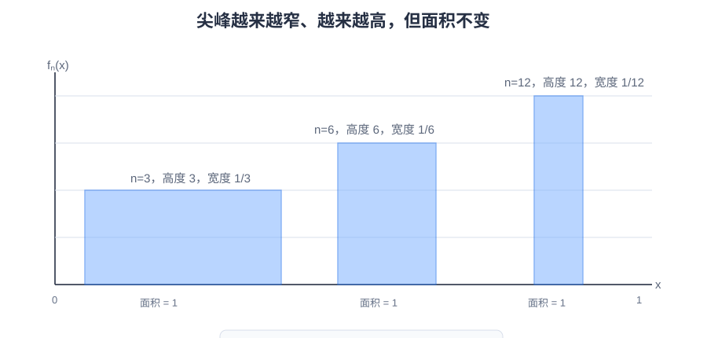

# 普通工科生也能看懂的实变函数和测度论

## 一、前言

这篇文章主要面向普通工科背景的读者，目标不是推导实变函数里的全部定理，而是先解释几个核心概念从哪里来、为什么要提出它们，以及怎样用测度的概念重新理解概率论里学过的数学期望、密度函数、分布函数和随机变量。

本文默认读者已经学过高等数学或数学分析里的基本概念，包括极限、连续、导数、Riemann 积分、函数列的简单极限直觉，以及常见的一元微积分计算。比如，Cauchy 的 `epsilon-delta` 极限定义、连续函数的基本性质、Riemann 积分的几何直觉，都会被当作已有背景，而不会在这里重新严格展开。

但这并不意味着读者需要已经熟练掌握严格证明。本文更关心的是：当微积分里那些“足够好”的函数不再够用，或者当概率论里的“分布、密度、期望”需要更清楚的底层定义时，数学家为什么要引入可测集、测度、可测函数和 Lebesgue 积分这些新概念。

实变函数可以看成数学分析的继续发展。数学分析已经把微积分里的极限、连续、导数、Riemann 积分等概念严格化；实变函数则继续追问：当函数不再那么规整、函数列极限可能变坏、积分和极限不一定能交换时，分析学还能不能建立一套稳定的语言？

所以，实变函数研究的并不是一套和微积分无关的东西。它仍然研究实数轴或欧氏空间上的实值函数，关心的也是极限、连续、可导、可积、函数列收敛和级数这些问题。只是它把对象从“足够好的函数”扩大到更一般的函数，并用集合、测度、可测函数和 Lebesgue 积分来重新组织这些问题。至于函数列、级数、极限与积分交换为什么重要，后面会在专门章节里展开。

这也是本文最关心的地方。很多工科概率论课程会直接给出密度函数、分布函数、期望公式和各种积分计算。这样做足够应付计算，却不太容易真正理解“期望到底是在对什么积分”“密度到底是谁相对于谁的密度”“为什么有些分布没有密度但仍然可以谈期望”这些问题。实变函数与测度论就是把这些概念重新说清楚的语言。

实变函数这门课最容易让人困惑的地方在于：它一上来就讲集合、点集、测度、可测函数，像是突然离开了微积分。但如果沿着一条主线看，它其实很朴素：我们希望把微积分里的积分推广到更一般的函数上，于是引入 Lebesgue 积分；为了定义 Lebesgue 积分，又必须先定义集合的“长度”，也就是测度；为了知道哪些函数可以用这种方式积分，又需要可测集和可测函数。

所以这篇文章暂时按下面这条线展开：

1. Riemann 积分有什么不足。
2. Lebesgue 积分换了什么思路。
3. Lebesgue 测度如何给集合定义“长度”。
4. 集合的势、外测度和零测集为什么会出现。
5. 极限、积分和求和什么时候可以交换。
6. 概率测度如何把“长度”换成“概率”。
7. 数学期望为什么本质上是 Lebesgue 积分。
8. 密度函数到底是相对于某个测度的 Radon-Nikodym 导数。
9. 这些概念怎样连接到机器学习中的经验风险、KL 散度与泛化误差。

## 二、Riemann 积分的不足

如果只看大学高数里的例子，Riemann 积分几乎没有什么问题。我们算多项式、三角函数、指数函数、分段连续函数的积分，它都工作得很好。于是很多人第一次学实变函数时会有一个疑问：既然微积分已经能算面积、算体积、算期望，为什么还要重新发明一套 Lebesgue 积分？

答案要从 19 世纪分析学的发展说起。

### 分析学为什么开始关心病态函数

早期微积分主要服务于几何和物理问题。那时人们研究的函数大多很规整：曲线是光滑的，面积是可以想象的，导数和积分也常常来自速度、力、运动轨迹这些直观对象。

但到了 19 世纪，数学家开始追问更基础的问题：什么是函数？什么是连续？什么是极限？什么样的函数一定可积？什么样的函数可以逐项求极限、逐项积分、逐项求导？

一旦这些问题被严格化，许多反直觉的例子就出现了。比如：

#### 到处不连续：Dirichlet 函数

第一类是到处不连续的函数。典型例子是 Dirichlet 函数：

$$
D(x)=
\begin{cases}
0, & x \in \mathbb{Q},\\
1, & x \notin \mathbb{Q}.
\end{cases}
$$

由于任意小区间里都有有理数和无理数，它在每一点附近都无法稳定下来。这种函数在直觉上像是“整个区间里同时铺满了 0 和 1 两层点”。严格说，真实的 Dirichlet 函数图像无法靠有限采样画出来；上图只是用两层密集点阵表示这种稠密性。

#### 处处连续但处处不可导：Weierstrass 函数

第二类是处处连续但处处不可导的函数。典型例子是 Weierstrass 函数：

$$
W(x)=\sum_{n=0}^{\infty} a^n \cos(b^n \pi x).
$$

其中 `0 < a < 1`，`b` 是正奇数，并且参数满足某些条件时，`W(x)` 会处处连续但处处不可导。比如可以记住一个具体例子：`a = 1/2`，`b = 13`。

它的图像连续不断，但每个局部都充满细小振荡，没有任何一点存在普通意义下的切线。可以把它想象成一条极其粗糙的山脊线：远看是一条连着的曲线，放大以后发现全是小锯齿；再放大，小锯齿上还有更小的锯齿。普通光滑曲线在足够小的范围里会越来越像一条直线，而 Weierstrass 函数不管放大多少次，都不会变得平整。这个例子击碎了一个很自然但错误的直觉：连续曲线不一定“摸起来是光滑的”。

#### 任意小区间里剧烈震荡：sin(1/x)

第三类是在任意小区间里都剧烈震荡的函数。典型例子是：

$$
f(x)=
\begin{cases}
\sin(1/x), & x \ne 0,\\
0, & x = 0.
\end{cases}
$$

当 `x` 越靠近 0，`1/x` 越大，函数就在 `-1` 和 `1` 之间越来越快地振荡。注意这里的问题主要集中在 0 附近：离 0 远一点，它还是一个很正常的连续函数。

这些例子常被称为“病态函数”。这个词并不是说它们不合法，而是说它们挑战了早期微积分建立在几何直觉上的想象。数学家慢慢意识到：如果只靠“画得出来的曲线”和“直观面积”，分析学的基础是不够稳的。

不过这里要分清楚：并不是每一个病态函数都会卡住 Riemann 积分。Weierstrass 函数虽然处处不可导，但它仍然处处连续，所以在闭区间上仍然可以 Riemann 积分。它卡住的是“连续曲线应该局部像直线、应该有切线”这种微积分直觉。`sin(1/x)` 在 0 附近振荡越来越快，但如果人为规定 $f(0)=0$，它只是在 0 这一点不连续，在闭区间上仍然是 Riemann 可积的。它卡住的是“靠近某一点时函数值应该逐渐稳定下来”这种极限直觉。

真正直接卡住 Riemann 积分的是 Dirichlet 函数这一类例子。它的问题不是某一个点附近不好，而是每一个小区间里都有有理数和无理数，函数值总是在 0 和 1 之间跳来跳去。这样 Riemann 积分按小区间估计面积时，上方估计和下方估计永远合不到一起。

实变函数论就是在这种背景下发展起来的。它可以看成是数学分析的进一步严格化和扩展：数学分析已经开始用极限语言重新整理连续、导数、积分这些概念，而实变函数则继续追问，当函数不再那么光滑、间断点不再只是有限多个、极限过程不再那么规整时，这些概念还能不能成立。它关心的问题依然是微积分里的老问题：连续、极限、可导、可积、收敛。但研究对象从“足够好的函数”扩展到实数轴或欧氏空间上的一般实值函数，要求也变得更严格。

### Riemann 积分在做什么

在这个背景下，我们再回忆 Riemann 积分在做什么。

假设要计算一个函数在 `[a, b]` 上的积分。Riemann 积分的做法是把定义域 `[a, b]` 切成很多小区间，在每个小区间上选一个点，用这个点的函数值当作高度，然后把所有小矩形面积加起来。

粗略说，Riemann 积分是先切分自变量所在的区间，再用每个小区间上的函数高度近似这一小块的面积，最后把这些小面积加起来。

当函数连续或分段连续时，这个方法非常可靠。因为区间切得足够细以后，每个小区间里的函数值变化不会太离谱，小矩形就能很好地逼近曲线下面积。

但这个方法有一个隐藏前提：函数在很小的区间里应该比较稳定。至少，随着区间越切越细，上方估计和下方估计应该能靠近同一个数。

Dirichlet 函数这样的病态函数，正是从这里把 Riemann 积分卡住了。

### 从 Dirichlet 函数看两种积分的差别

最经典的例子是 Dirichlet 函数：

$$
f(x)=
\begin{cases}
0, & x\in\mathbb{Q},\\
1, & x\notin\mathbb{Q}.
\end{cases}
$$

这个函数的麻烦在于，有理数和无理数都在实数轴上稠密。也就是说，在任意小的区间里，都一定既有有理数，也有无理数。

于是无论我们怎样切分 `[0, 1]`，每个小区间里函数值都既能取到 0，也能取到 1。用 Riemann 积分的语言说：

- 每个小区间上的下确界是 0。
- 每个小区间上的上确界是 1。
- 所以下和始终是 0。
- 上和始终是 1。

区间切得再细也没用。上和和下和无法逼近同一个数，因此 Dirichlet 函数在 `[0, 1]` 上 Riemann 不可积。

这个例子很重要，因为它说明 Riemann 积分不是“所有面积问题”的最终答案。它对连续函数很好，对分段连续函数也很好，但面对更一般的函数时，它会失效。

Lebesgue 积分换了一种看法：既然按 $x$ 的位置切总是混在一起，那就按函数值分层。

Dirichlet 函数只有两层：

- 函数值为 0 的地方，是 $[0,1]$ 里的有理数。
- 函数值为 1 的地方，是 $[0,1]$ 里的无理数。

如果我们能说清楚这两层各自“有多大”，那积分就有希望重新被定义出来。这里先不要急着算，因为“有理数这一层到底有多长”“无理数这一层到底有多长”正是测度论要回答的问题。第二章只需要先看出方向：Riemann 积分纠结的是“每一小段里函数稳不稳定”，Lebesgue 积分问的是“每一种函数值对应的点集有多大”。

### Lebesgue 的关键转向

Lebesgue 的关键想法，不是继续把 x 轴切得更细，而是换一个问题问法。Riemann 积分问的是：在每个很小的自变量区间里，函数大概有多高？Lebesgue 积分问的是：函数取某一类值的那些点，整体上有多大？

这一步看似只是换了切分方向，其实非常深。Riemann 积分按定义域切分，Lebesgue 积分按函数值分层。换句话说，Lebesgue 不再执着于每个小区间内函数是否震荡，而是把取相同或相近函数值的点收集起来，再衡量这些点集的大小。

这里先不证明“有理数长度为 0”这件事，只给一个直觉：有理数虽然在任何区间里都能找到，但它们可以被排成一个序列，一个一个数出来；而每一个点本身没有长度。Lebesgue 测度会把所有可数个点的总长度仍然定义为 0。后面讲集合的势和零测集时，我们会专门解释为什么这件事成立。

这就是 Lebesgue 积分的历史意义：它把“函数下面积”这个问题，转化成了“函数值分层 + 点集测度”的问题。

### 为什么这会发展出测度论

但新的问题马上出现了：如果要按函数值分层，我们就必须能回答“某一层对应的点集有多大”。

比如 Dirichlet 函数里，我们必须能说清楚：

区间 $[0,1]$ 中有理数的长度是多少？区间 $[0,1]$ 中无理数的长度又是多少？

可以打个比方：假设桌上散着很多硬币，我们想知道总金额。一种做法是沿着桌面从左到右扫过去，看到一枚就记下它的面值，最后全部加起来。这有点像 Riemann 积分：先按“位置”处理。

另一种做法是先按面值分堆：1 元硬币一堆，5 角硬币一堆，1 角硬币一堆。然后用“面值”乘以“这一堆有多少枚”，最后把各堆金额加起来。这更像 Lebesgue 积分：先按“函数值”分层，再看每一层对应的对象有多少。

对有限个硬币来说，“有多少枚”直接数就行。但如果对象不是有限个硬币，而是实数轴上的点，问题就变成了：函数值等于 0 的那些点“有多大”？函数值等于 1 的那些点又“有多大”？这时普通数数不够用了，我们需要一种能衡量点集大小的工具。

这把工具就是测度。它不只要能量区间长度，还要能量更复杂的集合：有理数集、无理数集、函数值落在某个范围里的点集。于是，研究积分的问题自然变成了研究集合大小的问题，测度论也就被推到了前台。

从历史上看，Lebesgue 在 1901 年发表了推广定积分的思想，1902 年在博士论文《Intégrale, longueur, aire》中系统发展了长度、面积和积分的理论。这个标题本身就很能说明问题：Lebesgue 积分不是凭空造出来的符号游戏，而是从“长度”和“面积”这些几何问题中长出来的。

在 Lebesgue 之前，Jordan、Borel 等人已经在研究集合的长度和测度问题。Lebesgue 的贡献在于，他把集合测度和积分理论真正结合起来，让“哪些集合有大小”“哪些函数可以积分”“极限和积分什么时候能交换”这些问题进入同一个框架。

这也是为什么实变函数和测度论常常被放在一起学。实变函数关心一般实值函数的性质；测度论提供描述集合大小、函数可测性和积分的语言。后面我们会看到，这套语言不仅能修补 Riemann 积分的不足，也能把概率论里的期望、密度和分布重新说清楚。

## 三、Lebesgue 积分

Riemann 积分是沿着自变量方向切分定义域，然后用每一小段上的函数高度来近似面积。Lebesgue 积分则换了一个角度：先按照函数值的大小分层，再看每一层对应的点集有多大，最后把“函数值”和“点集大小”合在一起计算总量。

先不要急着背定义。我们从一个最熟悉的连续函数开始看，因为对普通连续函数，Lebesgue 积分应该给出和 Riemann 积分一样的答案。

### 一个连续函数的例子

在 $[0,1]$ 上计算

$$
f(x)=x.
$$

用 Riemann 积分算，大家都知道答案是三角形面积：

$$
\int_0^1 x\,dx=\frac12.
$$

Lebesgue 积分也应该得到同样的结果。它的看法是：不要先按 $x$ 的位置切，而是按函数值的高度切。因为 $f(x)=x$ 在 $[0,1]$ 上刚好从 0 增加到 1，所以“函数值落在 $[\frac{k}{n},\frac{k+1}{n})$”的那一层，对应的也是 $x$ 落在同样的区间里。

可以把 $f(x)=x$ 想象成一个从 0 慢慢升到 1 的斜面。Lebesgue 积分先用一个更容易算的函数去近似它：把这个斜面改造成一节一节往上的台阶，每一节台阶都用这一段左端点的高度。台阶一定在斜面下面，但台阶越切越细，就越贴近原来的斜面。

具体做法是：把 $[0,1]$ 平均分成 $n$ 小段，每一小段都取左端点的函数值作为高度。也就是说，在第 $k$ 小段

$$
\frac{k}{n}\le x<\frac{k+1}{n},
$$

上，令

$$
s_n(x)=\frac{k}{n},
\quad k=0,1,\ldots,n-1.
$$

比如 $n=4$ 时，就是：

$$
s_4(x)=
\begin{cases}
0, & 0\le x<\frac14,\\
\frac14, & \frac14\le x<\frac12,\\
\frac12, & \frac12\le x<\frac34,\\
\frac34, & \frac34\le x<1.
\end{cases}
$$

这个 $s_n$ 就是把 $[0,1]$ 切成 $n$ 段，每一段都用左端点高度近似原函数。

这里第一次正式写 $dm$，先解释一下。以前在微积分里我们常写 $\int f(x)\,dx$，可以把 $dx$ 理解成“沿着 $x$ 轴按长度累加”。在 Lebesgue 积分里，我们更明确地写成 $\int f\,dm$，意思是“按照测度 $m$ 来积分”。在这一章里，$m$ 指 Lebesgue 测度；在实数轴上，它最直观的意思就是长度。

所以 $\int_0^1 s_n\,dm$ 可以读成：用长度作为权重，把 $s_n$ 这个函数在 $[0,1]$ 上累加起来。对这个台阶函数来说，它的 Lebesgue 积分就是“每段高度乘以每段长度，再相加”：

$$
\int_0^1 s_n\,dm
=\sum_{k=0}^{n-1}\frac{k}{n}\cdot\frac1n
=\frac{1}{n^2}\sum_{k=0}^{n-1}k
=\frac{n-1}{2n}.
$$

当 $n\to\infty$ 时，

$$
\frac{n-1}{2n}\to\frac12.
$$

所以 Lebesgue 积分也得到

$$
\int_0^1 x\,dm=\frac12.
$$

这个例子说明：对普通连续函数，Lebesgue 积分不会改变我们熟悉的答案；它只是换了一套更能处理复杂函数和概率分布的语言。

### 什么是简单函数

刚才的 $s_4$ 就是一个简单函数。所谓简单函数，说白了就是只取有限多个值的函数。它可能长得像台阶，也可能不是按连续区间分段；关键只在于它的输出值只有有限种。

比如一个函数只可能取 $a_1,a_2,\ldots,a_k$ 这些值，并且取值为 $a_i$ 的那部分集合记作 $A_i$，那么它可以写成：

$$
s(x)=\sum_{i=1}^{k} a_i\,\mathbf{1}_{A_i}(x).
$$

这里的 $\mathbf{1}_{A_i}(x)$ 读作“集合 $A_i$ 的指示函数”。它不是普通的数字 1，而是一个只会输出 0 或 1 的开关函数：

$$
\mathbf{1}_{A_i}(x)=
\begin{cases}
1, & x\in A_i,\\
0, & x\notin A_i.
\end{cases}
$$

也就是说，$x$ 落在 $A_i$ 里时，这个开关打开，值为 1；$x$ 不在 $A_i$ 里时，这个开关关闭，值为 0。所以上面的求和公式只是把“函数在 $A_i$ 上取值为 $a_i$”这件事压缩写出来。

简单函数的积分也很好理解：

$$
\int s\,dm
=\sum_{i=1}^{k}a_i m(A_i).
$$

这里的 $m(A_i)$ 表示集合 $A_i$ 的测度，可以先理解成这一层在数轴上占了多长。所以 $a_i m(A_i)$ 的意思就是：这一层的高度是 $a_i$，这一层的大小是 $m(A_i)$，两者相乘就是这一层对积分的贡献。

这就是 Lebesgue 积分最核心的计算方式：按函数值分层，每层用“函数值 $\times$ 这一层的大小”，最后加起来。

### 从简单函数逼近一般函数

真实函数通常不会只取有限多个值。比如 $f(x)=x$ 会连续地从 0 变到 1，$f(x)=x^2$ 在 $[-1,1]$ 上也会取连续无穷多个值。Lebesgue 的办法不是一下子硬算它们，而是先用简单函数一层层逼近。

这里的“逼近”本质上就是一个极限过程。前面算 $f(x)=x$ 时，我们不是只造了一个台阶函数，而是造了一列台阶函数：

$$
s_1,s_2,s_3,\ldots
$$

$s_4$ 只是其中一个例子。当 $n$ 越来越大，台阶切得越来越细，$s_n(x)$ 就越来越接近原来的 $f(x)$。同时，$s_n$ 的积分也越来越接近 $f$ 的积分：

$$
\int f\,dm
=\lim_{n\to\infty}\int s_n\,dm.
$$

所以 Lebesgue 积分不是“随便找一个简单函数凑一下”，而是用一整列越来越精细的简单函数，把原函数一点点逼出来；最后要的是这些简单函数积分的极限。

大白话说，就是把连续变化的函数值压成有限档位。粗一点可以每 $\frac14$ 一档，细一点可以每 $\frac18$ 一档，再细一点可以每 $\frac{1}{100}$ 一档。每一个近似函数自己只取有限多个值，所以它是简单函数；随着档位越来越密，它就越来越像原来的函数。

通常先从非负函数开始，并且从下方逼近。所谓“从下方”，就是每次都把真实函数值向下舍入到不超过它的档位。比如真实值是 $0.68$，如果每 $\frac14$ 一档，就先用 $0.5$ 代替；如果每 $\frac18$ 一档，就用 $0.625$ 代替。这样做出来的近似值永远不超过真实值，但档位越细越贴近真实值。

这背后的思想很朴素：简单函数已经会积分，一般函数先用越来越细的简单函数逼近。每一步都是一个保守估计，每一步都能算出一个积分。最后这些积分数值趋近到哪里，那里就定义为原函数的 Lebesgue 积分。

如果函数有正有负，就把它拆成正的部分和负的部分分别算，最后相减。通常说一个函数 Lebesgue 可积，本质上是在说它的“总绝对量”不能爆掉：

$$
\int |f|\,dm<\infty.
$$

这条条件关心的不是函数每一点是否连续、光滑、好看，而是整体累加起来是否有限。某些点上很奇怪并不一定影响积分；如果这些点只占零测集，积分甚至完全看不见它们。后面概率论里说“概率为 0 的事件不影响期望”，本质也是同一个思想。

### 再看两个例子

再看 $f(x)=1-x^2$ 在 $[-1,1]$ 上。它不是简单函数，但可以像刚才一样用越来越细的简单函数逼近。这里不用想得太复杂，只看曲线下面那块面积就行。

Riemann 积分是把这块面积竖着切成很多细条，再把竖条面积加起来。Lebesgue 积分是把同一块面积横着切成很多薄层，再把横条面积加起来。

竖条面积和、横条面积和，逼近的都是同一块阴影面积。切得越来越细时，这两个面积和就会趋向同一个数。

所以对 $1-x^2$ 这样的连续函数，Lebesgue 积分和 Riemann 积分结果一样：

$$
\int_{-1}^{1}(1-x^2)\,dm
=\int_{-1}^{1}(1-x^2)\,dx
=\frac43.
$$

Weierstrass 函数也是类似的。它的图像连续不断，但处处没有普通意义下的切线。对 Riemann 积分来说，它仍然可积，因为它连续；对 Lebesgue 积分来说，它当然也可积，而且积分值仍然等于它的 Riemann 积分值。区别在于，Lebesgue 积分不需要依赖“曲线是否光滑”的直觉，而是把它看成一个可测函数，按函数值分层，用简单函数逼近来定义积分。

所以这一章可以先抓住三句话：简单函数最好算；一般函数用简单函数逼近；只要是普通连续函数，Lebesgue 积分和 Riemann 积分算出来一样，但 Lebesgue 的框架能继续处理 Dirichlet 这种 Riemann 积分卡住的对象。

## 四、Lebesgue 测度

第三章里我们一直在说“某一层点集有多大”。现在就要给这把尺子一个名字：Lebesgue 测度。

Lebesgue 测度通常记为 $m$。它可以先理解成：把普通区间长度推广到更复杂集合上的一套规则。如果 $A$ 是一个可以被 Lebesgue 测度衡量的集合，那么 $m(A)$ 就表示集合 $A$ 在数轴上占的长度。

这套规则首先要保留我们熟悉的区间长度。对最简单的区间 $[a,b]$，应该有：

$$
m([a,b])=b-a.
$$

所以 $m([0,1])=1$。这就是后面说“无理数占据 $[0,1]$ 的全部长度意义”时，那个 1 的来源。

但 Lebesgue 测度不只想量区间。它还想量更复杂的集合，比如有理数集、无理数集，或者“函数值落在某个范围内的所有点”。这些集合可能很碎、很分散，不一定是一整段区间。为了让这些集合也能被拿来积分，我们需要一套更一般的长度语言。

### 4.1 势和测度：两种不同的大小

这里先把两个概念分清楚。

集合的势，描述的是集合里“有多少个元素”。对有限集合，这就是普通的元素个数；对无限集合，不能再靠数完来比较，而是看两个集合之间能不能建立一一对应。

如果集合 $A$ 和集合 $B$ 之间存在双射，那么它们的势相同，记作：

$$
|A|=|B|.
$$

测度，描述的是集合在数轴上“占多长”。比如 $[0,1]$ 的 Lebesgue 测度是 1，$[2,5]$ 的 Lebesgue 测度是 3。测度关心的是几何长度，而不是元素个数。

所以，势和测度都在谈“大小”，但它们谈的是两种不同的大小：

- 势问：这个集合能不能被数出来？元素数量属于哪种无限？
- 测度问：这个集合在数轴上占多长？对积分有没有贡献？

一个经典例子是自然数集和偶数集。虽然偶数看起来只是自然数的一半，但映射

$$
n\mapsto 2n
$$

给出了自然数和偶数之间的一一对应。因此，自然数集和偶数集的势相同。

能够和自然数集建立一一对应的集合叫可数集。自然数集、整数集、奇数集、偶数集都是可数集。所有可数无限集合的势通常记为 $\aleph_0$，读作“阿列夫零”。

可数集的势是 $\aleph_0$，不是 0。但在 Lebesgue 测度下，所有可数集的测度都是 0。也就是说：

$$
\text{可数集}
\Longrightarrow
\text{Lebesgue 测度为 }0.
$$

有理数集也是可数集，这件事一开始很反直觉。每个正有理数都能写成一个分数 $\frac{p}{q}$，其中 $p,q$ 是正整数。我们可以把它们排成一张表：

然后沿着对角线一层一层扫过去：先扫 $p+q=2$ 的位置，再扫 $p+q=3$ 的位置，再扫 $p+q=4$ 的位置。每次只扫有限多个分数，并且迟早会扫到任何一个给定的 $\frac{p}{q}$。中间遇到 $\frac12$ 和 $\frac24$ 这种重复表示，跳过即可。负有理数和 0 也可以按同样方式加进去。

所以，虽然有理数在实数轴上到处稠密，但它们仍然可以被排成一个序列：

$$
q_1,q_2,q_3,\ldots
$$

实数集则不可数，它的势比自然数集更大。实数集的势通常记为 $\mathfrak{c}$，也常写成 $2^{\aleph_0}$，读作连续统的势。直观上可以先记成：

$$
\aleph_0 < \mathfrak{c}.
$$

区间 $[0,1]$、无理数集、整个实数集都和实数集等势，所以它们的势都是 $\mathfrak{c}$。

这里再强调一次：$\aleph_0$ 和 $\mathfrak{c}$ 是势的大小，0 和 1 是测度的大小。实数集的势是 $\mathfrak{c}$，不是说它的测度是 $\mathfrak{c}$；$[0,1]$ 的测度是 1，是因为它作为区间的长度是 1。

对 Dirichlet 函数来说，真正要用的是这条链：

$$
\text{有理数可数}
\Longrightarrow
\text{有理数测度为 }0
\Longrightarrow
\text{有理数那一层对积分没有贡献}.
$$

### 4.2 外测度：为什么可数集长度为 0

那么“有理数测度为 0”是怎么来的？可以用外测度的直觉来理解。

外测度通常记为 $m^*$。星号 $*$ 是在提醒我们：这还不是最终的 Lebesgue 测度 $m$，而是先从外面估出来的大小。等筛到 Lebesgue 可测集上以后，外测度才变成真正使用的测度 $m$。

一句话说，外测度就是：先用普通区间从外面盖住一个复杂集合，再看这些区间的总长度能不能压得很小。

可以类比成：数轴上有一堆要盖住的点，我们拿很多小段胶带去盖。每段胶带就是一个区间，胶带长度就是区间长度。外测度问的不是“这些点有多少个”，而是“能不能用总长度很小的胶带把它们全部盖住”。

因为有理数可以排成序列：

$$
q_1,q_2,q_3,\ldots
$$

所以我们可以这样盖住它们。任意给一个很小的总长度预算 $\varepsilon>0$，给第一个有理数 $q_1$ 盖一段长度小于 $\frac{\varepsilon}{2}$ 的区间，给第二个有理数 $q_2$ 盖一段长度小于 $\frac{\varepsilon}{4}$ 的区间，给第三个有理数 $q_3$ 盖一段长度小于 $\frac{\varepsilon}{8}$ 的区间。一直这样下去，第 $n$ 个有理数 $q_n$ 用长度小于 $\frac{\varepsilon}{2^n}$ 的区间盖住。

这些小区间的总长度不会超过：

$$
\frac{\varepsilon}{2}
+\frac{\varepsilon}{4}
+\frac{\varepsilon}{8}
+\cdots
=\varepsilon.
$$

也就是说，不管 $\varepsilon$ 多小，我们都能用总长度不超过 $\varepsilon$ 的区间把所有有理数盖住。因此，有理数集的长度只能是 0：

$$
m([0,1]\cap\mathbb{Q})=0.
$$

那为什么不能“先贴无理数”，用同样的话证明无理数测度也是 0？这里的关键不在于先贴谁，而在于我们刚才对有理数用了一个特殊能力：有理数可以排成序列 $q_1,q_2,q_3,\ldots$。正因为能排队，我们才能给第 $n$ 个点分配长度 $\frac{\varepsilon}{2^n}$，让总长度加起来不超过 $\varepsilon$。

无理数没有这样的排队方式。你不能给“第一个无理数、第二个无理数、第三个无理数”逐个分配越来越短的区间，因为根本不存在这样一个能列完所有无理数的序列。

更重要的是，如果一堆区间真的盖住了 $[0,1]$ 里的所有无理数，那么它在 $[0,1]$ 里最多只可能漏掉一些有理数。可是有理数本身长度为 0，所以这堆区间实际上已经盖住了 $[0,1]$ 的几乎全部长度。它的总长度不可能被压到任意小；至少要承担整个区间长度 1。

所以，有理数和无理数虽然都在 $[0,1]$ 里到处都是，但它们在“长度”意义下完全不一样：有理数可以被压到长度 0，无理数不能。无理数占掉了整个区间除去有理数以外的全部长度。

严格地说，外测度还不是最后真正使用的 Lebesgue 测度。可以打个比方：外测度像是先给所有集合都贴一个“临时长度标签”，不管这个集合多奇怪，先尝试量一下。但是有些特别怪的集合会让长度的加法规则出问题。于是，Lebesgue 的做法是：先用外测度试着量大小，再把那些不会破坏长度规则的集合挑出来，叫 Lebesgue 可测集。外测度限制在这些可测集上以后，就变成了 Lebesgue 测度。

对本文来说，只需要先记住：外测度给了我们一种办法，把“可数集长度为 0”这件事说清楚；Lebesgue 测度则是在筛掉坏对象之后，真正拿来做积分的那把尺子。

### 4.3 零测集、无理数和几乎处处

Lebesgue 测度里，一个集合如果测度为 0，就叫零测集。有理数集就是零测集。

现在看 $[0,1]$ 里的无理数。整个区间可以拆成互不相交的两部分：

$$
[0,1]=([0,1]\cap\mathbb{Q})\cup([0,1]\setminus\mathbb{Q}).
$$

左边整个区间的测度是 1，有理数那部分测度是 0，所以无理数那部分只能占掉剩下的全部长度：

$$
m([0,1]\setminus\mathbb{Q})=1.
$$

这一步用到的是测度的可加性：不重叠的部分拼成整体时，长度可以相加。

零测集在机器学习和概率论里对应一个非常常见的表达：几乎处处成立。所谓“几乎处处”，就是允许结论在一个测度为 0 的集合上失败。对概率测度来说，就是允许结论在概率为 0 的事件上失败。

### 4.4 用测度回看 Dirichlet 函数

现在再回头看 Dirichlet 函数。第二章里我们只是说：Lebesgue 积分会把它分成“有理数这一层”和“无理数这一层”。现在学完零测集以后，就可以把这件事说完整了。

$$
f(x)=
\begin{cases}
0, & x\in\mathbb{Q},\\
1, & x\notin\mathbb{Q}.
\end{cases}
$$

在 $[0,1]$ 上，有理数虽然到处都是，但它是可数集，所以测度为 0；无理数也到处都是，但它占据了整个区间除去一个零测集以外的部分，所以测度为 1。

也就是说：

- 函数值为 0 的那一层，是 $[0,1]\cap\mathbb{Q}$，测度为 0。
- 函数值为 1 的那一层，是 $[0,1]\setminus\mathbb{Q}$，测度为 1。

于是从 Lebesgue 积分看，这个函数“几乎处处”等于 1。正式写出来就是：

$$
\int_0^1 f\,dm
=0\cdot m([0,1]\cap\mathbb{Q})
+1\cdot m([0,1]\setminus\mathbb{Q})
=1.
$$

这个公式可以这样读：

- $\int_0^1 f\,dm$ 表示把函数 $f$ 对 Lebesgue 测度 $m$ 做积分。这里的 $m$ 可以理解成长度。
- $[0,1]\cap\mathbb{Q}$ 是有理数那一层，函数值是 0，长度也是 0，所以贡献是 $0\cdot 0=0$。
- $[0,1]\setminus\mathbb{Q}$ 是无理数那一层，函数值是 1，长度是 1，所以贡献是 $1\cdot 1=1$。

把两层贡献加起来，就是 $1$。

这就是第二章悬着的问题的答案。Riemann 积分被每个小区间里的剧烈跳动卡住；Lebesgue 积分则先问两层点集分别有多大。这里真正起作用的不是某个计算技巧，而是“零测集不影响积分”这个新观念：有理数虽然到处都是，但它们总长度为 0，所以不会改变积分。

## 五、极限、积分和求和什么时候可以交换

到这里，我们已经看到 Lebesgue 积分比 Riemann 积分更会处理“不规整”的函数。但它真正厉害的地方还不止这个。实变函数里有一个特别重要的问题：

为什么数学家会关心这个问题？历史上，一个重要来源是函数列和级数。比如傅里叶级数会把一个函数写成一串三角函数的和；分析里也经常用一列简单函数、多项式或连续函数去逼近一个更复杂的函数。这样做当然很有用，但马上会遇到一个问题：如果一个函数是很多函数的极限或无穷和，我们能不能把积分、求导、求和这些操作逐项搬进去？

早期微积分常常默认这些操作“看起来应该可以”。但后来数学家发现，这并不总是对的。每一项函数都很规整，不代表极限函数也规整；每一步积分都正常，不代表极限以后积分还正常。傅里叶级数、函数列逼近和各种病态函数的出现，都迫使分析学重新回答：哪些交换顺序是合法的，哪些只是直觉上的偷懒？

这正是 Lebesgue 积分和实变函数论的重要任务之一：给“极限、积分、求和什么时候可以交换”一套可靠规则。

这里说的“极限”，和数学分析一开始学的 $x\to a$ 那种极限不完全一样。

在数学分析里，我们常看的是同一个函数 $f(x)$，当自变量 $x$ 趋近某个点 $a$ 时，函数值 $f(x)$ 会不会趋近某个数。也就是说，变的是输入 $x$。

但在这里，我们看的是一列函数：

$$
f_1,f_2,f_3,\ldots
$$

每一个 $f_n$ 都是一个函数。现在变的不是 $x$，而是函数编号 $n$。我们问的是：当 $n\to\infty$ 时，这一列函数会不会越来越接近某个函数 $f$？

所以这里的极限是“函数列的极限”。它可以理解成：对每一个固定的 $x$，看这一串数

$$
f_1(x),f_2(x),f_3(x),\ldots
$$

最后会不会趋近 $f(x)$。

这时一个自然问题就来了：如果 $f_n$ 越来越接近 $f$，那么它们的积分会不会也越来越接近 $f$ 的积分？

写成公式，就是在问：

$$
\lim_{n\to\infty}\int f_n\,dm
\quad\text{和}\quad
\int \lim_{n\to\infty}f_n\,dm
$$

什么时候相等？

这句话看起来有点抽象，其实它在问一个很朴素的问题：如果函数本身在变，能不能先算每一步的积分，再取极限？还是必须先把函数的极限找出来，再积分？这就是“极限和积分能不能交换顺序”的问题。

问题在于，“函数值逐点收敛”本身太弱了。它只告诉我们每一个固定点上的数值最后会怎样，却没有告诉我们函数的整体面积会不会稳定。面积可能藏在越来越窄、越来越高的地方；从每个固定点看，它好像消失了，但积分仍然可能留下来。

看一个很典型的病态函数列。为了后面方便引用，我们叫它“尖峰函数列”。它专门用来提醒我们：逐点收敛并不自动保证极限和积分可以交换。定义

$$
f_n(x)=
\begin{cases}
n, & 0<x<\frac1n,\\
0, & \text{其他位置}.
\end{cases}
$$

它的图像可以想象成一个越来越窄、越来越高的尖峰。第 $n$ 个函数的尖峰高度是 $n$，宽度是 $\frac1n$，所以面积始终是

$$
\int_0^1 f_n(x)\,dx=1.
$$

现在看它为什么逐点收敛到 0。逐点收敛的检查方法是：先不要看整张图，只固定一个具体的 $x$。

比如固定 $x=0.1$。当 $n=3$ 时，尖峰区间是 $(0,\frac13)$，它覆盖到 $0.1$；但当 $n>10$ 时，$\frac1n<0.1$，尖峰区间 $(0,\frac1n)$ 已经缩到 $0.1$ 左边了，所以从那以后 $f_n(0.1)=0$。

任意固定一个 $x>0$ 也是一样。只要 $n$ 大到满足 $\frac1n<x$，这个 $x$ 就不在尖峰区间 $(0,\frac1n)$ 里，于是 $f_n(x)=0$。所以对每个固定的 $x>0$，这一串数

$$
f_1(x),f_2(x),f_3(x),\ldots
$$

最后都会变成 0，并一直保持 0。这就说明这一列函数逐点趋向于 0：

$$
f_n(x)\to 0.
$$

这里的极限和微积分里常见的“$x$ 趋近某个点”不一样。微积分里常看的是 $x\to a$ 时 $f(x)$ 怎么变；这里看的是固定住 $x$，让函数编号 $n\to\infty$，也就是看同一个位置上

$$
f_1(x),f_2(x),f_3(x),\ldots
$$

这串数最后会不会稳定下来。对尖峰函数列来说，每个固定的 $x>0$ 最后都会得到 0，所以它逐点收敛到 0。

于是两种顺序给出不同结果：

$$
\lim_{n\to\infty}\int_0^1 f_n(x)\,dx=1,
$$

但

$$
\int_0^1 \lim_{n\to\infty}f_n(x)\,dx=0.
$$

结论很明确：对这个尖峰函数列，极限和积分不能交换顺序。先积分再取极限得到 1；先取极限再积分得到 0。

这说明：不能只看“每个点上函数值都收敛了”，就放心把极限和积分交换。那个尖峰虽然越来越窄，但它也越来越高，总面积一直没有消失。Lebesgue 积分里的收敛定理，本质上就是在告诉我们：什么时候这种尖峰不会偷偷留下总量，什么时候极限和积分才可以交换。

这一章不证明定理，只用大白话记住几个最重要的结论。

### 单调收敛定理

单调收敛定理里的“单调”，不是说图像整体看起来越来越大，而是说对每一个固定的 $x$，函数值都只能往上走，不能往下掉。也就是说，对每一个 $x$ 都有：

$$
0\le f_1\le f_2\le f_3\le\cdots,
$$

更完整地写，就是

$$
0\le f_1(x)\le f_2(x)\le f_3(x)\le\cdots.
$$

可以把它想成一层一层往上铺地板：第一层铺了一点，第二层只能在第一层基础上加，不能把已经铺好的地方挖掉。这样一直铺下去，最后得到一个极限函数 $f$。

单调收敛定理说的是：如果一列非负函数真的一层一层往上长，并且最后趋向 $f$，那么积分也可以跟着取极限：

$$
\int f\,dm
=
\lim_{n\to\infty}\int f_n\,dm.
$$

大白话说，就是如果你在从下往上一层层垫高，而且永远不往回掉，那么总量也会稳定地往上逼近最后的总量。

尖峰函数列不满足这个条件。它不是在原地一层层往上铺，而是尖峰越来越窄、越来越高，并且往 0 附近收缩。比如固定一个点 $x=0.1$，某些早期的尖峰可能覆盖到它，但当 $n$ 很大时，区间 $(0,\frac1n)$ 已经缩到 $0.1$ 左边，$f_n(0.1)$ 就变成 0。也就是说，同一个点上的函数值可能先出现、后消失，并不是只增不减。

所以单调收敛定理没有被尖峰例子违反，因为尖峰例子根本不满足“逐点单调增加”这个条件。它反过来提醒我们：要想交换极限和积分，不能只说“逐点收敛了”，还要看函数列是怎样收敛的。

### Fatou 引理

再用尖峰函数列看 Fatou 引理。尖峰函数列的坏处是：极限和积分不能交换。但它至少满足一个条件：每个 $f_n$ 都是非负函数，因为函数值只有 $0$ 和 $n$。

Fatou 引理可以理解成一个“保底结论”。它不保证极限和积分一定能交换，但至少告诉我们：对非负函数列来说，先取极限再积分，结果不会超过“先积分再看长期下界”的结果。

常见写法是：

$$
\int \liminf_{n\to\infty} f_n\,dm
\le
\liminf_{n\to\infty}\int f_n\,dm.
$$

这里的 $\liminf$ 不用想得太复杂，可以先理解成“长期看下来最低能稳定到哪里”。

在尖峰函数列里，每个固定点上最后都变成 0，所以左边是

$$
\int_0^1 \liminf_{n\to\infty} f_n(x)\,dx
=0.
$$

而每个尖峰的面积都是 1，所以右边是

$$
\liminf_{n\to\infty}\int_0^1 f_n(x)\,dx
=1.
$$

Fatou 引理在这里给出的就是：

$$
0\le 1.
$$

这当然没有告诉我们两边相等，但它至少没有失效。大白话说，Fatou 引理像一个安全底线：条件不够强时，不能保证交换顺序，只能保证某个方向上的不等式。

### 控制收敛定理

控制收敛定理是最常用、也最像工程直觉的一个。

它说：如果 $f_n$ 几乎处处收敛到 $f$，并且所有 $f_n$ 都被同一个可积函数 $g$ 控制住：

$$
|f_n|\le g,
$$

那么极限和积分可以交换：

$$
\lim_{n\to\infty}\int f_n\,dm
=
\int f\,dm.
$$

大白话说，就是函数列可以变，但不能乱飞。只要它们都被一个“总量有限的外壳”罩住，而且最后确实收敛到某个函数，那么积分就会跟着收敛。

尖峰例子正好说明为什么需要这个“外壳”。虽然 $f_n(x)\to 0$，但尖峰高度是 $n$，越来越高。想找一个固定的可积函数 $g$，让所有尖峰都满足 $|f_n|\le g$，是不可能的：靠近 0 的地方，尖峰会越冲越高，任何有限总量的外壳都罩不住它们。

所以控制收敛定理也没有被尖峰例子违反。尖峰例子的问题正在于：它没有统一可积上界。它把质量越挤越靠近 0，点上看好像消失了，但总面积一直留着。

这条定理很重要，因为很多分析、概率和机器学习问题里，函数列不是单调往上长的，而是上下波动。控制收敛定理给了我们一个常用判断：只要能找到一个可积的上界函数把它们统一压住，极限和积分就可以交换。

### 求和和积分

求和也可以看成一种积分。比如离散概率分布下的期望

$$
\sum_i x_i p_i
$$

本质上就是对一个离散测度积分。因此，“求和能不能和极限交换”也可以放到同一套语言里看。

很多时候我们想问：

$$
\lim_{n\to\infty}\sum_i a_{n,i}
\quad\text{能不能等于}\quad
\sum_i \lim_{n\to\infty}a_{n,i}.
$$

这和积分交换极限是同一个精神：不能只看每一个固定位置最后变成什么，还要看总量有没有跑掉。

比如有一排数列，第 $n$ 行只有第 $n$ 个位置是 1，其他位置都是 0：

$$
(1,0,0,0,\ldots),
$$

$$
(0,1,0,0,\ldots),
$$

$$
(0,0,1,0,\ldots),
$$

一直这样往右移动。对每一个固定位置来说，它最后都会变成 0；但是每一行的总和始终是 1。也就是说，逐项看好像都消失了，但总量只是跑到越来越远的位置，并没有真的消失。

所以，求和和极限能不能交换，也要看有没有办法控制整体总量。

这一节的结论是：求和可以看成离散版本的积分，因此“极限能不能穿过求和号”和“极限能不能穿过积分号”本质上是同一类问题。逐项收敛不够；还需要有单调性、控制条件，或者某种能保证总量不逃走的假设。

所以这一章可以先抓住一句话：Lebesgue 积分之所以重要，不只是因为它能积分更多函数，更是因为它给了我们一套处理“极限、积分、求和、期望”交换顺序的规则。

这会直接进入下一章概率论：数学期望本质上就是积分，所以这些定理也在回答“什么时候可以交换极限和期望”。

## 六、用测度重新理解概率论

对工科读者来说，实变函数与测度论最有用的地方，可能不是让我们会算更多奇怪函数的积分，而是让我们重新理解概率论里那些熟悉但其实很模糊的概念。

大学概率论里，我们常常把概念拆开学：离散型一套公式，连续型一套公式；分布函数、密度函数、期望公式分别讲。这样方便计算，但容易让人忘记它们其实都来自同一个东西：概率测度。

这一章的目标很简单：把概率论里的基本概念搬到测度世界里重新说一遍。

从历史上看，概率论一开始并不是这么写的。早期概率论更多来自赌博、误差分析和统计问题，很多概念靠直觉使用：事件发生的“可能性”、随机变量的“平均值”、连续型随机变量的“密度”。这些说法很会算，但底层并不够统一。

到了 20 世纪初，测度论已经因为 Lebesgue 积分发展起来。数学家逐渐意识到：概率其实可以看成一种特殊的测度，只不过普通测度可以量长度、面积、体积，而概率测度量的是“可能性大小”。1933 年，Kolmogorov 在《概率论基础》中把概率论公理化，正式把概率建立在测度论之上。

这就是为什么现代概率论的底层不是“随机变量”，而是概率空间 $(\Omega,\mathcal{F},P)$。随机变量、分布、密度、期望，都是在这个概率空间上继续长出来的概念。

先记住一条主线：

$$
\text{集合} \longrightarrow \text{测度} \longrightarrow \text{积分}.
$$

在概率论里，这条线变成：

$$
\text{事件} \longrightarrow \text{概率} \longrightarrow \text{期望}.
$$

也就是说：

- 事件，本质上是可以被概率测量的集合。
- 概率，本质上是一种总量为 1 的测度。
- 随机变量，本质上是把随机结果变成数字的可测函数。
- 数学期望，本质上是对概率测度做积分。

后面会出现 $P$、$P_X$、$dx$、$p(x)$ 这些符号。可以先不把它们分得过细，只抓住大意：$P$ 是概率测度，$P_X$ 是随机变量搬到数轴以后得到的概率测度，$dx$ 是长度测度，$p(x)$ 是概率相对于长度的密度。

### 概率从哪里开始：概率空间 $(\Omega,\mathcal{F},P)$

概率论最底层不是随机变量，而是概率空间：

$$
(\Omega,\mathcal{F},P).
$$

这三个符号可以翻译成三句话。

$\Omega$ 是所有可能结果放在一起形成的集合。比如掷骰子时，

$$
\Omega=\{1,2,3,4,5,6\}.
$$

$\mathcal{F}$ 是我们允许讨论概率的事件集合。事件不是单个结果，而是一组结果。比如“点数为偶数”这个事件就是

$$
\{2,4,6\}.
$$

在测度论语言里，事件就是可测集合。也就是说，只有放进 $\mathcal{F}$ 的集合，才是可以被概率测量的集合。

$P$ 是给事件分配概率的规则。比如骰子均匀时，

$$
P(\{2,4,6\})=\frac12.
$$

在测度论语言里，$P$ 就是一个测度，只不过它量的不是长度，而是可能性大小。概率测度有一个特殊要求：

$$
P(\Omega)=1.
$$

这句话就是说：所有可能结果加在一起，总概率是 1。

Kolmogorov 公理化概率论时，核心就是把概率 $P$ 规定成满足几条基本规则的测度。用大白话说，主要是三件事：

第一，概率不能是负数。对任何事件 $A$，都有

$$
P(A)\ge 0.
$$

第二，整个样本空间的概率必须是 1：

$$
P(\Omega)=1.
$$

第三，互不重叠的事件，概率可以相加。如果 $A_1,A_2,\ldots$ 两两不相交，那么

$$
P\left(\bigcup_{i=1}^{\infty}A_i\right)
=\sum_{i=1}^{\infty}P(A_i).
$$

第三条就是测度论里的可数可加性。它保证我们可以把复杂事件拆成很多互不重叠的小事件，再把概率加回来。

所以概率空间这件事，本质上就是把概率论的地基搭好：

- 样本空间 $\Omega$：所有结果组成的集合。
- 事件集合 $\mathcal{F}$：允许讨论概率的可测集合。
- 概率 $P$：定义在这些事件上的测度。

### 哪些事件可以问概率：事件集合 $\mathcal{F}$

在掷骰子这种有限例子里，任何结果组合都可以问概率，所以我们很容易觉得：只要是样本空间的子集，就都应该是事件。

但在连续样本空间里，比如 $\Omega=[0,1]$，事情没这么简单。区间 $[0,0.3]$、单点集合 $\{0.5\}$、有理数集 $\mathbb{Q}\cap[0,1]$ 都可以当事件；但也有一些非常怪的集合不能随便赋概率。

典型例子是 Vitali 集。它可以粗略理解成这样：把 $[0,1]$ 里的数按“相差一个有理数”分组，然后每一组挑一个代表，所有代表放在一起。这个集合不是我们平时能画出来的区间或点集，而是一个很人工的集合。

如果硬要给 Vitali 集一个长度或概率，就会和测度的基本规则冲突。直觉上，一个集合平移一下，长度应该不变；互不重叠的集合拼在一起，总长度应该可以相加。但 Vitali 集会让这两件事没法同时成立。

所以 $\mathcal{F}$ 的存在不是多余的。它告诉我们：哪些集合是可测集合，可以当事件；哪些集合太怪，不能直接问概率。

### 随机变量其实是什么：可测函数 $X:\Omega\to\mathbb{R}$

随机变量这个名字容易误导人。它不是一个自己乱跳的数，而是一个函数：

$$
X:\Omega\to\mathbb{R}.
$$

它的作用是给每个随机结果贴一个数字标签。

比如掷骰子，样本空间里的结果是 $1,2,3,4,5,6$。如果 $X$ 表示点数，那么 $X(1)=1$，$X(6)=6$。

如果我们只关心点数是不是偶数，也可以定义

$$
X(\omega)=
\begin{cases}
1,& \omega\text{ 是偶数},\\
0,& \omega\text{ 是奇数}.
\end{cases}
$$

这时 $X$ 就把原来的六种结果压缩成两个数字：偶数记作 1，奇数记作 0。

再比如抽一个人，原始结果是“抽到了某个人”，随机变量可以把这个人变成身高、体重、收入、考试分数。也就是说，随机变量是我们观察随机结果的一个数值角度。

为什么还要说它是“可测函数”？因为我们经常会问：

- 点数是否大于 3？
- 身高是否在 170 到 180 厘米之间？
- 收益率是否小于 0？

这些问题都是在问“随机变量的值是否落在某个范围 $B$ 里”。写成符号就是 $X\in B$。要能算这个概率，就必须能把它翻译回样本空间里的事件：

$$
\{\omega\in\Omega:X(\omega)\in B\}
$$

如果这个集合属于 $\mathcal{F}$，它就是合法事件，就可以用 $P$ 算概率。所以“随机变量是可测函数”的大白话意思就是：你在数轴上划一个合理范围，随机变量能把这个范围翻译成样本空间里的合法事件。

$$
P(X\in B).
$$

这就是概率论里 $P(X\in B)$ 背后的测度论含义。

### 分布到底是什么：数轴上的概率测度 $P_X$

有了随机变量以后，我们通常不再关心样本空间里的原始结果，而是关心随机变量在数轴上的取值。

随机变量会把原来样本空间上的概率搬到数轴上。搬过去以后，数轴上就有了一套新的概率测度。概率论里通常把它叫作 $X$ 的分布；在测度论视角下，我们直接说：这是 $X$ 在数轴上诱导出的概率测度。

这个概率测度通常记为 $P_X$：

$$
P_X(B)=P(X\in B).
$$

这句话的意思是：数轴上某个集合 $B$ 的概率，等于样本空间里那些会被 $X$ 映射进 $B$ 的结果的概率。

比如 $X$ 表示骰子点数。如果问“点数为偶数”，就在数轴上取

$$
B=\{2,4,6\}.
$$

那么

$$
P_X(B)=P(X\in\{2,4,6\})=\frac12.
$$

所以，分布不是单纯一条曲线，也不只是一个公式。更底层地看，它是数轴上的概率测度。

概率论里的分布函数 $F_X$，只是用一个函数描述这个概率测度的一部分信息。给定一个阈值 $t$，它问的是 $X$ 落在 $t$ 左边的概率：

$$
F_X(t)=P_X((-\infty,t]).
$$

如果回到样本空间里，也可以写成：

$$
F_X(t)=P(X\le t).
$$

所以，$P_X$ 是数轴上的概率测度；$F_X$ 是这个概率测度在 $(-\infty,t]$ 这种区间上的取值。

### 概率密度到底密在哪里：$dP_X=p(x)\,dx$

很多人第一次学概率密度函数时，会把 $p(x)$ 想成“$X=x$ 的概率”。这其实不对。连续型随机变量通常满足

$$
P(X=x)=0.
$$

所以 $p(x)$ 不是单点概率。它描述的是：概率沿着数轴铺开时，某个位置附近“铺得有多密”。

真正有概率意义的是区间上的积分：

$$
P_X([a,b])=\int_a^b p(x)\,dx.
$$

因为 $P_X([a,b])$ 就是 $P(a\le X\le b)$，所以这也是工科概率论里熟悉的公式：

$$
P(a\le X\le b)=\int_a^b p(x)\,dx.
$$

这就是工科概率论里很难直接定义“密度函数”的原因：单看 $p(x)$，它不是概率；把它在一段区间上积起来，才得到概率。

测度论把这件事说得更清楚：不是随机变量本身“有一条密度曲线”，而是数轴上的概率测度可以用长度测度和一个函数表示。对任意合理集合 $A$，

$$
P_X(A)=\int_A p(x)\,dx.
$$

这才是密度函数最核心的公式。它说：要算集合 $A$ 的概率，就把 $A$ 上的密度按长度加起来。

如果写得更紧凑一点，就是：

$$
dP_X=p(x)\,dx.
$$

这句话可以读成：概率测度等于“密度函数乘上长度测度”。这里不必把 $dP_X$ 和 $dx$ 想得太神秘，只要抓住：$dx$ 管长度，$p(x)$ 管每单位长度上有多少概率。

数学上更严格地说，$p(x)$ 是概率测度 $P_X$ 相对于 Lebesgue 长度测度 $dx$ 的 Radon-Nikodym 导数：

$$
\frac{dP_X}{dx}=p(x).
$$

这也解释了为什么有些概率测度没有普通意义下的密度。比如离散型概率测度不是铺在整条数轴上，而是一块一块压在若干个点上：

$$
P_X=\sum_i p_i\,\delta_{x_i}.
$$

这里 $\delta_{x_i}$ 表示质量集中在点 $x_i$ 上的点质量测度。大白话说，离散型概率把概率放在一个个点上；连续型概率把概率按密度铺在数轴上。测度论可以统一处理这两种情况。

### 数学期望到底在积什么：$\int X\,dP$

数学期望其实就是“按概率加权的平均值”。

普通平均默认每个数一样重要；概率论里的平均不是这样。概率大的取值权重大，概率小的取值权重小。测度论把这件事说成一句话：期望就是对概率测度做积分。

如果站在原始样本空间上看，期望可以写成

$$
\mathbb{E}[X]=\int_{\Omega}X(\omega)\,dP(\omega).
$$

这句话的意思是：把每个随机结果 $\omega$ 对应的数值 $X(\omega)$，按它的概率权重加起来。

如果已经通过随机变量 $X$ 把概率搬到了数轴上，也可以写成

$$
\mathbb{E}[X]=\int_{\mathbb{R}}x\,dP_X.
$$

这里不必太纠结 $dP$ 和 $dP_X$ 的区别。大白话说，前一个式子是在原始样本空间上平均，后一个式子是在数轴上平均；随机变量 $X$ 把概率搬到了数轴上，所以两种写法描述的是同一件事。

如果 $X$ 是离散型随机变量，取值为 $x_i$，且

$$
P_X(\{x_i\})=p_i,
$$

这个积分表现为求和：

$$
\mathbb{E}[X]=\sum_i x_i p_i.
$$

这就是工科概率论里熟悉的离散型期望公式。

如果 $X$ 的概率测度有密度 $p(x)$，也就是概率可以按

$$
dP_X=p(x)\,dx
$$

铺在数轴上，那么期望就变成

$$
\mathbb{E}[X]=\int_{\mathbb{R}}x p(x)\,dx.
$$

也就是说，连续型期望公式仍然是在做“取值乘以概率权重”的加总，只是概率权重由密度函数通过积分给出。

更一般地，对任意函数 $g$，如果 $P_X$ 有密度 $p(x)$，那么

$$
\mathbb{E}[g(X)]
=\int_{\mathbb{R}} g(x)\,dP_X
=\int_{\mathbb{R}} g(x)p(x)\,dx.
$$

所以，离散型期望和连续型期望不是两套互不相干的公式，而是同一个思想在不同概率测度下的表现：数学期望就是按概率测度加权平均。

数学上更严格地说，期望是随机变量关于概率测度的 Lebesgue 积分；如果把概率测度通过随机变量推到数轴上，也可以写成对数轴上的概率测度积分。

从这个角度看，大学工科概率论里很多概念其实是测度论的影子：

- 事件：可测集合。
- 概率：定义在事件上的测度。
- 随机变量：可测函数。
- 数轴上的概率测度 $P_X$：随机变量把概率测度从样本空间推到数轴上得到的测度。
- 分布函数：概率测度 $P_X$ 在 $(-\infty,t]$ 上的取值。
- 密度函数：概率测度 $P_X$ 相对于 Lebesgue 测度的导数。
- 数学期望：随机变量对概率测度的 Lebesgue 积分，也可以看成 $x$ 对数轴上的概率测度 $P_X$ 的积分。

这才是本文真正想建立的视角。我们学习实变函数和测度论，不只是为了知道 Lebesgue 积分比 Riemann 积分更强，而是为了回头看懂概率论：那些被直接拿来计算的期望、密度、数轴上的概率测度，背后到底是什么。

## 七、在机器学习上的应用：KL 散度

这一章只看一个机器学习里非常常见的指标：KL 散度，也叫相对熵。它常出现在变分推断、生成模型、语言模型训练、信息论和概率模型里。

先设 $P$ 是真实概率测度，$Q$ 是模型给出的概率测度。KL 散度衡量的是：用 $Q$ 去描述 $P$ 时，平均会多损失多少信息。

### 先定义一个函数：模型在每个地方错得有多离谱

设 $P$ 和 $Q$ 是定义在同一个可测空间 $(\Omega,\mathcal{F})$ 上的两个概率测度。

Radon-Nikodym 定理可以先用大白话理解成一句话：如果两个测度看的其实是同一个世界，而且 $P$ 没有把概率放到 $Q$ 完全看不见的地方，那么我们就可以用 $Q$ 这把尺子来描述 $P$。

这里“$Q$ 完全看不见的地方”指的是 $Q$ 认为概率为 0 的集合。如果这些地方 $P$ 也认为概率为 0，就记作

$$
P\ll Q.
$$

在这个条件下，Radon-Nikodym 定理告诉我们，存在一个可测函数

$$
\frac{dP}{dQ}.
$$

它表示 $P$ 相对于 $Q$ 的密度比。大白话说，它告诉我们：在某个结果附近，真实世界 $P$ 给的概率，大约是模型 $Q$ 给的概率的多少倍。

接下来，我们对这个密度比取对数，定义一个新函数：

$$
\imath_{P\|Q}:\Omega\to[-\infty,+\infty],
\qquad
\imath_{P\|Q}(\omega)
=\log\frac{dP}{dQ}(\omega).
$$

这个函数 $\imath_{P\|Q}$ 常叫 **relative information**，也常叫 **information density**。在统计语言里，它也可以理解成对数似然比。

大白话说，$\imath_{P\|Q}$ 是在问：对某个结果 $\omega$，模型 $Q$ 和真实世界 $P$ 的判断差了多少。

如果

$$
\imath_{P\|Q}(\omega)=0,
$$

说明这个位置上 $\frac{dP}{dQ}(\omega)=1$。也就是说，在 $\omega$ 附近，真实测度 $P$ 和模型测度 $Q$ 给出的概率质量差不多，模型没有明显低估或高估。

如果 $\imath_{P\|Q}(\omega)$ 是很大的正数，说明 $\frac{dP}{dQ}(\omega)$ 很大。大白话说，就是这个结果在真实世界里很常见，但模型给的概率太小。模型把真实世界里重要的地方看轻了。

在离散情形下可以这样看：如果真实概率是 $p(x)=0.9$，模型只给 $q(x)=0.01$，那么

$$
\log\frac{p(x)}{q(x)}
=\log\frac{0.9}{0.01}
=\log 90,
$$

这个值就很大，说明模型严重低估了这个真实常见的事件。

如果 $\imath_{P\|Q}(\omega)$ 是负数，则说明模型 $Q$ 在这个位置给的概率比真实测度 $P$ 更大，也就是模型高估了这个结果。单点上的 relative information 可以为正、为零、也可以为负。

### KL 散度：把这个函数按真实测度积分

有了 relative information 这个函数以后，KL 散度的测度论定义就很干净：

$$
D_{\mathrm{KL}}(P\|Q)
:=\int \imath_{P\|Q}\,dP
=\int \log\frac{dP}{dQ}\,dP.
$$

也就是说：

$$
\text{KL 散度}
=\text{relative information 在真实概率测度 }P\text{ 下的平均值}.
$$

这里的积分是测度意义下的积分。被积函数是 $\imath_{P\|Q}$，积分所用的测度是 $P$。所以 KL 散度不是普通意义上两个函数的差，而是一个函数在真实概率测度下的平均值。

这也解释了“正负再积分”的数学意义。$\imath_{P\|Q}$ 在某些地方可能是正的，表示模型低估了真实概率；在某些地方可能是负的，表示模型高估了真实概率。KL 散度把这些局部误差按真实概率测度 $P$ 加权平均起来：

- 真实世界经常出现的地方，权重大。
- 真实世界很少出现的地方，权重小。
- $P$ 认为概率为 0 的地方，不影响这个积分。

虽然被积函数局部可以为负，但 KL 散度整体总是非负的：

$$
D_{\mathrm{KL}}(P\|Q)\ge 0.
$$

直觉上，这是因为它衡量的是“用错误模型 $Q$ 描述真实测度 $P$ 的平均额外代价”。局部高估和低估会在积分中一起出现，但整体上，用真实测度自己描述自己不会比用错误模型更差。

这个数不是越大越好，恰恰相反。KL 散度表示“用模型测度 $Q$ 描述真实测度 $P$ 时，平均多付出的信息代价”。因此它越小，说明 $Q$ 越像 $P$。

最理想的情况是

$$
D_{\mathrm{KL}}(P\|Q)=0.
$$

这表示 $Q$ 和 $P$ 在概率意义下完全一致，模型没有额外信息损失。若 KL 散度很大，说明模型 $Q$ 在真实测度 $P$ 很重视的地方给了太小的概率；若某些 $P$ 会发生的地方，$Q$ 直接给了 0 概率，那么 KL 散度甚至可能变成 $+\infty$。

这也解释了为什么 KL 散度通常不对称：

$$
D_{\mathrm{KL}}(P\|Q)\ne D_{\mathrm{KL}}(Q\|P).
$$

因为换方向以后，不但对数密度比变了，积分所用的概率测度也变了。

### 回到概率论里的常见等式

如果回到离散概率论，$P$ 和 $Q$ 在点 $x$ 上的概率分别是 $p(x)$ 和 $q(x)$，那么 Radon-Nikodym 导数就对应成概率比：

$$
\frac{dP}{dQ}(x)=\frac{p(x)}{q(x)}.
$$

于是 relative information 变成

$$
\imath_{P\|Q}(x)
=\log\frac{p(x)}{q(x)}.
$$

对它按真实概率 $p(x)$ 加权平均，就得到概率论里熟悉的离散公式：

$$
D_{\mathrm{KL}}(P\|Q)
=\sum_x p(x)\log\frac{p(x)}{q(x)}.
$$

如果是连续型概率分布，$P$ 和 $Q$ 对 Lebesgue 测度有密度 $p(x)$ 和 $q(x)$，那么对应的积分形式是：

$$
D_{\mathrm{KL}}(P\|Q)
=\int p(x)\log\frac{p(x)}{q(x)}\,dx.
$$

这个公式也可以写成：

$$
D_{\mathrm{KL}}(P\|Q)=H(P,Q)-H(P).
$$

也就是“用模型分布 $Q$ 描述真实分布 $P$ 的平均代价”，减去“用真实分布 $P$ 自己描述自己的平均代价”。所以 KL 散度可以理解为使用近似模型 $Q$ 多花的平均信息代价。

### 和重要性采样的关系

重要性采样说白了就是：用一个容易采样的分布 $Q$，去估计另一个真正关心的分布 $P$ 下的平均值。

比如我们真正想算的是

$$
\int h\,dP,
$$

也就是“按照 $P$ 的概率权重，对 $h$ 做平均”。如果能直接从 $P$ 采样，那就很简单：从 $P$ 抽很多样本，算 $h$ 的样本平均。

但很多时候，从 $P$ 采样很困难。于是我们改从另一个更容易采样的分布 $Q$ 里抽样。问题是，样本来自 $Q$，可我们要估计的是 $P$ 下的平均，所以不能直接平均，必须给样本加权修正。

这个“修正权重”，正是 Radon-Nikodym 导数：

$$
\frac{dP}{dQ}.
$$

比如在贝叶斯推断里，我们可能想从后验分布 $P$ 里采样：

$$
P(\theta\mid D).
$$

这里 $\theta$ 是模型参数，$D$ 是观测数据。很多时候我们只知道它正比于

$$
P(D\mid \theta)P(\theta),
$$

也就是

$$
P(\theta\mid D)\propto P(D\mid \theta)P(\theta).
$$

真正的归一化常数很难算，所以直接从这个后验分布 $P$ 采样不方便。于是我们选一个更容易采样的分布 $Q$，比如一个高斯分布，先从 $Q$ 里抽样，再用权重把这些样本修正成像是从 $P$ 来的。

这个权重告诉我们：在某个位置附近，$P$ 给的概率质量是 $Q$ 给的多少倍。因此，如果某个样本在 $P$ 下更重要、但在 $Q$ 下不常见，就给它更大的权重；如果某个样本在 $Q$ 下被采得太频繁，就把它的权重压低。

于是有换测度公式：

$$
\int h\,dP
=\int h\frac{dP}{dQ}\,dQ.
$$

这就是重要性采样的测度论写法。右边的意思是：虽然样本按 $Q$ 来，但每个样本都乘上修正权重 $\frac{dP}{dQ}$，于是整体平均就被修正回 $P$ 下的平均。

如果写成概率论里常见的密度形式，就是：

$$
\mathbb{E}_{P}[h(X)]
=\mathbb{E}_{Q}\left[h(X)\frac{p(X)}{q(X)}\right].
$$

所以重要性采样和 KL 散度的共同点是：它们都依赖同一个密度比。

- 重要性采样直接用 $\frac{dP}{dQ}$ 当修正权重。
- KL 散度先取对数，得到 $\log\frac{dP}{dQ}$，再按真实测度 $P$ 积分。

一个是在换测度时修正平均值，一个是在比较两个概率测度时计算信息损失。
