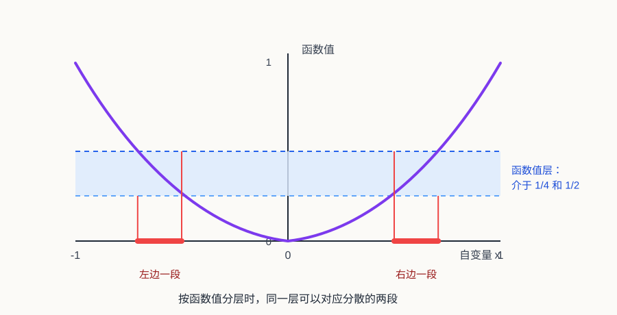

# 普通工科生也能看懂的实变函数和测度论

## 一、前言

这篇文章主要面向普通工科背景的读者，目标不是推导实变函数里的全部定理，而是先解释几个核心概念从哪里来、为什么要提出它们，以及怎样用测度的概念重新理解概率论里学过的数学期望、密度函数、分布函数和随机变量。

这是本文最核心的目的：很多工科概率论课程会直接给出密度函数、分布函数、期望公式和各种积分计算，但为了降低门槛，往往会把背后的测度结构模糊化处理。这样做足够应付计算，却不太容易真正理解“期望到底是在对什么积分”“密度到底是谁相对于谁的密度”“为什么有些分布没有密度但仍然可以谈期望”这些问题。实变函数与测度论就是把这些概念重新说清楚的语言。

本文默认读者已经学过高等数学或数学分析里的基本概念，包括极限、连续、导数、Riemann 积分、函数列的简单极限直觉，以及常见的一元微积分计算。比如，Cauchy 的 `epsilon-delta` 极限定义、连续函数的基本性质、Riemann 积分的几何直觉，都会被当作已有背景，而不会在这里重新严格展开。

但这并不意味着读者需要已经熟练掌握严格证明。本文更关心的是：当微积分里那些“足够好”的函数不再够用，或者当概率论里的“分布、密度、期望”需要更清楚的底层定义时，数学家为什么要引入可测集、测度、可测函数和 Lebesgue 积分这些新概念。

实变函数这门课最容易让人困惑的地方在于：它一上来就讲集合、点集、测度、可测函数，像是突然离开了微积分。但如果沿着一条主线看，它其实很朴素：我们希望把微积分里的积分推广到更一般的函数上，于是引入 Lebesgue 积分；为了定义 Lebesgue 积分，又必须先定义集合的“长度”，也就是测度；为了知道哪些函数可以用这种方式积分，又需要可测集和可测函数。

所以这篇文章暂时按下面这条线展开：

1. Riemann 积分有什么不足。
2. Lebesgue 积分换了什么思路。
3. Lebesgue 测度如何给集合定义“长度”。
4. 概率测度如何把“长度”换成“概率”。
5. 数学期望为什么本质上是 Lebesgue 积分。
6. 密度函数到底是相对于某个测度的 Radon-Nikodym 导数。
7. 集合的势为什么会出现在这里。
8. 外测度和可测集在整套理论中扮演什么角色。
9. 这些概念怎样连接到机器学习中的经验风险与泛化误差。

## 二、Riemann 积分的不足

如果只看大学高数里的例子，Riemann 积分几乎没有什么问题。我们算多项式、三角函数、指数函数、分段连续函数的积分，它都工作得很好。于是很多人第一次学实变函数时会有一个疑问：既然微积分已经能算面积、算体积、算期望，为什么还要重新发明一套 Lebesgue 积分？

答案要从 19 世纪分析学的发展说起。

### 分析学为什么开始关心病态函数

早期微积分主要服务于几何和物理问题。那时人们研究的函数大多很规整：曲线是光滑的，面积是可以想象的，导数和积分也常常来自速度、力、运动轨迹这些直观对象。

但到了 19 世纪，数学家开始追问更基础的问题：什么是函数？什么是连续？什么是极限？什么样的函数一定可积？什么样的函数可以逐项求极限、逐项积分、逐项求导？

一旦这些问题被严格化，许多反直觉的例子就出现了。比如：

#### 到处不连续：Dirichlet 函数

第一类是到处不连续的函数。典型例子是 Dirichlet 函数：

$$
D(x)=
\begin{cases}
0, & x \in \mathbb{Q},\\
1, & x \notin \mathbb{Q}.
\end{cases}
$$

由于任意小区间里都有有理数和无理数，它在每一点附近都无法稳定下来。这种函数在直觉上像是“整个区间里同时铺满了 0 和 1 两层点”。严格说，真实的 Dirichlet 函数图像无法靠有限采样画出来；上图只是用两层密集点阵表示这种稠密性。

#### 处处连续但处处不可导：Weierstrass 函数

第二类是处处连续但处处不可导的函数。典型例子是 Weierstrass 函数：

$$
W(x)=\sum_{n=0}^{\infty} a^n \cos(b^n \pi x).
$$

其中 `0 < a < 1`，`b` 是正奇数，并且参数满足某些条件时，`W(x)` 会处处连续但处处不可导。比如可以记住一个具体例子：`a = 1/2`，`b = 13`。

它的图像连续不断，但每个局部都充满细小振荡，没有任何一点存在普通意义下的切线。可以把它想象成一条极其粗糙的山脊线：远看是一条连着的曲线，放大以后发现全是小锯齿；再放大，小锯齿上还有更小的锯齿。普通光滑曲线在足够小的范围里会越来越像一条直线，而 Weierstrass 函数不管放大多少次，都不会变得平整。这个例子击碎了一个很自然但错误的直觉：连续曲线不一定“摸起来是光滑的”。

#### 任意小区间里剧烈震荡：sin(1/x)

第三类是在任意小区间里都剧烈震荡的函数。典型例子是：

$$
f(x)=
\begin{cases}
\sin(1/x), & x \ne 0,\\
0, & x = 0.
\end{cases}
$$

当 `x` 越靠近 0，`1/x` 越大，函数就在 `-1` 和 `1` 之间越来越快地振荡。注意这里的问题主要集中在 0 附近：离 0 远一点，它还是一个很正常的连续函数。

这些例子常被称为“病态函数”。这个词并不是说它们不合法，而是说它们挑战了早期微积分建立在几何直觉上的想象。数学家慢慢意识到：如果只靠“画得出来的曲线”和“直观面积”，分析学的基础是不够稳的。

不过这里要分清楚：并不是每一个病态函数都会卡住 Riemann 积分。Weierstrass 函数虽然处处不可导，但它仍然处处连续，所以在闭区间上仍然可以 Riemann 积分。它卡住的是“连续曲线应该局部像直线、应该有切线”这种微积分直觉。`sin(1/x)` 在 0 附近振荡越来越快，但如果人为规定 $f(0)=0$，它只是在 0 这一点不连续，在闭区间上仍然是 Riemann 可积的。它卡住的是“靠近某一点时函数值应该逐渐稳定下来”这种极限直觉。

真正直接卡住 Riemann 积分的是 Dirichlet 函数这一类例子。它的问题不是某一个点附近不好，而是每一个小区间里都有有理数和无理数，函数值总是在 0 和 1 之间跳来跳去。这样 Riemann 积分按小区间估计面积时，上方估计和下方估计永远合不到一起。

实变函数论就是在这种背景下发展起来的。它可以看成是数学分析的进一步严格化和扩展：数学分析已经开始用极限语言重新整理连续、导数、积分这些概念，而实变函数则继续追问，当函数不再那么光滑、间断点不再只是有限多个、极限过程不再那么规整时，这些概念还能不能成立。它关心的问题依然是微积分里的老问题：连续、极限、可导、可积、收敛。但研究对象从“足够好的函数”扩展到实数轴或欧氏空间上的一般实值函数，要求也变得更严格。

### Riemann 积分在做什么

在这个背景下，我们再回忆 Riemann 积分在做什么。

假设要计算一个函数在 `[a, b]` 上的积分。Riemann 积分的做法是把定义域 `[a, b]` 切成很多小区间，在每个小区间上选一个点，用这个点的函数值当作高度，然后把所有小矩形面积加起来。

粗略说，Riemann 积分是先切分自变量所在的区间，再用每个小区间上的函数高度近似这一小块的面积，最后把这些小面积加起来。

当函数连续或分段连续时，这个方法非常可靠。因为区间切得足够细以后，每个小区间里的函数值变化不会太离谱，小矩形就能很好地逼近曲线下面积。

但这个方法有一个隐藏前提：函数在很小的区间里应该比较稳定。至少，随着区间越切越细，上方估计和下方估计应该能靠近同一个数。

Dirichlet 函数这样的病态函数，正是从这里把 Riemann 积分卡住了。

### Dirichlet 函数为什么卡住 Riemann 积分

最经典的例子是 Dirichlet 函数：

$$
f(x)=
\begin{cases}
0, & x\in\mathbb{Q},\\
1, & x\notin\mathbb{Q}.
\end{cases}
$$

这个函数的麻烦在于，有理数和无理数都在实数轴上稠密。也就是说，在任意小的区间里，都一定既有有理数，也有无理数。

于是无论我们怎样切分 `[0, 1]`，每个小区间里函数值都既能取到 0，也能取到 1。用 Riemann 积分的语言说：

- 每个小区间上的下确界是 0。
- 每个小区间上的上确界是 1。
- 所以下和始终是 0。
- 上和始终是 1。

区间切得再细也没用。上和和下和无法逼近同一个数，因此 Dirichlet 函数在 `[0, 1]` 上 Riemann 不可积。

这个例子很重要，因为它说明 Riemann 积分不是“所有面积问题”的最终答案。它对连续函数很好，对分段连续函数也很好，但面对更一般的函数时，它会失效。

### Lebesgue 的关键转向

Lebesgue 的关键想法，不是继续把 x 轴切得更细，而是换一个问题问法。Riemann 积分问的是：在每个很小的自变量区间里，函数大概有多高？Lebesgue 积分问的是：函数取某一类值的那些点，整体上有多大？

这一步看似只是换了切分方向，其实非常深。Riemann 积分按定义域切分，Lebesgue 积分按函数值分层。换句话说，Lebesgue 不再执着于每个小区间内函数是否震荡，而是把取相同或相近函数值的点收集起来，再衡量这些点集的大小。

对于 Dirichlet 函数，这个思路一下子就变清楚了：

- 函数取 0 的地方是 `[0, 1]` 中的有理数。
- 函数取 1 的地方是 `[0, 1]` 中的无理数。
- 有理数虽然到处都是，但总长度为 0。
- 无理数占据了 `[0, 1]` 的全部长度意义，总长度为 1。

这里先不证明“有理数长度为 0”这件事，只给一个直觉：有理数虽然在任何区间里都能找到，但它们可以被排成一个序列，一个一个数出来；而每一个点本身没有长度。Lebesgue 测度会把所有可数个点的总长度仍然定义为 0。后面讲集合的势和零测集时，我们会专门解释为什么这件事成立。

无理数的长度为 1，则来自于整个区间 `[0,1]` 的长度是 1，而有理数只占掉了长度 0。剩下的长度意义上几乎全都是无理数。

所以从 Lebesgue 积分看，这个函数几乎处处等于 1，它在 `[0, 1]` 上的积分就应该是 1。

这就是 Lebesgue 积分的历史意义：它把“函数下面积”这个问题，转化成了“函数值分层 + 点集测度”的问题。

### 为什么这会发展出测度论

但新的问题马上出现了：如果要按函数值分层，我们就必须能回答“某一层对应的点集有多大”。

比如 Dirichlet 函数里，我们必须能说清楚：

区间 $[0,1]$ 中有理数的长度是多少？区间 $[0,1]$ 中无理数的长度又是多少？

可以打个比方：假设桌上散着很多硬币，我们想知道总金额。一种做法是沿着桌面从左到右扫过去，看到一枚就记下它的面值，最后全部加起来。这有点像 Riemann 积分：先按“位置”处理。

另一种做法是先按面值分堆：1 元硬币一堆，5 角硬币一堆，1 角硬币一堆。然后用“面值”乘以“这一堆有多少枚”，最后把各堆金额加起来。这更像 Lebesgue 积分：先按“函数值”分层，再看每一层对应的对象有多少。

对有限个硬币来说，“有多少枚”直接数就行。但如果对象不是有限个硬币，而是实数轴上的点，问题就变成了：函数值等于 0 的那些点“有多大”？函数值等于 1 的那些点又“有多大”？这时普通数数不够用了，我们需要一种能衡量点集大小的工具。

这把工具就是测度。它不只要能量区间长度，还要能量更复杂的集合：有理数集、无理数集、函数值落在某个范围里的点集。于是，研究积分的问题自然变成了研究集合大小的问题，测度论也就被推到了前台。

从历史上看，Lebesgue 在 1901 年发表了推广定积分的思想，1902 年在博士论文《Intégrale, longueur, aire》中系统发展了长度、面积和积分的理论。这个标题本身就很能说明问题：Lebesgue 积分不是凭空造出来的符号游戏，而是从“长度”和“面积”这些几何问题中长出来的。

在 Lebesgue 之前，Jordan、Borel 等人已经在研究集合的长度和测度问题。Lebesgue 的贡献在于，他把集合测度和积分理论真正结合起来，让“哪些集合有大小”“哪些函数可以积分”“极限和积分什么时候能交换”这些问题进入同一个框架。

这也是为什么实变函数和测度论常常被放在一起学。实变函数关心一般实值函数的性质；测度论提供描述集合大小、函数可测性和积分的语言。后面我们会看到，这套语言不仅能修补 Riemann 积分的不足，也能把概率论里的期望、密度和分布重新说清楚。

## 三、Lebesgue 积分

Riemann 积分是沿着自变量方向切分定义域，然后用每一小段上的函数高度来近似面积。Lebesgue 积分则换了一个角度：先按照函数值的大小分层，再看每一层对应的点集有多大，最后把“函数值”和“点集大小”合在一起计算总面积。

先不要急着背定义。Lebesgue 积分最适合用一张图来理解：Riemann 是“按横轴位置切”，Lebesgue 是“按函数值高度切”。

### 从 Dirichlet 函数看两种积分的差别

先看 Riemann 积分为什么会被 Dirichlet 函数卡住。

Riemann 的想法是把 `[0,1]` 切成很多小区间。可是在 Dirichlet 函数里，每一个小区间里都同时有有理数和无理数，所以函数值同时能取到 0 和 1。于是每一小段的下方估计都是 0，上方估计都是 1。区间切得再细也没用，上下估计始终合不到一起。

Lebesgue 的想法是：既然按横轴切总是混在一起，那就换成按函数值切。

Dirichlet 函数只取两个值：

- 取值为 0 的点：`[0,1]` 里的有理数。
- 取值为 1 的点：`[0,1]` 里的无理数。

如果我们知道有理数这层的“长度”是 0，无理数这层的“长度”是 1，那么面积就很直接：

$$
0\times 0+1\times 1=1.
$$

这就是 Lebesgue 积分的核心直觉：不再问“每个小区间上的函数高度是多少”，而是问“函数取某个高度的那些点，总共占多大”。

这句话里面藏着三个新对象：

- 点集大小：由测度来描述。
- 函数值分层：要求我们能讨论“函数值落在某个范围里的点集”。
- 总量相加：要求我们把每一层的函数值和这一层的测度乘起来，再对所有层求和或取极限。

所以 Lebesgue 积分不是单纯把 Riemann 积分的记号换成更高级的记号。它真正改变的是“组织信息”的方式。Riemann 积分问的是：在每一小段输入区间上，函数高度大概是多少？Lebesgue 积分问的是：函数取某一类值的那些输入点，总共占多大分量？

仍然看 Dirichlet 函数。它在有理数上取 0，在无理数上取 1。于是我们只需要知道两类点集的“长度”：

- `[0, 1]` 中有理数的长度。
- `[0, 1]` 中无理数的长度。

如果有理数的长度为 0，无理数的长度为 1，那么这个函数在 `[0, 1]` 上的 Lebesgue 积分就是：

$$
0\cdot m([0,1]\cap\mathbb{Q})
+1\cdot m([0,1]\setminus\mathbb{Q})
=1.
$$

这个公式可以逐项读：

- $m$ 表示 Lebesgue 测度，可以先直观理解成集合的“长度”。
- $[0,1]\cap\mathbb{Q}$ 表示 $[0,1]$ 里面的有理数，也就是函数值等于 0 的那一层。
- $[0,1]\setminus\mathbb{Q}$ 表示 $[0,1]$ 里面的无理数，也就是函数值等于 1 的那一层。
- $0\cdot m([0,1]\cap\mathbb{Q})$ 的意思是：函数在有理数这一层取值为 0，这一层的长度为 0，所以这一层对积分的贡献是 0。
- $1\cdot m([0,1]\setminus\mathbb{Q})$ 的意思是：函数在无理数这一层取值为 1，这一层的长度为 1，所以这一层对积分的贡献是 1。

把两层贡献加起来，就得到积分值 1。

这就是 Lebesgue 积分最重要的观念变化：它不是先把定义域切成小区间，而是先看函数值的层，再看每一层对应的点集有多大。

从这个角度看，Dirichlet 函数虽然在每一个小区间里都疯狂跳动，但它的“取值层”非常简单：只有 0 和 1 两层。0 那一层是有理数，长度为 0；1 那一层是无理数，长度为 1。Riemann 积分被局部振荡卡住，Lebesgue 积分则绕开了“每个小区间里稳不稳定”这个问题，直接问每一层有多大。

这就是为什么 Lebesgue 积分对极不连续的函数更宽容。它并不是不关心函数值，而是不要求函数在每个小区间里都表现得像一条平滑曲线。它更关心整体：函数值为 0 的地方有多大，函数值为 1 的地方有多大，函数值落在其他范围的地方又有多大。

更一般地说：

- 集合的“长度”“面积”“体积”在 Lebesgue 理论里由测度描述。
- 能被 Lebesgue 测度合理定义大小的集合，叫 Lebesgue 可测集。
- 和这些可测集合结构兼容的函数，叫 Lebesgue 可测函数。
- 对可测函数可以定义 Lebesgue 积分；但要得到有限积分，还需要额外的可积性条件。

### 什么是简单函数

为了让 Lebesgue 积分的定义不显得凭空落下，先看最容易积分的一类函数：简单函数。它是 Lebesgue 积分的起点。

简单函数就是只取有限多个值的函数。比如一个函数只可能取 $a_1,a_2,\ldots,a_k$ 这些值，并且取值为 $a_i$ 的那部分集合记作 $A_i$，那么它可以写成：

$$
s(x)=\sum_{i=1}^{k} a_i\,\mathbf{1}_{A_i}(x).
$$

这里的 $\mathbf{1}_{A_i}(x)$ 读作“集合 $A_i$ 的指示函数”。它不是普通的数字 1，而是一个只会输出 0 或 1 的开关函数：

$$
\mathbf{1}_{A_i}(x)=
\begin{cases}
1, & x\in A_i,\\
0, & x\notin A_i.
\end{cases}
$$

也就是说，$x$ 落在 $A_i$ 里时，这个开关打开，值为 1；$x$ 不在 $A_i$ 里时，这个开关关闭，值为 0。因此上面的求和公式只是把“函数在 $A_i$ 上取值为 $a_i$”这件事压缩写出来。

对这样的函数，Lebesgue 积分的定义非常自然：

$$
\int s\,dm
=\sum_{i=1}^{k}a_i m(A_i).
$$

这里的 $m(A_i)$ 表示集合 $A_i$ 的测度，也就是这一层点集的“大小”。如果暂时只在实数轴上理解，可以先把它想成“这一层在数轴上占了多长”。所以 $a_i m(A_i)$ 的意思就是：函数在 $A_i$ 这一层的高度是 $a_i$，这一层的大小是 $m(A_i)$，两者相乘就是这一层对积分的贡献。

这就是“函数值乘以对应点集大小，再相加”。Dirichlet 函数其实就是一个简单函数，因为它只取 0 和 1 两个值：

$$
D(x)=0\cdot \mathbf{1}_{[0,1]\cap\mathbb{Q}}(x)
+1\cdot \mathbf{1}_{[0,1]\setminus\mathbb{Q}}(x).
$$

所以它的 Lebesgue 积分就是：

$$
\int_0^1D(x)\,dm
=0\cdot m([0,1]\cap\mathbb{Q})
+1\cdot m([0,1]\setminus\mathbb{Q})
=1.
$$

这和前面那条公式表达的是同一件事：Dirichlet 函数只有两层，一层取值为 0，一层取值为 1；积分就是把每一层的“函数值”和“这一层的大小”相乘以后加起来。

简单函数在 Lebesgue 积分里扮演的角色，很像阶梯函数在 Riemann 积分里的角色。只不过 Riemann 积分里的阶梯函数通常按区间分段，而 Lebesgue 积分里的简单函数可以按更一般的可测集合分层。这一点很关键：分层不一定是连续的一段一段区间，也可以是有理数集、无理数集，或者更复杂的集合。

### 从简单函数逼近一般函数

简单函数只取有限多个值，所以它的积分很好算：每一层的函数值乘以这一层的测度，然后相加。问题是，真实遇到的函数往往不是这样。比如 $f(x)=x^2$ 在 $[-1,1]$ 上会取连续无穷多个值，不可能直接说它只有有限几层。

Lebesgue 积分的做法是：先用简单函数近似一般函数。可以把它想象成一张温度热力图：地板上每一个位置都有一个温度，温度可能连续变化。为了先粗略计算，我们不记录每个点的精确温度，而是把温度分成几个档位：20 到 21 度算一档，21 到 22 度算一档，22 到 23 度算一档。然后看每一档温度覆盖了多大面积。

这样的近似当然比较粗糙，但如果把温度档位切得越来越细，比如每 1 度一档、每 0.1 度一档、每 0.01 度一档，近似就会越来越接近真实温度分布。简单函数逼近一般函数，也是这个意思：先把连续变化的函数值压成有限多个档位，再让档位越来越细。

关键是，Lebesgue 积分按“函数值”分层，而不是按 $x$ 的位置分段。还是看 $f(x)=x^2$ 在 $[-1,1]$ 上的例子。它是一条 U 形曲线：左右两端函数值都是 1，中间 $x=0$ 处函数值是 0。如果我们看“函数值落在 $[\frac14,\frac12)$ 这一层”的点，那么这些点不是一个连续区间，而是左右两段：

$$
\left(-\sqrt{\frac12},-\frac12\right]
\cup
\left[\frac12,\sqrt{\frac12}\right).
$$

这正好体现了 Lebesgue 分层的特点：同一层函数值对应的点，可能分散在定义域的不同位置。Riemann 积分习惯按区间分段；Lebesgue 积分不要求每一层必须是一整段区间。只要这一层点集可以被测量，就可以把它拿来计算。

为了让定义更稳，通常先从非负函数开始。假设 $f\ge 0$，我们用一列简单函数从下方逼近它。

为什么要“从下方”逼近？因为这样每一步都是保守估计：近似函数的值永远不超过真实函数值，所以它算出来的积分也不会超过我们想要的真实积分。随着档位越来越细，这些保守估计会一步步往上贴近原函数。这样定义积分时，就像从下面一层层垫高，最后取能逼近到的最高值，比较稳定。

从思想上看，Lebesgue 的做法很像是在问：哪些东西我已经会积分？简单函数会积分，因为它只有有限层；那一般非负函数怎么办？就用所有“不超过它的简单函数”去试探它。每一个简单函数都给出一个确定的下方估计，所有下方估计越做越精细，最后能顶到哪里，就把那里定义成原函数的积分。

这种想法的好处是，它不是一上来就硬算复杂函数，而是从最可靠的对象出发，一步步扩张积分的适用范围。先定义集合的大小，再定义简单函数的积分，再用简单函数逼近一般函数。整套理论是顺着“先会量集合，再会算有限层函数，最后逼近一般函数”长出来的。

所谓“从下方逼近”，可以理解成：每次都把 $f(x)$ 向下舍入成一个有限档位的值。

例如第 $n$ 次近似时，把函数值轴按长度 $2^{-n}$ 切成很多小格。某一点 $x$ 上的真实函数值是 $f(x)$，我们不取它的精确值，而是取不超过 $f(x)$ 的最近一个格点。比如如果格长是 $0.25$，而某点的函数值是 $0.68$，那就先用 $0.5$ 近似；如果格长变成 $0.125$，就可以用 $0.625$ 近似。格子越细，向下舍入后的值就越接近真实值。

用分段函数写出来会更直观。对 $f(x)=x^2$ 在 $[-1,1]$ 上这个例子来说，函数值本来就落在 $0$ 到 $1$ 之间，所以我们只需要把 $[0,1]$ 这一段高度分档。

下面先做一个很粗的近似，每 $\frac14$ 一档。这里选 $\frac14$ 没有什么神秘原因，只是因为四等分写起来简单、看起来清楚。你也可以选每 $\frac{1}{10}$ 一档、每 $\frac{1}{100}$ 一档；档位越细，近似越精确。

$$
s_2(x)=
\begin{cases}
0, & 0\le f(x)<\frac14,\\
\frac14, & \frac14\le f(x)<\frac12,\\
\frac12, & \frac12\le f(x)<\frac34,\\
\frac34, & \frac34\le f(x)<1.
\end{cases}
$$

这就是一个简单函数：它只会输出 $0,\frac14,\frac12,\frac34$ 这几个值。比如某一点上 $f(x)=0.68$，它落在 $[\frac12,\frac34)$ 这一档，所以 $s_2(x)=\frac12$。

再细一点，每 $\frac18$ 一档：

$$
s_3(x)=
\begin{cases}
0, & 0\le f(x)<\frac18,\\
\frac18, & \frac18\le f(x)<\frac28,\\
\frac28, & \frac28\le f(x)<\frac38,\\
\cdots\\
\frac78, & \frac78\le f(x)<1.
\end{cases}
$$

同样是 $f(x)=0.68$，这次它落在 $[\frac58,\frac68)$ 这一档，所以 $s_3(x)=\frac58=0.625$。比刚才的 $\frac12$ 更接近 $0.68$。

这就是一列简单函数的意思：$s_2,s_3,s_4,\ldots$ 都是“有限档位版”的 $f$，而且档位越来越细。说白了，它们无非就是一批变得越来越密集的分段函数。一般地，$s_n$ 每 $2^{-n}$ 一档，把 $f(x)$ 向下舍入到不超过它的最近档位。

这里说“有限档位”，指的是 $s_n$ 只会输出有限种函数值，不是说每一档里面只有有限个点。每一档里面可以有无限多个点，甚至可以是一个区间、两个区间，或者像有理数集那样到处稠密。简单函数的“简单”，简单在输出值只有有限种。

注意，这里说“有限多个档位”，是对固定的某一个 $n$ 来说的。比如 $n=3$ 时，每 $\frac18$ 一档；如果 $0\le f\le 10$，那从 0 到 10 一共只有 80 个档位，所以 $s_3$ 只会输出有限多个值，是一个简单函数。

当 $n$ 越来越大时，档位数当然会越来越多。我们得到的不是一个固定的简单函数，而是一列简单函数 $s_2,s_3,s_4,\ldots$。每一个 $s_n$ 自己都是有限档位的，但这一列函数越来越精细，逐步逼近原来的 $f$。

一般非负函数可能没有上界，可以先把很高的部分截断，再用同样方法逼近；这里先抓住“按高度分格、每格取左端点”的直觉就够了。

$$
0\le s_2(x)\le s_3(x)\le s_4(x)\le \cdots \le f(x),
$$

这里的 $\le$ 是逐点比较的意思：对每一个固定的 $x$，都有 $s_2(x)\le s_3(x)\le s_4(x)\le\cdots\le f(x)$。也就是说，同一个点上，后面的近似值不会比前面的更低，并且始终不超过真实值 $f(x)$。

并且 $s_n(x)$ 会越来越接近 $f(x)$。直观上，$s_2$ 是很粗的低配版，$s_3$ 更细，$s_4$ 更细；每一步都不超过原函数，但越来越贴近原函数。因为每个 $s_n$ 都是简单函数，它的积分已经会算，所以我们就用这些积分去逼近 $f$ 的积分。

这个想法可以写成：

$$
\int f\,dm
=\sup\left\{\int s\,dm: 0\le s\le f,\ s\text{ 是简单函数}\right\}.
$$

这条公式的意思是：所有不超过 $f$ 的非负简单函数，都可以看成对 $f$ 的下方近似。每个近似都有一个积分，也就是一个下方估计。把所有这些下方估计能够逼近到的最大值，定义成 $f$ 的积分。

所以这里的核心不是公式，而是一句话：先会算有限层函数，再用越来越精细的有限层函数逼近一般函数。

上面讨论的是非负函数。但一般实值函数可能有正有负，比如 $f(x)=x$ 在 $[-1,1]$ 上左边为负、右边为正。这时可以把函数拆成两部分：正的部分单独算，负的部分也单独算，最后再相减。

具体地说，定义正部和负部：

$$
f^+(x)=\max(f(x),0),
$$

$$
f^-(x)=\max(-f(x),0).
$$

于是：

$$
f=f^+-f^-,
$$

并且：

$$
|f|=f^++f^-.
$$

如果 $f^+$ 和 $f^-$ 的积分都不是无穷大，就定义：

$$
\int f\,dm
=\int f^+\,dm-\int f^-\,dm.
$$

通常我们说 $f$ 是 Lebesgue 可积的，指的是：

$$
\int |f|\,dm<\infty.
$$

这条条件非常重要。它不是在说函数每一点都必须连续、光滑、好看，而是在说函数的绝对值从整体上累加起来不能爆掉。也就是说，Lebesgue 可积关心的不是局部有没有小毛刺，而是整体总量是否有限。

可以把它想成算总负荷。某个位置的数值突然很奇怪，并不一定重要；真正重要的是这些奇怪位置占不占“面积”，以及它们累加起来会不会形成不可控制的总量。如果异常只发生在一个零测集上，也就是在测度意义下“没有大小”的地方，那么它不会改变积分。

这就是“几乎处处”这个概念反复出现的原因。两个函数如果只在零测集上不同，在 Lebesgue 积分眼里它们就是同一个函数。比如在概率论里，如果一个随机变量只在概率为 0 的事件上被改动，那么它的数学期望不会变。测度论把这件事说得更一般：积分不关心零测集上的差异，积分关心的是函数在有测度的地方整体累积起来有多大。

所以，Lebesgue 可积的思想可以概括成一句话：允许局部异常，但不允许整体爆炸。这一点和工科概率论里的期望非常接近。一个随机变量可以在某些极少发生的地方取很大的值，但只要这些大值按照概率加权后的总量仍然有限，期望就是有意义的；反过来，如果尾部太重，即使每个点上的值都是合法的，期望也可能发散。

### 一个连续函数的例子

最后用一个最熟悉的连续函数收一下：在 $[0,1]$ 上计算

$$
f(x)=x.
$$

用 Riemann 积分算，大家都知道答案是三角形面积：

$$
\int_0^1 x\,dx=\frac12.
$$

Lebesgue 积分也应该得到同样的结果。它的看法是：不要先按 $x$ 的位置切，而是按函数值的高度切。因为 $f(x)=x$ 在 $[0,1]$ 上刚好从 0 增加到 1，所以“函数值落在 $[\frac{k}{n},\frac{k+1}{n})$”的那一层，对应的也是 $x$ 落在同样的区间里。

用一个简单函数从下方近似它：

$$
s_n(x)=\frac{k}{n},
\quad
\frac{k}{n}\le x<\frac{k+1}{n},
\quad k=0,1,\ldots,n-1.
$$

这个 $s_n$ 就是把 $[0,1]$ 切成 $n$ 层，每一层都取左端点高度。它的 Lebesgue 积分是“每层高度乘以每层长度，再相加”：

$$
\int_0^1 s_n\,dm
=\sum_{k=0}^{n-1}\frac{k}{n}\cdot\frac1n
=\frac{1}{n^2}\sum_{k=0}^{n-1}k
=\frac{n-1}{2n}.
$$

当 $n\to\infty$ 时，

$$
\frac{n-1}{2n}\to\frac12.
$$

所以 Lebesgue 积分也得到

$$
\int_0^1 x\,dm=\frac12.
$$

这个例子说明：对普通连续函数，Lebesgue 积分不会改变我们熟悉的答案；它只是换了一套更能处理复杂函数和概率分布的语言。

## 四、Lebesgue 测度

现在剩下的问题是：集合的“长度”到底怎么定义？

### 4.1 实数区间的测度

对最简单的区间 `[a, b]`，我们当然希望它的 Lebesgue 测度是：

$$
m([a,b])=b-a.
$$

这保证了 Lebesgue 积分在处理普通连续函数时，和 Riemann 积分给出一样的结果。Lebesgue 积分不是推翻微积分，而是在保留原有结果的基础上扩大适用范围。

普通连续函数在两种积分下会得到相同的结果；上一节的 $f(x)=x$ 就是最简单的例子。

### 4.2 集合的势

为了理解为什么 `[0, 1]` 中有理数的测度为 0，需要先引入集合的势。

集合的势可以粗略理解为集合元素的“数量”。对有限集合，这就是普通的元素个数；对无限集合，情况会更微妙。无限集合也可以比较大小，只是比较方式不再是数数，而是看两个集合之间能否建立一一对应。

如果集合 `A` 和集合 `B` 之间存在双射，那么它们的势相同，记作：

$$
|A|=|B|.
$$

一个经典例子是自然数集和偶数集。虽然偶数看起来只是自然数的一半，但映射

$$
n\mapsto 2n
$$

给出了自然数和偶数之间的一一对应。因此，自然数集和偶数集的势相同。

能够和自然数集建立一一对应的集合叫可数集。自然数集、整数集、奇数集、偶数集都是可数集。比较反直觉的是，有理数集也是可数集。也就是说，虽然有理数在实数轴上到处稠密，但它们仍然可以被排成一个序列：

$$
q_1,q_2,q_3,\ldots
$$

所有可数无限集合的势通常记为 `aleph_0`。

实数集则不可数，它的势比自然数集更大。区间 `[0, 1]`、无理数集、整个实数集都和实数集等势。

这里要小心一个很重要的区别：势描述的是集合元素的多少，测度描述的是集合在几何或概率意义下的大小。二者有关联，但不是一回事。有理数集是无限集，而且在实数轴上处处稠密，但它的 Lebesgue 测度仍然是 0。

### 4.3 零测集

Lebesgue 测度里，一个集合如果测度为 0，就叫零测集。有限集是零测集，可数集也是零测集。因此：

$$
m([0,1]\cap\mathbb{Q})=0.
$$

又因为 `[0, 1]` 可以分成互不相交的两部分：

$$
[0,1]=([0,1]\cap\mathbb{Q})\cup([0,1]\setminus\mathbb{Q}).
$$

并且 Lebesgue 测度满足可数可加性，所以：

$$
m([0,1])
=m([0,1]\cap\mathbb{Q})
+m([0,1]\setminus\mathbb{Q}).
$$

于是：

$$
1=0+m([0,1]\setminus\mathbb{Q}).
$$

因此：

$$
m([0,1]\setminus\mathbb{Q})=1.
$$

这就解释了为什么 Dirichlet 函数在 `[0, 1]` 上的 Lebesgue 积分等于 1。

零测集在机器学习和概率论里对应一个非常常见的表达：几乎处处成立。所谓“几乎处处”，就是允许结论在一个测度为 0 的集合上失败。对概率测度来说，就是允许结论在概率为 0 的事件上失败。

### 4.4 外测度

Lebesgue 测度不是直接凭空定义出来的。常见构造路径是先定义 Lebesgue 外测度，再从中筛选出合适的可测集，最后得到 Lebesgue 测度。

外测度通常记为 `m*`。它的直观想法是：用可数个开区间覆盖一个集合，然后看这些开区间总长度的下确界。粗略地说，就是用外面的区间去“包住”集合，并寻找最省长度的包法。

外测度具有一些很自然的性质：

- 非负性：集合大小不能为负。
- 单调性：如果 $A\subseteq B$，那么 $m^*(A)\le m^*(B)$。
- 平移不变性：集合整体平移后，大小不变。
- 可数次次可加性：一列集合并起来的外测度，不超过它们外测度之和。

最后一条写成公式是：

$$
m^*\left(\bigcup_{n=1}^{\infty}A_n\right)
\le
\sum_{n=1}^{\infty}m^*(A_n).
$$

但我们真正希望“长度”满足的是可数可加性。也就是说，当这些集合两两不相交时，应有：

$$
m\left(\bigcup_{n=1}^{\infty}A_n\right)
=
\sum_{n=1}^{\infty}m(A_n).
$$

外测度对任意集合只保证小于等于，不保证等号成立。于是我们把那些能让测度行为足够好的集合挑出来，称为 Lebesgue 可测集；外测度限制在这些可测集上，就成为 Lebesgue 测度。

可以把外测度看作通向 Lebesgue 测度的脚手架。它先尝试给所有集合分配大小，然后再把会破坏可加性的集合排除出去。

### 4.5 回到 Dirichlet 函数

现在我们再回到最初的函数：

$$
f(x)=
\begin{cases}
0, & x\in\mathbb{Q},\\
1, & x\notin\mathbb{Q}.
\end{cases}
$$

在 `[0, 1]` 上：

- 有理数集是可数集，所以测度为 0。
- 无理数集的测度为 1。
- 函数在一个测度为 0 的集合上取 0，在其余几乎所有地方取 1。

所以它的 Lebesgue 积分为：

$$
\int_{0}^{1}f(x)\,dx=1.
$$

这说明 Lebesgue 积分确实比 Riemann 积分更能处理“不规整”的函数。

## 五、用测度重新理解概率论

对工科读者来说，实变函数与测度论最有用的地方，可能不是让我们会算更多奇怪函数的积分，而是让我们重新理解概率论里那些熟悉但其实很模糊的概念。

### 从 `dx` 到 `dP`

在一元微积分里，我们最熟悉的积分长这样：

$$
\int_a^b f(x)\,dx.
$$

这里的 `dx` 常常被读成“对 x 积分”。但从测度论角度看，`dx` 更准确地说是 Lebesgue 测度。它告诉我们：每一小段区间按它的长度来计权。

如果把 `dx` 换成 `dP`，意思就变了：

$$
\int f(x)\,dP(x).
$$

这时积分不再按普通长度计权，而是按概率分布 $P$ 计权。哪些区域概率大，哪些区域对积分贡献就大；哪些区域概率为 0，即使在几何上看起来不空，也不会影响这个积分。

在工科概率论里，我们通常会学：

- 随机变量有分布函数。
- 连续型随机变量有密度函数。
- 连续型随机变量的数学期望可以写成 $\int_{\mathbb{R}}x p(x)\,dx$。
- 离散型随机变量的数学期望可以写成 $\sum_i x_i p_i$。

这些公式当然能用，但它们容易给人一种错觉：好像概率论天然分成“离散型”和“连续型”两套公式。测度论的观点会把它们统一起来。

概率空间可以写成：

$$
(\Omega,\mathcal{F},P).
$$

其中 `Omega` 是样本空间，`F` 是事件组成的可测集合族，`P` 是概率测度。所谓概率测度，就是一种特殊的测度：它给整个样本空间分配的大小为 1。

随机变量也可以重新理解为：

$$
X:\Omega\to\mathbb{R}.
$$

并且它必须是可测函数。这个条件的意思是：我们问“X 落在某个区间或某个集合里”的时候，对应的样本点集合必须是一个事件，因而可以被概率 `P` 赋值。

数学期望则不是一个孤立公式，而是 Lebesgue 积分：

$$
\mathbb{E}[X]=\int_{\Omega}X\,dP.
$$

这句话非常重要。它说明期望不是一定要对 `dx` 积分，而是对概率测度 `P` 积分。

如果 `X` 是离散型随机变量，这个积分表现为求和：

$$
\mathbb{E}[X]=\sum_i x_i\,P(X=x_i).
$$

如果 `X` 有密度函数 `p(x)`，这个积分表现为我们熟悉的连续型公式：

$$
\mathbb{E}[X]=\int_{\mathbb{R}}x p(x)\,dx.
$$

所以，离散型期望和连续型期望不是两种互不相干的公式，而是同一个测度积分在不同情形下的表现。

密度函数也可以重新理解。所谓密度，并不是随机变量自带的一根曲线，而是一个测度相对于另一个测度的变化率。连续型概率密度 `p(x)` 更准确地说，是概率测度 `P` 相对于 Lebesgue 测度 `dx` 的 Radon-Nikodym 导数：

$$
dP=p(x)\,dx.
$$

这也解释了为什么有些分布没有普通意义下的密度。比如离散分布不是相对于 Lebesgue 测度的密度函数，但它仍然有概率测度，也仍然能定义期望。更一般地，很多分布可以既不是纯离散，也不是普通连续型；测度论仍然能统一处理它们。

从这个角度看，大学工科概率论里很多概念其实是测度论的影子：

- 事件：可测集合。
- 概率：定义在事件上的测度。
- 随机变量：可测函数。
- 分布：随机变量把概率测度从样本空间推到实数轴上得到的测度。
- 密度函数：一个测度相对于另一个测度的导数。
- 数学期望：随机变量对概率测度的 Lebesgue 积分。

这才是本文真正想建立的视角。我们学习实变函数和测度论，不只是为了知道 Lebesgue 积分比 Riemann 积分更强，而是为了回头看懂概率论：那些被直接拿来计算的期望、密度、分布，背后到底是什么。

### 极限和期望为什么能交换

Lebesgue 积分真正强大的地方，不只是能处理 Dirichlet 函数。更重要的是，它和极限过程配合得更好。

在概率论和机器学习里，我们经常会遇到一列函数或随机变量：

$$
f_1,f_2,f_3,\ldots
$$

自然的问题是：

$$
\lim_{n\to\infty}\int f_n\,dP
\quad\text{和}\quad
\int \lim_{n\to\infty}f_n\,dP
$$

什么时候相等？

这不是一个纯技术问题。它对应很多概率论和机器学习里的核心操作：样本数趋于无穷时，经验平均能不能收敛到总体平均？模型逼近目标函数时，损失的极限能不能和期望交换？训练过程中的一列函数如果收敛，风险是否也收敛？

Lebesgue 积分提供了一批非常重要的收敛定理，比如单调收敛定理、Fatou 引理和控制收敛定理。这里暂时不展开证明，只先记住它们背后的共同主题：如果函数列的收敛方式足够好，或者它们被某个可积函数统一控制，那么“先取极限再积分”和“先积分再取极限”就可以交换。

## 六、机器学习里的期望风险

从这个概率论视角看机器学习，期望风险就变得很自然。设数据点 $(X,Y)$ 来自未知分布 $P$，模型为 $f$，损失函数为 $L(f(X),Y)$。真实风险可以写成：

$$
R(f)=\mathbb{E}_{P}[L(f(X),Y)].
$$

这句话翻译成测度论语言就是：把损失函数对概率测度 $P$ 做积分：

$$
R(f)
=\int L(f(x),y)\,dP(x,y).
$$

训练集给出的经验风险则是：

$$
\hat R_n(f)=\frac{1}{n}\sum_{i=1}^{n}L(f(x_i),y_i).
$$

从测度论角度看，这其实也是积分，只不过积分所用的不是未知真实分布 $P$，而是经验测度 $P_n$。经验测度把质量均匀放在训练样本点上：

$$
P_n=\frac{1}{n}\sum_{i=1}^{n}\delta_{(x_i,y_i)}.
$$

于是经验风险可以写成：

$$
\hat R_n(f)=\int L(f(x),y)\,dP_n(x,y).
$$

这样一来，泛化误差就不是凭空冒出来的神秘量。它可以被看成：同一个损失函数，在真实数据分布 $P$ 下的积分，和在经验分布 $P_n$ 下的积分，二者相差多少。

沿着这条线，实变函数与测度论会提供几个基础词汇：

- 可测函数：保证损失、模型输出、随机变量能被放进概率积分里。
- 几乎处处：允许忽略概率为 0 的异常情况。
- Lebesgue 积分：统一期望、风险、误差和分布上的平均。
- 收敛定理：说明什么时候可以把极限和积分交换。
- Lp 空间：用范数和距离描述函数误差，比如 `L1` 风险、`L2` 误差。
- Radon-Nikodym 导数：理解密度、似然比、重要性采样和分布变换。

到这里可以先抓住一句话：Lebesgue 积分把“面积”推广成了“按测度加权的整体平均”。当测度是长度时，它像传统积分；当测度是概率时，它就是期望；当测度是经验分布时，它就是样本平均。

## 七、后续扩写方向

- 把 Dirichlet 函数一节改成更完整的图文解释。
- 单独写一节“按定义域切分”和“按值域切分”的对比。
- 补充有理数可数性的直观证明。
- 补充零测集、稠密集和“几乎处处”的区别。
- 把外测度到可测集的构造讲得更平滑。
- 加入机器学习里的贯穿例子：0-1 损失、经验风险、期望风险与泛化误差。
- 最后扩展到 `Lp` 空间，为泛函分析、统计学习理论和核方法做铺垫。

## 参考线索

- 知乎专栏文章：[实变函数](https://zhuanlan.zhihu.com/p/683996565)
- 四川大学陈闯老师《实变函数》课程。
- 常见实变函数教材通常按“集合与点集 - 测度 - 可测函数 - Lebesgue 积分 - 微分理论 - Lp 空间”展开；本文先沿着这条主线组织，再逐步改写成面向机器学习理论的导读文章。
