# 常微分方程（ODE）

## 一、前言：常微分方程研究什么

一个物体怎样冷却，一根弹簧怎样振动，一组相互影响的状态怎样随时间变化？这些问题有一个共同点：我们知道当前状态与变化率之间的关系，希望据此确定整个变化过程。常微分方程就是描述这种关系的数学语言。

例如 $y'=-ky$ 表示温差的变化率与当前温差成正比，$x''+\omega^2x=0$ 表示加速度与位移方向相反。方程规定变化规律，初始条件则说明从哪里开始。把两者结合起来，才可能确定一条具体的状态轨迹。

### 未知量：只依赖一个自变量的函数

常微分方程的未知量可以是一个函数 $y(t)$，也可以是一组函数组成的状态向量 $\mathbf y(t)$。例如质点的位置和速度有多个分量，但都只依赖时间，仍然属于常微分方程的研究对象。

这个自变量也不一定是时间。研究一根杆沿长度方向的静态形状时，可以用位置 $x$ 作为自变量。关键是未知函数只依赖一个独立自变量，方程把它与普通导数联系起来。

### 历史脉络：从十七世纪的求解技巧到现代计算与动力系统

常微分方程的发展，是研究问题不断扩展的过程：先问怎样求出函数，随后追问怎样表示更复杂的解、怎样保证解存在、怎样看清轨迹的整体行为，以及怎样让计算机可靠地计算。下面按时间梳理主要变化；不同方向往往长期并行，并没有在某个年代整齐地交接。

**十七世纪后期：微积分建立，运动规律开始写成微分方程。** Newton、Leibniz 以及 Bernoulli 家族等人的工作，把变化率、积分、几何与力学联系起来。研究质点运动和曲线问题时，人们开始从函数与导数之间的关系寻找未知函数。变量分离、求积和早期变量代换，是这一时期的重要工具。

**十八世纪：求解技巧逐步系统化，近似计算也开始发展。** Euler、Bernoulli 家族和 Lagrange 等人发展了线性方程、常数变易和级数等方法。求解的典型思路是利用方程结构，把问题化成积分、代数方程或已经会解的形式。与此同时，Euler 型逐步近似也让人们能够从初值出发计算近似轨迹。因此，数值方法的起点远早于电子计算机。

**十八世纪后期至十九世纪：初等函数不够用，特殊函数成为系统的研究对象。** 随着振动、天文学和数学物理问题的发展，Legendre、Bessel、Airy 等特殊函数逐渐进入常用工具体系。人们可以由微分方程，再配合初值、端点行为或标准化条件选定函数，随后研究它的级数、零点、递推关系和渐近性质。这一步扩展了“什么可以算作解的表达式”：无法用已有初等函数写出，并不妨碍精确定义和研究一个解。函数表又把这些理论结果变成可供查用的数值工具。

**十九世纪：存在性与唯一性成为独立问题。** 与特殊函数的发展并行，Cauchy、Lipschitz、Picard 等人的工作逐步建立了初值问题的严格理论。研究者不再只问“公式是什么”，也问“满足这些条件的解是否存在、是否唯一、初值改变后解会怎样变化”。逐次逼近和积分方程提供了构造解、证明收敛的重要思路，也为后来用函数空间统一理解这些论证奠定了基础。

**十九世纪后期，尤其从 1880 年代起：庞加莱推动几何与定性方法。** 庞加莱在 1881 年发表了关于微分方程所定义曲线的研究，把注意力转向解曲线的几何结构。把位置、速度等分量合成相空间中的状态点，就能在没有显式公式时研究平衡点、周期轨道和轨迹的整体分布。横截面与返回映射又把连续运动转化为反复迭代的问题。这条路线后来成为动力系统理论的重要基础。[庞加莱 1881 年原文](https://www.numdam.org/item/JMPA_1881_3_7__375_0/)

**十九世纪末至二十世纪初：数值积分发展出更高精度的方法。** Runge 在 1895 年、Kutta 在 1901 年的工作，是 Runge–Kutta 方法发展的代表性节点。它们通过一步内多次估计变化率，提高逐步积分的精度。此时尚没有现代电子计算机，但“给定右端函数和初值，按统一规则推进”的算法框架已经形成，后来可以直接转化为程序。[NIST 关于 Runge–Kutta 方法的论文及原始文献](https://nvlpubs.nist.gov/nistpubs/jres/44/jresv44n5p549_A1b.pdf)

**二十世纪前半叶：泛函分析提供研究解的统一语言。** 随着函数空间、线性算子和不动点理论的发展，人们可以把整个未知函数视为空间中的一个元素。初值问题改写成积分方程以后，求解就可以转化为寻找算子的不动点；范数、完备性和收敛等概念则帮助分析逐次逼近是否可靠。例如，Picard 迭代可以在适当条件下用压缩映射原理来理解。泛函分析为一些存在性与逼近问题提供统一框架，ODE 理论也继续使用微分不等式、延拓和几何方法。

**二十世纪中叶至 1970 年代：电子计算机推动自动数值求解与现代控制。** 计算机使大量重复运算、复杂非线性模型和大型方程组的计算更加可行。研究重点逐渐包括自动选择步长、估计误差、处理刚性，以及把算法组织成可复用的求解器；Gear 在 1971 年关于自动积分的工作是这一发展的代表之一。与此同时，工程中的导航、调节与自动化需求推动了状态空间方法和最优控制：ODE 不仅描述系统怎样演化，也描述输入和反馈怎样改变演化。[Gear 1971 年论文记录](https://collaborate.princeton.edu/en/publications/the-automatic-integration-of-ordinary-differential-equations/)

**二十世纪后半叶至今：几何、分析与计算不断结合。** 庞加莱开拓的定性思路继续发展为对稳定性、分岔、周期运动和混沌的研究；计算机让复杂轨迹能够被探索，严格分析则判断观察到的现象在什么条件下成立。特殊函数、数值求解、泛函分析、动力系统和控制理论仍各有作用，并在具体问题中共同使用。

本文的讲解顺序是“求解技巧—特殊函数—数值计算—解的基本理论”，便于从具体方法逐步进入抽象问题；这与各方向相互交织的真实历史并不完全相同。相空间几何、轨迹的长期行为以及反馈和最优控制，将在[动力系统与自动控制原理](../06-dynamical-systems-and-control/)中继续展开。

### 本文的学习路线

本文从未知函数、状态轨迹、初值与边值问题出发，再逐步进入求解与理论：

- **先读懂方程。** 辨认阶数、线性与非线性、齐次与非齐次，理解高阶方程怎样改写成一阶方程组。
- **学习基本解法。** 从变量分离和线性方程入手，理解每种方法利用了什么结构、在什么条件下适用。
- **处理更复杂的情形。** 学习非线性代换与局部线性近似。
- **扩展解的表示。** 用积分、幂级数和特殊函数描述无法用初等函数写出的解。
- **用计算机近似求解。** 学习 Euler、Runge–Kutta 方法，以及初值、步长、误差容限和求解器的基本工作方式。
- **理解理论保证。** 讨论存在性、唯一性、连续依赖和最大存在区间，区分解的表达方式与正则性。

这条路线也为理解连续优化、神经 ODE 和控制中的状态方程提供基础。轨迹的长期行为、稳定性与反馈控制，将在[动力系统与自动控制原理](../06-dynamical-systems-and-control/)中继续展开。

## 二、ODE 的未知量：从函数到轨迹

### 先看一个 ODE 问题由什么组成

ODE 的未知量是只依赖一个自变量的函数，可以是一个数值，也可以是一组状态分量。要把一个具体的 ODE 问题说完整，需要说明：

- **未知函数**：例如温差 $y(t)$，或由位置和速度组成的状态 $(x(t),v(t))$。
- **方程**：函数与普通导数满足什么关系，例如 $y'=-ky$ 或 $x''+\omega^2x=0$。
- **定义区间**：在哪段时间或空间区间内求解。
- **给定条件**：在初始位置或区间端点规定函数值、导数值或它们的组合。

求解就是寻找一个在指定区间内满足方程和给定条件的函数。如果只给方程，也可以研究整个解族；加上条件后，才进一步筛选其中的解。

#### 什么是初始条件和边界条件

**初始条件**是在同一个自变量位置给出状态。例如对二阶方程，在 $t=t_0$ 给定

$$
y(t_0)=y_0,\qquad y'(t_0)=v_0.
$$

如果 $y$ 表示位置、$t$ 表示时间，这就是初始位置和初始速度。初始时刻 $t_0$ 不必等于零。

**边界条件**是在定义区间的端点规定约束。对于 $[0,L]$，边界是 $0$ 和 $L$，例如

$$
y(0)=y_0,\qquad y(L)=y_L.
$$

也可以规定端点的导数值，或把函数值与导数值组合起来。如果自变量表示杆上的位置，边界就是杆的两端；如果表示时间，边界就是这段时间的起点和终点。

单独的 $x'(t)=f(t,x(t))$ 只是 ODE，规定当前状态怎样变化。右边出现 $x(t)$，表示变化率可以依赖当前状态，并不表示这个状态已经知道。加上已知的 $x(t_0)=x_0$，才组成初值问题：

$$
\begin{cases}
x'(t)=f(t,x(t)), & \text{变化规律},\\
x(t_0)=x_0, & \text{初始状态}.
\end{cases}
$$

例如 $x'=x$ 的解族是 $x(t)=Ce^t$；加上 $x(0)=2$，就选出 $x(t)=2e^t$。

#### 边值问题与初值问题有什么不同

对于二阶方程，两端的函数值可能已经提供了足够的信息，不必再单独给一阶导数。

看 $[0,L]$ 上的 $y''=0$，其中 $L>0$。通解为 $y(t)=At+B$。给初值 $y(0)=y_0$、$y'(0)=v_0$，就得到 $B=y_0$、$A=v_0$；如果改成边值 $y(0)=y_0$、$y(L)=y_L$，则有

$$
B=y_0,\qquad AL+B=y_L,
$$

从而

$$
y(t)=y_0+\frac{y_L-y_0}{L}t,\qquad
y'(t)=\frac{y_L-y_0}{L}.
$$

导数虽然没有直接给出，却已经由方程和两端值共同确定。几何上，方程要求解是一条直线，指定直线经过的两个点，就同时确定了斜率。边界条件也可以直接给导数：

| 条件形式 | 例子 | 对 $y''=0$ 的结果 |
| --- | --- | --- |
| 两端给函数值（Dirichlet） | $y(0)=y_0$、$y(L)=y_L$ | 唯一确定连接两端的直线 |
| 两端给导数值（Neumann） | $y'(0)=v_0$、$y'(L)=v_L$ | 若 $v_0=v_L$，斜率确定但截距任意；若不相等，则无解 |
| 一端给函数值、另一端给导数值 | $y(0)=y_0$、$y'(L)=v_L$ | 唯一确定 $y(t)=y_0+v_Lt$ |

#### 初值和边值怎样确定通解中的常数

在已经得到通解的情况下，把初值或边值代入，就会得到关于待定常数的方程。只要约束相容、足以唯一确定所有常数，且解在要求的区间内有定义，就能从这个解族中选出一个具体的解。

对系数连续、最高阶系数处处不为零的 $n$ 阶线性 ODE，通解含有 $n$ 个任意常数，通常需要 $n$ 个独立的标量约束来确定它们。关键在于约束是否独立、是否相容，而不只是条数。非线性方程还可能有通解表达式未包含的特殊解，不能只靠数常数判断整个问题。

**条件多给也可以，但必须自洽。** 例如 $y''=0$ 的通解为 $y=At+B$。条件 $y(0)=0$、$y(1)=1$ 已确定 $y=t$；再给 $y'(0)=y'(1)=1$ 仍然相容，只是没有增加独立约束。如果额外要求 $y'(1)=2$，所有条件就无法同时满足。

边值问题不能直接套用初值问题的存在唯一性结论。例如

$$
y''+y=0,\qquad y(0)=0,\quad y(\pi)=0
$$

有无穷多个解 $y=C\sin t$；把末端条件改成 $y(\pi)=1$，则没有解。相比之下，同一个方程给定 $y(0)$ 和 $y'(0)$，总能确定唯一解。偏微分方程一篇的分离变量中的特征值问题，也会利用边界条件筛选非零解。

### 常微分方程的解是一条轨迹

要理解 ODE 的解，可以先想象我们在连续记录一个对象的状态。每到一个时刻 $t$，就记下它的位置、速度或温度。把这些记录连起来，就得到一个随时间变化的函数 $y(t)$。

把时间画在横轴、状态值画在纵轴，$y(t)$ 就是一条解曲线。这里的“轨迹”可以描述位置，也可以描述温差或浓度；若状态有多个分量，还可以把它画在状态空间里。

自变量也不一定是时间。例如一根杆的静态形状可以用挠度 $y(x)$ 表示，此时 $x$ 是沿杆的位置。它的解是一条以空间坐标为参数的曲线，不必理解成随时间运动的过程。判断 ODE 的依据仍是：未知函数只依赖一个独立自变量。

### 例子：冷却模型与时间曲线

设一个物体内部的温度近似均匀，环境温度固定。用 $y(t)$ 表示物体温度与环境温度的差。在一个简单的冷却模型中，温差越大，下降得越快：

$$
\frac{dy}{dt}=-k y,\qquad k>0.
$$

如果最初温差为 $y(0)=y_0>0$，它的解是

$$
y(t)=y_0e^{-kt}.
$$

在 $t=0$ 时温差是 $y_0$，在 $t=1/k$ 时变为 $y_0/e$，再往后逐渐接近零。

这个例子中的状态是一个数，称为**标量状态**。平衡解 $y(t)\equiv y_*$ 表示状态保持不变，在时间图上是一条水平线。

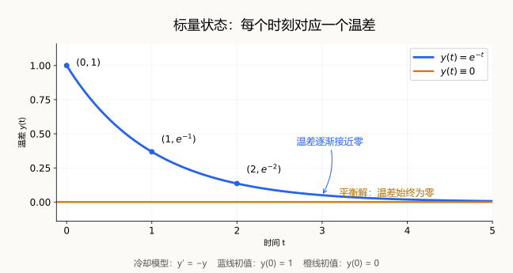

图中取 $k=1$。蓝线的初值是 $y(0)=1$，表示物体比环境热；橙线的初值是 $y(0)=0$，表示物体与环境同温。这个模型的平衡值必须满足 $-ky_*=0$，所以只有零温差对应平衡解，并不是任意水平线都是解。

这里我们把整个物体的温度当成一个数来跟踪。如果还要区分物体内部各个位置的温度，就要改用 $u(x,t)$：同一时刻，不同位置可以有不同温度。偏微分方程一篇中热方程的“场”，正是在这个地方比单个温度轨迹多了空间分布。

### 例子：弹簧振动与相图

考虑一个连在弹簧上的质点，忽略摩擦，用 $x(t)$ 表示它偏离平衡位置的位移。

#### 从回复力得到二阶方程

在弹簧满足 Hooke 定律的范围内，回复力与位移成正比，方向指向平衡位置：

$$
F=-kx,\qquad k>0.
$$

由牛顿第二定律，质量乘加速度等于合力，因此

$$
m\frac{d^2x}{dt^2}=-kx.
$$

令 $\omega=\sqrt{k/m}$，得到

$$
\frac{d^2x}{dt^2}+\omega^2x=0.
$$

如果把质点从位移 $x_0>0$ 处静止释放，初始条件是

$$
x(0)=x_0,\qquad x'(0)=0.
$$

对应的解为

$$
x(t)=x_0\cos(\omega t),\qquad
v(t)=x'(t)=-x_0\omega\sin(\omega t).
$$

这两个公式给出了同一次运动的不同信息：$x(t)$ 记录位置，$v(t)$ 记录速度。只知道位置通常还不足以描述运动状态，因为质点经过同一个位置时，可能正在向左，也可能正在向右。

#### 把二阶方程改写成一阶状态方程

定义速度 $v(t)=x'(t)$，便有第一个一阶方程 $x'=v$。再对速度求导，用原方程替换 $x''$，得到 $v'=x''=-\omega^2x$。于是

$$
\begin{cases}
x'=v, & \text{位置的变化率等于速度},\\
v'=-\omega^2x, & \text{速度的变化率由回复力决定}.
\end{cases}
$$

未知函数从一个 $x(t)$ 变成两个 $x(t),v(t)$，而最高导数从二阶变成一阶。两个分量彼此耦合，合起来可以写成

$$
\frac{d}{dt}\begin{pmatrix}x\\v\end{pmatrix}
=\begin{pmatrix}v\\-\omega^2x\end{pmatrix}.
$$

左边只是分别对位置和速度求导，即 $(x',v')^{\mathsf T}$。给定当前的 $(x,v)$，右边就同时给出这两个分量的变化率，因此我们把 $(x,v)$ 合称为系统的状态。

这个改写没有增加独立的运动信息：$v$ 必须通过第一个方程等于 $x'$。反过来，对 $x'=v$ 求导，再代入第二个方程，就恢复 $x''=-\omega^2x$。原来的两个初值 $x(0)=x_0$、$x'(0)=v_0$，也恰好变成状态向量的初值 $(x(0),v(0))=(x_0,v_0)$；本例静止释放，所以 $v_0=0$。

#### 相图：把位置和速度画在同一张图里

前面提到的 $(x(t),v(t))$ 正是相空间中的状态。以位置 $x$ 为横轴、速度 $v$ 为纵轴，这个二维状态空间叫**相平面**。一个初值产生的状态曲线叫**相轨迹**；把不同初值对应的轨迹及运动方向画在一起，就得到**相图**。

沿用刚才静止释放的弹簧质点解，位置和速度满足

$$
\frac{x^2}{x_0^2}+\frac{v^2}{x_0^2\omega^2}
=\cos^2(\omega t)+\sin^2(\omega t)=1.
$$

所以同一次运动，在时间—位移图上是余弦曲线，在位置—速度图上则是一条椭圆。下面取 $x_0=1$、$\omega=1$，于是 $x(t)=\cos t$、$v(t)=-\sin t$，相轨迹成为单位圆。

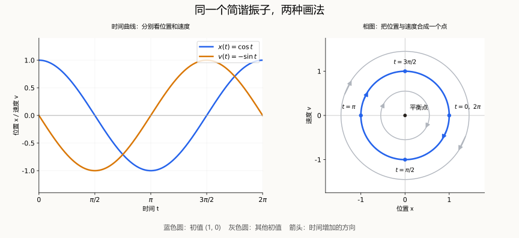

左图的横轴是时间：蓝线记录位置，橙线记录速度。右图的横轴改成位置，纵轴改成速度：每个时刻的两个读数合成一个点 $(x(t),v(t))$，落在蓝色单位圆上。图中的箭头标出时间增加时的运动方向：

$$
(1,0)\ \longrightarrow\ (0,-1)\ \longrightarrow\ (-1,0)
\ \longrightarrow\ (0,1)\ \longrightarrow\ (1,0).
$$

它们依次对应 $t=0,\pi/2,\pi,3\pi/2,2\pi$，方向是顺时针。在 $(1,0)$ 处，质点位于最右端，速度暂时为零，但加速度 $v'=-1$，因此接下来向左运动；到 $(0,-1)$ 时，它经过平衡位置，正以负方向的最大速率运动。

右图还画了另外两组初值对应的灰色圆。一般初值 $(x_0,v_0)$ 决定圆的半径 $\sqrt{x_0^2+v_0^2}$；原点 $(0,0)$ 则是始终静止的平衡状态。不同半径对应不同振幅的振动。

这里的圆是**位置—速度状态空间**中的曲线，物体本身仍沿一条直线来回运动。闭合相轨迹表示整个状态周期性重复；时间虽然不再作为坐标轴，仍通过轨迹上的运动方向和参数化保留在解里。若使用一般的 $\omega$，相轨迹满足 $v^2+\omega^2x^2=\text{常数}$，在位置—速度坐标下通常是椭圆。

偏微分方程一篇讨论弦振动时，会把一个质点扩展为许多相互连接的小质点，再用位移场描述整根弦。这就把这里的状态轨迹连接到连续场。

### 为什么要在微分方程与积分方程之间转换

一阶初值问题还可以写成积分形式：微分形式规定每一刻的变化率，积分形式把变化率累积成状态。先看转换怎样完成，再看它为什么有用。

#### 从微分形式到积分形式，再回到微分形式

这里用的是微积分基本定理：把一段时间内的变化率积分起来，就得到这段时间内的总变化。

先从微分方程出发。把时间变量暂时写成 $s$：

$$
x'(s)=f(s,x(s)).
$$

从初始时刻 $t_0$ 积分到当前时刻 $t$，得到

$$
\int_{t_0}^{t}x'(s)\,ds
=\int_{t_0}^{t}f(s,x(s))\,ds.
$$

左边根据微积分基本定理等于 $x(t)-x(t_0)$，再代入初值 $x(t_0)=x_0$，就有

$$
x(t)=x_0+\int_{t_0}^{t}f(s,x(s))\,ds.
$$

这里 $s$ 是积分过程中遍历的时间，$t$ 是我们要计算状态的那个时刻。公式说的是“当前状态 = 初始状态 + 这段时间内累积的变化”。

“等价”还要求反过来也成立。假设一个连续函数 $x(t)$ 满足上面的积分方程，且 $f$ 连续，那么 $f(s,x(s))$ 也是连续的。对等式两边关于上限 $t$ 求导，由微积分基本定理得到

$$
x'(t)=\frac{d}{dt}\int_{t_0}^{t}f(s,x(s))\,ds
=f(t,x(t)).
$$

再令 $t=t_0$，积分上下限相同，积分为零，于是 $x(t_0)=x_0$。这样就同时恢复了微分方程和初始条件。这也是这里要求连续性的原因：它保证可以直接使用微积分基本定理，逐点恢复导数。

#### 构造解：从一条猜测的曲线逐步修正

**历史背景。** Picard 迭代以 Émile Picard 命名。他在 1888—1890 年间发展逐次逼近方法，用于微分方程的存在性研究；这一工作也吸收了 Neumann、Schwarz 等人此前处理边值问题的思路。名称体现了 Picard 的重要贡献，并不意味着所有逐次逼近思想都由他首次提出。

积分式右边仍含有未知函数，所以它还不是一个直接给出答案的公式。但它提供了一种迭代方法：先猜一条函数，把它代入右边，再把计算结果作为下一条函数。

这与**不动点原理**的联系是：把右边看成一个“输入函数、输出函数”的算子

$$
(Tz)(t)=x_0+\int_{t_0}^{t}f(s,z(s))\,ds.
$$

积分方程就变成 $x=Tx$，所以所求的解是算子 $T$ 的不动点。反复更新 $x^{(n+1)}=Tx^{(n)}$，就是 **Picard 迭代**。若 $f$ 对状态变量满足 Lipschitz 条件，在足够短的时间区间和适当的闭函数集合上，$T$ 会把这个集合映回自身并成为压缩映射；Banach 不动点定理便保证唯一不动点存在，且迭代收敛到它。也就是说，Picard 迭代提供构造解的步骤，不动点定理说明这些步骤为什么能收敛、为什么解唯一。

为避免与初始值 $x_0$ 混淆，用上标括号表示迭代次数。从常值函数 $x^{(0)}(t)=x_0$ 开始，令

$$
x^{(n+1)}(t)=x_0+\int_{t_0}^{t}f(s,x^{(n)}(s))\,ds.
$$

这叫 Picard 迭代。例如对 $x'=x$、$x(0)=1$，依次得到

$$
\begin{aligned}
x^{(0)}(t)&=1,\\
x^{(1)}(t)&=1+t,\\
x^{(2)}(t)&=1+t+\frac{t^2}{2},\\
x^{(3)}(t)&=1+t+\frac{t^2}{2}+\frac{t^3}{6}.
\end{aligned}
$$

继续迭代会得到指数函数的级数，极限就是 $x(t)=e^t$。对一般方程，若 $f$ 连续，并在初值附近对状态变量满足适当的 Lipschitz 条件，就可以在足够短的时间区间上证明迭代收敛，并得到局部唯一解。积分形式因此也是存在唯一性证明的重要工具。

#### 数值计算：近似一小段时间内的累积变化

精确解满足

$$
x(t+h)=x(t)+\int_t^{t+h}f(s,x(s))\,ds.
$$

在一小段时间 $s\in[t,t+h]$ 内，用当前变化率近似：

$$
f(s,x(s))\approx f(t,x(t)).
$$

于是

$$
\int_t^{t+h}f(s,x(s))\,ds
\approx\int_t^{t+h}f(t,x(t))\,ds
=h f(t,x(t)),
$$

从而

$$
x(t+h)\approx x(t)+h f(t,x(t)).
$$

这会得到第八章的 Euler 法。Runge–Kutta 法则在一步内估计多次变化率。它们计算离散时刻的近似值，前面的 Picard 迭代则逐次更新整条函数。

#### 误差估计：把初始差异与累积差异分开

设 $x(t)$、$y(t)$ 满足同一个微分方程，但初值分别为 $x_0$、$y_0$。把它们的积分式相减，得到

$$
x(t)-y(t)=x_0-y_0+
\int_{t_0}^{t}\bigl[f(s,x(s))-f(s,y(s))\bigr]\,ds.
$$

这把当前的差异分成初值差异和沿途累积的差异。在适当的 Lipschitz 条件下，可以进一步用积分不等式控制误差，得到第九章的连续依赖估计。

### ODE 怎样分类

看清解的样子以后，再看方程的结构。一个 $n$ 阶标量 ODE 可以写成

$$
F(t,y,y',\ldots,y^{(n)})=0.
$$

一阶方程若已经把导数单独写成 $y'=f(t,y)$，称为显式形式；写成 $F(t,y,y')=0$ 而没有解出导数，则是隐式形式。隐式方程不一定能在所有点改写成单值的显式方程，使用相应初值理论前需要确认这一点。

#### 按阶数和未知量分类

最高出现几阶导数，方程就是几阶：冷却模型 $y'=-ky$ 是一阶，弹簧振动方程 $x''+\omega^2x=0$ 是二阶。前面把振动方程写成 $(x,v)$ 的一阶方程组，说明“方程组有几个分量”与“方程是几阶”是两个不同的分类维度。

一般 $n$ 阶显式方程也可以把 $y,y',\ldots,y^{(n-1)}$ 作为状态，改写成一阶方程组。

#### 按线性结构分类

$n$ 阶线性 ODE 的一般形式是

$$
a_n(t)y^{(n)}+\cdots+a_1(t)y'+a_0(t)y=g(t),
\qquad a_n(t)\ne0.
$$

这里的非零条件针对正在讨论的区间。线性意味着未知函数及其导数以一次方出现、彼此不相乘，系数只依赖自变量。因此 $y'+t^2y=\sin t$ 仍是线性的；$y'=y^2$、$yy'+y=0$、$y''+\sin y=0$ 都是非线性的。

#### 按是否有外部项分类：齐次与非齐次

在线性方程中，把所有含未知函数及其导数的项放在左边，写成 $Ly=g(t)$。如果右边恒为零，就叫**齐次线性方程**，例如

$$
y''+2y'+y=0.
$$

如果右边不恒为零，就叫**非齐次线性方程**，例如

$$
y''+2y'+y=\sin t.
$$

这里 $\sin t$ 是不依赖未知函数的给定项，在受迫振动等模型中可以表示外部输入。判断时看的是它是否在整个讨论区间上恒为零；某几个时刻恰好取零，不会让方程变成齐次。

齐次线性方程具有叠加原理：若 $y_1,y_2$ 是解，$c_1y_1+c_2y_2$ 也是解。非齐次线性方程的解则具有“齐次通解加一个特解”的结构，第四章和第五章会分别用到这些性质。

#### 按系数是否变化分类：常系数与变系数

在线性方程中，乘在未知函数及其各阶导数前面的量叫系数。如果这些系数都是常数，就叫**常系数线性方程**，例如

$$
y''+2y'+y=0.
$$

这里 $y''$、$y'$、$y$ 的系数分别是 $1,2,1$，都不随 $t$ 变化。如果至少一个系数随自变量变化，就叫**变系数线性方程**，例如

$$
y''+t y'+y=0.
$$

这里 $y'$ 的系数是 $t$。在物理模型中，变系数可以表示阻尼等系统参数随时间或位置改变。

这一分类看的是左边的系数，不是右边的给定项。因此

$$
y''+2y'+y=\sin t
$$

虽然右边随时间变化，仍是常系数方程，同时也是非齐次方程。“齐次或非齐次”与“常系数或变系数”是两个独立的分类维度，可以组合使用。

#### 按是否显含自变量分类：自治与非自治

自治方程写成 $y'=f(y)$，右端不显含 $t$；非自治方程写成 $y'=f(t,y)$，右端显含 $t$。例如

$$
y'=y(1-y)
$$

是非线性自治方程，而 $y'=t y$ 是线性非自治方程。自治不意味着解不随时间变化，而是说“同样的状态在不同时刻服从同样的变化规律”。

对自治方程，满足 $f(y_*)=0$ 的状态给出平衡解 $y(t)\equiv y_*$。上面的例子有 $y=0$ 和 $y=1$ 两个平衡解；它们也提醒我们，求解时除以含 $y$ 的因子可能漏掉解。

#### 同一个方程可以同时贴上哪些标签

| 方程 | 分类 | 第三至五章可尝试的方法 |
| --- | --- | --- |
| $y'=t y$ | 一阶、标量、线性齐次、变系数、非自治 | 变量分离或积分因子 |
| $y'+2y=e^{-t}$ | 一阶、标量、线性非齐次、常系数、非自治 | 积分因子或常数变易 |
| $y''+2y'+5y=0$ | 二阶、标量、线性齐次、常系数；改写成一阶组后自治 | 特征方程 |
| $y'=y(1-y)$ | 一阶、标量、非线性、自治 | 先找平衡解，再变量分离 |

分类帮助我们读出方程可以利用的结构。给定前面介绍的初值或边值以后，还要判断解是否存在、是否唯一，以及数据误差会怎样影响解。

## 三、ODE 求解入门：通用知识与变量分离

求解 ODE，是寻找在指定区间内满足方程和给定条件的函数。本章先整理各种解法共用的步骤，再用变量分离法完成一个冷却模型的求解。下面通常用 $t$ 作自变量，$y'=dy/dt$。

### 求解之前：辨认结构与适用区间

先看最高阶导数、未知函数出现的方式，以及系数是否随自变量变化，再选择可以利用的结构。可分离变量与线性并不互斥：$y'=-ky$ 同时属于两者，而 $y'=y^2$ 可以分离变量，却是非线性方程。

整理方程时要记录每一步的条件。除以某个含未知函数的因子，可能遗漏使这个因子为零的解；除以最高阶导数的系数，要求该系数不为零；取对数或换元，也要检查定义域。先说明在哪个区间工作，再判断所得表达式在那里是否成立。

### 通解、特解与初值：公式怎样成为一个具体的解

积分产生的任意常数用来描述一族解；代入初值或边值，才进一步确定其中的成员。例如 $y'=y$ 给出 $y=Ce^t$，而 $y(0)=2$ 选出 $y=2e^t$。对于系数连续、最高阶系数不为零的 $n$ 阶线性方程，通解含 $n$ 个独立常数；非线性方程则还要留意公式是否遗漏特殊解。

“特解”在非齐次线性方程中通常指任意一个满足非齐次方程的解，它未必已经满足题目给定的初值。第五章会先找这样的一个特解，再加上齐次解来匹配初值。

积分后也不一定能把 $y$ 单独写出来。形如 $F(t,y)=C$ 的隐式关系，只要在所讨论区间能确定满足方程的可微函数，同样可以描述解。保留积分表达式也是一种精确表示，并不一定要化成初等函数。

### 求出公式以后：检查方程、条件和存在区间

求解最后应做三件事：把函数及其导数代回原方程，检查初值或边值，再确认表达式在哪个区间有定义。满足方程并不自动意味着满足条件，一个公式也未必能延续到所有时间。

例如 $y'=y^2$、$y(0)=1$ 给出 $y=1/(1-t)$。代回可以验证方程和初值，但从 $t=0$ 出发的解在 $t=1$ 发散，其最大存在区间是 $(-\infty,1)$。虽然同一表达式在 $t>1$ 也有定义，那一段不能跨过奇点与原初值问题的解接在一起。

### 变量分离法：把两种变量各放一边

**历史背景。** 变量分离法形成于十七世纪末的早期微积分研究，Leibniz 和 Bernoulli 家族是主要推动者。Johann Bernoulli 在 1694 年与 Leibniz 的通信中明确讨论了分离变量的方法，因此这里把它看作早期微积分学家逐步发展的共同工具，而不归给唯一的发明者。

#### 物理模型：没有加热装置时的冷却

设物体内部温度近似均匀，温度为 $T(t)$，环境温度 $T_{\mathrm{env}}$ 恒定。令 $y(t)=T(t)-T_{\mathrm{env}}$ 为温差，$C_{\mathrm{th}}>0$ 为恒定热容。Newton 冷却定律把向环境散热的功率写成 $Ky$，其中 $K>0$ 是恒定的换热系数。没有加热装置时，内能的减少来自散热，因此

$$
\underbrace{C_{\mathrm{th}}y'}_{\text{内能变化率}}=-\underbrace{Ky}_{\text{散热功率}},
\qquad y'=-\frac{K}{C_{\mathrm{th}}}y.
$$

物体比环境热时，$y>0$，所以 $y'<0$；温差越大，降温越快。

#### 求解方法：分离变量后积分

一阶方程若能写成

$$
y'=g(t)h(y),
$$

就称为可分离变量的方程。它把变化率写成两个因子的乘积：$g(t)$ 表示随时间变化的影响，$h(y)$ 表示当前状态对变化速度的影响。

在 $h(y)\ne0$ 的区间上，把两种变量分别放到等式两边，再积分：

$$
\frac{dy}{h(y)}=g(t)\,dt,
\qquad
\int\frac{dy}{h(y)}=\int g(t)\,dt+C.
$$

除法前要先检查 $h(y)=0$ 对应的平衡解，以免遗漏。

#### 例子与结果：求温差随时间的变化

先记下平衡解 $y\equiv0$，它表示物体与环境温度相同。对 $y\ne0$，分离变量并积分：

$$
\frac{dy}{y}=-\frac{K}{C_{\mathrm{th}}}\,dt,
\qquad
\ln|y|=-\frac{K}{C_{\mathrm{th}}}t+C.
$$

取指数，把符号与积分常数合并为 $A$，得到

$$
y(t)=Ae^{-Kt/C_{\mathrm{th}}}.
$$

代入初始温差 $y(0)=y_0$，有 $A=y_0$，所以

$$
y(t)=y_0e^{-Kt/C_{\mathrm{th}}},
\qquad
T(t)=T_{\mathrm{env}}+y_0e^{-Kt/C_{\mathrm{th}}}.
$$

允许 $y_0=0$ 时，这个公式也包含先前保留的平衡解。解说明温差按指数衰减，物体温度逐渐接近环境温度；热容越大，变化越慢，换热系数越大，变化越快。记 $\tau=C_{\mathrm{th}}/K$ 为时间常数，经过 $\tau$ 时间，温差的大小降为原来的 $1/e$。

### 本章小结：先整理问题，再分离变量

变量分离法利用 $y'=g(t)h(y)$ 的乘积结构，把两个变量分开后积分。求解时先保留 $h(y)=0$ 对应的平衡解，再处理可以相除的区间；最后用条件确定常数，并代回检查。这套“辨认结构、记录条件、求解、验证”的流程，也适用于后面的线性方程。

## 四、线性齐次方程：冷却、自由振动与物理模型

这一章研究没有额外给定外源时，系统如何从初始状态演化。冷却中的散热、弹簧的回复力和阻尼仍然存在；“齐次”表示这些状态相关的项整理到左边后，右边为零，并不表示没有热量交换或没有力。

### 一阶线性齐次方程：从冷却模型到自然衰减

上一章得到无加热时的能量收支 $C_{\mathrm{th}}y'=-Ky$，其中 $y=T-T_{\mathrm{env}}$，$C_{\mathrm{th}}>0$ 是热容，$K>0$ 是换热系数。把它写成 $y'+ay=0$，其中 $a=K/C_{\mathrm{th}}$，就能看清：物理参数决定衰减速度，初始温差决定具体轨迹。

推广到连续系数 $p(t)$，一阶齐次线性方程为

$$
y'+p(t)y=0.
$$

先保留零解；对非零解分离变量后积分。记 $P(t)=\int_{t_0}^t p(s)\,ds$，得到

$$
y(t)=Ce^{-P(t)},\qquad y(t_0)=y_0\ \Longrightarrow\ C=y_0.
$$

这个公式也包含 $C=0$ 的零解。常系数冷却模型中，它变成 $y(t)=y_0e^{-a(t-t_0)}$。若 $p(t)$ 变化，指数记录的是整段时间累积的衰减作用；若 $p$ 为负，则可能表现为增长，不能把所有齐次方程都理解成衰减模型。

接下来把一个温差状态换成弹簧的位置和速度：模型从一阶变为二阶，除了衰减，还会出现振荡。我们通过质量、阻尼和刚度理解不同解的形式。

### 二阶常系数齐次线性方程

**求解只抓住三步：把微分方程变成特征方程，看判别式写通解，再用初值确定两个常数。** 对实常数 $a,b,c$、$a\ne0$，

$$
ay''+by'+cy=0
\quad\longrightarrow\quad ar^2+br+c=0,
\qquad \Delta=b^2-4ac.
$$

| 判别式 | 特征根 | 通解的形式 |
| --- | --- | --- |
| $\Delta>0$ | 两个不同实根 $r_1,r_2$ | $y=C_1e^{r_1t}+C_2e^{r_2t}$，也可改写为指数乘双曲函数 |
| $\Delta=0$ | 一个重根 $r=-b/(2a)$ | $y=(C_1+C_2t)e^{rt}$ |
| $\Delta<0$ | 共轭复根 $\alpha\pm i\beta$ | $y=e^{\alpha t}(C_1\cos\beta t+C_2\sin\beta t)$ |

表中的 $C_1,C_2$ 由初始位置和初始速度确定。**判别式决定函数形式，根的实部决定增长或衰减。** 下面用同一个弹簧滑块模型，把三种情形与实际运动对应起来。

**历史背景。** 以 Euler 为代表的十八世纪研究，把常系数线性微分方程的求解与代数方程联系起来；Euler 与 Johann Bernoulli 关于高阶线性方程的讨论，是这一方法发展的重要环节。今天用指数试探解导出特征方程，就是这条路线的标准形式。

#### 物理模型：同一个弹簧，三种阻尼情形

沿用前面的弹簧，令 $y(t)$ 表示相对平衡位置的位移。除了回复力 $-ky$，再考虑与速度成正比、方向与速度相反的阻尼力 $-\gamma y'$，其中 $m>0$ 是质量，$k>0$ 是弹簧刚度，$\gamma\ge0$ 是阻尼系数。没有额外驱动力时，Newton 第二定律给出

$$
my''=-\gamma y'-ky.
$$

移到同一边，就得到

$$
my''+\gamma y'+ky=0.
$$

这里的“齐次”表示右端没有独立给定的驱动项，并不表示质点不受力：弹簧力和阻尼力已经写在左边。把质点拉开再释放，初始位移和初始速度就能引起运动，这称为**自由振动**。当 $\gamma=0$ 时，它回到前面无阻尼的弹簧模型；当 $\gamma>0$ 时，运动能量逐渐耗散。

数学上，临界阻尼系数为 $\gamma_c=2\sqrt{mk}$，它恰好使判别式 $\Delta=\gamma^2-4mk$ 为零。因此：

| 阻尼大小 | 运动特征 |
| --- | --- |
| $\gamma=0$：无阻尼 | 没有阻尼耗能，持续等幅振荡 |
| $0<\gamma<\gamma_c$：欠阻尼 | 阻尼低于临界值，振荡仍在，振幅逐渐减小 |
| $\gamma=\gamma_c$：临界阻尼 | 恰好处于振荡与非振荡的分界 |
| $\gamma>\gamma_c$：过阻尼 | 阻尼超过临界值，没有持续往复振荡 |

这里“没有持续往复振荡”不等于任何初值下都不会越过平衡位置；是否越过还与初始速度有关。欠阻尼的关键是解本身具有反复振荡的形式。

为对照物理模型，弹簧方程的判别式为 $\Delta=\gamma^2-4mk$。以下记

$$
\delta=\frac{\gamma}{2m},\qquad \omega_0=\sqrt{\frac{k}{m}},
\qquad \Delta=4m^2(\delta^2-\omega_0^2),
$$

并统一给定初值 $y(0)=y_0$、$y'(0)=v_0$。下面按 $\Delta>0$、$\Delta=0$、$\Delta<0$ 依次讨论。

#### 特征方程从哪里来

设 $y=e^{rt}$，则 $y'=re^{rt}$、$y''=r^2e^{rt}$。代入原方程：

$$
(ar^2+br+c)e^{rt}=0.
$$

因为 $e^{rt}\ne0$，两边除以它，得到特征方程：

$$
ar^2+br+c=0.
$$

#### $\Delta>0$：不同实根，指数与双曲函数

两个不同实根对应两个独立的指数解，通解为 $y=C_1e^{r_1t}+C_2e^{r_2t}$。令 $\alpha=-b/(2a)$、$\mu=\sqrt{\Delta}/(2|a|)>0$，把两个根写成

$$
r_1=\alpha+\mu,
\qquad
r_2=\alpha-\mu,
$$

把 $e^{\alpha t}$ 提出来，就能把通解改写成双曲函数形式：

$$
y=C_1e^{(\alpha+\mu)t}+C_2e^{(\alpha-\mu)t}
=e^{\alpha t}\bigl(A\cosh\mu t+B\sinh\mu t\bigr),
$$

其中 $A=C_1+C_2$、$B=C_1-C_2$。

这是因为双曲函数本来就是两个指数函数的组合：

$$
\cosh z=\frac{e^z+e^{-z}}{2},
\qquad
\sinh z=\frac{e^z-e^{-z}}{2}.
$$

所以“双曲函数形式”不是新的解法，而是指数解的另一种写法。偏微分方程一篇求解 Laplace 方程时，某个方向上出现 $\sinh$、$\cosh$，本质上也来自这种实指数解。

##### 物理例子：过阻尼弹簧

当 $\delta>\omega_0$ 时，令 $\mu=\sqrt{\delta^2-\omega_0^2}$，两个特征根为 $-\delta\pm\mu$。通解可以写成

$$
y=Ae^{(-\delta+\mu)t}+Be^{(-\delta-\mu)t}
=e^{-\delta t}\bigl(C_1\cosh\mu t+C_2\sinh\mu t\bigr).
$$

对双曲函数形式求导并代入 $t=0$，得到 $C_1=y_0$、$-\delta C_1+\mu C_2=v_0$，因此

$$
y(t)=e^{-\delta t}\left[y_0\cosh(\mu t)
+\frac{v_0+\delta y_0}{\mu}\sinh(\mu t)\right].
$$

虽然式中出现了增长的双曲函数，但它们外面还有衰减因子。因为 $0<\mu<\delta$，两个指数 $-\delta\pm\mu$ 都为负，所以解仍趋于零，不会持续往复振荡。不能只看到 $\cosh$、$\sinh$ 就判断位移增长。

例如，无量纲方程 $y''+3y'+2y=0$ 的特征根为 $-1,-2$。从 $y(0)=1$、$y'(0)=0$ 释放，由 $A+B=1$、$-A-2B=0$ 得到 $A=2$、$B=-1$，所以

$$
y(t)=2e^{-t}-e^{-2t}
=e^{-3t/2}\left(\cosh\frac t2+3\sinh\frac t2\right).
$$

对 $t>0$，$y'=-2e^{-t}+2e^{-2t}<0$：滑块从初始位置逐渐回到平衡位置。这就是以双曲函数表示的弹簧滑块运动。

#### $\Delta=0$：重根，指数乘一次多项式

此时只有一个重根 $r=-b/(2a)$，方程除以 $a$ 后可以写成

$$
y''-2ry'+r^2y=0.
$$

一个解是 $e^{rt}$，但两个相同的指数无法提供两个独立的解。令 $y=u(t)e^{rt}$，则

$$
y'=(u'+ru)e^{rt},\qquad
y''=(u''+2ru'+r^2u)e^{rt}.
$$

代入后含 $u'$ 和 $u$ 的项抵消，只剩 $u''e^{rt}=0$。因此 $u''=0$，积分两次得到 $u=C_1+C_2t$，通解为

$$
y=(C_1+C_2t)e^{rt}.
$$

##### 物理例子：临界阻尼弹簧

当 $\delta=\omega_0$ 时，特征根为重根 $-\delta$，通解为 $y=(C_1+C_2t)e^{-\delta t}$。由 $y(0)=C_1=y_0$、$y'(0)=C_2-\delta C_1=v_0$，得到

$$
y(t)=\bigl[y_0+(v_0+\delta y_0)t\bigr]e^{-\delta t}.
$$

此时没有周期性的往复振荡，位移最终趋于零。

例如 $y''+2y'+y=0$，判别式 $\Delta=0$，重根为 $-1$。若 $y(0)=1$、$y'(0)=0$，则 $C_1=1$、$C_2-C_1=0$，得到 $y=(1+t)e^{-t}$。对 $t>0$，$y'=-te^{-t}<0$，位移逐渐回到零。

#### $\Delta<0$：共轭复根，指数乘三角函数

令 $\alpha=-b/(2a)$、$\beta=\sqrt{-\Delta}/(2|a|)>0$，两个根为 $\alpha\pm i\beta$。由 Euler 公式

$$
e^{(\alpha\pm i\beta)t}=e^{\alpha t}\bigl(\cos\beta t\pm i\sin\beta t\bigr),
$$

可取两个实解 $e^{\alpha t}\cos\beta t$、$e^{\alpha t}\sin\beta t$，所以实通解为

$$
y=e^{\alpha t}(C_1\cos\beta t+C_2\sin\beta t).
$$

其中 $\beta$ 决定振荡角频率，$\alpha$ 决定振幅的包络增长、衰减还是保持不变。

##### 物理例子：无阻尼与欠阻尼弹簧

**什么叫欠阻尼？** 阻尼力 $-\gamma y'$ 始终与速度方向相反，起到消耗运动能量的作用。“欠”是相对于消除往复振荡所需的临界阻尼而言：**阻力已经使振幅减小，但还不足以让运动失去振荡性质。** 所以欠阻尼不是没有阻力，而是“有阻力，仍然会来回摆动”。

可以想象把滑块向右拉开后松手。弹簧先把它拉向平衡位置；到达平衡位置时，弹簧力虽然为零，滑块却仍有向左的速度，因此会越过平衡位置。到了左侧，弹簧力改为向右，滑块减速、停下，再向右运动。这个过程不断重复；阻尼在运动中持续消耗能量，所以每次偏离平衡位置的最大距离越来越小。

当 $0\le\delta<\omega_0$ 时，令 $\omega_d=\sqrt{\omega_0^2-\delta^2}$，特征根为 $-\delta\pm i\omega_d$，通解为

$$
y=e^{-\delta t}\bigl(C_1\cos\omega_dt+C_2\sin\omega_dt\bigr).
$$

代入初值，有 $C_1=y_0$、$-\delta C_1+\omega_dC_2=v_0$，所以

$$
y(t)=e^{-\delta t}\left[y_0\cos(\omega_dt)
+\frac{v_0+\delta y_0}{\omega_d}\sin(\omega_dt)\right].
$$

当 $\delta=0$ 时，滑块持续振荡，振幅不变；当 $0<\delta<\omega_0$ 时，仍然往复振荡，但振幅的包络按 $e^{-\delta t}$ 衰减。

例如，取无量纲的质量、阻尼和刚度分别为 $1,2,5$。Newton 第二定律是 $y''=-2y'-5y$，整理后得到一个有阻尼的自由振动方程：

$$
y''+2y'+5y=0.
$$

判别式 $\Delta=2^2-4\cdot1\cdot5=-16<0$，特征方程是：

$$
r^2+2r+5=0,
$$

所以：

$$
r=-1\pm 2i.
$$

通解为：

$$
y=e^{-t}(C_1\cos 2t+C_2\sin 2t).
$$

这个解表示角频率为 $2$ 的往复振动，振幅的包络按 $e^{-t}$ 衰减。例如从 $y(0)=1$、$y'(0)=0$ 释放，有 $C_1=1$、$C_2=1/2$，因此

$$
y(t)=e^{-t}\left(\cos 2t+\frac12\sin 2t\right).
$$

质点会反复越过平衡位置，但每次摆动的幅度越来越小。

三种情况都先由判别式确定函数形式，再由初值确定系数。判别式只区分根的类型；运动最终增长还是衰减，还要看根的实部。例如过阻尼弹簧虽然使用双曲函数表示，但两个特征根都为负，位移最终仍趋于零。

### 线性方程的关键性质：叠加原理

线性方程之所以容易组织和求解，一个关键原因是**微分运算保留线性组合**。为简化书写，把方程左边“求导、乘系数、再相加”的整套运算记为 $L$：

$$
L[y]=y''+p(t)y'+q(t)y
$$

这里 $L$ 叫作**微分算子**，方括号里的 $y$ 是放进去运算的函数，$L[y]$ 不是 $L$ 乘以 $y$。例如取 $L[y]=y''+y$，把函数 $y=t^2$ 放进去，就得到

$$
L[t^2]=(t^2)''+t^2=2+t^2.
$$

因此，后面写的 $L[y_1]=r_1(t)$，只是把

$$
y_1''+p(t)y_1'+q(t)y_1=r_1(t)
$$

简写成算子形式：函数 $y_1$ 经过这套运算，结果是 $r_1(t)$。

对任意常数 $c_1,c_2$，线性性质意味着

$$
L[c_1y_1+c_2y_2]=c_1L[y_1]+c_2L[y_2].
$$

因此，如果 $y_1,y_2$ 都满足齐次方程 $L[y]=0$，那么

$$
L[c_1y_1+c_2y_2]=c_1\cdot0+c_2\cdot0=0.
$$

也就是说，**齐次线性方程的解可以乘以常数、相加，仍然是同一方程的解**。例如自由振动方程 $y''+\omega^2y=0$ 的两个解是 $\cos\omega t$ 和 $\sin\omega t$，把它们组合成

$$
y=C_1\cos\omega t+C_2\sin\omega t
$$

就能通过选择 $C_1,C_2$ 来匹配初始位移和速度。叠加后是否满足指定的初值或边值，还需要另外检查。

### 本章小结：参数决定模式，初值决定组合

一阶冷却模型给出指数衰减；二阶弹簧模型把质量、阻尼和刚度写进特征方程，产生过阻尼、临界阻尼或欠阻尼等不同运动。齐次解的基本模式由方程决定，初始状态决定各模式的系数。线性叠加让这些模式可以组合成满足初值的解。

下一章保持这些模型的散热、回复力和阻尼项，再加入供热或驱动力，观察方程与求解方法怎样改变。

## 五、线性非齐次方程：外部驱动与常数变易法

从齐次到非齐次，物理模型的变化是加入外部给定的输入。物体一边散热一边接受供热，弹簧一边回复和耗散一边受到外力驱动。系统自身的规律仍在，右端增加的源项记录外界的作用。

| 物理模型 | 没有额外输入：齐次方程 | 加入输入：非齐次方程 |
| --- | --- | --- |
| 温差 $y=T-T_{\mathrm{env}}$ | $C_{\mathrm{th}}y'+Ky=0$ | $C_{\mathrm{th}}y'+Ky=Q(t)$，加入供热功率 |
| 弹簧位移 $y$ | $my''+\gamma y'+ky=0$ | $my''+\gamma y'+ky=F(t)$，加入驱动力 |

非零常数输入也会产生非齐次方程；判断依据是源项是否恒为零。改变热容、阻尼或刚度，会改变左边的系数，却不一定使方程变成非齐次。

本章以**常数变易法**为主线：先求齐次解，再让其中的常数变成待求函数，用它们的变化承接外部输入。一阶方程只有一个系数需要调整；二阶方程则调整两个独立齐次解的系数。积分因子法作为一阶情形的对照，柯西–欧拉方程作为变系数方程的补充。

### 一阶非齐次线性方程：用常数变易法求解

#### 物理模型的变化：从散热到外部供热

在前两章的冷却模型中加入加热装置，仍用 $y$ 表示温差、$C_{\mathrm{th}}$ 表示热容、$K$ 表示换热系数。若加热功率为 $Q(t)$，内能变化率就等于输入功率减去散热功率：

$$
\underbrace{C_{\mathrm{th}}y'}_{\text{内能变化率}}
=\underbrace{Q(t)}_{\text{加热功率}}
-\underbrace{Ky}_{\text{向环境散热的功率}}.
$$

两边除以热容，得到

$$
y'+\frac{K}{C_{\mathrm{th}}}y=\frac{Q(t)}{C_{\mathrm{th}}}.
$$

其中 $K/C_{\mathrm{th}}$ 表示温差衰减的快慢，$Q(t)/C_{\mathrm{th}}$ 表示加热带来的升温速率。温差为负时，$-Ky$ 为正，表示环境向物体供热。这种“变化率＝输入－损失”的结构，也出现在电路和物质收支模型中。

这里的 $Q(t)$ 就是**外源**：由外部给定的加热输入，可以随时间增强、减弱或周期变化。当 $Q(t)\equiv0$ 时，方程是齐次的；当它不恒为零时，方程是非齐次的。恒定的非零加热功率也属于外源，所以非齐次并不要求外源一定随时间改变。

#### 求解方法：让齐次解中的常数随时间变化

**历史背景。** 一阶情形的思路可以追溯到 Johann Bernoulli 在 1697 年处理 Bernoulli 方程的方法：应用于一阶线性方程时，它与常数变易法密切对应。后来高阶方程和天体力学中的常数变易法又得到 Euler、Lagrange 的发展，所以不能把这里的一阶技巧与后来的全部推广都归给同一个人。

考虑供热模型对应的一般一阶非齐次线性方程

$$
y'+p(t)y=q(t),
$$

还可以从对应的齐次解出发。先解

$$
y'+p(t)y=0,
$$

得到 $y_h=Ce^{-P(t)}$。下标 $h$ 来自 homogeneous（齐次），只是表示“齐次方程的解”。这里记 $P(t)=\int_{t_0}^t p(s)\,ds$，所以 $P'(t)=p(t)$。非齐次项 $q(t)$ 出现以后，试着让这个常数随时间变化：

$$
y(t)=C(t)e^{-P(t)}.
$$

先用乘积求导和链式法则计算导数：

$$
\begin{aligned}
y'(t)
&=C'(t)e^{-P(t)}+C(t)\bigl(e^{-P(t)}\bigr)'\\
&=C'(t)e^{-P(t)}-C(t)P'(t)e^{-P(t)}\\
&=C'(t)e^{-P(t)}-p(t)C(t)e^{-P(t)}.
\end{aligned}
$$

把 $y$ 和 $y'$ 一起代回原方程 $y'+p(t)y=q(t)$：

$$
\underbrace{C'(t)e^{-P(t)}-p(t)C(t)e^{-P(t)}}_{y'(t)}
+\underbrace{p(t)C(t)e^{-P(t)}}_{p(t)y(t)}
=q(t).
$$

其中 $-p(t)C(t)e^{-P(t)}$ 与 $+p(t)C(t)e^{-P(t)}$ 大小相同、符号相反，抵消后得到

$$
C'(t)e^{-P(t)}=q(t),
\qquad C'(t)=e^{P(t)}q(t).
$$

于是

$$
C(t)=C_0+\int_{t_0}^t e^{P(s)}q(s)\,ds,
$$

再乘回 $e^{-P(t)}$，就得到非齐次方程的解。常数变易法保留齐次解的基本形式，让原先固定的系数随输入变化；这一思路还可以推广到二阶方程。后面会用积分因子法推导同一个公式，比较两种方法的关系。

**这个公式怎样解释输入的作用。** 把初值 $y(t_0)=y_0$ 代入并展开，可以写成

$$
y(t)=\underbrace{e^{-\int_{t_0}^t p(\tau)\,d\tau}y_0}_{\text{初始状态留下的贡献}}
+\underbrace{\int_{t_0}^t e^{-\int_s^t p(\tau)\,d\tau}q(s)\,ds}_{\text{各时刻输入累积留下的贡献}}.
$$

对于上面的供热模型，时刻 $s$ 输入的热量会使温度升高，但它的影响在随后散热的过程中逐渐减弱。积分就是把每一小段时间的输入，按它到当前时刻还剩多少影响，逐一加起来。常数变易法因此把“自由衰减的规律”和“外部输入的累积”合在同一个解中。

以无量纲供热模型 $y'+2y=e^{-t}$ 为例：齐次解是 $Ce^{-2t}$，令 $y=C(t)e^{-2t}$，就有 $C'=e^t$，因此 $C(t)=e^t+C_0$，得到 $y=e^{-t}+C_0e^{-2t}$。

### 与常数变易法对照：积分因子法

**历史背景。** Leibniz 在 1694 年已经给出与今天积分因子法相对应的一阶线性方程解法；Euler 在 1763 年又从恰当微分方程的角度系统地寻找积分因子。因此，这里“选择一个因子，把左边凑成完整导数”的思路，有 Leibniz 的早期解法和 Euler 的后续发展。

#### 求解方法：积分因子把两项合成乘积导数

设 $p,q$ 在讨论区间上连续，考虑一阶线性方程

$$
y'+p(t)y=q(t).
$$

在本章的供热模型中，$p(t)=K/C_{\mathrm{th}}$、$q(t)=Q(t)/C_{\mathrm{th}}$。

这里希望把左边整理成一个完整的导数，这样就能直接积分。依据是乘积求导法则：

$$
(\mu y)'=\mu y'+\mu' y.
$$

##### 先看要凑出什么，再决定乘什么

假设给原方程两边乘上一个待定的非零函数 $\mu(t)$：

$$
\mu y'+\mu p y=\mu q.
$$

把左边与乘积导数比较：第一项都是 $\mu y'$，第二项要相同，就需要

$$
\mu' y=\mu p y.
$$

为了让这个匹配不依赖未知的 $y$，我们直接要求系数满足

$$
\mu'=p(t)\mu.
$$

这就是积分因子应当满足的方程。取正的 $\mu$，分离变量并积分：

$$
\frac{\mu'}{\mu}=p(t),\qquad
\ln\mu(t)-\ln\mu(t_0)=\int_{t_0}^t p(s)\,ds.
$$

积分因子乘上一个非零常数也不影响作用，所以可以选 $\mu(t_0)=1$。记

$$
P(t)=\int_{t_0}^t p(s)\,ds,
\qquad \mu(t)=e^{P(t)}.
$$

这个指数形式是由“凑成乘积导数”的要求推出来的。

##### 凑成乘积导数以后，直接积分

有了 $\mu'=p\mu$，原方程乘以 $\mu$ 后就变成

$$
\mu y'+\mu p y
=\mu y'+\mu' y
=(\mu y)'=\mu q.
$$

从 $t_0$ 积分到 $t$，得到

$$
\mu(t)y(t)-\mu(t_0)y(t_0)
=\int_{t_0}^t\mu(s)q(s)\,ds.
$$

代入 $\mu(t_0)=1$、$y(t_0)=y_0$，再除以非零的 $\mu(t)$：

$$
y(t)=e^{-P(t)}\left[y_0+\int_{t_0}^t e^{P(s)}q(s)\,ds\right].
$$

##### 它与分部积分有什么关系

两者都来自乘积求导法则，但整理的方向不同。把 $(\mu y)'=\mu y'+\mu'y$ 积分并移项，就得到分部积分公式

$$
\int\mu y'\,dt=\mu y-\int\mu'y\,dt.
$$

积分因子法则是主动选择 $\mu$，让方程左边的两项合成 $(\mu y)'$，然后直接积分。它的关键步骤是寻找这个乘积结构，而不是把一个积分换成另一个积分。

#### 例子与结果：加热逐渐减弱时的温差

把供热模型的时间和温差选取适当的单位并无量纲化，取衰减系数为 $2$、加热项为 $e^{-t}$，就得到

$$
y'+2y=e^{-t}.
$$

这里 $y$ 是无量纲温差，$2y$ 表示向环境散热的作用，$e^{-t}$ 表示逐渐减弱的加热输入。即使加热仍在继续，只要散热超过输入，温度也会下降。

现在求解。这里 $p(t)=2$，取 $t_0=0$，便有 $P(t)=2t$、$\mu(t)=e^{2t}$。两边乘以积分因子：

$$
e^{2t}y'+2e^{2t}y=e^t.
$$

因为 $(e^{2t})'=2e^{2t}$，左边正好是 $(e^{2t}y)'$，因此

$$
(e^{2t}y)'=e^t,
\qquad e^{2t}y=e^t+C,
\qquad y=e^{-t}+Ce^{-2t}.
$$

若再给 $y(0)=3$，则 $C=2$。直接求导可检查 $y'+2y=e^{-t}$，而两个指数在 $t=0$ 的值之和确实为 $3$。在这个供热模型中，$y(t)=e^{-t}+2e^{-2t}$ 始终下降，并趋于零：加热逐渐停止以后，物体最终回到环境温度。

### 二阶非齐次线性方程

**历史背景。** 二阶非齐次线性方程随着对受外力作用的运动、振动和天体摄动的研究逐步发展，并非由一个人一次提出。十八世纪，Euler 研究了非齐次线性方程的求解；Euler 与 Lagrange 等人发展的常数变易思想，则提供了从已知齐次解出发处理附加作用的途径。

#### 物理背景：外力怎样驱动系统

在第四章的弹簧与阻尼模型上，再加一个随时间给定的外力 $F(t)$，例如周期性地推拉质点。三个力相加，Newton 第二定律变为

$$
my''=-\gamma y'-ky+F(t).
$$

把依赖位移和速度的项移到左边：

$$
my''+\gamma y'+ky=F(t).
$$

当 $F(t)$ 不恒为零时，这就是二阶非齐次线性方程，描述**受迫振动**。例如 $F(t)=F_0\cos(\Omega t)$ 表示振幅为 $F_0$、角频率为 $\Omega$ 的周期外力。即使初始位移和初始速度都为零，外力也能让系统运动起来。

与供热模型中的 $Q(t)$ 一样，$F(t)$ 是外部给定的源项；它在这里是力，而不是加热功率。非齐次项把外界怎样随时间驱动系统写进方程，齐次部分则描述系统自身的运动规律。

两边除以质量 $m$，得到

$$
y''+\frac{\gamma}{m}y'+\frac{k}{m}y=\frac{F(t)}{m}.
$$

因此，下面一般形式中的 $p(t)$、$q(t)$、$r(t)$，在这个模型里分别对应 $\gamma/m$、$k/m$ 和 $F(t)/m$。齐次方程描述没有额外驱动时的自由运动，非齐次方程则把外力的作用也包含进来。

#### 解的结构：齐次通解加一个特解

考虑带外力的方程

$$
y''+p(t)y'+q(t)y=r(t).
$$

求它的解，可以分成两件事：

- **先把右边改成零，求齐次通解 $y_h$。** 在弹簧模型中，它描述没有外力驱动时可能出现的自由运动，里面带着两个待定常数。
- **再找一个满足原方程的函数 $y_p$。** 找到一个就够了，它叫特解，可以看作外力作用下的一种运动，暂时不要求它满足题目给出的初值。

把两部分加起来，就是原方程的通解：

$$
\boxed{y=y_h+y_p}.
$$

**为什么可以相加？** 因为方程是线性的。代入 $y_h$ 时，左边算出来是 $0$；代入 $y_p$ 时，左边算出来是 $r(t)$。把它们相加后，左边也相加，结果仍是 $0+r(t)=r(t)$。反过来，原方程的任意解减去这个特解后，右边变成零，剩下的就属于齐次解。

**初值怎么办？** 用 $y_h$ 里的两个常数来调整。例如 $y_h=C_1y_1+C_2y_2$，就先写

$$
y=C_1y_1+C_2y_2+y_p,
$$

再代入给定的初始位置、初始速度，确定 $C_1,C_2$。也就是说，特解先提供一种符合外力要求的运动，齐次部分再把它调整到指定的初始状态。下标 $h$ 来自 homogeneous（齐次），$p$ 来自 particular（特解）。

接下来要解决的是“怎样找到这个特解”。一种常用办法是**待定系数法**：当方程为常系数、右端是多项式、指数、正弦余弦等适合的形式时，可以按相应形式设特解，再代入确定系数；与齐次解重复时，要乘以适当的 $t$ 的幂来调整。这里不展开计算，下面介绍适用范围更广的常数变易法。

#### 求特解：常数变易法

**历史背景。** 高阶常数变易法通常与 Euler 和 Lagrange 联系在一起。它的重要来源是轨道摄动问题：先知道未受扰动的运动，再让解中的常数随时间变化，以描述额外作用。

常数变易法适用范围更广，但**能写出积分表达式，不等于能得到初等函数形式的解**。它把求特解转化为积分，而初等函数的原函数未必还是初等函数。例如对 $y''+y=1/t$（$t>0$），取齐次解 $\cos t$、$\sin t$ 后，求特解会涉及 $\int(\sin t/t)\,dt$ 和 $\int(\cos t/t)\,dt$，这两个积分都不能用初等函数表示。此时可以保留积分，使用后面介绍的特殊函数，或进行数值计算；方程仍然有解，只是不能用有限次初等运算和初等函数写出。

仍考虑

$$
y''+p(t)y'+q(t)y=r(t).
$$

假设 $p,q,r$ 在讨论区间上连续，且已经知道齐次方程的两个线性无关解 $y_1,y_2$。这里“线性无关”表示它们不只是彼此的常数倍，能共同组成齐次通解

$$
y_h=C_1y_1+C_2y_2.
$$

如果原方程的最高阶系数不是 $1$，要先在它不为零的区间内把整条方程除以这个系数，右端也一起除。下面从这个标准形式开始。

##### 第一步：把常数换成待求函数

一阶常数变易法让一个常数变化；这里让两个常数都变化，试着构造特解

$$
y_p=u_1(t)y_1(t)+u_2(t)y_2(t).
$$

$y_1,y_2$ 是已经知道的函数，$u_1,u_2$ 才是现在要找的函数。以下为简洁省略各项的自变量 $t$。

先按乘积法则求导：

$$
y_p'=u_1'y_1+u_1y_1'+u_2'y_2+u_2y_2'.
$$

如果继续直接求导，会出现 $u_1''$、$u_2''$。为了简化计算，我们给这两个待求函数加上一个辅助条件：

$$
u_1'y_1+u_2'y_2=0.
$$

这个条件约束的是特解的表示方式，并不是给原方程增加一个边界条件。我们只需要构造一个特解，可以先尝试满足这个辅助条件的表示；后面将看到，只要相关的分母不为零，这样的 $u_1,u_2$ 确实能求出。

在这个条件下，导数简化为

$$
y_p'=u_1y_1'+u_2y_2'.
$$

##### 第二步：再次求导，逐项代回原方程

对上式求导，得到

$$
y_p''=u_1'y_1'+u_1y_1''+u_2'y_2'+u_2y_2''.
$$

现在把 $y_p,y_p',y_p''$ 全部代入：

$$
\begin{aligned}
y_p''+p y_p'+q y_p
&=u_1'y_1'+u_1y_1''+u_2'y_2'+u_2y_2''\\
&\quad+p(u_1y_1'+u_2y_2')+q(u_1y_1+u_2y_2)\\
&=u_1'y_1'+u_2'y_2'\\
&\quad+u_1\underbrace{(y_1''+py_1'+qy_1)}_{0}
+u_2\underbrace{(y_2''+py_2'+qy_2)}_{0}.
\end{aligned}
$$

两个括号都为零，因为 $y_1,y_2$ 满足齐次方程。因此，要让 $y_p$ 满足右端为 $r$ 的非齐次方程，只需

$$
u_1'y_1'+u_2'y_2'=r.
$$

把它与辅助条件放在一起：

$$
\begin{cases}
y_1u_1'+y_2u_2'=0, & \text{辅助条件},\\
y_1'u_1'+y_2'u_2'=r, & \text{原方程的要求}.
\end{cases}
$$

这里可以暂时把 $u_1',u_2'$ 当作两个未知数，用普通的二元一次方程组消元法求解。

##### 第三步：消元求出两个导数

用第一式乘 $y_2'$，再减去第二式乘 $y_2$，消去 $u_2'$：

$$
(y_1y_2'-y_1'y_2)u_1'=-y_2r.
$$

再用第二式乘 $y_1$，减去第一式乘 $y_1'$，消去 $u_1'$：

$$
(y_1y_2'-y_1'y_2)u_2'=y_1r.
$$

为少写一些符号，把共同的系数记成

$$
W(t)=y_1(t)y_2'(t)-y_1'(t)y_2(t).
$$

它叫 Wronskian；在这里可以先把它理解为消元时出现的分母。对于上述连续系数的二阶线性方程，选取两个线性无关的齐次解后，$W$ 在讨论区间内不为零。于是

$$
u_1'=-\frac{y_2r}{W},\qquad
u_2'=\frac{y_1r}{W}.
$$

##### 第四步：分别积分，再放回特解

取区间内一个参考点 $t_0$，可以选

$$
u_1(t)=-\int_{t_0}^t\frac{y_2(s)r(s)}{W(s)}\,ds,
\qquad
u_2(t)=\int_{t_0}^t\frac{y_1(s)r(s)}{W(s)}\,ds.
$$

代入 $y_p=u_1y_1+u_2y_2$，便得到

$$
y_p(t)=-y_1(t)\int_{t_0}^t\frac{y_2(s)r(s)}{W(s)}\,ds
+y_2(t)\int_{t_0}^t\frac{y_1(s)r(s)}{W(s)}\,ds.
$$

为什么这里没有另外写两个积分常数？如果给 $u_1,u_2$ 分别加上常数 $K_1,K_2$，$y_p$ 只会多出 $K_1y_1+K_2y_2$，这部分本来就在齐次通解里。所以先选一个特解，最后统一写成

$$
y=C_1y_1+C_2y_2+y_p
$$

就包含了这些常数。具体计算时也可以分别求不定积分，选取方便的原函数。

##### 例子：一步步求解受周期外力驱动的振动

求解

$$
y''+y=\sin t,\qquad y(0)=0,\quad y'(0)=0.
$$

先看齐次方程 $y''+y=0$。特征方程为 $\lambda^2+1=0$，根为 $\pm i$，因此取

$$
y_1=\cos t,\qquad y_2=\sin t.
$$

令 $y_p=u_1\cos t+u_2\sin t$。按照上面的辅助条件和代入结果，得到

$$
\begin{cases}
u_1'\cos t+u_2'\sin t=0,\\
-u_1'\sin t+u_2'\cos t=\sin t.
\end{cases}
$$

第一式乘 $\cos t$，减去第二式乘 $\sin t$，得到

$$
u_1'(\cos^2t+\sin^2t)=-\sin^2t,
\qquad u_1'=-\sin^2t.
$$

第一式乘 $\sin t$，加上第二式乘 $\cos t$，得到

$$
u_2'(\sin^2t+\cos^2t)=\sin t\cos t,
\qquad u_2'=\sin t\cos t.
$$

接下来分别积分。利用半角公式 $\sin^2t=(1-\cos2t)/2$，选取

$$
\begin{aligned}
u_1(t)&=-\int\sin^2t\,dt
=-\frac12\int(1-\cos2t)\,dt
=-\frac t2+\frac{\sin2t}{4},\\
u_2(t)&=\int\sin t\cos t\,dt
=\frac12\sin^2t.
\end{aligned}
$$

代回特解，用 $\sin2t=2\sin t\cos t$ 化简：

$$
\begin{aligned}
y_p
&=\left(-\frac t2+\frac{\sin2t}{4}\right)\cos t
+\frac12\sin^2t\sin t\\
&=-\frac t2\cos t+\frac12\sin t\cos^2t+\frac12\sin^3t\\
&=-\frac t2\cos t+\frac12\sin t(\cos^2t+\sin^2t)\\
&=-\frac t2\cos t+\frac12\sin t.
\end{aligned}
$$

因此通解先写成

$$
y=C_1\cos t+C_2\sin t-\frac t2\cos t+\frac12\sin t.
$$

其中 $(C_2+\frac12)\sin t$ 仍是一个任意常数乘 $\sin t$。把 $C_2+\frac12$ 重新记作 $C_2$，通解简化为

$$
y=C_1\cos t+C_2\sin t-\frac t2\cos t.
$$

最后代入初值。由 $y(0)=0$ 得到 $C_1=0$。对通解求导：

$$
y'=-C_1\sin t+C_2\cos t-\frac12\cos t+\frac t2\sin t.
$$

由 $y'(0)=0$ 得到 $C_2-\frac12=0$，所以 $C_2=\frac12$。最终

$$
y(t)=\frac12(\sin t-t\cos t).
$$

再检查一次方程：

$$
y'(t)=\frac12t\sin t,\qquad
y''(t)=\frac12\sin t+\frac12t\cos t,
$$

$$
y''+y
=\frac12\sin t+\frac12t\cos t
+\frac12\sin t-\frac12t\cos t
=\sin t.
$$

代入 $t=0$ 也得到 $y(0)=y'(0)=0$。解中出现的 $t\cos t$ 项说明，在这个无阻尼模型里，外力频率与固有频率相同时，振动的幅度会随时间增长，这就是共振。

### 输入与响应的叠加

**非齐次时，要把外源一起叠加。** 如果 $L[y_1]=r_1(t)$、$L[y_2]=r_2(t)$，那么 $L[c_1y_1+c_2y_2]=c_1r_1+c_2r_2$。物理上，这表示在线性模型中，不同外力分别产生的响应可以相加，得到合力对应的响应。

但同一个非零外源 $r(t)$ 对应的两个解直接相加，右端会变成 $2r(t)$，通常不再满足原方程。对于固定外源，正确的结构是**齐次通解加一个非齐次特解**：$L[y_h+y_p]=0+r=r$。本章的一阶和二阶非齐次方程都会用到这一点；一般非线性方程则没有这样的叠加性质。

### 代换法：把柯西–欧拉方程化为常系数方程

**适用范围。** 只有某些具有特殊系数结构的变系数方程，才能通过这种代换化为常系数方程。这里介绍的是柯西–欧拉方程的对数代换，不是任意线性变系数方程的通用解法。二阶柯西–欧拉方程写成

$$
x^2y''+\alpha xy'+\beta y=g(x),\qquad x>0,
$$

其中 $\alpha,\beta$ 必须是常数，撇号表示对 $x$ 求导。关键结构是：二阶导数前为 $x^2$，一阶导数前为常数乘 $x$，函数本身前为常数。正是这些幂次与求导阶数的配合，才能让对数代换消去左边系数对自变量的依赖。

令 $t=\ln x$，即 $x=e^t$，并把新未知函数记为 $Y(t)=y(e^t)$。由链式法则，

$$
\frac{dY}{dt}=\frac{dy}{dx}\frac{dx}{dt}=xy',
$$

再求一次导数：

$$
\frac{d^2Y}{dt^2}
=\frac{d}{dt}(xy')
=xy'+x\frac{dy'}{dx}\frac{dx}{dt}
=xy'+x^2y''.
$$

因此 $xy'=Y'$、$x^2y''=Y''-Y'$，这里 $Y$ 的撇号表示对 $t$ 求导。代回原方程，得到

$$
(Y''-Y')+\alpha Y'+\beta Y=g(e^t),
$$

即

$$
Y''+(\alpha-1)Y'+\beta Y=g(e^t).
$$

左边已经是二阶常系数线性方程；右边为零时用特征方程，非零时再求一个特解。

如果原方程中的 $\alpha$、$\beta$ 换成一般函数 $\alpha(x)$、$\beta(x)$，代换后就会出现 $\alpha(e^t)-1$、$\beta(e^t)$，系数通常仍然随 $t$ 变化。因此，要先确认方程具有上述结构，不能看到变系数就直接套用这个方法。即使左边成功化为常系数，常数变易法得到的特解积分也未必能用初等函数表示。

**例子。** 求解

$$
x^2y''-xy'+y=x^2,\qquad x>0.
$$

这里 $\alpha=-1$、$\beta=1$，代换后得到

$$
Y''-2Y'+Y=e^{2t}.
$$

齐次方程的特征方程为 $(\lambda-1)^2=0$，所以 $Y_h=(C_1+C_2t)e^t$。试取特解 $Y_p=Ae^{2t}$，则 $Y_p'=2Ae^{2t}$、$Y_p''=4Ae^{2t}$。代入得到

$$
(4A-4A+A)e^{2t}=e^{2t},\qquad A=1.
$$

于是 $Y=(C_1+C_2t)e^t+e^{2t}$，换回 $t=\ln x$，得到

$$
y(x)=C_1x+C_2x\ln x+x^2.
$$

例如再给 $y(1)=0$、$y'(1)=0$，由

$$
y'=C_1+C_2(\ln x+1)+2x
$$

得到 $C_1+1=0$、$C_1+C_2+2=0$，所以 $C_1=C_2=-1$，所求解为

$$
y(x)=x^2-x-x\ln x.
$$

这里仍用到了熟悉的幂函数和对数函数，并不需要引入新函数。$x=0$ 处最高阶系数为零，不能直接跨过它使用上述代换；在 $x<0$ 的区间可以改用 $t=\ln|x|$。柯西–欧拉方程虽然系数随自变量变化，但未知函数及其导数仍以一次形式出现，所以它属于线性方程。这个例子说明，部分线性变系数方程也能通过代换使用常系数方程的解法。

### 本章小结：保留自由演化，累积外部输入

常数变易法把齐次解作为求解非齐次方程的起点。一阶情形让一个常数变化，二阶情形让两个基本解的系数变化，代回原方程后求出这些系数。它给出特解的积分表达式，并不保证积分一定能化为初等函数。

物理上，供热改变冷却过程，外力改变自由振动；数学上，解的结构是“齐次通解加一个特解”。特解不唯一，也未必满足给定初值，需要由齐次部分调整。若要严格区分初始状态的贡献和后续输入的贡献，可以选择满足零初值的受迫响应，再加上满足原初值的齐次响应。

积分因子法与一阶常数变易法得到相同结果；二阶常数变易法在已知两个独立齐次解时也适用于变系数方程。柯西–欧拉方程则展示另一种辅助思路：先借助自变量代换，把特殊的变系数结构化为常系数，再使用已经掌握的工具。

## 六、非线性 ODE：代换与线性近似

寻找解公式的道路遇到非线性时，适用范围变得更加有限。十八世纪已经有近似计算的方法；到十九世纪，存在性理论和非线性方程的研究进一步表明，研究微分方程不能只依靠显式公式。十九世纪末 Poincaré 的定性理论更强调：即使求不出公式，也要研究解的整体行为。

本章接着前三章的求解方法讨论“公式难求时怎么办”：特殊结构可以代换，适当范围内可以线性近似。难以写出初等函数解，不代表没有光滑解；求表达式与研究解的性质，是需要区分的两件事。

上一章主要研究线性方程。本章进一步看非线性：有些方程仍能分离变量，有些能通过代换化成线性方程。再用单摆说明，前面熟悉的线性振动模型怎样从非线性方程近似得到，数值求解则放在特殊函数之后的第八章单独讨论。

### 什么是非线性：解通常不能任意作线性组合

当未知函数或它的导数以平方、乘积、正弦等非线性形式出现时，就超出了线性方程的范围。例如

$$
y'=y^2,\qquad
\theta''+\frac{g}{\ell}\sin\theta=0.
$$

前面齐次线性方程的叠加原理说的是：如果 $y_1,y_2$ 都是解，那么任意常数 $c_1,c_2$ 对应的线性组合 $c_1y_1+c_2y_2$ 仍然是解。非线性方程通常不具备这个性质。

以 $y'=y^2$ 为例，设 $y_1,y_2$ 都是解，即

$$
y_1'=y_1^2,\qquad y_2'=y_2^2.
$$

令 $z=c_1y_1+c_2y_2$，先求导，再代入这两个关系：

$$
z'=c_1y_1'+c_2y_2'=c_1y_1^2+c_2y_2^2.
$$

但 $z$ 要满足原方程，还必须有 $z'=z^2$，而

$$
z^2=(c_1y_1+c_2y_2)^2
=c_1^2y_1^2+2c_1c_2y_1y_2+c_2^2y_2^2.
$$

两式通常不相等：系数被平方了，还多出了交叉项 $2c_1c_2y_1y_2$。因此，两个解的任意线性组合通常不再是解。

例如在 $t<1$ 上，$y_1=1/(1-t)$、$y_2=1/(2-t)$ 都满足 $y'=y^2$。取 $z=y_1+y_2$，在 $t=0$ 时就有

$$
z'(0)=1+\frac14=\frac54,
\qquad z(0)^2=\left(1+\frac12\right)^2=\frac94.
$$

两者不等，所以它们的和不是解。把一个解乘以常数，也是线性组合的特殊情形；这里强调的是，非线性方程没有“任意线性组合仍是解”的一般保证。不过，非线性不意味着无法求解：$y'=y^2$ 本身就可以分离变量。

### 代换法：把 Bernoulli 方程化成线性方程

**适用范围。** 能通过简单代换化成线性方程的非线性 ODE，通常需要少数特殊结构。下面的 Bernoulli 方程就是其中一类，不能把它的代换方法直接套到一般非线性方程上。一般非线性 ODE 没有通用的解析求解公式，许多方程的解不能用初等函数表示，实际求解往往需要近似或数值方法。这里说的是难以写出解的公式，并不意味着解不存在。

Bernoulli 方程的形式是

$$
y'+p(t)y=q(t)y^n,\qquad n\ne0,1.
$$

它因 $y^n$ 而具有非线性。以下在 $y\ne0$ 且相关实数幂有定义的区间内计算；若 $y\equiv0$ 满足原方程，要另外保留。

两边乘以 $y^{-n}$，得到

$$
y^{-n}y'+p(t)y^{1-n}=q(t).
$$

令 $z=y^{1-n}$，由链式法则

$$
z'=(1-n)y^{-n}y'.
$$

所以 $y^{-n}y'=z'/(1-n)$。代回并乘以 $1-n$：

$$
z'+(1-n)p(t)z=(1-n)q(t).
$$

这就是第五章的一阶线性方程，可以用积分因子法求解，再由 $z=y^{1-n}$ 换回 $y$，并检查定义区间。

这个代换能成功，是因为乘以 $y^{-n}$ 后，恰好同时出现 $y^{1-n}$ 和与它的导数成比例的 $y^{-n}y'$。如果非线性项换成一般的函数，通常就没有这种配合，代换后也未必变成线性方程。

**例子。** 求 $y'+y=y^2$、$y(0)=1/2$。取 $z=1/y$，则

$$
z'-z=-1.
$$

积分因子是 $e^{-t}$，因此

$$
(e^{-t}z)'=-e^{-t},\qquad
e^{-t}z=e^{-t}+C,\qquad z=1+Ce^t.
$$

初值给出 $z(0)=2$，所以 $C=1$，换回得到

$$
y(t)=\frac{1}{1+e^t}.
$$

这个解随时间下降并趋于零。原方程还有平衡解 $y\equiv0$，它在除以 $y^2$ 时被排除了；另一个平衡解 $y\equiv1$ 则对应上面通解中的 $C=0$。

### 局部线性化近似：以单摆为例

设摆长为 $\ell$，摆球质量为 $m$，$\theta(t)$ 是相对竖直向下方向的偏角。不计阻力，沿圆弧切向的加速度为 $\ell\theta''$，重力的切向分量为 $-mg\sin\theta$。Newton 第二定律给出

$$
m\ell\theta''=-mg\sin\theta,
\qquad
\theta''+\frac{g}{\ell}\sin\theta=0.
$$

非线性来自 $\sin\theta$。在竖直向下的平衡位置附近，若角度以弧度计且 $|\theta|$ 很小，利用

$$
\sin\theta=\theta-\frac{\theta^3}{6}+\cdots\approx\theta,
$$

就得到线性近似

$$
\theta''+\frac{g}{\ell}\theta=0.
$$

设 $\theta(0)=\theta_0$、$\theta'(0)=0$，由第四章的方法得到

$$
\theta(t)\approx\theta_0\cos\left(\sqrt{\frac{g}{\ell}}\,t\right),
\qquad T_{\mathrm{small}}=2\pi\sqrt{\frac{\ell}{g}}.
$$

这说明小幅摆动近似为简谐振动，周期近似与振幅无关。角度增大后，被略去的非线性项不能忽视，这个周期公式也就不再精确。

这里没有外部驱动力，方程仍然是非线性的。因此，**非线性与非齐次是不同概念**：前者说未知量怎样进入方程，后者在前面的线性方程中说有没有独立的外源项。

### 本章小结：利用结构代换，在适用范围内近似

一般非线性 ODE 没有通用的解析求解方法。Bernoulli 方程的代换利用幂次结构，单摆的局部线性化利用小角度条件；前者在合适的定义区间内作等价转换，后者则引入模型近似，都需要明确适用范围。

难以得到初等函数形式的解，并不意味着解不存在。下一章讨论怎样用积分、级数和特殊函数精确表示解；随后第八章介绍怎样让计算机近似计算轨迹。解的存在性、唯一性与连续依赖则留到第九章讨论。

## 七、ODE 的解怎样表示：从初等函数到特殊函数

另一条发展路线，是扩大“可以用来表示解的函数”这一范围。特殊函数的研究在十八世纪已有先例，十九世纪又随着振动、热传导、天文学和数学物理的发展得到系统推进。数学家不再要求答案一定由已有的初等函数拼成，也可以用微分方程、积分或级数定义新的函数，再研究它们的性质。

这里要区分**函数怎么表示**与**函数是否光滑**。一个解即使不能写成初等函数，也完全可能光滑，甚至可以展开为收敛幂级数。特殊函数提供的是精确表示和研究这些解的工具，并不是把不光滑的解变成光滑的解。

前面几章学习了变量分离、线性齐次与非齐次方程，以及非线性方程的代换与线性近似。本章继续追问：如果熟悉的初等函数不足以表示解，怎么办？先用 sinc 与正弦积分说明怎样通过积分定义函数，再从指数、三角和双曲函数看怎样用微分方程定义函数，最后介绍 Airy、Bessel 等特殊函数。不能用初等函数表示，并不等于没有解；我们还可以用新的函数、积分和级数准确地描述它。

### 用积分定义函数：sinc 与正弦积分

先看一个熟悉的积分怎样定义函数。例如采用不带 $\pi$ 的 sinc 约定，令

$$
\operatorname{sinc}(t)=\int_0^1\cos(st)\,ds.
$$

这里的积分变量是 $s$，所以积分时把 $t$ 看作固定的常数。当 $t\ne0$ 时，由链式法则，

$$
\frac{d}{ds}\sin(st)=t\cos(st).
$$

因此，要让求导结果恰好是 $\cos(st)$，就需要除以 $t$：

$$
\frac{d}{ds}\left(\frac{\sin(st)}{t}\right)=\cos(st),
\qquad
\int\cos(st)\,ds=\frac{\sin(st)}{t}+C.
$$

再代入积分上下限 $s=1$ 和 $s=0$，得到

$$
\operatorname{sinc}(t)=\left[\frac{\sin(st)}{t}\right]_{s=0}^{s=1}
=\frac{\sin t-\sin0}{t}=\frac{\sin t}{t}.
$$

当 $t=0$ 时，直接由积分得到 $\operatorname{sinc}(0)=\int_0^1 1\,ds=1$。

**连续延拓是什么意思？** 原来的表达式 $\sin t/t$ 在 $t=0$ 处分母为零，不能直接代入，但它在零点附近有确定的极限：

$$
\lim_{t\to0}\frac{\sin t}{t}=1.
$$

于是保持其他点的函数值不变，只在原来没有定义的零点补上这个极限值：

$$
\operatorname{sinc}(t)=
\begin{cases}
\dfrac{\sin t}{t}, & t\ne0,\\
1, & t=0.
\end{cases}
$$

补好以后，函数在零点也连续了，这就叫在零点作连续延拓。这里不能随便补一个数；只有补 $1$ 才能与附近的极限一致。上面的积分定义直接完成了这一步。

**归一化约定是什么意思？** 这里是指重新选择自变量的尺度，让公式的特征位置落在方便的数值上。信号处理中常把自变量换成 $\pi t$，定义

$$
\operatorname{sinc}_{\mathrm{norm}}(t)=
\begin{cases}
\dfrac{\sin(\pi t)}{\pi t}, & t\ne0,\\
1, & t=0.
\end{cases}
$$

它与本文的定义满足 $\operatorname{sinc}_{\mathrm{norm}}(t)=\operatorname{sinc}(\pi t)$。不带 $\pi$ 时，非零零点在 $\pm\pi,\pm2\pi,\ldots$；带 $\pi$ 后，零点在 $\pm1,\pm2,\ldots$，便于配合整数采样位置。这里调整的是横轴尺度，不是把函数的最大值或积分改成 $1$；两种定义在零点的值本来都是 $1$。不同资料可能都把它们记作 sinc，所以使用前要看清定义。本节继续采用不带 $\pi$ 的版本。

如果把 sinc 从零积分到 $t$，则得到另一个函数——**正弦积分函数**：

$$
\operatorname{Si}(t)=\int_0^t\operatorname{sinc}(s)\,ds
=\int_0^t\frac{\sin s}{s}\,ds,
$$

其中被积函数在 $s=0$ 处取连续延拓值 $1$。sinc 和 $\operatorname{Si}$ 是不同的函数：前者可写成初等函数之比，后者不能用初等函数表示，却有明确的积分定义。由微积分基本定理，它也满足

$$
\operatorname{Si}'(t)=\operatorname{sinc}(t),\qquad \operatorname{Si}(0)=0.
$$

所以微分方程、积分和级数可以成为刻画同一个函数的不同方式；没有初等表达式，并不妨碍我们定义和计算它。

### 用微分方程定义函数：指数、三角与双曲函数

“用方程定义函数”并不陌生。这里使用的都是**齐次线性 ODE**，它们的解可以作任意常数系数的线性组合。只给出方程时，得到的是带任意常数的通解；再给出初值，才从这个解族中选出一个确定的函数。

先把方程与通解对应起来：

| 齐次线性方程 | 通解 |
| --- | --- |
| $y'=y$ | $y=Ce^t$ |
| $y''+y=0$ | $y=C_1\cos t+C_2\sin t$ |
| $y''-y=0$ | $y=C_1\cosh t+C_2\sinh t$，也可写成 $y=Ae^t+Be^{-t}$ |

一阶方程的通解含一个任意常数，二阶方程的通解含两个。这里的线性组合必须来自**同一个方程的解**：例如 $\cos t$ 和 $\sin t$ 可以组合成 $y''+y=0$ 的解，不能把表中不同方程的解随意混在一起。

#### 为什么二阶方程要选两个基本解

这里有一个适用于一般阶数的结论：**$n$ 阶齐次线性 ODE，在系数连续、最高阶系数不为零的区间上，有 $n$ 个线性无关的基本解**，通解可以写成

$$
y=C_1y_1+C_2y_2+\cdots+C_ny_n.
$$

为什么是 $n$ 个？因为一条解由某个时刻的 $n$ 个初始数据确定：

$$
y(t_0),\quad y'(t_0),\quad\ldots,\quad y^{(n-1)}(t_0).
$$

可以分别选取 $n$ 条解，让每条解的这组初始数据中只有一项为 $1$，其余为 $0$。齐次线性方程允许把这些解作线性组合，于是 $n$ 个系数就能分别匹配任意给定的 $n$ 项初值。初值问题的唯一性保证，这样得到的组合已经包含所有解。

因此，二阶方程需要两个基本解，分别提供调整初始函数值与初始斜率的两个方向。它们必须线性无关：若第二个只是第一个的常数倍，组合后仍然只剩一个可调系数，就不能匹配任意两项初值。

这里叫**基本解**，不是“特征函数”。常系数方程可以用特征方程寻找基本解，但变系数方程同样可以有一组基本解，后面会用幂级数为 Airy 方程构造两个基本解。特征方程出现重根时，则要用 $te^{rt}$ 等函数补足独立解，不能把相同的指数重复算作两条。

这个结论限定于齐次线性方程。非齐次线性方程要在这组齐次解的组合上加一个特解；一般非线性方程不能这样线性组合。后面介绍的 Airy 方程也是二阶齐次线性方程，因此同样可以用两个独立基本解 Ai、Bi 表示全部解。

#### 从指数函数到三角函数与双曲函数

关键在于**指数函数求导后仍是自身的常数倍，函数形式不变**：

$$
y=e^{rt},\qquad y'=re^{rt},\qquad y''=r^2e^{rt}.
$$

因此，把它代入常系数线性方程 $ay''+by'+cy=0$，所有项都带有同一个因子 $e^{rt}$：

$$
(ar^2+br+c)e^{rt}=0.
$$

除以非零的 $e^{rt}$，就得到特征方程

$$
ar^2+br+c=0.
$$

这样，求导运算变成了对 $r$ 的乘法运算。先求特征根，再组合对应的指数解，就能得到通解。三角函数与双曲函数，正是两类指数解的不同表达形式。

**虚根：通过 Euler 公式得到三角函数。** 对方程

$$
y''+y=0,
$$

特征方程为 $r^2+1=0$，根为 $r=\pm i$，对应指数解 $e^{it}$、$e^{-it}$。由 Euler 公式

$$
e^{it}=\cos t+i\sin t,\qquad
e^{-it}=\cos t-i\sin t,
$$

把两式相加、相减，就得到

$$
\cos t=\frac{e^{it}+e^{-it}}2,
\qquad
\sin t=\frac{e^{it}-e^{-it}}{2i}.
$$

所以 $\cos t$、$\sin t$ 不是另外猜出来的函数，而是由两个复指数解组合得到的两个独立实解。实通解因此写成

$$
y=C_1\cos t+C_2\sin t.
$$

**实根：通过实指数的和与差得到双曲函数。** 对方程

$$
y''-y=0,
$$

特征方程为 $r^2-1=0$，根为 $r=\pm1$，对应指数解 $e^t$、$e^{-t}$。它们的和与差定义了双曲函数：

$$
\cosh t=\frac{e^t+e^{-t}}2,
\qquad
\sinh t=\frac{e^t-e^{-t}}2.
$$

反过来，$e^t=\cosh t+\sinh t$、$e^{-t}=\cosh t-\sinh t$，因此

$$
Ae^t+Be^{-t}
=(A+B)\cosh t+(A-B)\sinh t.
$$

把两个系数重新记为 $C_1,C_2$，就得到

$$
y=C_1\cosh t+C_2\sinh t.
$$

两种情形遵循同一条路线：**指数函数的求导性质 → 特征方程 → 指数解 → 更方便的实函数表示**。虚指数借助 Euler 公式写成三角函数，实指数的和与差写成双曲函数；底层的求解方法是相同的。

这里两组特征根都不同，分别提供两个独立的指数解；改写成和与差不会丢掉任何一个解。之所以保留两个可调系数，是因为二阶方程要分别匹配初始位置和初始速度。采用三角或双曲函数形式后，都有 $y(0)=C_1$、$y'(0)=C_2$，所以这种写法尤其方便。

#### 用初值选出具体函数

下面的初值会把这些常数确定下来。因此，写出的 $y=e^t$、$y=\cos t$ 等是对应初值问题的唯一解，并没有替代上面的通解。

**指数函数：**

$$
\begin{cases}y'=y,\\y(0)=1,\end{cases}
\quad\Longrightarrow\quad y(t)=e^t.
$$

因为通解 $y=Ce^t$ 在 $t=0$ 时满足 $y(0)=C$，初值 $y(0)=1$ 就选定了 $C=1$。

**余弦函数：**

$$
\begin{cases}y''+y=0,\\y(0)=1,\quad y'(0)=0,\end{cases}
\quad\Longrightarrow\quad y(t)=\cos t.
$$

**正弦函数：**

$$
\begin{cases}y''+y=0,\\y(0)=0,\quad y'(0)=1,\end{cases}
\quad\Longrightarrow\quad y(t)=\sin t.
$$

这两个初值问题使用同一个通解 $y=C_1\cos t+C_2\sin t$。对它求导，得到

$$
y'=-C_1\sin t+C_2\cos t,
\qquad y(0)=C_1,\quad y'(0)=C_2.
$$

因此，初值 $(y(0),y'(0))=(1,0)$ 选出余弦函数，初值 $(0,1)$ 选出正弦函数。若给的是一般初值 $(y_0,v_0)$，解就是 $y=y_0\cos t+v_0\sin t$。

把方程中的 $+y$ 改为 $-y$，相同的两组初值就分别选出双曲余弦和双曲正弦：

**双曲余弦函数：**

$$
\begin{cases}y''-y=0,\\y(0)=1,\quad y'(0)=0,\end{cases}
\quad\Longrightarrow\quad y(t)=\cosh t=\frac{e^t+e^{-t}}2.
$$

**双曲正弦函数：**

$$
\begin{cases}y''-y=0,\\y(0)=0,\quad y'(0)=1,\end{cases}
\quad\Longrightarrow\quad y(t)=\sinh t=\frac{e^t-e^{-t}}2.
$$

同样，通解 $y=C_1\cosh t+C_2\sinh t$ 的导数为 $y'=C_1\sinh t+C_2\cosh t$，所以也有 $y(0)=C_1$、$y'(0)=C_2$。两组初值分别选出 $\cosh t$ 和 $\sinh t$；一般初值 $(y_0,v_0)$ 则给出 $y=y_0\cosh t+v_0\sinh t$。

#### 物理意义怎样体现在函数形式中

**$y'=y$：当前数量越大，增长越快。** 它描述相对增长率恒为 $1$ 的过程。初值 $y(0)=1$ 选出的 $y=e^t$ 始终为正，随着数量增加，曲线的斜率也越来越大，因此呈指数增长。

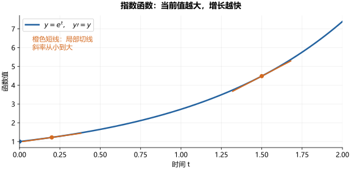

图中橙色短线是切线：越往右，函数值越大，切线越陡。这把 $y'=y$ 的含义直接画了出来。

**$y''=-y$：加速度始终指向平衡位置。** 它对应选定单位后的无阻尼弹簧振动：位移为正时加速度为负，位移为负时加速度为正，质点在回复力作用下往复运动。因此，解呈正弦或余弦形态。$y=\cos t$ 表示从单位位移处静止释放，$y=\sin t$ 表示从平衡位置以单位速度出发。

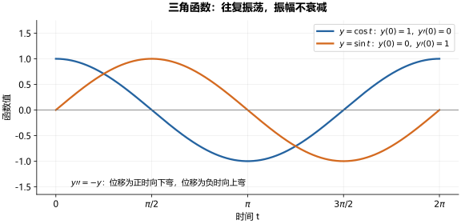

两条曲线起点和起始斜率不同，但始终在 $-1$ 与 $1$ 之间振荡。曲线在正位移处向下弯、负位移处向上弯，对应 $y''=-y$。

**$y''=y$：加速度与位移方向相同。** 若把 $y$ 看成位移，那么位移为正时加速度为正，位移为负时加速度为负，作用力推动物体继续偏离原点。初值 $y(0)=1$、$y'(0)=0$ 选出 $y=\cosh t$：从单位位移处静止出发，随后向外加速；初值 $y(0)=0$、$y'(0)=1$ 选出 $y=\sinh t$：从原点以单位速度出发，偏离后继续加速。因此，对 $t>0$，这两个函数都向外增长，没有三角函数那样的往复振荡。这里描述的是方程 $y''=y$ 本身；前面的过阻尼弹簧是另一个方程，其完整解还带有衰减因子。

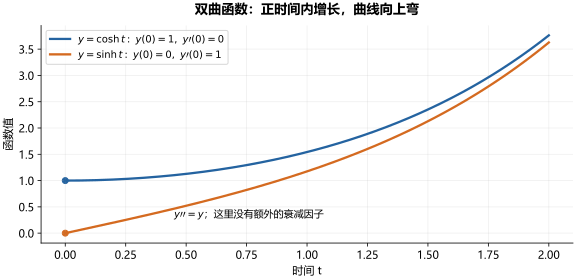

蓝线从 $1$ 出发且初始切线水平，橙线从 $0$ 出发且初始斜率为 $1$。对 $t>0$，两者为正且向上弯，斜率逐渐增大，对应 $y''=y$。

#### 为什么这里没有衰减因子，过阻尼弹簧却会衰减

关键在于**方程中有没有一阶导数项，以及它的系数是什么**。对一般二阶常系数齐次方程

$$
ay''+by'+cy=0,
$$

两个特征根以 $\alpha=-b/(2a)$ 为中心。实根情形可写成 $\alpha\pm\mu$，复根情形可写成 $\alpha\pm i\beta$，所以通解分别具有形式

$$
y=e^{-bt/(2a)}\bigl(A\cosh(\mu t)+B\sinh(\mu t)\bigr),
$$

$$
y=e^{-bt/(2a)}\bigl(A\cos(\beta t)+B\sin(\beta t)\bigr).
$$

共同因子 $e^{-bt/(2a)}$ 在 $b/a>0$ 时衰减。这里定义三角函数与双曲函数所用的是

$$
y''+y=0,\qquad y''-y=0.
$$

两者都没有 $y'$ 项，即 $b=0$，共同因子就是 $e^0=1$，所以没有写出来。前者得到 $\cos t$、$\sin t$；后者得到 $\cosh t$、$\sinh t$。双曲函数内部仍然包含 $e^t$ 和 $e^{-t}$，只是外面没有额外的共同衰减因子。

**阻尼弹簧则有一阶导数项。** 它的方程是

$$
my''+\gamma y'+ky=0,
\qquad \delta=\frac{\gamma}{2m},\quad \omega_0=\sqrt{\frac{k}{m}}.
$$

$\gamma$ 是阻尼系数，阻尼力为 $-\gamma y'$，方向与速度相反。普通弹簧滑块模型中，质量 $m>0$、刚度 $k>0$、阻尼系数 $\gamma\ge0$。可以取 $\gamma=0$，表示忽略阻尼，此时

$$
y''+\frac{k}{m}y=0.
$$

由于 $k/m>0$，特征根为 $\pm i\sqrt{k/m}$，解是三角函数的组合；共同指数因子为 $e^0=1$，所以振幅不衰减。选定时间单位使 $k/m=1$，就得到定义正弦、余弦时使用的 $y''+y=0$。

**那么，普通无阻尼弹簧能得到 $y''-y=0$ 吗？** 不能。按系数比较，它要求 $\gamma/m=0$、$k/m=-1$；质量为正，就意味着刚度 $k<0$。这时力 $-ky$ 会推动物体继续偏离平衡，而不是把它拉回来，不符合这里普通正刚度弹簧的回复力模型。因此，定义 $\cosh t$、$\sinh t$ 的方程不能直接当作这个普通无阻尼弹簧的运动方程。本节限定普通正刚度弹簧，假设 $m>0$、$k>0$、$\gamma\ge0$。这不意味着物理世界不存在负刚度：某些预压或屈曲结构可在局部变形范围内表现出负的等效刚度。特殊振动结构中的“负有效质量”则是描述动态响应的等效参数，不是物体本身的实际质量变成负数。这里不展开这些特殊模型。

**过阻尼弹簧仍然可以用双曲函数表示。** 当 $\gamma>0$ 时，共同因子为 $e^{-\delta t}$。欠阻尼时，三角函数描述往复振荡，外面的指数使振幅逐渐减小；过阻尼时，令 $\mu=\sqrt{\delta^2-\omega_0^2}$，解为

$$
y(t)=e^{-\delta t}\bigl[A\cosh(\mu t)+B\sinh(\mu t)\bigr],
\qquad 0<\mu<\delta.
$$

对 $t>0$，双曲函数本身增长，但外面的指数衰减更快。展开就得到

$$
\begin{aligned}
y(t)
&=e^{-\delta t}\left[A\frac{e^{\mu t}+e^{-\mu t}}2
+B\frac{e^{\mu t}-e^{-\mu t}}2\right]\\
&=\frac{A+B}{2}e^{-(\delta-\mu)t}
+\frac{A-B}{2}e^{-(\delta+\mu)t}.
\end{aligned}
$$

两个指数项都趋于零。因此，**衰减的是完整的位移解，不是双曲函数本身**。令 $y=e^{-\delta t}u$，分离出共同衰减因子后，过阻尼弹簧方程就化为 $u''=\mu^2u$，这也说明了双曲函数为什么会出现在它的解中。

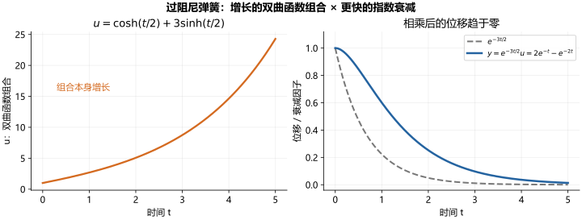

图中采用前面的具体解 $y=e^{-3t/2}[\cosh(t/2)+3\sinh(t/2)]$。左图的双曲函数组合不断增长；右图中灰色虚线是衰减因子，蓝线是相乘后的实际位移，仍然趋于零。两图纵轴尺度不同，分别展示因子与乘积的变化趋势。


因此，不一定先有一个熟悉的函数，再去验证它满足某个方程；也可以先给方程和足够的条件，再把选出的解作为一个函数来研究。

### 幂级数法：从系数递推到函数图像

幂级数法把未知函数写成无穷多项式，再由方程逐个确定系数。它既能构造特殊函数，也能直接求解适合的 ODE。在常规解析系数的线性方程普通点附近，可以这样寻找收敛解；遇到系数奇点时则要另外分析，不能不加检查地套用。

#### 用 Airy 方程推导系数

以 Airy 方程

$$
y''-ty=0,\qquad\text{即 }y''=ty
$$

为例。它是变系数线性方程。若像常系数情形一样试取 $y=e^{rt}$，其中 $r$ 为常数，求导得到

$$
y'=re^{rt},\qquad y''=r^2e^{rt}.
$$

代入 $y''-ty=0$：

$$
r^2e^{rt}-te^{rt}=0,
\qquad (r^2-t)e^{rt}=0.
$$

因为 $e^{rt}\ne0$，两边除以它，就要求

$$
r^2-t=0,\qquad r^2=t.
$$

但 $r$ 是固定常数，$t$ 却在区间内变化，这个等式不可能始终成立。因此改用幂级数，设

$$
y(t)=\sum_{n=0}^{\infty}c_nt^n
=c_0+c_1t+c_2t^2+c_3t^3+\cdots.
$$

求两次导数并重新编号，得到

$$
y''(t)=\sum_{n=0}^{\infty}(n+2)(n+1)c_{n+2}t^n.
$$

右边则为

$$
ty(t)=\sum_{n=1}^{\infty}c_{n-1}t^n.
$$

比较同次幂的系数：右边没有常数项，所以 $2c_2=0$；对于 $n\ge1$，

$$
(n+2)(n+1)c_{n+2}=c_{n-1},\qquad
c_{n+2}=\frac{c_{n-1}}{(n+2)(n+1)}.
$$

**为什么只需要给出 $c_0$ 和 $c_1$？** 先把 $t=0$ 代入级数，所有含 $t$ 的项都消失，所以 $y(0)=c_0$。再求一次导数，

$$
y'(t)=c_1+2c_2t+3c_3t^2+\cdots,
$$

代入 $t=0$ 就得到 $y'(0)=c_1$。因此，初始函数值和初始斜率分别确定前两个系数。

剩下的系数不能自由选择，因为它们必须满足方程给出的递推关系。把递推式换一种编号方式，写成

$$
c_j=\frac{c_{j-3}}{j(j-1)},\qquad j\ge3.
$$

它表示：**每个新系数由往前三位的系数决定**。于是系数分成三条依次计算的链：

$$
c_0\longrightarrow c_3\longrightarrow c_6\longrightarrow\cdots,
$$

$$
c_1\longrightarrow c_4\longrightarrow c_7\longrightarrow\cdots,
$$

$$
c_2=0\longrightarrow c_5=0\longrightarrow c_8=0\longrightarrow\cdots.
$$

第三条链的起点 $c_2$ 已经由方程确定为零。因此，只要初值给出 $c_0$、$c_1$，三条链的起点就全部确定，其余系数都能递推出来：

$$
c_2=0,\quad c_3=\frac{c_0}{6},\quad c_4=\frac{c_1}{12},\quad
c_5=0,\quad c_6=\frac{c_0}{180},\quad c_7=\frac{c_1}{504},\ldots.
$$

把属于 $c_0$、$c_1$ 的项分别整理，得到

$$
y(t)=c_0\left(1+\frac{t^3}{6}+\frac{t^6}{180}+\cdots\right)
+c_1\left(t+\frac{t^4}{12}+\frac{t^7}{504}+\cdots\right).
$$

把两个括号分别记为 $u(t)$、$v(t)$，就得到通解 $y=c_0u+c_1v$。其中 $u$ 对应初值 $(1,0)$，$v$ 对应初值 $(0,1)$，它们是两个独立解。

例如求解初值问题

$$
y''=ty,\qquad y(0)=1,\quad y'(0)=2,
$$

只需取 $c_0=1$、$c_1=2$，得到

$$
y=u+2v=1+2t+\frac{t^3}{6}+\frac{t^4}{6}
+\frac{t^6}{180}+\frac{t^7}{252}+\cdots.
$$

Airy 方程的这个级数对所有有限实数 $t$ 都收敛。无穷级数是精确表示，截断后的有限多项式是近似。此时我们已经求出了一个完整的解族，还没有给其中的标准解命名。

#### 从展开式得到图像

画图需要一组坐标 $(t,y(t))$。先由初值确定 $c_0,c_1$，再按递推式求系数；选取许多横坐标，代入截断多项式，增加项数并检查数值是否稳定，就能画出解的曲线。远离展开中心时可能需要更多项和更高计算精度。

下面将从这个解族中选出标准的 Ai、Bi，利用已经得到的级数计算它们的图像，再讨论振荡、衰减与增长的性质。

### 几类常见的特殊函数

前一节已经用幂级数求出了 Airy 方程的解。接下来要做的是：**从解族中选出标准函数，再利用展开式研究它的数值、图像和性质。** Airy、Bessel、Legendre 函数都可以沿着“方程—标准解—计算—性质”这条思路认识。

#### 从解的展开式到可以反复使用的函数

既然已经有了级数，为什么还要给函数命名？因为同一种方程会在不同问题里反复出现。统一函数的定义和尺度，就能共同积累它的数值表、零点、导数关系和近似公式，后来的使用者不必每次重新推导。

十九世纪，振动、热传导、天文学和光学推动了这类研究，使特殊函数成为数学物理的重要工具。在电子计算机普及以前，手算长级数十分费力；集中编制函数表后，就可以查值、插值，并借助计算尺、机械计算器完成后续运算。计算尺通常不能直接算任意特殊函数值，专门的函数表因而很重要。今天软件替代了大量查表工作，但仍依靠这些级数、递推式和渐近公式。

#### Airy 函数：系数变号时，振荡与衰减怎样衔接

仍看已经求过的 Airy 方程：

$$
y''-ty=0.
$$

前一节得到 $y=c_0u+c_1v$，其中 $u$、$v$ 分别对应初值 $(1,0)$、$(0,1)$。Ai、Bi 并不是在这个解族之外另造的函数，而是从中选出的两条标准独立解。Airy 在 1838 年研究光学焦散附近的光强，相关理论与虹附近的衍射有关；这类函数后来成为描述振荡与衰减过渡的常用工具。

**怎样由前面的级数得到 Ai、Bi？** 把各自的标准初值作为 $u$、$v$ 的系数：

$$
\operatorname{Ai}=\operatorname{Ai}(0)u+\operatorname{Ai}'(0)v,
\qquad
\operatorname{Bi}=\operatorname{Bi}(0)u+\operatorname{Bi}'(0)v.
$$

这两组系数不成比例，因此 Ai、Bi 也独立，可以把同一个通解写成

$$
y=C_1\operatorname{Ai}(t)+C_2\operatorname{Bi}(t).
$$

所采用的初值约为

| 函数 | $y(0)$ | $y'(0)$ |
| --- | --- | --- |
| $\operatorname{Ai}(t)$ | $0.3550280539$ | $-0.2588194038$ |
| $\operatorname{Bi}(t)$ | $0.6149266274$ | $0.4482883574$ |

这些数的精确形式可以用 Gamma 函数表示：

$$
\operatorname{Ai}(0)=\frac{1}{3^{2/3}\Gamma(2/3)},\qquad
\operatorname{Ai}'(0)=-\frac{1}{3^{1/3}\Gamma(1/3)},
$$

$$
\operatorname{Bi}(0)=\sqrt3\operatorname{Ai}(0),\qquad
\operatorname{Bi}'(0)=-\sqrt3\operatorname{Ai}'(0).
$$

这里 $\Gamma(s)=\int_0^\infty u^{s-1}e^{-u}\,du$（$s>0$），也是用积分定义的特殊函数；此处只需知道它确定了上面初值的精确数值。

##### 把标准初值代入级数，计算 Ai 的图像

已有通用的系数递推式，现在把 Ai 的标准初值代入即可计算。

例如，取 Ai 的初值，在 $t=1$ 处使用到七次项的截断式：

$$
\operatorname{Ai}(1)\approx
0.3550280539\left(1+\frac16+\frac1{180}\right)
-0.2588194038\left(1+\frac1{12}+\frac1{504}\right).
$$

继续加入高次项，会得到 $\operatorname{Ai}(1)\approx0.1352924163$。对许多 $t$ 重复计算，就能得到函数图像。

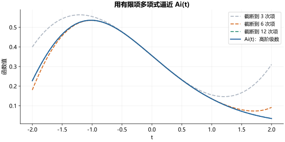

图中比较了三次、六次和十二次截断多项式。在零点附近，少量项就能很好地近似；离展开中心更远时，需要更多项。下面的 Ai、Bi 图采用高精度系数递推并截断到一百五十次项计算，同时与独立的特殊函数实现核对。实际软件会根据自变量范围选用级数、积分、渐近展开等算法；远离零点时直接求和可能出现大数相减，不能只靠盲目增加项数。

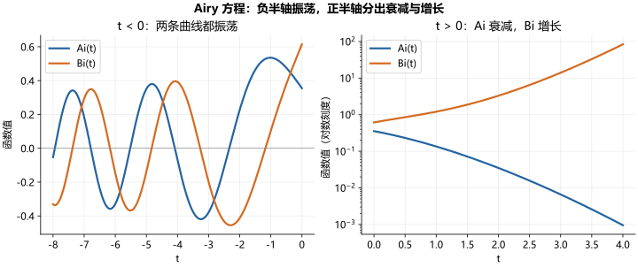

##### 从图像理解解的性质

 左图中 $t<0$，方程可写成 $y''+|t|y=0$，两条标准解都振荡；向更负的方向，振荡变得更密。右图中 $t>0$，$\operatorname{Ai}$ 衰减到零，$\operatorname{Bi}$ 快速增长。右图采用对数纵轴，让很小与很大的函数值能同时看清，不能把两幅图的纵轴高度直接比较。

$t=0$ 是系数变号的位置，但不是这个微分方程的奇点：最高阶系数始终为 $1$，Ai、Bi 在这里依然光滑。它们不能用初等函数表示，却可以精确地用收敛级数定义。图像正是由前一节的幂级数计算出来的；数值积分和专门的特殊函数算法也能用于计算。

#### Bessel 函数：圆形区域里的振荡

Bessel 方程为

$$
t^2y''+ty'+(t^2-\nu^2)y=0.
$$

$\nu$ 是固定参数，称为阶数；它不是求导次数。对固定实参数 $\nu$，在 $t>0$ 上选取两个标准独立解：第一类 $J_\nu(t)$ 与第二类 $Y_\nu(t)$。通解为

$$
y=C_1J_\nu(t)+C_2Y_\nu(t).
$$

这里的 $Y_\nu$ 是函数名称，不是新的未知量。它们常出现在圆膜振动、圆柱导热等问题的径向方程中，此时自变量表示缩放后的半径，而不是时间。

##### 用同样的幂级数法构造 J₀

取 $\nu=0$，得到

$$
t^2y''+ty'+t^2y=0.
$$

在 $t=0$ 附近寻找幂级数解 $y(t)=\sum_{n=0}^{\infty}c_nt^n$，代入并比较同次幂系数，得到

$$
c_1=0,\qquad n^2c_n+c_{n-2}=0\quad(n\ge2).
$$

若规定 $c_0=1$，就依次有

$$
c_2=-\frac14,\qquad c_4=\frac1{64},\qquad c_6=-\frac1{2304},\ldots.
$$

于是得到零阶第一类 Bessel 函数

$$
J_0(t)=\sum_{m=0}^{\infty}\frac{(-1)^m}{(m!)^2}\left(\frac t2\right)^{2m}
=1-\frac{t^2}{4}+\frac{t^4}{64}-\frac{t^6}{2304}+\cdots.
$$

这个级数对所有实数 $t$ 收敛，既给出了精确的函数表示，也提供了计算它的一种方式。注意 $t=0$ 处最高阶系数为零，是方程的奇点；这里是在解析解中通过级数和 $J_0(0)=1$ 选定函数，不能直接套用普通点处的显式初值定理。

##### 从图像看圆心行为与振荡

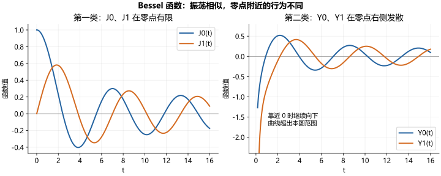

图中画的是零阶与一阶函数。它们看起来像振幅逐渐减小的正弦波，但不是等幅、等间距零点的普通正弦函数。这里可以读出两条重要信息：

- **圆心附近的行为不同。** $J_0(0)=1$、$J_1(0)=0$，两者有限；$Y_0(t)$、$Y_1(t)$ 在 $t\to0^+$ 时向负无穷发散。若模型包含圆心且要求位移或温度有限，通常要舍去这类发散解；若区域是圆环、不包含零点，则未必需要舍去。
- **远处都有振荡，振幅逐渐变小。** 对固定阶数，在正实轴远处，振荡幅度大致按 $t^{-1/2}$ 减小。在径向问题中，这描述的是空间分布，不能直接解释为时间上的阻尼耗能。

除了看图，还能精确地研究它们的导数和零点。例如

$$
J_0'(t)=-J_1(t).
$$

因此，$J_1$ 的零点决定 $J_0$ 的驻点。$J_0$ 的第一个正零点约为 $2.4048$：若圆膜半径为 $R$，径向模式为 $J_0(\lambda r)$，边缘固定要求 $J_0(\lambda R)=0$，这些零点就筛选出允许的 $\lambda$，进而决定振动频率。特殊函数的零点因此有直接的物理用途。

#### Legendre 函数：球面角度与正交多项式

Legendre 方程为

$$
(1-t^2)y''-2ty'+\ell(\ell+1)y=0.
$$

当 $\ell=0,1,2,\ldots$ 时，有一个次数为 $\ell$ 的多项式解，按 $P_\ell(1)=1$ 选定尺度，称为 Legendre 多项式：

$$
P_0(t)=1,\qquad P_1(t)=t,\qquad P_2(t)=\frac{3t^2-1}{2},
$$

$$
P_3(t)=\frac{5t^3-3t}{2},\qquad
P_4(t)=\frac{35t^4-30t^2+3}{8}.
$$

所以“特殊函数”并不一定都没有初等表达式。一般通解在 $-1<t<1$ 上还包含另一条独立解 $Q_\ell(t)$；对这些整数阶数，它在端点发散。若球面问题要求两极处有限，通常保留 $P_\ell$ 对应的部分。

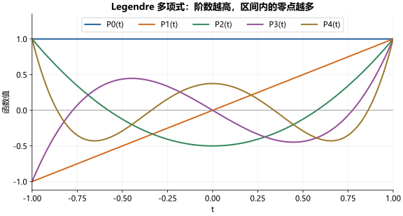

从图中可以看到：每条曲线在 $t=1$ 都取值 $1$；偶数阶关于纵轴对称，奇数阶关于原点对称；$P_\ell$ 在 $(-1,1)$ 内恰好有 $\ell$ 个零点。阶数越高，可以描述越细的角度变化。球面对称问题中常取 $t=\cos\theta$，因此这里的横轴也不一定是时间。

它们还有图像本身不容易看出的重要性质——**正交性**：对不同的非负整数 $j,\ell$，

$$
\int_{-1}^1P_j(t)P_\ell(t)\,dt=0.
$$

这类似不同坐标方向互相垂直，但这里比较的是两个函数的乘积积分。例如 $P_0P_1=t$，在对称区间上的积分为零。正交性让我们能把适当的函数展开为 Legendre 多项式的叠加，逐项求系数，作用类似 Fourier 展开中的正弦和余弦。

#### 没有初等公式，我们仍然能知道多少

命名一个特殊函数只是起点。对 Airy、Bessel、Legendre 这样的经典函数，通常已经建立了系统的知识：

| 想知道什么 | 可以怎样研究或使用 |
| --- | --- |
| 它究竟是哪一个函数？ | 用微分方程加初值、端点行为或标准化条件选定 |
| 某一点的值是多少？ | 用收敛级数、积分或专门算法计算，并估计误差 |
| 图像怎样变化？ | 研究符号、导数、极值、零点和振荡规律 |
| 靠近端点会不会发散？ | 分析局部展开，筛选符合物理条件的解 |
| 自变量很大时怎样变化？ | 用渐近公式描述增长、衰减、相位与振幅 |
| 怎样求导、联系不同阶数？ | 建立导数公式与递推关系，例如 $J_0'=-J_1$ |
| 怎样满足边界条件？ | 利用零点选择允许的空间模式，利用正交性计算展开系数 |

这些性质要靠方程和分析证明，不能只凭图像判断。**不熟悉函数的名字，不等于不了解这个函数；没有初等表达式，也不妨碍精确研究它。** 十九世纪特殊函数理论的重要成果，就是把反复出现的微分方程解发展成可计算、可比较、可用于物理问题的一套工具。

标准定义可查阅 NIST DLMF 的 [Airy 函数](https://dlmf.nist.gov/9.2)、[Bessel 函数](https://dlmf.nist.gov/10.2) 和 [Legendre 方程](https://dlmf.nist.gov/14.2)；上述性质还可参见 [Bessel 导数关系](https://dlmf.nist.gov/10.6)、[零点附近的行为](https://dlmf.nist.gov/10.7) 与 [经典正交多项式](https://dlmf.nist.gov/18.3)。

这些例子说明，求出展开式以后，我们还能计算和研究解，而不必停留在一个新名字上。下一章再追问更基本的问题：给定 ODE 和初值，解是否一定存在、是否唯一，又能延续到什么时候？

## 八、ODE 的数值求解：从特殊函数到计算机辅助计算

上一章讨论“用什么函数表示解”，这一章讨论“给定方程和初值，计算机怎样算出后面的函数值”。我们沿着一个具体问题，从 Euler 法走到经典四阶 Runge–Kutta 法（简称 RK4），再把公式写成程序。

本章最重要的区别是：**求一次斜率，是询问一个位置上的变化率；走一个时间步，是用估计出的变化量更新状态。RK4 每走一个时间步，要先做四次斜率试算，最后只正式更新一次。**

### 从表示解到计算解：方法怎样发展

十八、十九世纪的特殊函数理论，让许多无法用初等函数表达的解有了精确定义、级数和可查用的数值表。与此同时，Euler 等人的逐步近似方法提供了另一条路线：直接从初值出发，计算一串近似状态。

十九世纪末至二十世纪初，Runge、Heun、Kutta 等人发展了在一步内多次估计变化率的方法。二十世纪中叶以后，电子计算机使重复计算和大型方程组求解更加可行，自动步长、误差估计和刚性问题的算法逐渐成为重要工具。

这些方法长期并行。特殊函数可以通过数值算法求值，一个没有常用函数名称的初值问题也可以直接数值积分。计算机需要的是可执行的变化规律，不一定需要先知道解的公式。

### 先说明要解的题：已知变化规律和起点，求后续状态

本章用下面的初值问题贯穿公式、手算、程序和图像：

$$
\begin{cases}
y'(t)=y(t)^2-y(t), & 0\le t\le1,\\
y(0)=\dfrac12.
\end{cases}
$$

要求的是 $y(t)$。我们希望计算 $y(0.2)$、$y(0.4)$ 等值，最后得到 $y(1)$ 的近似值。记方程右端为

$$
f(t,y)=y^2-y.
$$

这里要分清三件事：$t$ 是时间，$y$ 是状态，$f(t,y)$ 是变化率。输入 $t=0,y=0.5$，右端返回 $-0.25$，意思是“此刻状态向下变化的速度为 $0.25$”，不是说下一个状态等于 $-0.25$。

本例的右端不显含时间，但仍写成 $f(t,y)$，以便使用适用于一般方程的记号。它恰好有精确解

$$
y(t)=\frac{1}{1+e^t}.
$$

这个公式只用来事后检验和绘图，下面的数值算法不会用它推进。

### 一个时间步究竟在算什么：估计这段时间的总变化

设当前时间是 $t_n$，下一时刻是 $t_n+h$，其中 $h>0$ 是步长。精确解满足

$$
y(t_n+h)=y(t_n)+\int_{t_n}^{t_n+h}f(s,y(s))\,ds.
$$

也就是：**下一时刻的状态 = 当前状态 + 这一小段时间内累积的变化。** 如果知道这段时间的平均变化率，乘以时间长度 $h$，就能得到状态增量。

困难在于积分里面的 $y(s)$ 还不知道。数值方法需要用已经掌握的信息估计这段变化。下面用大写 $Y_n$ 表示计算得到的近似状态，区别于精确值 $y(t_n)$。

#### Euler 法：用起点斜率代表整段时间

最直接的想法是：这一小段时间足够短，就暂时把变化率看成起点处的常数。于是

$$
Y_{n+1}=Y_n+h f(t_n,Y_n).
$$

从 $t_0=0,Y_0=0.5$ 出发，取 $h=0.2$：

$$
f(0,0.5)=-0.25,\qquad
Y_1=0.5+0.2\times(-0.25)=0.45.
$$

这里 $-0.25$ 是斜率，$-0.05$ 是这一步估计的状态变化量，$0.45$ 才是 $y(0.2)$ 的近似值。继续用 $(0.2,0.45)$ 作起点，就算出下一步 $Y_2=0.4005$。

Euler 法每一步只看起点。只要斜率在这一段里改变，沿起点切线走到底就会产生误差。Runge–Kutta 方法因此在同一步内多问几次“到了附近这个位置，变化率会是多少”，再综合这些信息。

### 经典四阶 Runge–Kutta 法（RK4）的核心：四次问斜率，一次更新状态

“在中点算斜率”有一个容易忽略的困难：**只知道中点时间还不够，还必须给出中点状态，才能调用 $f(t,y)$。而真正的中点状态恰好是未知的。** 所以需要先试算一个状态，再让方程告诉我们这个试算位置的变化率。

经典 RK4 有四个阶段。四个阶段中，正式状态始终是同一个 $Y_n$；下面用 $\widetilde Y$ 标记临时的试算状态。

#### 第一次：直接问当前点的斜率 k1

当前点 $(t_n,Y_n)$ 已经知道，直接代入右端：

$$
k_1=f(t_n,Y_n).
$$

它回答：“如果现在就在这个状态，此刻变化得多快？”这是 Euler 法也会计算的斜率。RK4 暂时不拿它走完整步，而是先用它预测中点。

#### 第二次：用 k1 预测中点，再问那里斜率 k2

从原来的 $Y_n$ 出发，沿 $k_1$ 试走半步：

$$
\widetilde Y_2=Y_n+\frac h2 k_1.
$$

现在有了一个中点候选位置 $(t_n+h/2,\widetilde Y_2)$，就可以再次调用方程右端：

$$
k_2=f\left(t_n+\frac h2,\widetilde Y_2\right).
$$

这不是对 $k_1$ 再求导。它是把一个新的时间和状态代入同一个函数 $f$，得到那个位置上的变化率。

#### 第三次：用 k2 重新预测中点，再问斜率 k3

第一次预测中点只用了起点斜率。现在获得了中点附近的斜率 $k_2$，便用它重新构造一个中点候选状态：

$$
\widetilde Y_3=Y_n+\frac h2 k_2,\qquad
k_3=f\left(t_n+\frac h2,\widetilde Y_3\right).
$$

注意加在前面的仍是 **$Y_n$**，不是 $\widetilde Y_2$。这是从同一起点重新试算半步，没有从第一个中点接着往前走。

$k_2$ 和 $k_3$ 的时间相同，都是 $t_n+h/2$；状态一般不同，所以斜率也可能不同。这正是为什么“中点算两次”不一定重复：我们第二次换了一个中点状态的估计。若右端只依赖时间而不依赖状态，这两次斜率才会相同。

#### 第四次：用 k3 预测终点，再问斜率 k4

利用刚得到的中点附近斜率，从原起点试走一整步：

$$
\widetilde Y_4=Y_n+h k_3,\qquad
k_4=f(t_n+h,\widetilde Y_4).
$$

这次询问的是终点附近的变化率。$\widetilde Y_4$ 仍是试算状态，并不是最终接受的 $Y_{n+1}$。到这里，我们收集了起点、两个中点候选位置和一个终点候选位置上的斜率信息。

#### 最后：合成平均斜率，正式走完这一个时间步

经典 RK4 使用下面的加权组合：

$$
\overline k=\frac{k_1+2k_2+2k_3+k_4}{6},\qquad
Y_{n+1}=Y_n+h\overline k.
$$

$\overline k$ 是对本步平均变化率的估计，$h\overline k$ 是状态增量。只有这一步完成以后，才把时间推进到 $t_{n+1}=t_n+h$，把正式状态换成 $Y_{n+1}$。

| 阶段 | 求斜率的位置 | 使用哪条已有斜率预测状态 | 正式状态是否更新 |
| --- | --- | --- | --- |
| $k_1$ | 起点 $(t_n,Y_n)$ | 不需要预测 | 否 |
| $k_2$ | 第一个中点候选位置 | 用 $k_1$ 从 $Y_n$ 试走半步 | 否 |
| $k_3$ | 第二个中点候选位置 | 用 $k_2$ 从 $Y_n$ 重新试走半步 | 否 |
| $k_4$ | 终点候选位置 | 用 $k_3$ 从 $Y_n$ 试走整步 | 否 |
| 加权更新 | 得到下一正式点 | 综合四条斜率，乘以 $h$ | 是 |

因此，“四次算斜率”不是连续走四步，不是求一至四阶导数，也不是先知道真实中点和终点再取值。它是在不知道未来状态的情况下，用前一次试算提供下一次询问的位置，最后合成一次更新。

### 为什么这样加权：四阶精度从哪里来

权重 $1,2,2,1$ 配合上述试算位置，使一步更新的展开与真解的 Taylor 展开匹配到四阶。这是整套公式共同满足的精度条件，不能仅凭“中点比较重要”就随意换权重，也不能把多算几次斜率自动等同于更高精度。

用最简单的 $y'=y$ 看这种配合。此时 $f(t,y)=y$，四次斜率依次为

$$
\begin{aligned}
k_1&=Y_n,\\
k_2&=Y_n(1+h/2),\\
k_3&=Y_n(1+h/2+h^2/4),\\
k_4&=Y_n(1+h+h^2/2+h^3/4).
\end{aligned}
$$

代入加权更新，得到

$$
Y_{n+1}=Y_n\left(1+h+\frac{h^2}{2}+\frac{h^3}{6}+\frac{h^4}{24}\right).
$$

精确推进则是 $y(t_n+h)=e^h y(t_n)$。可以看出，RK4 恰好保留了指数展开直到 $h^4$ 的项。这个例子帮助理解精度的来源；一般非线性方程的四阶结论还需要完整的阶条件论证。

在足够光滑及适当稳定性条件下，从精确起点走一步的误差为 $O(h^5)$；在固定有限区间内累积后的全局误差为 $O(h^4)$。Euler 法相应为 $O(h^2)$ 和 $O(h)$。“四阶”描述这种误差随步长减小的规律，与原方程是一阶还是二阶没有关系。

### 用贯穿例子算一整步：从 0.5 到 y(0.2)

回到 $f(t,y)=y^2-y$，从 $(0,0.5)$ 出发，取 $h=0.2$。

第一次直接计算：

$$
k_1=0.5^2-0.5=-0.25.
$$

第二次先预测中点，再把试算状态代入右端：

$$
\widetilde Y_2=0.5+0.1(-0.25)=0.475,\qquad
k_2=0.475^2-0.475=-0.249375.
$$

第三次用 $k_2$ 从原状态 $0.5$ 重新预测中点：

$$
\widetilde Y_3=0.5+0.1(-0.249375)=0.4750625,\qquad
k_3=\widetilde Y_3^2-\widetilde Y_3\approx-0.2493781211.
$$

第四次用 $k_3$ 从原状态 $0.5$ 预测终点：

$$
\widetilde Y_4=0.5+0.2k_3\approx0.4501243758,\qquad
k_4=\widetilde Y_4^2-\widetilde Y_4\approx-0.2475124221.
$$

最后平均斜率约为 $\overline k=-0.2491697774$，所以正式更新为

$$
Y_1=0.5+0.2\overline k\approx0.4501660445.
$$

**终点试算值 $0.4501243758$ 是拿来求 $k_4$ 的，最终结果 $0.4501660445$ 才会保存下来。** 下一步以 $(0.2,Y_1)$ 为新起点，重新计算四条斜率，而不是沿用旧的 $k_2,k_3,k_4$。

| 时刻 | Euler 法，$h=0.2$ | RK4，$h=0.2$ | 精确解 |
| --- | --- | --- | --- |
| $0.2$ | $0.4500000000$ | $0.4501660445$ | $0.4501660027$ |
| $0.4$ | $0.4005000000$ | $0.4013124281$ | $0.4013123399$ |

本例中，RK4 每一步多调用了几次右端函数，得到更准确的状态。对大型方程组，右端计算本身可能很贵，因此实际选算法时还要比较总计算量。

### 把四次试算写成程序：临时状态与正式状态分开

程序计算同一个初值问题，从 $t=0$ 的 $y=0.5$ 推进到 $t=1$，并分别使用 $h=0.2$ 和 $h=0.1$。以下代码仅使用 Python 标准库。

| 代码名字 | 对应数学量 | 含义 |
| --- | --- | --- |
| `t, y` | $t_n,Y_n$ | 当前正式时间与状态 |
| `dt` | 本步长度 $h$ | 末步必要时缩短，以停在终点 |
| `y_trial2` | $\widetilde Y_2$ | 第一种中点试算状态 |
| `y_trial3` | $\widetilde Y_3$ | 第二种中点试算状态 |
| `y_trial4` | $\widetilde Y_4$ | 终点试算状态 |
| `k1, k2, k3, k4` | $k_1,k_2,k_3,k_4$ | 右端函数在四个候选位置给出的变化率 |
| `average_slope` | $\overline k$ | 本步平均变化率的估计 |
| `trajectory` | $(t_n,Y_n)$ 点列 | 只保存正式接受的状态 |

```python
from math import exp


def f(t, y):
    # 方程右端：输入时间与状态，返回变化率 dy/dt。
    return y * y - y


def rk4(f, t0, y0, t_end, h):
    # 本例只支持从 t0 向 t_end 正向计算。
    if h <= 0 or t_end < t0:
        raise ValueError("Require h > 0 and t_end >= t0")
    t, y = t0, y0                  # 当前的 t_n、Y_n
    trajectory = [(t, y)]          # 保存初始点

    while t < t_end:
        dt = min(h, t_end - t)     # 本步长度 h_n，避免越过终点
        if t + dt == t:
            raise ArithmeticError("Step too small to advance time")

        # 四个阶段都保留原来的 y，只建立不同的试算状态。
        k1 = f(t, y)                          # ① 起点的变化率

        y_trial2 = y + (dt / 2) * k1           # 用 k1 从起点试走半步
        k2 = f(t + dt / 2, y_trial2)           # ② 在这个试算中点求斜率

        y_trial3 = y + (dt / 2) * k2           # 用 k2 从同一起点重新试走半步
        k3 = f(t + dt / 2, y_trial3)           # ③ 在修正后的试算中点求斜率

        y_trial4 = y + dt * k3                 # 用 k3 从同一起点试走整步
        k4 = f(t + dt, y_trial4)               # ④ 在试算终点求斜率

        average_slope = (k1 + 2*k2 + 2*k3 + k4) / 6
        y = y + dt * average_slope            # 到这里才正式更新状态
        t = min(t + dt, t_end)
        trajectory.append((t, y))  # 保存新的时间与近似状态

    return trajectory


# 两次计算都从同一个初值重新出发，只改变步长。
for h in (0.2, 0.1):
    trajectory = rk4(f, t0=0.0, y0=0.5, t_end=1.0, h=h)
    t, y = trajectory[-1]          # [-1] 取列表最后一个点
    exact = 1 / (1 + exp(t))       # 只在计算结束后检验答案
    error = abs(y - exact)         # 终点绝对误差
    print(f"h={h:.1f}, y(1)={y:.9f}, error={error:.3e}")
```

读代码时抓住 `y_trial2`、`y_trial3`、`y_trial4` 都由同一个 `y` 算出；它们不会覆盖 `y`。`f` 每调用一次只返回一条斜率，不会自动移动时间或改变状态。直到 `y = y + dt * average_slope`，才真正完成一次更新。

函数参数 `f` 把物理模型与算法分开：换一个右端函数，就能用同一推进规则计算其他适用的标量初值问题。`trajectory[-1]` 表示取最后一个计算点；精确解只在循环外用于核对结果。

### 看结果与图像：曲线重合不等于误差为零

程序输出：

```text
h=0.2, y(1)=0.268941716, error=2.949e-07
h=0.1, y(1)=0.268941440, error=1.849e-08
```

`2.949e-07` 表示绝对误差约为 $2.949\times10^{-7}$。本例步长减半后，终点误差缩小约 16 倍，与四阶精度相符；该比例是在适当光滑性条件和足够小步长下的渐近表现，不是所有计算都必须精确满足的比例。

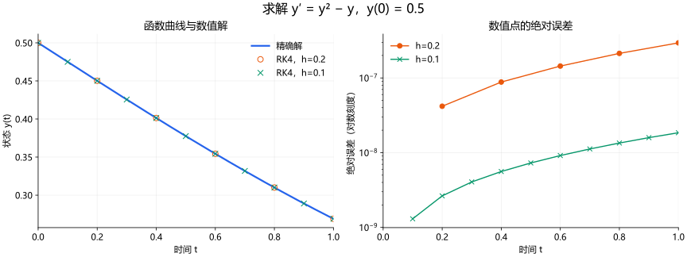

左图蓝线为精确解，橙色圆点和绿色叉号是两种步长的数值状态。函数由 $0.5$ 下降到约 $0.269$，数值点几乎落在蓝线上。图中保存的是正式结果，不包含本步内部的三个试算状态。

右图用对数纵轴展示各计算点的绝对误差，才能清楚比较精度。初始误差为零，不能显示在对数轴上，所以略去初始点。没有精确解时，可以缩小步长或换用适用算法比较结果，并结合模型性质检查；只看一条平滑曲线不足以判断算得准确。

### 换成物理模型时，计算机还需要什么

一般初值问题可以写成 $\mathbf y'=F(t,\mathbf y;\theta)$，其中 $\theta$ 是模型参数。除右端函数以外，还需要起始时间、初始状态、终止时间以及步长或精度要求。

例如受迫弹簧的二阶方程可以先改写成一阶系统：

$$
\begin{cases}
x'=v,\\
v'=(F(t)-\gamma v-kx)/m.
\end{cases}
$$

状态是 $(x,v)$。四次询问右端时，每次得到一组变化率 $(x',v')$；试算和加权都按向量进行。算法仍然是一次时间步内四次估计变化率。

质量、阻尼、刚度是模型参数，由问题给定或另行估计；它们与算法步长不是一回事。解析通解里的积分常数由初值决定，数值初值求解则直接从初始状态出发，不必先求通解再确定常数。

若指定的是区间两端的边界条件，通常还需要打靶法、配置法等边值方法。例如，调整未知的初始速度，反复积分，使终点满足要求。不能把缺少的初值随便填一个数，就当作解完边值问题。

### 步长怎样选：精度、稳定性与自动调整

#### 小步通常更准，但还要检查稳定性

对衰减方程 $y'=-\lambda y$、$\lambda>0$，Euler 更新是

$$
Y_{n+1}=(1-h\lambda)Y_n.
$$

要使非零数值状态的大小逐步衰减，必须有 $|1-h\lambda|<1$，即 $0<h\lambda<2$。当步长过大时，真解衰减，数值结果却可能增长。这是算法稳定性的问题，与精度阶数是不同要求；显式 RK4 也有步长受到稳定性限制的情形。

当系统同时存在快衰减与慢变化的尺度时，显式方法可能被迫使用极小步长，这类刚性问题常需要合适的隐式方法。隐式方法每步通常要解代数方程，不能简单理解成多问几次斜率。

#### 自动步长：先估计本步误差，再决定是否接受

上面的最小程序使用固定步长，没有自动误差估计。许多实际求解器会构造不同精度的近似结果，用差异估计局部误差：太大就缩步重算，足够小则接受这一步，并考虑下一步能否走大一些。

常见的误差尺度形如

$$
\mathrm{atol}_i+\mathrm{rtol}\,|Y_i|.
$$

绝对容限照顾接近零的分量，相对容限照顾数值较大的分量；再按一定范数汇总各分量的误差。这是局部误差控制的依据，不是整个区间最终误差的直接保证。也不能只凭 $k_2$ 和 $k_3$ 接近，就把它们的差当成通用而可靠的误差估计。

绘图要求的输出时刻与内部走步时刻还可以不同：求解器先自行推进，再通过局部插值给出指定时间的值。因此增加输出采样点，并不自动提高积分精度。

#### 实际计算还要留意事件、奇点和浮点数

状态触及边界、物体碰撞或输入突然切换时，可能需要定位事件并分段积分。若真解在有限时间发散，减小步长也不能把它延伸过奇点。计算机还存在舍入误差，步长极小不仅增加计算量，也未必继续改善结果。

读输出时，应检查是否成功到达终止时刻，再结合更小步长或更严格容限、守恒量与状态范围判断结果是否可信。

### 与下一章的联系：算出近似轨迹，还要知道它在逼近什么

Euler 和 RK4 沿时间网格逐点推进。Picard 迭代则在固定区间内反复更新整条候选函数；两者都可以从积分方程理解，但更新对象和用途不同。第九章会解释 Picard 迭代怎样与不动点理论、存在性和唯一性联系起来。

本章的计算主线是：**已知起点，用变化规律试算附近的状态，在这些位置求斜率，再估计整步的累积变化。** 对 RK4 来说，四次斜率是一次更新所需的内部信息；最终保存的只有新的时间和状态。接下来还要问，这条被近似的真解是否存在、是否唯一，以及能延续多久。

## 九、ODE 解的基本理论：存在性、唯一性与解的性质

前面几章主要在问“怎样求解”：可以分离变量、求齐次解、做常数变易，也可以用特殊函数或计算机给出答案。本章换一个角度：我们得到的到底是哪一种“解”？给定方程和条件以后，这样的解一定存在吗，能不能只有一个，又能可靠地预测多长时间？

先分清解的几种分类，再讨论这些理论问题。这里的分类不是把所有解分进互不重叠的抽屉，而是从不同角度描述同一个解。例如 $y=e^{-t}$ 可以同时是一个显式的精确解、经典解、光滑解和解析函数。

### 先把“解”分清楚：几种不同的分类角度

| 分类角度 | 常见说法 | 大白话在问什么 |
| --- | --- | --- |
| 描述的是一族还是一个函数 | 通解、满足指定条件的解、非齐次特解 | 是所有候选轨迹，还是其中一条？ |
| 怎样表示 | 显式解、隐式解、积分或级数表示、特殊函数表示 | 答案用什么形式写出来？ |
| 是否精确 | 精确解、数值近似解 | 真正满足方程，还是只在误差范围内逼近？ |
| 怎样满足方程 | 经典解、弱解（积分或分布意义） | 每一点都能代入导数，还是通过积分关系理解？ |
| 有多规则 | $C^1$、$C^2$、光滑解、解析解 | 能求几次导数，能不能由局部幂级数表示？ |
| 在多长的区间上成立 | 局部解、全局解、最大解 | 只知道一小段，还是能继续延伸？ |

#### 通解与特解：一族轨迹和其中一条轨迹

只给 $y'=y$，会得到 $y=Ce^t$ 这一族解。常数 $C$ 没有确定，对应不同的起始状态；加上 $y(0)=2$，才选出 $y=2e^t$。

对于系数连续、最高阶系数不为零的 $n$ 阶线性方程，通解可以用 $n$ 个独立常数描述。非线性方程则更复杂：通过某种变形得到的解族可能漏掉特殊解，不能只数常数就认定已经找全。

“特解”还要看上下文。在第五章的非齐次线性方程中，它是指**任意一个满足非齐次方程的函数**，未必已经满足题目的初值。例如

$$
y'+y=1
$$

有一个非齐次特解 $y_p=1$，通解是 $y=1+Ce^{-t}$。若初值为 $y(0)=3$，还要取 $C=2$。所以，“已经找到一个特解”和“已经解完给定的初值问题”是两回事。

#### 显式、隐式和特殊函数：表达形式不同，不代表真假不同

显式解把未知函数单独写出来，例如 $y=e^{-t}$。隐式解把它留在一个关系里，例如 $y'=1/y$ 在 $y\ne0$ 的区间上积分后得到

$$
y^2=2t+C.
$$

还要由初值选择正、负分支，并限制在 $2t+C>0$ 的区间上；不能在 $y=0$ 处任意把两支拼接，因为原方程在那里没有定义。

精确解也可以保留为积分，或用收敛级数、特殊函数表示。第七章的 Airy、Bessel 函数就是例子。给函数一个新名字并不能省去分析，但可以把已经研究过的一类解变成反复使用的工具。

应用语境里的“解析解”常常泛指这类精确表达。它与数学上“解析函数”的含义不同，后者有严格的幂级数要求。

#### 精确解与数值解：轨迹本身和轨迹的近似记录

精确解满足所讨论意义下的方程。数值解通常是一组 $Y_n\approx y(t_n)$，或者由这些点构造的插值函数；它一般不会逐点精确满足原方程。

例如 $y'=-y$、$y(0)=1$ 的精确解是 $e^{-t}$。Euler 法给出 $Y_{n+1}=(1-h)Y_n$，所以 $Y_n=(1-h)^n$。在有限区间内缩小步长，可以让这些离散值更接近真解，但固定步长下两者并不是同一个函数。

即使已经有精确公式，计算机输出的小数也通常是近似值。因此要区分“解在数学上怎样定义”和“用有限精度怎样计算它”。第八章研究的正是后一个问题。

#### 经典解：导数存在，每一点都满足方程

经典解要求函数具有方程所需的导数，并在区间内逐点满足方程。若还指定初值或边值，也必须同时满足这些条件。对于连续右端的一阶显式 ODE，通常寻找 $C^1$ 解；二阶方程通常寻找 $C^2$ 解。

例如 $y=\cos t$ 每一点都满足 $y''+y=0$，因此是这个方程的经典解。关键是“能否按普通求导规则代回去”，与是否有简洁公式无关。

经典解也未必很光滑。例如 $y'=|t|$、$y(0)=0$ 的解是 $y=t|t|/2$。它的一阶导数 $|t|$ 连续，足够满足一阶方程；但它在零点没有二阶导数。

#### 光滑解：不仅满足方程，还能不断求导

$C^k$ 表示直到第 $k$ 阶的导数都存在且连续。“光滑解”通常指解属于 $C^\infty$，即任意阶导数都存在且连续；若文献采用别的约定，需要看清作者的定义。

例如 $y'=-y$ 的解 $y=e^{-t}$ 可以反复求导，各阶导数都连续，所以是光滑解。前面的 $y=t|t|/2$ 则是经典解，但不是光滑解。

光滑性描述的是解的规则程度，不是求解方法。一个只能用特殊函数表示的解，也可能非常光滑。对显式方程 $y'=f(t,y)$，若右端在解经过的区域内光滑，经典解也会光滑；这一结论只针对已经存在的区间，不保证解能延续到所有时间。

#### 解析解：先区分“精确公式”和“解析函数”

“解析解”在应用文章里常常表示用函数、积分或级数给出的精确表达，与“数值近似”相对。按照这种用法，用特殊函数写出的解也属于解析表达。

但如果讨论解的正则性，**解析解是指作为函数解析的解**：在每个点附近，函数等于自己的收敛 Taylor 级数。例如 $e^t$ 在零点附近满足

$$
e^t=1+t+\frac{t^2}{2!}+\frac{t^3}{3!}+\cdots.
$$

解析性比光滑性更强。光滑只保证所有阶导数存在，不能保证 Taylor 级数会收敛到原函数。标准例子是

$$
\phi(t)=\begin{cases}e^{-1/t^2},&t\ne0,\\0,&t=0.\end{cases}
$$

它在零点的所有阶导数都是零，Taylor 级数因此是零函数；但在零点两侧，$\phi(t)>0$。所以它光滑，却在零点不解析。它也可以成为 ODE 的解：取 $y'=\phi'(t)$、$y(0)=0$，就得到 $y=\phi(t)$，这是一个光滑而非解析的解。

因此，“公式已经写出来”“解是光滑的”“解是解析函数”是三个不同判断。前面的 $y=t|t|/2$ 有显式公式，却连二阶导数都不是处处存在，更不能因此称它为解析函数。

#### 弱解：用积分关系表达方程，容许较低的规则性

有些方程的右端有跳变，解可能出现折角，无法在每一点按普通方式求导。这时可以适当放宽“满足方程”的含义，用积分关系代替逐点的导数等式。这样的思想引出弱解，但具体定义要连同函数空间、方程形式和初值一起说明。

先看一个 ODE 例子：

$$
y'=g(t),\qquad y(0)=0,\qquad
 g(t)=\begin{cases}0,&t<1,\\1,&t\ge1.\end{cases}
$$

取积分得到

$$
y(t)=\int_0^t g(s)\,ds
=\begin{cases}0,&t\le1,\\t-1,&t>1.\end{cases}
$$

这条曲线在 $t=1$ 有折角，因此不是跨过该点的经典解。但它绝对连续，在几乎所有时刻都满足 $y'=g$，也满足积分关系。单独改变 $g(1)$ 的数值不会改变积分解：积分不受这一个点的影响。

**弱形式怎样写？** 在一个包含 $t=1$ 的开区间 $I$ 内，任取光滑且在端点附近为零的测试函数 $\varphi$。把方程乘上 $\varphi$ 后积分，再把导数通过分部积分移到 $\varphi$ 上，得到

$$
-\int_I y(t)\varphi'(t)\,dt
=\int_I g(t)\varphi(t)\,dt.
$$

右式和左式都不再要求逐点计算 $y'$。只要这个关系对所有这样的测试函数成立，就称 $y'=g$ 在分布意义下成立；上面的折线满足它。初值则需另外施加：本例有连续的代表函数，可以直接要求 $y(0)=0$，而不是认为这条区间内部的积分等式已经包含初值。

大白话说，经典解要求每个位置都能直接检查变化率；弱形式则用所有光滑测试函数检查整体的积分关系。它是精确的数学要求，**不是“误差小一点就算满足”**。弱解也不是数值解：前面的折线就是这个问题的精确弱解。

对一阶 ODE，如果右端沿解局部可积，分布意义的导数关系会对应一个局部绝对连续的代表函数，它几乎处处满足方程。在 ODE 文献里，也常直接采用“绝对连续、几乎处处满足方程”的解概念；名称不如具体要求重要。对于非线性右端 $f(t,y)$，还必须保证复合函数有定义并具备所需可积性。

**把经典方程写成积分式，不一定扩大解的范围。** 若 $f$ 连续，且连续函数 $y$ 满足 $y(t)=y_0+\int_{t_0}^t f(s,y(s))\,ds$，被积函数就连续，微积分基本定理会恢复处处成立的导数等式，$y$ 仍是经典解。是否真的得到较弱的解概念，取决于允许的函数规则性和数据条件。

在偏微分方程中，空间区域、边界和较粗糙的数据让弱解更为重要，通常还要配合 Sobolev 空间讨论。这里先通过 ODE 理解“把导数移到测试函数上”的基本思想，后面存在唯一性部分仍以连续右端的经典初值问题为主。

#### 这几种解的关系：不是四个互斥的类别

| 说法 | 主要要求 | 不自动保证什么 |
| --- | --- | --- |
| 经典解 | 具有方程所需的导数，逐点满足方程 | 不保证无限次可导 |
| 光滑解 | 作为解的函数属于 $C^\infty$ | 不保证等于自己的 Taylor 级数 |
| 解析解（正则性意义） | 局部等于收敛的 Taylor 级数 | 不保证有初等函数表达式或全局存在 |
| 弱解 | 在指定函数空间中满足弱形式，并另行满足相应条件 | 不保证能逐点求导，也不保证唯一 |

在相应弱形式适用时，经典解通过分部积分也满足弱形式；如果弱解进一步具备方程所需的规则性，才可能恢复为经典解。解析解一定光滑，光滑解若满足方程也属于经典解；反过来通常不能推出。一个函数可以同时拥有这些称呼，区别在于我们强调它的哪种性质。

#### 局部、全局与最大：解的区间也是答案的一部分

局部解只要求在初始时刻附近的一段区间上成立。全局解要覆盖问题指定的整个时间范围；有时指所有 $t\ge t_0$，有时指全部实数，必须说明范围。

最大解则是已经不能在保持原方程和同一条轨迹的前提下继续延拓的解。它的区间可能无限长，也可能有有限端点。后面会用有限时间爆破和方程定义域的边界来解释这一区别。

### 把理论问题放回同一个初值问题

下面主要讨论有限维显式初值问题

$$
\begin{cases}
x'(t)=f(t,x(t)),\\
x(t_0)=x_0,
\end{cases}
$$

其中 $x$ 可以是一个数，也可以是位置、速度等分量组成的向量。大白话说：$x_0$ 是起点，$f$ 告诉我们在每个时间、每个状态下应该朝什么方向、以多快的速度变化。

我们依次问四件事：有没有轨迹能一直遵守这个规则？同一个起点会不会走出多条轨迹？起点测错一点会怎样？这条轨迹能走多久？

### 存在性：变化规则写出来了，真有函数能遵守吗

方程给出的是每一点应有的变化率。存在性要保证：能找到一条连续演化的轨迹，使它走到哪里，导数就与那里规定的变化率一致。写下方程并不等于已经证明有这样的轨迹。

#### 连续右端给出的基本保证

对于有限维显式初值问题，如果 $f(t,x)$ 在初值点 $(t_0,x_0)$ 附近的一个开邻域内连续，那么至少有一个局部经典解。这是通常称为 Peano 存在定理的基本结论。

直觉上，连续意味着变化率不会在相邻的时间与状态之间突然跳变。可以尝试用越来越短的小线段跟随这些方向；定理保证，在适当条件下能够从近似轨迹中得到一条真正满足方程的轨迹。这里说的是结论的直觉，严格证明还要控制近似轨迹并处理极限。

读这个结论时要抓住两个词：**至少一个**，所以没有保证唯一；**局部**，所以没有保证永远存在。条件是充分条件，不能反过来说“右端不连续就必定无解”；有跳变时，也可能需要前面介绍的积分意义的解。

#### 从积分方程看怎样构造解

对连续右端，初值问题等价于

$$
x(t)=x_0+\int_{t_0}^t f(s,x(s))\,ds.
$$

它说的是：当前状态等于初始状态，加上沿途变化率的累积。Picard 迭代据此反复修正猜测：

$$
x^{(0)}(t)=x_0,\qquad
x^{(n+1)}(t)=x_0+\int_{t_0}^t f(s,x^{(n)}(s))\,ds.
$$

以 $x'=x$、$x(0)=1$ 为例，前几次得到

$$
1,\quad 1+t,\quad 1+t+\frac{t^2}{2},\quad
1+t+\frac{t^2}{2}+\frac{t^3}{6},\quad\ldots
$$

这让我们看到了指数函数的级数。一般方程的迭代未必如此容易计算；要保证它收敛，还需要比单纯连续更强的条件。下一节的 Lipschitz 条件就是常用工具。

### 唯一性：同一个起点，会不会有不同的未来

存在性说“至少能走一条路”，唯一性说“不能从同一个起点走出两条不同的路”。预测模型通常需要后者，否则即使初始状态完全确定，未来也仍有多种选择。

#### 连续还不够：可以先等待，再开始运动

考虑

$$
x'=2\sqrt{|x|},\qquad x(0)=0.
$$

恒零函数是一个解。但对任何 $a\ge0$，下面的函数也是解：

$$
x_a(t)=\begin{cases}0,&t\le a,\\(t-a)^2,&t>a.\end{cases}
$$

在 $t=a$，左右导数都为零，因此拼接处也满足方程。它可以在原点停留任意长时间，再开始增长。右端虽然连续，却没有阻止这种“等多久再出发”的自由；给定初值并没有确定唯一未来。

#### Lipschitz 条件：限制变化率对状态差异的放大

常用的唯一性条件是：$f$ 连续，并且在初值点附近对状态 $x$ 一致满足局部 Lipschitz 控制，例如

$$
\|f(t,x)-f(t,y)\|\le L\|x-y\|.
$$

这里要在一个共同邻域内使用同一个有限常数 $L$。大白话说：**两个状态本来只差一点，它们的变化率就不能差得毫无控制。** 这个条件比较的是同一时刻两个状态的变化率；它不要求变化率本身很小，也不要求系统一定衰减。

例如 $f(x)=x^2$ 在 $|x|,|y|\le R$ 时满足

$$
|x^2-y^2|=|x+y|\,|x-y|\le2R|x-y|,
$$

所以它局部满足 Lipschitz 条件。相比之下，对前面的平方根例子，取 $x>0$，有

$$
\frac{|2\sqrt{x}-0|}{|x-0|}=\frac{2}{\sqrt{x}},
$$

当 $x$ 趋近零时没有有限上界，因而在零点附近不满足这个条件。

在连续性与上述局部 Lipschitz 条件下，初值问题有唯一局部解，这通常称为 Picard–Lindelöf 定理。检查条件时，一个方便的充分条件是 $f$ 对状态变量的偏导数连续；在足够小的邻域内，导数有界就能控制变化率的差异。Lipschitz 条件是保证唯一性的常用充分条件，不是所有唯一问题都必须满足的必要条件。

#### 泛函分析在这里做了什么

把积分方程右边记成一个算子

$$
(Tz)(t)=x_0+\int_{t_0}^t f(s,z(s))\,ds.
$$

它接收一条候选轨迹 $z$，输出一条修正后的轨迹 $Tz$。在长度为 $h$ 的短时间区间上，用最大距离比较两条轨迹，可以得到

$$
\|Tu-Tv\|_\infty\le Lh\,\|u-v\|_\infty.
$$

若区间足够短，使 $Lh<1$，每次修正都会缩小两条候选轨迹之间的最大差异。再选好一个完备的候选函数集合，并保证 $T$ 把它映回自身，压缩映射原理就保证有唯一不动点 $x=Tx$，也就是唯一解。

这就是泛函分析在这里的作用：把“找一条函数”变成“找一个算子的不动点”，用距离和收敛来证明迭代确实会到达它。这里靠的是对整条函数的控制，并不是仅凭数值曲线看起来平滑就认定有解。

### 连续依赖：起点测错一点，结果会不会完全变样

即使解唯一，也还要考虑测量误差。实际初值常常只有有限精度；如果初值改变一点点，固定时间范围内的轨迹却可能产生无法控制的差异，预测就很难可靠。

#### 先看两个能直接算的例子

对 $x'=x$，从 $x_0$ 与 $y_0$ 出发的两条解满足

$$
|x(t)-y(t)|=e^{t-t_0}|x_0-y_0|.
$$

初值差异会放大。但在任何事先固定的有限区间 $[t_0,T]$ 上，只要把初值误差取得足够小，整个区间内的解误差仍然可以很小。这就是连续依赖想表达的意思。

对 $x'=-x$，差异则是

$$
|x(t)-y(t)|=e^{-(t-t_0)}|x_0-y_0|,
$$

会随时间缩小。两者都连续依赖初值，但长期误差的表现明显不同。**连续依赖并不等于轨迹会互相靠近，也不等于误差永远很小。**

#### 一般估计：初值误差加上沿途累积的误差

若两条解满足同一个方程，且右端在相关区域内满足常数为 $L$ 的 Lipschitz 控制，把它们的积分方程相减，便有

$$
\|x(t)-y(t)\|\le\|x_0-y_0\|
+L\int_{t_0}^t\|x(s)-y(s)\|\,ds.
$$

第一项是出发时已经有的差异，积分项是差异在运动过程中继续造成的影响。Grönwall 不等式把这种累积关系整理为

$$
\|x(t)-y(t)\|\le e^{L(t-t_0)}\|x_0-y_0\|.
$$

该估计适用于两条解共同存在、并且始终满足上述控制的区间，且这里取 $t\ge t_0$。指数是误差的上界，不表示每个模型的误差一定按这个速度增长。

如果右端模型本身也有误差，结论还需要控制右端的差异。例如两套右端 $f,g$ 在相关区域满足 $\|f(t,z)-g(t,z)\|\le\varepsilon$，且 $f$ 对状态有 Lipschitz 常数 $L>0$，则相应两条解可得到

$$
\|x(t)-y(t)\|\le e^{L(t-t_0)}\|x_0-y_0\|
+\frac{\varepsilon}{L}\bigl(e^{L(t-t_0)}-1\bigr).
$$

当 $L=0$ 时，第二项改成 $\varepsilon(t-t_0)$。这把“起点不准”和“变化规律不准”的影响分开了。它也解释了为什么提高积分器精度不能自动消除模型参数本身的误差。

### 适定性：有解、只有一个，而且对数据误差有控制

存在性、唯一性与连续依赖合在一起，构成初值问题适定性的基本要求。可以把它们理解成一个预测问题的三项检查：能否给出结果，结果是否确定，输入有小误差时结果是否仍可控。

这与“公式是否漂亮”无关。一个没有初等表达式的问题可以适定；一个能写出许多显式解的问题，也可能因为不唯一而不适定。

还要说明适定性讨论的范围和距离：在哪个时间区间上比较，用什么范数衡量数据和解。局部适定不自动意味着任意长时间都能可靠计算，更不意味着某个具体数值算法已经稳定、收敛。

### 解能延续多久：局部存在、有限时间爆破与全局控制

唯一局部解告诉我们“起点附近有一条确定的轨迹”。但轨迹走到这小段区间的末端后，能不能把那里当作新起点，再接着走？这就是延拓问题。

#### 光滑方程也可能在有限时间内爆破

考虑

$$
x'=x^2,\qquad x(0)=1.
$$

右端是多项式，处处光滑，也局部满足 Lipschitz 条件。但解是

$$
x(t)=\frac{1}{1-t},\qquad t\in(-\infty,1).
$$

当 $t\to1^-$ 时，它趋向无穷，无法在 $t=1$ 接上一个有限状态。这叫有限时间爆破。$(-\infty,1)$ 是包含初始时刻的最大存在区间。

同一个有理式在 $t>1$ 也满足方程，但不能跨过奇点变成原初值问题的连续延拓。这个例子同时说明：右端光滑保证的是局部规则性，并不保证解永远有限。

#### 解有界，也可能碰到方程定义域的边缘

考虑

$$
x'=-\frac{1}{x},\qquad x(0)=1.
$$

解为 $x(t)=\sqrt{1-2t}$，在 $t<1/2$ 上满足方程。它在 $t\to1/2^-$ 时趋于零，没有跑到无穷，但右端在 $x=0$ 没有定义，因此也不能在那里继续作为原方程的经典解。

所以，阻止延拓的原因不只有数值发散；还可能是轨迹碰到了方程不再适用的边界。

#### 什么情况下可以继续走

在右端连续且对状态局部 Lipschitz 的通常条件下，如果一条轨迹在有限时间内始终留在方程定义域内部的某个紧集里，就能够继续延拓。直觉是：状态没有跑远，也没有靠近规则失效的边缘，那么在新位置仍然可以使用局部存在定理。

要得到全局存在，通常需要进一步控制状态的大小。例如 $f$ 在所有相关时间和状态上有定义，并在任意有限时间段内满足

$$
\|f(t,x)\|\le A+B\|x\|,
$$

其中 $A,B\ge0$ 可以随所考察的时间段选取，那么增长至多受线性函数控制。配合局部存在唯一性条件，可以用积分估计排除有限时间爆破。连续系数的线性方程组在系数定义的时间区间上就有这样的有限时间控制。

这也解释了为什么“局部 Lipschitz”与“全局存在”需要分开检查：$x^2$ 在每个有界范围内都容易控制，但状态越大，增长越快，最终可能在有限时间内失控。

### 正则性：解能求几次导数，由什么决定

“正则性”听起来抽象，大白话就是：解有多平顺，能求几次导数，这些导数是否连续。

对显式方程 $x'=f(t,x)$，若 $f$ 连续，经典解的右边就是连续函数，所以 $x$ 至少是 $C^1$。若 $f$ 对时间和状态的一阶偏导数都连续，就可以沿解再次求导：

$$
x''(t)=\partial_t f(t,x(t))
+D_xf(t,x(t))\,f(t,x(t)).
$$

右边连续，所以 $x$ 是 $C^2$。重复这个思路，若 $f$ 在解经过的区域内是 $C^k$，经典解就具有 $C^{k+1}$ 正则性；光滑右端对应光滑解。这些结论都针对解已经存在的区间，不会替我们保证全局存在。

如果 $f$ 进一步是解析的，相应局部解也具有解析性；如果仅有光滑性，就不能自动得到解析性。章首 $y'=|t|$ 的例子则提醒我们：右端规则性有限，解也可能只有有限阶导数。

这些性质与能否写出初等公式并不是一回事。特殊函数可以非常光滑，数值方法也可以逼近光滑解；反过来，一个简短的显式公式同样可能带有不可微点或有限时间奇点。

### 本章小结：读到一个解时，按什么顺序判断

先看它是什么：是一族解还是一个具体解，是精确表达还是数值近似，以经典方式还是积分方式满足方程，在哪个区间成立。

再检查问题本身：连续右端可以保证有限维初值问题的局部存在；加上适当的局部 Lipschitz 条件，可以保证局部唯一并控制初值误差。要继续走到更远的时间，还需要排除爆破或离开定义域；要讨论更多阶导数，则需要进一步考察右端的规则性。

最后把理论与计算对上：存在唯一性说明数值算法试图逼近的对象是什么，连续依赖说明数据误差怎样影响它，延拓和正则性说明在哪些区间、哪些条件下可以继续分析。会算出一条曲线只是起点，知道它为什么存在、意味着什么，以及结论能用到哪里，才让求解结果变得可靠。
