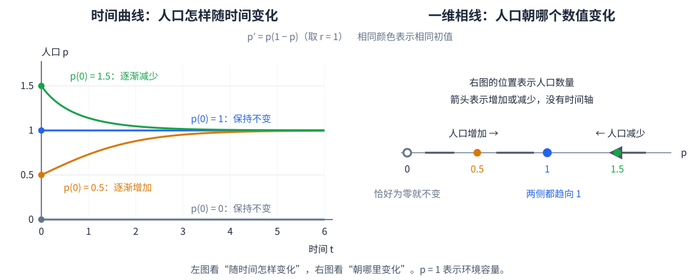
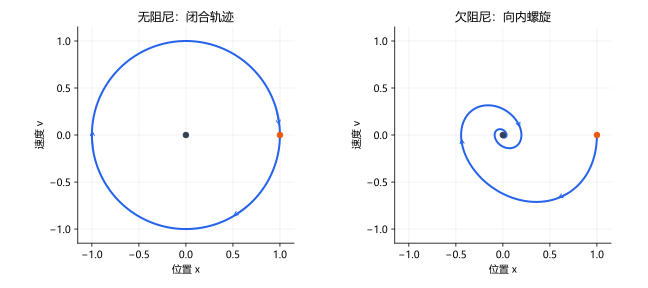
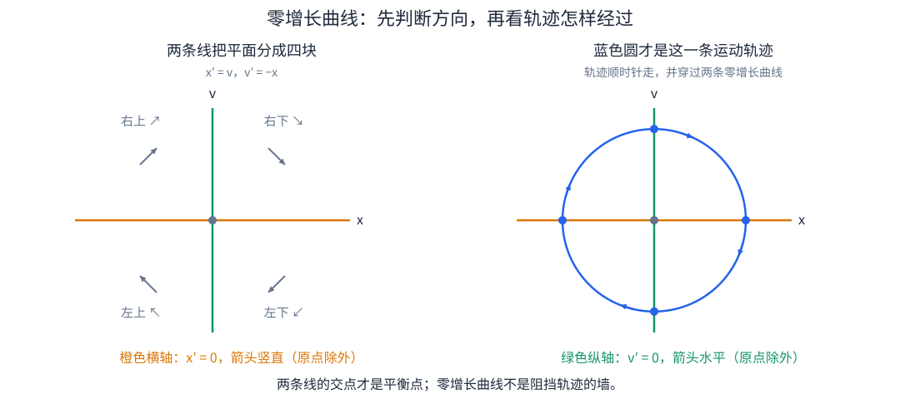
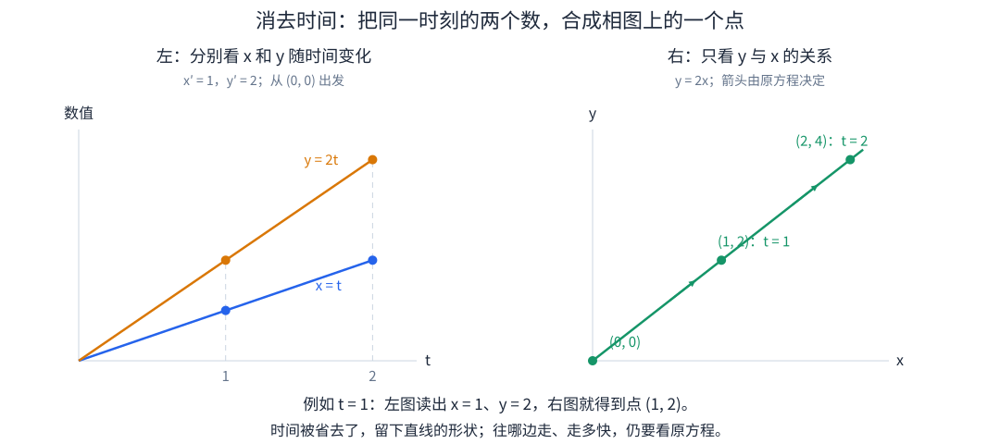
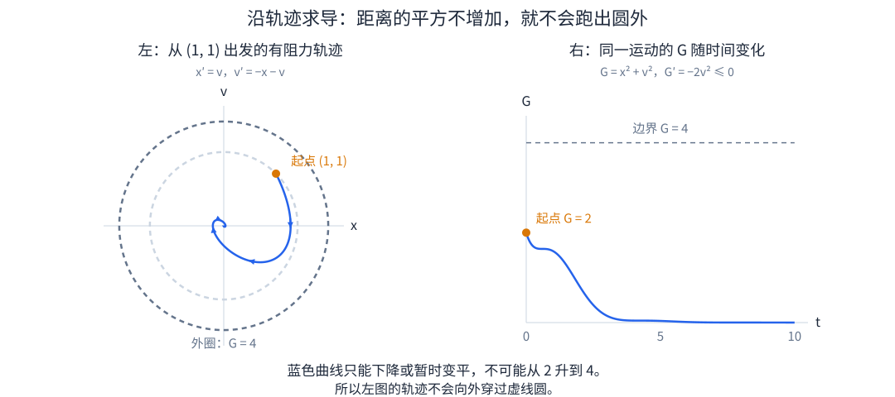
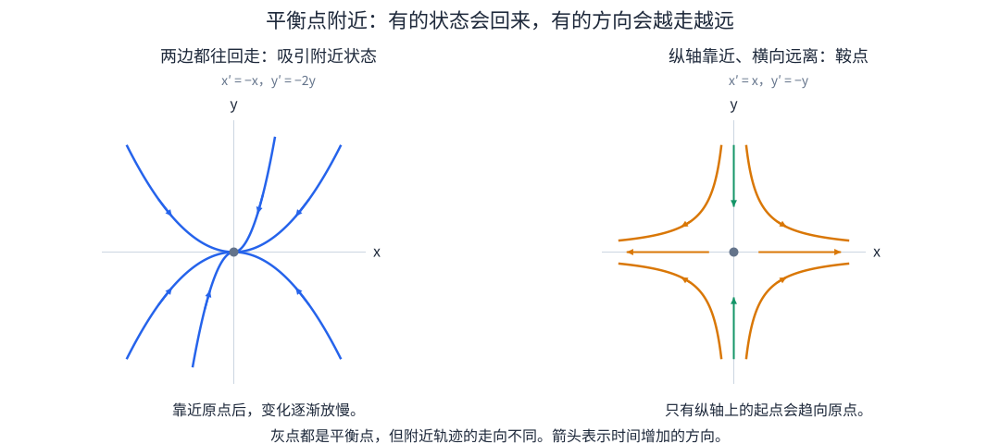
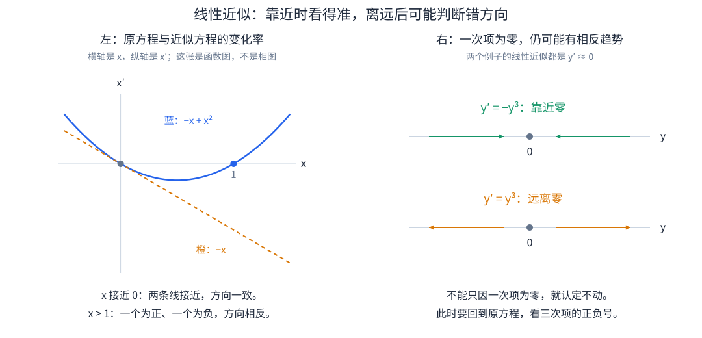

# 常微分方程（ODE）

## 一、常微分方程研究什么：从未知函数到状态轨迹

一个物体怎样冷却，一根弹簧怎样振动，一组相互影响的状态怎样随时间变化？这些问题有一个共同点：我们知道当前状态与变化率之间的关系，希望据此确定整个变化过程。常微分方程就是描述这种关系的数学语言。

例如 $y'=-ky$ 表示温差的变化率与当前温差成正比，$x''+\omega^2x=0$ 表示加速度与位移方向相反。方程规定变化规律，初始条件则说明从哪里开始。把两者结合起来，才可能确定一条具体的状态轨迹。

### 未知量：只依赖一个自变量的函数

**常微分方程（ODE）是含有未知函数及其关于一个自变量的常导数的方程。** 通常把一个 $n$ 阶标量 ODE 写成

$$
F(t,x(t),x'(t),\ldots,x^{(n)}(t))=0.
$$

这里的 $n$ 是方程中出现的最高导数阶数。例如 $x'+x=0$ 是一阶方程，$x''+x=0$ 是二阶方程。初值或边界条件是附加条件，不属于 ODE 本身的定义。后面常用的 $x'=f(t,x)$ 是显式一阶形式；能够解出最高阶导数的高阶方程，也可以通过引入新变量改写成一阶系统。

常微分方程的未知量可以是一个函数 $y(t)$，也可以是一组函数组成的状态向量 $\mathbf y(t)$。例如质点的位置和速度有多个分量，但都只依赖时间，仍然属于常微分方程的研究对象。

这个自变量也不一定是时间。研究一根杆沿长度方向的静态形状时，可以用位置 $x$ 作为自变量。关键是未知函数只依赖一个独立自变量，方程把它与普通导数联系起来。

### 先看一个 ODE 问题由什么组成

ODE 的未知量是只依赖一个自变量的函数，可以是一个数值，也可以是一组状态分量。要把一个具体的 ODE 问题说完整，需要说明：

- **未知函数**：例如温差 $y(t)$，或由位置和速度组成的状态 $(x(t),v(t))$。
- **方程**：函数与普通导数满足什么关系，例如 $y'=-ky$ 或 $x''+\omega^2x=0$。
- **定义区间**：在哪段时间或空间区间内求解。
- **给定条件**：在初始位置或区间端点规定函数值、导数值或它们的组合。

求解就是寻找一个在指定区间内满足方程和给定条件的函数。如果只给方程，也可以研究整个解族；加上条件后，才进一步筛选其中的解。

#### 什么是初始条件和边界条件

**初始条件**是在同一个自变量位置给出状态。例如对二阶方程，在 $t=t_0$ 给定

$$
y(t_0)=y_0,\qquad y'(t_0)=v_0.
$$

如果 $y$ 表示位置、$t$ 表示时间，这就是初始位置和初始速度。初始时刻 $t_0$ 不必等于零。

**边界条件**是在定义区间的端点规定约束。对于 $[0,L]$，边界是 $0$ 和 $L$，例如

$$
y(0)=y_0,\qquad y(L)=y_L.
$$

也可以规定端点的导数值，或把函数值与导数值组合起来。如果自变量表示杆上的位置，边界就是杆的两端；如果表示时间，边界就是这段时间的起点和终点。

单独的 $x'(t)=f(t,x(t))$ 只是 ODE，规定当前状态怎样变化。右边出现 $x(t)$，表示变化率可以依赖当前状态，并不表示这个状态已经知道。加上已知的 $x(t_0)=x_0$，才组成初值问题：

$$
\begin{cases}
x'(t)=f(t,x(t)), & \text{变化规律},\\
x(t_0)=x_0, & \text{初始状态}.
\end{cases}
$$

例如 $x'=x$ 的解族是 $x(t)=Ce^t$；加上 $x(0)=2$，就选出 $x(t)=2e^t$。

#### 边值问题与初值问题有什么不同

对于二阶方程，两端的函数值可能已经提供了足够的信息，不必再单独给一阶导数。

看 $[0,L]$ 上的 $y''=0$，其中 $L>0$。通解为 $y(t)=At+B$。给初值 $y(0)=y_0$、$y'(0)=v_0$，就得到 $B=y_0$、$A=v_0$；如果改成边值 $y(0)=y_0$、$y(L)=y_L$，则有

$$
B=y_0,\qquad AL+B=y_L,
$$

从而

$$
y(t)=y_0+\frac{y_L-y_0}{L}t,\qquad
y'(t)=\frac{y_L-y_0}{L}.
$$

导数虽然没有直接给出，却已经由方程和两端值共同确定。几何上，方程要求解是一条直线，指定直线经过的两个点，就同时确定了斜率。边界条件也可以直接给导数：

| 条件形式 | 例子 | 对 $y''=0$ 的结果 |
| --- | --- | --- |
| 两端给函数值（Dirichlet） | $y(0)=y_0$、$y(L)=y_L$ | 唯一确定连接两端的直线 |
| 两端给导数值（Neumann） | $y'(0)=v_0$、$y'(L)=v_L$ | 若 $v_0=v_L$，斜率确定但截距任意；若不相等，则无解 |
| 一端给函数值、另一端给导数值 | $y(0)=y_0$、$y'(L)=v_L$ | 唯一确定 $y(t)=y_0+v_Lt$ |

#### 初值和边值怎样确定通解中的常数

在已经得到通解的情况下，把初值或边值代入，就会得到关于待定常数的方程。只要约束相容、足以唯一确定所有常数，且解在要求的区间内有定义，就能从这个解族中选出一个具体的解。

对系数连续、最高阶系数处处不为零的 $n$ 阶线性 ODE，通解含有 $n$ 个任意常数，通常需要 $n$ 个独立的标量约束来确定它们。关键在于约束是否独立、是否相容，而不只是条数。非线性方程还可能有通解表达式未包含的特殊解，不能只靠数常数判断整个问题。

**条件多给也可以，但必须自洽。** 例如 $y''=0$ 的通解为 $y=At+B$。条件 $y(0)=0$、$y(1)=1$ 已确定 $y=t$；再给 $y'(0)=y'(1)=1$ 仍然相容，只是没有增加独立约束。如果额外要求 $y'(1)=2$，所有条件就无法同时满足。

边值问题不能直接套用初值问题的存在唯一性结论。例如

$$
y''+y=0,\qquad y(0)=0,\quad y(\pi)=0
$$

有无穷多个解 $y=C\sin t$；把末端条件改成 $y(\pi)=1$，则没有解。相比之下，同一个方程给定 $y(0)$ 和 $y'(0)$，总能确定唯一解。偏微分方程一篇的分离变量中的特征值问题，也会利用边界条件筛选非零解。

### 常微分方程的解是一条轨迹

要理解 ODE 的解，可以先想象我们在连续记录一个对象的状态。每到一个时刻 $t$，就记下它的位置、速度或温度。把这些记录连起来，就得到一个随时间变化的函数 $y(t)$。

把时间画在横轴、状态值画在纵轴，$y(t)$ 就是一条解曲线。这里的“轨迹”可以描述位置，也可以描述温差或浓度；若状态有多个分量，还可以把它画在状态空间里。

自变量也不一定是时间。例如一根杆的静态形状可以用挠度 $y(x)$ 表示，此时 $x$ 是沿杆的位置。它的解是一条以空间坐标为参数的曲线，不必理解成随时间运动的过程。判断 ODE 的依据仍是：未知函数只依赖一个独立自变量。

### 例子：冷却模型与时间曲线

设一个物体内部的温度近似均匀，环境温度固定。用 $y(t)$ 表示物体温度与环境温度的差。在一个简单的冷却模型中，温差越大，下降得越快：

$$
\frac{dy}{dt}=-k y,\qquad k>0.
$$

如果最初温差为 $y(0)=y_0>0$，它的解是

$$
y(t)=y_0e^{-kt}.
$$

在 $t=0$ 时温差是 $y_0$，在 $t=1/k$ 时变为 $y_0/e$，再往后逐渐接近零。

这个例子中的状态是一个数，称为**标量状态**。平衡解 $y(t)\equiv y_*$ 表示状态保持不变，在时间图上是一条水平线。


图中取 $k=1$。蓝线的初值是 $y(0)=1$，表示物体比环境热；橙线的初值是 $y(0)=0$，表示物体与环境同温。这个模型的平衡值必须满足 $-ky_*=0$，所以只有零温差对应平衡解，并不是任意水平线都是解。

这里我们把整个物体的温度当成一个数来跟踪。如果还要区分物体内部各个位置的温度，就要改用 $u(x,t)$：同一时刻，不同位置可以有不同温度。偏微分方程一篇中热方程的“场”，正是在这个地方比单个温度轨迹多了空间分布。

## 二、ODE 求解入门：方程分类与变量分离

求解 ODE，是寻找在指定区间内满足方程和给定条件的函数。本章先按阶数、线性结构、齐次与非齐次、系数和自变量的依赖关系辨认方程，再整理通解、初值与适用区间等求解要点，最后用变量分离法完成一个冷却模型的求解。下面通常用 $t$ 作自变量，$y'=dy/dt$。

### ODE 怎样分类

看清解的样子以后，再看方程的结构。一个 $n$ 阶标量 ODE 可以写成

$$
F(t,y,y',\ldots,y^{(n)})=0.
$$

一阶方程若已经把导数单独写成 $y'=f(t,y)$，称为显式形式；写成 $F(t,y,y')=0$ 而没有解出导数，则是隐式形式。隐式方程不一定能在所有点改写成单值的显式方程，使用相应初值理论前需要确认这一点。

#### 按阶数和未知量分类

最高出现几阶导数，方程就是几阶：冷却模型 $y'=-ky$ 是一阶，弹簧振动方程 $x''+\omega^2x=0$ 是二阶。令 $v=x'$，便可把振动方程改写为 $x'=v$、$v'=-\omega^2x$ 的一阶方程组。这说明“方程组有几个分量”与“方程是几阶”是两个不同的分类维度。

一般 $n$ 阶显式方程也可以把 $y,y',\ldots,y^{(n-1)}$ 作为状态，改写成一阶方程组。

#### 按线性结构分类

$n$ 阶线性 ODE 的一般形式是

$$
a_n(t)y^{(n)}+\cdots+a_1(t)y'+a_0(t)y=g(t),
\qquad a_n(t)\ne0.
$$

这里的非零条件针对正在讨论的区间。线性意味着未知函数及其导数以一次方出现、彼此不相乘，系数只依赖自变量。因此 $y'+t^2y=\sin t$ 仍是线性的；$y'=y^2$、$yy'+y=0$、$y''+\sin y=0$ 都是非线性的。

#### 按是否有外部项分类：齐次与非齐次

在线性方程中，把所有含未知函数及其导数的项放在左边，写成 $Ly=g(t)$。如果右边恒为零，就叫**齐次线性方程**，例如

$$
y''+2y'+y=0.
$$

如果右边不恒为零，就叫**非齐次线性方程**，例如

$$
y''+2y'+y=\sin t.
$$

这里 $\sin t$ 是不依赖未知函数的给定项，在受迫振动等模型中可以表示外部输入。判断时看的是它是否在整个讨论区间上恒为零；某几个时刻恰好取零，不会让方程变成齐次。

齐次线性方程具有叠加原理：若 $y_1,y_2$ 是解，$c_1y_1+c_2y_2$ 也是解。非齐次线性方程的解则具有“齐次通解加一个特解”的结构，第四章和第五章会分别用到这些性质。

#### 按系数是否变化分类：常系数与变系数

在线性方程中，乘在未知函数及其各阶导数前面的量叫系数。如果这些系数都是常数，就叫**常系数线性方程**，例如

$$
y''+2y'+y=0.
$$

这里 $y''$、$y'$、$y$ 的系数分别是 $1,2,1$，都不随 $t$ 变化。如果至少一个系数随自变量变化，就叫**变系数线性方程**，例如

$$
y''+t y'+y=0.
$$

这里 $y'$ 的系数是 $t$。在物理模型中，变系数可以表示阻尼等系统参数随时间或位置改变。

这一分类看的是左边的系数，不是右边的给定项。因此

$$
y''+2y'+y=\sin t
$$

虽然右边随时间变化，仍是常系数方程，同时也是非齐次方程。“齐次或非齐次”与“常系数或变系数”是两个独立的分类维度，可以组合使用。

#### 按是否显含自变量分类：自治与非自治

自治方程写成 $y'=f(y)$，右端不显含 $t$；非自治方程写成 $y'=f(t,y)$，右端显含 $t$。例如

$$
y'=y(1-y)
$$

是非线性自治方程，而 $y'=t y$ 是线性非自治方程。自治不意味着解不随时间变化，而是说“同样的状态在不同时刻服从同样的变化规律”。

对自治方程，满足 $f(y_*)=0$ 的状态给出平衡解 $y(t)\equiv y_*$。上面的例子有 $y=0$ 和 $y=1$ 两个平衡解；它们也提醒我们，求解时除以含 $y$ 的因子可能漏掉解。

#### 同一个方程可以同时贴上哪些标签

| 方程 | 分类 | 第三至五章可尝试的方法 |
| --- | --- | --- |
| $y'=t y$ | 一阶、标量、线性齐次、变系数、非自治 | 变量分离或积分因子 |
| $y'+2y=e^{-t}$ | 一阶、标量、线性非齐次、常系数、非自治 | 积分因子或常数变易 |
| $y''+2y'+5y=0$ | 二阶、标量、线性齐次、常系数；改写成一阶组后自治 | 特征方程 |
| $y'=y(1-y)$ | 一阶、标量、非线性、自治 | 先找平衡解，再变量分离 |

分类帮助我们读出方程可以利用的结构。给定前面介绍的初值或边值以后，还要判断解是否存在、是否唯一，以及数据误差会怎样影响解。

### 求解的基本流程：辨认结构、确定解与验证

#### 求解之前：辨认结构与适用区间

先看最高阶导数、未知函数出现的方式，以及系数是否随自变量变化，再选择可以利用的结构。可分离变量与线性并不互斥：$y'=-ky$ 同时属于两者，而 $y'=y^2$ 可以分离变量，却是非线性方程。

整理方程时要记录每一步的条件。除以某个含未知函数的因子，可能遗漏使这个因子为零的解；除以最高阶导数的系数，要求该系数不为零；取对数或换元，也要检查定义域。先说明在哪个区间工作，再判断所得表达式在那里是否成立。

#### 通解、特解与初值：公式怎样成为一个具体的解

积分产生的任意常数用来描述一族解；代入初值或边值，才进一步确定其中的成员。例如 $y'=y$ 给出 $y=Ce^t$，而 $y(0)=2$ 选出 $y=2e^t$。对于系数连续、最高阶系数不为零的 $n$ 阶线性方程，通解含 $n$ 个独立常数；非线性方程则还要留意公式是否遗漏特殊解。

“特解”在非齐次线性方程中通常指任意一个满足非齐次方程的解，它未必已经满足题目给定的初值。第五章会先找这样的一个特解，再加上齐次解来匹配初值。

积分后也不一定能把 $y$ 单独写出来。形如 $F(t,y)=C$ 的隐式关系，只要在所讨论区间能确定满足方程的可微函数，同样可以描述解。保留积分表达式也是一种精确表示，并不一定要化成初等函数。

#### 求出公式以后：检查方程、条件和存在区间

求解最后应做三件事：把函数及其导数代回原方程，检查初值或边值，再确认表达式在哪个区间有定义。满足方程并不自动意味着满足条件，一个公式也未必能延续到所有时间。

例如 $y'=y^2$、$y(0)=1$ 给出 $y=1/(1-t)$。代回可以验证方程和初值，但从 $t=0$ 出发的解在 $t=1$ 发散，其最大存在区间是 $(-\infty,1)$。虽然同一表达式在 $t>1$ 也有定义，那一段不能跨过奇点与原初值问题的解接在一起。

### 变量分离法：把两种变量各放一边

**历史背景。** 变量分离法形成于十七世纪末的早期微积分研究，Leibniz 和 Bernoulli 家族是主要推动者。Johann Bernoulli 在 1694 年与 Leibniz 的通信中明确讨论了分离变量的方法，因此这里把它看作早期微积分学家逐步发展的共同工具，而不归给唯一的发明者。

#### 物理模型：没有加热装置时的冷却

设物体内部温度近似均匀，温度为 $T(t)$，环境温度 $T_{\mathrm{env}}$ 恒定。令 $y(t)=T(t)-T_{\mathrm{env}}$ 为温差，$C_{\mathrm{th}}>0$ 为恒定热容。Newton 冷却定律把向环境散热的功率写成 $Ky$，其中 $K>0$ 是恒定的换热系数。没有加热装置时，内能的减少来自散热，因此

$$
\underbrace{C_{\mathrm{th}}y'}_{\text{内能变化率}}=-\underbrace{Ky}_{\text{散热功率}},
\qquad y'=-\frac{K}{C_{\mathrm{th}}}y.
$$

物体比环境热时，$y>0$，所以 $y'<0$；温差越大，降温越快。

#### 求解方法：分离变量后积分

一阶方程若能写成

$$
y'=g(t)h(y),
$$

就称为可分离变量的方程。它把变化率写成两个因子的乘积：$g(t)$ 表示随时间变化的影响，$h(y)$ 表示当前状态对变化速度的影响。

在 $h(y)\ne0$ 的区间上，把两种变量分别放到等式两边，再积分：

$$
\frac{dy}{h(y)}=g(t)\,dt,
\qquad
\int\frac{dy}{h(y)}=\int g(t)\,dt+C.
$$

除法前要先检查 $h(y)=0$ 对应的平衡解，以免遗漏。

#### 例子与结果：求温差随时间的变化

先记下平衡解 $y\equiv0$，它表示物体与环境温度相同。对 $y\ne0$，分离变量并积分：

$$
\frac{dy}{y}=-\frac{K}{C_{\mathrm{th}}}\,dt,
\qquad
\ln|y|=-\frac{K}{C_{\mathrm{th}}}t+C.
$$

取指数，把符号与积分常数合并为 $A$，得到

$$
y(t)=Ae^{-Kt/C_{\mathrm{th}}}.
$$

代入初始温差 $y(0)=y_0$，有 $A=y_0$，所以

$$
y(t)=y_0e^{-Kt/C_{\mathrm{th}}},
\qquad
T(t)=T_{\mathrm{env}}+y_0e^{-Kt/C_{\mathrm{th}}}.
$$

允许 $y_0=0$ 时，这个公式也包含先前保留的平衡解。解说明温差按指数衰减，物体温度逐渐接近环境温度；热容越大，变化越慢，换热系数越大，变化越快。记 $\tau=C_{\mathrm{th}}/K$ 为时间常数，经过 $\tau$ 时间，温差的大小降为原来的 $1/e$。

### 积分卡住怎么办：刘维尔定理与初等原函数

**刘维尔（Liouville）定理说明，初等原函数的形式受到一定的结构限制。** 这里的“初等函数”，指多项式、指数、对数、三角函数等，通过有限次运算组合出来的函数。直观地说，如果一个函数有初等原函数，这个原函数就必须能在定理规定的范围内，写成某个函数与有限个对数项的和。利用这种限制，可以证明有些积分无法用初等函数表示。

例如，$e^{t^2}$ 看起来很简单，却没有初等原函数；这个结论可以借助刘维尔定理证明。作为对比，$2t e^{t^2}$ 就容易积分：

$$
\int 2t e^{t^2}\,dt=e^{t^2}+C.
$$

多了一个 $2t$，恰好能用链式法则反过来求积分；少了它，就无法用初等函数写出答案。这里不展开证明，只需记住：**积分卡住，有时是因为不存在初等形式的答案。** 这不代表原函数不存在，仍然可以保留积分表达式，或用数值方法计算。

### 先辨认类型，再选择解法

本章先建立分类思路：阶数说明涉及多少阶导数，线性、齐次性、系数是否变化等信息帮助选择解法；同一个方程可以同时具有多种分类特征。接着区分通解与条件选出的具体解，并把验证方程、条件和存在区间作为求解的一部分。

变量分离法利用 $y'=g(t)h(y)$ 的乘积结构，把两个变量分开后积分。求解时先保留 $h(y)=0$ 对应的平衡解，再处理可以相除的区间；最后用条件确定常数，并代回检查。这套“辨认结构、记录条件、求解、验证”的流程，也适用于后面的线性方程。

## 三、线性齐次方程

这一章从两个具体问题出发：没有加热时，温差为什么按指数衰减；没有外部驱动力时，弹簧为什么会出现过阻尼、临界阻尼或振荡。我们先根据物理规律写出方程，说明想解释的现象，再学习相应的求解方法。

这里的“齐次”表示状态相关的项整理到左边后，右边没有独立给定的外源。它并不表示没有热量交换或没有力：散热、弹簧回复力和阻尼力仍然包含在方程中。物理参数决定可能出现的运动模式，初值再从这些模式中选出一条具体轨迹。

### 一阶线性齐次方程：从冷却模型到自然衰减

**先看要解决的问题：没有加热装置时，物体怎样接近环境温度？** 温差越大，单位时间散失的热量越多；热容越大，同样的热量损失引起的温度变化越小。因此，我们希望从热量收支推导温差曲线，并看出热容和换热系数怎样控制冷却速度。

上一章得到无加热时的能量收支 $C_{\mathrm{th}}y'=-Ky$，其中 $y=T-T_{\mathrm{env}}$，$C_{\mathrm{th}}>0$ 是热容，$K>0$ 是换热系数。把它写成 $y'+ay=0$，其中 $a=K/C_{\mathrm{th}}$，就能看清：物理参数决定衰减速度，初始温差决定具体轨迹。

推广到连续系数 $p(t)$，一阶齐次线性方程为

$$
y'+p(t)y=0.
$$

先保留零解；对非零解分离变量后积分。记 $P(t)=\int_{t_0}^t p(s)\,ds$，得到

$$
y(t)=Ce^{-P(t)},\qquad y(t_0)=y_0\ \Longrightarrow\ C=y_0.
$$

这个公式也包含 $C=0$ 的零解。常系数冷却模型中，它变成 $y(t)=y_0e^{-a(t-t_0)}$。若 $p(t)$ 变化，指数记录的是整段时间累积的衰减作用；若 $p$ 为负，则可能表现为增长，不能把所有齐次方程都理解成衰减模型。

接下来把一个温差状态换成弹簧的位置和速度：模型从一阶变为二阶，除了衰减，还会出现振荡。我们通过质量、阻尼和刚度理解不同解的形式。

### 二阶常系数齐次线性方程：基本概念与判别式分类

这类方程写成

$$
ay''+by'+cy=0,\qquad a\ne0.
$$

“二阶”指最高导数是 $y''$；“常系数”指 $a,b,c$ 是实常数；“线性齐次”指未知函数及其导数都只以一次线性项出现，右端没有独立给定的外源项。

为了回答弹簧会不会振荡、回到平衡位置有多快，可以试用指数函数 $y=e^{rt}$，把微分方程转成关于 $r$ 的**特征方程**：

$$
ar^2+br+c=0.
$$

再计算判别式 $\Delta=b^2-4ac$，就能把问题分为三类：

| 判别式 | 特征根类型 | 解的主要形式 | 对应的弹簧情形 |
| --- | --- | --- | --- |
| $\Delta>0$ | 两个不同实根 | 两个指数函数的组合，也可写成双曲函数形式 | 过阻尼 |
| $\Delta=0$ | 重根 | 指数函数乘一次多项式 | 临界阻尼 |
| $\Delta<0$ | 共轭复根 | 指数函数乘三角函数 | 无阻尼或欠阻尼 |

表中的弹簧对应关系以质量、刚度为正且阻尼非负为前提。**判别式决定根的类型和通解形式；初值再确定通解中的两个常数。** 解的增长或衰减还取决于根的实部。

十八世纪 Euler 等人的工作建立了这类微分方程与代数方程之间的联系。下面三节都先提出弹簧的具体运动问题，再用特征方程解释和求出这种运动。

### 二阶常系数齐次方程：不同实根与过阻尼

#### 先看物理问题：阻尼很大时，弹簧怎样回到平衡位置

考虑一个质量—弹簧—阻尼系统，令 $y(t)$ 表示相对平衡位置的位移。回复力为 $-ky$，阻尼力为 $-\gamma y'$，其中 $m>0$ 是质量，$k>0$ 是弹簧刚度，$\gamma\ge0$ 是阻尼系数。没有外部驱动力时，Newton 第二定律给出

$$
my''=-\gamma y'-ky,
$$

也就是

$$
my''+\gamma y'+ky=0.
$$

这里仍有弹簧力和阻尼力；“齐次”只表示没有独立的外部驱动力。把滑块拉开再释放，初始状态就会引起自由运动。

临界阻尼系数为 $\gamma_c=2\sqrt{mk}$。当 $\gamma>\gamma_c$ 时，阻尼很强，系统不会持续往复振荡，这称为**过阻尼**。我们要解决的问题是：怎样从方程看出它由两个衰减模式组成，又怎样用初始位置和速度确定实际轨迹？

为方便计算，记

$$
\delta=\frac{\gamma}{2m},\qquad \omega_0=\sqrt{\frac{k}{m}},
\qquad \Delta=\gamma^2-4mk=4m^2(\delta^2-\omega_0^2),
$$

并给定初值 $y(0)=y_0$、$y'(0)=v_0$。过阻尼条件等价于 $\Delta>0$ 或 $\delta>\omega_0$。

#### 再求解：特征方程从哪里来

设 $y=e^{rt}$，则 $y'=re^{rt}$、$y''=r^2e^{rt}$。代入原方程：

$$
(ar^2+br+c)e^{rt}=0.
$$

因为 $e^{rt}\ne0$，两边除以它，得到特征方程：

$$
ar^2+br+c=0.
$$

#### 不同实根给出两个指数模式

两个不同实根对应两个独立的指数解，通解为 $y=C_1e^{r_1t}+C_2e^{r_2t}$。令 $\alpha=-b/(2a)$、$\mu=\sqrt{\Delta}/(2|a|)>0$，把两个根写成

$$
r_1=\alpha+\mu,
\qquad
r_2=\alpha-\mu,
$$

把 $e^{\alpha t}$ 提出来，就能把通解改写成双曲函数形式：

$$
y=C_1e^{(\alpha+\mu)t}+C_2e^{(\alpha-\mu)t}
=e^{\alpha t}\bigl(A\cosh\mu t+B\sinh\mu t\bigr),
$$

其中 $A=C_1+C_2$、$B=C_1-C_2$。

这是因为双曲函数本来就是两个指数函数的组合：

$$
\cosh z=\frac{e^z+e^{-z}}{2},
\qquad
\sinh z=\frac{e^z-e^{-z}}{2}.
$$

所以“双曲函数形式”不是新的解法，而是指数解的另一种写法。偏微分方程一篇求解 Laplace 方程时，某个方向上出现 $\sinh$、$\cosh$，本质上也来自这种实指数解。

#### 把结果解释回过阻尼弹簧

过阻尼没有持续往复振荡，但某些初始速度仍可能使质点越过平衡位置；是否越过要由初值决定。

当 $\delta>\omega_0$ 时，令 $\mu=\sqrt{\delta^2-\omega_0^2}$，两个特征根为 $-\delta\pm\mu$。通解可以写成

$$
y=Ae^{(-\delta+\mu)t}+Be^{(-\delta-\mu)t}
=e^{-\delta t}\bigl(C_1\cosh\mu t+C_2\sinh\mu t\bigr).
$$

对双曲函数形式求导并代入 $t=0$，得到 $C_1=y_0$、$-\delta C_1+\mu C_2=v_0$，因此

$$
y(t)=e^{-\delta t}\left[y_0\cosh(\mu t)
+\frac{v_0+\delta y_0}{\mu}\sinh(\mu t)\right].
$$

虽然式中出现了增长的双曲函数，但它们外面还有衰减因子。因为 $0<\mu<\delta$，两个指数 $-\delta\pm\mu$ 都为负，所以解仍趋于零，不会持续往复振荡。不能只看到 $\cosh$、$\sinh$ 就判断位移增长。

例如，无量纲方程 $y''+3y'+2y=0$ 的特征根为 $-1,-2$。从 $y(0)=1$、$y'(0)=0$ 释放，由 $A+B=1$、$-A-2B=0$ 得到 $A=2$、$B=-1$，所以

$$
y(t)=2e^{-t}-e^{-2t}
=e^{-3t/2}\left(\cosh\frac t2+3\sinh\frac t2\right).
$$

对 $t>0$，$y'=-2e^{-t}+2e^{-2t}<0$：滑块从初始位置逐渐回到平衡位置。这就是以双曲函数表示的弹簧滑块运动。

### 二阶常系数齐次方程：重根与临界阻尼

#### 先看物理问题：怎样最快回到平衡位置而不持续振荡

继续使用方程 $my''+\gamma y'+ky=0$。阻尼太小，滑块会反复越过平衡位置；阻尼太大，滑块虽然不振荡，却会缓慢返回。两者之间的分界是

$$
\gamma=\gamma_c=2\sqrt{mk},
$$

称为**临界阻尼**。它常被理解为“不产生持续振荡的前提下尽快回到平衡位置”的理想状态。此时判别式 $\Delta=\gamma^2-4mk$ 恰好为零。我们要解释的是：为什么这时两个特征根合并，以及第二个独立解为什么多出因子 $t$。

#### 再求解：重根为什么带来 $te^{rt}$

此时只有一个重根 $r=-b/(2a)$，方程除以 $a$ 后可以写成

$$
y''-2ry'+r^2y=0.
$$

一个解是 $e^{rt}$，但两个相同的指数无法提供两个独立的解。令 $y=u(t)e^{rt}$，则

$$
y'=(u'+ru)e^{rt},\qquad
y''=(u''+2ru'+r^2u)e^{rt}.
$$

代入后含 $u'$ 和 $u$ 的项抵消，只剩 $u''e^{rt}=0$。因此 $u''=0$，积分两次得到 $u=C_1+C_2t$，通解为

$$
y=(C_1+C_2t)e^{rt}.
$$

#### 把结果解释回临界阻尼弹簧

当 $\delta=\omega_0$ 时，特征根为重根 $-\delta$，通解为 $y=(C_1+C_2t)e^{-\delta t}$。由 $y(0)=C_1=y_0$、$y'(0)=C_2-\delta C_1=v_0$，得到

$$
y(t)=\bigl[y_0+(v_0+\delta y_0)t\bigr]e^{-\delta t}.
$$

此时没有周期性的往复振荡，位移最终趋于零。

例如 $y''+2y'+y=0$，判别式 $\Delta=0$，重根为 $-1$。若 $y(0)=1$、$y'(0)=0$，则 $C_1=1$、$C_2-C_1=0$，得到 $y=(1+t)e^{-t}$。对 $t>0$，$y'=-te^{-t}<0$，位移逐渐回到零。

### 二阶常系数齐次方程：共轭复根与振荡

#### 先看物理问题：为什么弹簧会来回振动，振幅又为什么减小

仍看 $my''+\gamma y'+ky=0$。把滑块向右拉开后释放，弹簧先把它拉向平衡位置；滑块到达平衡位置时仍有速度，于是继续越过平衡位置。到了另一侧，回复力反向，滑块再次返回，因此产生往复振动。

若 $\gamma=0$，没有阻尼耗能，理想模型中的振幅保持不变；若

$$
0<\gamma<\gamma_c,
$$

阻尼会消耗能量，但还不足以消除往复运动，这称为**欠阻尼**。我们要从解中同时看见两个部分：三角函数表示振荡，外面的指数因子表示振幅怎样变化。此时 $\Delta<0$，特征根是一对共轭复数。

#### 再求解：共轭复根怎样产生三角函数

令 $\alpha=-b/(2a)$、$\beta=\sqrt{-\Delta}/(2|a|)>0$，两个根为 $\alpha\pm i\beta$。由 Euler 公式

$$
e^{(\alpha\pm i\beta)t}=e^{\alpha t}\bigl(\cos\beta t\pm i\sin\beta t\bigr),
$$

可取两个实解 $e^{\alpha t}\cos\beta t$、$e^{\alpha t}\sin\beta t$，所以实通解为

$$
y=e^{\alpha t}(C_1\cos\beta t+C_2\sin\beta t).
$$

其中 $\beta$ 决定振荡角频率，$\alpha$ 决定振幅的包络增长、衰减还是保持不变。

#### 把结果解释回无阻尼与欠阻尼弹簧

**什么叫欠阻尼？** 阻尼力 $-\gamma y'$ 始终与速度方向相反，起到消耗运动能量的作用。“欠”是相对于消除往复振荡所需的临界阻尼而言：**阻力已经使振幅减小，但还不足以让运动失去振荡性质。** 所以欠阻尼不是没有阻力，而是“有阻力，仍然会来回摆动”。

当 $0\le\delta<\omega_0$ 时，令 $\omega_d=\sqrt{\omega_0^2-\delta^2}$，特征根为 $-\delta\pm i\omega_d$，通解为

$$
y=e^{-\delta t}\bigl(C_1\cos\omega_dt+C_2\sin\omega_dt\bigr).
$$

代入初值，有 $C_1=y_0$、$-\delta C_1+\omega_dC_2=v_0$，所以

$$
y(t)=e^{-\delta t}\left[y_0\cos(\omega_dt)
+\frac{v_0+\delta y_0}{\omega_d}\sin(\omega_dt)\right].
$$

当 $\delta=0$ 时，滑块持续振荡，振幅不变；当 $0<\delta<\omega_0$ 时，仍然往复振荡，但振幅的包络按 $e^{-\delta t}$ 衰减。

例如，取无量纲的质量、阻尼和刚度分别为 $1,2,5$。Newton 第二定律是 $y''=-2y'-5y$，整理后得到一个有阻尼的自由振动方程：

$$
y''+2y'+5y=0.
$$

判别式 $\Delta=2^2-4\cdot1\cdot5=-16<0$，特征方程是：

$$
r^2+2r+5=0,
$$

所以：

$$
r=-1\pm 2i.
$$

通解为：

$$
y=e^{-t}(C_1\cos 2t+C_2\sin 2t).
$$

这个解表示角频率为 $2$ 的往复振动，振幅的包络按 $e^{-t}$ 衰减。例如从 $y(0)=1$、$y'(0)=0$ 释放，有 $C_1=1$、$C_2=1/2$，因此

$$
y(t)=e^{-t}\left(\cos 2t+\frac12\sin 2t\right).
$$

质点会反复越过平衡位置，但每次摆动的幅度越来越小。

三种情况都先由判别式确定函数形式，再由初值确定系数。判别式只区分根的类型；运动最终增长还是衰减，还要看根的实部。例如过阻尼弹簧虽然使用双曲函数表示，但两个特征根都为负，位移最终仍趋于零。

### 线性方程的关键性质：叠加原理

线性方程之所以容易组织和求解，一个关键原因是**微分运算保留线性组合**。为简化书写，把方程左边“求导、乘系数、再相加”的整套运算记为 $L$：

$$
L[y]=y''+p(t)y'+q(t)y
$$

这里 $L$ 叫作**微分算子**，方括号里的 $y$ 是放进去运算的函数，$L[y]$ 不是 $L$ 乘以 $y$。例如取 $L[y]=y''+y$，把函数 $y=t^2$ 放进去，就得到

$$
L[t^2]=(t^2)''+t^2=2+t^2.
$$

因此，后面写的 $L[y_1]=r_1(t)$，只是把

$$
y_1''+p(t)y_1'+q(t)y_1=r_1(t)
$$

简写成算子形式：函数 $y_1$ 经过这套运算，结果是 $r_1(t)$。

对任意常数 $c_1,c_2$，线性性质意味着

$$
L[c_1y_1+c_2y_2]=c_1L[y_1]+c_2L[y_2].
$$

因此，如果 $y_1,y_2$ 都满足齐次方程 $L[y]=0$，那么

$$
L[c_1y_1+c_2y_2]=c_1\cdot0+c_2\cdot0=0.
$$

也就是说，**齐次线性方程的解可以乘以常数、相加，仍然是同一方程的解**。例如自由振动方程 $y''+\omega^2y=0$ 的两个解是 $\cos\omega t$ 和 $\sin\omega t$，把它们组合成

$$
y=C_1\cos\omega t+C_2\sin\omega t
$$

就能通过选择 $C_1,C_2$ 来匹配初始位移和速度。叠加后是否满足指定的初值或边值，还需要另外检查。

### 参数决定模式，初值决定组合

一阶冷却模型给出指数衰减；二阶弹簧模型把质量、阻尼和刚度写进特征方程，产生过阻尼、临界阻尼或欠阻尼等不同运动。齐次解的基本模式由方程决定，初始状态决定各模式的系数。线性叠加让这些模式可以组合成满足初值的解。

下一章保持这些模型的散热、回复力和阻尼项，再加入供热或驱动力，观察方程与求解方法怎样改变。

## 四、线性非齐次方程：外部驱动与常数变易法

第五章与第四章逐一对应。第四章先研究没有外部输入时的自然冷却和自由振动；本章在左边保留相同的散热、回复力和阻尼项，只在右边加入一个**非齐次项**：供热功率或外部驱动力。这样可以直接看出，系统自身怎样演化，外界又怎样改变它。

| 物理模型 | 没有额外输入：齐次方程 | 加入输入：非齐次方程 |
| --- | --- | --- |
| 温差 $y=T-T_{\mathrm{env}}$ | $C_{\mathrm{th}}y'+Ky=0$ | $C_{\mathrm{th}}y'+Ky=Q(t)$，加入供热功率 |
| 弹簧位移 $y$ | $my''+\gamma y'+ky=0$ | $my''+\gamma y'+ky=F(t)$，加入驱动力 |

非零常数输入也会产生非齐次方程；判断依据是源项是否恒为零。改变热容、阻尼或刚度，会改变左边的系数，却不一定使方程变成非齐次。

本章先把两个物理模型对应起来，再讨论解法：一阶方程用常数变易法或积分因子法，二阶方程先理解“齐次通解加一个特解”，再用两个系数的常数变易法寻找特解。柯西–欧拉方程作为变系数方程的补充。

### 一阶模型：从自然冷却到外部供热

第四章的自然冷却方程是

$$
C_{\mathrm{th}}y'+Ky=0.
$$

右边为零，表示没有加热装置。现在的问题是：**物体一边向环境散热，一边接受随时间变化的供热，温差会怎样变化？**

在第四章的冷却模型中加入加热装置，仍用 $y$ 表示温差、$C_{\mathrm{th}}$ 表示热容、$K$ 表示换热系数。若加热功率为 $Q(t)$，内能变化率就等于输入功率减去散热功率：

$$
\underbrace{C_{\mathrm{th}}y'}_{\text{内能变化率}}
=\underbrace{Q(t)}_{\text{加热功率}}
-\underbrace{Ky}_{\text{向环境散热的功率}}.
$$

两边除以热容，得到

$$
y'+\frac{K}{C_{\mathrm{th}}}y=\frac{Q(t)}{C_{\mathrm{th}}}.
$$

其中 $K/C_{\mathrm{th}}$ 表示温差衰减的快慢，$Q(t)/C_{\mathrm{th}}$ 表示加热带来的升温速率。温差为负时，$-Ky$ 为正，表示环境向物体供热。这种“变化率＝输入－损失”的结构，也出现在电路和物质收支模型中。

这里的 $Q(t)$ 就是**外源**：由外部给定的加热输入，可以随时间增强、减弱或周期变化。当 $Q(t)\equiv0$ 时，方程是齐次的；当它不恒为零时，方程是非齐次的。恒定的非零加热功率也属于外源，所以非齐次并不要求外源一定随时间改变。

### 二阶模型：从自由振动到外力驱动

第四章的弹簧方程是

$$
my''+\gamma y'+ky=0.
$$

它描述没有外部驱动力时，由初始位移和速度引起的自由振动。现在再施加一个随时间给定的外力 $F(t)$。Newton 第二定律变为

$$
my''=-\gamma y'-ky+F(t),
$$

整理后得到

$$
my''+\gamma y'+ky=F(t).
$$

这就是**受迫振动**。左边仍描述质量、阻尼和弹簧刚度决定的自身规律，右边的 $F(t)$ 描述外界怎样推动系统。例如 $F(t)=F_0\cos(\Omega t)$ 表示周期性推拉。即使初始位移和速度都为零，只要 $F(t)$ 不为零，外力也能使系统运动。

与供热模型中的 $Q(t)$ 一样，$F(t)$ 是外部给定的源项。两边除以质量后，

$$
y''+\frac{\gamma}{m}y'+\frac{k}{m}y=\frac{F(t)}m.
$$

因此，一阶和二阶模型具有同一个结构：**左边保留齐次系统自身的规律，右边加入外部输入。** 接下来再研究怎样求解这些方程。

### 一阶非齐次线性方程怎样解：常数变易法

#### 让齐次解中的常数随时间变化

**历史背景。** 一阶情形的思路可以追溯到 Johann Bernoulli 在 1697 年处理 Bernoulli 方程的方法：应用于一阶线性方程时，它与常数变易法密切对应。后来高阶方程和天体力学中的常数变易法又得到 Euler、Lagrange 的发展，所以不能把这里的一阶技巧与后来的全部推广都归给同一个人。

考虑供热模型对应的一般一阶非齐次线性方程

$$
y'+p(t)y=q(t),
$$

还可以从对应的齐次解出发。先解

$$
y'+p(t)y=0,
$$

得到 $y_h=Ce^{-P(t)}$。下标 $h$ 来自 homogeneous（齐次），只是表示“齐次方程的解”。这里记 $P(t)=\int_{t_0}^t p(s)\,ds$，所以 $P'(t)=p(t)$。非齐次项 $q(t)$ 出现以后，试着让这个常数随时间变化：

$$
y(t)=C(t)e^{-P(t)}.
$$

先用乘积求导和链式法则计算导数：

$$
\begin{aligned}
y'(t)
&=C'(t)e^{-P(t)}+C(t)\bigl(e^{-P(t)}\bigr)'\\
&=C'(t)e^{-P(t)}-C(t)P'(t)e^{-P(t)}\\
&=C'(t)e^{-P(t)}-p(t)C(t)e^{-P(t)}.
\end{aligned}
$$

把 $y$ 和 $y'$ 一起代回原方程 $y'+p(t)y=q(t)$：

$$
\underbrace{C'(t)e^{-P(t)}-p(t)C(t)e^{-P(t)}}_{y'(t)}
+\underbrace{p(t)C(t)e^{-P(t)}}_{p(t)y(t)}
=q(t).
$$

其中 $-p(t)C(t)e^{-P(t)}$ 与 $+p(t)C(t)e^{-P(t)}$ 大小相同、符号相反，抵消后得到

$$
C'(t)e^{-P(t)}=q(t),
\qquad C'(t)=e^{P(t)}q(t).
$$

于是

$$
C(t)=C_0+\int_{t_0}^t e^{P(s)}q(s)\,ds,
$$

再乘回 $e^{-P(t)}$，就得到非齐次方程的解。常数变易法保留齐次解的基本形式，让原先固定的系数随输入变化；这一思路还可以推广到二阶方程。后面会用积分因子法推导同一个公式，比较两种方法的关系。

**这个公式怎样解释输入的作用。** 把初值 $y(t_0)=y_0$ 代入并展开，可以写成

$$
y(t)=\underbrace{e^{-\int_{t_0}^t p(\tau)\,d\tau}y_0}_{\text{初始状态留下的贡献}}
+\underbrace{\int_{t_0}^t e^{-\int_s^t p(\tau)\,d\tau}q(s)\,ds}_{\text{各时刻输入累积留下的贡献}}.
$$

对于上面的供热模型，时刻 $s$ 输入的热量会使温度升高，但它的影响在随后散热的过程中逐渐减弱。积分就是把每一小段时间的输入，按它到当前时刻还剩多少影响，逐一加起来。常数变易法因此把“自由衰减的规律”和“外部输入的累积”合在同一个解中。

以无量纲供热模型 $y'+2y=e^{-t}$ 为例：齐次解是 $Ce^{-2t}$，令 $y=C(t)e^{-2t}$，就有 $C'=e^t$，因此 $C(t)=e^t+C_0$，得到 $y=e^{-t}+C_0e^{-2t}$。

### 与常数变易法对照：积分因子法

**历史背景。** Leibniz 在 1694 年已经给出与今天积分因子法相对应的一阶线性方程解法；Euler 在 1763 年又从恰当微分方程的角度系统地寻找积分因子。因此，这里“选择一个因子，把左边凑成完整导数”的思路，有 Leibniz 的早期解法和 Euler 的后续发展。

#### 求解方法：积分因子把两项合成乘积导数

设 $p,q$ 在讨论区间上连续，考虑一阶线性方程

$$
y'+p(t)y=q(t).
$$

在本章的供热模型中，$p(t)=K/C_{\mathrm{th}}$、$q(t)=Q(t)/C_{\mathrm{th}}$。

这里希望把左边整理成一个完整的导数，这样就能直接积分。依据是乘积求导法则：

$$
(\mu y)'=\mu y'+\mu' y.
$$

#### 先看要凑出什么，再决定乘什么

假设给原方程两边乘上一个待定的非零函数 $\mu(t)$：

$$
\mu y'+\mu p y=\mu q.
$$

把左边与乘积导数比较：第一项都是 $\mu y'$，第二项要相同，就需要

$$
\mu' y=\mu p y.
$$

为了让这个匹配不依赖未知的 $y$，我们直接要求系数满足

$$
\mu'=p(t)\mu.
$$

这就是积分因子应当满足的方程。取正的 $\mu$，分离变量并积分：

$$
\frac{\mu'}{\mu}=p(t),\qquad
\ln\mu(t)-\ln\mu(t_0)=\int_{t_0}^t p(s)\,ds.
$$

积分因子乘上一个非零常数也不影响作用，所以可以选 $\mu(t_0)=1$。记

$$
P(t)=\int_{t_0}^t p(s)\,ds,
\qquad \mu(t)=e^{P(t)}.
$$

这个指数形式是由“凑成乘积导数”的要求推出来的。

#### 凑成乘积导数以后，直接积分

有了 $\mu'=p\mu$，原方程乘以 $\mu$ 后就变成

$$
\mu y'+\mu p y
=\mu y'+\mu' y
=(\mu y)'=\mu q.
$$

从 $t_0$ 积分到 $t$，得到

$$
\mu(t)y(t)-\mu(t_0)y(t_0)
=\int_{t_0}^t\mu(s)q(s)\,ds.
$$

代入 $\mu(t_0)=1$、$y(t_0)=y_0$，再除以非零的 $\mu(t)$：

$$
y(t)=e^{-P(t)}\left[y_0+\int_{t_0}^t e^{P(s)}q(s)\,ds\right].
$$

#### 它与分部积分有什么关系

两者都来自乘积求导法则，但整理的方向不同。把 $(\mu y)'=\mu y'+\mu'y$ 积分并移项，就得到分部积分公式

$$
\int\mu y'\,dt=\mu y-\int\mu'y\,dt.
$$

积分因子法则是主动选择 $\mu$，让方程左边的两项合成 $(\mu y)'$，然后直接积分。它的关键步骤是寻找这个乘积结构，而不是把一个积分换成另一个积分。

#### 例子与结果：加热逐渐减弱时的温差

把供热模型的时间和温差选取适当的单位并无量纲化，取衰减系数为 $2$、加热项为 $e^{-t}$，就得到

$$
y'+2y=e^{-t}.
$$

这里 $y$ 是无量纲温差，$2y$ 表示向环境散热的作用，$e^{-t}$ 表示逐渐减弱的加热输入。即使加热仍在继续，只要散热超过输入，温度也会下降。

现在求解。这里 $p(t)=2$，取 $t_0=0$，便有 $P(t)=2t$、$\mu(t)=e^{2t}$。两边乘以积分因子：

$$
e^{2t}y'+2e^{2t}y=e^t.
$$

因为 $(e^{2t})'=2e^{2t}$，左边正好是 $(e^{2t}y)'$，因此

$$
(e^{2t}y)'=e^t,
\qquad e^{2t}y=e^t+C,
\qquad y=e^{-t}+Ce^{-2t}.
$$

若再给 $y(0)=3$，则 $C=2$。直接求导可检查 $y'+2y=e^{-t}$，而两个指数在 $t=0$ 的值之和确实为 $3$。在这个供热模型中，$y(t)=e^{-t}+2e^{-2t}$ 始终下降，并趋于零：加热逐渐停止以后，物体最终回到环境温度。

### 二阶非齐次线性方程怎样解：齐次解加一个特解

**历史背景。** 二阶非齐次线性方程随着对受外力作用的运动、振动和天体摄动的研究逐步发展，并非由一个人一次提出。十八世纪，Euler 研究了非齐次线性方程的求解；Euler 与 Lagrange 等人发展的常数变易思想，则提供了从已知齐次解出发处理附加作用的途径。

#### 解的结构：齐次通解加一个特解

考虑带外力的方程

$$
y''+p(t)y'+q(t)y=r(t).
$$

求它的解，可以分成两件事：

- **先把右边改成零，求齐次通解 $y_h$。** 在弹簧模型中，它描述没有外力驱动时可能出现的自由运动，里面带着两个待定常数。
- **再找一个满足原方程的函数 $y_p$。** 找到一个就够了，它叫特解，可以看作外力作用下的一种运动，暂时不要求它满足题目给出的初值。

把两部分加起来，就是原方程的通解：

$$
\boxed{y=y_h+y_p}.
$$

**为什么可以相加？** 因为方程是线性的。代入 $y_h$ 时，左边算出来是 $0$；代入 $y_p$ 时，左边算出来是 $r(t)$。把它们相加后，左边也相加，结果仍是 $0+r(t)=r(t)$。反过来，原方程的任意解减去这个特解后，右边变成零，剩下的就属于齐次解。

**初值怎么办？** 用 $y_h$ 里的两个常数来调整。例如 $y_h=C_1y_1+C_2y_2$，就先写

$$
y=C_1y_1+C_2y_2+y_p,
$$

再代入给定的初始位置、初始速度，确定 $C_1,C_2$。也就是说，特解先提供一种符合外力要求的运动，齐次部分再把它调整到指定的初始状态。下标 $h$ 来自 homogeneous（齐次），$p$ 来自 particular（特解）。

接下来要解决的是“怎样找到这个特解”。一种常用办法是**待定系数法**：当方程为常系数、右端是多项式、指数、正弦余弦等适合的形式时，可以按相应形式设特解，再代入确定系数；与齐次解重复时，要乘以适当的 $t$ 的幂来调整。这里不展开计算，下面介绍适用范围更广的常数变易法。

#### 求特解：常数变易法

**历史背景。** 高阶常数变易法通常与 Euler 和 Lagrange 联系在一起。它的重要来源是轨道摄动问题：先知道未受扰动的运动，再让解中的常数随时间变化，以描述额外作用。

常数变易法适用范围更广，但**能写出积分表达式，不等于能得到初等函数形式的解**。它把求特解转化为积分，而初等函数的原函数未必还是初等函数。例如对 $y''+y=1/t$（$t>0$），取齐次解 $\cos t$、$\sin t$ 后，求特解会涉及 $\int(\sin t/t)\,dt$ 和 $\int(\cos t/t)\,dt$，这两个积分都不能用初等函数表示。此时可以保留积分，使用后面介绍的特殊函数，或进行数值计算；方程仍然有解，只是不能用有限次初等运算和初等函数写出。

仍考虑

$$
y''+p(t)y'+q(t)y=r(t).
$$

假设 $p,q,r$ 在讨论区间上连续，且已经知道齐次方程的两个线性无关解 $y_1,y_2$。这里“线性无关”表示它们不只是彼此的常数倍，能共同组成齐次通解

$$
y_h=C_1y_1+C_2y_2.
$$

如果原方程的最高阶系数不是 $1$，要先在它不为零的区间内把整条方程除以这个系数，右端也一起除。下面从这个标准形式开始。

#### 第一步：把常数换成待求函数

一阶常数变易法让一个常数变化；这里让两个常数都变化，试着构造特解

$$
y_p=u_1(t)y_1(t)+u_2(t)y_2(t).
$$

$y_1,y_2$ 是已经知道的函数，$u_1,u_2$ 才是现在要找的函数。以下为简洁省略各项的自变量 $t$。

先按乘积法则求导：

$$
y_p'=u_1'y_1+u_1y_1'+u_2'y_2+u_2y_2'.
$$

如果继续直接求导，会出现 $u_1''$、$u_2''$。为了简化计算，我们给这两个待求函数加上一个辅助条件：

$$
u_1'y_1+u_2'y_2=0.
$$

这个条件约束的是特解的表示方式，并不是给原方程增加一个边界条件。我们只需要构造一个特解，可以先尝试满足这个辅助条件的表示；后面将看到，只要相关的分母不为零，这样的 $u_1,u_2$ 确实能求出。

在这个条件下，导数简化为

$$
y_p'=u_1y_1'+u_2y_2'.
$$

#### 第二步：再次求导，逐项代回原方程

对上式求导，得到

$$
y_p''=u_1'y_1'+u_1y_1''+u_2'y_2'+u_2y_2''.
$$

现在把 $y_p,y_p',y_p''$ 全部代入：

$$
\begin{aligned}
y_p''+p y_p'+q y_p
&=u_1'y_1'+u_1y_1''+u_2'y_2'+u_2y_2''\\
&\quad+p(u_1y_1'+u_2y_2')+q(u_1y_1+u_2y_2)\\
&=u_1'y_1'+u_2'y_2'\\
&\quad+u_1\underbrace{(y_1''+py_1'+qy_1)}_{0}
+u_2\underbrace{(y_2''+py_2'+qy_2)}_{0}.
\end{aligned}
$$

两个括号都为零，因为 $y_1,y_2$ 满足齐次方程。因此，要让 $y_p$ 满足右端为 $r$ 的非齐次方程，只需

$$
u_1'y_1'+u_2'y_2'=r.
$$

把它与辅助条件放在一起：

$$
\begin{cases}
y_1u_1'+y_2u_2'=0, & \text{辅助条件},\\
y_1'u_1'+y_2'u_2'=r, & \text{原方程的要求}.
\end{cases}
$$

这里可以暂时把 $u_1',u_2'$ 当作两个未知数，用普通的二元一次方程组消元法求解。

#### 第三步：消元求出两个导数

用第一式乘 $y_2'$，再减去第二式乘 $y_2$，消去 $u_2'$：

$$
(y_1y_2'-y_1'y_2)u_1'=-y_2r.
$$

再用第二式乘 $y_1$，减去第一式乘 $y_1'$，消去 $u_1'$：

$$
(y_1y_2'-y_1'y_2)u_2'=y_1r.
$$

为少写一些符号，把共同的系数记成

$$
W(t)=y_1(t)y_2'(t)-y_1'(t)y_2(t).
$$

它叫 Wronskian；在这里可以先把它理解为消元时出现的分母。对于上述连续系数的二阶线性方程，选取两个线性无关的齐次解后，$W$ 在讨论区间内不为零。于是

$$
u_1'=-\frac{y_2r}{W},\qquad
u_2'=\frac{y_1r}{W}.
$$

#### 第四步：分别积分，再放回特解

取区间内一个参考点 $t_0$，可以选

$$
u_1(t)=-\int_{t_0}^t\frac{y_2(s)r(s)}{W(s)}\,ds,
\qquad
u_2(t)=\int_{t_0}^t\frac{y_1(s)r(s)}{W(s)}\,ds.
$$

代入 $y_p=u_1y_1+u_2y_2$，便得到

$$
y_p(t)=-y_1(t)\int_{t_0}^t\frac{y_2(s)r(s)}{W(s)}\,ds
+y_2(t)\int_{t_0}^t\frac{y_1(s)r(s)}{W(s)}\,ds.
$$

为什么这里没有另外写两个积分常数？如果给 $u_1,u_2$ 分别加上常数 $K_1,K_2$，$y_p$ 只会多出 $K_1y_1+K_2y_2$，这部分本来就在齐次通解里。所以先选一个特解，最后统一写成

$$
y=C_1y_1+C_2y_2+y_p
$$

就包含了这些常数。具体计算时也可以分别求不定积分，选取方便的原函数。

#### 例子：一步步求解受周期外力驱动的振动

求解

$$
y''+y=\sin t,\qquad y(0)=0,\quad y'(0)=0.
$$

先看齐次方程 $y''+y=0$。特征方程为 $\lambda^2+1=0$，根为 $\pm i$，因此取

$$
y_1=\cos t,\qquad y_2=\sin t.
$$

令 $y_p=u_1\cos t+u_2\sin t$。按照上面的辅助条件和代入结果，得到

$$
\begin{cases}
u_1'\cos t+u_2'\sin t=0,\\
-u_1'\sin t+u_2'\cos t=\sin t.
\end{cases}
$$

第一式乘 $\cos t$，减去第二式乘 $\sin t$，得到

$$
u_1'(\cos^2t+\sin^2t)=-\sin^2t,
\qquad u_1'=-\sin^2t.
$$

第一式乘 $\sin t$，加上第二式乘 $\cos t$，得到

$$
u_2'(\sin^2t+\cos^2t)=\sin t\cos t,
\qquad u_2'=\sin t\cos t.
$$

接下来分别积分。利用半角公式 $\sin^2t=(1-\cos2t)/2$，选取

$$
\begin{aligned}
u_1(t)&=-\int\sin^2t\,dt
=-\frac12\int(1-\cos2t)\,dt
=-\frac t2+\frac{\sin2t}{4},\\
u_2(t)&=\int\sin t\cos t\,dt
=\frac12\sin^2t.
\end{aligned}
$$

代回特解，用 $\sin2t=2\sin t\cos t$ 化简：

$$
\begin{aligned}
y_p
&=\left(-\frac t2+\frac{\sin2t}{4}\right)\cos t
+\frac12\sin^2t\sin t\\
&=-\frac t2\cos t+\frac12\sin t\cos^2t+\frac12\sin^3t\\
&=-\frac t2\cos t+\frac12\sin t(\cos^2t+\sin^2t)\\
&=-\frac t2\cos t+\frac12\sin t.
\end{aligned}
$$

因此通解先写成

$$
y=C_1\cos t+C_2\sin t-\frac t2\cos t+\frac12\sin t.
$$

其中 $(C_2+\frac12)\sin t$ 仍是一个任意常数乘 $\sin t$。把 $C_2+\frac12$ 重新记作 $C_2$，通解简化为

$$
y=C_1\cos t+C_2\sin t-\frac t2\cos t.
$$

最后代入初值。由 $y(0)=0$ 得到 $C_1=0$。对通解求导：

$$
y'=-C_1\sin t+C_2\cos t-\frac12\cos t+\frac t2\sin t.
$$

由 $y'(0)=0$ 得到 $C_2-\frac12=0$，所以 $C_2=\frac12$。最终

$$
y(t)=\frac12(\sin t-t\cos t).
$$

再检查一次方程：

$$
y'(t)=\frac12t\sin t,\qquad
y''(t)=\frac12\sin t+\frac12t\cos t,
$$

$$
y''+y
=\frac12\sin t+\frac12t\cos t
+\frac12\sin t-\frac12t\cos t
=\sin t.
$$

代入 $t=0$ 也得到 $y(0)=y'(0)=0$。解中出现的 $t\cos t$ 项说明，在这个无阻尼模型里，外力频率与固有频率相同时，振动的幅度会随时间增长，这就是共振。

### 输入与响应的叠加

**非齐次时，要把外源一起叠加。** 如果 $L[y_1]=r_1(t)$、$L[y_2]=r_2(t)$，那么 $L[c_1y_1+c_2y_2]=c_1r_1+c_2r_2$。物理上，这表示在线性模型中，不同外力分别产生的响应可以相加，得到合力对应的响应。

但同一个非零外源 $r(t)$ 对应的两个解直接相加，右端会变成 $2r(t)$，通常不再满足原方程。对于固定外源，正确的结构是**齐次通解加一个非齐次特解**：$L[y_h+y_p]=0+r=r$。本章的一阶和二阶非齐次方程都会用到这一点；一般非线性方程则没有这样的叠加性质。

### 保留自由演化，累积外部输入

常数变易法把齐次解作为求解非齐次方程的起点。一阶情形让一个常数变化，二阶情形让两个基本解的系数变化，代回原方程后求出这些系数。它给出特解的积分表达式，并不保证积分一定能化为初等函数。

物理上，供热改变冷却过程，外力改变自由振动；数学上，解的结构是“齐次通解加一个特解”。特解不唯一，也未必满足给定初值，需要由齐次部分调整。若要严格区分初始状态的贡献和后续输入的贡献，可以选择满足零初值的受迫响应，再加上满足原初值的齐次响应。

积分因子法与一阶常数变易法得到相同结果；二阶常数变易法在已知两个独立齐次解时也适用于变系数方程。柯西–欧拉方程则展示另一种辅助思路：先借助自变量代换，把特殊的变系数结构化为常系数，再使用已经掌握的工具。

## 五、非线性 ODE：代换与线性近似

寻找解公式的道路遇到非线性时，适用范围变得更加有限。十八世纪已经有近似计算的方法；到十九世纪，存在性理论和非线性方程的研究进一步表明，研究微分方程不能只依靠显式公式。十九世纪末 Poincaré 的定性理论更强调：即使求不出公式，也要研究解的整体行为。

本章接着前三章的求解方法讨论“公式难求时怎么办”：特殊结构可以代换，适当范围内可以线性近似。难以写出初等函数解，不代表没有光滑解；求表达式与研究解的性质，是需要区分的两件事。

上一章主要研究线性方程。本章进一步看非线性：有些方程仍能分离变量，有些能通过代换化成线性方程。再用单摆说明，前面熟悉的线性振动模型怎样从非线性方程近似得到，数值求解则放在特殊函数之后的第八章单独讨论。

### 什么是非线性：解通常不能任意作线性组合

当未知函数或它的导数以平方、乘积、正弦等非线性形式出现时，就超出了线性方程的范围。例如

$$
y'=y^2,\qquad
\theta''+\frac{g}{\ell}\sin\theta=0.
$$

前面齐次线性方程的叠加原理说的是：如果 $y_1,y_2$ 都是解，那么任意常数 $c_1,c_2$ 对应的线性组合 $c_1y_1+c_2y_2$ 仍然是解。非线性方程通常不具备这个性质。

以 $y'=y^2$ 为例，设 $y_1,y_2$ 都是解，即

$$
y_1'=y_1^2,\qquad y_2'=y_2^2.
$$

令 $z=c_1y_1+c_2y_2$，先求导，再代入这两个关系：

$$
z'=c_1y_1'+c_2y_2'=c_1y_1^2+c_2y_2^2.
$$

但 $z$ 要满足原方程，还必须有 $z'=z^2$，而

$$
z^2=(c_1y_1+c_2y_2)^2
=c_1^2y_1^2+2c_1c_2y_1y_2+c_2^2y_2^2.
$$

两式通常不相等：系数被平方了，还多出了交叉项 $2c_1c_2y_1y_2$。因此，两个解的任意线性组合通常不再是解。

例如在 $t<1$ 上，$y_1=1/(1-t)$、$y_2=1/(2-t)$ 都满足 $y'=y^2$。取 $z=y_1+y_2$，在 $t=0$ 时就有

$$
z'(0)=1+\frac14=\frac54,
\qquad z(0)^2=\left(1+\frac12\right)^2=\frac94.
$$

两者不等，所以它们的和不是解。把一个解乘以常数，也是线性组合的特殊情形；这里强调的是，非线性方程没有“任意线性组合仍是解”的一般保证。不过，非线性不意味着无法求解：$y'=y^2$ 本身就可以分离变量。

### 代换法：把 Bernoulli 方程化成线性方程

**适用范围。** 能通过简单代换化成线性方程的非线性 ODE，通常需要少数特殊结构。下面的 Bernoulli 方程就是其中一类，不能把它的代换方法直接套到一般非线性方程上。一般非线性 ODE 没有通用的解析求解公式，许多方程的解不能用初等函数表示，实际求解往往需要近似或数值方法。这里说的是难以写出解的公式，并不意味着解不存在。

Bernoulli 方程的形式是

$$
y'+p(t)y=q(t)y^n,\qquad n\ne0,1.
$$

它因 $y^n$ 而具有非线性。以下在 $y\ne0$ 且相关实数幂有定义的区间内计算；若 $y\equiv0$ 满足原方程，要另外保留。

两边乘以 $y^{-n}$，得到

$$
y^{-n}y'+p(t)y^{1-n}=q(t).
$$

令 $z=y^{1-n}$，由链式法则

$$
z'=(1-n)y^{-n}y'.
$$

所以 $y^{-n}y'=z'/(1-n)$。代回并乘以 $1-n$：

$$
z'+(1-n)p(t)z=(1-n)q(t).
$$

这就是第五章的一阶线性方程，可以用积分因子法求解，再由 $z=y^{1-n}$ 换回 $y$，并检查定义区间。

这个代换能成功，是因为乘以 $y^{-n}$ 后，恰好同时出现 $y^{1-n}$ 和与它的导数成比例的 $y^{-n}y'$。如果非线性项换成一般的函数，通常就没有这种配合，代换后也未必变成线性方程。

**例子。** 求 $y'+y=y^2$、$y(0)=1/2$。取 $z=1/y$，则

$$
z'-z=-1.
$$

积分因子是 $e^{-t}$，因此

$$
(e^{-t}z)'=-e^{-t},\qquad
e^{-t}z=e^{-t}+C,\qquad z=1+Ce^t.
$$

初值给出 $z(0)=2$，所以 $C=1$，换回得到

$$
y(t)=\frac{1}{1+e^t}.
$$

这个解随时间下降并趋于零。原方程还有平衡解 $y\equiv0$，它在除以 $y^2$ 时被排除了；另一个平衡解 $y\equiv1$ 则对应上面通解中的 $C=0$。

### 代换法：把柯西–欧拉方程化为常系数方程

这是代换法的另一种典型结构。**柯西–欧拉方程本身仍是线性变系数方程，不是非线性方程；这里把它放在本章，是为了和 Bernoulli 方程一起说明：只有少数特殊结构能通过代换化成已经会解的方程。**

二阶柯西–欧拉方程写成

$$
x^2y''+\alpha xy'+\beta y=g(x),\qquad x>0,
$$

其中 $\alpha,\beta$ 是常数，撇号对 $x$ 求导。二阶导数前恰好是 $x^2$、一阶导数前恰好是常数乘 $x$；正是这个幂次结构使对数代换有效，不能套用于任意变系数线性方程。

令 $t=\ln x$，即 $x=e^t$，并记 $Y(t)=y(e^t)$。链式法则给出

$$
Y'=xy',\qquad Y''=xy'+x^2y'',
$$

所以 $x^2y''=Y''-Y'$。代回原方程：

$$
Y''+(\alpha-1)Y'+\beta Y=g(e^t).
$$

左边已经变成二阶常系数线性方程；右边为零时用第四章的特征方程，非零时可用第五章的“齐次解加特解”或常数变易法。若 $\alpha,\beta$ 本身是随 $x$ 变化的函数，代换后通常仍是变系数方程，因此不能直接使用这条路线。

**例子。** 求

$$
x^2y''-xy'+y=x^2,\qquad x>0.
$$

这里 $\alpha=-1$、$\beta=1$，代换后为

$$
Y''-2Y'+Y=e^{2t}.
$$

齐次方程的特征方程为 $(r-1)^2=0$，所以 $Y_h=(C_1+C_2t)e^t$。试取 $Y_p=Ae^{2t}$，代入得 $A=1$，于是

$$
Y=(C_1+C_2t)e^t+e^{2t}.
$$

换回 $t=\ln x$：

$$
y(x)=C_1x+C_2x\ln x+x^2.
$$

若再给 $y(1)=0$、$y'(1)=0$，则 $C_1=C_2=-1$，具体解为

$$
y(x)=x^2-x-x\ln x.
$$

$x=0$ 处最高阶系数为零，不能跨过它使用上述代换；在 $x<0$ 的区间可改用 $t=\ln|x|$。这个例子说明，部分线性变系数方程也能借助代换使用常系数方程的工具。

### 局部线性化近似：以单摆为例

设摆长为 $\ell$，摆球质量为 $m$，$\theta(t)$ 是相对竖直向下方向的偏角。不计阻力，沿圆弧切向的加速度为 $\ell\theta''$，重力的切向分量为 $-mg\sin\theta$。Newton 第二定律给出

$$
m\ell\theta''=-mg\sin\theta,
\qquad
\theta''+\frac{g}{\ell}\sin\theta=0.
$$

非线性来自 $\sin\theta$。在竖直向下的平衡位置附近，若角度以弧度计且 $|\theta|$ 很小，利用

$$
\sin\theta=\theta-\frac{\theta^3}{6}+\cdots\approx\theta,
$$

就得到线性近似

$$
\theta''+\frac{g}{\ell}\theta=0.
$$

设 $\theta(0)=\theta_0$、$\theta'(0)=0$，由第四章的方法得到

$$
\theta(t)\approx\theta_0\cos\left(\sqrt{\frac{g}{\ell}}\,t\right),
\qquad T_{\mathrm{small}}=2\pi\sqrt{\frac{\ell}{g}}.
$$

这说明小幅摆动近似为简谐振动，周期近似与振幅无关。角度增大后，被略去的非线性项不能忽视，这个周期公式也就不再精确。

这里没有外部驱动力，方程仍然是非线性的。因此，**非线性与非齐次是不同概念**：前者说未知量怎样进入方程，后者在前面的线性方程中说有没有独立的外源项。

### 利用结构代换，在适用范围内近似

一般非线性 ODE 没有通用的解析求解方法。Bernoulli 方程的代换利用幂次结构，单摆的局部线性化利用小角度条件；前者在合适的定义区间内作等价转换，后者则引入模型近似，都需要明确适用范围。

难以得到初等函数形式的解，并不意味着解不存在。第六章介绍怎样用微分方程定义函数；第七章先用极限构造指数函数，再用积分定义 sinc 与正弦积分，再用幂级数构造 Airy 等特殊函数，并研究它们的性质；随后第八章介绍怎样让计算机近似计算轨迹。解的存在性、唯一性与连续依赖则留到第九章讨论，第十章从泛函分析观点重新理解解的构造与演化，第十一章再从几何角度研究轨迹。

## 六、函数的定义方式：微分方程

前面几章学习了求解 ODE 的方法。本章回过头来看这些解中的函数：**指数、三角和双曲函数，分别是相应齐次线性微分方程的基本解。** 基本解的作用，是通过常数系数的线性组合表示该方程的全部解；配上初值，就能确定组合系数，选出一条具体的解。本章先看这些基本解怎样得到，以及它们的函数形式怎样体现方程的变化规律。下一章将先用极限构造指数函数，再介绍怎样通过积分定义 sinc 与正弦积分，再用幂级数构造 Airy 方程的解，并进一步研究特殊函数的性质。

第四章求解线性齐次方程时，已经用基本解的线性组合表示通解，再由初值确定组合系数；第五章求解线性非齐次方程时，则在齐次通解上加一个特解，再用初值确定其中的常数。本章先回到齐次方程，进一步认识指数、三角和双曲函数这些基本解的函数形式与图像，并沿用前面的思路：**先认识基本解，再用初值确定组合系数，最后画出满足这些初值的具体解。** 对二阶齐次线性方程，若基本解为 $f(t),g(t)$，就先写

$$
y(t)=C_1f(t)+C_2g(t),
$$

再由初值 $y(t_0)=y_0$、$y'(t_0)=v_0$ 解出系数：

$$
\begin{cases}
C_1f(t_0)+C_2g(t_0)=y_0,\\
C_1f'(t_0)+C_2g'(t_0)=v_0.
\end{cases}
$$

系数确定后，在每个 $t$ 处计算 $C_1f(t)+C_2g(t)$，就得到具体解曲线上的点。也就是说，**基本解的图像展示可用于组合的函数，初值决定怎样组合；组合后的图像才对应当前初值问题。** 基本解本身也对应各自的特定初值。这条思路适用于这里的齐次线性方程，不能直接套用于一般非线性方程。

“用方程定义函数”并不陌生。这里使用的都是**齐次线性 ODE**，它们的解可以作任意常数系数的线性组合。只给出方程时，得到的是带任意常数的通解；再给出初值，才从这个解族中选出一个确定的函数。

先把方程与通解对应起来：

| 齐次线性方程 | 基本解 | 通解 |
| --- | --- | --- |
| $y'=y$ | $e^t$ | $y=Ce^t$ |
| $y''+y=0$ | $\cos t$、$\sin t$ | $y=C_1\cos t+C_2\sin t$ |
| $y''-y=0$ | $\cosh t$、$\sinh t$（也可选 $e^t$、$e^{-t}$） | $y=C_1\cosh t+C_2\sinh t$，也可写成 $y=Ae^t+Be^{-t}$ |

一阶方程的通解含一个任意常数，二阶方程的通解含两个。这里的线性组合必须来自**同一个方程的解**：例如 $\cos t$ 和 $\sin t$ 可以组合成 $y''+y=0$ 的解，不能把表中不同方程的解随意混在一起。

### 指数函数：一阶方程 $y'=y$ 的基本解

**$e^t$ 是方程 $y'=y$ 的一个基本解。** 这个一阶齐次线性方程只需要一个基本解，所有解都能写成它的常数倍 $y=Ce^t$。

#### 用初值确定指数函数

$$
\begin{cases}y'=y,\\y(0)=1,\end{cases}
\quad\Longrightarrow\quad y(t)=e^t.
$$

因为通解 $y=Ce^t$ 在 $t=0$ 时满足 $y(0)=C$，初值 $y(0)=1$ 就选定了 $C=1$。

#### 物理意义与图像

**$y'=y$：当前数量越大，增长越快。** 它描述相对增长率恒为 $1$ 的过程。初值 $y(0)=1$ 选出的 $y=e^t$ 始终为正，随着数量增加，曲线的斜率也越来越大，因此呈指数增长。


**图中的基本解 $e^t$，也是初值 $y(0)=1$ 下的具体解。** 若初值为 $y(0)=y_0$，应画 $y=y_0e^t$；图中曲线只对应 $y_0=1$。

从基本解的图像得到具体解，在这里就是将 $e^t$ 的纵坐标乘以初值 $y_0$；系数为负时，曲线还会关于横轴翻转。

图中橙色短线是切线：越往右，函数值越大，切线越陡。这把 $y'=y$ 的含义直接画了出来。

#### 指数函数为什么适合求解常系数方程

关键在于**指数函数求导后仍是自身的常数倍，函数形式不变**：

$$
y=e^{rt},\qquad y'=re^{rt},\qquad y''=r^2e^{rt}.
$$

因此，把它代入常系数线性方程 $ay''+by'+cy=0$，所有项都带有同一个因子 $e^{rt}$：

$$
(ar^2+br+c)e^{rt}=0.
$$

除以非零的 $e^{rt}$，就得到特征方程

$$
ar^2+br+c=0.
$$

这样，求导运算变成了对 $r$ 的乘法运算。先求特征根，再组合对应的指数解，就能得到通解。三角函数与双曲函数，正是两类指数解的不同表达形式。

### 三角函数：二阶方程 $y''+y=0$ 的一组基本解

**$\cos t$ 与 $\sin t$ 是方程 $y''+y=0$ 的一组基本解。** 它们都满足方程，且线性无关，因此全部解都能写成 $y=C_1\cos t+C_2\sin t$。

#### 为什么二阶方程要选两个基本解

这里有一个适用于一般阶数的结论：**$n$ 阶齐次线性 ODE，在系数连续、最高阶系数不为零的区间上，有 $n$ 个线性无关的基本解**，通解可以写成

$$
y=C_1y_1+C_2y_2+\cdots+C_ny_n.
$$

为什么是 $n$ 个？因为一条解由某个时刻的 $n$ 个初始数据确定：

$$
y(t_0),\quad y'(t_0),\quad\ldots,\quad y^{(n-1)}(t_0).
$$

可以分别选取 $n$ 条解，让每条解的这组初始数据中只有一项为 $1$，其余为 $0$。齐次线性方程允许把这些解作线性组合，于是 $n$ 个系数就能分别匹配任意给定的 $n$ 项初值。初值问题的唯一性保证，这样得到的组合已经包含所有解。

因此，二阶方程需要两个基本解，分别提供调整初始函数值与初始斜率的两个方向。它们必须线性无关：若第二个只是第一个的常数倍，组合后仍然只剩一个可调系数，就不能匹配任意两项初值。

这里叫**基本解**，不是“特征函数”。常系数方程可以用特征方程寻找基本解，但变系数方程同样可以有一组基本解，后面会用幂级数为 Airy 方程构造两个基本解。特征方程出现重根时，则要用 $te^{rt}$ 等函数补足独立解，不能把相同的指数重复算作两条。

这个结论限定于齐次线性方程。非齐次线性方程要在这组齐次解的组合上加一个特解；一般非线性方程不能这样线性组合。后面介绍的 Airy 方程也是二阶齐次线性方程，因此同样可以用两个独立基本解表示全部解。

#### 从虚指数解得到三角函数

 对方程

$$
y''+y=0,
$$

特征方程为 $r^2+1=0$，根为 $r=\pm i$，对应指数解 $e^{it}$、$e^{-it}$。由 Euler 公式

$$
e^{it}=\cos t+i\sin t,\qquad
e^{-it}=\cos t-i\sin t,
$$

把两式相加、相减，就得到

$$
\cos t=\frac{e^{it}+e^{-it}}2,
\qquad
\sin t=\frac{e^{it}-e^{-it}}{2i}.
$$

所以 $\cos t$、$\sin t$ 不是另外猜出来的函数，而是由两个复指数解组合得到的两个独立实解。实通解因此写成

$$
y=C_1\cos t+C_2\sin t.
$$

#### 用初值分别确定余弦与正弦

**余弦函数：**

$$
\begin{cases}y''+y=0,\\y(0)=1,\quad y'(0)=0,\end{cases}
\quad\Longrightarrow\quad y(t)=\cos t.
$$

**正弦函数：**

$$
\begin{cases}y''+y=0,\\y(0)=0,\quad y'(0)=1,\end{cases}
\quad\Longrightarrow\quad y(t)=\sin t.
$$

这两个初值问题使用同一个通解 $y=C_1\cos t+C_2\sin t$。对它求导，得到

$$
y'=-C_1\sin t+C_2\cos t,
\qquad y(0)=C_1,\quad y'(0)=C_2.
$$

因此，初值 $(y(0),y'(0))=(1,0)$ 选出余弦函数，初值 $(0,1)$ 选出正弦函数。若给的是一般初值 $(y_0,v_0)$，解就是 $y=y_0\cos t+v_0\sin t$。

#### 物理意义与图像

**$y''=-y$：加速度始终指向平衡位置。** 它对应选定单位后的无阻尼弹簧振动：位移为正时加速度为负，位移为负时加速度为正，质点在回复力作用下往复运动。因此，解呈正弦或余弦形态。$y=\cos t$ 表示从单位位移处静止释放，$y=\sin t$ 表示从平衡位置以单位速度出发。


**图中两个基本解分别对应两组初值：** $\cos t$ 对应 $(y(0),y'(0))=(1,0)$，$\sin t$ 对应 $(0,1)$。一般初值 $(y_0,v_0)$ 选出的解是 $y=y_0\cos t+v_0\sin t$，应画组合后的曲线；其振幅不一定为 $1$。

例如初值 $(1,2)$ 给出 $y=\cos t+2\sin t$：在每个 $t$ 处，把余弦曲线的纵坐标与正弦曲线纵坐标的两倍相加，就得到具体解的曲线，而不是把两张基本解图并排放在一起。

两条曲线起点和起始斜率不同，但始终在 $-1$ 与 $1$ 之间振荡。曲线在正位移处向下弯、负位移处向上弯，对应 $y''=-y$。

### 双曲函数：二阶方程 $y''-y=0$ 的一组基本解

**$\cosh t$ 与 $\sinh t$ 是方程 $y''-y=0$ 的一组基本解。** 它们都满足方程，且线性无关，因此全部解都能写成 $y=C_1\cosh t+C_2\sinh t$。基本解的选取并不唯一：$e^t$ 与 $e^{-t}$ 也是这个方程的一组基本解，两组函数能够相互线性组合，表示的是同一个解族。

#### 从实指数解得到双曲函数

 对方程

$$
y''-y=0,
$$

特征方程为 $r^2-1=0$，根为 $r=\pm1$，对应指数解 $e^t$、$e^{-t}$。它们的和与差定义了双曲函数：

$$
\cosh t=\frac{e^t+e^{-t}}2,
\qquad
\sinh t=\frac{e^t-e^{-t}}2.
$$

反过来，$e^t=\cosh t+\sinh t$、$e^{-t}=\cosh t-\sinh t$，因此

$$
Ae^t+Be^{-t}
=(A+B)\cosh t+(A-B)\sinh t.
$$

把两个系数重新记为 $C_1,C_2$，就得到

$$
y=C_1\cosh t+C_2\sinh t.
$$

两种情形遵循同一条路线：**指数函数的求导性质 → 特征方程 → 指数解 → 更方便的实函数表示**。虚指数借助 Euler 公式写成三角函数，实指数的和与差写成双曲函数；底层的求解方法是相同的。

这里两组特征根都不同，分别提供两个独立的指数解；改写成和与差不会丢掉任何一个解。之所以保留两个可调系数，是因为二阶方程要分别匹配初始位置和初始速度。采用三角或双曲函数形式后，都有 $y(0)=C_1$、$y'(0)=C_2$，所以这种写法尤其方便。

#### 用初值分别确定双曲余弦与双曲正弦

把方程中的 $+y$ 改为 $-y$，相同的两组初值就分别选出双曲余弦和双曲正弦：

**双曲余弦函数：**

$$
\begin{cases}y''-y=0,\\y(0)=1,\quad y'(0)=0,\end{cases}
\quad\Longrightarrow\quad y(t)=\cosh t=\frac{e^t+e^{-t}}2.
$$

**双曲正弦函数：**

$$
\begin{cases}y''-y=0,\\y(0)=0,\quad y'(0)=1,\end{cases}
\quad\Longrightarrow\quad y(t)=\sinh t=\frac{e^t-e^{-t}}2.
$$

同样，通解 $y=C_1\cosh t+C_2\sinh t$ 的导数为 $y'=C_1\sinh t+C_2\cosh t$，所以也有 $y(0)=C_1$、$y'(0)=C_2$。两组初值分别选出 $\cosh t$ 和 $\sinh t$；一般初值 $(y_0,v_0)$ 则给出 $y=y_0\cosh t+v_0\sinh t$。

#### 物理意义与图像

**$y''=y$：加速度与位移方向相同。** 若把 $y$ 看成位移，那么位移为正时加速度为正，位移为负时加速度为负，作用力推动物体继续偏离原点。初值 $y(0)=1$、$y'(0)=0$ 选出 $y=\cosh t$：从单位位移处静止出发，随后向外加速；初值 $y(0)=0$、$y'(0)=1$ 选出 $y=\sinh t$：从原点以单位速度出发，偏离后继续加速。因此，对 $t>0$，这两个函数都向外增长，没有三角函数那样的往复振荡。这里描述的是方程 $y''=y$ 本身；前面的过阻尼弹簧是另一个方程，其完整解还带有衰减因子。


**图中两个基本解分别对应两组初值：** $\cosh t$ 对应 $(y(0),y'(0))=(1,0)$，$\sinh t$ 对应 $(0,1)$。一般初值 $(y_0,v_0)$ 选出的解是 $y=y_0\cosh t+v_0\sinh t$，应画组合后的曲线。图中两条基本解在 $t>0$ 都增长，不代表所有初值下的解都增长；例如初值 $(1,-1)$ 给出衰减解 $y=e^{-t}$。

同样，先由初值求出两个系数，再逐点组合图中的函数值。下面的初值 $(1,-1)$ 会给出 $y=\cosh t-\sinh t$，说明组合后的曲线可以与两条基本解各自的形状很不相同。

蓝线从 $1$ 出发且初始切线水平，橙线从 $0$ 出发且初始斜率为 $1$。对 $t>0$，两者为正且向上弯，斜率逐渐增大，对应 $y''=y$。

### 双曲函数都增长，为什么通解又含有衰减模式？

这里讨论的是方程 $y''=y$，并且只看 $t\ge0$。前面画出的 $\cosh t$ 和 $\sinh t$ 确实都在增长。但通解是

$$
y=C_1\cosh t+C_2\sinh t,
$$

其中系数可以为负，所以实际解也可以是两个函数相减。**两个函数都增长，不代表它们的差也增长。关键要看哪些部分被抵消了。**

先看最直接的例子：

$$
\begin{aligned}
\cosh t-\sinh t
&=\frac{e^t+e^{-t}}2-\frac{e^t-e^{-t}}2\\
&=e^{-t}.
\end{aligned}
$$

两个函数中都有同样的 $e^t/2$，相减后，增长的部分恰好消失，只剩下衰减的 $e^{-t}$。**在初值问题中，应先给定初值，再由初值求出组合系数。** 例如，给定

$$
y''=y,\qquad y(0)=1,\quad y'(0)=-1.
$$

将通解及其导数写出：

$$
y=C_1\cosh t+C_2\sinh t,\qquad
y'=C_1\sinh t+C_2\cosh t.
$$

由于 $\cosh0=1$、$\sinh0=0$，代入 $t=0$ 和给定初值，得到

$$
y(0)=C_1=1,\qquad y'(0)=C_2=-1.
$$

**所以由初值求得 $C_1=1$、$C_2=-1$**，再代回通解，才得到

$$
y(t)=\cosh t-\sinh t=e^{-t}.
$$

也就是说，这里的“相减”是初值决定的：初值选出了恰好能抵消增长部分的两个系数。

**若 $t$ 是时间、$y$ 是位移，这表示什么运动？** 在这里选定的单位下，物体开始位于原点右侧 $1$ 个单位处，以大小为 $1$ 的速度向左运动。由于 $y''=y>0$，加速度向右，使它向左的速度逐渐减小。这个初始速度恰好使物体一直靠近原点，位置和速度都趋于零；它不会在有限时间内到达原点，也不会提前转向。这种减速来自向外的力与当前速度方向相反，不是摩擦阻尼耗能。

### 从基本解图像和初值确定解曲线：怎样研究具体解的性质

基本解的图像告诉我们有哪些函数可以用来组合，初值则决定怎样组合。**先由初值确定系数，再把基本解在同一时刻的函数值相加，就得到一条具体解曲线。** 下面用一个同时含有正弦和余弦的例子说明。

给定初值问题

$$
y''+y=0,\qquad y(0)=1,\quad y'(0)=2.
$$

这个方程的基本解是 $\cos t$ 和 $\sin t$，所以先写通解及其导数：

$$
y(t)=C_1\cos t+C_2\sin t,\qquad
y'(t)=-C_1\sin t+C_2\cos t.
$$

在 $t=0$ 时，$\cos0=1$、$\sin0=0$，因此 $y(0)=C_1=1$、$y'(0)=C_2=2$。初值选出的具体解就是

$$
\boxed{y(t)=\cos t+2\sin t.}
$$

图中左侧是两个基本解；右侧把正弦的纵坐标放大到原来的两倍，再与余弦的纵坐标相加，得到红色的解曲线。**相加的是同一时刻的纵坐标。** 例如，$t=\pi/2$ 时，$\cos t=0$、$2\sin t=2$，所以解曲线经过 $(\pi/2,2)$。


红色曲线从 $(0,1)$ 出发，初始斜率为 $2$，所以一开始向上走。曲线的最大值并不是两个函数各自最大值的简单相加，因为它们并不在同一时刻达到最大值。

得到这条曲线后，可以怎样研究它的性质？

| 要研究的性质 | 在这个例子中怎样判断 |
| --- | --- |
| 从哪里出发、开始向哪边走 | $y(0)=1$、$y'(0)=2>0$，所以从高度 $1$ 出发并开始上升 |
| 什么时候上升或下降 | 看 $y'(t)=-\sin t+2\cos t$ 的符号；正时上升，负时下降 |
| 什么时候达到峰值 | 第一次 $y'=0$ 在 $t=\arctan 2\approx1.11$；此处导数从正变负，得到峰值 $\sqrt5\approx2.24$ |
| 曲线怎样弯曲 | 方程给出 $y''=-y$：曲线在横轴上方时斜率减小，在横轴下方时斜率增大 |
| 是否振荡、长期是否增长 | 正弦和余弦都以 $2\pi$ 为周期，这个解也以 $2\pi$ 为周期，始终在 $[-\sqrt5,\sqrt5]$ 内振荡 |

图像帮助我们看见起点、峰值和振荡；导数与方程则说明这些现象为什么发生。对其他线性齐次方程，也可以沿用这个顺序：**认识基本解 → 用初值确定组合系数 → 画出具体解 → 分析增减、弯曲、零点和长期行为。** 前一节的双曲函数例子还提醒我们，组合时可能发生抵消，必须研究初值选出的整条解曲线。

## 七、特殊函数：从幂级数到基本解与性质

本章先用指数函数说明怎样通过极限定义函数，再用 sinc 与正弦积分说明怎样通过积分定义函数。当初等函数不足以表示 ODE 的解时，还可以用幂级数构造新函数，再研究它们的基本解、图像、零点和远处行为。Airy、Bessel、Legendre 函数都可沿着“方程 → 级数或标准定义 → 基本解 → 条件选出的具体解 → 性质”的路线理解。

十八世纪已有特殊函数研究的先例；十九世纪随着振动、热传导、天文学和数学物理的发展，它们成为系统的研究对象。无法由已有初等函数拼成，不妨碍一个解被精确定义和深入研究。

### 用极限定义函数：指数函数的另一种构造

**函数也可以由一列函数的极限定义。** 对每个固定的 $t$，先计算一列近似值；如果它们收敛，就把极限值作为新函数在 $t$ 处的值。这里用极限确定整个定义域内的函数值，而不只是给某个未定义的点补上一个值。

例如，对任意实数 $t$，可以定义

$$
E(t)=\lim_{n\to\infty}\left(1+\frac{t}{n}\right)^n,
\qquad n\in\mathbb{N}.
$$

对固定的 $t$，当 $n$ 足够大时，底数 $1+t/n$ 为正；可以证明这个极限对每个实数 $t$ 都存在。每个有限的 $n$ 给出一个近似函数，取极限后才得到 $E$。例如在 $t=1$ 处，$n=1,2,4$ 时的值分别为 $2$、$2.25$、$2.44140625$；继续增大 $n$，就趋近于 $e\approx2.71828$。

这个式子也有累积变化的含义：把总长度为 $t$ 的变化分成 $n$ 份，每份按因子 $1+t/n$ 更新，连续更新 $n$ 次；分得越来越细，就得到连续增长的极限（这里的增长解释取 $t\ge0$）。

由这个极限定义可以进一步证明

$$
E(0)=1,\qquad E'(t)=E(t).
$$

因此，$E$ 与第七章由初值问题 $y'=y$、$y(0)=1$ 确定的指数函数相同，即 $E(t)=e^t$。同一个函数可以从微分方程出发定义，也可以从极限出发构造；两种方式揭示了它的不同性质。使用极限定义时，需要确认每一点的极限存在；极限函数是否连续、可导，则还需要进一步论证。

### 用积分定义函数：sinc 与正弦积分

**函数也可以直接由积分定义，不必先有一个初等函数公式，再去求它的积分。** 只要对定义域内的每个自变量，积分都存在并给出唯一的数值，就建立了从自变量到函数值的对应关系。这里的积分号本身就是定义的一部分；能否把积分化成初等表达式，是定义之后的另一个问题。

积分中可以让自变量出现在被积函数里，也可以让它成为积分上限。先看前一种方式：采用不带 $\pi$ 的 sinc 约定，令

$$
\operatorname{sinc}(t)=\int_0^1\cos(st)\,ds.
$$

这里的积分变量是 $s$，所以积分时把 $t$ 看作固定的常数。当 $t\ne0$ 时，由链式法则，

$$
\frac{d}{ds}\sin(st)=t\cos(st).
$$

因此，要让求导结果恰好是 $\cos(st)$，就需要除以 $t$：

$$
\frac{d}{ds}\left(\frac{\sin(st)}{t}\right)=\cos(st),
\qquad
\int\cos(st)\,ds=\frac{\sin(st)}{t}+C.
$$

再代入积分上下限 $s=1$ 和 $s=0$，得到

$$
\operatorname{sinc}(t)=\left[\frac{\sin(st)}{t}\right]_{s=0}^{s=1}
=\frac{\sin t-\sin0}{t}=\frac{\sin t}{t}.
$$

当 $t=0$ 时，直接由积分得到 $\operatorname{sinc}(0)=\int_0^1 1\,ds=1$。

**连续延拓是什么意思？** 原来的表达式 $\sin t/t$ 在 $t=0$ 处分母为零，不能直接代入，但它在零点附近有确定的极限：

$$
\lim_{t\to0}\frac{\sin t}{t}=1.
$$

于是保持其他点的函数值不变，只在原来没有定义的零点补上这个极限值：

$$
\operatorname{sinc}(t)=
\begin{cases}
\dfrac{\sin t}{t}, & t\ne0,\\
1, & t=0.
\end{cases}
$$

补好以后，函数在零点也连续了，这就叫在零点作连续延拓。这里不能随便补一个数；只有补 $1$ 才能与附近的极限一致。上面的积分定义直接完成了这一步。

**归一化约定是什么意思？** 这里是指重新选择自变量的尺度，让公式的特征位置落在方便的数值上。信号处理中常把自变量换成 $\pi t$，定义

$$
\operatorname{sinc}_{\mathrm{norm}}(t)=
\begin{cases}
\dfrac{\sin(\pi t)}{\pi t}, & t\ne0,\\
1, & t=0.
\end{cases}
$$

它与本文的定义满足 $\operatorname{sinc}_{\mathrm{norm}}(t)=\operatorname{sinc}(\pi t)$。不带 $\pi$ 时，非零零点在 $\pm\pi,\pm2\pi,\ldots$；带 $\pi$ 后，零点在 $\pm1,\pm2,\ldots$，便于配合整数采样位置。这里调整的是横轴尺度，不是把函数的最大值或积分改成 $1$；两种定义在零点的值本来都是 $1$。不同资料可能都把它们记作 sinc，所以使用前要看清定义。本节继续采用不带 $\pi$ 的版本。

再看自变量作为积分上限的方式。对每个 $t$，把 sinc 从零积分到 $t$ 所得的数值作为新函数在 $t$ 处的值，就定义了**正弦积分函数**：

$$
\operatorname{Si}(t)=\int_0^t\operatorname{sinc}(s)\,ds
=\int_0^t\frac{\sin s}{s}\,ds,
$$

其中被积函数在 $s=0$ 处取连续延拓值 $1$。sinc 和 $\operatorname{Si}$ 是不同的函数：前者可写成初等函数之比，后者不能用初等函数表示，却有明确的积分定义。由微积分基本定理，它也满足

$$
\operatorname{Si}'(t)=\operatorname{sinc}(t),\qquad \operatorname{Si}(0)=0.
$$

**这个积分就是正弦积分函数的精确定义，而不是等待化简的临时表达式。** 它给出了每个实数 $t$ 对应的函数值，也可以直接用于数值计算；没有初等表达式，并不妨碍我们定义、研究和画出这个函数。上面的导数关系还说明，积分定义与微分方程定义可以刻画同一个函数。

### 幂级数法：从系数递推到函数图像

**幂级数法的想法是：先在一个点附近，把未知的解写成一串不断增加项的多项式。** 比如在 $t=0$ 附近，写成

$$
y(t)=a_0+a_1t+a_2t^2+a_3t^3+\cdots.
$$

这些系数一开始不知道。把这串式子代回微分方程，比较两边同次幂的项，就能找出系数之间的关系，再结合初值逐个算出系数。实际计算和画图时，先取前几项得到一个多项式，用它近似原来的解。

#### 什么情况下适合用？

**当解在选定点附近能用收敛的幂级数表示时，这个方法就有用。** “收敛”是说不断加上后面的项，结果会趋向一个确定的值，而这串级数在一定范围内恰好等于原来的解。这种能在局部用幂级数表示的性质，叫作“解析”。

有些方程能事先保证这一点。例如，线性方程整理好以后，如果系数和右端在展开点附近都能写成收敛幂级数，而且最高阶导数前的系数不为零，那么解在这个点附近也能这样展开。下面的 Airy 方程就属于这种情况。**非线性方程也可能适用**：对于 $y'=f(t,y)$，如果右端在初始位置附近对 $t$ 和 $y$ 都解析，也有局部的适用保证。

所以，判断能不能用，不能只看“线性还是非线性”，还要看方程在展开点附近的情况。这个方法尤其适合没有熟悉解公式、但想研究某个点附近的解或计算附近函数值的问题。

#### 局限在哪里？

**第一，不是所有解都能写成幂级数。** 有的解在展开点附近不够光滑，有的即使能求任意多次导数，也不等于自己的 Taylor 级数。比如 $y'=|t|$、$y(0)=0$ 的解在零点两侧形状不同，就不能用一串普通幂级数表示零点附近的整段解。遇到方程的奇点，例如最高阶导数前的系数变成零，也不能直接照搬上面的保证，有时要改用其他形式的级数。

**第二，一个点附近的展开，不一定能用到很远。** 例如 $y'=y^2$、$y(0)=1$ 的解是 $1/(1-t)$，在零点展开为 $1+t+t^2+\cdots$，但这串级数只在 $|t|<1$ 时收敛。即使原来的解在 $t=-2$ 处有值，这个展开也不能直接拿来计算。因此，算出系数后，还要弄清级数在哪个范围内有效；需要更远处的值时，可能要换一个展开点。

**第三，实际只能算有限项，近似精度需要检查。** 在收敛范围内，增加项数最终可以改善近似，但前几项不一定就够用，尤其是靠近收敛范围的边缘时。复杂方程的系数也可能越来越难算。因此，递推出系数只是一步，还需要确认级数确实代表解，并检查截断后的误差，才能放心计算和画图。

下面用 Airy 方程演示这个过程：把解写成级数，由方程递推系数，再取有限项画出近似曲线。

### 利用幂级数法解 Airy 方程

#### 先认识 Airy 方程

本节用 Airy 方程演示幂级数法：

$$
y''-ty=0.
$$

它是一个二阶线性齐次变系数方程。写成 $y''=ty$，它表示函数的弯曲程度由当前位置 $t$ 和函数值 $y$ 共同决定。前面的 $y''=-y$ 对应三角函数 $\cos t$、$\sin t$，$y''=y$ 对应双曲函数 $\cosh t$、$\sinh t$。这些熟悉的函数分别是相应方程的基本解。与前两个方程相比，Airy 方程的关键变化是系数 $t$ 随自变量变化，并会变号：

- 当 $t<0$ 时，$y''=-|t|y$，弯曲方向与函数值的符号相反，类似振动方程，解呈振荡形态。
- 当 $t>0$ 时，$y''=|t|y$，存在衰减与增长两种基本行为；这一性质将在下一章结合渐近公式解释，不能仅凭二阶导数与函数值同号就断言。
- $t=0$ 连接两类行为，称为转折点。它不是方程的奇点：最高阶系数始终为 $1$，解仍然光滑。

因此，Airy 方程常用来描述**波在振荡区域与衰减区域之间的过渡**。Airy 在 1838 年研究光学焦散附近的光强，相关理论与虹附近的衍射有关。另一个例子是量子力学：在简单转折点附近，若势能随位置的变化近似为线性，定态波函数方程经平移、缩放后就能化成 Airy 方程。这里的 $t$ 常表示缩放后的空间坐标，不一定是时间，$y''$ 也不一定表示加速度。

#### 用 Airy 方程推导系数

考虑带初值的 Airy 方程：

$$
\begin{cases}
y''(t)=t\,y(t),\\
y(0)=y_0,\qquad y'(0)=v_0.
\end{cases}
$$

这里先把初始函数值 $y_0$ 和初始斜率 $v_0$ 保留为参数，推导适用于任意初值的公式；最后再取 $y_0=1$、$v_0=2$ 算一个具体例子。若不指定这两个参数的数值，得到的就是整个解族。

它是变系数线性方程。若像常系数情形一样试取 $y=e^{rt}$，其中 $r$ 为常数，求导得到

$$
y'=re^{rt},\qquad y''=r^2e^{rt}.
$$

代入 $y''-ty=0$：

$$
r^2e^{rt}-te^{rt}=0,
\qquad (r^2-t)e^{rt}=0.
$$

因为 $e^{rt}\ne0$，两边除以它，就要求

$$
r^2-t=0,\qquad r^2=t.
$$

但 $r$ 是固定常数，$t$ 却在区间内变化，这个等式不可能始终成立。因此改用幂级数，设

$$
y(t)=\sum_{n=0}^{\infty}c_nt^n
=c_0+c_1t+c_2t^2+c_3t^3+\cdots.
$$

求两次导数并重新编号，得到

$$
y''(t)=\sum_{n=0}^{\infty}(n+2)(n+1)c_{n+2}t^n.
$$

右边则为

$$
ty(t)=\sum_{n=1}^{\infty}c_{n-1}t^n.
$$

比较同次幂的系数：右边没有常数项，所以 $2c_2=0$；对于 $n\ge1$，

$$
(n+2)(n+1)c_{n+2}=c_{n-1},\qquad
c_{n+2}=\frac{c_{n-1}}{(n+2)(n+1)}.
$$

**为什么只需要给出 $c_0$ 和 $c_1$？** 先把 $t=0$ 代入级数，所有含 $t$ 的项都消失，所以 $y(0)=c_0$。再求一次导数，

$$
y'(t)=c_1+2c_2t+3c_3t^2+\cdots,
$$

代入 $t=0$ 就得到 $y'(0)=c_1$。结合开头给定的初值，有

$$
c_0=y_0,\qquad c_1=v_0.
$$

因此，前两个系数由题目中的初值确定，并不是在推导过程中另加条件。

剩下的系数不能自由选择，因为它们必须满足方程给出的递推关系。把递推式换一种编号方式，写成

$$
c_j=\frac{c_{j-3}}{j(j-1)},\qquad j\ge3.
$$

它表示：**每个新系数由往前三位的系数决定**。于是系数分成三条依次计算的链：

$$
c_0\longrightarrow c_3\longrightarrow c_6\longrightarrow\cdots,
$$

$$
c_1\longrightarrow c_4\longrightarrow c_7\longrightarrow\cdots,
$$

$$
c_2=0\longrightarrow c_5=0\longrightarrow c_8=0\longrightarrow\cdots.
$$

第三条链的起点 $c_2$ 已经由方程确定为零。因此，只要初值给出 $c_0$、$c_1$，三条链的起点就全部确定，其余系数都能递推出来：

$$
c_2=0,\quad c_3=\frac{c_0}{6},\quad c_4=\frac{c_1}{12},\quad
c_5=0,\quad c_6=\frac{c_0}{180},\quad c_7=\frac{c_1}{504},\ldots.
$$

把属于 $c_0$、$c_1$ 的项分别整理，得到

$$
y(t)=c_0\left(1+\frac{t^3}{6}+\frac{t^6}{180}+\cdots\right)
+c_1\left(t+\frac{t^4}{12}+\frac{t^7}{504}+\cdots\right).
$$

把两个括号分别记为 $u(t)$、$v(t)$，先把表达式简写成 $y=c_0u+c_1v$。**这一步只是命名，不是说任意两个括号都能成为基本解。** 这里还要说明三件事。

**它们分别满足原方程。** 上面的系数递推来自 $y''=ty$，而 $c_0,c_1$ 可以自由选择。取 $c_0=1,c_1=0$，得到的就是 $y=u$；取 $c_0=0,c_1=1$，得到的就是 $y=v$。两组系数都满足同一个递推关系，因此分别给出原方程的解。这里的无穷级数确实收敛并可逐项求导，不能只凭形式上的展开就断言它是解。

**它们彼此独立。** 从展开式读出

$$
u(0)=1,\quad u'(0)=0,
\qquad v(0)=0,\quad v'(0)=1.
$$

如果 $v=Cu$，代入 $t=0$ 就得到 $C=0$，但这又会使 $v'(0)=0$，与 $v'(0)=1$ 矛盾。因此，两条解不可能是彼此的常数倍。

**它们的组合能表示全部解。** 对任意初值 $y(0)=y_0$、$y'(0)=v_0$，齐次线性方程的叠加原理保证

$$
y=y_0u+v_0v
$$

仍然满足方程，而且它的初始值恰好是 $y_0$、$v_0$。初值问题的唯一性保证，这就是该初值对应的解。所以 $u,v$ 构成一组基本解，$y=c_0u+c_1v$ 是通解。

#### 这两个基本解的幂级数在哪个范围内有效？

**这与幂级数的收敛半径直接有关。** 可以把展开点想成中心，收敛半径告诉我们：离这个中心多远，级数仍然能够收敛。这里的系数已经按 Airy 方程的要求递推出来；在收敛区间内，幂级数可以逐项求导，代回方程就满足等式。因此，收敛半径决定了这组级数解能表示多大范围内的解。

如果收敛半径是有限的，那么半径以内可以使用，半径以外级数就会发散；边界上的点需要另外检查。超出这个范围，不代表原来的解一定不存在，只是当前这个展开式不能继续用了，可能需要换一个展开点。

**Airy 方程这里得到的两个基本解 $u(t)$、$v(t)$，收敛半径都是无穷大。** 因此，虽然它们是在零点展开的，完整级数却能表示整个实数轴上的解，而不只是零点附近的一小段。它们的线性组合 $y=c_0u+c_1v$ 也同样有效。

**收敛半径说的是完整无穷级数的有效范围，不是前几项近似的准确范围。** 即使收敛半径是无穷大，只取前几项，也通常只能在展开点附近得到较好的近似。离零点越远，为达到同样的精度往往需要更多项，还要留意计算中的舍入误差。因此，“完整级数在这里有效”和“当前保留的项数已经够用”，需要分别判断。

现在取开头约定的具体初值 $y_0=1$、$v_0=2$，也就是求解

$$
y''=ty,\qquad y(0)=1,\quad y'(0)=2,
$$

初值给出 $c_0=1$、$c_1=2$，所以 $y=u+2v$。把前面两个括号的展开式分别代入：

$$
\begin{aligned}
y
&=u+2v\\
&=\left(1+\frac{t^3}{6}+\frac{t^6}{180}+\cdots\right)
+2\left(t+\frac{t^4}{12}+\frac{t^7}{504}+\cdots\right)\\
&=1+\frac{t^3}{6}+\frac{t^6}{180}
+2t+\frac{2t^4}{12}+\frac{2t^7}{504}+\cdots\\
&=1+2t+\frac{t^3}{6}+\frac{t^4}{6}
+\frac{t^6}{180}+\frac{t^7}{252}+\cdots.
\end{aligned}
$$

最后一步用了 $2/12=1/6$、$2/504=1/252$，并按 $t$ 的幂次从低到高排列。

Airy 方程的这个级数对所有有限实数 $t$ 都收敛。无穷级数是精确表示，截断后的有限多项式是近似。此时我们已经求出了一个完整的解族，还没有给其中的标准解命名。

#### 从展开式得到图像

**这里画的是初值 $y(0)=1$、$y'(0)=2$ 所确定的一条解。** 方程本身有一族解；只有把初值也指定下来，才确定这里要画的具体曲线。基本解本身当然也满足方程，但画出一组基本解，与画出某个初值问题的解，是两个不同的任务。

**这与前面画出的正弦、余弦图像有什么区别？** 对方程 $y''+y=0$，$\sin t$、$\cos t$ 是一组基本解，但它们各自的图像也对应特定的初始条件：

$$
\begin{aligned}
y(0)=0,\quad y'(0)=1&\quad\Longrightarrow\quad y=\sin t,\\
y(0)=1,\quad y'(0)=0&\quad\Longrightarrow\quad y=\cos t.
\end{aligned}
$$

所以，前面画 $\sin t$ 时，既是在展示一个基本解的形状，也是在展示初值为 $(0,1)$ 的具体解。若初值改为 $y(0)=1$、$y'(0)=2$，对应的解就变成 $y=\cos t+2\sin t$，应画这条组合后的曲线，不能仍用单独的正弦或余弦图像代表它。

**“基本解”强调它在表示整个解族时的作用，“初值问题的解”强调它满足哪一组给定条件；同一个函数可以同时具有这两个身份。** 前面的图重点展示标准基本解，这里的图则重点展示：给定初值以后，怎样直接用级数算出并画出那一条确定的解。

我们直接使用刚刚得到的级数：

$$
y(t)=1+2t+\frac{t^3}{6}+\frac{t^4}{6}+\frac{t^6}{180}+\frac{t^7}{252}+\cdots.
$$

这里也遵循“基本解—初值系数—具体曲线”的思路：前面已经得到 $y=u+2v$，可以逐点计算 $u(t)+2v(t)$ 来画图。实际计算还有一个等价做法：把组合后的级数直接求和。只需从初值确定 $c_0=1$、$c_1=2$，再用 $c_2=0$ 和递推式 $c_n=c_{n-3}/[n(n-1)]$（$n\ge3$）逐项计算即可。这两种算法得到同一条曲线：前者先计算基本解再组合，后者直接计算已经合并的级数。

**怎样得到一个点？** 例如在 $t=1$ 处，保留到七次项：

$$
y(1)\approx1+2+\frac16+\frac16+\frac1{180}+\frac1{252}
\approx3.342857.
$$

继续加入高次项，可得到 $y(1)\approx3.342979$。对许多 $t$ 重复这个过程，就得到一组坐标 $(t,y(t))$，把它们连接起来就是解曲线的近似图像。


图中各条曲线都在近似**同一个初值问题的解**，区别只是保留的级数项数不同。曲线经过 $(0,1)$，起始斜率为 $2$；增加项数后，在图示区间内近似逐渐改善。无穷级数表示精确解，图中用有限项计算的曲线仍是近似。

画图时应增加截断阶数，检查所关心区间内的数值是否稳定。远离展开中心时，可能需要更多项和更高精度；存在大数相减时，单纯增加项数也不能消除舍入误差。下一章继续讨论怎样选取标准基本解，以及怎样研究它们的图像和性质。

幂级数不仅给出 Airy 方程的一组基本解 $u,v$，也让我们能从初值直接计算一条具体解。接下来把它们换成标准基本解 Ai、Bi，继续研究图像与长期行为。这里要区分**函数怎么表示**与**函数是否光滑**：不能写成初等函数的解，完全可能光滑，甚至可展开为收敛幂级数。

### Airy 函数：标准基本解 Ai 与 Bi

上一章已经求解了 Airy 方程

$$
y''-ty=0,
$$

并画出了初值 $y(0)=1$、$y'(0)=2$ 对应的解。本节按同一条思路重新认识它：**先确定标准基本解 Ai、Bi，认识它们的图像；再用初值求组合系数，得到具体解的曲线；最后利用系数判断解的增长与衰减。**

#### 先认识基本解：Ai、Bi 是什么

**Ai 和 Bi 是两个具体的 Airy 函数；“基本解”是它们在方程中的作用。** 它们都满足 Airy 方程，且线性无关，任意解都能写成

$$
y=C_1\operatorname{Ai}(t)+C_2\operatorname{Bi}(t).
$$

这与前面熟悉的函数对应：

| 方程 | 常用的一组基本解 |
| --- | --- |
| $y''+y=0$ | $\cos t$、$\sin t$ |
| $y''-y=0$ | $\cosh t$、$\sinh t$ |
| $y''-ty=0$ | $\operatorname{Ai}(t)$、$\operatorname{Bi}(t)$ |

上一章构造的 $u,v$ 也是 Airy 方程的一组基本解：

$$
u(t)=1+\frac{t^3}{6}+\frac{t^6}{180}+\cdots,\qquad
v(t)=t+\frac{t^4}{12}+\frac{t^7}{504}+\cdots.
$$

它们的初值分别为 $(1,0)$、$(0,1)$，方便直接写出 $y=y_0u+v_0v$。**换成 Ai、Bi，是为了让基本解分别呈现向右衰减和增长的行为，方便分析具体解的性质。** 这类似把 $\cosh t,\sinh t$ 换成 $e^{-t},e^t$：方程的解族没变，只是换了一组便于使用的函数。

#### 标准基本解怎样定义，初值从哪里来

仅说“选一条衰减解”还不能确定具体函数：$f$ 衰减，$2f$ 也衰减。增长解同样不唯一。因此，还要给出明确的系数，才能固定 Ai、Bi 这两个名称所指的函数。

我们先独立给出两个正数：

$$
a=\frac{1}{3^{2/3}\Gamma(2/3)},\qquad
b=\frac{1}{3^{1/3}\Gamma(1/3)},
$$

其中 Gamma 函数由积分定义：

$$
\Gamma(s)=\int_0^\infty x^{s-1}e^{-x}\,dx,\qquad s>0.
$$

因此，不需要先知道 Ai、Bi，就能计算 $a,b$。采用标准约定，**定义**

$$
\operatorname{Ai}(t)=a\,u(t)-b\,v(t),\qquad
\operatorname{Bi}(t)=\sqrt3a\,u(t)+\sqrt3b\,v(t).
$$

再代入 $u(0)=1,v(0)=0,u'(0)=0,v'(0)=1$，得到：

| 基本解 | $y(0)$ | $y'(0)$ |
| --- | --- | --- |
| $\operatorname{Ai}$ | $a\approx0.3550280539$ | $-b\approx-0.2588194038$ |
| $\operatorname{Bi}$ | $\sqrt3a\approx0.6149266274$ | $\sqrt3b\approx0.4482883574$ |

**这些初值来自标准定义，不能仅凭微分方程的系数递推确定。** 先给常数、再定义函数、最后读取初值，没有用未知的 $\operatorname{Ai}(0)$ 来循环定义 Ai。这样的约定与通常采用的积分表示、渐近公式一致；换用别的系数仍可能得到一组基本解，但不能仍把它们分别叫作 Ai、Bi。

#### 画出基本解：把标准初值代入级数

已有 $u,v$ 的级数和上面的系数，就可以计算 Ai、Bi 的函数值。例如在 $t=1$ 处，保留到七次项：

$$
\operatorname{Ai}(1)\approx
0.3550280539\left(1+\frac16+\frac1{180}\right)
-0.2588194038\left(1+\frac1{12}+\frac1{504}\right).
$$

继续加入高次项，可得到 $\operatorname{Ai}(1)\approx0.1352924163$。对许多 $t$ 重复计算，就能画图。


图中不同阶数的截断多项式都在近似同一个函数 Ai，也就是上表第一组标准初值选出的解。离展开中心 $t=0$ 越远，通常需要更多项；实际计算还要检查舍入误差，不能只靠盲目增加项数。


**这张图展示的是两个标准基本解，各自对应上表的一组初值，还不是任意初值问题的答案。** 左图中两者在 $t<0$ 都振荡；右图中，**Ai 向右衰减到零，Bi 向右增长到正无穷**。右图采用对数纵轴，以便同时显示很小与很大的函数值。$t=0$ 虽是系数变号的位置，却不是方程的奇点，两条曲线在这里都光滑。

图像帮助我们认识形状，长期行为还需要分析保证。对上述标准定义的函数，当 $t\to+\infty$ 时，有

$$
\operatorname{Ai}(t)\sim\frac{e^{-\frac23t^{3/2}}}{2\sqrt\pi\,t^{1/4}},\qquad
\operatorname{Bi}(t)\sim\frac{e^{\frac23t^{3/2}}}{\sqrt\pi\,t^{1/4}}.
$$

$f\sim g$ 表示 $f/g\to1$。负指数说明 Ai 衰减，正指数说明 Bi 增长。这是需要证明的渐近性质，不能仅凭定义中一个相减、一个相加就断言；这里引用结果，不展开证明。这些公式见 NIST DLMF 中 Ai 与 Bi 的渐近展开。

#### 用初值确定系数：从基本解到具体解

现在给定初值

$$
y(0)=y_0,\qquad y'(0)=v_0.
$$

将通解和导数写出：

$$
y=C_1\operatorname{Ai}+C_2\operatorname{Bi},\qquad
y'=C_1\operatorname{Ai}'+C_2\operatorname{Bi}'.
$$

代入 $t=0$，使用上表的标准初值，得到

$$
\begin{cases}
aC_1+\sqrt3aC_2=y_0,\\
-bC_1+\sqrt3bC_2=v_0.
\end{cases}
$$

第一式除以 $a$，第二式除以 $b$：

$$
C_1+\sqrt3C_2=\frac{y_0}{a},\qquad
-C_1+\sqrt3C_2=\frac{v_0}{b}.
$$

两式相加求出 $C_2$，相减求出 $C_1$：

$$
C_1=\frac12\left(\frac{y_0}{a}-\frac{v_0}{b}\right),\qquad
C_2=\frac1{2\sqrt3}\left(\frac{y_0}{a}+\frac{v_0}{b}\right).
$$

**系数确定以后，才得到当前初值问题的具体解。** 画图时，在每个 $t$ 处分别计算 Ai、Bi 的值，乘以各自系数，再相加；所得的点连起来，就是这条解的图像。

仍用上一章的初值 $y_0=1,v_0=2$，则

$$
C_1=\frac12\left(\frac1a-\frac2b\right),\qquad
C_2=\frac1{2\sqrt3}\left(\frac1a+\frac2b\right).
$$

**不能直接写成 $\operatorname{Ai}+2\operatorname{Bi}$。** 原来的系数 $1,2$ 对应的是 $u,v$；换成 Ai、Bi 后，要重新计算系数。把两者的定义代回去，可以核对：

$$
\begin{aligned}
y&=C_1(au-bv)+C_2(\sqrt3au+\sqrt3bv)\\
&=a(C_1+\sqrt3C_2)u+b(-C_1+\sqrt3C_2)v\\
&=u+2v.
\end{aligned}
$$


**这张图才对应初值 $(1,2)$，其中不同曲线是同一条解的不同级数截断近似。** 它与上一章的图完全相同：直接计算 $u+2v$，或计算求好系数的 $C_1\operatorname{Ai}+C_2\operatorname{Bi}$，得到的是同一个函数。换基本解，改变的是表示系数，不是实际的解。

#### 一条基本解衰减、一条增长，实际求出的解是哪一种？

**当 $t\to+\infty$ 时，Ai 衰减，Bi 增长。** 选择这组基本解的好处是：有了它们的渐近性质，就能通过组合系数判断具体解的远处行为，不必每换一组初值就重新分析整条级数。

对于 $y=C_1\operatorname{Ai}+C_2\operatorname{Bi}$，首先看增长项的系数 $C_2$：

| 系数条件 | $t\to+\infty$ 时的行为 |
| --- | --- |
| $C_2=0,\ C_1\ne0$ | 只剩 Ai 部分，解衰减到零 |
| $C_2>0$ | Bi 部分最终占主导，$y\to+\infty$ |
| $C_2<0$ | Bi 部分最终占主导，$y\to-\infty$，幅值仍增长 |
| $C_1=C_2=0$ | 恒为零 |

这是远处的结论，不表示混合解从起点开始就一直增长或衰减；有限区间内仍可能出现转向或过零。

刚才的初值 $(1,2)$ 给出 $C_2>0$，所以该解最终向正无穷增长。若要求解向右衰减，就必须令 $C_2=0$，也就是

$$
\frac{y_0}{a}+\frac{v_0}{b}=0
\quad\Longrightarrow\quad
v_0=-\frac ba y_0.
$$

例如保持 $y_0=1$，就应取 $v_0=-b/a\approx-0.729011$，对应 $y=\operatorname{Ai}(t)/\operatorname{Ai}(0)$。这里的小数只是近似；斜率的任何非零偏差都会引入 Bi 分量，在足够远处主导解。

从基本解的形状到具体解的图像，再到长期行为，使用的是同一条线索：**基本解提供可组合的函数，初值确定系数，系数既决定具体曲线，也帮助判断它的性质。**

### Bessel 函数：基本解与圆形鼓膜的例子

#### Bessel 函数：标准基本解 J 与 Y

与 Airy 方程选取 Ai、Bi 类似，Bessel 方程

$$
t^2y''+ty'+(t^2-\nu^2)y=0
$$

在 $t>0$ 上常用的一组基本解是第一类 Bessel 函数 $J_\nu(t)$ 和第二类 Bessel 函数 $Y_\nu(t)$，通解为

$$
y=C_1J_\nu(t)+C_2Y_\nu(t).
$$

这些基本解也可以通过级数法构造，不过原点是方程的奇点，需要使用广义幂级数，第二个独立解还可能包含对数项，这里不展开推导。

这里的 $\nu$ 就是方程中 $t^2-\nu^2$ 里的那个参数，是希腊字母 **nu**，不是英文字母 $v$。它称为 **Bessel 函数的阶数**：$\nu=0$ 对应零阶函数 $J_0,Y_0$，$\nu=1$ 对应一阶函数 $J_1,Y_1$。**这与微分方程的阶数不同：无论 $\nu$ 取什么值，最高导数都是 $y''$，所以这里始终是二阶微分方程。** 固定同一个 $\nu$，$J_\nu$ 与 $Y_\nu$ 才是同一个方程的一组基本解；例如 $J_0$ 与 $J_1$ 分别对应参数 $\nu=0$ 和 $\nu=1$ 的两个方程。


图中展示零阶、一阶的标准函数，主要看两点：

- **原点附近不同：** $J_0(0)=1$、$J_1(0)=0$，都保持有限；$Y_0$、$Y_1$ 在 $t\to0^+$ 时向负无穷发散。
- **向右都呈振荡：** 远处的振幅逐渐减小，看起来像振幅变化的正弦波，但并不是普通的正弦函数。

Bessel 函数常用来描述圆膜振动的径向形状，此时横轴是缩放后的半径，图中振幅随位置减小不代表时间上的阻尼。若圆心处要求位移有限，就会舍去发散的 $Y_\nu$ 部分；边缘固定的条件则通过函数的零点筛选振动模式。

**图中画的是标准基本解。** 具体问题的曲线还要由初值或边界条件选定 $C_1,C_2$，再画出相应的组合。这里选择基本解时关注的是原点附近有限还是发散，与 Airy 函数侧重区分向右衰减和增长相呼应。

#### 具体例子：用 Bessel 函数判断一条解的性质

##### ODE 的物理意义：圆形鼓膜的振动形状

想象一张绷紧、边缘固定的圆形鼓膜。在小幅振动、忽略阻尼的模型中，我们考虑一种绕圆心对称的振动：同一半径上的点一起上下运动，整张膜的形状随时间往复翻转。

把位移写成 $u(r,\tau)=R(r)\cos(\omega\tau)$，其中 $R(r)$ 描述沿半径的形状，余弦因子描述随时间的往复运动。这个形状满足 ODE

$$
R''+\frac1rR'+\frac{\omega^2}{c^2}R=0,
$$

其中 $c$ 是波速，$\omega$ 是振动的角频率。**这个 ODE 描述的是鼓膜从圆心到边缘怎样弯曲。** 圆心处位移必须有限，固定边缘处位移必须为零。

##### 对应标准方程：零阶 Bessel 方程

将半径缩放为 $t=\omega r/c$，并记 $R(r)=F(t)$，方程就变成

$$
t^2F''+tF'+t^2F=0.
$$

这就是零阶 Bessel 方程，标准解是 $J_0(t)$ 和 $Y_0(t)$，这里的导数都对 $t$ 求。$Y_0$ 在圆心处发散，因此有限的形状只能取 $F(t)=A J_0(t)$。若圆心的形状值取为 $R(0)=F(0)=2$，由 $J_0(0)=1$ 得到

$$
F(t)=2J_0(t),\qquad R(r)=2J_0\!\left(\frac{\omega r}{c}\right).
$$

这里 $r$ 是实际半径，$t=\omega r/c$ 是无量纲的缩放半径，时间仍记为 $\tau$。

##### 查表画图：从函数图像读出鼓膜形状

查 Bessel 函数表，或调用数学软件中的 $J_0$ 函数，就能画出这条解的曲线，和用余弦函数画图一样。


**横轴是缩放半径 $t=\omega r/c$，纵轴是形状值 $F(t)=R(r)$。** 在 $\tau=0$ 时，$u(r,0)=R(r)$，所以这条曲线也就是该时刻沿半径的位移；其他时刻须整体乘以 $\cos(\omega\tau)$。图像从圆心的高度 $2$ 出发，向外逐渐下降，随后穿过横轴并继续起伏。

- **把第一个零点选作固定边缘**，就得到最简单的振动形状：中心鼓起，向边缘逐渐变平，整个内部一起上下运动。
- **把更后的零点选作固定边缘**，膜内就会出现始终不动的圆圈，称为节圆。曲线正负相反的区域，分别向上鼓起和向下凹入；过半个周期，它们交换方向。
- **图中起伏向外变小**，表示不同半径处的振动幅度不同。随时间的运动由余弦因子给出；在这个无阻尼模型中，各处的振动幅度保持不变。

一张实际鼓膜只对应从圆心到所选边缘的那一段曲线。若实际半径为 $a$，固定边缘要求 $R(a)=F(\omega a/c)=0$，即 $J_0(\omega a/c)=0$。例如第一个正零点约为 $2.4048$，选它作边缘时，图中只取 $0\le t\le2.4048$，并有 $\omega=2.4048c/a$。

使用特殊函数，与使用三角函数、指数函数，本质上是一样的：都是用已经定义、研究过的函数来表示解，再利用它们已知的性质进行计算和分析。例如，写下 $2J_0(t)$，和写下 $2\cos(t)$ 一样，都是给出了一个明确的函数。函数名称是否熟悉，并不影响表达式的精确性。

### Legendre 函数：标准基本解 P 与 Q

Legendre 方程是

$$
(1-t^2)y''-2ty'+\ell(\ell+1)y=0.
$$

其中 $\ell$ 是参数。在 $-1<t<1$ 上，它的两个标准基本解记为 $P_\ell(t)$ 和 $Q_\ell(t)$，通解为

$$
y=C_1P_\ell(t)+C_2Q_\ell(t),
$$

其中 $C_1,C_2$ 是由初值或边界条件确定的常数。

### 为什么要引入特殊函数：历史背景与实际需要

前面用幂级数构造了 Airy 方程的解，再用标准基本解 Ai、Bi 表示具体解。这里可以追问一步：为什么数学家要引入这些新函数？为什么不一直用我们熟悉的多项式、指数和三角函数？

#### 原来的函数不够用了，但问题仍然要解决

学过的初等函数只能表达一部分微分方程的解。遇到变系数方程，或者把振动、传热等问题放到圆形、球形区域里，求解时就可能出现无法用有限次初等运算写出的函数。物理问题不会因为公式写不出来就消失：我们仍然要知道鼓膜怎样振动、温度怎样分布、光的强度怎样变化。

**于是，人们用积分、级数，或微分方程加上选定解的条件，精确定义所需的新函数。** 这与前面用初值问题定义指数、正弦和余弦的思路相通。不能写成已有初等函数，并不妨碍一个函数有确定的值、可以计算，也不妨碍我们研究它的性质。

不过，给一个未知解起名字，只是研究的起点。还要回答：怎样计算它？在哪里为零？会振荡还是增长？参数改变时会怎样？这些问题有了系统的答案，新函数才真正成为可用的工具。

#### 历史上，它们往往先出现在具体问题里

十八、十九世纪，力学、天文学和数学物理不断带来新的积分与微分方程。许多后来被称为“特殊函数”的对象，就是在解决这些问题时逐渐被认识和研究的；今天统一的符号与定义，则是后续整理的结果。

例如，Bessel 函数虽然以 Bessel 命名，但相关函数更早就出现在 Daniel Bernoulli 对悬挂重链小振动的研究中。后来，人们发现具有圆柱对称性的势场和波动问题也会产生这类函数。同一种数学结构在不同问题中反复出现，促使它成为独立的研究对象。

Airy 函数也有具体的物理来源。Airy 在 1838 年研究光学中焦散附近的光强时，遇到了后来用来定义 Ai 的积分。这类函数后来又被用于波动问题，特别是连接振荡行为与指数行为的区域。

所以，“引入特殊函数”通常是一段逐步发展的过程：先在问题中遇到一个新的积分或解，再找到可靠的表示与计算方法，研究其性质，最后形成大家共同使用的定义和记号。

#### 为什么要命名、统一定义，还要编制函数表

假如每次遇到同一种方程，都重新推导一遍长级数，既费力，也容易出错。统一定义后，一个问题中得到的零点、导数公式、递推关系和近似方法，就能用于其他问题。

标准化也让不同人的结果可以直接比较。以二阶齐次方程为例，解可以乘上任意常数；选定标准基本解及其尺度以后，大家查到的函数值才指向同一个对象。实际问题再用初值或边界条件确定组合系数。

在计算机普及以前，函数表把预先计算好的数值集中起来，让使用者通过查表和插值完成计算。后来，这些知识又逐步整理成手册和软件。NIST 的《数学函数手册》于 1964 年出版，其后继项目 DLMF 将相关定义、公式和计算知识组织成数字参考资料。

#### 今天有数值求解器，为什么仍然要学特殊函数

数值求解器可以给出某组条件下的一条近似曲线。特殊函数的知识则能帮助我们理解一整类解：哪些解保持有限，哪些解增长，零点在哪里，以及参数如何影响解的形状。计算时，也可以根据变量所在的范围选择级数、递推或渐近公式，而不必每次都从头积分。

前面的 Bessel 例子就展示了这种用途：先认识标准基本解，再用圆形鼓膜的条件选出合适的解，并通过函数的零点理解鼓膜的振动形状。下一章转向数值求解，看看计算机怎样直接近似计算 ODE 的解。

## 八、ODE 的数值求解：从特殊函数到计算机辅助计算

实际求解 ODE 时，我们往往想知道：给定初始状态，过一段时间后状态是多少？曲线怎样变化？前面介绍的特殊函数和幂级数法可以帮助表示解，但未必能方便地回答这些计算问题。因此，我们需要数值方法，直接从方程和初值出发，计算后续状态的近似值。

### 从表示解到计算解：为什么需要数值方法

十八、十九世纪的特殊函数理论，让许多无法用初等函数表达的解有了精确定义、级数和可查用的数值表。但 **Airy、Bessel 等特殊函数对应特定的方程结构，不能覆盖所有方程**。遇到更一般的变系数方程、非线性方程或多个变量耦合的系统，未必能把解写成已有特殊函数的组合。即使能写出来，求某个时刻的具体数值，通常仍需要数值算法。

**幂级数法也有适用范围和计算上的限制。** 有些解不能展开成收敛幂级数；即使能展开，也要检查收敛范围。计算时只能保留有限项，因此还要控制截断误差。若要求较远处的值，可能需要更多项，或换一个展开点继续计算；对于复杂方程，逐项推导系数也可能很繁琐。

与此同时，Euler 等人的逐步近似方法提供了另一条路线：**不必先求出解的公式，直接从方程和初值出发，一小步一小步地估计后续状态。** 十九世纪末至二十世纪初，Runge、Heun、Kutta 等人进一步发展了在一步内多次估计变化率的方法。二十世纪中叶以后，电子计算机使重复计算和大型方程组求解更加可行，自动步长、误差估计和刚性问题的算法也逐渐成为重要工具。

这些方法长期并行：特殊函数可以通过数值算法求值，幂级数截断后也能用于近似计算，而一般初值问题可以直接数值积分。数值方法尤其适合反复改变参数、绘制轨迹或求解大型方程组，不过仍要关注步长、误差和稳定性。

下面沿着一个具体问题，用 Euler 法手算、编程并画出近似轨迹，再定性介绍 Runge–Kutta 法怎样改进斜率估计。

### 先说明要解的题：已知变化规律和起点，求后续状态

本章用下面的初值问题贯穿公式、手算、程序和图像：

$$
\begin{cases}
y'(t)=y(t)^2-y(t), & 0\le t\le1,\\
y(0)=\dfrac12.
\end{cases}
$$

要求的是 $y(t)$。我们希望计算 $y(0.2)$、$y(0.4)$ 等值，最后得到 $y(1)$ 的近似值。记方程右端为

$$
f(t,y)=y^2-y.
$$

这里要分清三件事：$t$ 是时间，$y$ 是状态，$f(t,y)$ 是变化率。输入 $t=0,y=0.5$，右端返回 $-0.25$，意思是“此刻状态向下变化的速度为 $0.25$”，不是说下一个状态等于 $-0.25$。

本例的右端不显含时间，但仍写成 $f(t,y)$，以便使用适用于一般方程的记号。它恰好有精确解

$$
y(t)=\frac{1}{1+e^t}.
$$

这个公式只用来事后检验和绘图，下面的数值算法不会用它推进。

### 一个时间步究竟在算什么：估计这段时间的总变化

设当前时间是 $t_n$，下一时刻是 $t_n+h$，其中 $h>0$ 是步长。精确解满足

$$
y(t_n+h)=y(t_n)+\int_{t_n}^{t_n+h}f(s,y(s))\,ds.
$$

也就是：**下一时刻的状态 = 当前状态 + 这一小段时间内累积的变化。** 如果知道这段时间的平均变化率，乘以时间长度 $h$，就能得到状态增量。

困难在于积分里面的 $y(s)$ 还不知道。数值方法需要用已经掌握的信息估计这段变化。下面用大写 $Y_n$ 表示计算得到的近似状态，区别于精确值 $y(t_n)$。

#### Euler 法：用起点斜率代表整段时间

最直接的想法是：这一小段时间足够短，就暂时把变化率看成起点处的常数。于是

$$
Y_{n+1}=Y_n+h f(t_n,Y_n).
$$

这个公式可以读成：**下一时刻的近似值 = 当前近似值 + 步长 × 当前斜率。** 其中 $hf(t_n,Y_n)$ 就是步长乘以斜率，表示这一步估计的变化量。

例如，若当前变化率是 $-0.25$，步长是 $0.2$，就估计状态在这一步内减少 $0.05$。把这个变化量加到当前值上，就得到下一时刻的近似值。

从图像上看，Euler 法就是从当前点出发，沿着当前斜率的直线往前走一小段。真实解的曲线可能会弯，所以这一步得到的是近似值；随后在新位置重新计算斜率，再走下一步。

从 $t_0=0,Y_0=0.5$ 出发，取 $h=0.2$：

$$
f(0,0.5)=-0.25,\qquad
Y_1=0.5+0.2\times(-0.25)=0.45.
$$

这里 $-0.25$ 是斜率，$-0.05$ 是这一步估计的状态变化量，$0.45$ 才是 $y(0.2)$ 的近似值。继续用 $(0.2,0.45)$ 作起点，就算出下一步 $Y_2=0.4005$。

Euler 法每一步只看起点。只要斜率在这一段里改变，沿起点切线走到底就会产生误差。Runge–Kutta 方法因此在同一步内多问几次“到了附近这个位置，变化率会是多少”，再综合这些信息。

#### Runge–Kutta 法：在 Euler 法的基础上改进斜率估计

Euler 法用“步长乘以起点斜率”估计这一段的变化量。如果曲线在这段时间里明显弯曲，起点斜率就不能很好地代表整段的变化，误差也会逐步累积。

**Runge–Kutta 法保留了“当前值加上步长乘以斜率”的思路，但会更仔细地估计这一段的平均斜率。** 它先根据已有信息试算中间或终点附近的状态，再计算这些位置的斜率，最后按设计好的规则综合起来。可以把它理解成：Euler 法只看出发时变化得多快，Runge–Kutta 法还会试探途中变化得多快，再决定这一整步该走多少。

经典四阶 Runge–Kutta 法（RK4）每一步计算四次斜率，最后更新一次状态。这里不展开具体公式。它精度更高，是因为这些试算位置和组合方式经过专门设计，能更好地反映斜率的变化，减少用一条直线代替曲线带来的误差；并不是随便多算几次、取个平均就一定更准。

在解足够光滑、步长足够小并满足稳定性要求时，Euler 法的步长减半，整个区间的误差通常约减半；RK4 的步长减半，误差通常约缩小到原来的十六分之一。不过，RK4 每一步的计算量也更大。下面为了看清程序怎样一步步推进，仍然使用最简单的 Euler 法。

### Euler 法的程序与结果：逐步更新，比较步长

程序计算同一个初值问题 $y'=y^2-y$、$y(0)=0.5$，从 $t=0$ 推进到 $t=1$，分别使用步长 $0.2$ 和 $0.1$。以下代码只使用 Python 标准库。

```python
from math import exp


def f(t, y):
    return y * y - y


def euler(f, t0, y0, t_end, h):
    if h <= 0 or t_end < t0:
        raise ValueError("Require h > 0 and t_end >= t0")
    t, y = t0, y0
    trajectory = [(t, y)]

    while t < t_end:
        dt = min(h, t_end - t)     # 最后一步必要时缩短，停在终点
        if t + dt == t:
            raise ArithmeticError("Step too small to advance time")
        slope = f(t, y)           # 当前斜率
        y = y + dt * slope        # 当前值 + 步长 × 斜率
        t = min(t + dt, t_end)
        trajectory.append((t, y))

    return trajectory


for h in (0.2, 0.1):
    trajectory = euler(f, t0=0.0, y0=0.5, t_end=1.0, h=h)
    t, y = trajectory[-1]
    exact = 1 / (1 + exp(t))       # 精确解只用于事后检验
    error = abs(y - exact)
    print(f"h={h:.1f}, y(1)={y:.9f}, error={error:.3e}")
```

循环里最关键的两行是 `slope = f(t, y)` 和 `y = y + dt * slope`：先让方程告诉我们当前变化得多快，再用步长乘以这个斜率，得到变化量并更新状态。把每一步的时间和状态保存下来，就得到一串可以用来画图的近似点。

程序输出：

```text
h=0.2, y(1)=0.264295216, error=4.646e-03
h=0.1, y(1)=0.266596984, error=2.344e-03
```


图中的点都由 Euler 法逐步算出，连线用来展示近似轨迹。两种步长得到的曲线略有差别，它们都是带有误差的数值近似。

两次计算都从同一个初值出发，只改变步长。步长较小时，每一步用起点斜率代表的时间段更短，终点误差也更小。这里的误差是数值近似与精确解之差，并不是零；不能因为程序顺利运行，或画出的曲线看起来平滑，就认为结果足够准确。

没有精确解时，可以进一步缩小步长，比较计算结果是否趋于稳定，并结合模型的性质检查结果。除了 Euler 法和 Runge–Kutta 法，计算机还可以根据问题的特点使用其它数值方法。

### 二阶或更复杂的方程不能直接给出斜率，怎么办？

前面的 $y'=y^2-y$ 是一个刻意选得简单的例子：给定当前的 $y$，就能算出 $y'$。**这说明了数值推进的基本思想，但不能让人误以为所有 ODE 都能从一个函数值直接得到斜率。** 对于二阶方程，必须先把状态补全；如果连最高阶导数都不能直接解出，还需要在计算中求解方程。

#### 二阶方程：把位置和速度一起作为状态

考虑一个非线性受迫振动模型：

$$
y''+0.2y'+y+y^3=\cos t,\qquad y(0)=1,\quad y'(0)=0.
$$

其中 $y$ 是位置，$y'$ 是速度，$y''$ 是加速度。方程告诉我们加速度怎样依赖时间、位置和速度，却没有仅凭 $(t,y)$ 就确定速度：同一时刻经过同一位置的物体，可以向左运动，也可以向右运动。因此，在 $(t,y)$ 平面上，不能像前面的一阶例子那样，为每个点指定唯一斜率。

把二阶方程改写成一阶方程组，就能按状态的变化率逐步计算。引入 $v=y'$，把原方程改写成一阶方程组：

$$
\begin{cases}
y'=v,\\
v'=\cos t-0.2v-y-y^3.
\end{cases}
$$

现在完整状态是向量 $\mathbf{x}=(y,v)$，其变化率为

$$
\mathbf{x}'=\mathbf{f}(t,\mathbf{x})
=\begin{pmatrix}v\\\cos t-0.2v-y-y^3\end{pmatrix}.
$$

**不需要先求出整条解曲线。只要知道当前时间、位置和速度，就能算出这两个状态分量各自的变化率。** 方程再复杂，只要右端可以求值，这一步仍然成立。对于这个显含时间的模型，$(y,v)$ 平面中的箭头还会随时间改变；若要画一个固定的自治向量场，可以把时间也作为状态，增加 $t'=1$。

#### 一步怎样算：同时更新两个分量

用 $Y_n,V_n$ 表示位置和速度的近似值，Euler 法变成

$$
\begin{aligned}
A_n&=\cos t_n-0.2V_n-Y_n-Y_n^3,\\
Y_{n+1}&=Y_n+hV_n,\\
V_{n+1}&=V_n+hA_n.
\end{aligned}
$$

例如从 $(t_0,Y_0,V_0)=(0,1,0)$ 出发，取 $h=0.1$，则

$$
A_0=1-0-1-1=-1,\qquad Y_1=1,\qquad V_1=-0.1.
$$

第一步的位置近似值没有改变，是因为 Euler 法沿起点速度 $V_0=0$ 推进；真实位置在这段时间内已经因加速度而改变。这也提醒我们，能计算变化率并不等于一步就能得到精确结果。

程序中一步的核心可以写成：

```python
from math import cos


def euler_step(t, y, v, h):
    acceleration = cos(t) - 0.2 * v - y - y**3
    y_next = y + h * v
    v_next = v + h * acceleration
    return t + h, y_next, v_next
```

两个新分量都使用旧状态计算。若先更新 `y`，再把更新后的 `y` 用来计算加速度，就改变了这里的 Euler 算法。Runge–Kutta 法也可以直接用于这个向量系统：每个试算阶段都估计完整的 $(y,v)$，再计算完整的变化率向量。

同样，对于能写成 $y^{(m)}=g(t,y,y',\ldots,y^{(m-1)})$ 的 $m$ 阶方程，可以把 $y,y',\ldots,y^{(m-1)}$ 作为 $m$ 个状态分量，改写成一阶系统。通常需要给出这 $m$ 个分量的初值；只有 $y(0)$，不足以确定一般的二阶初值问题。

#### 连最高阶导数也不能直接解出：隐式方程与约束

更一般的方程可能写成

$$
F(t,y,y',y'')=0.
$$

令 $v=y'$、$a=v'$ 后，要在给定 $(t,y,v)$ 时求解代数方程 $F(t,y,v,a)=0$。没有方便的显式公式，不代表无法计算：可以用 Newton 法等求根方法数值求出 $a$，再推进状态。如果 $F$ 足够光滑，并且在某个满足方程的点有 $\partial F/\partial a\ne0$，隐函数定理保证该点附近能把 $a$ 写成 $(t,y,v)$ 的单值函数。但这只是局部保证，还要控制求根误差并跟踪所选分支。

例如 $(y'')^2+y=0$：当 $y<0$ 时，加速度有 $a=\pm\sqrt{-y}$ 两个分支；当 $y>0$ 时，没有实加速度。仅给出位置和速度，并不能自动选定分支，也不能保证该状态允许实解。因此，不能让求解器随意挑一个根，就把它当成唯一的变化规律。

也可以直接离散隐式关系。例如后向 Euler 的一步要求联合求解

$$
\begin{cases}
Y_{n+1}-Y_n-hV_{n+1}=0,\\
F\!\left(t_{n+1},Y_{n+1},V_{n+1},
\dfrac{V_{n+1}-V_n}{h}\right)=0.
\end{cases}
$$

此时未知的是下一步的位置和速度，每一步都要解一个方程组，而不是直接代入一个斜率公式。求根是否收敛、解是否唯一，都需要另外检查。

若系统还包含不能解成导数的代数约束，例如带约束的机械运动，就可能需要作为**微分代数方程（DAE）**处理，使用适合约束结构的求解器，并给出满足约束及必要相容条件的初值。这里还要区分：原方程是隐式关系，与数值方法采用隐式更新，是两件事；前面已经显式写出的振动系统，也可以为了稳定性选用隐式方法。

因此，遇到复杂方程时，先问“完整状态是什么，能否由它确定变化率”，再选择推进方法。高阶通常通过增加状态分量来处理；无法显式确定导数时，则要考虑求根、分支和约束。转成一阶系统解决的是表达与计算接口问题，精度、刚性和长期稳定性仍需要另外处理。

### 计算机求解 ODE 的其它数值方法

#### 多步法：利用前面几步的信息

Euler 法和常见的 Runge–Kutta 法主要从当前状态出发，计算下一步。多步法则会保留前面几个时刻的状态或斜率，用这些已有信息预测下一步。Adams 方法就是这一类方法的代表，有些还会先预测，再修正。

对于变化比较平滑、需要计算较长时间的轨迹，多步法可以减少重复计算。不过，它需要先用其它方法得到起始的几步；改变步长时，也要相应调整使用历史信息的方式。

#### 隐式方法：让下一步的状态也参与计算

显式方法根据已经知道的状态直接算出下一步；隐式方法则把下一步的未知状态也放进计算关系中，因此每一步通常还要解一个代数方程或方程组。后向 Euler 法和后向差分公式（BDF）是常见例子。

当系统里既有很快衰减的变化，又有缓慢持续的变化时，显式方法可能为了保持稳定而被迫走很小的步子。这类问题称为刚性问题，合适的隐式方法往往更有效。代价是每一步的计算更复杂，而且仍然需要控制误差。

#### 自适应步长：根据变化快慢调整步子

自适应步长是一种可以配合不同数值方法使用的控制策略。求解器会估计当前这一步的误差：误差太大就缩小步长重新计算，误差足够小就接受结果，并考虑下一步能否走得更大。

这样可以在变化剧烈的地方算得细一些，在变化平缓的地方减少计算。使用者通常给出允许的绝对误差和相对误差，由求解器安排内部步长；这些要求主要用于控制每一步的误差，并不直接保证终点的总误差。绘图时多取几个输出点，也不等于积分本身更准确。

#### 边值方法：同时满足两端的要求

有些问题给出的不是完整起点，而是轨迹在区间两端必须满足的条件。这时可以使用打靶法：先猜测缺少的初始条件，向前计算，再根据终点的偏差调整猜测。

另一种思路是在整个区间上选取一组节点，用这些节点上的未知值表示近似轨迹，再一起求解，使方程和边界条件都得到满足。有限差分法和配置法都可以沿这个思路处理边值问题。

#### 保结构方法：照顾系统的长期性质

对于某些力学系统，除了短时间内算得准，还希望长期计算能较好地保留系统的几何结构。辛积分方法就是为 Hamilton 系统设计的一类方法，常用于长期轨道模拟。

它的优势不一定是每一步误差都最小，而是长期计算时能较好地保留原系统的结构，在适当条件下减轻能量误差的持续漂移。这也不意味着它在每一步都精确守恒能量。

这些方法各有适用场景。平滑的一般初值问题、刚性问题、边值问题和长期力学模拟，对算法的要求并不相同。读计算结果时，仍要检查求解器是否成功完成计算，并通过缩小步长、收紧误差要求或检查守恒量，判断近似是否可靠。

## 九、ODE 解的基本理论：存在性、唯一性与解的性质

前面介绍了怎样求解方程、怎样用计算机近似计算。这一章先问几个更基本的问题：**解一定存在吗？同一个初值会不会得到不同的解？解能持续多久？初值稍微不准，结果会差多少？**

这些问题需要按顺序回答。我们先说清楚什么算一个解，再讨论存在性与唯一性，然后研究能否把解继续延长，最后看它对初值的依赖和光滑程度。本章主要讨论有限维的一阶初值问题；高阶方程按第八章的方法改写成一阶系统后，也可以使用这些理论。

### 明确我们要找什么样的解

先看这个方程：

$$
x'(t)=[x(t)]^2.
$$

**这里要找的是整个函数 $x(t)$。等号左边是它的导数，右边是它自己的平方，两边都涉及同一个未知函数。** 平时写成 $x'=x^2$，只是省略了括号里的 $t$。

这个方程的意思是：当前状态为 1 时，变化率是 1；当前状态为 2 时，变化率是 4。但它没有直接告诉我们“时刻 1 的状态是多少”“时刻 2 的状态是多少”，这些才是需要求出来的。

#### 为什么不能看到平方，就直接套积分公式？

要分清下面两个方程：

| 方程 | 右边已知吗？ | 能怎样处理？ |
|---|---|---|
| $x'(t)=t^2$ | 已知，给定时间就能算出 $t^2$ | 直接对时间积分，得到 $x(t)=t^3/3+C$ |
| $x'(t)=[x(t)]^2$ | 未知，还不知道各时刻的 $x(t)$ | 需要找出一个函数，使它的导数恰好等于自身的平方 |

例如在 $t=2$ 时，第一条方程直接告诉我们变化率是 4；第二条方程只告诉我们变化率是 $[x(2)]^2$。由于 $x(2)$ 还不知道，变化率也还不能算出来。

第二条方程当然也可以两边对时间积分，但只能先写成

$$
x(t)=x(0)+\int_0^t[x(s)]^2\,ds.
$$

**积分里面仍然有未知的 $x(s)$，所以写出这个积分式，还不等于求出了函数。** 这里的 $s$ 表示积分过程中经过的时刻。

尤其不能把它当成 $\int x^2\,dx=x^3/3$。那个公式是对 $x$ 积分，而这里是对时间积分，$x$ 本身又随时间变化。用求导检查就能看出区别：

$$
\frac{d}{dt}\left(\frac{x(t)^3}{3}\right)
=x(t)^2x'(t).
$$

右边多出了 $x'(t)$，并不只是 $x(t)^2$，所以不能直接套用平方函数的积分公式。

#### 初值告诉我们从哪里出发

现在加上初值：

$$
x'(t)=[x(t)]^2,\qquad x(0)=1.
$$

意思是从时刻 0、状态 1 出发，之后始终按“当前状态的平方”决定变化率。

在起点，我们知道 $x(0)=1$，因此也知道 $x'(0)=1$。但这只说明起点的变化率。随着状态变化，右边的平方也跟着变化，不能把后面的变化率一直当成 1。

用一小段时间来想象：刚开始过了 $0.01$ 单位时间，状态大约从 1 变成 $1.01$；按这个近似状态，新变化率就大约是 $1.01^2=1.0201$。再往后，还要根据新的状态重新计算。这只是帮助理解变化过程的近似，不是精确解。

因此，我们要找的是：**一条从 $(0,1)$ 出发的曲线，它在每个时刻的斜率，都等于它在那个时刻的高度的平方。**

#### 怎样检查一个函数是不是解？

先给出一个候选函数，后面讨论解的存在时间时再说明它的求法：

$$
x(t)=\frac1{1-t},\qquad t<1.
$$

先检查初值：$x(0)=1$。再分别计算导数和自身的平方：

$$
x'(t)=\frac1{(1-t)^2},\qquad
[x(t)]^2=\left(\frac1{1-t}\right)^2=\frac1{(1-t)^2}.
$$

两者在整个 $t<1$ 的区间内都相等，因此它确实满足方程。例如在 $t=1/2$ 时，状态是 2，导数是 4，正好符合“变化率等于状态的平方”。

**求解，是找出这样的函数；验证，是检查它是否满足方程和初值。** 这里不是先把右边当成一个已知的平方函数积分，而是要求未知函数与它的导数满足同一条关系。

#### 把例子写成一般形式

一般的初值问题写成

$$
x'(t)=f(t,x(t)),\qquad x(t_0)=x_0.
$$

$f$ 是已知规则：输入时间和当前状态，输出变化率；$x(t)$ 是未知函数。刚才的例子中，$f(t,x)=x^2$、$t_0=0$、$x_0=1$。这个规则没有直接用到时间，但一般的 $f$ 可以同时依赖时间和状态。

还要说明规则的定义域 $D$，也就是哪些时间与状态允许代入方程。例如 $x^2$ 对所有实数状态都有定义，$1/x$ 则不能在 $x=0$ 使用。

**一个解需要同时给出函数和时间区间。** 规则 $x^2$ 处处有定义，但刚才的解 $1/(1-t)$ 不能经过 $t=1$。这就是规则的定义域 $D$ 与解的时间区间 $I$ 的区别。

本章所说的**经典解**，是在包含初始时刻的区间 $I$ 上，有连续一阶导数的函数 $x(t)$：它经过指定初值，始终留在规则允许的范围内，并在每个时刻满足微分方程。“有连续的一阶导数”也记作 $C^1$。

以下默认 $D$ 是开集，即允许的每个点周围都有一小块仍然允许的区域，初值点位于其中。状态可以是一个数，也可以是向量；向量情况下，要给出全部分量的方程和初值。例如弹簧小球需要同时给出位置和速度。

### 用积分形式理解解为什么可能存在

知道什么算解以后，接下来问：**有没有一条曲线能一直满足这些要求？**

先假设 $f$ 连续。把变化率从起点累积到时刻 $t$，得到

$$
\boxed{x(t)=x_0+\int_{t_0}^{t}f(s,x(s))\,ds.}
$$

它的意思是：**当前状态 = 初始状态 + 这段时间内累积的变化。** 其中 $s$ 是积分变量，表示沿途的时刻。

这与原来的初值问题等价：满足微分方程的解，积分后得到这个式子；反过来，一条留在定义域内的连续曲线如果满足这个式子，对 $t$ 求导就恢复微分方程，令 $t=t_0$ 就恢复初值。

例如，$x'=x$、$x(0)=1$ 可以写成

$$
x(t)=1+\int_0^t x(s)\,ds.
$$

积分里仍然有未知函数，所以我们还没有求出解。但这个形式提供了一个办法：先猜一条曲线，用它计算右边，再看看得到的新曲线是否更合适。后面的 Picard 迭代就从这里开始。

#### 连续性先保证一小段解

**Peano 存在定理：在有限维空间中，如果 $f$ 在初值点附近连续，那么至少存在一个局部经典解。**

“局部”表示起点附近有一段非零长度的时间区间。它只保证先走出一小段，还没有保证解唯一，也没有保证能一直走下去。

这个结论可以这样理解：先在起点周围选一小块包含边界、完全位于定义域内的范围。连续性保证这块范围里的变化率有一个上限，因此时间取得足够短，曲线就不会跑出去。

接着，用前面的 Euler 方法画出一批越来越细的折线。它们都留在同一个范围里，变化率也受同一个上限控制。数学上可以从中选出一列一致收敛的折线；连续性使每一步沿用旧变化率造成的误差趋向零，极限曲线便满足积分方程。这是存在性证明的基本思路。

有界的变化率帮助我们控制这些近似曲线。但 **至少存在一条解，不等于只有一条解。** 接下来讨论唯一性。

### 判断同一个初值能否确定唯一的解

#### 连续，但不唯一的例子

考虑

$$
x'=2\sqrt{|x|},\qquad x(0)=0.
$$

右端连续，零函数 $x(t)=0$ 显然是一条解。但对于任意 $a\ge0$，下面这条曲线也满足同一个初值问题：

$$
x_a(t)=
\begin{cases}
0,&t\le a,\\
(t-a)^2,&t>a.
\end{cases}
$$

它先停在零，等到时刻 $a$ 再出发。出发后，导数是 $2(t-a)$，恰好等于 $2\sqrt{|x_a(t)|}$；在连接处，两边的导数又都是零。

因此，这个方程允许“永远不动”，也允许“等一会儿再走”。**初值和连续的变化规则，并不足以保证唯一性。**

#### 多加一个限制：附近状态不能产生过大的变化率差

一个常用条件是：在同一时刻，两个状态相差多少，它们的变化率之差就最多是这个差的一个固定倍数。写成公式是

$$
\|f(t,u)-f(t,v)\|\le L\|u-v\|.
$$

这叫作对状态变量的 **Lipschitz（李普希兹）条件**。$L$ 是固定倍数；只有一个状态量时，范数符号就是绝对值。例如 $L=3$，状态相差 $0.01$，变化率就最多相差 $0.03$。

“局部 Lipschitz”只要求在每个点附近能找到这样的倍数；在选定的小块时间与状态范围内，要用同一个 $L$。

对于 $f(t,x)=x$，变化率差与状态差相等，取 $L=1$ 即可。对于 $f(t,x)=x^2$，只要 $|u|,|v|\le R$，就有

$$
|u^2-v^2|=|u+v|\,|u-v|\le2R|u-v|,
$$

所以它也局部满足这个条件。一般来说，若右端对状态的偏导数连续，就能在足够小的邻域内找到这样的上限。

前面的平方根例子则不同。在零点附近，比较状态 $x>0$ 与状态零，得到

$$
\frac{|2\sqrt{x}-0|}{|x-0|}=\frac2{\sqrt{x}}.
$$

越靠近零，这个倍数越大，找不到固定上限。

**Picard–Lindelöf 定理：如果 $f$ 连续，并且对状态变量局部 Lipschitz，那么每个初值都有唯一的局部解。** 这里“唯一”是指满足同一初值的两条解，在共同存在的区间上完全相同。

这是一个充分条件：满足它，就能保证唯一；不满足它，只说明这个定理不能直接使用，还不能断定一定有多条解。

### 用 Picard 迭代看清解怎样被构造出来

前面的定理给出了条件。现在利用积分形式，看看这些条件为什么有用。

**先猜一条曲线，用它计算沿途的变化率，再把这些变化从初值累积起来，得到下一版曲线。** 反复修正，就叫作 Picard 迭代。

#### 例子：从常数草稿得到指数函数

仍看 $x'=x$、$x(0)=1$。先猜 $x^{(0)}(t)=1$，再依次代入积分式：

$$
\begin{aligned}
x^{(1)}(t)&=1+\int_0^t1\,ds=1+t,\\
x^{(2)}(t)&=1+\int_0^t(1+s)\,ds=1+t+\frac{t^2}{2},\\
x^{(3)}(t)&=1+\int_0^t\left(1+s+\frac{s^2}{2}\right)ds
=1+t+\frac{t^2}{2}+\frac{t^3}{6}.
\end{aligned}
$$

括号里的上标表示草稿版本，不是求导次数。继续下去，就得到指数函数的级数；在任意固定的有限时间区间上，这些草稿一致趋向 $e^t$。

一般方程也按同一个规则更新：

$$
x^{(n+1)}(t)=x_0+\int_{t_0}^{t}f(s,x^{(n)}(s))\,ds.
$$

每一版都是同一段时间里的整条曲线。这与 Euler 法沿时间一步步推进不同。

#### 为什么短时间内能收敛，而且只能得到一条解？

假设两条草稿在整段时间内的最大差距是 $\delta$。Lipschitz 条件保证，它们给出的变化率最多相差 $L\delta$。如果只累积长度为 $h$ 的时间，更新后两条曲线的最大差距就不超过

$$
Lh\delta.
$$

例如 $L=1$、$h=1/2$，更新一次，差距就最多剩下一半。我们把时间取得足够短，使 $q=Lh<1$，并利用附近变化率的上限保证草稿始终留在条件成立的范围里。

这样，相邻两版的差距会按 $q$ 的幂次缩小，后续修正的总量趋向零，所以草稿一致收敛。极限曲线仍满足积分式，因此就是解。

唯一性也来自同一个估计：真正的解代入更新公式后不会改变。如果有两条解，最大差距为 $\delta$，更新后差距既仍是 $\delta$，又不能超过 $q\delta$。因为 $q<1$，只能有 $\delta=0$，也就是两条解重合。

至此，我们知道在这些条件下能从起点走出唯一的一小段。接下来要判断这条解能否继续延长。

### 把局部解延长，判断它能存在多久

假设 $f$ 在整个定义域内连续，并对状态局部 Lipschitz。走过一小段以后，可以选途中某个时刻，把当时的状态作为新初值，再接上一小段。唯一性保证新旧两段在重叠的地方一致。

把所有能接上的部分合起来，就得到**最大解**，它的时间区间叫作**最大存在区间**。“最大”只表示已经不能再延长，并不表示它一定覆盖所有实数时间。

#### 情况一：状态在有限时间内变得无限大

考虑

$$
x'=x^2,\qquad x(0)=1.
$$

分离变量得到 $-1/x=t-1$，所以

$$
x(t)=\frac1{1-t},\qquad t\in(-\infty,1).
$$

右端 $x^2$ 在所有时间和状态下都有定义，而且局部解唯一。但当 $t$ 接近 1 时，状态越来越大：$x(0.9)=10$，$x(0.99)=100$。到 $t=1$ 时，无法接上一个有限值。这叫作**有限时间爆破**。

因此，方程处处光滑，也不保证解全局存在。同一个公式在 $t>1$ 还能计算，但那是另一段曲线，不能跨过 $t=1$ 接到这条初值解上。

#### 情况二：状态有限，却碰到了方程的边界

再看

$$
x'=-\frac1x,\qquad x(0)=1.
$$

它的解是 $x(t)=\sqrt{1-2t}$，最大区间为 $(-\infty,1/2)$。当 $t$ 接近 $1/2$ 时，状态趋向零，没有变得无限大；但右端在零点没有定义，所以仍然不能继续。

这两个例子提示我们：要接长解，既要防止状态跑向无穷，也要防止时间与状态靠近方程没有定义的边界。

#### 怎样保证还能继续？

在前面的局部存在唯一性条件下，如果接近某个有限时刻时，$(t,x(t))$ 始终留在一块**有界、包含自身边界、而且完全位于 $D$ 内的范围**中，那么解就能继续经过这个时刻。数学上，这样的范围叫作 $D$ 内的紧集。

理由是：在这块范围里，变化率有上限，状态会在接近终点时趋向一个有限值；这个新起点仍在 $D$ 内，于是可以再求一段局部解。

一个常用的全局保证是**变化率的大小随状态至多线性增长**：

$$
\|f(t,x)\|\le A+B\|x\|,\qquad A,B\ge0.
$$

它表示状态越大，变化率可以越大，但最多是“一个固定数，加上状态大小的固定倍数”。这里要求每个有限时间段都能找到适用于所有状态的 $A,B$，不同时间段可以不同。

例如 $x'=x$ 满足这个条件，从 1 出发得到 $e^t$。它会持续增长，但在每个有限时刻仍是有限的。与 $x'=x^2$ 相比，区别还可以从翻倍时间看出来：前者每翻一倍都需要 $\ln2$；后者从 1 开始，翻倍所需时间依次是 $1/2,1/4,1/8,\ldots$，加起来只有 1。

如果方程在所有时间与状态下都有定义，同时满足连续性、局部 Lipschitz 和上述线性增长界，就能保证解在整个实数轴上存在。线性增长界排除了有限时间爆破，全定义域排除了碰到边界的障碍。

这个条件是充分条件。不满足它时，需要另外分析，不能直接认定会爆破。**全局存在也不表示状态一直很小，只表示每个有限时刻都有解。**

### 初值稍有误差，解会偏离多少？

有唯一解以后，还要考虑实际测量不可能完全准确。**从两个很近的初值出发，在同一段时间内，结果是否仍然接近？** 这就是解对初值的连续依赖。

例如，比较 $x'=x$ 的两个初值 $x(0)=1$ 和 $y(0)=1+\varepsilon$。两条解分别是

$$
x(t)=e^t,\qquad y(t)=(1+\varepsilon)e^t,
$$

所以差距为

$$
|y(t)-x(t)|=|\varepsilon|e^t.
$$

如果只看 $0\le t\le T$，差距最多是 $|\varepsilon|e^T$。固定观察时间 $T$ 后，初值误差越小，整段时间里的解误差也越小，这就体现了连续依赖。

一般情况下，在两条解共同存在的时间段内，如果同一个 Lipschitz 常数 $L$ 能控制所比较的状态，那么积分形式给出

$$
\|x(t)-y(t)\|
\le\|x_0-y_0\|+L\int_{t_0}^{t}\|x(s)-y(s)\|\,ds.
$$

利用 Grönwall 不等式，可以把“差距又影响后续差距”的累积过程估计为

$$
\boxed{\|x(t)-y(t)\|\le e^{L(t-t_0)}\|x_0-y_0\|,\qquad t\ge t_0.}
$$

在前面的局部存在唯一性条件下，对于一条给定解存在区间内的固定闭时间段，初值足够接近时，相邻解也能覆盖这段时间，并保持接近。上式就是这种结论常用的误差估计。

不过，**有限时间内对初值连续依赖，不代表误差在长期一定减小。** $x'=x$ 的误差会按 $e^t$ 放大；而 $x'=-x$ 的初值误差会按 $e^{-t}$ 衰减。长期是靠近还是远离，属于下一章还要继续研究的稳定性问题。

### 解有多光滑，能不能继续求导？

存在性回答有没有解，唯一性回答有几条解，延拓回答能走多久。现在问另一个问题：**已经存在的解能求几次导数？** 这叫作解的正则性。

前面定义的经典解只要求有连续的一阶导数。要得到更多导数，需要看右端是否足够光滑。

#### 连续的右端，不一定给出二阶导数

例如

$$
x'=|t|,\qquad x(0)=0
$$

的解是 $x(t)=t|t|/2$。它的一阶导数是连续的 $|t|$，但一阶导数在零点有尖角，因此 $x$ 在零点没有二阶导数。这是一条经典解，却不是光滑解。

#### 右端越光滑，就越能沿方程继续求导

例如 $x'=x$，求一次导数得到 $x''=x'$，再求导仍然有意义，可以一直继续下去。

一般地，若 $f$ 关于时间与状态有连续的一阶偏导数，链式法则就能从 $x'=f(t,x)$ 得到连续的二阶导数。继续使用这个过程：若 $f$ 属于 $C^k$，解就属于 $C^{k+1}$；若 $f$ 任意阶导数都存在且连续，即属于 $C^\infty$，解也是**光滑解**。

#### 解析性还要求 Taylor 级数能还原函数

**解析解**在这里表示：在存在区间的每个时刻附近，解都等于自己的收敛 Taylor 级数。指数、正弦和余弦都有这个性质。

光滑却不一定解析。例如

$$
\phi(t)=
\begin{cases}
e^{-1/t^2},&t\ne0,\\
0,&t=0
\end{cases}
$$

可以任意次求导，但在零点的所有阶导数都是零。因此，它在零点的 Taylor 级数恒为零，却不能还原附近正的函数值。取方程 $x'=\phi'(t)$、$x(0)=0$，便得到一条光滑但不解析的解 $x=\phi(t)$。

若右端 $f$ 关于时间与状态实解析，局部解也实解析。因此，这里的层次是：**解析解一定光滑，光滑解一定是经典解，反过来不一定。**

还要区分两个意思：这里的“解析”描述 Taylor 级数的性质；有些求解语境把“写出了精确公式”也称为得到解析解。能写出公式，并不自动说明函数解析，例如前面的 $t|t|/2$。

这些性质都在解的存在区间内讨论。曲线再光滑，也不能替代延拓分析；前面的 $1/(1-t)$ 在 $t<1$ 处处解析，仍然无法通过 $t=1$。

### 从存在唯一性到延拓、连续依赖与光滑性

| 接下来要问什么？ | 主要检查什么？ |
|---|---|
| 什么算一个解？ | 初值、微分方程、定义域和时间区间是否都满足 |
| 至少有一条吗？ | 右端在初值附近连续，可保证局部存在 |
| 同一初值只有一条吗？ | 连续性加上对状态局部 Lipschitz，可保证局部唯一 |
| 能继续多久？ | 是否爆破或靠近定义域边界，能否给出状态上界 |
| 初值有误差怎么办？ | 在固定时间段内估计解之间的差距 |
| 解能求几次导数？ | 检查右端的光滑程度或解析性 |

这些判断让我们在求不出完整公式时，仍然知道解有哪些可靠的性质。第十章从泛函分析观点理解解的构造与演化，第十一章再用相线和相图，把“怎样变化、会靠近哪里”画出来。

## 十、泛函分析观点下的 ODE：把整条轨迹当作一个对象

第九章已经用 Picard 迭代展示了解的构造，并讨论了存在性、唯一性和连续依赖。本章从这个构造出发，认识经典泛函分析的基础框架：**把函数看作空间中的点，把求解过程看作作用在这些点上的变换。** 接着从构造轨迹转向描述真实解的演化，理解时间怎样接续，以及不同初值下的解怎样相互靠近。这里每一时刻的状态仍是一个数或有限维向量；放进函数空间的，是这一状态随时间变化形成的整条轨迹。

这里的函数空间、范数、压缩映射和不动点定理，主要属于经典泛函分析的基础内容，也是现代分析仍在使用的工具。本章先认识这些概念怎样帮助理解方程，不需要预先掌握相应的定理证明。

### 函数空间：一条曲线也可以是一个“点”

在普通几何里，一个点可能由两个坐标描述。在函数空间里，一个“点”是一整个函数。例如，在固定时间段 $[0,h]$ 上，$u(t)=1$、$v(t)=1-t$ 是两条不同的曲线，也可以看作两个不同的点。

把这个区间上所有连续函数放在一起，就得到函数空间 $C([0,h])$。两条函数可以相加，也可以乘以一个数；这与向量的运算很像。不同的是，一条连续曲线通常不能只靠有限个坐标完整描述，所以这是一个无限维空间。

要谈“两个点靠得近不近”，还需要规定距离。一种直观的选择是：看两条曲线在整个时间段里，最大的竖直差距是多少。

$$
\|u-v\|_\infty=\max_{0\le t\le h}|u(t)-v(t)|.
$$

符号 $\|\cdot\|_\infty$ 叫作最大范数。说一列曲线在这个范数下收敛，意思是整个区间上的最大误差趋于零，而不只是某几个时刻越来越准确。

这个空间还有一个重要性质，叫作**完备性**：如果一列连续曲线之间的最大差距最终可以任意小，那么它们会趋向这个空间里的一条连续曲线。直观地说，逐步逼近不会在最后“掉出”我们选定的空间。这是许多构造解的方法能够落到一个真正函数上的基础。

### 算子与不动点：把方程变成对整条曲线的要求

普通函数可以输入一个数、输出一个数。**算子**则可以输入一整个函数，再输出一个函数。为简化记号，取初始时刻为 $0$。第九章的积分形式正好给出了这样的算子：

$$
(\mathcal T u)(t)=x_0+\int_0^t f(s,u(s))\,ds.
$$

它的操作可以读成三步：先拿一条候选轨迹 $u$，沿着它计算变化率，再把这些变化累积起来，生成一条从 $x_0$ 出发的新轨迹。

候选轨迹未必满足 ODE。如果算子生成的新轨迹恰好就是原来的轨迹，即

$$
\mathcal T x=x,
$$

这条轨迹便满足初值问题的积分关系。在 $f$ 连续时，它也满足原来的微分方程。这样的 $x$ 叫作算子的**不动点**。“不动”指更新后整条函数不变，并不表示函数值不随时间变化。

于是，寻找 ODE 的解，就变成了在函数空间里寻找一个不动点。存在性问有没有这样的点，唯一性问是否只有一个，迭代收敛则问我们能否通过反复更新靠近它。

### 重新理解 Picard 迭代：函数空间中的压缩映射

第九章已经算出了 Picard 迭代的前几步，并用“更新后最大差距缩小”说明收敛机制。现在可以把同一个过程写成函数空间的语言：

| 第九章的具体描述 | 泛函分析中的表达 |
| --- | --- |
| 一条候选曲线 | 函数空间中的一个点 $u$ |
| 两条曲线在整段时间上的最大差距 | 距离 $\|u-v\|_\infty$ |
| 根据旧曲线生成新曲线 | 作用算子 $\mathcal T$ |
| 反复修正曲线 | 迭代 $u_{n+1}=\mathcal T u_n$ |
| 更新后不再改变的解曲线 | 不动点 $\mathcal T x=x$ |

若 $f$ 在所选范围内对状态变量满足 Lipschitz 条件，常数为 $L$，第九章的估计就写成

$$
\|\mathcal T u-\mathcal T v\|_\infty
\le Lh\|u-v\|_\infty.
$$

当 $Lh<1$ 时，$\mathcal T$ 叫作**压缩映射**。这里还要落实第九章提到的“草稿始终留在条件成立的范围里”：在 $C([0,h])$ 中选取非空闭集 $K$ 作为候选集合，并保证 $\mathcal T(K)\subseteq K$。例如，可要求候选曲线始终满足 $|u(t)-x_0|\le r$；若对应区域内 $|f|\le M$，取 $Mh\le r$ 就能保证更新后仍满足这个限制。

由于 $C([0,h])$ 在最大范数下完备，闭集 $K$ 也完备。**Banach 不动点定理**于是保证：$\mathcal T$ 在 $K$ 中有唯一的不动点，从 $K$ 中任意候选曲线出发的迭代都收敛到它。 用大白话说，在上述条件下，不管从哪条候选曲线开始猜，只要每次修正都把任意两份猜测的差距缩小到原来的某个固定比例以下，反复修正就会越来越接近同一个、再修正也不变的答案。

这就是第九章构造背后的统一原理。完备性保证逼近过程有极限可落脚，集合在更新下保持不变保证迭代始终可继续，压缩性则保证收敛与不动点唯一。掌握这一结构后，还可以在其他函数空间中，用它研究积分方程等问题。

### 演化算子：把“从起点到未来”看作一种变换

前面的算子 $\mathcal T$ 用来修正候选轨迹。另一个有用的算子直接描述真实解的演化：给定初始状态，输出经过一段时间后的状态。

对冷却方程 $x'=-x$，从任意初始温差 $a$ 出发，经过时间 $t$ 得到

$$
S_t(a)=e^{-t}a.
$$

$S_t$ 叫作演化算子。先冷却 $s$ 时间，再冷却 $t$ 时间，与一次冷却 $s+t$ 时间相同，因此

$$
S_{s+t}=S_t\circ S_s,\qquad S_0=I.
$$

这就是**半群**思想：把连续演化拆成可以接续的步骤。 用大白话说，就是先让系统走一段时间，再从当时的状态接着走，和一口气走完同样长的时间，结果一样。对于不显含时间、解唯一且对所有非负时间都存在的方程，这种结构把不同时间的解联系起来；若规律显含时间，通常还要同时记录起始时刻和终止时刻。

冷却例子还给出

$$
|S_t(a)-S_t(b)|=e^{-t}|a-b|.
$$

两个起点之间的差距会随时间缩小。这是实际演化的稳定性；前面 $\mathcal T$ 缩小候选曲线的距离，则是求解迭代的收敛机制。两种“缩小”作用在不同对象上，需要分清。

## 十一、ODE 的几何研究：从相线到相图

前面我们学习了怎样求解方程。这一章换个角度：**不先求出完整公式，能不能看出状态会增加还是减少、会停下来还是来回振荡？** 几何方法就是借助图像来理解这些变化。

我们先看一维相线：在一条线上用箭头表示状态增加还是减少。再看相图：把两个状态量（例如位置和速度）画在同一张图上，观察它们怎样一起变化。图中的方向要从方程算出来；长期会怎样，还需要结合方程分析。

### 一维相线：只看正负号，也能判断变化趋势

若方程是自治的，即 $y'=f(y)$ 不显含时间，变化方向只取决于当前状态。此时可以把状态画在一条线上：$f(y)>0$ 的地方箭头指向较大的状态，$f(y)<0$ 的地方指向较小的状态，$f(y)=0$ 的地方标出平衡点。这张图叫作**相线**。

例如，设 $p$ 是相对于环境容量归一化的人口数量，在适用范围 $p\ge0$ 内考虑

$$
p'=rp(1-p),\qquad r>0.
$$

平衡点是 $p=0$ 和 $p=1$。当 $0<p<1$ 时，人口增加；当 $p>1$ 时，人口减少。于是两侧的箭头都朝向 $p=1$，而正数一侧的箭头背离 $p=0$。



#### 这张图在告诉我们什么？

**左边看人口随时间怎样变化，右边看人口朝哪个数值变化。** 图中取 $r=1$，两边用相同颜色对应同一个初值。

例如，橙色表示从 $p=0.5$ 出发：左图的橙色曲线逐渐上升、靠近 $p=1$；右图中，0.5 所在位置的箭头朝右，也是在说人口增加、靠近 1。绿色表示从 $p=1.5$ 出发：左图的绿色曲线逐渐下降，右图对应的箭头朝左，两边都表示人口减少、靠近 1。蓝色和灰色的时间曲线是水平线，对应右图的两个平衡点 1 和 0。

下面单独看右边的相线。

**这条线上的位置代表人口有多少，箭头代表人口接下来增加还是减少。** 它没有时间轴；读图时，先找到当前人口对应的位置，再看那里的箭头指向哪里。箭头不是说人群向左或向右移动，而是在说人口数量变大还是变小。

这里的 $p=1$ 表示人口刚好达到环境容量。例如，假设一个地方能长期供养 1000 人，那么 $p=0.5$ 就代表 500 人，$p=1$ 代表 1000 人，$p=1.5$ 代表 1500 人。

用这个例子读图：

- **从 $p=0.5$ 出发**：位于 0 和 1 之间，箭头指向更大的数。人口会增加，逐渐接近 1000 人。
- **从 $p=1.5$ 出发**：位于 1 的右边，箭头指向更小的数。人口会减少，也逐渐接近 1000 人。
- **恰好在 $p=1$**：代入方程得到 $p'=0$，人口保持 1000 人不变。
- **恰好在 $p=0$**：同样有 $p'=0$。这个模型没有外来人口，因此一开始没有人，后来也一直没有人。

所以，**$p=1$ 两边的箭头都朝向它，表示人口偏多或偏少时，都会逐渐回到环境容量附近。** 这样的点叫作“吸引平衡点”。在这个模型中，人口是逐渐接近这个值，不会在它两边来回振荡。

$p=0$ 则不同：人口恰好为零时会保持零，但只要有一点正人口，就会逐渐增长、远离零。因此，从人口非负的范围来看，它是“排斥平衡点”。**平衡点只表示恰好停在那里时不变，不代表附近的状态都会靠近它。**

这张相线的用处，就是让我们不用先求出人口随时间变化的公式，也能判断：从哪里出发，人口会增加还是减少，最后会靠近哪里。不过，它没有告诉我们多久会接近 1000 人；要回答这个问题，还需要计算。

### 相平面与相图：把位置和速度放在一起

上一节只用一个数表示人口，所以可以把状态画在一条线上。现在看弹簧上的小球：它经过同一个位置时，可能正在向左走，也可能正在向右走。要知道它接下来怎样运动，就要同时知道**位置 $x$ 和速度 $v$**。

把位置作为横轴、速度作为纵轴，就得到一个**相平面**。平面上的一个点 $(x,v)$，表示小球此刻的位置和速度。随着小球运动，这个点也会移动，画出一条**相轨迹**。把轨迹和表示运动方向的箭头画在一起，就是**相图**。

例如，考虑没有摩擦和阻力的弹簧小球：

$$
x'=v,\qquad v'=-\omega^2x.
$$

这里 $x=0$ 是弹簧的平衡位置，向右为正方向。两条方程分别表示：

- **$x'=v$**：速度为正，小球向右走；速度为负，小球向左走。
- **$v'=-\omega^2x$**：小球在右边时，加速度向左；在左边时，加速度向右。也就是说，加速度总是指向平衡位置。

$\omega$ 读作“omega”，表示**角频率**，决定振动有多快：$\omega$ 越大，振动越快。完成一次来回振动需要的时间是 $T=2\pi/\omega$。下面的图取 $\omega=1$，所以一个周期是 $2\pi$。


#### 这张图在告诉我们什么？

**左边把位置和速度分开画，右边把同一时刻的位置和速度合成一个点。** 两张图描述的是同一个小球的运动，初始状态为 $(x,v)=(1,0)$：把小球拉到右边的位置 1，然后从静止松手。

左图的横轴是时间。两条曲线分别是 $x(t)=\cos t$ 和 $v(t)=-\sin t$。选定一个时刻，从两条曲线上读出 $x$ 和 $v$，就能在右图找到对应的点 $(x,v)$。例如，在 $t=\pi/2$ 时，左图读出 $x=0$、$v=-1$，对应右图最下方的点 $(0,-1)$。

下面单独看右边的相图。

**横坐标告诉我们小球在哪里，纵坐标告诉我们它往哪边走、走得多快。** 纵坐标为正表示向右走，为负表示向左走，为零表示这一刻速度为零。它不表示小球在现实中有多高。

沿着蓝色圆上的箭头走一圈：

- **从最右边的 $(1,0)$ 出发**：小球在右端，刚松手时速度为零。弹簧把它拉向左边，速度开始变成负数，图上的点向下走。
- **到最下方的 $(0,-1)$**：小球经过平衡位置，正在向左走，此时速度的大小最大。它不会停在中间，而是继续向左运动。
- **到最左边的 $(-1,0)$**：小球到达左端，速度暂时为零，随后转向右边。
- **到最上方的 $(0,1)$**：小球再次经过平衡位置，这次正在向右走，速度的大小也最大。
- **回到 $(1,0)$**：小球重新到达右端，完成一次来回振动，接着重复同样的过程。

所以，右图的点沿圆**顺时针**运动。**圆表示位置和速度重复变化，小球本身仍然沿直线左右运动，并没有在现实中绕圆。**

为什么这里恰好是圆？因为这条解满足

$$
x^2+v^2=\cos^2t+\sin^2t=1.
$$

这正是半径为 1 的圆的方程。图中的灰色圆对应其他振幅：圆越大，小球能到达的位置越远，最大速度也越大。这里取了 $\omega=1$；一般情况下，轨迹满足 $v^2+\omega^2x^2=C$，在相同坐标比例下通常是椭圆。这个量保持不变，对应没有阻力时机械能守恒。

**原点 $(0,0)$ 是平衡点：小球既在平衡位置，速度又为零，因此会一直静止。** 注意，$(1,0)$ 和 $(-1,0)$ 虽然速度也是零，却只是暂时停一下，随后还会被弹簧拉回去；$(0,1)$ 和 $(0,-1)$ 虽然位于平衡位置，却仍有速度，会继续向前走。要一直静止，位置和速度必须同时为零。

原点周围的圆不会逐渐缩小，说明小球受到一点扰动后会一直振动，并不会自己停下来。因此，这里的平衡点不会像上一节的 $p=1$ 那样吸引附近的状态。下一节加入阻力后，情况才会改变。

这张相图的用处，就是把“在哪里”和“怎样运动”放在一起，让我们看出运动方向、振动范围，以及运动是否反复。不过，相图中的轨迹和箭头不直接标出每个位置对应的时刻；要知道多久到达某处，还要看左边的时间曲线或进一步计算。

### 加入阻尼：闭合轨迹怎样变成向内的螺旋

给弹簧加入与速度成正比的阻力，状态方程变为

$$
x'=v,\qquad v'=-\omega^2x-\gamma v,\qquad \gamma>0.
$$

这里 $\gamma$ 表示单位质量对应的阻尼强度。我们来观察小球的**动能与弹性势能之和**：

- 动能是 $\frac12mv^2$，来自小球的运动；速度越大，动能越大。
- 弹性势能是 $\frac12kx^2$，储存在被拉长或压缩的弹簧中；偏离平衡位置越远，势能越大。

这里 $m$ 是小球质量，$k$ 是弹簧的劲度系数。两项相加就是总机械能。为方便计算，把总机械能除以质量 $m$，再利用 $\omega^2=k/m$，得到**单位质量的机械能**：

$$
E=\frac{\frac12mv^2+\frac12kx^2}{m}
=\frac12v^2+\frac12\omega^2x^2.
$$

没有阻力时，动能和弹性势能互相转换，机械能总量不变。加入阻力后，沿运动对 $E$ 求导，并代入 $x'=v$、$v'=-\omega^2x-\gamma v$：

$$
E'=vv'+\omega^2xx'
=v(-\omega^2x-\gamma v)+\omega^2xv
=-\gamma v^2\le0.
$$

有速度时，能量下降，状态不断进入更小的能量椭圆内部。下图取 $\omega=1$、$\gamma=0.5$，并从 $(1,0)$ 出发，对照无阻尼与有阻尼的相轨迹。



左图的轨迹始终保持相同能量；右图的轨迹一边绕行，一边收拢到原点，表示质点还在往复振动，但振幅越来越小。**向内螺旋对应振荡着趋向平衡。** 它也说明，初值稍有改变后，运动仍会逐渐回到同一个静止状态。

并非所有正阻尼都会产生螺旋：在 $0<\gamma<2\omega$ 时是欠阻尼振荡；临界阻尼与过阻尼的轨迹形状不同，不能用这张图代替所有情况。能量单调下降也不自动证明任意系统都收敛到一个点。这里还利用了轨迹有界，以及能够始终保持 $E'=0$ 的运动只有原点的静止解，才得到趋向原点的结论。

### 零增长曲线：从方程搭出相图的骨架

**拿到一个方程，怎样一步步画出它的相图？可以先找零增长曲线，用它们把平面分成几块，再判断每一块里的运动方向，最后画出轨迹。**

继续用前面的弹簧小球，取 $\omega=1$：

$$
x'=v,\qquad v'=-x.
$$

我们要在横轴为位置 $x$、纵轴为速度 $v$ 的平面上画相图。下面从一张只有坐标轴的空图开始。

#### 第一步：找出零增长曲线，画在图上

先分别让两个变化率等于零：

- 令 $x'=0$。因为 $x'=v$，得到 **$v=0$，也就是横轴**。
- 令 $v'=0$。因为 $v'=-x$，得到 **$x=0$，也就是纵轴**。

这两条线就叫作**零增长曲线**。名字的意思是：线上有一个量的瞬时变化率为零。这里恰好是直线，其他方程也可能得到弯曲的线。

为什么先找它们？因为它们标出了方向切换的位置：跨过 $v=0$，左右方向会改变；跨过 $x=0$，上下方向会改变。**先画出这两条线，就把相图分成了四个容易判断的区域。**

顺便标出它们的交点 $(0,0)$。这里 $x'=0$、$v'=0$ 同时成立，两个量都不变，所以它是平衡点。

#### 第二步：看每个区域的正负号，画方向箭头

相图中的左右方向看 $x'$，上下方向看 $v'$。

例如，在右上方选一个点 $(x,v)=(1,1)$。代入方程，得到 $x'=1$、$v'=-1$：横坐标增加、纵坐标减小，所以箭头指向**右下方**。整个右上区域都有 $v>0$、$x>0$，因此都朝右下方走。

其他三个区域也这样判断：

| 相图上的区域 | $x'=v$：左右方向 | $v'=-x$：上下方向 | 画出的箭头 |
|---|---|---|---|
| 右上方：$x>0,v>0$ | 向右 | 向下 | 右下 ↘ |
| 右下方：$x>0,v<0$ | 向左 | 向下 | 左下 ↙ |
| 左下方：$x<0,v<0$ | 向左 | 向上 | 左上 ↖ |
| 左上方：$x<0,v>0$ | 向右 | 向上 | 右上 ↗ |

现在图上已经有了四块区域的方向。顺着这些方向看，就能发现它们绕着原点顺时针排列。

#### 第三步：补上线上的箭头，判断怎样穿过这些线

区域内部的方向有了，还要看轨迹经过零增长曲线时怎样走。

在横轴 $v=0$ 上，$x'=0$，所以箭头只有竖直方向。比如 $(1,0)$ 处有 $v'=-1$，箭头向下；$(-1,0)$ 处有 $v'=1$，箭头向上。

在纵轴 $x=0$ 上，$v'=0$，所以箭头只有水平方向。比如 $(0,1)$ 处有 $x'=1$，箭头向右；$(0,-1)$ 处有 $x'=-1$，箭头向左。

原点则没有运动箭头，因为两个变化率都为零。**只有一个变化率为零时，点仍然可以移动，所以零增长曲线不是不能穿过的墙。**

#### 第四步：从起点出发，顺着方向画轨迹

现在选定起点 $(1,0)$：这里的箭头向下，所以轨迹先进入右下区域；该区域的箭头指向左下方，曲线便继续向左弯。结合其他区域的箭头，可以判断它绕原点顺时针运动。

不过，方向只告诉我们朝哪边走，还没有确定轨迹的准确形状。在这个例子中，前面已经知道 $x^2+v^2$ 保持不变。从 $(1,0)$ 出发，这个值等于 1，所以轨迹是 $x^2+v^2=1$ 的圆。我们据此画出圆，再标上顺时针箭头。



**左图是画相图的准备步骤，右图是补上具体轨迹后的结果。** 橙色横轴和绿色纵轴帮助我们判断方向，蓝色圆表示从 $(1,0)$ 出发的实际运动。它经过两条轴线时，走向也与第三步算出的箭头一致。

所以，找零增长曲线的目的，是把“整张相图怎么画”拆成几个简单问题：**先画分界线，再看各区域和线上的方向，最后结合方程的其他信息画轨迹。** 下一节就继续说明，怎样从方程求出轨迹的形状。

### 消去时间：求轨迹形状时保留方向信息

**消去时间，就是先不问“几点到哪里”，只问“两个量之间有什么关系”。** 例如，相图里的轨迹究竟是直线、圆，还是别的形状？

#### 一个最简单的例子：为什么轨迹是一条直线？

假设两个量满足

$$
x'=1,\qquad y'=2,
$$

并且从 $(x,y)=(0,0)$ 出发。这表示每过一个单位时间，$x$ 增加 1，$y$ 增加 2：

| 时间 $t$ | $x$ | $y$ | 相图上的点 |
|---|---|---|---|
| 0 | 0 | 0 | $(0,0)$ |
| 1 | 1 | 2 | $(1,2)$ |
| 2 | 2 | 4 | $(2,4)$ |

可以看到，始终有 $y=2x$。这条关系里已经没有 $t$，它告诉我们轨迹落在一条直线上。从给定起点向未来走，点沿这条直线向右上方移动。


**先在左图选一个时刻，再把读出的两个数放到右图。** 比如 $t=1$ 时，蓝线给出 $x=1$，橙线给出 $y=2$，右图便得到 $(1,2)$。重复这个过程，就画出了绿色直线。右图里的时间标签是额外标上的；单独看 $y=2x$，并不知道几点到达哪个点。

也可以直接比较两个变化率：

$$
\frac{dy}{dx}=\frac{y'}{x'}=\frac21=2.
$$

意思是：**$x$ 每增加一点，$y$ 就增加它的两倍，所以轨迹的斜率是 2。**

#### 回到弹簧小球：怎样得到圆？

对于 $x'=v$、$v'=-x$，在 $v\ne0$ 的地方，同样比较变化率：

$$
\frac{dv}{dx}=\frac{v'}{x'}=-\frac{x}{v}.
$$

把式子整理成 $v\,dv=-x\,dx$，两边积分：

$$
\frac12v^2=-\frac12x^2+C,
$$

也就是 $x^2+v^2$ 保持不变。从 $(1,0)$ 出发，这个不变的数就是 1，所以轨迹满足

$$
x^2+v^2=1.
$$

这就得到了相图里的圆。

不过，**圆的方程只告诉我们形状，没有告诉我们沿哪个方向走、走得多快。** 要判断方向，还得看原方程：在最右端 $(1,0)$，有 $v'=-1$，箭头向下，所以沿圆顺时针走。要知道到达各点的时间，则要继续求解或看时间曲线。

还有一个小地方要注意：在 $v=0$ 时，不能除以 $v$，所以上面的比值不能直接使用。但这不表示运动结束了。例如在 $(1,0)$，小球会开始向左返回，相图上的轨迹继续向下走。**不能使用这个除法，只是计算方法在这里需要换一下，不是小球停在那里不动了。**

### 沿曲线求导：判断解能否越过边界

**有时我们不需要知道整条轨迹，只想知道：它会不会跑出某个范围？** 做法是找一个能表示“离边界还有多远”的量，再看看这个量随时间变大还是变小。

#### 例子：轨迹会不会跑出半径为 2 的圆？

继续看弹簧小球，这次加入阻力，并把系数都取成 1：

$$
x'=v,\qquad v'=-x-v.
$$

在相平面上，一个点 $(x,v)$ 到原点的距离是 $\sqrt{x^2+v^2}$。为了少写一个根号，我们看距离的平方，记为

$$
G=x^2+v^2.
$$

于是，$G<4$ 表示在半径为 2 的圆内，$G=4$ 表示在圆上，$G>4$ 表示在圆外。只要知道 $G$ 会不会增加，就能判断轨迹有没有可能向外跑。

“沿曲线求导”说的就是：**让小球按方程运动，看看这时的 $G$ 怎样变化。** 因为 $x$ 和 $v$ 都随时间变化，所以

$$
G'=2xx'+2vv'.
$$

把方程里的 $x'=v$、$v'=-x-v$ 代进去：

$$
G'=2xv+2v(-x-v)=-2v^2\le0.
$$

这个结果的意思很直接：**$G$ 只能减小或暂时不变，不会增加。** 因此，只要起点在圆内或圆上，后来就不可能跑到圆外。

例如，从 $(x,v)=(1,1)$ 出发，最初 $G=1^2+1^2=2$。以后始终有 $G\le2$，更不可能变成大于 4 的数，所以它一定留在半径为 2 的圆内。实际上，它连自己起点所在的半径为 $\sqrt2$ 的圆都不会向外越过。


**左图看轨迹有没有越界，右图看判断越界的数值。** 两边的橙点都是同一个初始状态。左图外侧虚线圆对应 $G=4$，内侧浅色圆对应 $G=2$；右图中，蓝线从 2 开始下降，始终到不了上面的 $G=4$ 虚线。因此，左图的轨迹不会向外跑出大圆。

这里的圆是**相图中位置与速度共同决定的范围**，不是现实中围着小球的一堵圆墙。在这组取值下，$G$ 也正好是前面单位质量机械能的两倍；阻力使能量减少，所以相图上的点不会离原点越来越远。

如果去掉阻力，改回 $v'=-x$，同样计算就得到 $G'=0$，表示点始终留在原来的圆上。这样就能看出区别：没有阻力时绕着同一个圆运动，有阻力时不会越走越远。

这个计算直接保证的是“不会跑出范围”。至于最后是否一定到达或趋近原点，还需要进一步判断；仅仅知道一个数不断减小，不能认定它一定减到零。

### 平衡点附近：用线性近似指导局部画图

**平衡点是“恰好放在那里就不会动”的状态。我们更关心的是：稍微偏离一点，会回来，还是越走越远？**

例如，一颗小球静止在碗底。轻轻推一下，它可能在阻力作用下逐渐回到碗底。小球若恰好停在山顶，稍微偏一点却可能滚下去。两处都可以是平衡位置，但附近的运动完全不同。

#### 先看一个简单例子：两个方向都往回走

考虑

$$
x'=-x,\qquad y'=-2y.
$$

这里 $x,y$ 表示两个状态量。只有在 $(0,0)$，两个导数才同时为零，所以原点是平衡点。

先看 $x'=-x$：$x$ 为正时，它会减小；$x$ 为负时，它会增大。两边都朝着零变化。$y'=-2y$ 也是一样，只是回到零附近的速度更快。

例如，从 $(x,y)=(1,1)$ 出发，起初 $x'=-1$、$y'=-2$，相图上的箭头指向左下方。随着两个数变小，它们的变化也逐渐放慢，最后都趋向零。这个例子的解是

$$
x(t)=e^{-t},\qquad y(t)=e^{-2t}.
$$

因此，轨迹会靠近原点，而且纵坐标比横坐标下降得更快。从其他起点出发，也会靠近原点。这样的平衡点会吸引附近的状态。

#### 如果一个方向靠近，另一个方向远离呢？

把第一条方程的负号改成正号：

$$
x'=x,\qquad y'=-y.
$$

原点仍然是平衡点，但附近的情况变了：

- **从 $(0,1)$ 出发**：$x$ 一直为零，$y$ 逐渐减小到零，轨迹沿纵轴靠近原点。
- **从 $(1,0)$ 出发**：$y$ 一直为零，$x$ 越来越大，轨迹沿横轴远离原点。
- **从 $(1,1)$ 出发**：$x$ 增大、$y$ 减小，轨迹向右下方走，最终远离原点。

这种“一些方向靠近，另一些方向远离”的平衡点叫作**鞍点**。即使起点非常接近原点，只要横坐标不是零，后来仍会越来越远。因此，不能只看到纵轴上的点会回来，就认为原点附近的状态都会回来。


**两张图都从箭头的方向读起。** 左图蓝色轨迹的箭头都指向原点；右图只有纵轴上的绿色箭头指向原点，其他橙色轨迹最终朝左右两边远离。灰点虽然都是平衡点，附近的运动却不一样。

#### 线性近似，就是先保留附近最主要的变化

前面两组方程都很简单：右边只有 $x$、$y$ 的一次项。真实方程可能还含有平方、立方等项。例如

$$
x'=-x+x^2,\qquad y'=-2y.
$$

原点仍然是平衡点。当 $x$ 很小时，$x^2$ 比 $|x|$ 小得多：例如 $x=0.01$ 时，$x^2=0.0001$，只有前者的百分之一。因此，在原点附近，可以先用

$$
x'\approx-x,\qquad y'=-2y
$$

来理解运动。这就叫**线性近似**：先保留一次项，用简单方程帮助判断附近的走向。

它与第一个例子相同，所以我们预期原点附近的轨迹会靠近原点。在这个例子中，还能直接检查原方程：

- $0<x<1$ 时，$x'=-x(1-x)<0$，$x$ 向零减小。
- $x<0$ 时，$x'=-x(1-x)>0$，$x$ 向零增大。
- $y$ 则始终按 $y'=-2y$ 向零变化。

不过，**附近的判断不能直接套到很远的地方。** 当 $x>1$ 时，$x^2$ 已经超过 $x$，于是 $x'>0$，状态会继续向更大的 $x$ 走。这时用 $x'\approx-x$ 就会判断错方向。

#### 如果一次项没有告诉我们方向，就要回到原方程

比较两个更简单的一维方程：

$$
y'=-y^3,\qquad y'=y^3.
$$

它们在 $y=0$ 都有平衡点，而且都没有一次项。如果只保留一次项，两者都会变成 $y'\approx0$，看不出区别。

但原方程的方向恰好相反：对于 $y'=-y^3$，正数减小、负数增大，两边都靠近零；对于 $y'=y^3$，正数增大、负数减小，两边都远离零。

所以，线性近似的用处是把复杂方程在平衡点附近简化，帮助我们先看清主要变化。如果简化后看不出靠近还是远离，就需要保留那些被省去的项，再看原方程。


**左图看“近似在哪里有效”，右图看“近似会漏掉什么”。** 左图画的是变化率：曲线在横轴上方表示 $x$ 增加，在下方表示 $x$ 减少。原点附近，蓝线与橙色虚线接近；到了 $x>1$，蓝线在上、橙线在下，预测的方向就相反了。右图则说明：即使一次近似同样是零，原方程也可能一个向内、一个向外，必须继续看三次项。

### 怎样把几何分析与数值计算配合起来

研究一个新方程时，可以按以下顺序工作：

1. 写清状态、定义域与初值，必要时把高阶方程改成一阶方程组。
2. 找平衡点和零增长曲线，在各区域检查导数符号，标出切线方向。
3. 尝试消去时间，或寻找沿解不变、单调变化的函数，限制轨迹范围。
4. 用唯一性检查相交是否可能，用延拓条件检查解能否持续存在。
5. 从代表性初值数值积分，把轨迹画在相图上，再对照状态随时间变化的曲线。

对于显含时间的多分量方程，同一状态在不同时间可能对应不同速度，不能用一张固定的自治相图概括。可以按时间画向量场快照，或加入 $t'=1$，在包含时间的扩展空间中研究解。

数值图也应当服从已经证明的几何约束。例如 $x'=v$、$v'=-x$ 的精确轨迹是圆，但显式 Euler 更新满足

$$
x_{n+1}^2+v_{n+1}^2=(1+h^2)(x_n^2+v_n^2).
$$

只要步长 $h>0$，数值轨迹就逐步向外偏离。这个形状来自离散误差。减小步长、换用合适的方法，并检查等值线与区域约束，可以帮助发现误读。

相线帮助我们判断状态增加还是减少，相图帮助我们观察两个状态量怎样一起变化。再结合平衡点、零增长曲线和能量等信息，就能逐步判断轨迹的形状与范围。即使暂时求不出解的公式，也可以先了解它的变化趋势。

## 十二、为什么深度神经网络可以看作 ODE？这个视角的价值是什么？

**残差网络逐步修改特征，ODE 求解器也逐步更新状态。Neural ODE 利用这层联系，让子网络学习变化率，再由求解器算出最终状态。** 下面先对齐两种模型的计算过程，再说明训练方式和实际收益。

### 什么是 Neural ODE：它与普通神经网络有什么区别

#### 普通残差网络：依次用预先安排的块更新状态

普通前馈网络把输入依次交给各层，得到预测。为了与 ODE 的状态更新直接比较，这里以残差网络为例：每个残差块给当前特征加一份改动。

$$
z_{k+1}=z_k+G_k(z_k).
$$

其中 $z_k$ 是当前特征，$G_k$ 是这一块计算改动的子网络。把特征看作状态，三个残差块的前向计算可以画成：

```text
输入 → 初始状态
           ↓
       残差块 A 更新状态
           ↓
       残差块 B 更新状态
           ↓
       残差块 C 更新状态
           ↓
       最终状态 → 输出映射 → 预测
```

A、B、C 内部都可以有多个神经网络层，通常各有自己的参数。上图包含三次状态更新，合起来是一次前向计算。

#### Neural ODE：子网络给变化率，求解器把状态推进到输出

Neural ODE 用一个子网络 $F_\theta$ 定义状态的变化规律：

$$
\frac{dz(t)}{dt}=F_\theta(t,z(t)),\qquad z(0)=x.
$$

这里 $x$ 是输入，$z(t)$ 是中间状态，$\theta$ 是可训练参数。**$F_\theta$ 输出的是状态相对于连续计算深度 $t$ 的变化率。** 它告诉求解器：从当前位置再推进一点，状态应该怎样改变。

$t$ 可以理解为连续化的层位置，本章设定从 $t=0$ 算到 $t=1$。它不是输入数据里的现实时间。对于向量状态，子网络为每个分量给出一个变化率，所以输出维数与状态维数相同。

完整的 Neural ODE 模型包含两个不同角色：

| 角色 | 输入 | 输出 |
| --- | --- | --- |
| 变化率子网络 $F_\theta$，下文简称 F | 当前状态，以及可选的深度坐标 $t$ | 当前变化率 |
| ODE 求解器 | 初始状态、变化率函数、演化区间和求解设置 | 末端状态的数值近似 |

F 本身是一个普通神经网络，也需要预先选择结构。“同一个 F”表示每次调用都使用相同的结构和参数，但输入状态不同，输出的变化率也可以不同。求解器则是 Euler、Runge–Kutta 等数值算法，不是另一个需要学习权重的网络。

例如，Euler 法用变化率更新状态：

$$
z_{k+1}=z_k+h_kF_\theta(t_k,z_k),\qquad t_{k+1}=t_k+h_k.
$$

这与残差更新对应：残差子网络 $G_k$ 给出改动；F 给出变化率，求解器再乘以步长，形成改动。为了与上图对齐，先固定用三个 Euler 步完成前向计算：

```text
输入 → 初始状态
           ↓
       调用 F 算变化率 + 求解器更新状态
           ↓
       调用 F 算变化率 + 求解器更新状态
           ↓
       调用 F 算变化率 + 求解器更新状态
           ↓
       最终状态 → 输出映射 → 预测
```

**两张图都是三次状态更新、一次前向计算。** 上图依次使用 A、B、C，下图重复使用 F。每个残差块和 F 都可以包含多层，因此不能把整个普通网络与一次 F 调用直接比较。

如果三等分区间 $[0,1]$，求解器依次从 $0$ 推进到 $1/3$、$2/3$、$1$。**F 内部的各层没有各自对应的时间：它们共同完成当前 $t$ 下的一次变化率计算；$t$ 随求解器推进而改变。**

第三次调用 F 得到的仍是变化率。求解器利用它完成第三次状态更新后，得到 $z_3\approx z(1)$。这个末端状态可以直接作为预测，也可以再交给分类层等输出映射；无需再求解一次。

#### 完整模型怎样定义，哪些部分需要学习？

最简单时，输入就是初始状态，末端状态就是预测。更一般地，可以在 ODE 部分前后加编码器和输出层：

$$
z(0)=E_\phi(x),\qquad
z'=F_\theta(t,z),\qquad
\widehat y=R_\psi(z(1)).
$$

编码器 $E_\phi$ 准备初始特征，F 描述特征怎样变化，输出层 $R_\psi$ 把末端特征转换为预测。它们的参数可以根据最终预测误差共同训练。

模型结构、演化区间、求解方法和精度要求需要选择。连续方程定义模型，求解器计算它的数值近似；更换步长会改变近似精度，不会自动增加子网络的参数。这里假设初值问题在设定区间内有唯一解。

一次前向计算中参数保持不变，变化的是状态。预测完成后，再计算损失和梯度、更新参数，才构成一次训练迭代。求解器算到设定的终点就结束，并不是一直算到预测正确才停止。

#### 具体例子：输入 $x$，希望输出 $2x$

假设训练数据是：

| 输入 $x$ | 正确输出 $y$ |
| --- | --- |
| 1 | 2 |
| 2 | 4 |
| 3 | 6 |

普通线性模型写成 $\widehat y=wx$，学到 $w=2$ 就能给出正确输出。

为了看清 Neural ODE 的计算，让变化率子网络简化为一个可训练的乘法 $F_a(z)=az$，不显式输入 $t$。完整模型是：

$$
z(0)=x,\qquad z'=az,\qquad \widehat y=z(1).
$$

**参数 $a$ 控制变化率，不是输入到最终输出的倍数。** 因此，希望输出 $2x$，并不意味着 $a$ 应该学成 $2$。

假设当前 $a=0.8$，输入为 $2$，于是 $z(0)=2$。为方便手算，这次前向计算使用两个 Euler 步，每步长度为 $0.5$：

| 内部求解步骤 | 当前状态 | F 输出的变化率 | 求解器更新后的状态 |
| --- | --- | --- | --- |
| 从 $t=0$ 到 $t=0.5$ | $2$ | $0.8\times2=1.6$ | $2+0.5\times1.6=2.8$ |
| 从 $t=0.5$ 到 $t=1$ | $2.8$ | $0.8\times2.8=2.24$ | $2.8+0.5\times2.24=3.92$ |

模型的输入是 $2$，最终预测是 $3.92$。中间的 $1.6$ 和 $2.24$ 是变化率；$2.8$ 和 $3.92$ 才是更新后的状态。两步共用参数 $a=0.8$，但状态变化使变化率也发生了变化。

换一个参数，整段计算就会改变：

| 参数 | 相同两步下的状态变化 | 最终预测 |
| --- | --- | --- |
| $a=0.5$ | $2\to2.5\to3.125$ | $3.125$ |
| $a=0.8$ | $2\to2.8\to3.92$ | $3.92$ |

训练根据预测与目标 $4$ 的误差调整 $a$，从而改变后续前向计算的变化规律，不需要提供中间状态或变化率的标签。

这个例子使用的是 ODE 解的数值近似。若固定用两步 Euler，它在结构上就是两个共享参数的残差更新，本身没有展示出比普通网络更强的优势。对于 $2x$，线性模型更简单；这里的目的，是说明参数怎样通过变化率影响最终结果。

### 相比普通神经网络，Neural ODE 好在哪里？

#### 普通神经网络怎样训练？

开始训练前，先选择网络结构、损失函数和优化器，再初始化权重与偏置。训练流程是：

```text
取一批输入与标签
    ↓
前向计算：依次经过网络各块，得到预测
    ↓
计算损失：比较预测与标签
    ↓
反向传播：计算参数梯度
    ↓
优化器更新参数
    ↓
取下一批数据，重复上述过程
```

从取一批数据到更新一次参数，是一次训练迭代；完整训练需要重复许多次。权重和偏置是可训练参数，网络深度、宽度、学习率、批大小和训练轮数等是需要选择的超参数。

固定层数模型通常按预先安排的计算链得到预测。各块如果采用独立参数，增加块数也会增加参数量；普通反向传播通常保存中间激活，更长的计算链还会增加存储需求。

#### Neural ODE 的训练过程有什么区别？

Neural ODE 沿用同样的训练框架，但前向计算包含 ODE 求解，梯度需要反映子网络对整个求解结果的影响。

**“前向计算包含 ODE 求解”是什么意思？** 普通网络按各层的变换算出预测；Neural ODE 则给定初始状态和变化率规律，再计算这个状态沿规律变化到终点后是多少。这个“从初始状态算到末端状态”的过程，就是求解 ODE 初值问题。求解器通过调用 F 获得变化率，并据此更新状态；得到末端状态后，才直接或通过输出层形成预测。

例如，前面的模型给定 $z(0)=2$ 和 $z'=0.8z$，需要求出 $z(1)$。用两个 Euler 步得到 $2\to2.8\to3.92$，就是一次数值求解，最后用 $3.92$ 作为预测。**这次求解属于前向计算：参数 $a=0.8$ 始终不变，更新的是状态 $z$。** 之后将预测与目标比较、计算梯度并修改 $a$，才是训练中的参数更新。

把这些环节放在一起，训练流程如下：

```text
取一批输入与标签
    ↓
前向计算：设置初值
          → 求解器调用 F、更新状态，推进到终点
          → 用末端状态得到预测
    ↓
计算损失：比较预测与标签
    ↓
计算梯度：求损失对共享参数的梯度
    ↓
优化器更新参数
    ↓
取下一批数据，重复上述过程
```

**内部求解重复更新状态，外部训练重复更新参数。** 两者不能混为一谈。前面例子中，先固定 $a=0.8$ 求得预测 $3.92$，再与目标 $4$ 比较，最后根据梯度调整 $a$。

梯度可以直接沿求解步骤反向传播。由于多次调用共用参数，各次调用对参数的梯度贡献需要累加。也可以采用后面介绍的伴随方法。

这种组织方式带来的收益，主要来自三件事：自适应求解安排计算量，子网络复用减少独立参数，伴随方法减少中间存储。

### 自适应计算量：根据误差决定算多少步

普通固定层数模型通常让不同输入经过同样数量的块。Neural ODE 使用自适应求解器时，可以根据求解误差调整计算安排。

假设 F 固定有 3 层。从 $t=0$ 算到 $t=1$，下面每行都表示一次完整的前向计算：

| 内部求解方式 | 子网络结构与参数 | F 的调用情况 |
| --- | --- | --- |
| 两步 Euler，每步 $0.5$ | 固定的 3 层、同一套参数 | 调用 2 次 |
| 四步 Euler，每步 $0.25$ | 同样的 3 层、同一套参数 | 调用 4 次 |
| 自适应求解 | 仍是同一个 F | 根据误差安排步长；一步可能调用多次 |

**这里的“误差”不是预测与正确标签之间的误差，而是数值求解这一步的近似误差。** 预测不准，可能是参数没学好；求解器关心的则是：固定当前参数，用这么大的步长，能否把它定义的变化过程算得足够准？求解器不需要知道标签，也能作出判断。

真实的 ODE 解通常不知道，怎么判断算得准不准？一种直观办法是：**从同一个状态出发，对同一段区间，用粗、细两种方式分别试算，再比较终点结果。** 如果细算后结果明显改变，就说明当前大步的近似还不够可靠。实际自适应算法常用不同精度的计算结果来估计局部误差。

沿用 $z'=0.8z$、$z(0)=2$。为了手算，这里用“一个 Euler 大步”和“两个 Euler 半步”的差值作误差指标，并假设允许的差值为 $0.01$。每行都从同一个初值 $2$ 重新试算，只是尝试的区间长度不同：

| 尝试步长 $h$ | 一个大步的终点 | 两个半步的终点 | 两者差值 | 判断 |
| --- | --- | --- | --- | --- |
| $0.5$ | $2.8$ | $2\to2.4\to2.88$ | $0.08$ | 超过 $0.01$，拒绝这次试算，缩短步长 |
| $0.25$ | $2.4$ | $2\to2.2\to2.42$ | $0.02$ | 仍超过 $0.01$，继续缩短 |
| $0.125$ | $2.2$ | $2\to2.1\to2.205$ | $0.005$ | 小于 $0.01$，可以接受这一步 |
| $0.025$ | $2.04$ | $2\to2.02\to2.0402$ | $0.0002$ | 远低于 $0.01$，下一步可以尝试放大 |

比如接受 $h=0.125$ 的试算后，可以使用较细计算的结果 $2.205$，把当前状态推进到 $t=0.125$，再从这里继续试算下一步。**拒绝的试算不会推进状态；接受后才真正往前走。** 下一步是否需要缩小，还要根据新状态重新判断。

这就回答了两种情况：**粗算与细算差得超过容限，就要算得更细；差值已经足够小，就没有必要继续细分。** 如果远低于容限，步长可能选得过于保守，可以试着放大以减少计算。

为什么这里的大步偏差较大？因为 $z$ 增大后，变化率 $0.8z$ 也增大了。一个 Euler 大步始终沿用起点的变化率，两个半步却能在中间重新计算。反过来，如果某段变化率恒为 $2$，大步与两个半步的结果完全相同，Euler 法在这段就不需要靠细分提高精度。因此，不能只看变化率的数值大不大，要看当前步长下能否准确追踪变化。

上表是简化的步长加倍误差估计示例，差值不是精确解的真实误差。实际求解器会结合方法的阶数、绝对和相对误差容限以及安全系数决定下一步多大；局部误差合格也不代表最终预测与标签的误差小于 $0.01$。

**好处是不必为了难算的部分，把整条轨迹都算得同样细。** 不同输入、不同训练阶段产生的轨迹不同，求解器可以随之分配计算。这里的“难”是数值求解难，不是分类难。

求解步长决定状态推进多远，学习率决定参数更新多少。自适应求解不替我们选择学习率，也不增加 F 的层数或表达能力。误差容限更严格通常需要更多计算，放宽则通常减少计算；这提供了精度与开销的调节方式，但不保证一定更快或任务准确率更高。

### 参数可以更少：多次计算复用同一个子网络

**为什么反复使用同一个 F？因为一次前向计算要近似求解的是同一个 ODE 初值问题，而不是在每一步重新定义一条方程。** 固定参数 $\theta$ 后，

$$
z'(t)=F_\theta(t,z(t)),\qquad z(0)=x
$$

给出了整个演化区间上的变化规律。在解存在且唯一的条件下，它确定一条解轨迹 $z(t)$。求解器在不同位置调用 F，是在查询这条规律在当前时刻、当前状态下给出的变化率，然后据此近似推进同一条轨迹。

如果 $F_\theta(t,z)$ 关于 $t$ 和 $z$ 连续，那么沿连续的解轨迹，$F_\theta(t,z(t))$ 也连续。因此，**解 $z(t)$ 不只是连续的，它的导数 $z'(t)$ 也随 $t$ 连续变化。** 可以把它理解为：求解器在追踪一条连续可微的曲线，每次调用 F 都是在计算当前数值状态处的斜率。这并不要求斜率恒定，也不要求 F 自己处处可微；前面讨论的唯一性还需要局部 Lipschitz 等额外条件。

**固定参数的根本目的，是让所有求解步骤服从同一个变化规律。** 缩短步长是在更细地近似同一个初值问题，而不是增加一个新的、带独立参数的变换。求解器每推进一步，就把新状态交给这条规律，重新计算变化率。

导数连续并不意味着只能用完全相同的变换处理所有深度：F 可以显式依赖 $t$，甚至可以按深度位置设计不同参数。关键是变化规律应由 $(t,z)$ 确定，而不是由“这是求解器第几步”确定。否则，一旦步长改变、步骤增减，就可能连模型本身也改变。本文采用一个共享参数的 F 来定义整个区间的规律。

前面的 $F_a(z)=az$ 就是最简单的例子。固定 $a=0.8$：

| 调用 | 输入状态 | 同一个 F 给出的变化率 |
| --- | --- | --- |
| 第一次 | $z=2$ | $0.8\times2=1.6$ |
| 第二次 | $z=2.8$ | $0.8\times2.8=2.24$ |

**参数相同，不等于输出相同。** 两次调用都遵守“变化率是当前状态的 $0.8$ 倍”这条规则，但状态已经改变，所以结果也不同。就像同一条运动规律可以用于不同位置和速度，没必要每推进一步就换一套规律。

如果不同深度需要不同的变化方式，还可以让 F 同时接收 $t$ 和 $z$，写成 $F_\theta(t,z)$。**右端有 $t$，并不表示每个时刻有一套不同参数：$t$ 是输入，$\theta$ 才是可训练参数。** 一次前向计算中，$t$ 和 $z$ 可以改变，$\theta$ 保持不变。

例如，设

$$
F_\theta(t,z)=az+bt,\qquad \theta=(a,b).
$$

固定 $a=0.8$、$b=0.2$，仅为了看清 $t$ 的作用，比较同一状态 $z=2$ 在两个深度位置的变化率：

| 输入 $(t,z)$ | 使用的参数 | 输出变化率 |
| --- | --- | --- |
| $(0,2)$ | $a=0.8,\ b=0.2$ | $0.8\times2+0.2\times0=1.6$ |
| $(0.5,2)$ | 仍为 $a=0.8,\ b=0.2$ | $0.8\times2+0.2\times0.5=1.7$ |

这里比较的是 F 在两个输入位置的取值，不是说同一条轨迹在这两个时刻的状态都等于 $2$。两次调用共享参数，但因 $t$ 不同，变化率可以不同。**共享参数不要求 F 对 $t$ 不变，也不要求输出恒定。** 加入 $t$ 后，可以仍由同一套参数定义整个区间的变化规律，不必为每个时刻创建独立网络。

训练时，我们根据最终输出的误差，综合各次调用的影响来调整这套共享参数，让这条规则在整段轨迹上发挥作用。**这是模型采用的一种结构假设：用一个共享的变化规律组织各步更新。** 它并不保证能替代任意一串独立网络层；如果任务不适合这种结构，共享参数也可能限制效果。

如果一个残差块有 $P$ 个参数，10 个独立残差块就有 $10P$ 个参数。如果 F 有 $P$ 个参数，求解器调用它 10 次甚至 100 次，F 仍只有 $P$ 个参数。

**增加求解步骤，不必为每一步增加一套权重。** 这使 Neural ODE 可能用较少参数完成较长的特征演化。优势来自参数共享，普通共享权重模型也能利用；能否保持预测效果，需要实验验证。

原论文的 MNIST 实验报告了：

| 模型 | 参数量 | 测试错误率 |
| --- | --- | --- |
| ResNet | 约 60 万 | $0.41\%$ |
| ODE-Net | 约 22 万 | $0.42\%$ |

这组实验中，ODE-Net 用更少参数取得了相近的效果，并不代表所有任务都会如此。数据来自 [Neural Ordinary Differential Equations，表 1](https://arxiv.org/html/1806.07366v5#S3)。

#### 内存可以更省：伴随方法减少中间存储

参数共享不等于训练内存自动减少。如果直接沿全部求解步骤反向传播，仍可能需要保存大量中间结果。

Neural ODE 还可以使用**伴随敏感度方法（adjoint sensitivity method）**：把梯度的变化也写成 ODE，从最终损失出发反向求解，同时重新计算所需的状态和参数梯度。

它的思路是：不把每一步的计算图都存下来，反向计算时再重算需要的信息。在基本连续伴随方案中，保存求解过程的内存不随前向步数线性增长，因此步骤很多时可能明显省内存。

代价是额外计算和反向重算的数值误差。实际仍需保存参数、状态等，也可能使用检查点。普通网络同样能通过检查点省内存，因此伴随方法是一种可选的低内存训练方案，不是所有 Neural ODE 自动享有的效果。可参见作者的 [torchdiffeq 实现说明](https://github.com/rtqichen/torchdiffeq)。

### 最后对照：Neural ODE 中，什么是方程，什么是解？

**变化率子网络 F 学习的是 ODE 右端的函数，也就是“在当前时刻、当前状态下，导数应该是多少”。** 求解器根据这个函数和初始条件，计算对应的解。两者不是同一个对象。

普通 ODE 初值问题写成

$$
z'(t)=f(t,z(t)),\qquad z(0)=x.
$$

Neural ODE 则把右端换成带可训练参数的子网络：

$$
z'(t)=F_\theta(t,z(t)),\qquad z(0)=x.
$$

| 对象 | 普通 ODE | Neural ODE |
| --- | --- | --- |
| 变化率函数 | 给定 $f(t,z)$，例如 $f(t,z)=-2z$ | 用子网络 $F_\theta(t,z)$ 表示，从数据中学习参数 |
| 初始条件 | 指定 $z(0)=x$，确定从哪里出发 | 简单模型直接以输入 $x$ 为初值；一般模型先通过编码器得到初值 |
| 求解 | 根据右端函数和初值求 $z(t)$ | 根据当前学到的 F 和初值，数值求出状态轨迹 |
| 最终使用的结果 | 可以使用整条解，也可以查询某时刻的值 | 可以输出指定时刻的状态，或将末端状态送入输出层得到预测 |

#### F 的输入和输出是什么？

F 的输入是**当前状态 $z$，以及可选的时刻或深度坐标 $t$**；输出是这个位置的变化率 $F_\theta(t,z)$。对于标量状态，可以把它理解为解曲线在该位置应该具有的斜率；对于向量状态，输出的是各分量的变化率组成的向量。

例如 $F_a(z)=az$，输入状态 $z=2$，当前参数 $a=0.8$，输出就是 $1.6$。这表示导数的数值，不是解函数，也不是最终预测。

更准确地说，**F 定义的是状态空间中的变化率场，不是某一条特解专属的导数曲线。** 它可以对不同状态给出变化率；选定初值并求解后，才得到沿某条轨迹的导数 $z'(t)=F_\theta(t,z(t))$。

#### 完整模型的输出，是不是一个特解？

要区分“解函数”和“解在某时刻的值”。固定参数和初始条件后，在存在唯一解的条件下，得到一条确定的解轨迹 $z(t)$，可以称为满足该初值的特解。**完整模型如果只输出 $z(1)$，输出的是这条特解在终点的值，不是整条解函数。** 如果再经过输出层 $R_\psi$，预测就是 $R_\psi(z(1))$，它甚至不必与状态具有相同维数。

前面的例子可以把这个区别算清楚：

$$
z'=az,\qquad z(0)=x
\quad\Longrightarrow\quad
z(t)=xe^{at}.
$$

固定 $a=0.8$、输入 $x=2$ 后，特解是 $z(t)=2e^{0.8t}$；在这条特解上，导数是 $z'(t)=1.6e^{0.8t}$；如果模型直接输出末端状态，精确输出则为

$$
z(1)=2e^{0.8}\approx4.4511.
$$

前面两步 Euler 算出的 $3.92$ 是这个末端值的粗略数值近似，因此与精确值不同。训练时若始终采用这个粗略算法，学到的参数也可能不同于精确求解时的参数。

同一个 F 可以对应不同初值下的不同特解。例如保持 $a$ 不变，把输入从 $2$ 改为 $3$，解就从 $2e^{at}$ 变成 $3e^{at}$。所以，**训练学习的是组织这些轨迹的变化规律；一次给定输入的前向计算，则选定一个初值，求出对应轨迹上需要的值。**

## 十三、ODE 的发展历程：从运动规律到现代计算

前面几章分别讲了建模、求解、数值计算、基本理论、几何分析和泛函观点。从历史上看，这些方向是在研究者不断提出新问题的过程中逐渐发展起来的：怎样把运动写成方程，怎样求出解，怎样保证解存在，怎样理解长期行为，又怎样让计算机可靠地求解？

下面按六个时期梳理这些重点的变化，例子都取自前文。分期表示某种研究方向逐渐突出，并不意味着旧方法被取代；这些熟悉的例子用于解释各时期的思想，不表示相应模型或写法都在那个时期首次出现。

### 十七世纪后期：把运动规律写成微分方程

Newton 的力学与 Newton、Leibniz 所发展的微积分，使位置、速度、加速度之间的关系能够用统一的数学语言表达。知道物体此刻受到什么力，就能写出它的加速度，再研究位置怎样随时间变化。ODE 由此成为连接自然规律与运动预测的重要工具。

**回看第三章的无阻尼弹簧。** 位移为 $y$ 时，回复力为 $-ky$。由质量乘加速度等于合力，得到

$$
my''=-ky,\qquad\text{即}\qquad y''+\omega^2y=0,
\quad \omega^2=\frac{k}{m}.
$$

这个方程把“偏离平衡位置越远，回复力越大”变成了关于未知函数的关系。给定初始位置和速度，问题就从描述一种力，变成了寻找一条具体运动轨迹。

这一思路在第五章的单摆中再次出现：先由受力关系写出含 $\sin\theta$ 的方程，再讨论小角度近似。**这一时期突出的贡献，是让变化规律可以被写成方程，并由此推求运动。**

### 十八世纪：从具体方程积累出系统的求解方法

随着力学问题和方程类型不断增加，研究者开始寻找可重复使用的解法。Euler、Bernoulli 家族和 Lagrange 等人的工作推动了变量变换、线性方程求解和近似方法的发展。方程的结构逐渐成为选择方法的依据。

**回看第三、四章的弹簧方程。** 对自由运动

$$
my''+\gamma y'+ky=0,
$$

尝试指数形式 $y=e^{rt}$，就把微分方程转成代数方程

$$
mr^2+\gamma r+k=0.
$$

根的类型决定解由哪些基本模式组成，对应前面讲过的过阻尼、临界阻尼和振荡。加入外力 $F(t)$ 后，第四章又利用“齐次通解加一个特解”和常数变易法处理受迫运动。

从自由振动到受迫振动，解法可以沿着已有结构继续发展。冷却与供热模型也体现了同样的关系。

**再看第七章的 Bessel 函数：求解也推动了新函数的出现。** 第七章提到，后来归入 Bessel 函数的相关函数，早在十八世纪 Daniel Bernoulli 研究悬挂重链的小振动时就已出现。这个例子说明，当熟悉的初等函数不足以表达所需的解时，人们开始通过级数等方式研究新的函数，逐步积累它们的性质和计算方法。

前文的圆形鼓膜展示了这类函数后来怎样成为通用工具：径向方程的解用 $J_0$、$Y_0$ 表示，圆心处有限的要求舍去 $Y_0$，边缘固定的条件再通过 $J_0$ 的零点筛选振动模式。这里沿用前文的应用来说明方法的价值，并不把这些标准记号和完整理论都归于十八世纪。

**这一时期逐渐形成的认识是：辨认一类方程的结构，就可能用同一种方法解决许多具体问题；反复出现的新解，也可以逐渐成为可供后续问题使用的特殊函数。**

### 十九世纪：为存在性、唯一性和解的延拓建立基础

十九世纪分析学对极限与收敛的要求日益严格。写出一个计算过程以后，还需要证明它确实得到一个函数，而且这个函数满足原方程。Cauchy、Lipschitz 和 Picard 等人的工作推动了初值问题的基本理论，使存在性与唯一性成为可以在明确条件下回答的问题。

**回看第九章的 Picard 迭代与有限时间爆破。** 对 $x'=x$、$x(0)=1$，逐次代入积分式，得到

$$
1,\qquad 1+t,\qquad 1+t+\frac{t^2}{2},\qquad\ldots
$$

关键不仅是认出指数级数，还要说明这些近似怎样收敛，极限为什么满足方程，以及同一个初值为什么不能给出另一个解。第九章的连续性与 Lipschitz 条件，正是用来支撑这些结论的。

同章的 $x'=x^2$、$x(0)=1$ 则提醒我们：局部存在唯一解，仍不代表解能延续到任意未来时刻。它的解 $x(t)=1/(1-t)$ 在 $t=1$ 爆破，必须区分局部存在与全局存在。

**这一时期的理论让“解有没有、是不是唯一、能存在多久”成为求解本身的一部分。** 即使无法得到显式公式，也可以先判断初值问题在什么范围内有确定的答案。

### 十九世纪末至二十世纪初：通过几何与稳定性理解整体运动

随着非线性问题受到更多关注，求出完整公式往往变得困难。Poincaré 推动了微分方程的定性研究，Lyapunov 发展了稳定性方法。研究者开始通过轨迹的几何组织、平衡点和能量变化，判断运动的整体性质。

**回看第十一章的弹簧相图。** 无阻尼时，把位置与速度作为状态，得到

$$
x'=v,\qquad v'=-\omega^2x.
$$

相轨迹沿能量椭圆运动。加入阻尼后，$v'=-\omega^2x-\gamma v$，单位质量的机械能满足

$$
E=\frac12v^2+\frac12\omega^2x^2,
\qquad E'=-\gamma v^2\le0.
$$

这个关系直接说明能量不会增加。在第十一章的欠阻尼例子中，相轨迹向内旋转并趋向平衡点；更一般的正阻尼情形，还要结合轨迹有界等性质判断最终行为，不能仅凭能量不增就断言任意系统都会收敛。

同一个弹簧，第三章通过特征根给出解的形式，第十一章则通过相图与能量理解运动。**这一阶段拓展了研究目标：即使没有逐时刻的解公式，也要理解轨迹怎样分布、扰动怎样发展，以及运动最终趋向哪里。**

### 二十世纪前半叶：用函数空间统一构造解的思想

函数空间与泛函分析的发展，使研究者能够把整条函数当作一个对象。Banach 等人的工作为极限、算子和不动点提供了统一框架，许多具体的逐次逼近方法由此显现出共同结构。

**回看第十章对 Picard 迭代的重新解释。** 第九章的一条候选曲线，在这里是 $C([0,h])$ 中的一个点；更新曲线的规则是算子 $\mathcal T$；ODE 的解则满足不动点关系 $\mathcal T x=x$。

这一步改变的是理解方法的层次：第九章在具体初值问题中构造解，第十章把构造所需的条件整理为完备性、候选集合在更新下保持不变，以及压缩性。满足这些条件时，Banach 不动点定理统一保证不动点存在、唯一和迭代收敛。

沿着函数空间的观点，第十章还用冷却方程的演化算子 $S_t(a)=e^{-t}a$ 说明演化怎样接续，以及不同初值下的温差怎样随时间缩小。**这一方向让具体 ODE 中的构造、收敛和连续依赖，可以放进共同的分析框架。**

### 二十世纪中叶至今：几何结构、复杂动力学与数据驱动的研究

二十世纪中叶以后，ODE 的研究进一步从求出具体解，扩展到理解整类运动的结构、长期行为，以及怎样计算和利用这些运动。几何方法与动力系统成为重要主线，分析、控制和数值方法与之相互配合；近年又与从数据学习变化规律的研究结合。下面这些方向在不同时期逐渐发展，并持续交织，并非都在二十世纪中叶同时出现。

#### 几何结构：运动受到哪些整体约束？

**回看第十一章的无阻尼弹簧。** 相平面上的一圈圈轨迹由同一个运动规律组织起来，能量限制了每条轨迹所在的位置。现代几何观点进一步研究：状态空间本身有什么结构，系统有哪些对称性，演化会保留什么？

Hamilton 系统、辛几何与对称性方法就是这条路线的重要组成部分。用大白话说，除了追踪一个点怎样移动，还要研究整片状态空间怎样被运动带动，以及这种变换必须遵守哪些规则。守恒量、对称性和不变的集合，可以帮助减少问题的复杂程度，也能在没有完整解公式时限制可能出现的运动。

这些思想有更早的力学与几何根源，在现代 ODE 研究中得到系统发展。第十一章的相图是这一方向的入门，现代几何研究则进一步把轨迹背后的结构当作研究对象。

#### 复杂动力学：周期运动、分岔与混沌怎样出现？

**回看第八章的非线性受迫振动。** 算出某组初值下的一条曲线以后，还可以继续追问：改变外力或阻尼，会不会出现不同的周期响应？原来稳定的运动什么时候失去稳定性？同一系统是否允许多种长期行为？

随着参数改变，运动的类型可能发生变化，这就是分岔研究关心的问题。在某些非线性系统中，相近的初始状态还可能在演化中迅速分离，使长期逐点预测变得困难；混沌研究试图理解这种复杂运动的形成机制与整体规律。这些现象需要具体分析，不能仅凭“方程非线性”就断定存在。

即使只研究平面上的多项式 ODE，周期运动也仍有难题。例如，Hilbert 第十六问题的一部分追问：固定方程次数后，孤立闭合轨道的数量与分布能否得到统一控制？2025 年仍有工作研究其数量与结构稳定性的关系。这里的孤立闭合轨道叫作极限环，与无阻尼弹簧中成族出现的闭合轨迹不同。

#### 更弱的条件：变化规律不光滑时，运动还能被确定吗？

第九章用 Lipschitz 条件控制相近状态之间的速度差。后续分析继续研究：没有这一条件时，能否借助其他限制，仍然建立存在性、唯一性与稳定性理论？

对某些弱正则向量场，研究者利用函数空间中的估计，以及对整批轨迹的控制，建立适当意义下的流理论。有些结果只针对几乎所有初始状态，并需要限制轨迹过度聚集，不能直接理解成每个初值都有唯一的经典解。泛函分析在这里的作用，是帮助处理经典定理没有覆盖的条件，并明确哪些结论仍然成立。

#### 几何数值积分：计算能不能保留真实运动的结构？

**回看第十一章对无阻尼弹簧的数值检查。** 精确相轨迹是闭合的，显式 Euler 法却会把轨迹算得向外扩张。问题因此不只是一步算得准不准，还包括长时间计算是否凭空制造了原系统没有的行为。

几何数值积分把方程的结构用于设计算法。例如，辛积分方法针对 Hamilton 系统保留辛结构；这不意味着每一步都精确保能量，但在适当条件下有助于控制长期能量误差。对带约束或具有其他守恒性质的系统，也需要相应的方法。这使几何、动力学与数值分析在实际计算中紧密结合。

#### 数据驱动的模型：从记录到变化规律

**结合前面的冷却模型与第十二章的 Neural ODE 思路。** 如果只掌握若干时刻的温度记录，研究任务就可能从“给定散热规律，计算温度”变成“根据温度记录，推断散热规律”。Neural ODE 用神经网络表示变化率，再通过求解器生成轨迹，是近年这类研究的一种方法。

这里的难点包括：不同方程是否会同样符合已有数据，学到的规律能否适用于别的初值，以及怎样把已知的稳定性、守恒或耗散性质加入模型。拟合已有曲线只是起点，能否解释和预测未观测到的运动，还需要结合 ODE 的理论与计算来判断。

现代 ODE 的研究由此形成了相互联系的多个方向：几何结构解释运动受到什么约束，动力系统研究长期行为，分析扩大理论适用范围，数值方法与数据驱动模型把这些认识用于计算和预测。基础存在唯一性理论的成熟，为这些工作提供了出发点。
