# 常微分方程（ODE）

## 一、常微分方程研究什么：从未知函数到状态轨迹

一个物体怎样冷却，一根弹簧怎样振动，一组相互影响的状态怎样随时间变化？这些问题有一个共同点：我们知道当前状态与变化率之间的关系，希望据此确定整个变化过程。常微分方程就是描述这种关系的数学语言。

例如 $y'=-ky$ 表示温差的变化率与当前温差成正比，$x''+\omega^2x=0$ 表示加速度与位移方向相反。方程规定变化规律，初始条件则说明从哪里开始。把两者结合起来，才可能确定一条具体的状态轨迹。

### 未知量：只依赖一个自变量的函数

常微分方程的未知量可以是一个函数 $y(t)$，也可以是一组函数组成的状态向量 $\mathbf y(t)$。例如质点的位置和速度有多个分量，但都只依赖时间，仍然属于常微分方程的研究对象。

这个自变量也不一定是时间。研究一根杆沿长度方向的静态形状时，可以用位置 $x$ 作为自变量。关键是未知函数只依赖一个独立自变量，方程把它与普通导数联系起来。

### 先看一个 ODE 问题由什么组成

ODE 的未知量是只依赖一个自变量的函数，可以是一个数值，也可以是一组状态分量。要把一个具体的 ODE 问题说完整，需要说明：

- **未知函数**：例如温差 $y(t)$，或由位置和速度组成的状态 $(x(t),v(t))$。
- **方程**：函数与普通导数满足什么关系，例如 $y'=-ky$ 或 $x''+\omega^2x=0$。
- **定义区间**：在哪段时间或空间区间内求解。
- **给定条件**：在初始位置或区间端点规定函数值、导数值或它们的组合。

求解就是寻找一个在指定区间内满足方程和给定条件的函数。如果只给方程，也可以研究整个解族；加上条件后，才进一步筛选其中的解。

#### 什么是初始条件和边界条件

**初始条件**是在同一个自变量位置给出状态。例如对二阶方程，在 $t=t_0$ 给定

$$
y(t_0)=y_0,\qquad y'(t_0)=v_0.
$$

如果 $y$ 表示位置、$t$ 表示时间，这就是初始位置和初始速度。初始时刻 $t_0$ 不必等于零。

**边界条件**是在定义区间的端点规定约束。对于 $[0,L]$，边界是 $0$ 和 $L$，例如

$$
y(0)=y_0,\qquad y(L)=y_L.
$$

也可以规定端点的导数值，或把函数值与导数值组合起来。如果自变量表示杆上的位置，边界就是杆的两端；如果表示时间，边界就是这段时间的起点和终点。

单独的 $x'(t)=f(t,x(t))$ 只是 ODE，规定当前状态怎样变化。右边出现 $x(t)$，表示变化率可以依赖当前状态，并不表示这个状态已经知道。加上已知的 $x(t_0)=x_0$，才组成初值问题：

$$
\begin{cases}
x'(t)=f(t,x(t)), & \text{变化规律},\\
x(t_0)=x_0, & \text{初始状态}.
\end{cases}
$$

例如 $x'=x$ 的解族是 $x(t)=Ce^t$；加上 $x(0)=2$，就选出 $x(t)=2e^t$。

#### 边值问题与初值问题有什么不同

对于二阶方程，两端的函数值可能已经提供了足够的信息，不必再单独给一阶导数。

看 $[0,L]$ 上的 $y''=0$，其中 $L>0$。通解为 $y(t)=At+B$。给初值 $y(0)=y_0$、$y'(0)=v_0$，就得到 $B=y_0$、$A=v_0$；如果改成边值 $y(0)=y_0$、$y(L)=y_L$，则有

$$
B=y_0,\qquad AL+B=y_L,
$$

从而

$$
y(t)=y_0+\frac{y_L-y_0}{L}t,\qquad
y'(t)=\frac{y_L-y_0}{L}.
$$

导数虽然没有直接给出，却已经由方程和两端值共同确定。几何上，方程要求解是一条直线，指定直线经过的两个点，就同时确定了斜率。边界条件也可以直接给导数：

| 条件形式 | 例子 | 对 $y''=0$ 的结果 |
| --- | --- | --- |
| 两端给函数值（Dirichlet） | $y(0)=y_0$、$y(L)=y_L$ | 唯一确定连接两端的直线 |
| 两端给导数值（Neumann） | $y'(0)=v_0$、$y'(L)=v_L$ | 若 $v_0=v_L$，斜率确定但截距任意；若不相等，则无解 |
| 一端给函数值、另一端给导数值 | $y(0)=y_0$、$y'(L)=v_L$ | 唯一确定 $y(t)=y_0+v_Lt$ |

#### 初值和边值怎样确定通解中的常数

在已经得到通解的情况下，把初值或边值代入，就会得到关于待定常数的方程。只要约束相容、足以唯一确定所有常数，且解在要求的区间内有定义，就能从这个解族中选出一个具体的解。

对系数连续、最高阶系数处处不为零的 $n$ 阶线性 ODE，通解含有 $n$ 个任意常数，通常需要 $n$ 个独立的标量约束来确定它们。关键在于约束是否独立、是否相容，而不只是条数。非线性方程还可能有通解表达式未包含的特殊解，不能只靠数常数判断整个问题。

**条件多给也可以，但必须自洽。** 例如 $y''=0$ 的通解为 $y=At+B$。条件 $y(0)=0$、$y(1)=1$ 已确定 $y=t$；再给 $y'(0)=y'(1)=1$ 仍然相容，只是没有增加独立约束。如果额外要求 $y'(1)=2$，所有条件就无法同时满足。

边值问题不能直接套用初值问题的存在唯一性结论。例如

$$
y''+y=0,\qquad y(0)=0,\quad y(\pi)=0
$$

有无穷多个解 $y=C\sin t$；把末端条件改成 $y(\pi)=1$，则没有解。相比之下，同一个方程给定 $y(0)$ 和 $y'(0)$，总能确定唯一解。偏微分方程一篇的分离变量中的特征值问题，也会利用边界条件筛选非零解。

### 常微分方程的解是一条轨迹

要理解 ODE 的解，可以先想象我们在连续记录一个对象的状态。每到一个时刻 $t$，就记下它的位置、速度或温度。把这些记录连起来，就得到一个随时间变化的函数 $y(t)$。

把时间画在横轴、状态值画在纵轴，$y(t)$ 就是一条解曲线。这里的“轨迹”可以描述位置，也可以描述温差或浓度；若状态有多个分量，还可以把它画在状态空间里。

自变量也不一定是时间。例如一根杆的静态形状可以用挠度 $y(x)$ 表示，此时 $x$ 是沿杆的位置。它的解是一条以空间坐标为参数的曲线，不必理解成随时间运动的过程。判断 ODE 的依据仍是：未知函数只依赖一个独立自变量。

### 例子：冷却模型与时间曲线

设一个物体内部的温度近似均匀，环境温度固定。用 $y(t)$ 表示物体温度与环境温度的差。在一个简单的冷却模型中，温差越大，下降得越快：

$$
\frac{dy}{dt}=-k y,\qquad k>0.
$$

如果最初温差为 $y(0)=y_0>0$，它的解是

$$
y(t)=y_0e^{-kt}.
$$

在 $t=0$ 时温差是 $y_0$，在 $t=1/k$ 时变为 $y_0/e$，再往后逐渐接近零。

这个例子中的状态是一个数，称为**标量状态**。平衡解 $y(t)\equiv y_*$ 表示状态保持不变，在时间图上是一条水平线。

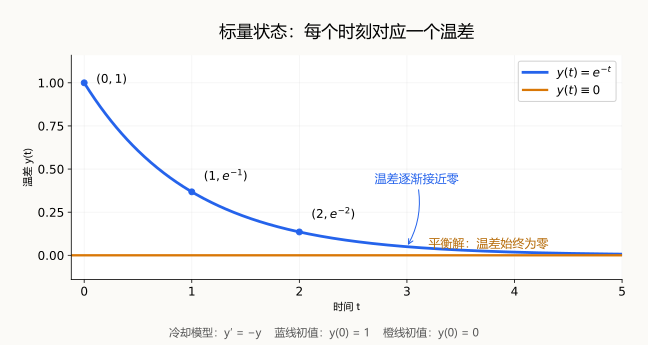

图中取 $k=1$。蓝线的初值是 $y(0)=1$，表示物体比环境热；橙线的初值是 $y(0)=0$，表示物体与环境同温。这个模型的平衡值必须满足 $-ky_*=0$，所以只有零温差对应平衡解，并不是任意水平线都是解。

这里我们把整个物体的温度当成一个数来跟踪。如果还要区分物体内部各个位置的温度，就要改用 $u(x,t)$：同一时刻，不同位置可以有不同温度。偏微分方程一篇中热方程的“场”，正是在这个地方比单个温度轨迹多了空间分布。

## 二、ODE 求解入门：方程分类与变量分离

求解 ODE，是寻找在指定区间内满足方程和给定条件的函数。本章先按阶数、线性结构、齐次与非齐次、系数和自变量的依赖关系辨认方程，再整理通解、初值与适用区间等求解要点，最后用变量分离法完成一个冷却模型的求解。下面通常用 $t$ 作自变量，$y'=dy/dt$。

### ODE 怎样分类

看清解的样子以后，再看方程的结构。一个 $n$ 阶标量 ODE 可以写成

$$
F(t,y,y',\ldots,y^{(n)})=0.
$$

一阶方程若已经把导数单独写成 $y'=f(t,y)$，称为显式形式；写成 $F(t,y,y')=0$ 而没有解出导数，则是隐式形式。隐式方程不一定能在所有点改写成单值的显式方程，使用相应初值理论前需要确认这一点。

#### 按阶数和未知量分类

最高出现几阶导数，方程就是几阶：冷却模型 $y'=-ky$ 是一阶，弹簧振动方程 $x''+\omega^2x=0$ 是二阶。令 $v=x'$，便可把振动方程改写为 $x'=v$、$v'=-\omega^2x$ 的一阶方程组。这说明“方程组有几个分量”与“方程是几阶”是两个不同的分类维度。

一般 $n$ 阶显式方程也可以把 $y,y',\ldots,y^{(n-1)}$ 作为状态，改写成一阶方程组。

#### 按线性结构分类

$n$ 阶线性 ODE 的一般形式是

$$
a_n(t)y^{(n)}+\cdots+a_1(t)y'+a_0(t)y=g(t),
\qquad a_n(t)\ne0.
$$

这里的非零条件针对正在讨论的区间。线性意味着未知函数及其导数以一次方出现、彼此不相乘，系数只依赖自变量。因此 $y'+t^2y=\sin t$ 仍是线性的；$y'=y^2$、$yy'+y=0$、$y''+\sin y=0$ 都是非线性的。

#### 按是否有外部项分类：齐次与非齐次

在线性方程中，把所有含未知函数及其导数的项放在左边，写成 $Ly=g(t)$。如果右边恒为零，就叫**齐次线性方程**，例如

$$
y''+2y'+y=0.
$$

如果右边不恒为零，就叫**非齐次线性方程**，例如

$$
y''+2y'+y=\sin t.
$$

这里 $\sin t$ 是不依赖未知函数的给定项，在受迫振动等模型中可以表示外部输入。判断时看的是它是否在整个讨论区间上恒为零；某几个时刻恰好取零，不会让方程变成齐次。

齐次线性方程具有叠加原理：若 $y_1,y_2$ 是解，$c_1y_1+c_2y_2$ 也是解。非齐次线性方程的解则具有“齐次通解加一个特解”的结构，第四章和第五章会分别用到这些性质。

#### 按系数是否变化分类：常系数与变系数

在线性方程中，乘在未知函数及其各阶导数前面的量叫系数。如果这些系数都是常数，就叫**常系数线性方程**，例如

$$
y''+2y'+y=0.
$$

这里 $y''$、$y'$、$y$ 的系数分别是 $1,2,1$，都不随 $t$ 变化。如果至少一个系数随自变量变化，就叫**变系数线性方程**，例如

$$
y''+t y'+y=0.
$$

这里 $y'$ 的系数是 $t$。在物理模型中，变系数可以表示阻尼等系统参数随时间或位置改变。

这一分类看的是左边的系数，不是右边的给定项。因此

$$
y''+2y'+y=\sin t
$$

虽然右边随时间变化，仍是常系数方程，同时也是非齐次方程。“齐次或非齐次”与“常系数或变系数”是两个独立的分类维度，可以组合使用。

#### 按是否显含自变量分类：自治与非自治

自治方程写成 $y'=f(y)$，右端不显含 $t$；非自治方程写成 $y'=f(t,y)$，右端显含 $t$。例如

$$
y'=y(1-y)
$$

是非线性自治方程，而 $y'=t y$ 是线性非自治方程。自治不意味着解不随时间变化，而是说“同样的状态在不同时刻服从同样的变化规律”。

对自治方程，满足 $f(y_*)=0$ 的状态给出平衡解 $y(t)\equiv y_*$。上面的例子有 $y=0$ 和 $y=1$ 两个平衡解；它们也提醒我们，求解时除以含 $y$ 的因子可能漏掉解。

#### 同一个方程可以同时贴上哪些标签

| 方程 | 分类 | 第三至五章可尝试的方法 |
| --- | --- | --- |
| $y'=t y$ | 一阶、标量、线性齐次、变系数、非自治 | 变量分离或积分因子 |
| $y'+2y=e^{-t}$ | 一阶、标量、线性非齐次、常系数、非自治 | 积分因子或常数变易 |
| $y''+2y'+5y=0$ | 二阶、标量、线性齐次、常系数；改写成一阶组后自治 | 特征方程 |
| $y'=y(1-y)$ | 一阶、标量、非线性、自治 | 先找平衡解，再变量分离 |

分类帮助我们读出方程可以利用的结构。给定前面介绍的初值或边值以后，还要判断解是否存在、是否唯一，以及数据误差会怎样影响解。

### 求解的基本流程：辨认结构、确定解与验证

#### 求解之前：辨认结构与适用区间

先看最高阶导数、未知函数出现的方式，以及系数是否随自变量变化，再选择可以利用的结构。可分离变量与线性并不互斥：$y'=-ky$ 同时属于两者，而 $y'=y^2$ 可以分离变量，却是非线性方程。

整理方程时要记录每一步的条件。除以某个含未知函数的因子，可能遗漏使这个因子为零的解；除以最高阶导数的系数，要求该系数不为零；取对数或换元，也要检查定义域。先说明在哪个区间工作，再判断所得表达式在那里是否成立。

#### 通解、特解与初值：公式怎样成为一个具体的解

积分产生的任意常数用来描述一族解；代入初值或边值，才进一步确定其中的成员。例如 $y'=y$ 给出 $y=Ce^t$，而 $y(0)=2$ 选出 $y=2e^t$。对于系数连续、最高阶系数不为零的 $n$ 阶线性方程，通解含 $n$ 个独立常数；非线性方程则还要留意公式是否遗漏特殊解。

“特解”在非齐次线性方程中通常指任意一个满足非齐次方程的解，它未必已经满足题目给定的初值。第五章会先找这样的一个特解，再加上齐次解来匹配初值。

积分后也不一定能把 $y$ 单独写出来。形如 $F(t,y)=C$ 的隐式关系，只要在所讨论区间能确定满足方程的可微函数，同样可以描述解。保留积分表达式也是一种精确表示，并不一定要化成初等函数。

#### 求出公式以后：检查方程、条件和存在区间

求解最后应做三件事：把函数及其导数代回原方程，检查初值或边值，再确认表达式在哪个区间有定义。满足方程并不自动意味着满足条件，一个公式也未必能延续到所有时间。

例如 $y'=y^2$、$y(0)=1$ 给出 $y=1/(1-t)$。代回可以验证方程和初值，但从 $t=0$ 出发的解在 $t=1$ 发散，其最大存在区间是 $(-\infty,1)$。虽然同一表达式在 $t>1$ 也有定义，那一段不能跨过奇点与原初值问题的解接在一起。

### 变量分离法：把两种变量各放一边

**历史背景。** 变量分离法形成于十七世纪末的早期微积分研究，Leibniz 和 Bernoulli 家族是主要推动者。Johann Bernoulli 在 1694 年与 Leibniz 的通信中明确讨论了分离变量的方法，因此这里把它看作早期微积分学家逐步发展的共同工具，而不归给唯一的发明者。

#### 物理模型：没有加热装置时的冷却

设物体内部温度近似均匀，温度为 $T(t)$，环境温度 $T_{\mathrm{env}}$ 恒定。令 $y(t)=T(t)-T_{\mathrm{env}}$ 为温差，$C_{\mathrm{th}}>0$ 为恒定热容。Newton 冷却定律把向环境散热的功率写成 $Ky$，其中 $K>0$ 是恒定的换热系数。没有加热装置时，内能的减少来自散热，因此

$$
\underbrace{C_{\mathrm{th}}y'}_{\text{内能变化率}}=-\underbrace{Ky}_{\text{散热功率}},
\qquad y'=-\frac{K}{C_{\mathrm{th}}}y.
$$

物体比环境热时，$y>0$，所以 $y'<0$；温差越大，降温越快。

#### 求解方法：分离变量后积分

一阶方程若能写成

$$
y'=g(t)h(y),
$$

就称为可分离变量的方程。它把变化率写成两个因子的乘积：$g(t)$ 表示随时间变化的影响，$h(y)$ 表示当前状态对变化速度的影响。

在 $h(y)\ne0$ 的区间上，把两种变量分别放到等式两边，再积分：

$$
\frac{dy}{h(y)}=g(t)\,dt,
\qquad
\int\frac{dy}{h(y)}=\int g(t)\,dt+C.
$$

除法前要先检查 $h(y)=0$ 对应的平衡解，以免遗漏。

#### 例子与结果：求温差随时间的变化

先记下平衡解 $y\equiv0$，它表示物体与环境温度相同。对 $y\ne0$，分离变量并积分：

$$
\frac{dy}{y}=-\frac{K}{C_{\mathrm{th}}}\,dt,
\qquad
\ln|y|=-\frac{K}{C_{\mathrm{th}}}t+C.
$$

取指数，把符号与积分常数合并为 $A$，得到

$$
y(t)=Ae^{-Kt/C_{\mathrm{th}}}.
$$

代入初始温差 $y(0)=y_0$，有 $A=y_0$，所以

$$
y(t)=y_0e^{-Kt/C_{\mathrm{th}}},
\qquad
T(t)=T_{\mathrm{env}}+y_0e^{-Kt/C_{\mathrm{th}}}.
$$

允许 $y_0=0$ 时，这个公式也包含先前保留的平衡解。解说明温差按指数衰减，物体温度逐渐接近环境温度；热容越大，变化越慢，换热系数越大，变化越快。记 $\tau=C_{\mathrm{th}}/K$ 为时间常数，经过 $\tau$ 时间，温差的大小降为原来的 $1/e$。

### 积分卡住怎么办：刘维尔定理与初等原函数

**刘维尔（Liouville）定理说明，初等原函数的形式受到一定的结构限制。** 这里的“初等函数”，指多项式、指数、对数、三角函数等，通过有限次运算组合出来的函数。直观地说，如果一个函数有初等原函数，这个原函数就必须能在定理规定的范围内，写成某个函数与有限个对数项的和。利用这种限制，可以证明有些积分无法用初等函数表示。

例如，$e^{t^2}$ 看起来很简单，却没有初等原函数；这个结论可以借助刘维尔定理证明。作为对比，$2t e^{t^2}$ 就容易积分：

$$
\int 2t e^{t^2}\,dt=e^{t^2}+C.
$$

多了一个 $2t$，恰好能用链式法则反过来求积分；少了它，就无法用初等函数写出答案。这里不展开证明，只需记住：**积分卡住，有时是因为不存在初等形式的答案。** 这不代表原函数不存在，仍然可以保留积分表达式，或用数值方法计算。

### 本章小结：先辨认类型，再选择解法

本章先建立分类思路：阶数说明涉及多少阶导数，线性、齐次性、系数是否变化等信息帮助选择解法；同一个方程可以同时具有多种分类特征。接着区分通解与条件选出的具体解，并把验证方程、条件和存在区间作为求解的一部分。

变量分离法利用 $y'=g(t)h(y)$ 的乘积结构，把两个变量分开后积分。求解时先保留 $h(y)=0$ 对应的平衡解，再处理可以相除的区间；最后用条件确定常数，并代回检查。这套“辨认结构、记录条件、求解、验证”的流程，也适用于后面的线性方程。

## 三、线性齐次方程

这一章从两个具体问题出发：没有加热时，温差为什么按指数衰减；没有外部驱动力时，弹簧为什么会出现过阻尼、临界阻尼或振荡。我们先根据物理规律写出方程，说明想解释的现象，再学习相应的求解方法。

这里的“齐次”表示状态相关的项整理到左边后，右边没有独立给定的外源。它并不表示没有热量交换或没有力：散热、弹簧回复力和阻尼力仍然包含在方程中。物理参数决定可能出现的运动模式，初值再从这些模式中选出一条具体轨迹。

### 一阶线性齐次方程：从冷却模型到自然衰减

**先看要解决的问题：没有加热装置时，物体怎样接近环境温度？** 温差越大，单位时间散失的热量越多；热容越大，同样的热量损失引起的温度变化越小。因此，我们希望从热量收支推导温差曲线，并看出热容和换热系数怎样控制冷却速度。

上一章得到无加热时的能量收支 $C_{\mathrm{th}}y'=-Ky$，其中 $y=T-T_{\mathrm{env}}$，$C_{\mathrm{th}}>0$ 是热容，$K>0$ 是换热系数。把它写成 $y'+ay=0$，其中 $a=K/C_{\mathrm{th}}$，就能看清：物理参数决定衰减速度，初始温差决定具体轨迹。

推广到连续系数 $p(t)$，一阶齐次线性方程为

$$
y'+p(t)y=0.
$$

先保留零解；对非零解分离变量后积分。记 $P(t)=\int_{t_0}^t p(s)\,ds$，得到

$$
y(t)=Ce^{-P(t)},\qquad y(t_0)=y_0\ \Longrightarrow\ C=y_0.
$$

这个公式也包含 $C=0$ 的零解。常系数冷却模型中，它变成 $y(t)=y_0e^{-a(t-t_0)}$。若 $p(t)$ 变化，指数记录的是整段时间累积的衰减作用；若 $p$ 为负，则可能表现为增长，不能把所有齐次方程都理解成衰减模型。

接下来把一个温差状态换成弹簧的位置和速度：模型从一阶变为二阶，除了衰减，还会出现振荡。我们通过质量、阻尼和刚度理解不同解的形式。

### 二阶常系数齐次线性方程：基本概念与判别式分类

这类方程写成

$$
ay''+by'+cy=0,\qquad a\ne0.
$$

“二阶”指最高导数是 $y''$；“常系数”指 $a,b,c$ 是实常数；“线性齐次”指未知函数及其导数都只以一次线性项出现，右端没有独立给定的外源项。

为了回答弹簧会不会振荡、回到平衡位置有多快，可以试用指数函数 $y=e^{rt}$，把微分方程转成关于 $r$ 的**特征方程**：

$$
ar^2+br+c=0.
$$

再计算判别式 $\Delta=b^2-4ac$，就能把问题分为三类：

| 判别式 | 特征根类型 | 解的主要形式 | 对应的弹簧情形 |
| --- | --- | --- | --- |
| $\Delta>0$ | 两个不同实根 | 两个指数函数的组合，也可写成双曲函数形式 | 过阻尼 |
| $\Delta=0$ | 重根 | 指数函数乘一次多项式 | 临界阻尼 |
| $\Delta<0$ | 共轭复根 | 指数函数乘三角函数 | 无阻尼或欠阻尼 |

表中的弹簧对应关系以质量、刚度为正且阻尼非负为前提。**判别式决定根的类型和通解形式；初值再确定通解中的两个常数。** 解的增长或衰减还取决于根的实部。

十八世纪 Euler 等人的工作建立了这类微分方程与代数方程之间的联系。下面三节都先提出弹簧的具体运动问题，再用特征方程解释和求出这种运动。

### 二阶常系数齐次方程：不同实根与过阻尼

#### 先看物理问题：阻尼很大时，弹簧怎样回到平衡位置

考虑一个质量—弹簧—阻尼系统，令 $y(t)$ 表示相对平衡位置的位移。回复力为 $-ky$，阻尼力为 $-\gamma y'$，其中 $m>0$ 是质量，$k>0$ 是弹簧刚度，$\gamma\ge0$ 是阻尼系数。没有外部驱动力时，Newton 第二定律给出

$$
my''=-\gamma y'-ky,
$$

也就是

$$
my''+\gamma y'+ky=0.
$$

这里仍有弹簧力和阻尼力；“齐次”只表示没有独立的外部驱动力。把滑块拉开再释放，初始状态就会引起自由运动。

临界阻尼系数为 $\gamma_c=2\sqrt{mk}$。当 $\gamma>\gamma_c$ 时，阻尼很强，系统不会持续往复振荡，这称为**过阻尼**。我们要解决的问题是：怎样从方程看出它由两个衰减模式组成，又怎样用初始位置和速度确定实际轨迹？

为方便计算，记

$$
\delta=\frac{\gamma}{2m},\qquad \omega_0=\sqrt{\frac{k}{m}},
\qquad \Delta=\gamma^2-4mk=4m^2(\delta^2-\omega_0^2),
$$

并给定初值 $y(0)=y_0$、$y'(0)=v_0$。过阻尼条件等价于 $\Delta>0$ 或 $\delta>\omega_0$。

#### 再求解：特征方程从哪里来

设 $y=e^{rt}$，则 $y'=re^{rt}$、$y''=r^2e^{rt}$。代入原方程：

$$
(ar^2+br+c)e^{rt}=0.
$$

因为 $e^{rt}\ne0$，两边除以它，得到特征方程：

$$
ar^2+br+c=0.
$$

#### 不同实根给出两个指数模式

两个不同实根对应两个独立的指数解，通解为 $y=C_1e^{r_1t}+C_2e^{r_2t}$。令 $\alpha=-b/(2a)$、$\mu=\sqrt{\Delta}/(2|a|)>0$，把两个根写成

$$
r_1=\alpha+\mu,
\qquad
r_2=\alpha-\mu,
$$

把 $e^{\alpha t}$ 提出来，就能把通解改写成双曲函数形式：

$$
y=C_1e^{(\alpha+\mu)t}+C_2e^{(\alpha-\mu)t}
=e^{\alpha t}\bigl(A\cosh\mu t+B\sinh\mu t\bigr),
$$

其中 $A=C_1+C_2$、$B=C_1-C_2$。

这是因为双曲函数本来就是两个指数函数的组合：

$$
\cosh z=\frac{e^z+e^{-z}}{2},
\qquad
\sinh z=\frac{e^z-e^{-z}}{2}.
$$

所以“双曲函数形式”不是新的解法，而是指数解的另一种写法。偏微分方程一篇求解 Laplace 方程时，某个方向上出现 $\sinh$、$\cosh$，本质上也来自这种实指数解。

#### 把结果解释回过阻尼弹簧

过阻尼没有持续往复振荡，但某些初始速度仍可能使质点越过平衡位置；是否越过要由初值决定。

当 $\delta>\omega_0$ 时，令 $\mu=\sqrt{\delta^2-\omega_0^2}$，两个特征根为 $-\delta\pm\mu$。通解可以写成

$$
y=Ae^{(-\delta+\mu)t}+Be^{(-\delta-\mu)t}
=e^{-\delta t}\bigl(C_1\cosh\mu t+C_2\sinh\mu t\bigr).
$$

对双曲函数形式求导并代入 $t=0$，得到 $C_1=y_0$、$-\delta C_1+\mu C_2=v_0$，因此

$$
y(t)=e^{-\delta t}\left[y_0\cosh(\mu t)
+\frac{v_0+\delta y_0}{\mu}\sinh(\mu t)\right].
$$

虽然式中出现了增长的双曲函数，但它们外面还有衰减因子。因为 $0<\mu<\delta$，两个指数 $-\delta\pm\mu$ 都为负，所以解仍趋于零，不会持续往复振荡。不能只看到 $\cosh$、$\sinh$ 就判断位移增长。

例如，无量纲方程 $y''+3y'+2y=0$ 的特征根为 $-1,-2$。从 $y(0)=1$、$y'(0)=0$ 释放，由 $A+B=1$、$-A-2B=0$ 得到 $A=2$、$B=-1$，所以

$$
y(t)=2e^{-t}-e^{-2t}
=e^{-3t/2}\left(\cosh\frac t2+3\sinh\frac t2\right).
$$

对 $t>0$，$y'=-2e^{-t}+2e^{-2t}<0$：滑块从初始位置逐渐回到平衡位置。这就是以双曲函数表示的弹簧滑块运动。

### 二阶常系数齐次方程：重根与临界阻尼

#### 先看物理问题：怎样最快回到平衡位置而不持续振荡

继续使用方程 $my''+\gamma y'+ky=0$。阻尼太小，滑块会反复越过平衡位置；阻尼太大，滑块虽然不振荡，却会缓慢返回。两者之间的分界是

$$
\gamma=\gamma_c=2\sqrt{mk},
$$

称为**临界阻尼**。它常被理解为“不产生持续振荡的前提下尽快回到平衡位置”的理想状态。此时判别式 $\Delta=\gamma^2-4mk$ 恰好为零。我们要解释的是：为什么这时两个特征根合并，以及第二个独立解为什么多出因子 $t$。

#### 再求解：重根为什么带来 $te^{rt}$

此时只有一个重根 $r=-b/(2a)$，方程除以 $a$ 后可以写成

$$
y''-2ry'+r^2y=0.
$$

一个解是 $e^{rt}$，但两个相同的指数无法提供两个独立的解。令 $y=u(t)e^{rt}$，则

$$
y'=(u'+ru)e^{rt},\qquad
y''=(u''+2ru'+r^2u)e^{rt}.
$$

代入后含 $u'$ 和 $u$ 的项抵消，只剩 $u''e^{rt}=0$。因此 $u''=0$，积分两次得到 $u=C_1+C_2t$，通解为

$$
y=(C_1+C_2t)e^{rt}.
$$

#### 把结果解释回临界阻尼弹簧

当 $\delta=\omega_0$ 时，特征根为重根 $-\delta$，通解为 $y=(C_1+C_2t)e^{-\delta t}$。由 $y(0)=C_1=y_0$、$y'(0)=C_2-\delta C_1=v_0$，得到

$$
y(t)=\bigl[y_0+(v_0+\delta y_0)t\bigr]e^{-\delta t}.
$$

此时没有周期性的往复振荡，位移最终趋于零。

例如 $y''+2y'+y=0$，判别式 $\Delta=0$，重根为 $-1$。若 $y(0)=1$、$y'(0)=0$，则 $C_1=1$、$C_2-C_1=0$，得到 $y=(1+t)e^{-t}$。对 $t>0$，$y'=-te^{-t}<0$，位移逐渐回到零。

### 二阶常系数齐次方程：共轭复根与振荡

#### 先看物理问题：为什么弹簧会来回振动，振幅又为什么减小

仍看 $my''+\gamma y'+ky=0$。把滑块向右拉开后释放，弹簧先把它拉向平衡位置；滑块到达平衡位置时仍有速度，于是继续越过平衡位置。到了另一侧，回复力反向，滑块再次返回，因此产生往复振动。

若 $\gamma=0$，没有阻尼耗能，理想模型中的振幅保持不变；若

$$
0<\gamma<\gamma_c,
$$

阻尼会消耗能量，但还不足以消除往复运动，这称为**欠阻尼**。我们要从解中同时看见两个部分：三角函数表示振荡，外面的指数因子表示振幅怎样变化。此时 $\Delta<0$，特征根是一对共轭复数。

#### 再求解：共轭复根怎样产生三角函数

令 $\alpha=-b/(2a)$、$\beta=\sqrt{-\Delta}/(2|a|)>0$，两个根为 $\alpha\pm i\beta$。由 Euler 公式

$$
e^{(\alpha\pm i\beta)t}=e^{\alpha t}\bigl(\cos\beta t\pm i\sin\beta t\bigr),
$$

可取两个实解 $e^{\alpha t}\cos\beta t$、$e^{\alpha t}\sin\beta t$，所以实通解为

$$
y=e^{\alpha t}(C_1\cos\beta t+C_2\sin\beta t).
$$

其中 $\beta$ 决定振荡角频率，$\alpha$ 决定振幅的包络增长、衰减还是保持不变。

#### 把结果解释回无阻尼与欠阻尼弹簧

**什么叫欠阻尼？** 阻尼力 $-\gamma y'$ 始终与速度方向相反，起到消耗运动能量的作用。“欠”是相对于消除往复振荡所需的临界阻尼而言：**阻力已经使振幅减小，但还不足以让运动失去振荡性质。** 所以欠阻尼不是没有阻力，而是“有阻力，仍然会来回摆动”。

当 $0\le\delta<\omega_0$ 时，令 $\omega_d=\sqrt{\omega_0^2-\delta^2}$，特征根为 $-\delta\pm i\omega_d$，通解为

$$
y=e^{-\delta t}\bigl(C_1\cos\omega_dt+C_2\sin\omega_dt\bigr).
$$

代入初值，有 $C_1=y_0$、$-\delta C_1+\omega_dC_2=v_0$，所以

$$
y(t)=e^{-\delta t}\left[y_0\cos(\omega_dt)
+\frac{v_0+\delta y_0}{\omega_d}\sin(\omega_dt)\right].
$$

当 $\delta=0$ 时，滑块持续振荡，振幅不变；当 $0<\delta<\omega_0$ 时，仍然往复振荡，但振幅的包络按 $e^{-\delta t}$ 衰减。

例如，取无量纲的质量、阻尼和刚度分别为 $1,2,5$。Newton 第二定律是 $y''=-2y'-5y$，整理后得到一个有阻尼的自由振动方程：

$$
y''+2y'+5y=0.
$$

判别式 $\Delta=2^2-4\cdot1\cdot5=-16<0$，特征方程是：

$$
r^2+2r+5=0,
$$

所以：

$$
r=-1\pm 2i.
$$

通解为：

$$
y=e^{-t}(C_1\cos 2t+C_2\sin 2t).
$$

这个解表示角频率为 $2$ 的往复振动，振幅的包络按 $e^{-t}$ 衰减。例如从 $y(0)=1$、$y'(0)=0$ 释放，有 $C_1=1$、$C_2=1/2$，因此

$$
y(t)=e^{-t}\left(\cos 2t+\frac12\sin 2t\right).
$$

质点会反复越过平衡位置，但每次摆动的幅度越来越小。

三种情况都先由判别式确定函数形式，再由初值确定系数。判别式只区分根的类型；运动最终增长还是衰减，还要看根的实部。例如过阻尼弹簧虽然使用双曲函数表示，但两个特征根都为负，位移最终仍趋于零。

### 线性方程的关键性质：叠加原理

线性方程之所以容易组织和求解，一个关键原因是**微分运算保留线性组合**。为简化书写，把方程左边“求导、乘系数、再相加”的整套运算记为 $L$：

$$
L[y]=y''+p(t)y'+q(t)y
$$

这里 $L$ 叫作**微分算子**，方括号里的 $y$ 是放进去运算的函数，$L[y]$ 不是 $L$ 乘以 $y$。例如取 $L[y]=y''+y$，把函数 $y=t^2$ 放进去，就得到

$$
L[t^2]=(t^2)''+t^2=2+t^2.
$$

因此，后面写的 $L[y_1]=r_1(t)$，只是把

$$
y_1''+p(t)y_1'+q(t)y_1=r_1(t)
$$

简写成算子形式：函数 $y_1$ 经过这套运算，结果是 $r_1(t)$。

对任意常数 $c_1,c_2$，线性性质意味着

$$
L[c_1y_1+c_2y_2]=c_1L[y_1]+c_2L[y_2].
$$

因此，如果 $y_1,y_2$ 都满足齐次方程 $L[y]=0$，那么

$$
L[c_1y_1+c_2y_2]=c_1\cdot0+c_2\cdot0=0.
$$

也就是说，**齐次线性方程的解可以乘以常数、相加，仍然是同一方程的解**。例如自由振动方程 $y''+\omega^2y=0$ 的两个解是 $\cos\omega t$ 和 $\sin\omega t$，把它们组合成

$$
y=C_1\cos\omega t+C_2\sin\omega t
$$

就能通过选择 $C_1,C_2$ 来匹配初始位移和速度。叠加后是否满足指定的初值或边值，还需要另外检查。

### 本章小结：参数决定模式，初值决定组合

一阶冷却模型给出指数衰减；二阶弹簧模型把质量、阻尼和刚度写进特征方程，产生过阻尼、临界阻尼或欠阻尼等不同运动。齐次解的基本模式由方程决定，初始状态决定各模式的系数。线性叠加让这些模式可以组合成满足初值的解。

下一章保持这些模型的散热、回复力和阻尼项，再加入供热或驱动力，观察方程与求解方法怎样改变。

## 四、线性非齐次方程：外部驱动与常数变易法

第五章与第四章逐一对应。第四章先研究没有外部输入时的自然冷却和自由振动；本章在左边保留相同的散热、回复力和阻尼项，只在右边加入一个**非齐次项**：供热功率或外部驱动力。这样可以直接看出，系统自身怎样演化，外界又怎样改变它。

| 物理模型 | 没有额外输入：齐次方程 | 加入输入：非齐次方程 |
| --- | --- | --- |
| 温差 $y=T-T_{\mathrm{env}}$ | $C_{\mathrm{th}}y'+Ky=0$ | $C_{\mathrm{th}}y'+Ky=Q(t)$，加入供热功率 |
| 弹簧位移 $y$ | $my''+\gamma y'+ky=0$ | $my''+\gamma y'+ky=F(t)$，加入驱动力 |

非零常数输入也会产生非齐次方程；判断依据是源项是否恒为零。改变热容、阻尼或刚度，会改变左边的系数，却不一定使方程变成非齐次。

本章先把两个物理模型对应起来，再讨论解法：一阶方程用常数变易法或积分因子法，二阶方程先理解“齐次通解加一个特解”，再用两个系数的常数变易法寻找特解。柯西–欧拉方程作为变系数方程的补充。

### 一阶模型：从自然冷却到外部供热

第四章的自然冷却方程是

$$
C_{\mathrm{th}}y'+Ky=0.
$$

右边为零，表示没有加热装置。现在的问题是：**物体一边向环境散热，一边接受随时间变化的供热，温差会怎样变化？**

在第四章的冷却模型中加入加热装置，仍用 $y$ 表示温差、$C_{\mathrm{th}}$ 表示热容、$K$ 表示换热系数。若加热功率为 $Q(t)$，内能变化率就等于输入功率减去散热功率：

$$
\underbrace{C_{\mathrm{th}}y'}_{\text{内能变化率}}
=\underbrace{Q(t)}_{\text{加热功率}}
-\underbrace{Ky}_{\text{向环境散热的功率}}.
$$

两边除以热容，得到

$$
y'+\frac{K}{C_{\mathrm{th}}}y=\frac{Q(t)}{C_{\mathrm{th}}}.
$$

其中 $K/C_{\mathrm{th}}$ 表示温差衰减的快慢，$Q(t)/C_{\mathrm{th}}$ 表示加热带来的升温速率。温差为负时，$-Ky$ 为正，表示环境向物体供热。这种“变化率＝输入－损失”的结构，也出现在电路和物质收支模型中。

这里的 $Q(t)$ 就是**外源**：由外部给定的加热输入，可以随时间增强、减弱或周期变化。当 $Q(t)\equiv0$ 时，方程是齐次的；当它不恒为零时，方程是非齐次的。恒定的非零加热功率也属于外源，所以非齐次并不要求外源一定随时间改变。

### 二阶模型：从自由振动到外力驱动

第四章的弹簧方程是

$$
my''+\gamma y'+ky=0.
$$

它描述没有外部驱动力时，由初始位移和速度引起的自由振动。现在再施加一个随时间给定的外力 $F(t)$。Newton 第二定律变为

$$
my''=-\gamma y'-ky+F(t),
$$

整理后得到

$$
my''+\gamma y'+ky=F(t).
$$

这就是**受迫振动**。左边仍描述质量、阻尼和弹簧刚度决定的自身规律，右边的 $F(t)$ 描述外界怎样推动系统。例如 $F(t)=F_0\cos(\Omega t)$ 表示周期性推拉。即使初始位移和速度都为零，只要 $F(t)$ 不为零，外力也能使系统运动。

与供热模型中的 $Q(t)$ 一样，$F(t)$ 是外部给定的源项。两边除以质量后，

$$
y''+\frac{\gamma}{m}y'+\frac{k}{m}y=\frac{F(t)}m.
$$

因此，一阶和二阶模型具有同一个结构：**左边保留齐次系统自身的规律，右边加入外部输入。** 接下来再研究怎样求解这些方程。

### 一阶非齐次线性方程怎样解：常数变易法

#### 让齐次解中的常数随时间变化

**历史背景。** 一阶情形的思路可以追溯到 Johann Bernoulli 在 1697 年处理 Bernoulli 方程的方法：应用于一阶线性方程时，它与常数变易法密切对应。后来高阶方程和天体力学中的常数变易法又得到 Euler、Lagrange 的发展，所以不能把这里的一阶技巧与后来的全部推广都归给同一个人。

考虑供热模型对应的一般一阶非齐次线性方程

$$
y'+p(t)y=q(t),
$$

还可以从对应的齐次解出发。先解

$$
y'+p(t)y=0,
$$

得到 $y_h=Ce^{-P(t)}$。下标 $h$ 来自 homogeneous（齐次），只是表示“齐次方程的解”。这里记 $P(t)=\int_{t_0}^t p(s)\,ds$，所以 $P'(t)=p(t)$。非齐次项 $q(t)$ 出现以后，试着让这个常数随时间变化：

$$
y(t)=C(t)e^{-P(t)}.
$$

先用乘积求导和链式法则计算导数：

$$
\begin{aligned}
y'(t)
&=C'(t)e^{-P(t)}+C(t)\bigl(e^{-P(t)}\bigr)'\\
&=C'(t)e^{-P(t)}-C(t)P'(t)e^{-P(t)}\\
&=C'(t)e^{-P(t)}-p(t)C(t)e^{-P(t)}.
\end{aligned}
$$

把 $y$ 和 $y'$ 一起代回原方程 $y'+p(t)y=q(t)$：

$$
\underbrace{C'(t)e^{-P(t)}-p(t)C(t)e^{-P(t)}}_{y'(t)}
+\underbrace{p(t)C(t)e^{-P(t)}}_{p(t)y(t)}
=q(t).
$$

其中 $-p(t)C(t)e^{-P(t)}$ 与 $+p(t)C(t)e^{-P(t)}$ 大小相同、符号相反，抵消后得到

$$
C'(t)e^{-P(t)}=q(t),
\qquad C'(t)=e^{P(t)}q(t).
$$

于是

$$
C(t)=C_0+\int_{t_0}^t e^{P(s)}q(s)\,ds,
$$

再乘回 $e^{-P(t)}$，就得到非齐次方程的解。常数变易法保留齐次解的基本形式，让原先固定的系数随输入变化；这一思路还可以推广到二阶方程。后面会用积分因子法推导同一个公式，比较两种方法的关系。

**这个公式怎样解释输入的作用。** 把初值 $y(t_0)=y_0$ 代入并展开，可以写成

$$
y(t)=\underbrace{e^{-\int_{t_0}^t p(\tau)\,d\tau}y_0}_{\text{初始状态留下的贡献}}
+\underbrace{\int_{t_0}^t e^{-\int_s^t p(\tau)\,d\tau}q(s)\,ds}_{\text{各时刻输入累积留下的贡献}}.
$$

对于上面的供热模型，时刻 $s$ 输入的热量会使温度升高，但它的影响在随后散热的过程中逐渐减弱。积分就是把每一小段时间的输入，按它到当前时刻还剩多少影响，逐一加起来。常数变易法因此把“自由衰减的规律”和“外部输入的累积”合在同一个解中。

以无量纲供热模型 $y'+2y=e^{-t}$ 为例：齐次解是 $Ce^{-2t}$，令 $y=C(t)e^{-2t}$，就有 $C'=e^t$，因此 $C(t)=e^t+C_0$，得到 $y=e^{-t}+C_0e^{-2t}$。

### 与常数变易法对照：积分因子法

**历史背景。** Leibniz 在 1694 年已经给出与今天积分因子法相对应的一阶线性方程解法；Euler 在 1763 年又从恰当微分方程的角度系统地寻找积分因子。因此，这里“选择一个因子，把左边凑成完整导数”的思路，有 Leibniz 的早期解法和 Euler 的后续发展。

#### 求解方法：积分因子把两项合成乘积导数

设 $p,q$ 在讨论区间上连续，考虑一阶线性方程

$$
y'+p(t)y=q(t).
$$

在本章的供热模型中，$p(t)=K/C_{\mathrm{th}}$、$q(t)=Q(t)/C_{\mathrm{th}}$。

这里希望把左边整理成一个完整的导数，这样就能直接积分。依据是乘积求导法则：

$$
(\mu y)'=\mu y'+\mu' y.
$$

#### 先看要凑出什么，再决定乘什么

假设给原方程两边乘上一个待定的非零函数 $\mu(t)$：

$$
\mu y'+\mu p y=\mu q.
$$

把左边与乘积导数比较：第一项都是 $\mu y'$，第二项要相同，就需要

$$
\mu' y=\mu p y.
$$

为了让这个匹配不依赖未知的 $y$，我们直接要求系数满足

$$
\mu'=p(t)\mu.
$$

这就是积分因子应当满足的方程。取正的 $\mu$，分离变量并积分：

$$
\frac{\mu'}{\mu}=p(t),\qquad
\ln\mu(t)-\ln\mu(t_0)=\int_{t_0}^t p(s)\,ds.
$$

积分因子乘上一个非零常数也不影响作用，所以可以选 $\mu(t_0)=1$。记

$$
P(t)=\int_{t_0}^t p(s)\,ds,
\qquad \mu(t)=e^{P(t)}.
$$

这个指数形式是由“凑成乘积导数”的要求推出来的。

#### 凑成乘积导数以后，直接积分

有了 $\mu'=p\mu$，原方程乘以 $\mu$ 后就变成

$$
\mu y'+\mu p y
=\mu y'+\mu' y
=(\mu y)'=\mu q.
$$

从 $t_0$ 积分到 $t$，得到

$$
\mu(t)y(t)-\mu(t_0)y(t_0)
=\int_{t_0}^t\mu(s)q(s)\,ds.
$$

代入 $\mu(t_0)=1$、$y(t_0)=y_0$，再除以非零的 $\mu(t)$：

$$
y(t)=e^{-P(t)}\left[y_0+\int_{t_0}^t e^{P(s)}q(s)\,ds\right].
$$

#### 它与分部积分有什么关系

两者都来自乘积求导法则，但整理的方向不同。把 $(\mu y)'=\mu y'+\mu'y$ 积分并移项，就得到分部积分公式

$$
\int\mu y'\,dt=\mu y-\int\mu'y\,dt.
$$

积分因子法则是主动选择 $\mu$，让方程左边的两项合成 $(\mu y)'$，然后直接积分。它的关键步骤是寻找这个乘积结构，而不是把一个积分换成另一个积分。

#### 例子与结果：加热逐渐减弱时的温差

把供热模型的时间和温差选取适当的单位并无量纲化，取衰减系数为 $2$、加热项为 $e^{-t}$，就得到

$$
y'+2y=e^{-t}.
$$

这里 $y$ 是无量纲温差，$2y$ 表示向环境散热的作用，$e^{-t}$ 表示逐渐减弱的加热输入。即使加热仍在继续，只要散热超过输入，温度也会下降。

现在求解。这里 $p(t)=2$，取 $t_0=0$，便有 $P(t)=2t$、$\mu(t)=e^{2t}$。两边乘以积分因子：

$$
e^{2t}y'+2e^{2t}y=e^t.
$$

因为 $(e^{2t})'=2e^{2t}$，左边正好是 $(e^{2t}y)'$，因此

$$
(e^{2t}y)'=e^t,
\qquad e^{2t}y=e^t+C,
\qquad y=e^{-t}+Ce^{-2t}.
$$

若再给 $y(0)=3$，则 $C=2$。直接求导可检查 $y'+2y=e^{-t}$，而两个指数在 $t=0$ 的值之和确实为 $3$。在这个供热模型中，$y(t)=e^{-t}+2e^{-2t}$ 始终下降，并趋于零：加热逐渐停止以后，物体最终回到环境温度。

### 二阶非齐次线性方程怎样解：齐次解加一个特解

**历史背景。** 二阶非齐次线性方程随着对受外力作用的运动、振动和天体摄动的研究逐步发展，并非由一个人一次提出。十八世纪，Euler 研究了非齐次线性方程的求解；Euler 与 Lagrange 等人发展的常数变易思想，则提供了从已知齐次解出发处理附加作用的途径。

#### 解的结构：齐次通解加一个特解

考虑带外力的方程

$$
y''+p(t)y'+q(t)y=r(t).
$$

求它的解，可以分成两件事：

- **先把右边改成零，求齐次通解 $y_h$。** 在弹簧模型中，它描述没有外力驱动时可能出现的自由运动，里面带着两个待定常数。
- **再找一个满足原方程的函数 $y_p$。** 找到一个就够了，它叫特解，可以看作外力作用下的一种运动，暂时不要求它满足题目给出的初值。

把两部分加起来，就是原方程的通解：

$$
\boxed{y=y_h+y_p}.
$$

**为什么可以相加？** 因为方程是线性的。代入 $y_h$ 时，左边算出来是 $0$；代入 $y_p$ 时，左边算出来是 $r(t)$。把它们相加后，左边也相加，结果仍是 $0+r(t)=r(t)$。反过来，原方程的任意解减去这个特解后，右边变成零，剩下的就属于齐次解。

**初值怎么办？** 用 $y_h$ 里的两个常数来调整。例如 $y_h=C_1y_1+C_2y_2$，就先写

$$
y=C_1y_1+C_2y_2+y_p,
$$

再代入给定的初始位置、初始速度，确定 $C_1,C_2$。也就是说，特解先提供一种符合外力要求的运动，齐次部分再把它调整到指定的初始状态。下标 $h$ 来自 homogeneous（齐次），$p$ 来自 particular（特解）。

接下来要解决的是“怎样找到这个特解”。一种常用办法是**待定系数法**：当方程为常系数、右端是多项式、指数、正弦余弦等适合的形式时，可以按相应形式设特解，再代入确定系数；与齐次解重复时，要乘以适当的 $t$ 的幂来调整。这里不展开计算，下面介绍适用范围更广的常数变易法。

#### 求特解：常数变易法

**历史背景。** 高阶常数变易法通常与 Euler 和 Lagrange 联系在一起。它的重要来源是轨道摄动问题：先知道未受扰动的运动，再让解中的常数随时间变化，以描述额外作用。

常数变易法适用范围更广，但**能写出积分表达式，不等于能得到初等函数形式的解**。它把求特解转化为积分，而初等函数的原函数未必还是初等函数。例如对 $y''+y=1/t$（$t>0$），取齐次解 $\cos t$、$\sin t$ 后，求特解会涉及 $\int(\sin t/t)\,dt$ 和 $\int(\cos t/t)\,dt$，这两个积分都不能用初等函数表示。此时可以保留积分，使用后面介绍的特殊函数，或进行数值计算；方程仍然有解，只是不能用有限次初等运算和初等函数写出。

仍考虑

$$
y''+p(t)y'+q(t)y=r(t).
$$

假设 $p,q,r$ 在讨论区间上连续，且已经知道齐次方程的两个线性无关解 $y_1,y_2$。这里“线性无关”表示它们不只是彼此的常数倍，能共同组成齐次通解

$$
y_h=C_1y_1+C_2y_2.
$$

如果原方程的最高阶系数不是 $1$，要先在它不为零的区间内把整条方程除以这个系数，右端也一起除。下面从这个标准形式开始。

#### 第一步：把常数换成待求函数

一阶常数变易法让一个常数变化；这里让两个常数都变化，试着构造特解

$$
y_p=u_1(t)y_1(t)+u_2(t)y_2(t).
$$

$y_1,y_2$ 是已经知道的函数，$u_1,u_2$ 才是现在要找的函数。以下为简洁省略各项的自变量 $t$。

先按乘积法则求导：

$$
y_p'=u_1'y_1+u_1y_1'+u_2'y_2+u_2y_2'.
$$

如果继续直接求导，会出现 $u_1''$、$u_2''$。为了简化计算，我们给这两个待求函数加上一个辅助条件：

$$
u_1'y_1+u_2'y_2=0.
$$

这个条件约束的是特解的表示方式，并不是给原方程增加一个边界条件。我们只需要构造一个特解，可以先尝试满足这个辅助条件的表示；后面将看到，只要相关的分母不为零，这样的 $u_1,u_2$ 确实能求出。

在这个条件下，导数简化为

$$
y_p'=u_1y_1'+u_2y_2'.
$$

#### 第二步：再次求导，逐项代回原方程

对上式求导，得到

$$
y_p''=u_1'y_1'+u_1y_1''+u_2'y_2'+u_2y_2''.
$$

现在把 $y_p,y_p',y_p''$ 全部代入：

$$
\begin{aligned}
y_p''+p y_p'+q y_p
&=u_1'y_1'+u_1y_1''+u_2'y_2'+u_2y_2''\\
&\quad+p(u_1y_1'+u_2y_2')+q(u_1y_1+u_2y_2)\\
&=u_1'y_1'+u_2'y_2'\\
&\quad+u_1\underbrace{(y_1''+py_1'+qy_1)}_{0}
+u_2\underbrace{(y_2''+py_2'+qy_2)}_{0}.
\end{aligned}
$$

两个括号都为零，因为 $y_1,y_2$ 满足齐次方程。因此，要让 $y_p$ 满足右端为 $r$ 的非齐次方程，只需

$$
u_1'y_1'+u_2'y_2'=r.
$$

把它与辅助条件放在一起：

$$
\begin{cases}
y_1u_1'+y_2u_2'=0, & \text{辅助条件},\\
y_1'u_1'+y_2'u_2'=r, & \text{原方程的要求}.
\end{cases}
$$

这里可以暂时把 $u_1',u_2'$ 当作两个未知数，用普通的二元一次方程组消元法求解。

#### 第三步：消元求出两个导数

用第一式乘 $y_2'$，再减去第二式乘 $y_2$，消去 $u_2'$：

$$
(y_1y_2'-y_1'y_2)u_1'=-y_2r.
$$

再用第二式乘 $y_1$，减去第一式乘 $y_1'$，消去 $u_1'$：

$$
(y_1y_2'-y_1'y_2)u_2'=y_1r.
$$

为少写一些符号，把共同的系数记成

$$
W(t)=y_1(t)y_2'(t)-y_1'(t)y_2(t).
$$

它叫 Wronskian；在这里可以先把它理解为消元时出现的分母。对于上述连续系数的二阶线性方程，选取两个线性无关的齐次解后，$W$ 在讨论区间内不为零。于是

$$
u_1'=-\frac{y_2r}{W},\qquad
u_2'=\frac{y_1r}{W}.
$$

#### 第四步：分别积分，再放回特解

取区间内一个参考点 $t_0$，可以选

$$
u_1(t)=-\int_{t_0}^t\frac{y_2(s)r(s)}{W(s)}\,ds,
\qquad
u_2(t)=\int_{t_0}^t\frac{y_1(s)r(s)}{W(s)}\,ds.
$$

代入 $y_p=u_1y_1+u_2y_2$，便得到

$$
y_p(t)=-y_1(t)\int_{t_0}^t\frac{y_2(s)r(s)}{W(s)}\,ds
+y_2(t)\int_{t_0}^t\frac{y_1(s)r(s)}{W(s)}\,ds.
$$

为什么这里没有另外写两个积分常数？如果给 $u_1,u_2$ 分别加上常数 $K_1,K_2$，$y_p$ 只会多出 $K_1y_1+K_2y_2$，这部分本来就在齐次通解里。所以先选一个特解，最后统一写成

$$
y=C_1y_1+C_2y_2+y_p
$$

就包含了这些常数。具体计算时也可以分别求不定积分，选取方便的原函数。

#### 例子：一步步求解受周期外力驱动的振动

求解

$$
y''+y=\sin t,\qquad y(0)=0,\quad y'(0)=0.
$$

先看齐次方程 $y''+y=0$。特征方程为 $\lambda^2+1=0$，根为 $\pm i$，因此取

$$
y_1=\cos t,\qquad y_2=\sin t.
$$

令 $y_p=u_1\cos t+u_2\sin t$。按照上面的辅助条件和代入结果，得到

$$
\begin{cases}
u_1'\cos t+u_2'\sin t=0,\\
-u_1'\sin t+u_2'\cos t=\sin t.
\end{cases}
$$

第一式乘 $\cos t$，减去第二式乘 $\sin t$，得到

$$
u_1'(\cos^2t+\sin^2t)=-\sin^2t,
\qquad u_1'=-\sin^2t.
$$

第一式乘 $\sin t$，加上第二式乘 $\cos t$，得到

$$
u_2'(\sin^2t+\cos^2t)=\sin t\cos t,
\qquad u_2'=\sin t\cos t.
$$

接下来分别积分。利用半角公式 $\sin^2t=(1-\cos2t)/2$，选取

$$
\begin{aligned}
u_1(t)&=-\int\sin^2t\,dt
=-\frac12\int(1-\cos2t)\,dt
=-\frac t2+\frac{\sin2t}{4},\\
u_2(t)&=\int\sin t\cos t\,dt
=\frac12\sin^2t.
\end{aligned}
$$

代回特解，用 $\sin2t=2\sin t\cos t$ 化简：

$$
\begin{aligned}
y_p
&=\left(-\frac t2+\frac{\sin2t}{4}\right)\cos t
+\frac12\sin^2t\sin t\\
&=-\frac t2\cos t+\frac12\sin t\cos^2t+\frac12\sin^3t\\
&=-\frac t2\cos t+\frac12\sin t(\cos^2t+\sin^2t)\\
&=-\frac t2\cos t+\frac12\sin t.
\end{aligned}
$$

因此通解先写成

$$
y=C_1\cos t+C_2\sin t-\frac t2\cos t+\frac12\sin t.
$$

其中 $(C_2+\frac12)\sin t$ 仍是一个任意常数乘 $\sin t$。把 $C_2+\frac12$ 重新记作 $C_2$，通解简化为

$$
y=C_1\cos t+C_2\sin t-\frac t2\cos t.
$$

最后代入初值。由 $y(0)=0$ 得到 $C_1=0$。对通解求导：

$$
y'=-C_1\sin t+C_2\cos t-\frac12\cos t+\frac t2\sin t.
$$

由 $y'(0)=0$ 得到 $C_2-\frac12=0$，所以 $C_2=\frac12$。最终

$$
y(t)=\frac12(\sin t-t\cos t).
$$

再检查一次方程：

$$
y'(t)=\frac12t\sin t,\qquad
y''(t)=\frac12\sin t+\frac12t\cos t,
$$

$$
y''+y
=\frac12\sin t+\frac12t\cos t
+\frac12\sin t-\frac12t\cos t
=\sin t.
$$

代入 $t=0$ 也得到 $y(0)=y'(0)=0$。解中出现的 $t\cos t$ 项说明，在这个无阻尼模型里，外力频率与固有频率相同时，振动的幅度会随时间增长，这就是共振。

### 输入与响应的叠加

**非齐次时，要把外源一起叠加。** 如果 $L[y_1]=r_1(t)$、$L[y_2]=r_2(t)$，那么 $L[c_1y_1+c_2y_2]=c_1r_1+c_2r_2$。物理上，这表示在线性模型中，不同外力分别产生的响应可以相加，得到合力对应的响应。

但同一个非零外源 $r(t)$ 对应的两个解直接相加，右端会变成 $2r(t)$，通常不再满足原方程。对于固定外源，正确的结构是**齐次通解加一个非齐次特解**：$L[y_h+y_p]=0+r=r$。本章的一阶和二阶非齐次方程都会用到这一点；一般非线性方程则没有这样的叠加性质。

### 本章小结：保留自由演化，累积外部输入

常数变易法把齐次解作为求解非齐次方程的起点。一阶情形让一个常数变化，二阶情形让两个基本解的系数变化，代回原方程后求出这些系数。它给出特解的积分表达式，并不保证积分一定能化为初等函数。

物理上，供热改变冷却过程，外力改变自由振动；数学上，解的结构是“齐次通解加一个特解”。特解不唯一，也未必满足给定初值，需要由齐次部分调整。若要严格区分初始状态的贡献和后续输入的贡献，可以选择满足零初值的受迫响应，再加上满足原初值的齐次响应。

积分因子法与一阶常数变易法得到相同结果；二阶常数变易法在已知两个独立齐次解时也适用于变系数方程。柯西–欧拉方程则展示另一种辅助思路：先借助自变量代换，把特殊的变系数结构化为常系数，再使用已经掌握的工具。

## 五、非线性 ODE：代换与线性近似

寻找解公式的道路遇到非线性时，适用范围变得更加有限。十八世纪已经有近似计算的方法；到十九世纪，存在性理论和非线性方程的研究进一步表明，研究微分方程不能只依靠显式公式。十九世纪末 Poincaré 的定性理论更强调：即使求不出公式，也要研究解的整体行为。

本章接着前三章的求解方法讨论“公式难求时怎么办”：特殊结构可以代换，适当范围内可以线性近似。难以写出初等函数解，不代表没有光滑解；求表达式与研究解的性质，是需要区分的两件事。

上一章主要研究线性方程。本章进一步看非线性：有些方程仍能分离变量，有些能通过代换化成线性方程。再用单摆说明，前面熟悉的线性振动模型怎样从非线性方程近似得到，数值求解则放在特殊函数之后的第九章单独讨论。

### 什么是非线性：解通常不能任意作线性组合

当未知函数或它的导数以平方、乘积、正弦等非线性形式出现时，就超出了线性方程的范围。例如

$$
y'=y^2,\qquad
\theta''+\frac{g}{\ell}\sin\theta=0.
$$

前面齐次线性方程的叠加原理说的是：如果 $y_1,y_2$ 都是解，那么任意常数 $c_1,c_2$ 对应的线性组合 $c_1y_1+c_2y_2$ 仍然是解。非线性方程通常不具备这个性质。

以 $y'=y^2$ 为例，设 $y_1,y_2$ 都是解，即

$$
y_1'=y_1^2,\qquad y_2'=y_2^2.
$$

令 $z=c_1y_1+c_2y_2$，先求导，再代入这两个关系：

$$
z'=c_1y_1'+c_2y_2'=c_1y_1^2+c_2y_2^2.
$$

但 $z$ 要满足原方程，还必须有 $z'=z^2$，而

$$
z^2=(c_1y_1+c_2y_2)^2
=c_1^2y_1^2+2c_1c_2y_1y_2+c_2^2y_2^2.
$$

两式通常不相等：系数被平方了，还多出了交叉项 $2c_1c_2y_1y_2$。因此，两个解的任意线性组合通常不再是解。

例如在 $t<1$ 上，$y_1=1/(1-t)$、$y_2=1/(2-t)$ 都满足 $y'=y^2$。取 $z=y_1+y_2$，在 $t=0$ 时就有

$$
z'(0)=1+\frac14=\frac54,
\qquad z(0)^2=\left(1+\frac12\right)^2=\frac94.
$$

两者不等，所以它们的和不是解。把一个解乘以常数，也是线性组合的特殊情形；这里强调的是，非线性方程没有“任意线性组合仍是解”的一般保证。不过，非线性不意味着无法求解：$y'=y^2$ 本身就可以分离变量。

### 代换法：把 Bernoulli 方程化成线性方程

**适用范围。** 能通过简单代换化成线性方程的非线性 ODE，通常需要少数特殊结构。下面的 Bernoulli 方程就是其中一类，不能把它的代换方法直接套到一般非线性方程上。一般非线性 ODE 没有通用的解析求解公式，许多方程的解不能用初等函数表示，实际求解往往需要近似或数值方法。这里说的是难以写出解的公式，并不意味着解不存在。

Bernoulli 方程的形式是

$$
y'+p(t)y=q(t)y^n,\qquad n\ne0,1.
$$

它因 $y^n$ 而具有非线性。以下在 $y\ne0$ 且相关实数幂有定义的区间内计算；若 $y\equiv0$ 满足原方程，要另外保留。

两边乘以 $y^{-n}$，得到

$$
y^{-n}y'+p(t)y^{1-n}=q(t).
$$

令 $z=y^{1-n}$，由链式法则

$$
z'=(1-n)y^{-n}y'.
$$

所以 $y^{-n}y'=z'/(1-n)$。代回并乘以 $1-n$：

$$
z'+(1-n)p(t)z=(1-n)q(t).
$$

这就是第五章的一阶线性方程，可以用积分因子法求解，再由 $z=y^{1-n}$ 换回 $y$，并检查定义区间。

这个代换能成功，是因为乘以 $y^{-n}$ 后，恰好同时出现 $y^{1-n}$ 和与它的导数成比例的 $y^{-n}y'$。如果非线性项换成一般的函数，通常就没有这种配合，代换后也未必变成线性方程。

**例子。** 求 $y'+y=y^2$、$y(0)=1/2$。取 $z=1/y$，则

$$
z'-z=-1.
$$

积分因子是 $e^{-t}$，因此

$$
(e^{-t}z)'=-e^{-t},\qquad
e^{-t}z=e^{-t}+C,\qquad z=1+Ce^t.
$$

初值给出 $z(0)=2$，所以 $C=1$，换回得到

$$
y(t)=\frac{1}{1+e^t}.
$$

这个解随时间下降并趋于零。原方程还有平衡解 $y\equiv0$，它在除以 $y^2$ 时被排除了；另一个平衡解 $y\equiv1$ 则对应上面通解中的 $C=0$。

### 代换法：把柯西–欧拉方程化为常系数方程

这是代换法的另一种典型结构。**柯西–欧拉方程本身仍是线性变系数方程，不是非线性方程；这里把它放在本章，是为了和 Bernoulli 方程一起说明：只有少数特殊结构能通过代换化成已经会解的方程。**

二阶柯西–欧拉方程写成

$$
x^2y''+\alpha xy'+\beta y=g(x),\qquad x>0,
$$

其中 $\alpha,\beta$ 是常数，撇号对 $x$ 求导。二阶导数前恰好是 $x^2$、一阶导数前恰好是常数乘 $x$；正是这个幂次结构使对数代换有效，不能套用于任意变系数线性方程。

令 $t=\ln x$，即 $x=e^t$，并记 $Y(t)=y(e^t)$。链式法则给出

$$
Y'=xy',\qquad Y''=xy'+x^2y'',
$$

所以 $x^2y''=Y''-Y'$。代回原方程：

$$
Y''+(\alpha-1)Y'+\beta Y=g(e^t).
$$

左边已经变成二阶常系数线性方程；右边为零时用第四章的特征方程，非零时可用第五章的“齐次解加特解”或常数变易法。若 $\alpha,\beta$ 本身是随 $x$ 变化的函数，代换后通常仍是变系数方程，因此不能直接使用这条路线。

**例子。** 求

$$
x^2y''-xy'+y=x^2,\qquad x>0.
$$

这里 $\alpha=-1$、$\beta=1$，代换后为

$$
Y''-2Y'+Y=e^{2t}.
$$

齐次方程的特征方程为 $(r-1)^2=0$，所以 $Y_h=(C_1+C_2t)e^t$。试取 $Y_p=Ae^{2t}$，代入得 $A=1$，于是

$$
Y=(C_1+C_2t)e^t+e^{2t}.
$$

换回 $t=\ln x$：

$$
y(x)=C_1x+C_2x\ln x+x^2.
$$

若再给 $y(1)=0$、$y'(1)=0$，则 $C_1=C_2=-1$，具体解为

$$
y(x)=x^2-x-x\ln x.
$$

$x=0$ 处最高阶系数为零，不能跨过它使用上述代换；在 $x<0$ 的区间可改用 $t=\ln|x|$。这个例子说明，部分线性变系数方程也能借助代换使用常系数方程的工具。

### 局部线性化近似：以单摆为例

设摆长为 $\ell$，摆球质量为 $m$，$\theta(t)$ 是相对竖直向下方向的偏角。不计阻力，沿圆弧切向的加速度为 $\ell\theta''$，重力的切向分量为 $-mg\sin\theta$。Newton 第二定律给出

$$
m\ell\theta''=-mg\sin\theta,
\qquad
\theta''+\frac{g}{\ell}\sin\theta=0.
$$

非线性来自 $\sin\theta$。在竖直向下的平衡位置附近，若角度以弧度计且 $|\theta|$ 很小，利用

$$
\sin\theta=\theta-\frac{\theta^3}{6}+\cdots\approx\theta,
$$

就得到线性近似

$$
\theta''+\frac{g}{\ell}\theta=0.
$$

设 $\theta(0)=\theta_0$、$\theta'(0)=0$，由第四章的方法得到

$$
\theta(t)\approx\theta_0\cos\left(\sqrt{\frac{g}{\ell}}\,t\right),
\qquad T_{\mathrm{small}}=2\pi\sqrt{\frac{\ell}{g}}.
$$

这说明小幅摆动近似为简谐振动，周期近似与振幅无关。角度增大后，被略去的非线性项不能忽视，这个周期公式也就不再精确。

这里没有外部驱动力，方程仍然是非线性的。因此，**非线性与非齐次是不同概念**：前者说未知量怎样进入方程，后者在前面的线性方程中说有没有独立的外源项。

### 本章小结：利用结构代换，在适用范围内近似

一般非线性 ODE 没有通用的解析求解方法。Bernoulli 方程的代换利用幂次结构，单摆的局部线性化利用小角度条件；前者在合适的定义区间内作等价转换，后者则引入模型近似，都需要明确适用范围。

难以得到初等函数形式的解，并不意味着解不存在。第七章介绍怎样用微分方程定义函数；第八章先用极限构造指数函数，再用积分定义 sinc 与正弦积分，再用幂级数构造 Airy 等特殊函数，并研究它们的性质；随后第九章介绍怎样让计算机近似计算轨迹。解的存在性、唯一性与连续依赖则留到第十章讨论。

## 六、函数的定义方式：微分方程

前面几章学习了求解 ODE 的方法。本章回过头来看这些解中的函数：**指数、三角和双曲函数，分别是相应齐次线性微分方程的基本解。** 基本解的作用，是通过常数系数的线性组合表示该方程的全部解；配上初值，就能确定组合系数，选出一条具体的解。本章先看这些基本解怎样得到，以及它们的函数形式怎样体现方程的变化规律。下一章将先用极限构造指数函数，再介绍怎样通过积分定义 sinc 与正弦积分，再用幂级数构造 Airy 方程的解，并进一步研究特殊函数的性质。

第四章求解线性齐次方程时，已经用基本解的线性组合表示通解，再由初值确定组合系数；第五章求解线性非齐次方程时，则在齐次通解上加一个特解，再用初值确定其中的常数。本章先回到齐次方程，进一步认识指数、三角和双曲函数这些基本解的函数形式与图像，并沿用前面的思路：**先认识基本解，再用初值确定组合系数，最后画出满足这些初值的具体解。** 对二阶齐次线性方程，若基本解为 $f(t),g(t)$，就先写

$$
y(t)=C_1f(t)+C_2g(t),
$$

再由初值 $y(t_0)=y_0$、$y'(t_0)=v_0$ 解出系数：

$$
\begin{cases}
C_1f(t_0)+C_2g(t_0)=y_0,\\
C_1f'(t_0)+C_2g'(t_0)=v_0.
\end{cases}
$$

系数确定后，在每个 $t$ 处计算 $C_1f(t)+C_2g(t)$，就得到具体解曲线上的点。也就是说，**基本解的图像展示可用于组合的函数，初值决定怎样组合；组合后的图像才对应当前初值问题。** 基本解本身也对应各自的特定初值。这条思路适用于这里的齐次线性方程，不能直接套用于一般非线性方程。

“用方程定义函数”并不陌生。这里使用的都是**齐次线性 ODE**，它们的解可以作任意常数系数的线性组合。只给出方程时，得到的是带任意常数的通解；再给出初值，才从这个解族中选出一个确定的函数。

先把方程与通解对应起来：

| 齐次线性方程 | 基本解 | 通解 |
| --- | --- | --- |
| $y'=y$ | $e^t$ | $y=Ce^t$ |
| $y''+y=0$ | $\cos t$、$\sin t$ | $y=C_1\cos t+C_2\sin t$ |
| $y''-y=0$ | $\cosh t$、$\sinh t$（也可选 $e^t$、$e^{-t}$） | $y=C_1\cosh t+C_2\sinh t$，也可写成 $y=Ae^t+Be^{-t}$ |

一阶方程的通解含一个任意常数，二阶方程的通解含两个。这里的线性组合必须来自**同一个方程的解**：例如 $\cos t$ 和 $\sin t$ 可以组合成 $y''+y=0$ 的解，不能把表中不同方程的解随意混在一起。

### 指数函数：一阶方程 $y'=y$ 的基本解

**$e^t$ 是方程 $y'=y$ 的一个基本解。** 这个一阶齐次线性方程只需要一个基本解，所有解都能写成它的常数倍 $y=Ce^t$。

#### 用初值确定指数函数

$$
\begin{cases}y'=y,\\y(0)=1,\end{cases}
\quad\Longrightarrow\quad y(t)=e^t.
$$

因为通解 $y=Ce^t$ 在 $t=0$ 时满足 $y(0)=C$，初值 $y(0)=1$ 就选定了 $C=1$。

#### 物理意义与图像

**$y'=y$：当前数量越大，增长越快。** 它描述相对增长率恒为 $1$ 的过程。初值 $y(0)=1$ 选出的 $y=e^t$ 始终为正，随着数量增加，曲线的斜率也越来越大，因此呈指数增长。

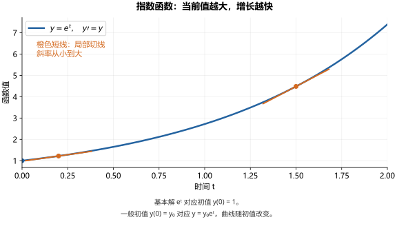

**图中的基本解 $e^t$，也是初值 $y(0)=1$ 下的具体解。** 若初值为 $y(0)=y_0$，应画 $y=y_0e^t$；图中曲线只对应 $y_0=1$。

从基本解的图像得到具体解，在这里就是将 $e^t$ 的纵坐标乘以初值 $y_0$；系数为负时，曲线还会关于横轴翻转。

图中橙色短线是切线：越往右，函数值越大，切线越陡。这把 $y'=y$ 的含义直接画了出来。

#### 指数函数为什么适合求解常系数方程

关键在于**指数函数求导后仍是自身的常数倍，函数形式不变**：

$$
y=e^{rt},\qquad y'=re^{rt},\qquad y''=r^2e^{rt}.
$$

因此，把它代入常系数线性方程 $ay''+by'+cy=0$，所有项都带有同一个因子 $e^{rt}$：

$$
(ar^2+br+c)e^{rt}=0.
$$

除以非零的 $e^{rt}$，就得到特征方程

$$
ar^2+br+c=0.
$$

这样，求导运算变成了对 $r$ 的乘法运算。先求特征根，再组合对应的指数解，就能得到通解。三角函数与双曲函数，正是两类指数解的不同表达形式。

### 三角函数：二阶方程 $y''+y=0$ 的一组基本解

**$\cos t$ 与 $\sin t$ 是方程 $y''+y=0$ 的一组基本解。** 它们都满足方程，且线性无关，因此全部解都能写成 $y=C_1\cos t+C_2\sin t$。

#### 为什么二阶方程要选两个基本解

这里有一个适用于一般阶数的结论：**$n$ 阶齐次线性 ODE，在系数连续、最高阶系数不为零的区间上，有 $n$ 个线性无关的基本解**，通解可以写成

$$
y=C_1y_1+C_2y_2+\cdots+C_ny_n.
$$

为什么是 $n$ 个？因为一条解由某个时刻的 $n$ 个初始数据确定：

$$
y(t_0),\quad y'(t_0),\quad\ldots,\quad y^{(n-1)}(t_0).
$$

可以分别选取 $n$ 条解，让每条解的这组初始数据中只有一项为 $1$，其余为 $0$。齐次线性方程允许把这些解作线性组合，于是 $n$ 个系数就能分别匹配任意给定的 $n$ 项初值。初值问题的唯一性保证，这样得到的组合已经包含所有解。

因此，二阶方程需要两个基本解，分别提供调整初始函数值与初始斜率的两个方向。它们必须线性无关：若第二个只是第一个的常数倍，组合后仍然只剩一个可调系数，就不能匹配任意两项初值。

这里叫**基本解**，不是“特征函数”。常系数方程可以用特征方程寻找基本解，但变系数方程同样可以有一组基本解，后面会用幂级数为 Airy 方程构造两个基本解。特征方程出现重根时，则要用 $te^{rt}$ 等函数补足独立解，不能把相同的指数重复算作两条。

这个结论限定于齐次线性方程。非齐次线性方程要在这组齐次解的组合上加一个特解；一般非线性方程不能这样线性组合。后面介绍的 Airy 方程也是二阶齐次线性方程，因此同样可以用两个独立基本解表示全部解。

#### 从虚指数解得到三角函数

 对方程

$$
y''+y=0,
$$

特征方程为 $r^2+1=0$，根为 $r=\pm i$，对应指数解 $e^{it}$、$e^{-it}$。由 Euler 公式

$$
e^{it}=\cos t+i\sin t,\qquad
e^{-it}=\cos t-i\sin t,
$$

把两式相加、相减，就得到

$$
\cos t=\frac{e^{it}+e^{-it}}2,
\qquad
\sin t=\frac{e^{it}-e^{-it}}{2i}.
$$

所以 $\cos t$、$\sin t$ 不是另外猜出来的函数，而是由两个复指数解组合得到的两个独立实解。实通解因此写成

$$
y=C_1\cos t+C_2\sin t.
$$

#### 用初值分别确定余弦与正弦

**余弦函数：**

$$
\begin{cases}y''+y=0,\\y(0)=1,\quad y'(0)=0,\end{cases}
\quad\Longrightarrow\quad y(t)=\cos t.
$$

**正弦函数：**

$$
\begin{cases}y''+y=0,\\y(0)=0,\quad y'(0)=1,\end{cases}
\quad\Longrightarrow\quad y(t)=\sin t.
$$

这两个初值问题使用同一个通解 $y=C_1\cos t+C_2\sin t$。对它求导，得到

$$
y'=-C_1\sin t+C_2\cos t,
\qquad y(0)=C_1,\quad y'(0)=C_2.
$$

因此，初值 $(y(0),y'(0))=(1,0)$ 选出余弦函数，初值 $(0,1)$ 选出正弦函数。若给的是一般初值 $(y_0,v_0)$，解就是 $y=y_0\cos t+v_0\sin t$。

#### 物理意义与图像

**$y''=-y$：加速度始终指向平衡位置。** 它对应选定单位后的无阻尼弹簧振动：位移为正时加速度为负，位移为负时加速度为正，质点在回复力作用下往复运动。因此，解呈正弦或余弦形态。$y=\cos t$ 表示从单位位移处静止释放，$y=\sin t$ 表示从平衡位置以单位速度出发。

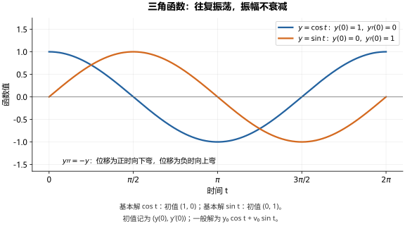

**图中两个基本解分别对应两组初值：** $\cos t$ 对应 $(y(0),y'(0))=(1,0)$，$\sin t$ 对应 $(0,1)$。一般初值 $(y_0,v_0)$ 选出的解是 $y=y_0\cos t+v_0\sin t$，应画组合后的曲线；其振幅不一定为 $1$。

例如初值 $(1,2)$ 给出 $y=\cos t+2\sin t$：在每个 $t$ 处，把余弦曲线的纵坐标与正弦曲线纵坐标的两倍相加，就得到具体解的曲线，而不是把两张基本解图并排放在一起。

两条曲线起点和起始斜率不同，但始终在 $-1$ 与 $1$ 之间振荡。曲线在正位移处向下弯、负位移处向上弯，对应 $y''=-y$。

### 双曲函数：二阶方程 $y''-y=0$ 的一组基本解

**$\cosh t$ 与 $\sinh t$ 是方程 $y''-y=0$ 的一组基本解。** 它们都满足方程，且线性无关，因此全部解都能写成 $y=C_1\cosh t+C_2\sinh t$。基本解的选取并不唯一：$e^t$ 与 $e^{-t}$ 也是这个方程的一组基本解，两组函数能够相互线性组合，表示的是同一个解族。

#### 从实指数解得到双曲函数

 对方程

$$
y''-y=0,
$$

特征方程为 $r^2-1=0$，根为 $r=\pm1$，对应指数解 $e^t$、$e^{-t}$。它们的和与差定义了双曲函数：

$$
\cosh t=\frac{e^t+e^{-t}}2,
\qquad
\sinh t=\frac{e^t-e^{-t}}2.
$$

反过来，$e^t=\cosh t+\sinh t$、$e^{-t}=\cosh t-\sinh t$，因此

$$
Ae^t+Be^{-t}
=(A+B)\cosh t+(A-B)\sinh t.
$$

把两个系数重新记为 $C_1,C_2$，就得到

$$
y=C_1\cosh t+C_2\sinh t.
$$

两种情形遵循同一条路线：**指数函数的求导性质 → 特征方程 → 指数解 → 更方便的实函数表示**。虚指数借助 Euler 公式写成三角函数，实指数的和与差写成双曲函数；底层的求解方法是相同的。

这里两组特征根都不同，分别提供两个独立的指数解；改写成和与差不会丢掉任何一个解。之所以保留两个可调系数，是因为二阶方程要分别匹配初始位置和初始速度。采用三角或双曲函数形式后，都有 $y(0)=C_1$、$y'(0)=C_2$，所以这种写法尤其方便。

#### 用初值分别确定双曲余弦与双曲正弦

把方程中的 $+y$ 改为 $-y$，相同的两组初值就分别选出双曲余弦和双曲正弦：

**双曲余弦函数：**

$$
\begin{cases}y''-y=0,\\y(0)=1,\quad y'(0)=0,\end{cases}
\quad\Longrightarrow\quad y(t)=\cosh t=\frac{e^t+e^{-t}}2.
$$

**双曲正弦函数：**

$$
\begin{cases}y''-y=0,\\y(0)=0,\quad y'(0)=1,\end{cases}
\quad\Longrightarrow\quad y(t)=\sinh t=\frac{e^t-e^{-t}}2.
$$

同样，通解 $y=C_1\cosh t+C_2\sinh t$ 的导数为 $y'=C_1\sinh t+C_2\cosh t$，所以也有 $y(0)=C_1$、$y'(0)=C_2$。两组初值分别选出 $\cosh t$ 和 $\sinh t$；一般初值 $(y_0,v_0)$ 则给出 $y=y_0\cosh t+v_0\sinh t$。

#### 物理意义与图像

**$y''=y$：加速度与位移方向相同。** 若把 $y$ 看成位移，那么位移为正时加速度为正，位移为负时加速度为负，作用力推动物体继续偏离原点。初值 $y(0)=1$、$y'(0)=0$ 选出 $y=\cosh t$：从单位位移处静止出发，随后向外加速；初值 $y(0)=0$、$y'(0)=1$ 选出 $y=\sinh t$：从原点以单位速度出发，偏离后继续加速。因此，对 $t>0$，这两个函数都向外增长，没有三角函数那样的往复振荡。这里描述的是方程 $y''=y$ 本身；前面的过阻尼弹簧是另一个方程，其完整解还带有衰减因子。

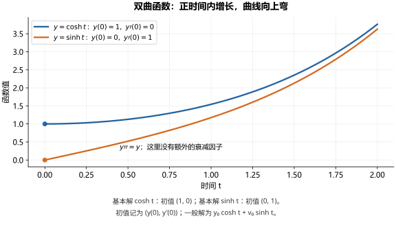

**图中两个基本解分别对应两组初值：** $\cosh t$ 对应 $(y(0),y'(0))=(1,0)$，$\sinh t$ 对应 $(0,1)$。一般初值 $(y_0,v_0)$ 选出的解是 $y=y_0\cosh t+v_0\sinh t$，应画组合后的曲线。图中两条基本解在 $t>0$ 都增长，不代表所有初值下的解都增长；例如初值 $(1,-1)$ 给出衰减解 $y=e^{-t}$。

同样，先由初值求出两个系数，再逐点组合图中的函数值。下面的初值 $(1,-1)$ 会给出 $y=\cosh t-\sinh t$，说明组合后的曲线可以与两条基本解各自的形状很不相同。

蓝线从 $1$ 出发且初始切线水平，橙线从 $0$ 出发且初始斜率为 $1$。对 $t>0$，两者为正且向上弯，斜率逐渐增大，对应 $y''=y$。

### 双曲函数都增长，为什么通解又含有衰减模式？

这里讨论的是方程 $y''=y$，并且只看 $t\ge0$。前面画出的 $\cosh t$ 和 $\sinh t$ 确实都在增长。但通解是

$$
y=C_1\cosh t+C_2\sinh t,
$$

其中系数可以为负，所以实际解也可以是两个函数相减。**两个函数都增长，不代表它们的差也增长。关键要看哪些部分被抵消了。**

先看最直接的例子：

$$
\begin{aligned}
\cosh t-\sinh t
&=\frac{e^t+e^{-t}}2-\frac{e^t-e^{-t}}2\\
&=e^{-t}.
\end{aligned}
$$

两个函数中都有同样的 $e^t/2$，相减后，增长的部分恰好消失，只剩下衰减的 $e^{-t}$。**在初值问题中，应先给定初值，再由初值求出组合系数。** 例如，给定

$$
y''=y,\qquad y(0)=1,\quad y'(0)=-1.
$$

将通解及其导数写出：

$$
y=C_1\cosh t+C_2\sinh t,\qquad
y'=C_1\sinh t+C_2\cosh t.
$$

由于 $\cosh0=1$、$\sinh0=0$，代入 $t=0$ 和给定初值，得到

$$
y(0)=C_1=1,\qquad y'(0)=C_2=-1.
$$

**所以由初值求得 $C_1=1$、$C_2=-1$**，再代回通解，才得到

$$
y(t)=\cosh t-\sinh t=e^{-t}.
$$

也就是说，这里的“相减”是初值决定的：初值选出了恰好能抵消增长部分的两个系数。

**若 $t$ 是时间、$y$ 是位移，这表示什么运动？** 在这里选定的单位下，物体开始位于原点右侧 $1$ 个单位处，以大小为 $1$ 的速度向左运动。由于 $y''=y>0$，加速度向右，使它向左的速度逐渐减小。这个初始速度恰好使物体一直靠近原点，位置和速度都趋于零；它不会在有限时间内到达原点，也不会提前转向。这种减速来自向外的力与当前速度方向相反，不是摩擦阻尼耗能。

### 从基本解图像和初值确定解曲线：怎样研究具体解的性质

基本解的图像告诉我们有哪些函数可以用来组合，初值则决定怎样组合。**先由初值确定系数，再把基本解在同一时刻的函数值相加，就得到一条具体解曲线。** 下面用一个同时含有正弦和余弦的例子说明。

给定初值问题

$$
y''+y=0,\qquad y(0)=1,\quad y'(0)=2.
$$

这个方程的基本解是 $\cos t$ 和 $\sin t$，所以先写通解及其导数：

$$
y(t)=C_1\cos t+C_2\sin t,\qquad
y'(t)=-C_1\sin t+C_2\cos t.
$$

在 $t=0$ 时，$\cos0=1$、$\sin0=0$，因此 $y(0)=C_1=1$、$y'(0)=C_2=2$。初值选出的具体解就是

$$
\boxed{y(t)=\cos t+2\sin t.}
$$

图中左侧是两个基本解；右侧把正弦的纵坐标放大到原来的两倍，再与余弦的纵坐标相加，得到红色的解曲线。**相加的是同一时刻的纵坐标。** 例如，$t=\pi/2$ 时，$\cos t=0$、$2\sin t=2$，所以解曲线经过 $(\pi/2,2)$。

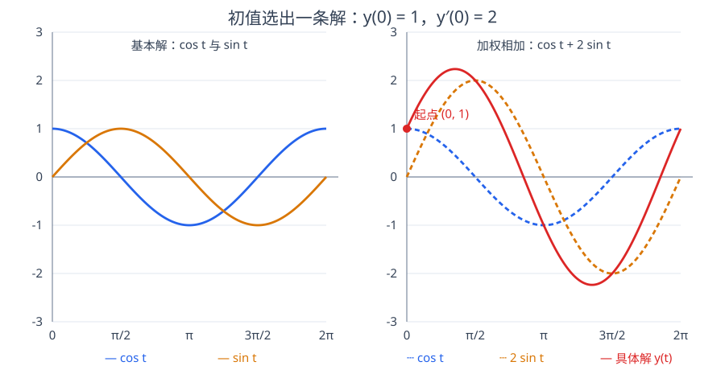

红色曲线从 $(0,1)$ 出发，初始斜率为 $2$，所以一开始向上走。曲线的最大值并不是两个函数各自最大值的简单相加，因为它们并不在同一时刻达到最大值。

得到这条曲线后，可以怎样研究它的性质？

| 要研究的性质 | 在这个例子中怎样判断 |
| --- | --- |
| 从哪里出发、开始向哪边走 | $y(0)=1$、$y'(0)=2>0$，所以从高度 $1$ 出发并开始上升 |
| 什么时候上升或下降 | 看 $y'(t)=-\sin t+2\cos t$ 的符号；正时上升，负时下降 |
| 什么时候达到峰值 | 第一次 $y'=0$ 在 $t=\arctan 2\approx1.11$；此处导数从正变负，得到峰值 $\sqrt5\approx2.24$ |
| 曲线怎样弯曲 | 方程给出 $y''=-y$：曲线在横轴上方时斜率减小，在横轴下方时斜率增大 |
| 是否振荡、长期是否增长 | 正弦和余弦都以 $2\pi$ 为周期，这个解也以 $2\pi$ 为周期，始终在 $[-\sqrt5,\sqrt5]$ 内振荡 |

图像帮助我们看见起点、峰值和振荡；导数与方程则说明这些现象为什么发生。对其他线性齐次方程，也可以沿用这个顺序：**认识基本解 → 用初值确定组合系数 → 画出具体解 → 分析增减、弯曲、零点和长期行为。** 前一节的双曲函数例子还提醒我们，组合时可能发生抵消，必须研究初值选出的整条解曲线。

## 七、特殊函数：从幂级数到基本解与性质

本章先用指数函数说明怎样通过极限定义函数，再用 sinc 与正弦积分说明怎样通过积分定义函数。当初等函数不足以表示 ODE 的解时，还可以用幂级数构造新函数，再研究它们的基本解、图像、零点和远处行为。Airy、Bessel、Legendre 函数都可沿着“方程 → 级数或标准定义 → 基本解 → 条件选出的具体解 → 性质”的路线理解。

十八世纪已有特殊函数研究的先例；十九世纪随着振动、热传导、天文学和数学物理的发展，它们成为系统的研究对象。无法由已有初等函数拼成，不妨碍一个解被精确定义和深入研究。

### 用极限定义函数：指数函数的另一种构造

**函数也可以由一列函数的极限定义。** 对每个固定的 $t$，先计算一列近似值；如果它们收敛，就把极限值作为新函数在 $t$ 处的值。这里用极限确定整个定义域内的函数值，而不只是给某个未定义的点补上一个值。

例如，对任意实数 $t$，可以定义

$$
E(t)=\lim_{n\to\infty}\left(1+\frac{t}{n}\right)^n,
\qquad n\in\mathbb{N}.
$$

对固定的 $t$，当 $n$ 足够大时，底数 $1+t/n$ 为正；可以证明这个极限对每个实数 $t$ 都存在。每个有限的 $n$ 给出一个近似函数，取极限后才得到 $E$。例如在 $t=1$ 处，$n=1,2,4$ 时的值分别为 $2$、$2.25$、$2.44140625$；继续增大 $n$，就趋近于 $e\approx2.71828$。

这个式子也有累积变化的含义：把总长度为 $t$ 的变化分成 $n$ 份，每份按因子 $1+t/n$ 更新，连续更新 $n$ 次；分得越来越细，就得到连续增长的极限（这里的增长解释取 $t\ge0$）。

由这个极限定义可以进一步证明

$$
E(0)=1,\qquad E'(t)=E(t).
$$

因此，$E$ 与第七章由初值问题 $y'=y$、$y(0)=1$ 确定的指数函数相同，即 $E(t)=e^t$。同一个函数可以从微分方程出发定义，也可以从极限出发构造；两种方式揭示了它的不同性质。使用极限定义时，需要确认每一点的极限存在；极限函数是否连续、可导，则还需要进一步论证。

### 用积分定义函数：sinc 与正弦积分

**函数也可以直接由积分定义，不必先有一个初等函数公式，再去求它的积分。** 只要对定义域内的每个自变量，积分都存在并给出唯一的数值，就建立了从自变量到函数值的对应关系。这里的积分号本身就是定义的一部分；能否把积分化成初等表达式，是定义之后的另一个问题。

积分中可以让自变量出现在被积函数里，也可以让它成为积分上限。先看前一种方式：采用不带 $\pi$ 的 sinc 约定，令

$$
\operatorname{sinc}(t)=\int_0^1\cos(st)\,ds.
$$

这里的积分变量是 $s$，所以积分时把 $t$ 看作固定的常数。当 $t\ne0$ 时，由链式法则，

$$
\frac{d}{ds}\sin(st)=t\cos(st).
$$

因此，要让求导结果恰好是 $\cos(st)$，就需要除以 $t$：

$$
\frac{d}{ds}\left(\frac{\sin(st)}{t}\right)=\cos(st),
\qquad
\int\cos(st)\,ds=\frac{\sin(st)}{t}+C.
$$

再代入积分上下限 $s=1$ 和 $s=0$，得到

$$
\operatorname{sinc}(t)=\left[\frac{\sin(st)}{t}\right]_{s=0}^{s=1}
=\frac{\sin t-\sin0}{t}=\frac{\sin t}{t}.
$$

当 $t=0$ 时，直接由积分得到 $\operatorname{sinc}(0)=\int_0^1 1\,ds=1$。

**连续延拓是什么意思？** 原来的表达式 $\sin t/t$ 在 $t=0$ 处分母为零，不能直接代入，但它在零点附近有确定的极限：

$$
\lim_{t\to0}\frac{\sin t}{t}=1.
$$

于是保持其他点的函数值不变，只在原来没有定义的零点补上这个极限值：

$$
\operatorname{sinc}(t)=
\begin{cases}
\dfrac{\sin t}{t}, & t\ne0,\\
1, & t=0.
\end{cases}
$$

补好以后，函数在零点也连续了，这就叫在零点作连续延拓。这里不能随便补一个数；只有补 $1$ 才能与附近的极限一致。上面的积分定义直接完成了这一步。

**归一化约定是什么意思？** 这里是指重新选择自变量的尺度，让公式的特征位置落在方便的数值上。信号处理中常把自变量换成 $\pi t$，定义

$$
\operatorname{sinc}_{\mathrm{norm}}(t)=
\begin{cases}
\dfrac{\sin(\pi t)}{\pi t}, & t\ne0,\\
1, & t=0.
\end{cases}
$$

它与本文的定义满足 $\operatorname{sinc}_{\mathrm{norm}}(t)=\operatorname{sinc}(\pi t)$。不带 $\pi$ 时，非零零点在 $\pm\pi,\pm2\pi,\ldots$；带 $\pi$ 后，零点在 $\pm1,\pm2,\ldots$，便于配合整数采样位置。这里调整的是横轴尺度，不是把函数的最大值或积分改成 $1$；两种定义在零点的值本来都是 $1$。不同资料可能都把它们记作 sinc，所以使用前要看清定义。本节继续采用不带 $\pi$ 的版本。

再看自变量作为积分上限的方式。对每个 $t$，把 sinc 从零积分到 $t$ 所得的数值作为新函数在 $t$ 处的值，就定义了**正弦积分函数**：

$$
\operatorname{Si}(t)=\int_0^t\operatorname{sinc}(s)\,ds
=\int_0^t\frac{\sin s}{s}\,ds,
$$

其中被积函数在 $s=0$ 处取连续延拓值 $1$。sinc 和 $\operatorname{Si}$ 是不同的函数：前者可写成初等函数之比，后者不能用初等函数表示，却有明确的积分定义。由微积分基本定理，它也满足

$$
\operatorname{Si}'(t)=\operatorname{sinc}(t),\qquad \operatorname{Si}(0)=0.
$$

**这个积分就是正弦积分函数的精确定义，而不是等待化简的临时表达式。** 它给出了每个实数 $t$ 对应的函数值，也可以直接用于数值计算；没有初等表达式，并不妨碍我们定义、研究和画出这个函数。上面的导数关系还说明，积分定义与微分方程定义可以刻画同一个函数。

### 幂级数法：从系数递推到函数图像

**幂级数法的想法是：先在一个点附近，把未知的解写成一串不断增加项的多项式。** 比如在 $t=0$ 附近，写成

$$
y(t)=a_0+a_1t+a_2t^2+a_3t^3+\cdots.
$$

这些系数一开始不知道。把这串式子代回微分方程，比较两边同次幂的项，就能找出系数之间的关系，再结合初值逐个算出系数。实际计算和画图时，先取前几项得到一个多项式，用它近似原来的解。

#### 什么情况下适合用？

**当解在选定点附近能用收敛的幂级数表示时，这个方法就有用。** “收敛”是说不断加上后面的项，结果会趋向一个确定的值，而这串级数在一定范围内恰好等于原来的解。这种能在局部用幂级数表示的性质，叫作“解析”。

有些方程能事先保证这一点。例如，线性方程整理好以后，如果系数和右端在展开点附近都能写成收敛幂级数，而且最高阶导数前的系数不为零，那么解在这个点附近也能这样展开。下面的 Airy 方程就属于这种情况。**非线性方程也可能适用**：对于 $y'=f(t,y)$，如果右端在初始位置附近对 $t$ 和 $y$ 都解析，也有局部的适用保证。

所以，判断能不能用，不能只看“线性还是非线性”，还要看方程在展开点附近的情况。这个方法尤其适合没有熟悉解公式、但想研究某个点附近的解或计算附近函数值的问题。

#### 局限在哪里？

**第一，不是所有解都能写成幂级数。** 有的解在展开点附近不够光滑，有的即使能求任意多次导数，也不等于自己的 Taylor 级数。比如 $y'=|t|$、$y(0)=0$ 的解在零点两侧形状不同，就不能用一串普通幂级数表示零点附近的整段解。遇到方程的奇点，例如最高阶导数前的系数变成零，也不能直接照搬上面的保证，有时要改用其他形式的级数。

**第二，一个点附近的展开，不一定能用到很远。** 例如 $y'=y^2$、$y(0)=1$ 的解是 $1/(1-t)$，在零点展开为 $1+t+t^2+\cdots$，但这串级数只在 $|t|<1$ 时收敛。即使原来的解在 $t=-2$ 处有值，这个展开也不能直接拿来计算。因此，算出系数后，还要弄清级数在哪个范围内有效；需要更远处的值时，可能要换一个展开点。

**第三，实际只能算有限项，近似精度需要检查。** 在收敛范围内，增加项数最终可以改善近似，但前几项不一定就够用，尤其是靠近收敛范围的边缘时。复杂方程的系数也可能越来越难算。因此，递推出系数只是一步，还需要确认级数确实代表解，并检查截断后的误差，才能放心计算和画图。

下面用 Airy 方程演示这个过程：把解写成级数，由方程递推系数，再取有限项画出近似曲线。

### 利用幂级数法解 Airy 方程

#### 先认识 Airy 方程

本节用 Airy 方程演示幂级数法：

$$
y''-ty=0.
$$

它是一个二阶线性齐次变系数方程。写成 $y''=ty$，它表示函数的弯曲程度由当前位置 $t$ 和函数值 $y$ 共同决定。前面的 $y''=-y$ 对应三角函数 $\cos t$、$\sin t$，$y''=y$ 对应双曲函数 $\cosh t$、$\sinh t$。这些熟悉的函数分别是相应方程的基本解。与前两个方程相比，Airy 方程的关键变化是系数 $t$ 随自变量变化，并会变号：

- 当 $t<0$ 时，$y''=-|t|y$，弯曲方向与函数值的符号相反，类似振动方程，解呈振荡形态。
- 当 $t>0$ 时，$y''=|t|y$，存在衰减与增长两种基本行为；这一性质将在下一章结合渐近公式解释，不能仅凭二阶导数与函数值同号就断言。
- $t=0$ 连接两类行为，称为转折点。它不是方程的奇点：最高阶系数始终为 $1$，解仍然光滑。

因此，Airy 方程常用来描述**波在振荡区域与衰减区域之间的过渡**。Airy 在 1838 年研究光学焦散附近的光强，相关理论与虹附近的衍射有关。另一个例子是量子力学：在简单转折点附近，若势能随位置的变化近似为线性，定态波函数方程经平移、缩放后就能化成 Airy 方程。这里的 $t$ 常表示缩放后的空间坐标，不一定是时间，$y''$ 也不一定表示加速度。

#### 用 Airy 方程推导系数

考虑带初值的 Airy 方程：

$$
\begin{cases}
y''(t)=t\,y(t),\\
y(0)=y_0,\qquad y'(0)=v_0.
\end{cases}
$$

这里先把初始函数值 $y_0$ 和初始斜率 $v_0$ 保留为参数，推导适用于任意初值的公式；最后再取 $y_0=1$、$v_0=2$ 算一个具体例子。若不指定这两个参数的数值，得到的就是整个解族。

它是变系数线性方程。若像常系数情形一样试取 $y=e^{rt}$，其中 $r$ 为常数，求导得到

$$
y'=re^{rt},\qquad y''=r^2e^{rt}.
$$

代入 $y''-ty=0$：

$$
r^2e^{rt}-te^{rt}=0,
\qquad (r^2-t)e^{rt}=0.
$$

因为 $e^{rt}\ne0$，两边除以它，就要求

$$
r^2-t=0,\qquad r^2=t.
$$

但 $r$ 是固定常数，$t$ 却在区间内变化，这个等式不可能始终成立。因此改用幂级数，设

$$
y(t)=\sum_{n=0}^{\infty}c_nt^n
=c_0+c_1t+c_2t^2+c_3t^3+\cdots.
$$

求两次导数并重新编号，得到

$$
y''(t)=\sum_{n=0}^{\infty}(n+2)(n+1)c_{n+2}t^n.
$$

右边则为

$$
ty(t)=\sum_{n=1}^{\infty}c_{n-1}t^n.
$$

比较同次幂的系数：右边没有常数项，所以 $2c_2=0$；对于 $n\ge1$，

$$
(n+2)(n+1)c_{n+2}=c_{n-1},\qquad
c_{n+2}=\frac{c_{n-1}}{(n+2)(n+1)}.
$$

**为什么只需要给出 $c_0$ 和 $c_1$？** 先把 $t=0$ 代入级数，所有含 $t$ 的项都消失，所以 $y(0)=c_0$。再求一次导数，

$$
y'(t)=c_1+2c_2t+3c_3t^2+\cdots,
$$

代入 $t=0$ 就得到 $y'(0)=c_1$。结合开头给定的初值，有

$$
c_0=y_0,\qquad c_1=v_0.
$$

因此，前两个系数由题目中的初值确定，并不是在推导过程中另加条件。

剩下的系数不能自由选择，因为它们必须满足方程给出的递推关系。把递推式换一种编号方式，写成

$$
c_j=\frac{c_{j-3}}{j(j-1)},\qquad j\ge3.
$$

它表示：**每个新系数由往前三位的系数决定**。于是系数分成三条依次计算的链：

$$
c_0\longrightarrow c_3\longrightarrow c_6\longrightarrow\cdots,
$$

$$
c_1\longrightarrow c_4\longrightarrow c_7\longrightarrow\cdots,
$$

$$
c_2=0\longrightarrow c_5=0\longrightarrow c_8=0\longrightarrow\cdots.
$$

第三条链的起点 $c_2$ 已经由方程确定为零。因此，只要初值给出 $c_0$、$c_1$，三条链的起点就全部确定，其余系数都能递推出来：

$$
c_2=0,\quad c_3=\frac{c_0}{6},\quad c_4=\frac{c_1}{12},\quad
c_5=0,\quad c_6=\frac{c_0}{180},\quad c_7=\frac{c_1}{504},\ldots.
$$

把属于 $c_0$、$c_1$ 的项分别整理，得到

$$
y(t)=c_0\left(1+\frac{t^3}{6}+\frac{t^6}{180}+\cdots\right)
+c_1\left(t+\frac{t^4}{12}+\frac{t^7}{504}+\cdots\right).
$$

把两个括号分别记为 $u(t)$、$v(t)$，先把表达式简写成 $y=c_0u+c_1v$。**这一步只是命名，不是说任意两个括号都能成为基本解。** 这里还要说明三件事。

**它们分别满足原方程。** 上面的系数递推来自 $y''=ty$，而 $c_0,c_1$ 可以自由选择。取 $c_0=1,c_1=0$，得到的就是 $y=u$；取 $c_0=0,c_1=1$，得到的就是 $y=v$。两组系数都满足同一个递推关系，因此分别给出原方程的解。这里的无穷级数确实收敛并可逐项求导，不能只凭形式上的展开就断言它是解。

**它们彼此独立。** 从展开式读出

$$
u(0)=1,\quad u'(0)=0,
\qquad v(0)=0,\quad v'(0)=1.
$$

如果 $v=Cu$，代入 $t=0$ 就得到 $C=0$，但这又会使 $v'(0)=0$，与 $v'(0)=1$ 矛盾。因此，两条解不可能是彼此的常数倍。

**它们的组合能表示全部解。** 对任意初值 $y(0)=y_0$、$y'(0)=v_0$，齐次线性方程的叠加原理保证

$$
y=y_0u+v_0v
$$

仍然满足方程，而且它的初始值恰好是 $y_0$、$v_0$。初值问题的唯一性保证，这就是该初值对应的解。所以 $u,v$ 构成一组基本解，$y=c_0u+c_1v$ 是通解。

#### 这两个基本解的幂级数在哪个范围内有效？

**这与幂级数的收敛半径直接有关。** 可以把展开点想成中心，收敛半径告诉我们：离这个中心多远，级数仍然能够收敛。这里的系数已经按 Airy 方程的要求递推出来；在收敛区间内，幂级数可以逐项求导，代回方程就满足等式。因此，收敛半径决定了这组级数解能表示多大范围内的解。

如果收敛半径是有限的，那么半径以内可以使用，半径以外级数就会发散；边界上的点需要另外检查。超出这个范围，不代表原来的解一定不存在，只是当前这个展开式不能继续用了，可能需要换一个展开点。

**Airy 方程这里得到的两个基本解 $u(t)$、$v(t)$，收敛半径都是无穷大。** 因此，虽然它们是在零点展开的，完整级数却能表示整个实数轴上的解，而不只是零点附近的一小段。它们的线性组合 $y=c_0u+c_1v$ 也同样有效。

**收敛半径说的是完整无穷级数的有效范围，不是前几项近似的准确范围。** 即使收敛半径是无穷大，只取前几项，也通常只能在展开点附近得到较好的近似。离零点越远，为达到同样的精度往往需要更多项，还要留意计算中的舍入误差。因此，“完整级数在这里有效”和“当前保留的项数已经够用”，需要分别判断。

现在取开头约定的具体初值 $y_0=1$、$v_0=2$，也就是求解

$$
y''=ty,\qquad y(0)=1,\quad y'(0)=2,
$$

初值给出 $c_0=1$、$c_1=2$，所以 $y=u+2v$。把前面两个括号的展开式分别代入：

$$
\begin{aligned}
y
&=u+2v\\
&=\left(1+\frac{t^3}{6}+\frac{t^6}{180}+\cdots\right)
+2\left(t+\frac{t^4}{12}+\frac{t^7}{504}+\cdots\right)\\
&=1+\frac{t^3}{6}+\frac{t^6}{180}
+2t+\frac{2t^4}{12}+\frac{2t^7}{504}+\cdots\\
&=1+2t+\frac{t^3}{6}+\frac{t^4}{6}
+\frac{t^6}{180}+\frac{t^7}{252}+\cdots.
\end{aligned}
$$

最后一步用了 $2/12=1/6$、$2/504=1/252$，并按 $t$ 的幂次从低到高排列。

Airy 方程的这个级数对所有有限实数 $t$ 都收敛。无穷级数是精确表示，截断后的有限多项式是近似。此时我们已经求出了一个完整的解族，还没有给其中的标准解命名。

#### 从展开式得到图像

**这里画的是初值 $y(0)=1$、$y'(0)=2$ 所确定的一条解。** 方程本身有一族解；只有把初值也指定下来，才确定这里要画的具体曲线。基本解本身当然也满足方程，但画出一组基本解，与画出某个初值问题的解，是两个不同的任务。

**这与前面画出的正弦、余弦图像有什么区别？** 对方程 $y''+y=0$，$\sin t$、$\cos t$ 是一组基本解，但它们各自的图像也对应特定的初始条件：

$$
\begin{aligned}
y(0)=0,\quad y'(0)=1&\quad\Longrightarrow\quad y=\sin t,\\
y(0)=1,\quad y'(0)=0&\quad\Longrightarrow\quad y=\cos t.
\end{aligned}
$$

所以，前面画 $\sin t$ 时，既是在展示一个基本解的形状，也是在展示初值为 $(0,1)$ 的具体解。若初值改为 $y(0)=1$、$y'(0)=2$，对应的解就变成 $y=\cos t+2\sin t$，应画这条组合后的曲线，不能仍用单独的正弦或余弦图像代表它。

**“基本解”强调它在表示整个解族时的作用，“初值问题的解”强调它满足哪一组给定条件；同一个函数可以同时具有这两个身份。** 前面的图重点展示标准基本解，这里的图则重点展示：给定初值以后，怎样直接用级数算出并画出那一条确定的解。

我们直接使用刚刚得到的级数：

$$
y(t)=1+2t+\frac{t^3}{6}+\frac{t^4}{6}+\frac{t^6}{180}+\frac{t^7}{252}+\cdots.
$$

这里也遵循“基本解—初值系数—具体曲线”的思路：前面已经得到 $y=u+2v$，可以逐点计算 $u(t)+2v(t)$ 来画图。实际计算还有一个等价做法：把组合后的级数直接求和。只需从初值确定 $c_0=1$、$c_1=2$，再用 $c_2=0$ 和递推式 $c_n=c_{n-3}/[n(n-1)]$（$n\ge3$）逐项计算即可。这两种算法得到同一条曲线：前者先计算基本解再组合，后者直接计算已经合并的级数。

**怎样得到一个点？** 例如在 $t=1$ 处，保留到七次项：

$$
y(1)\approx1+2+\frac16+\frac16+\frac1{180}+\frac1{252}
\approx3.342857.
$$

继续加入高次项，可得到 $y(1)\approx3.342979$。对许多 $t$ 重复这个过程，就得到一组坐标 $(t,y(t))$，把它们连接起来就是解曲线的近似图像。

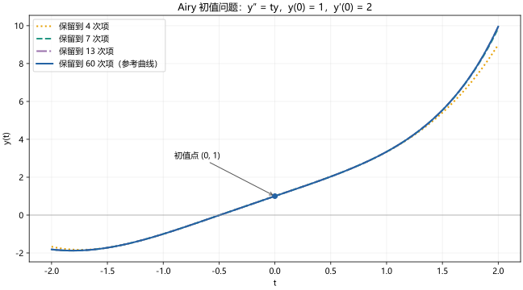

图中各条曲线都在近似**同一个初值问题的解**，区别只是保留的级数项数不同。曲线经过 $(0,1)$，起始斜率为 $2$；增加项数后，在图示区间内近似逐渐改善。无穷级数表示精确解，图中用有限项计算的曲线仍是近似。

画图时应增加截断阶数，检查所关心区间内的数值是否稳定。远离展开中心时，可能需要更多项和更高精度；存在大数相减时，单纯增加项数也不能消除舍入误差。下一章继续讨论怎样选取标准基本解，以及怎样研究它们的图像和性质。

幂级数不仅给出 Airy 方程的一组基本解 $u,v$，也让我们能从初值直接计算一条具体解。接下来把它们换成标准基本解 Ai、Bi，继续研究图像与长期行为。这里要区分**函数怎么表示**与**函数是否光滑**：不能写成初等函数的解，完全可能光滑，甚至可展开为收敛幂级数。

### Airy 函数：标准基本解 Ai 与 Bi

上一章已经求解了 Airy 方程

$$
y''-ty=0,
$$

并画出了初值 $y(0)=1$、$y'(0)=2$ 对应的解。本节按同一条思路重新认识它：**先确定标准基本解 Ai、Bi，认识它们的图像；再用初值求组合系数，得到具体解的曲线；最后利用系数判断解的增长与衰减。**

#### 先认识基本解：Ai、Bi 是什么

**Ai 和 Bi 是两个具体的 Airy 函数；“基本解”是它们在方程中的作用。** 它们都满足 Airy 方程，且线性无关，任意解都能写成

$$
y=C_1\operatorname{Ai}(t)+C_2\operatorname{Bi}(t).
$$

这与前面熟悉的函数对应：

| 方程 | 常用的一组基本解 |
| --- | --- |
| $y''+y=0$ | $\cos t$、$\sin t$ |
| $y''-y=0$ | $\cosh t$、$\sinh t$ |
| $y''-ty=0$ | $\operatorname{Ai}(t)$、$\operatorname{Bi}(t)$ |

上一章构造的 $u,v$ 也是 Airy 方程的一组基本解：

$$
u(t)=1+\frac{t^3}{6}+\frac{t^6}{180}+\cdots,\qquad
v(t)=t+\frac{t^4}{12}+\frac{t^7}{504}+\cdots.
$$

它们的初值分别为 $(1,0)$、$(0,1)$，方便直接写出 $y=y_0u+v_0v$。**换成 Ai、Bi，是为了让基本解分别呈现向右衰减和增长的行为，方便分析具体解的性质。** 这类似把 $\cosh t,\sinh t$ 换成 $e^{-t},e^t$：方程的解族没变，只是换了一组便于使用的函数。

#### 标准基本解怎样定义，初值从哪里来

仅说“选一条衰减解”还不能确定具体函数：$f$ 衰减，$2f$ 也衰减。增长解同样不唯一。因此，还要给出明确的系数，才能固定 Ai、Bi 这两个名称所指的函数。

我们先独立给出两个正数：

$$
a=\frac{1}{3^{2/3}\Gamma(2/3)},\qquad
b=\frac{1}{3^{1/3}\Gamma(1/3)},
$$

其中 Gamma 函数由积分定义：

$$
\Gamma(s)=\int_0^\infty x^{s-1}e^{-x}\,dx,\qquad s>0.
$$

因此，不需要先知道 Ai、Bi，就能计算 $a,b$。采用标准约定，**定义**

$$
\operatorname{Ai}(t)=a\,u(t)-b\,v(t),\qquad
\operatorname{Bi}(t)=\sqrt3a\,u(t)+\sqrt3b\,v(t).
$$

再代入 $u(0)=1,v(0)=0,u'(0)=0,v'(0)=1$，得到：

| 基本解 | $y(0)$ | $y'(0)$ |
| --- | --- | --- |
| $\operatorname{Ai}$ | $a\approx0.3550280539$ | $-b\approx-0.2588194038$ |
| $\operatorname{Bi}$ | $\sqrt3a\approx0.6149266274$ | $\sqrt3b\approx0.4482883574$ |

**这些初值来自标准定义，不能仅凭微分方程的系数递推确定。** 先给常数、再定义函数、最后读取初值，没有用未知的 $\operatorname{Ai}(0)$ 来循环定义 Ai。这样的约定与通常采用的积分表示、渐近公式一致；换用别的系数仍可能得到一组基本解，但不能仍把它们分别叫作 Ai、Bi。

#### 画出基本解：把标准初值代入级数

已有 $u,v$ 的级数和上面的系数，就可以计算 Ai、Bi 的函数值。例如在 $t=1$ 处，保留到七次项：

$$
\operatorname{Ai}(1)\approx
0.3550280539\left(1+\frac16+\frac1{180}\right)
-0.2588194038\left(1+\frac1{12}+\frac1{504}\right).
$$

继续加入高次项，可得到 $\operatorname{Ai}(1)\approx0.1352924163$。对许多 $t$ 重复计算，就能画图。

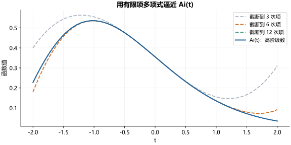

图中不同阶数的截断多项式都在近似同一个函数 Ai，也就是上表第一组标准初值选出的解。离展开中心 $t=0$ 越远，通常需要更多项；实际计算还要检查舍入误差，不能只靠盲目增加项数。

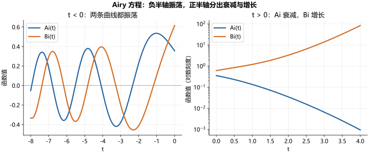

**这张图展示的是两个标准基本解，各自对应上表的一组初值，还不是任意初值问题的答案。** 左图中两者在 $t<0$ 都振荡；右图中，**Ai 向右衰减到零，Bi 向右增长到正无穷**。右图采用对数纵轴，以便同时显示很小与很大的函数值。$t=0$ 虽是系数变号的位置，却不是方程的奇点，两条曲线在这里都光滑。

图像帮助我们认识形状，长期行为还需要分析保证。对上述标准定义的函数，当 $t\to+\infty$ 时，有

$$
\operatorname{Ai}(t)\sim\frac{e^{-\frac23t^{3/2}}}{2\sqrt\pi\,t^{1/4}},\qquad
\operatorname{Bi}(t)\sim\frac{e^{\frac23t^{3/2}}}{\sqrt\pi\,t^{1/4}}.
$$

$f\sim g$ 表示 $f/g\to1$。负指数说明 Ai 衰减，正指数说明 Bi 增长。这是需要证明的渐近性质，不能仅凭定义中一个相减、一个相加就断言；这里引用结果，不展开证明。这些公式见 NIST DLMF 中 Ai 与 Bi 的渐近展开。

#### 用初值确定系数：从基本解到具体解

现在给定初值

$$
y(0)=y_0,\qquad y'(0)=v_0.
$$

将通解和导数写出：

$$
y=C_1\operatorname{Ai}+C_2\operatorname{Bi},\qquad
y'=C_1\operatorname{Ai}'+C_2\operatorname{Bi}'.
$$

代入 $t=0$，使用上表的标准初值，得到

$$
\begin{cases}
aC_1+\sqrt3aC_2=y_0,\\
-bC_1+\sqrt3bC_2=v_0.
\end{cases}
$$

第一式除以 $a$，第二式除以 $b$：

$$
C_1+\sqrt3C_2=\frac{y_0}{a},\qquad
-C_1+\sqrt3C_2=\frac{v_0}{b}.
$$

两式相加求出 $C_2$，相减求出 $C_1$：

$$
C_1=\frac12\left(\frac{y_0}{a}-\frac{v_0}{b}\right),\qquad
C_2=\frac1{2\sqrt3}\left(\frac{y_0}{a}+\frac{v_0}{b}\right).
$$

**系数确定以后，才得到当前初值问题的具体解。** 画图时，在每个 $t$ 处分别计算 Ai、Bi 的值，乘以各自系数，再相加；所得的点连起来，就是这条解的图像。

仍用上一章的初值 $y_0=1,v_0=2$，则

$$
C_1=\frac12\left(\frac1a-\frac2b\right),\qquad
C_2=\frac1{2\sqrt3}\left(\frac1a+\frac2b\right).
$$

**不能直接写成 $\operatorname{Ai}+2\operatorname{Bi}$。** 原来的系数 $1,2$ 对应的是 $u,v$；换成 Ai、Bi 后，要重新计算系数。把两者的定义代回去，可以核对：

$$
\begin{aligned}
y&=C_1(au-bv)+C_2(\sqrt3au+\sqrt3bv)\\
&=a(C_1+\sqrt3C_2)u+b(-C_1+\sqrt3C_2)v\\
&=u+2v.
\end{aligned}
$$


**这张图才对应初值 $(1,2)$，其中不同曲线是同一条解的不同级数截断近似。** 它与上一章的图完全相同：直接计算 $u+2v$，或计算求好系数的 $C_1\operatorname{Ai}+C_2\operatorname{Bi}$，得到的是同一个函数。换基本解，改变的是表示系数，不是实际的解。

#### 一条基本解衰减、一条增长，实际求出的解是哪一种？

**当 $t\to+\infty$ 时，Ai 衰减，Bi 增长。** 选择这组基本解的好处是：有了它们的渐近性质，就能通过组合系数判断具体解的远处行为，不必每换一组初值就重新分析整条级数。

对于 $y=C_1\operatorname{Ai}+C_2\operatorname{Bi}$，首先看增长项的系数 $C_2$：

| 系数条件 | $t\to+\infty$ 时的行为 |
| --- | --- |
| $C_2=0,\ C_1\ne0$ | 只剩 Ai 部分，解衰减到零 |
| $C_2>0$ | Bi 部分最终占主导，$y\to+\infty$ |
| $C_2<0$ | Bi 部分最终占主导，$y\to-\infty$，幅值仍增长 |
| $C_1=C_2=0$ | 恒为零 |

这是远处的结论，不表示混合解从起点开始就一直增长或衰减；有限区间内仍可能出现转向或过零。

刚才的初值 $(1,2)$ 给出 $C_2>0$，所以该解最终向正无穷增长。若要求解向右衰减，就必须令 $C_2=0$，也就是

$$
\frac{y_0}{a}+\frac{v_0}{b}=0
\quad\Longrightarrow\quad
v_0=-\frac ba y_0.
$$

例如保持 $y_0=1$，就应取 $v_0=-b/a\approx-0.729011$，对应 $y=\operatorname{Ai}(t)/\operatorname{Ai}(0)$。这里的小数只是近似；斜率的任何非零偏差都会引入 Bi 分量，在足够远处主导解。

从基本解的形状到具体解的图像，再到长期行为，使用的是同一条线索：**基本解提供可组合的函数，初值确定系数，系数既决定具体曲线，也帮助判断它的性质。**

### Bessel 函数：基本解与圆形鼓膜的例子

#### Bessel 函数：标准基本解 J 与 Y

与 Airy 方程选取 Ai、Bi 类似，Bessel 方程

$$
t^2y''+ty'+(t^2-\nu^2)y=0
$$

在 $t>0$ 上常用的一组基本解是第一类 Bessel 函数 $J_\nu(t)$ 和第二类 Bessel 函数 $Y_\nu(t)$，通解为

$$
y=C_1J_\nu(t)+C_2Y_\nu(t).
$$

这些基本解也可以通过级数法构造，不过原点是方程的奇点，需要使用广义幂级数，第二个独立解还可能包含对数项，这里不展开推导。

这里的 $\nu$ 就是方程中 $t^2-\nu^2$ 里的那个参数，是希腊字母 **nu**，不是英文字母 $v$。它称为 **Bessel 函数的阶数**：$\nu=0$ 对应零阶函数 $J_0,Y_0$，$\nu=1$ 对应一阶函数 $J_1,Y_1$。**这与微分方程的阶数不同：无论 $\nu$ 取什么值，最高导数都是 $y''$，所以这里始终是二阶微分方程。** 固定同一个 $\nu$，$J_\nu$ 与 $Y_\nu$ 才是同一个方程的一组基本解；例如 $J_0$ 与 $J_1$ 分别对应参数 $\nu=0$ 和 $\nu=1$ 的两个方程。

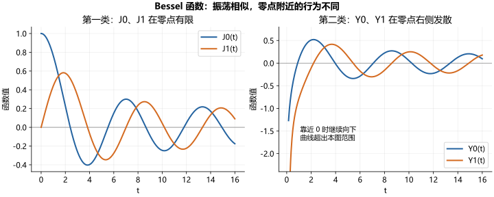

图中展示零阶、一阶的标准函数，主要看两点：

- **原点附近不同：** $J_0(0)=1$、$J_1(0)=0$，都保持有限；$Y_0$、$Y_1$ 在 $t\to0^+$ 时向负无穷发散。
- **向右都呈振荡：** 远处的振幅逐渐减小，看起来像振幅变化的正弦波，但并不是普通的正弦函数。

Bessel 函数常用来描述圆膜振动的径向形状，此时横轴是缩放后的半径，图中振幅随位置减小不代表时间上的阻尼。若圆心处要求位移有限，就会舍去发散的 $Y_\nu$ 部分；边缘固定的条件则通过函数的零点筛选振动模式。

**图中画的是标准基本解。** 具体问题的曲线还要由初值或边界条件选定 $C_1,C_2$，再画出相应的组合。这里选择基本解时关注的是原点附近有限还是发散，与 Airy 函数侧重区分向右衰减和增长相呼应。

#### 具体例子：用 Bessel 函数判断一条解的性质

##### ODE 的物理意义：圆形鼓膜的振动形状

想象一张绷紧、边缘固定的圆形鼓膜。在小幅振动、忽略阻尼的模型中，我们考虑一种绕圆心对称的振动：同一半径上的点一起上下运动，整张膜的形状随时间往复翻转。

把位移写成 $u(r,\tau)=R(r)\cos(\omega\tau)$，其中 $R(r)$ 描述沿半径的形状，余弦因子描述随时间的往复运动。这个形状满足 ODE

$$
R''+\frac1rR'+\frac{\omega^2}{c^2}R=0,
$$

其中 $c$ 是波速，$\omega$ 是振动的角频率。**这个 ODE 描述的是鼓膜从圆心到边缘怎样弯曲。** 圆心处位移必须有限，固定边缘处位移必须为零。

##### 对应标准方程：零阶 Bessel 方程

将半径缩放为 $t=\omega r/c$，并记 $R(r)=F(t)$，方程就变成

$$
t^2F''+tF'+t^2F=0.
$$

这就是零阶 Bessel 方程，标准解是 $J_0(t)$ 和 $Y_0(t)$，这里的导数都对 $t$ 求。$Y_0$ 在圆心处发散，因此有限的形状只能取 $F(t)=A J_0(t)$。若圆心的形状值取为 $R(0)=F(0)=2$，由 $J_0(0)=1$ 得到

$$
F(t)=2J_0(t),\qquad R(r)=2J_0\!\left(\frac{\omega r}{c}\right).
$$

这里 $r$ 是实际半径，$t=\omega r/c$ 是无量纲的缩放半径，时间仍记为 $\tau$。

##### 查表画图：从函数图像读出鼓膜形状

查 Bessel 函数表，或调用数学软件中的 $J_0$ 函数，就能画出这条解的曲线，和用余弦函数画图一样。

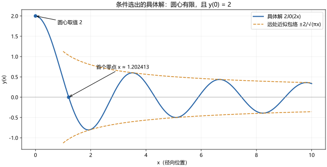

**横轴是缩放半径 $t=\omega r/c$，纵轴是形状值 $F(t)=R(r)$。** 在 $\tau=0$ 时，$u(r,0)=R(r)$，所以这条曲线也就是该时刻沿半径的位移；其他时刻须整体乘以 $\cos(\omega\tau)$。图像从圆心的高度 $2$ 出发，向外逐渐下降，随后穿过横轴并继续起伏。

- **把第一个零点选作固定边缘**，就得到最简单的振动形状：中心鼓起，向边缘逐渐变平，整个内部一起上下运动。
- **把更后的零点选作固定边缘**，膜内就会出现始终不动的圆圈，称为节圆。曲线正负相反的区域，分别向上鼓起和向下凹入；过半个周期，它们交换方向。
- **图中起伏向外变小**，表示不同半径处的振动幅度不同。随时间的运动由余弦因子给出；在这个无阻尼模型中，各处的振动幅度保持不变。

一张实际鼓膜只对应从圆心到所选边缘的那一段曲线。若实际半径为 $a$，固定边缘要求 $R(a)=F(\omega a/c)=0$，即 $J_0(\omega a/c)=0$。例如第一个正零点约为 $2.4048$，选它作边缘时，图中只取 $0\le t\le2.4048$，并有 $\omega=2.4048c/a$。

使用特殊函数，与使用三角函数、指数函数，本质上是一样的：都是用已经定义、研究过的函数来表示解，再利用它们已知的性质进行计算和分析。例如，写下 $2J_0(t)$，和写下 $2\cos(t)$ 一样，都是给出了一个明确的函数。函数名称是否熟悉，并不影响表达式的精确性。

### Legendre 函数：标准基本解 P 与 Q

Legendre 方程是

$$
(1-t^2)y''-2ty'+\ell(\ell+1)y=0.
$$

其中 $\ell$ 是参数。在 $-1<t<1$ 上，它的两个标准基本解记为 $P_\ell(t)$ 和 $Q_\ell(t)$，通解为

$$
y=C_1P_\ell(t)+C_2Q_\ell(t),
$$

其中 $C_1,C_2$ 是由初值或边界条件确定的常数。

### 为什么要引入特殊函数：历史背景与实际需要

前面用幂级数构造了 Airy 方程的解，再用标准基本解 Ai、Bi 表示具体解。这里可以追问一步：为什么数学家要引入这些新函数？为什么不一直用我们熟悉的多项式、指数和三角函数？

#### 原来的函数不够用了，但问题仍然要解决

学过的初等函数只能表达一部分微分方程的解。遇到变系数方程，或者把振动、传热等问题放到圆形、球形区域里，求解时就可能出现无法用有限次初等运算写出的函数。物理问题不会因为公式写不出来就消失：我们仍然要知道鼓膜怎样振动、温度怎样分布、光的强度怎样变化。

**于是，人们用积分、级数，或微分方程加上选定解的条件，精确定义所需的新函数。** 这与前面用初值问题定义指数、正弦和余弦的思路相通。不能写成已有初等函数，并不妨碍一个函数有确定的值、可以计算，也不妨碍我们研究它的性质。

不过，给一个未知解起名字，只是研究的起点。还要回答：怎样计算它？在哪里为零？会振荡还是增长？参数改变时会怎样？这些问题有了系统的答案，新函数才真正成为可用的工具。

#### 历史上，它们往往先出现在具体问题里

十八、十九世纪，力学、天文学和数学物理不断带来新的积分与微分方程。许多后来被称为“特殊函数”的对象，就是在解决这些问题时逐渐被认识和研究的；今天统一的符号与定义，则是后续整理的结果。

例如，Bessel 函数虽然以 Bessel 命名，但相关函数更早就出现在 Daniel Bernoulli 对悬挂重链小振动的研究中。后来，人们发现具有圆柱对称性的势场和波动问题也会产生这类函数。同一种数学结构在不同问题中反复出现，促使它成为独立的研究对象。

Airy 函数也有具体的物理来源。Airy 在 1838 年研究光学中焦散附近的光强时，遇到了后来用来定义 Ai 的积分。这类函数后来又被用于波动问题，特别是连接振荡行为与指数行为的区域。

所以，“引入特殊函数”通常是一段逐步发展的过程：先在问题中遇到一个新的积分或解，再找到可靠的表示与计算方法，研究其性质，最后形成大家共同使用的定义和记号。

#### 为什么要命名、统一定义，还要编制函数表

假如每次遇到同一种方程，都重新推导一遍长级数，既费力，也容易出错。统一定义后，一个问题中得到的零点、导数公式、递推关系和近似方法，就能用于其他问题。

标准化也让不同人的结果可以直接比较。以二阶齐次方程为例，解可以乘上任意常数；选定标准基本解及其尺度以后，大家查到的函数值才指向同一个对象。实际问题再用初值或边界条件确定组合系数。

在计算机普及以前，函数表把预先计算好的数值集中起来，让使用者通过查表和插值完成计算。后来，这些知识又逐步整理成手册和软件。NIST 的《数学函数手册》于 1964 年出版，其后继项目 DLMF 将相关定义、公式和计算知识组织成数字参考资料。

#### 今天有数值求解器，为什么仍然要学特殊函数

数值求解器可以给出某组条件下的一条近似曲线。特殊函数的知识则能帮助我们理解一整类解：哪些解保持有限，哪些解增长，零点在哪里，以及参数如何影响解的形状。计算时，也可以根据变量所在的范围选择级数、递推或渐近公式，而不必每次都从头积分。

前面的 Bessel 例子就展示了这种用途：先认识标准基本解，再用圆形鼓膜的条件选出合适的解，并通过函数的零点理解鼓膜的振动形状。下一章转向数值求解，看看计算机怎样直接近似计算 ODE 的解。

## 八、ODE 的数值求解：从特殊函数到计算机辅助计算

实际求解 ODE 时，我们往往想知道：给定初始状态，过一段时间后状态是多少？曲线怎样变化？前面介绍的特殊函数和幂级数法可以帮助表示解，但未必能方便地回答这些计算问题。因此，我们需要数值方法，直接从方程和初值出发，计算后续状态的近似值。

### 从表示解到计算解：为什么需要数值方法

十八、十九世纪的特殊函数理论，让许多无法用初等函数表达的解有了精确定义、级数和可查用的数值表。但 **Airy、Bessel 等特殊函数对应特定的方程结构，不能覆盖所有方程**。遇到更一般的变系数方程、非线性方程或多个变量耦合的系统，未必能把解写成已有特殊函数的组合。即使能写出来，求某个时刻的具体数值，通常仍需要数值算法。

**幂级数法也有适用范围和计算上的限制。** 有些解不能展开成收敛幂级数；即使能展开，也要检查收敛范围。计算时只能保留有限项，因此还要控制截断误差。若要求较远处的值，可能需要更多项，或换一个展开点继续计算；对于复杂方程，逐项推导系数也可能很繁琐。

与此同时，Euler 等人的逐步近似方法提供了另一条路线：**不必先求出解的公式，直接从方程和初值出发，一小步一小步地估计后续状态。** 十九世纪末至二十世纪初，Runge、Heun、Kutta 等人进一步发展了在一步内多次估计变化率的方法。二十世纪中叶以后，电子计算机使重复计算和大型方程组求解更加可行，自动步长、误差估计和刚性问题的算法也逐渐成为重要工具。

这些方法长期并行：特殊函数可以通过数值算法求值，幂级数截断后也能用于近似计算，而一般初值问题可以直接数值积分。数值方法尤其适合反复改变参数、绘制轨迹或求解大型方程组，不过仍要关注步长、误差和稳定性。

下面沿着一个具体问题，用 Euler 法手算、编程并画出近似轨迹，再定性介绍 Runge–Kutta 法怎样改进斜率估计。

### 先说明要解的题：已知变化规律和起点，求后续状态

本章用下面的初值问题贯穿公式、手算、程序和图像：

$$
\begin{cases}
y'(t)=y(t)^2-y(t), & 0\le t\le1,\\
y(0)=\dfrac12.
\end{cases}
$$

要求的是 $y(t)$。我们希望计算 $y(0.2)$、$y(0.4)$ 等值，最后得到 $y(1)$ 的近似值。记方程右端为

$$
f(t,y)=y^2-y.
$$

这里要分清三件事：$t$ 是时间，$y$ 是状态，$f(t,y)$ 是变化率。输入 $t=0,y=0.5$，右端返回 $-0.25$，意思是“此刻状态向下变化的速度为 $0.25$”，不是说下一个状态等于 $-0.25$。

本例的右端不显含时间，但仍写成 $f(t,y)$，以便使用适用于一般方程的记号。它恰好有精确解

$$
y(t)=\frac{1}{1+e^t}.
$$

这个公式只用来事后检验和绘图，下面的数值算法不会用它推进。

### 一个时间步究竟在算什么：估计这段时间的总变化

设当前时间是 $t_n$，下一时刻是 $t_n+h$，其中 $h>0$ 是步长。精确解满足

$$
y(t_n+h)=y(t_n)+\int_{t_n}^{t_n+h}f(s,y(s))\,ds.
$$

也就是：**下一时刻的状态 = 当前状态 + 这一小段时间内累积的变化。** 如果知道这段时间的平均变化率，乘以时间长度 $h$，就能得到状态增量。

困难在于积分里面的 $y(s)$ 还不知道。数值方法需要用已经掌握的信息估计这段变化。下面用大写 $Y_n$ 表示计算得到的近似状态，区别于精确值 $y(t_n)$。

#### Euler 法：用起点斜率代表整段时间

最直接的想法是：这一小段时间足够短，就暂时把变化率看成起点处的常数。于是

$$
Y_{n+1}=Y_n+h f(t_n,Y_n).
$$

这个公式可以读成：**下一时刻的近似值 = 当前近似值 + 步长 × 当前斜率。** 其中 $hf(t_n,Y_n)$ 就是步长乘以斜率，表示这一步估计的变化量。

例如，若当前变化率是 $-0.25$，步长是 $0.2$，就估计状态在这一步内减少 $0.05$。把这个变化量加到当前值上，就得到下一时刻的近似值。

从图像上看，Euler 法就是从当前点出发，沿着当前斜率的直线往前走一小段。真实解的曲线可能会弯，所以这一步得到的是近似值；随后在新位置重新计算斜率，再走下一步。

从 $t_0=0,Y_0=0.5$ 出发，取 $h=0.2$：

$$
f(0,0.5)=-0.25,\qquad
Y_1=0.5+0.2\times(-0.25)=0.45.
$$

这里 $-0.25$ 是斜率，$-0.05$ 是这一步估计的状态变化量，$0.45$ 才是 $y(0.2)$ 的近似值。继续用 $(0.2,0.45)$ 作起点，就算出下一步 $Y_2=0.4005$。

Euler 法每一步只看起点。只要斜率在这一段里改变，沿起点切线走到底就会产生误差。Runge–Kutta 方法因此在同一步内多问几次“到了附近这个位置，变化率会是多少”，再综合这些信息。

#### Runge–Kutta 法：在 Euler 法的基础上改进斜率估计

Euler 法用“步长乘以起点斜率”估计这一段的变化量。如果曲线在这段时间里明显弯曲，起点斜率就不能很好地代表整段的变化，误差也会逐步累积。

**Runge–Kutta 法保留了“当前值加上步长乘以斜率”的思路，但会更仔细地估计这一段的平均斜率。** 它先根据已有信息试算中间或终点附近的状态，再计算这些位置的斜率，最后按设计好的规则综合起来。可以把它理解成：Euler 法只看出发时变化得多快，Runge–Kutta 法还会试探途中变化得多快，再决定这一整步该走多少。

经典四阶 Runge–Kutta 法（RK4）每一步计算四次斜率，最后更新一次状态。这里不展开具体公式。它精度更高，是因为这些试算位置和组合方式经过专门设计，能更好地反映斜率的变化，减少用一条直线代替曲线带来的误差；并不是随便多算几次、取个平均就一定更准。

在解足够光滑、步长足够小并满足稳定性要求时，Euler 法的步长减半，整个区间的误差通常约减半；RK4 的步长减半，误差通常约缩小到原来的十六分之一。不过，RK4 每一步的计算量也更大。下面为了看清程序怎样一步步推进，仍然使用最简单的 Euler 法。

### Euler 法的程序与结果：逐步更新，比较步长

程序计算同一个初值问题 $y'=y^2-y$、$y(0)=0.5$，从 $t=0$ 推进到 $t=1$，分别使用步长 $0.2$ 和 $0.1$。以下代码只使用 Python 标准库。

```python
from math import exp


def f(t, y):
    return y * y - y


def euler(f, t0, y0, t_end, h):
    if h <= 0 or t_end < t0:
        raise ValueError("Require h > 0 and t_end >= t0")
    t, y = t0, y0
    trajectory = [(t, y)]

    while t < t_end:
        dt = min(h, t_end - t)     # 最后一步必要时缩短，停在终点
        if t + dt == t:
            raise ArithmeticError("Step too small to advance time")
        slope = f(t, y)           # 当前斜率
        y = y + dt * slope        # 当前值 + 步长 × 斜率
        t = min(t + dt, t_end)
        trajectory.append((t, y))

    return trajectory


for h in (0.2, 0.1):
    trajectory = euler(f, t0=0.0, y0=0.5, t_end=1.0, h=h)
    t, y = trajectory[-1]
    exact = 1 / (1 + exp(t))       # 精确解只用于事后检验
    error = abs(y - exact)
    print(f"h={h:.1f}, y(1)={y:.9f}, error={error:.3e}")
```

循环里最关键的两行是 `slope = f(t, y)` 和 `y = y + dt * slope`：先让方程告诉我们当前变化得多快，再用步长乘以这个斜率，得到变化量并更新状态。把每一步的时间和状态保存下来，就得到一串可以用来画图的近似点。

程序输出：

```text
h=0.2, y(1)=0.264295216, error=4.646e-03
h=0.1, y(1)=0.266596984, error=2.344e-03
```

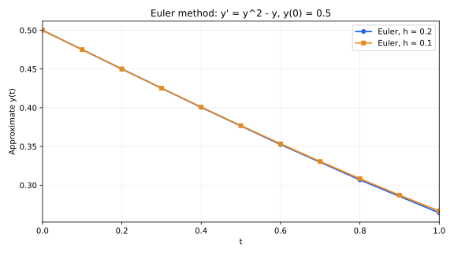

图中的点都由 Euler 法逐步算出，连线用来展示近似轨迹。两种步长得到的曲线略有差别，它们都是带有误差的数值近似。

两次计算都从同一个初值出发，只改变步长。步长较小时，每一步用起点斜率代表的时间段更短，终点误差也更小。这里的误差是数值近似与精确解之差，并不是零；不能因为程序顺利运行，或画出的曲线看起来平滑，就认为结果足够准确。

没有精确解时，可以进一步缩小步长，比较计算结果是否趋于稳定，并结合模型的性质检查结果。除了 Euler 法和 Runge–Kutta 法，计算机还可以根据问题的特点使用其它数值方法。

### 二阶或更复杂的方程不能直接给出斜率，怎么办？

前面的 $y'=y^2-y$ 是一个刻意选得简单的例子：给定当前的 $y$，就能算出 $y'$。**这说明了数值推进的基本思想，但不能让人误以为所有 ODE 都能从一个函数值直接得到斜率。** 对于二阶方程，必须先把状态补全；如果连最高阶导数都不能直接解出，还需要在计算中求解方程。

#### 二阶方程：把位置和速度一起作为状态

考虑一个非线性受迫振动模型：

$$
y''+0.2y'+y+y^3=\cos t,\qquad y(0)=1,\quad y'(0)=0.
$$

其中 $y$ 是位置，$y'$ 是速度，$y''$ 是加速度。方程告诉我们加速度怎样依赖时间、位置和速度，却没有仅凭 $(t,y)$ 就确定速度：同一时刻经过同一位置的物体，可以向左运动，也可以向右运动。因此，在 $(t,y)$ 平面上，不能像前面的一阶例子那样，为每个点指定唯一斜率。

把二阶方程改写成一阶方程组，就能按状态的变化率逐步计算。引入 $v=y'$，把原方程改写成一阶方程组：

$$
\begin{cases}
y'=v,\\
v'=\cos t-0.2v-y-y^3.
\end{cases}
$$

现在完整状态是向量 $\mathbf{x}=(y,v)$，其变化率为

$$
\mathbf{x}'=\mathbf{f}(t,\mathbf{x})
=\begin{pmatrix}v\\\cos t-0.2v-y-y^3\end{pmatrix}.
$$

**不需要先求出整条解曲线。只要知道当前时间、位置和速度，就能算出这两个状态分量各自的变化率。** 方程再复杂，只要右端可以求值，这一步仍然成立。对于这个显含时间的模型，$(y,v)$ 平面中的箭头还会随时间改变；若要画一个固定的自治向量场，可以把时间也作为状态，增加 $t'=1$。

#### 一步怎样算：同时更新两个分量

用 $Y_n,V_n$ 表示位置和速度的近似值，Euler 法变成

$$
\begin{aligned}
A_n&=\cos t_n-0.2V_n-Y_n-Y_n^3,\\
Y_{n+1}&=Y_n+hV_n,\\
V_{n+1}&=V_n+hA_n.
\end{aligned}
$$

例如从 $(t_0,Y_0,V_0)=(0,1,0)$ 出发，取 $h=0.1$，则

$$
A_0=1-0-1-1=-1,\qquad Y_1=1,\qquad V_1=-0.1.
$$

第一步的位置近似值没有改变，是因为 Euler 法沿起点速度 $V_0=0$ 推进；真实位置在这段时间内已经因加速度而改变。这也提醒我们，能计算变化率并不等于一步就能得到精确结果。

程序中一步的核心可以写成：

```python
from math import cos


def euler_step(t, y, v, h):
    acceleration = cos(t) - 0.2 * v - y - y**3
    y_next = y + h * v
    v_next = v + h * acceleration
    return t + h, y_next, v_next
```

两个新分量都使用旧状态计算。若先更新 `y`，再把更新后的 `y` 用来计算加速度，就改变了这里的 Euler 算法。Runge–Kutta 法也可以直接用于这个向量系统：每个试算阶段都估计完整的 $(y,v)$，再计算完整的变化率向量。

同样，对于能写成 $y^{(m)}=g(t,y,y',\ldots,y^{(m-1)})$ 的 $m$ 阶方程，可以把 $y,y',\ldots,y^{(m-1)}$ 作为 $m$ 个状态分量，改写成一阶系统。通常需要给出这 $m$ 个分量的初值；只有 $y(0)$，不足以确定一般的二阶初值问题。

#### 连最高阶导数也不能直接解出：隐式方程与约束

更一般的方程可能写成

$$
F(t,y,y',y'')=0.
$$

令 $v=y'$、$a=v'$ 后，要在给定 $(t,y,v)$ 时求解代数方程 $F(t,y,v,a)=0$。没有方便的显式公式，不代表无法计算：可以用 Newton 法等求根方法数值求出 $a$，再推进状态。如果 $F$ 足够光滑，并且在某个满足方程的点有 $\partial F/\partial a\ne0$，隐函数定理保证该点附近能把 $a$ 写成 $(t,y,v)$ 的单值函数。但这只是局部保证，还要控制求根误差并跟踪所选分支。

例如 $(y'')^2+y=0$：当 $y<0$ 时，加速度有 $a=\pm\sqrt{-y}$ 两个分支；当 $y>0$ 时，没有实加速度。仅给出位置和速度，并不能自动选定分支，也不能保证该状态允许实解。因此，不能让求解器随意挑一个根，就把它当成唯一的变化规律。

也可以直接离散隐式关系。例如后向 Euler 的一步要求联合求解

$$
\begin{cases}
Y_{n+1}-Y_n-hV_{n+1}=0,\\
F\!\left(t_{n+1},Y_{n+1},V_{n+1},
\dfrac{V_{n+1}-V_n}{h}\right)=0.
\end{cases}
$$

此时未知的是下一步的位置和速度，每一步都要解一个方程组，而不是直接代入一个斜率公式。求根是否收敛、解是否唯一，都需要另外检查。

若系统还包含不能解成导数的代数约束，例如带约束的机械运动，就可能需要作为**微分代数方程（DAE）**处理，使用适合约束结构的求解器，并给出满足约束及必要相容条件的初值。这里还要区分：原方程是隐式关系，与数值方法采用隐式更新，是两件事；前面已经显式写出的振动系统，也可以为了稳定性选用隐式方法。

因此，遇到复杂方程时，先问“完整状态是什么，能否由它确定变化率”，再选择推进方法。高阶通常通过增加状态分量来处理；无法显式确定导数时，则要考虑求根、分支和约束。转成一阶系统解决的是表达与计算接口问题，精度、刚性和长期稳定性仍需要另外处理。

### 计算机求解 ODE 的其它数值方法

#### 多步法：利用前面几步的信息

Euler 法和常见的 Runge–Kutta 法主要从当前状态出发，计算下一步。多步法则会保留前面几个时刻的状态或斜率，用这些已有信息预测下一步。Adams 方法就是这一类方法的代表，有些还会先预测，再修正。

对于变化比较平滑、需要计算较长时间的轨迹，多步法可以减少重复计算。不过，它需要先用其它方法得到起始的几步；改变步长时，也要相应调整使用历史信息的方式。

#### 隐式方法：让下一步的状态也参与计算

显式方法根据已经知道的状态直接算出下一步；隐式方法则把下一步的未知状态也放进计算关系中，因此每一步通常还要解一个代数方程或方程组。后向 Euler 法和后向差分公式（BDF）是常见例子。

当系统里既有很快衰减的变化，又有缓慢持续的变化时，显式方法可能为了保持稳定而被迫走很小的步子。这类问题称为刚性问题，合适的隐式方法往往更有效。代价是每一步的计算更复杂，而且仍然需要控制误差。

#### 自适应步长：根据变化快慢调整步子

自适应步长是一种可以配合不同数值方法使用的控制策略。求解器会估计当前这一步的误差：误差太大就缩小步长重新计算，误差足够小就接受结果，并考虑下一步能否走得更大。

这样可以在变化剧烈的地方算得细一些，在变化平缓的地方减少计算。使用者通常给出允许的绝对误差和相对误差，由求解器安排内部步长；这些要求主要用于控制每一步的误差，并不直接保证终点的总误差。绘图时多取几个输出点，也不等于积分本身更准确。

#### 边值方法：同时满足两端的要求

有些问题给出的不是完整起点，而是轨迹在区间两端必须满足的条件。这时可以使用打靶法：先猜测缺少的初始条件，向前计算，再根据终点的偏差调整猜测。

另一种思路是在整个区间上选取一组节点，用这些节点上的未知值表示近似轨迹，再一起求解，使方程和边界条件都得到满足。有限差分法和配置法都可以沿这个思路处理边值问题。

#### 保结构方法：照顾系统的长期性质

对于某些力学系统，除了短时间内算得准，还希望长期计算能较好地保留系统的几何结构。辛积分方法就是为 Hamilton 系统设计的一类方法，常用于长期轨道模拟。

它的优势不一定是每一步误差都最小，而是长期计算时能较好地保留原系统的结构，在适当条件下减轻能量误差的持续漂移。这也不意味着它在每一步都精确守恒能量。

这些方法各有适用场景。平滑的一般初值问题、刚性问题、边值问题和长期力学模拟，对算法的要求并不相同。读计算结果时，仍要检查求解器是否成功完成计算，并通过缩小步长、收紧误差要求或检查守恒量，判断近似是否可靠。

## 九、ODE 解的基本理论：存在性、唯一性与解的性质

前面已经学过怎样求出公式、怎样用特殊函数表示解，以及怎样逐步计算近似轨迹。但求解之后，还有一些问题需要回答：给定方程和初值，真的有解吗？这个解是否唯一？初值有一点误差，结果会改变多少？解能延续多久，又有多光滑？这些问题共同构成 ODE 的基本理论。

本章围绕同一个初值问题展开：

$$
x'(t)=f(t,x(t)),\qquad x(t_0)=x_0.
$$

其中 $x$ 可以是一个数，也可以是由位置、速度等分量组成的向量。$x_0$ 给出起点，$f$ 给出每个时间和状态下的变化率。我们要研究的是：这些局部的变化规则，怎样确定一条完整的轨迹。

### 什么才算一个解：函数、条件与区间

一个初值问题的解，必须同时满足方程和初始条件，还要说明它在哪个区间上成立。例如

$$
x'=x,\qquad x(0)=2
$$

的解是 $x(t)=2e^t$，定义在整个实数轴上。只给方程时，$x(t)=Ce^t$ 描述的是一族解；给出初值后，常数才被确定。

这里也要留意“特解”的用法。在线性非齐次方程中，特解通常指任意一个满足非齐次方程的函数，未必已经满足指定初值。例如 $x'+x=1$ 有特解 $x_p=1$，通解为 $x=1+Ce^{-t}$；若要求 $x(0)=3$，还需取 $C=2$。

解的表达方式可以不同。$x=2e^t$ 是显式表示；$x'=1/x$ 积分后得到 $x^2=2t+C$，则是隐式表示。后者还需根据初值选择正、负分支，并限制在 $2t+C>0$ 的区间内，因为原方程在 $x=0$ 没有定义。积分、收敛级数和特殊函数也能给出精确表示，是否使用初等函数并不决定它是不是解。

数值方法给出的通常是一组离散值 $X_n\approx x(t_n)$。例如 $x'=-x$、$x(0)=1$ 的精确解为 $e^{-t}$，Euler 法却给出 $X_n=(1-h)^n$。这些数值在适当条件下可以逼近真解，但固定步长的计算结果一般不逐点满足原方程。上一章讨论怎样计算，本章讨论计算所要逼近的对象。

### 为什么要在微分方程与积分方程之间转换

一阶初值问题还可以写成积分形式：微分形式规定每一刻的变化率，积分形式把变化率累积成状态。先看转换怎样完成，再看它为什么有用。

#### 从微分形式到积分形式，再回到微分形式

这里用的是微积分基本定理：把一段时间内的变化率积分起来，就得到这段时间内的总变化。

先从微分方程出发。把时间变量暂时写成 $s$：

$$
x'(s)=f(s,x(s)).
$$

从初始时刻 $t_0$ 积分到当前时刻 $t$，得到

$$
\int_{t_0}^{t}x'(s)\,ds
=\int_{t_0}^{t}f(s,x(s))\,ds.
$$

左边根据微积分基本定理等于 $x(t)-x(t_0)$，再代入初值 $x(t_0)=x_0$，就有

$$
x(t)=x_0+\int_{t_0}^{t}f(s,x(s))\,ds.
$$

这里 $s$ 是积分过程中遍历的时间，$t$ 是我们要计算状态的那个时刻。公式说的是“当前状态 = 初始状态 + 这段时间内累积的变化”。

“等价”还要求反过来也成立。假设一个连续函数 $x(t)$ 满足上面的积分方程，且 $f$ 连续，那么 $f(s,x(s))$ 也是连续的。对等式两边关于上限 $t$ 求导，由微积分基本定理得到

$$
x'(t)=\frac{d}{dt}\int_{t_0}^{t}f(s,x(s))\,ds
=f(t,x(t)).
$$

再令 $t=t_0$，积分上下限相同，积分为零，于是 $x(t_0)=x_0$。这样就同时恢复了微分方程和初始条件。这也是这里要求连续性的原因：它保证可以直接使用微积分基本定理，逐点恢复导数。

#### 构造解：从一条猜测的曲线逐步修正

**历史背景。** Picard 迭代以 Émile Picard 命名。他在 1888—1890 年间发展逐次逼近方法，用于微分方程的存在性研究；这一工作也吸收了 Neumann、Schwarz 等人此前处理边值问题的思路。名称体现了 Picard 的重要贡献，并不意味着所有逐次逼近思想都由他首次提出。

积分式右边仍含有未知函数，所以它还不是一个直接给出答案的公式。但它提供了一种迭代方法：先猜一条函数，把它代入右边，再把计算结果作为下一条函数。

这与**不动点原理**的联系是：把右边看成一个“输入函数、输出函数”的算子

$$
(Tz)(t)=x_0+\int_{t_0}^{t}f(s,z(s))\,ds.
$$

积分方程就变成 $x=Tx$，所以所求的解是算子 $T$ 的不动点。反复更新 $x^{(n+1)}=Tx^{(n)}$，就是 **Picard 迭代**。若 $f$ 对状态变量满足 Lipschitz 条件，在足够短的时间区间和适当的闭函数集合上，$T$ 会把这个集合映回自身并成为压缩映射；Banach 不动点定理便保证唯一不动点存在，且迭代收敛到它。也就是说，Picard 迭代提供构造解的步骤，不动点定理说明这些步骤为什么能收敛、为什么解唯一。

为避免与初始值 $x_0$ 混淆，用上标括号表示迭代次数。从常值函数 $x^{(0)}(t)=x_0$ 开始，令

$$
x^{(n+1)}(t)=x_0+\int_{t_0}^{t}f(s,x^{(n)}(s))\,ds.
$$

这叫 Picard 迭代。例如对 $x'=x$、$x(0)=1$，依次得到

$$
\begin{aligned}
x^{(0)}(t)&=1,\\
x^{(1)}(t)&=1+t,\\
x^{(2)}(t)&=1+t+\frac{t^2}{2},\\
x^{(3)}(t)&=1+t+\frac{t^2}{2}+\frac{t^3}{6}.
\end{aligned}
$$

继续迭代会得到指数函数的级数，极限就是 $x(t)=e^t$。对一般方程，若 $f$ 连续，并在初值附近对状态变量满足适当的 Lipschitz 条件，就可以在足够短的时间区间上证明迭代收敛，并得到局部唯一解。积分形式因此也是存在唯一性证明的重要工具。

#### 数值计算：近似一小段时间内的累积变化

精确解满足

$$
x(t+h)=x(t)+\int_t^{t+h}f(s,x(s))\,ds.
$$

在一小段时间 $s\in[t,t+h]$ 内，用当前变化率近似：

$$
f(s,x(s))\approx f(t,x(t)).
$$

于是

$$
\int_t^{t+h}f(s,x(s))\,ds
\approx\int_t^{t+h}f(t,x(t))\,ds
=h f(t,x(t)),
$$

从而

$$
x(t+h)\approx x(t)+h f(t,x(t)).
$$

这就是上一章介绍的 Euler 法。Runge–Kutta 法则在一步内估计多次变化率。它们计算离散时刻的近似值，前面的 Picard 迭代则逐次更新整条函数。

#### 误差估计：把初始差异与累积差异分开

设 $x(t)$、$y(t)$ 满足同一个微分方程，但初值分别为 $x_0$、$y_0$。把它们的积分式相减，得到

$$
x(t)-y(t)=x_0-y_0+
\int_{t_0}^{t}\bigl[f(s,x(s))-f(s,y(s))\bigr]\,ds.
$$

这把当前的差异分成初值差异和沿途累积的差异。在适当的 Lipschitz 条件下，可以进一步用积分不等式控制误差，得到本章后面讨论的连续依赖估计。

### 存在性：写下变化规律以后，真的有轨迹吗

方程规定“走到这里时，应该以这个速度变化”。存在性要保证，确实有一个函数能够在一段时间内始终遵守这条规则。

对于有限维显式初值问题，如果 $f(t,x)$ 在初值点 $(t_0,x_0)$ 附近的开邻域内连续，那么至少存在一个局部经典解。这是 Peano 存在定理的基本结论。这里的“局部”指初始时刻附近的一段区间，“至少一个”则表示还没有保证唯一。

可以从积分形式理解构造解的思路：

$$
x(t)=x_0+\int_{t_0}^t f(s,x(s))\,ds.
$$

当前状态等于起始状态加上沿途变化的累积。对连续右端，这个积分关系与原初值问题等价。于是可以先猜一条轨迹，再用右边修正它：

$$
x^{(0)}(t)=x_0,\qquad
x^{(n+1)}(t)=x_0+\int_{t_0}^t f(s,x^{(n)}(s))\,ds.
$$

这就是 Picard 逐次逼近。对于 $x'=x$、$x(0)=1$，依次得到

$$
1,\quad 1+t,\quad 1+t+\frac{t^2}{2},\quad
1+t+\frac{t^2}{2}+\frac{t^3}{6},\quad\ldots,
$$

其极限是 $e^t$。这个例子说明，构造解可以通过一列函数的极限完成。不过，写出迭代式还不等于证明收敛；一般情况下要为迭代的收敛补上条件，下一节的 Lipschitz 条件就是常用工具。单纯连续所保证的存在性，也不能直接用来断言这套迭代必然收敛。

### 唯一性：同一个起点会不会有不同的未来

如果两条不同的轨迹都满足同一个方程和初值，那么这个初值问题就不唯一。即使起点测得完全准确，模型仍然没有确定唯一的未来。

连续的右端并不足以排除这种情况。考虑

$$
x'=2\sqrt{|x|},\qquad x(0)=0.
$$

恒零函数是一个解。对任意 $a\ge0$，下面的函数也是解：

$$
x_a(t)=
\begin{cases}
0,&t\le a,\\
(t-a)^2,&t>a.
\end{cases}
$$

它先停在原点，到 $t=a$ 后才开始增长。拼接处的左右导数都是零，也满足方程，因此初值没有规定“什么时候出发”。

为了控制这种自由，常用的条件是：$f$ 连续，并在初值点附近对状态变量满足一致的局部 Lipschitz 条件，即在一个共同邻域内有有限常数 $L$，使

$$
\|f(t,u)-f(t,v)\|\le L\|u-v\|.
$$

它要求同一时刻的两个状态若相差很小，变化率的差异也受到相应控制。平方根例子在零点不满足这个要求，因为

$$
\frac{|2\sqrt{u}-0|}{|u-0|}=\frac{2}{\sqrt{u}}\longrightarrow\infty
\qquad(u\to0^+).
$$

在连续性和上述局部 Lipschitz 条件下，初值问题存在唯一局部解，这就是 Picard–Lindelöf 定理。实际检查时，如果 $f$ 对状态的偏导数连续，就可以在足够小的邻域内用有界导数得到 Lipschitz 控制。这个条件是常用的充分条件；不满足它，并不自动意味着解一定不唯一。

从 Picard 迭代也能看到条件的作用。令

$$
(Tz)(t)=x_0+\int_{t_0}^t f(s,z(s))\,ds.
$$

在长度为 $h$ 的短区间上，用最大距离比较候选轨迹，有

$$
\|Tu-Tv\|_\infty\le Lh\,\|u-v\|_\infty.
$$

若 $Lh<1$，修正会缩小轨迹之间的差异。选取合适的闭合候选集合，保证 $T$ 将它映回自身后，就能在完备的函数空间中应用压缩映射原理，得到唯一不动点 $x=Tx$。这个不动点正是解。最后一章会进一步回顾这种泛函观点的发展。

### 连续依赖：初值测错一点，轨迹会改变多少

存在唯一解之后，还要问它对数据误差是否敏感。实际测量只有有限精度，因此需要控制初值变化对整条轨迹的影响。

对 $x'=x$，两条解的差异为

$$
|x(t)-y(t)|=e^{t-t_0}|x_0-y_0|.
$$

误差会放大，但在事先固定的有限区间 $[t_0,T]$ 上，初值足够接近，整个区间内的轨迹仍然可以足够接近。对 $x'=-x$，误差则按 $e^{-(t-t_0)}$ 衰减。两者都连续依赖初值，可是长期表现不同。因此，连续依赖并不保证误差会缩小，也不保证任意长时间的预测都同样可靠。

一般情况下，把两条解的积分方程相减，利用 Lipschitz 条件得到

$$
\|x(t)-y(t)\|\le\|x_0-y_0\|
+L\int_{t_0}^t\|x(s)-y(s)\|\,ds.
$$

起始差异会改变后续变化率，而变化率的差异又继续累积。Grönwall 不等式将这个关系整理为

$$
\|x(t)-y(t)\|\le e^{L(t-t_0)}\|x_0-y_0\|.
$$

这里取 $t\ge t_0$，并要求两条解共同存在、相关区域内始终有上述 Lipschitz 控制。指数项给出上界，实际误差不一定按这个速度增长。

模型参数的误差也可以用类似方法处理。例如两套右端 $f,g$ 在相关区域满足 $\|f(t,z)-g(t,z)\|\le\varepsilon$，且 $f$ 的 Lipschitz 常数为 $L>0$，则相应解满足

$$
\|x(t)-y(t)\|\le e^{L(t-t_0)}\|x_0-y_0\|
+\frac{\varepsilon}{L}\bigl(e^{L(t-t_0)}-1\bigr).
$$

当 $L=0$ 时，第二项为 $\varepsilon(t-t_0)$。第一项来自初值误差，第二项来自变化规律的误差。提高数值积分的精度，只能改善计算近似，不能自动消除这些输入误差。

存在性、唯一性和连续依赖合起来，构成初值问题适定性的基本要求。讨论适定性时，还需说明比较的时间区间和衡量误差的方式。一个局部适定的问题，仍然可能具有很大的长期误差；具体数值算法是否稳定、收敛，也需要另外分析。

### 延拓与全局存在：这条轨迹能走多久

局部定理只保证起点附近有解。能否把这段轨迹的末端当作新起点，继续向前求解，是延拓问题。

先看一个右端十分光滑的例子：

$$
x'=x^2,\qquad x(0)=1.
$$

它有唯一解

$$
x(t)=\frac{1}{1-t},\qquad t\in(-\infty,1).
$$

当 $t\to1^-$ 时，状态趋向无穷，无法在 $t=1$ 接上一个有限值，这叫有限时间爆破。同一个有理式在 $t>1$ 也满足方程，但不能跨过奇点成为原初值问题的连续延拓。因此，解的公式必须连同区间一起理解。

阻止延拓的原因也可能是方程的定义域。例如

$$
x'=-\frac{1}{x},\qquad x(0)=1
$$

的解为 $x(t)=\sqrt{1-2t}$，在 $t<1/2$ 上成立。它趋近零时并未发散，可是右端在零点没有定义，原方程的经典解也就无法继续。

在通常的局部存在唯一性条件下，如果有限时间端点前的时空轨迹 $(t,x(t))$ 始终留在方程定义域内部的某个紧集内，就可以继续延拓。这个条件同时排除了状态逃向无穷和靠近定义域边缘的情况。

要保证全局存在，可以进一步限制增长速度。若 $f$ 在整个所考察的时间范围和所有状态上有定义，并在任意有限时间段内满足

$$
\|f(t,x)\|\le A+B\|x\|,
$$

其中 $A,B\ge0$ 可随时间段选取，配合局部存在唯一性条件，就可以用积分估计排除有限时间爆破。连续系数的线性方程组具有这样的有限时间控制；$x'=x^2$ 则不满足这种全局的线性增长限制。

由此可以区分三种说法：局部解只覆盖初始时刻附近；全局解覆盖指定的整个时间范围；最大解已经无法继续延拓，但其区间未必无限长。“全局”究竟指所有未来时间还是整个实数轴，需要根据问题说明。

### 正则性：经典解、光滑解与解析解

前面问的是“解有没有、能存在多久”。这里再问一个问题：这条解曲线有多平滑，能求几次导数？数学上把这件事叫作**正则性**。

#### 经典解：方程要用的导数，它都有

要检查一个函数是不是解，就把它和它的导数代回方程。一阶方程用到一阶导数，二阶方程用到二阶导数。**经典解**就是这些导数都存在，并且在所讨论的区间里，每一点都能按通常的求导方式满足方程。

但方程只用到一阶导数，不代表解还能继续求二阶、三阶导数。例如

$$
x'=|t|,\qquad x(0)=0
$$

的解是 $x(t)=t|t|/2$。它的一阶导数就是 $|t|$，连续，也满足方程；但 $|t|$ 在零点有个尖角，不能在那里再求导。因此，这个函数是一阶方程的经典解，却没有处处存在的二阶导数。

#### 光滑解：可以一直求导

如果解可以一遍又一遍地求导，而且每次得到的导数都连续，就叫**光滑解**，记作 $C^\infty$。类似地，$C^1$ 表示有连续的一阶导数，$C^2$ 表示有连续的一阶、二阶导数。

解能不能继续求导，通常要看方程给出的“变化率”本身是否足够平滑。方程 $x'=f(t,x(t))$ 告诉我们：解此刻变化得多快，由当前时间和当前状态决定。如果这个变化率随着时间、状态的改变，也能平滑地变化，我们就能再求一次导数。

例如 $x'=tx$，对两边求导得到

$$
x''=x+tx'=(1+t^2)x.
$$

这里 $tx$ 会因为两件事而变化：时间 $t$ 在变，状态 $x$ 也在变。求导时把这两部分的贡献加起来，就是链式法则。

一般来说，如果右端对时间和状态有连续的一阶偏导数，解就有连续的二阶导数。这个办法可以反复用：右端有 $k$ 阶连续导数，解就有 $k+1$ 阶连续导数；右端可以一直求导，解也可以一直求导。这些结论都只针对解已经存在的区间。

#### 解析解：附近的曲线能用 Taylor 级数还原出来

光滑只保证“可以一直求导”。**解析**还要求：在每一点附近，利用该点的函数值、各阶导数写出的 Taylor 级数，真的能还原原来的函数。

比如指数函数在零点附近可以写成

$$
e^t=1+t+\frac{t^2}{2!}+\frac{t^3}{3!}+\cdots.
$$

这个无穷级数确实等于 $e^t$。正弦、余弦也有这样的展开，所以它们都是解析函数。

但有些函数虽然能一直求导，Taylor 级数却还原不了它。例如

$$
\phi(t)=
\begin{cases}
e^{-1/t^2},&t\ne0,\\
0,&t=0.
\end{cases}
$$

它在零点附近非常平，零点的函数值和所有阶导数都是零。因此，在零点写出的 Taylor 级数只有零。但只要 $t\ne0$，函数值就大于零，级数没有还原出原函数。它是光滑的，却在零点不解析。把它放进方程 $x'=\phi'(t)$、$x(0)=0$，就得到一个光滑但不解析的解 $x=\phi(t)$。

所以，解析解一定光滑，光滑解也能满足经典解所要求的求导条件；反过来却不一定。右端如果是解析的，局部解也会是解析的；右端只是光滑，就不能保证解解析。

另外，有些文章把“能写出精确公式的解”也叫“解析解”。这和这里“能用 Taylor 级数还原”的意思不同，需要看上下文。

#### 曲线很光滑，为什么还会爆炸？

因为“能求几次导数”和“能存在多久”是两件事。一个解在存在期间可以处处光滑，甚至解析，却仍然在有限时间内变得无界。这叫**有限时间爆炸**，也叫爆破。

前面的例子

$$
x'=x^2,\qquad x(0)=1,\qquad x(t)=\frac{1}{1-t}
$$

就是如此。在每个 $t<1$ 的时刻，它都能一直求导，也能在该点附近展开成 Taylor 级数。但越靠近 $t=1$，函数值就越大，最后趋向无穷。到了 $t=1$，没有一个有限的状态可以接上去，解便无法继续。区间里的曲线再平滑，也不代表它到了区间端点还有有限值。

反过来，不够光滑也不一定会爆炸。前面的 $x=t|t|/2$ 在零点不能求二阶导数，但它在整个实数轴上都满足一阶方程 $x'=|t|$，可以一直存在。

还要区分“状态变得无穷大”和“碰到了方程不能使用的地方”。例如 $x'=-1/x$ 的解可以在有限时间内趋近零：状态没有变得无穷大，但变化率趋向负无穷，而且原方程在 $x=0$ 没有定义，所以也不能继续。

对于右端光滑的有限维 ODE，如果在某个有限时间内，时间和状态始终待在方程定义域内部的一块闭合、有界区域里，就可以继续求解，光滑性也会保留。因此，要判断解会不会中途终止，除了看曲线是否平滑，还要看状态会不会变得无界，以及会不会碰到方程定义域的边界。

### 右端不连续时：通过积分理解解

如果变化率有跳变，轨迹可能出现折角，无法在每个时刻按普通方式求导。这时可以改用绝对连续、几乎处处满足方程的解概念。

例如令

$$
g(t)=
\begin{cases}
0,&t<1,\\
1,&t\ge1,
\end{cases}
\qquad x'=g(t),\qquad x(0)=0.
$$

积分得到

$$
x(t)=\int_0^t g(s)\,ds=
\begin{cases}
0,&t\le1,\\
t-1,&t>1.
\end{cases}
$$

这条曲线在 $t=1$ 有折角，不能作为跨过该点的经典解，但它绝对连续，几乎处处满足方程，并精确满足积分关系。改变单个点 $g(1)$ 的数值不会改变这个积分解。

也可以用弱形式表达相同的导数关系：在开区间 $I$ 内，对任意光滑且紧支于 $I$ 的测试函数 $\varphi$，要求

$$
-\int_I x(t)\varphi'(t)\,dt
=\int_I g(t)\varphi(t)\,dt.
$$

通过分部积分，导数被移到了测试函数上，不再要求逐点计算 $x'$。初值仍需另行施加。这里的弱形式是精确的等式要求，与数值近似的误差容限不同。

如果 $f$ 连续，连续函数 $x$ 满足初值问题的积分关系，那么被积函数也连续，微积分基本定理会恢复逐点成立的导数等式，$x$ 仍是经典解。因此，改写成积分式本身并不一定扩大解的范围；关键在于允许的数据和函数规则性。弱解的进一步理论会在偏微分方程中展开。

### 本章小结：从求出答案到理解答案

面对一个 ODE 初值问题，先说明解的含义与定义区间，再检查存在性和唯一性。连续右端保证有限维问题的局部存在，适当的局部 Lipschitz 条件进一步保证唯一性，并让我们控制初值误差。

要讨论更远的时间，需要分析延拓、爆破和定义域边界；要讨论更多阶导数，需要考察右端的正则性。最后再将这些结论与数值计算联系起来：问题本身是否适定，决定了要逼近的轨迹；算法的误差与稳定性，则决定了计算结果能多好地描述它。

## 十、ODE 的发展历程：从运动规律到现代计算

常微分方程的发展，可以沿着研究问题的变化来理解：怎样把运动写成方程，怎样求出解，怎样在没有公式时研究解，以及怎样可靠地计算和控制系统。下面按时代展开，每一节都把当时的问题、方法和本文学过的内容联系起来。各条路线相互交织，早期的方法也一直沿用至今。

### 十七世纪后期：用微积分描述运动与变化

微积分建立以后，速度、加速度与位置之间的关系有了统一的表达方式。Newton 的力学把受力与加速度联系起来，Leibniz 的微积分符号和运算方法则帮助人们处理函数与导数的关系。研究运动和曲线，逐渐成为从变化规律寻找未知函数的问题。

例如，弹簧的回复力与位移成正比，由牛顿第二定律就得到

$$
m x''=-kx.
$$

方程描述运动规律，初始位置和初始速度选定一次具体运动。这也解释了本文为什么从“未知函数、变化率与初始条件”讲起：ODE 首先是一种把局部变化规则写成数学关系的语言。

早期求解常借助变量分离、积分和代换。对冷却方程 $y'=-ky$，把状态和时间分开，再积分，就能得到指数衰减。求解的核心问题是：能否把导数之间的关系还原成函数？

### 十八世纪：系统发展求解方法与近似计算

随着力学和天文学问题增多，研究者需要处理更高阶的方程和相互耦合的变量。Euler、Bernoulli 家族和 Lagrange 等人的工作推动了线性方程、变量代换、级数和常数变易等方法的发展。

线性方程尤其适合建立一套系统的求解程序。常系数齐次方程可以通过特征根识别增长、衰减和振荡模式；非齐次方程则在自由演化的基础上加入外部驱动。本文第三、四章的安排正体现了这个结构：先理解系统自身的运动，再计算输入怎样改变运动。

这一时期，近似计算也已经开始发展。知道当前状态和变化率，就可以用

$$
Y_{n+1}=Y_n+h f(t_n,Y_n)
$$

估计下一时刻的状态。这是 Euler 法的基本思路。它说明逐步计算轨迹的想法早于电子计算机；计算工具改变以前，算法的数学结构就已出现。

### 十九世纪：扩展解的表达方式，建立严格理论

振动、天体运动和数学物理中的方程越来越复杂，初等函数不足以表达许多重要的解。Bessel、Airy 等特殊函数提供了新的表达工具：用微分方程配合初值或标准化条件选定函数，再研究它的级数、零点和渐近性质。本文第六、七章由基本函数走向特殊函数，就是沿着这种思路扩展“怎样表示一个解”。

与此同时，求解过程本身也需要严格检查。形式上写出一个级数，还要证明它收敛；得到一个公式，还要说明它在哪个区间成立；给定方程和初值，还要确认确实存在满足条件的函数，而且是否只有一个。

Cauchy、Lipschitz、Picard 等人的工作推动了初值问题的严格理论。把

$$
x'=f(t,x),\qquad x(t_0)=x_0
$$

改写成

$$
x(t)=x_0+\int_{t_0}^{t}f(s,x(s))\,ds,
$$

就可以通过逐次逼近构造候选解，并研究迭代的收敛与解的唯一性。第九章讨论的存在性、唯一性、连续依赖与延拓，回答的正是这一时期逐渐明确的问题：一个初值问题在什么条件下能够确定一条可靠的轨迹？

### 十九世纪末至二十世纪初：从解的公式转向轨迹的几何

对于复杂的非线性系统，求出完整公式往往很困难，但仍然需要知道系统会怎样运动。Poincaré 推动的定性研究，把解看作相空间中的轨迹，研究平衡点、周期轨道以及轨迹之间的关系。

#### 例子：弹簧振动与相图

考虑一个连在弹簧上的质点，忽略摩擦，用 $x(t)$ 表示它偏离平衡位置的位移。回复力为 $-kx$，由牛顿第二定律得到

$$
mx''=-kx,\qquad x''+\omega^2x=0,\qquad \omega=\sqrt{k/m}.
$$

令速度 $v=x'$，就可以把它写成一阶系统：

$$
\begin{cases}
x'=v,\\
v'=-\omega^2x.
\end{cases}
$$

这里的状态是 $(x,v)$：位置相同，速度不同，接下来的运动也会不同。

取 $\omega=1$，从 $x(0)=1$、$v(0)=0$ 出发，解为

$$
x(t)=\cos t,\qquad v(t)=-\sin t.
$$

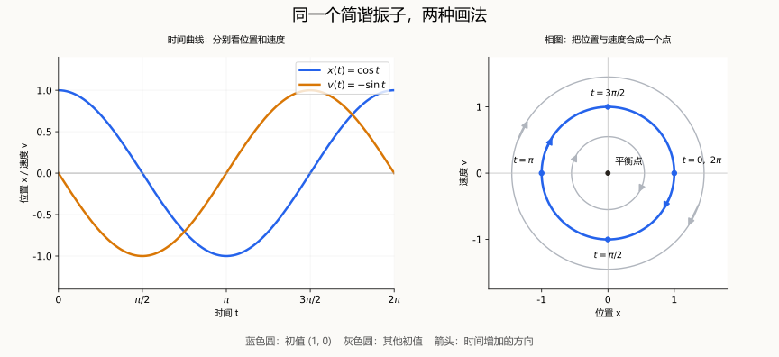

左图以时间为横轴，分别画位置和速度；右图把每一时刻的 $(x(t),v(t))$ 画成一个点。因为 $x^2+v^2=1$，这些点沿单位圆顺时针运动。这个圆画的是状态的变化，质点本身仍沿直线来回振动。

以位置为横轴、速度为纵轴的平面叫**相平面**。一个初值对应一条**相轨迹**；把不同初值的轨迹和运动方向画在一起，就得到**相图**。图中的灰色圆对应其他振幅，原点则是静止的平衡状态。

一般情况下，$v^2+\omega^2x^2$ 沿运动保持不变，相轨迹通常是椭圆。闭合轨迹表示位置和速度会一起周期性重复，这就是从相图读出振动行为的最简单例子。

对更复杂的系统，相图、横截面和返回映射同样提供了研究整体行为的入口。

稳定性成为一个自然问题：初值受到小扰动，轨迹是否仍留在原来的运动附近？Lyapunov 方法通过辅助函数沿轨迹的变化判断稳定性，使人们能够在没有显式解时得到结论。

同一时期，Runge–Kutta 等数值方法也逐渐形成。一步内多次估计变化率，可以提高轨迹计算的精度。几何研究与数值近似由此提供了两种互补的工具：前者解释运动结构，后者帮助计算具体轨迹。

### 二十世纪前半叶：理解逐次逼近为什么能找到解

这一时期，函数空间和不动点理论的发展，帮助人们解释“反复修正一条曲线，为什么能得到真正的解”。具体做法可以从 Picard 迭代看起。这个方法在十九世纪已经发展起来，二十世纪的新工具让它的收敛与唯一性有了更统一的解释。

Picard 迭代的想法很直接：**先猜一条曲线，用它算出变化率，再把这些变化累积起来，得到一条新的曲线。然后拿新曲线重复这个过程。**

例如，要解

$$
x'=x,\qquad x(0)=1.
$$

方程说：当前的值是多少，当前的增长速度就是多少。我们知道起点是 $1$，但还不知道后面怎么变。先作一个最简单的猜测：整段时间里都保持为 $1$，记为 $x^{(0)}(t)=1$。括号里的上标表示第几次猜测。

**第一次修正。** 按照这条猜测，增长速度始终是 $1$。从 $0$ 到 $t$，总共增加了 $t$，所以新曲线是

$$
x^{(1)}(t)=1+\int_0^t 1\,ds=1+t.
$$

**第二次修正。** 现在用 $1+s$ 作为时刻 $s$ 的状态，方程给出的增长速度也变成 $1+s$。把这段时间的增长累积起来，得到

$$
x^{(2)}(t)=1+\int_0^t(1+s)\,ds
=1+t+\frac{t^2}{2}.
$$

**第三次修正。** 再把上一条曲线代进去：

$$
x^{(3)}(t)=1+\int_0^t\left(1+s+\frac{s^2}{2}\right)\,ds
=1+t+\frac{t^2}{2}+\frac{t^3}{6}.
$$

继续下去，就会依次补出指数函数的级数。在任意固定的有限时间区间上，这些曲线会越来越接近 $e^t$，而 $e^t$ 正好满足原方程和初值。我们通过反复修正，逐步构造出了答案。

对一般初值问题 $x'=f(t,x)$、$x(t_0)=x_0$，同样先猜 $x^{(0)}(t)=x_0$，然后反复计算

$$
x^{(n+1)}(t)=x_0+\int_{t_0}^{t}f(s,x^{(n)}(s))\,ds.
$$

这条公式就是“起始状态，加上按照上一次猜测算出的累积变化”。每次更新的是一整条曲线。

不过，反复修正不一定会成功，还要证明曲线确实会靠近一个确定的答案。常用的保证是：在起点附近，$f$ 连续，而且状态稍微改变时，变化率的差异能被状态差异的某个固定倍数控制；再选足够短的时间区间，让每次修正把两条候选曲线之间的差距缩小。这样就能证明迭代收敛，并得到局部唯一解。

函数空间和不动点理论，正是把“曲线有多接近”“修正能否缩小差距”“最终会不会得到同一个答案”说清楚的工具。它们让这套猜测与修正的方法有了严格依据，也帮助人们继续研究初值改变后，解会怎样变化。

### 二十世纪中叶至今：自动求解、系统控制与长期预测

电子计算机让大量重复运算和大型方程组的计算更加可行。数值方法逐渐组织成通用求解器，自动估计误差、选择步长，并针对刚性问题使用合适的方法。第八章从 Euler 法走向更复杂的算法，正是进入这种计算方式的起点。

计算能力扩大以后，算法是否可靠也更加重要。例如，对 $y'=-\lambda y$、$\lambda>0$，精确解随时间衰减，而显式 Euler 法给出

$$
Y_{n+1}=(1-h\lambda)Y_n.
$$

若 $h\lambda>2$，数值结果会交替放大。真实系统的稳定性与算法在给定步长下的稳定性，需要分别研究。误差估计、收敛分析和数值稳定性，决定了计算曲线能在什么条件下逼近真实解。

导航、调节和自动化需求又推动了现代控制理论。状态方程可以加入输入 $u(t)$：

$$
x'=f(t,x,u).
$$

研究目标随之扩展：既要预测给定输入下的运动，也要选择输入或反馈，让系统达到目标并保持稳定。ODE 因而同时成为描述系统和设计系统的工具。

非线性动力系统中的分岔与混沌，则进一步提出长期预测的问题。计算机能够展示复杂轨迹，分析与几何方法帮助判断其结构；即使有限时间内解连续依赖于初值，微小误差也可能随时间显著增长，因此长期预测需要额外分析。

这些问题将在[动力系统与自动控制原理](../06-dynamical-systems-and-control/)中继续展开：从计算一条轨迹，走向理解轨迹的长期行为，以及通过输入和反馈改变系统的演化。

## 十一、为什么深度神经网络可以看作 ODE？这个视角的价值是什么？

把一张图片送进深度神经网络，网络会逐层修改它的特征表示：前面的层可能提取边缘，后面的层把这些信息组合成更适合分类的表示。我们可以把每一层的特征看作一个状态，把网络向前计算的过程看作状态不断变化的过程。

**其中，残差网络与 ODE 的联系最直接：每一层都在当前状态上加上一份改动，就像数值求解 ODE 时向前走一步。** 当每一步足够小，并满足相应的连续极限条件时，一串离散的层就可以近似一段连续的状态演化。这里的“时间”通常表示网络的深度，不是图片在现实中经历的时间。

### 从普通网络到残差网络：每层究竟改变了什么

用 $z_k$ 表示第 $k$ 层的特征向量。普通前馈网络的一层可以写成

$$
z_{k+1}=\sigma(W_kz_k+b_k).
$$

这里 $W_k$ 和 $b_k$ 是要学习的参数，$\sigma$ 是激活函数。它把当前特征变成下一层特征，但没有要求两层之间的改动很小，特征的维数也可能改变。

残差网络的一种基本更新形式则是

$$
z_{k+1}=z_k+F_k(z_k).
$$

右边保留原来的 $z_k$，再加上网络算出的改动 $F_k(z_k)$。可以把它读成：“先沿用当前表示，再根据当前信息修正一下。”这条相加的通路就是残差连接；直接相加要求两边维数一致，改变维数时通常需要投影等额外操作。

### 与 Euler 法对照：一层就是一次状态更新

第八章的显式 Euler 法是

$$
Z_{k+1}=Z_k+h f(t_k,Z_k).
$$

它的意思是：下一时刻的状态，约等于当前状态，加上“时间步长乘当前变化率”。把残差更新写成带步长的形式，便得到

$$
z_{k+1}=z_k+h f_\theta(t_k,z_k).
$$

两条公式的结构完全相同。区别在于，传统 ODE 问题通常已经给定变化规律 $f$；神经网络则通过训练学习带参数的变化规律 $f_\theta$。

| 网络中的量 | ODE 中的对应量 |
| --- | --- |
| 输入经过编码得到的特征 $z_0$ | 初始状态 $z(0)$ |
| 第 $k$ 层的特征 $z_k$ | 时刻 $t_k$ 的数值状态 |
| 残差分支 $f_\theta(t_k,z_k)$ | 当前状态的变化率 |
| 深度方向的步长 $h$ | 数值求解的时间步长 |
| 最后一层特征 | 演化结束时的状态 |

不同层可以使用不同参数，对应随深度变化的规律；各层共享同一套参数时，可以对应不显含时间的自治方程。普通残差块没有显式写出 $h$ 时，也可以形式上取 $h=1$。但这只说明更新形式像 Euler 法，并不保证它是某条连续轨迹的精确采样。

### 层越来越密时：从差分走向导数

先固定总演化长度 $T$，把它分成 $N$ 步，令 $h=T/N$、$t_k=kh$。将更新式移项并除以 $h$：

$$
\frac{z_{k+1}-z_k}{h}=f_\theta(t_k,z_k).
$$

左边是相邻两层之间的平均变化率。如果这些网络确实在逼近同一个变化规律，且该规律有足够的连续性、局部 Lipschitz 性和存在区间等保证，那么随着 $h\to0$，数值轨迹可以收敛到

$$
\frac{dz(t)}{dt}=f_\theta(t,z(t)),\qquad z(0)=z_0.
$$

这就是把离散深度变成连续深度的思路。**“层数增加”本身还不够，还需要每层的改动按步长缩小，并且变化规律在加深过程中受到控制。** 如果增加层数时，各层参数任意改变、每层仍作很大的跳跃，就不能直接声称存在上述连续极限。

### 一个能算清楚的例子：不断把特征缩小一点

设特征只有一个数，每层按下面的规则更新：

$$
z_{k+1}=z_k-hz_k=(1-h)z_k.
$$

走 $N$ 层以后，

$$
z_N=(1-h)^N z_0.
$$

固定 $T$，取 $h=T/N$，让层数增加，就得到

$$
z_N=\left(1-\frac{T}{N}\right)^N z_0\longrightarrow e^{-T}z_0.
$$

而 ODE

$$
z'=-z,\qquad z(0)=z_0
$$

的解恰好是 $z(t)=e^{-t}z_0$。所以，“很多次小幅缩小”在极限中变成“连续地指数衰减”。这里的 $-z$ 是手工指定的；真正的网络会从数据中学习怎样修改特征。

### Neural ODE：让网络学习变化率，再交给求解器

Neural ODE 把上述连续形式直接作为模型：用一个神经网络表示 $f_\theta$，给定初始特征，然后调用 ODE 求解器计算末端状态。这种模型及其与连续深度残差网络的联系，可以参见 Chen 等人的原始论文 [Neural Ordinary Differential Equations](https://arxiv.org/abs/1806.07366)。

例如，一个分类模型可以写成

$$
z(0)=E_\phi(x),\qquad
z'=f_\theta(t,z),\qquad
\widehat y=R_\psi(z(T)).
$$

这里 $x$ 是输入，$E_\phi$ 把输入编码成初始特征，$f_\theta$ 决定特征怎样连续变化，$R_\psi$ 把最终特征变成预测。训练时，用预测与标签之间的损失调整这些参数。

求解器仍会做离散计算，可能使用 Euler 法、Runge–Kutta 法或自适应步长方法。因此，“连续深度”说的是模型定义；计算机实际得到的仍然是有数值误差的近似结果。计算次数由变化规律、求解方法和误差容限共同决定，不再只是预先指定的层数。

### 为什么这个视角有用：把前面学的 ODE 工具带进网络

**可以分析特征会不会失控。** 把特征当作状态，就能利用存在唯一性、延拓和增长估计来判断连续模型是否有定义。例如，在有限深度区间内，若右端满足局部存在唯一性条件和线性增长限制，就能排除该区间内的有限时间爆破。许多由有限权重的仿射层和 ReLU 等 Lipschitz 激活组成的固定网络具有这样的增长控制，但包含乘法或其他更快增长操作的模型需要另行检查。

**可以理解为什么步长影响计算。** 前面的衰减例子中，连续解一直衰减；离散更新却是 $z_{k+1}=(1-h)z_k$。当 $h>2$ 时，状态会交替放大。可见，连续模型稳定，也不保证采用任意步长的离散计算都稳定。这正是第八章区分“方程的稳定性”和“算法的稳定性”的原因。

**可以把训练看作学习一条变化规律。** 网络不必只学习“输入直接变成什么输出”，还可以学习“当前特征接下来应该往哪个方向改变”。对连续时间观测等任务，也可以在不同观测时刻求取同一条轨迹的状态。

### 这个说法有什么边界

并非每个深度神经网络都能直接当作一个标准 ODE。普通网络可能改变维数、丢弃信息，或者在一层内作很大的变换；固定维数、满足唯一性条件的 ODE 则有更强的结构限制。

例如，同一个 ODE 的两条解轨迹，如果在同一时刻到达同一个状态，并且两条解在相关区间内都存在，那么唯一性会使它们在这个区间内重合。它不能让两个不同初始状态在有限时间内精确合并成同一个状态，而普通网络中的投影、池化等操作可以丢弃这类区别。Neural ODE 的编码器或输出层仍然可以压缩信息，因此这个限制针对的是中间的 ODE 演化部分。离散 Euler 更新也未必具有精确 ODE 流的这种性质。

另外，训练中的梯度下降也可以在小步长下联系到梯度流 ODE，但那里的状态是模型参数，时间表示训练进度；本章讨论的状态是特征，时间表示前向传播的深度。这是两种不同的联系。

### 本章小结：从逐层修改特征到连续演化

残差网络的“当前状态加上一点改动”，与 Euler 法的更新结构一致。在步长缩小、变化规律受到控制的条件下，可以进一步用 ODE 描述连续深度的特征演化。Neural ODE 则直接学习这个变化率，再通过数值求解器得到输出。

理解这条联系之后，前面的数值方法、存在唯一性、增长控制和稳定性，就都能用来研究网络的特征演化。使用这一视角时，要同时说明网络结构、连续模型的条件，以及实际离散计算的误差。