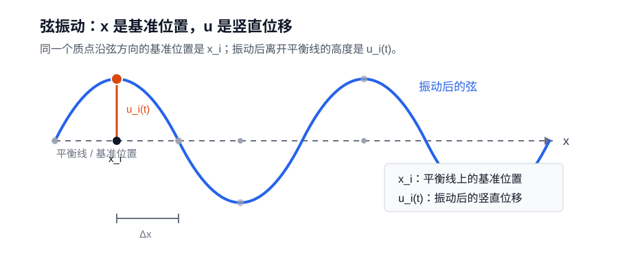

# 微分方程、动力系统与控制理论：连续变化的数学语言

## 一、前言

很多数学对象看起来是静止的。一个向量放在空间里，一个矩阵作用在向量上，一个函数把输入映射成输出。我们可以研究它们的结构、距离、角度、极值和变换。但现实里的许多问题不是静止的：温度会扩散，波会传播，粒子会运动，流体会流动，概率分布会改变，模型参数会在训练中一步步移动。

一旦对象开始变化，问题的味道就变了。我们不再只问“它是什么”，还要问“它怎样变成现在这样”，“接下来会往哪里走”，“小小的扰动会不会被放大”，“有没有一种力量或规则在背后推动它”。描述这种连续变化，最自然的语言就是微分方程。

微分方程的基本思想并不神秘。它不一定直接告诉我们某个量的完整表达式，而是先告诉我们这个量的变化率。比如一个物体的位置 $x(t)$ 随时间变化，速度就是它的导数；一个模型参数 $\theta(t)$ 在训练中变化，梯度会告诉它应该往哪个方向移动；一片空间里的温度 $u(x,t)$ 同时依赖位置和时间，我们就需要同时描述时间方向和空间方向上的变化。

如果未知量主要是一条随时间变化的轨迹，比如 $x(t)$，我们通常得到常微分方程，也就是 ODE。它关心的是一个状态怎样沿时间前进。如果未知量是一整个随时间和空间变化的场，比如温度场 $u(x,t)$、概率密度 $\rho(x,t)$、速度场 $v(x,t)$，我们就会进入偏微分方程，也就是 PDE。前者像是在研究一条线怎样走，后者像是在研究整片空间上铺开的图怎样变。

不过，只会写出微分方程还不够。很多微分方程并不能轻易解出显式公式。更重要的是，即使我们得到了一个公式，也未必真正理解了系统。一个系统从不同初值出发会不会走向同一个地方？某个平衡点附近的轨迹会靠近它，还是远离它？系统会不会振荡？会不会爆炸？有没有某种能量一直下降？这些问题不再只是“求解微分方程”，而是进入了动力系统的视角。

动力系统关心的是演化的结构。它把微分方程看成一个产生轨迹的规则，然后研究这些轨迹在状态空间里的整体行为。平衡点、稳定性、相图、吸引子、周期轨道、Lyapunov 函数，都是为了回答同一个问题：给定变化规律以后，系统长期会怎样？

控制理论则更进一步。它不只观察系统怎样演化，也不只分析系统是否稳定，而是关心怎样影响这个系统。给系统加一个输入，系统会怎样响应？能不能把状态从一个地方带到另一个地方？能不能只通过有限的观测推断内部状态？反馈能不能让不稳定的系统稳定下来？外界扰动和建模误差会不会破坏系统行为？这些问题都属于控制理论。

所以，微分方程、动力系统和控制理论不是三块互不相干的知识。它们之间有一条很自然的内在关系：

$$
\text{微分方程描述演化规律}
\longrightarrow
\text{动力系统研究演化结构}
\longrightarrow
\text{控制理论设计干预方式}.
$$

换句话说，微分方程回答“系统怎么动”，动力系统回答“这样动会发生什么”，控制理论回答“怎样让系统按我们希望的方式动”。如果再接上优化理论，就会得到最优控制：不只是让系统可控、稳定或可调节，还要在代价、能量、时间、风险等指标下选出最好的控制过程。

这个视角比单独谈最优控制更宽。经典控制会讨论开环控制、闭环控制、反馈、可控性、可观测性、稳定化和鲁棒性；现代控制还会连接最优控制、动态规划、Hamilton-Jacobi-Bellman 方程、Pontryagin 最大值原理、模型预测控制和强化学习。最优控制很重要，但它更适合看成控制理论中的一条主线，而不是这部分内容的全部。

这条线索和机器学习的关系，其实也可以用很朴素的话说清楚。训练模型不是一次完成的，参数会一步一步改变；生成样本也不是凭空变出来的，很多方法会把噪声一步步变成有结构的数据；如果模型要预测天气、流体、材料、电磁场或者概率分布，它面对的输出本身就可能是一整个随时间和空间变化的函数。只要问题里出现了“不断更新”“连续演化”“长期是否稳定”“怎样施加干预让结果更好”，微分方程、动力系统和控制理论的语言就会自然出现。

所以这里真正要建立的是一种连续时间的视角：怎样从变化率理解状态，怎样从方程理解轨迹和场，怎样从稳定性理解长期行为，怎样从输入、反馈和控制变量理解“在演化中干预系统”。有了这层直觉，后面再遇到连续时间模型、扩散过程、梯度流、函数空间里的学习问题和强化学习里的控制问题，就不会觉得它们是散落在不同地方的技巧，而是同一套语言在不同问题上的展开。

## 二、从 ODE 到 PDE：未知量从轨迹变成场

微分方程最基本的出发点，是用“变化率”描述一个对象怎样变化。对象简单一点时，未知量是一条随时间变化的轨迹；对象复杂一点时，未知量就是一整个随时间和空间变化的场。从 ODE 到 PDE，本质上就是从“研究一条轨迹”走向“研究一整片场”。

### 微分方程的基本分类

在正式区分 ODE 和 PDE 之前，可以先把微分方程里常见的分类方式捋一遍。很多名词看起来分散，其实是在从不同角度描述同一个方程：未知量是谁，导数对谁求，最高出现几阶导数，方程是不是线性的，右边有没有外部输入，系数是不是常数。

#### 按未知量依赖的变量分：ODE 和 PDE

如果未知函数只依赖一个自变量，通常就是常微分方程。例如：

$$
y'=f(x,y).
$$

这里未知函数是 $y(x)$，只对一个变量 $x$ 求导。它的解通常是一条曲线或轨迹。

如果未知函数依赖多个自变量，通常就是偏微分方程。例如：

$$
\frac{\partial u}{\partial t}=\Delta u.
$$

这里未知函数是 $u(x,t)$，既依赖空间 $x$，也依赖时间 $t$。它的解不是一条轨迹，而是一个随时间演化的场。

#### 按最高阶导数分：一阶、二阶和高阶

方程里出现的最高阶导数是几阶，它就是几阶微分方程。例如：

$$
y'=y
$$

是一阶方程，而：

$$
y''+y=0
$$

是二阶方程。PDE 里也一样，热方程是一阶时间导数、二阶空间导数，波方程则有二阶时间导数和二阶空间导数。

#### 按未知函数出现的方式分：线性和非线性

线性方程的意思是，未知函数和它的导数只以一次方出现，彼此之间不相乘，也不套进非线性函数里。比如：

$$
y'+p(x)y=q(x)
$$

是线性方程，而：

$$
y'=y^2
$$

就是非线性方程。PDE 里也是一样，热方程是线性的，而很多流体方程、反应扩散方程和非线性波方程都是非线性的。

#### 按右边有没有外部项分：齐次和非齐次

线性方程里还经常区分齐次和非齐次。以二阶常系数线性方程为例：

$$
ay''+by'+cy=0
$$

叫齐次方程；如果右边不是零：

$$
ay''+by'+cy=f(x),
$$

就叫非齐次方程。大白话说，齐次方程只描述系统自己的内部变化；非齐次方程还多了一个外部输入或外部 forcing。

#### 按系数是否变化分：常系数和变系数

比如：

$$
ay''+by'+cy=0
$$

里 $a,b,c$ 都是常数，这叫常系数方程。如果系数依赖自变量：

$$
a(x)y''+b(x)y'+c(x)y=0,
$$

就叫变系数方程。常系数方程通常更容易处理，因为它的结构在每个位置都一样；变系数方程则允许系统性质随位置或时间变化。

#### 按规律是否显式含时间分：自治和非自治

如果方程写成：

$$
\frac{dx}{dt}=f(x),
$$

右边不显式依赖 $t$，叫自治系统；如果写成：

$$
\frac{dx}{dt}=f(x,t),
$$

右边显式依赖 $t$，叫非自治系统。自治系统的规律不随时间改变，非自治系统则允许外部环境或规则本身随时间变化。

这些分类不是互相排斥的。同一个方程可以同时是“一阶、线性、非齐次、变系数 ODE”，也可以同时是“二阶、线性、齐次、常系数 ODE”。分类的目的不是背名词，而是快速判断一个方程属于什么类型、能用什么方法、应该从哪个角度理解它。

### 常微分方程的解是一条轨迹

常微分方程，也就是 ODE，描述的是一个量怎样随一个变量变化。最常见的那个变量就是时间。它的解通常是一条轨迹：随着时间往前走，状态在状态空间里画出一条线。

比如：

$$
\frac{dx}{dt}=f(x,t).
$$

这里 $x(t)$ 是系统在时间 $t$ 的状态，$\frac{dx}{dt}$ 是状态变化的速度，$f(x,t)$ 告诉我们：当系统处在状态 $x$、时间是 $t$ 的时候，它应该往哪个方向变化、变化得多快。

如果给定初始状态：

$$
x(0)=x_0,
$$

那么 ODE 关心的就是从 $x_0$ 出发以后，系统沿着怎样的轨迹运动。这个轨迹可以是一条直线，也可以是一条曲线；可以趋向某个平衡点，也可以发散、振荡，甚至出现更复杂的行为。

#### 变量分离法

高等数学里大家已经见过很多 ODE 的基本解法。最常见的一类是一阶变量分离方程：

$$
\frac{dy}{dx}=g(x)h(y).
$$

它的特点是可以把含 $y$ 的部分和含 $x$ 的部分分开，再两边积分。

例如：

$$
\frac{dy}{dx}=xy.
$$

当 $y\ne 0$ 时，可以写成：

$$
\frac{1}{y}\,dy=x\,dx.
$$

两边积分得到：

$$
\ln |y|=\frac{x^2}{2}+C,
$$

所以：

$$
y=Ce^{x^2/2}.
$$

这个例子说明，变量分离法的核心不是某个神秘技巧，而是把一个关于变化率的问题转化成两个可以积分的部分。

#### 一阶线性方程和积分因子

一阶线性方程通常写成：

$$
y'+p(x)y=q(x).
$$

这类方程可以用积分因子来解。积分因子通常取：

$$
\mu(x)=e^{\int p(x)\,dx}.
$$

两边乘上 $\mu(x)$ 后，方程变成：

$$
\mu(x)y'+\mu(x)p(x)y=\mu(x)q(x).
$$

左边正好是一个乘积的导数：

$$
\mu(x)y'+\mu(x)p(x)y=(\mu(x)y)'.
$$

所以原方程可以改写成：

$$
(\mu(x)y)'=\mu(x)q(x).
$$

两边积分：

$$
\mu(x)y=\int \mu(x)q(x)\,dx+C.
$$

于是：

$$
y=\frac{1}{\mu(x)}\left(\int \mu(x)q(x)\,dx+C\right).
$$

也就是说，积分因子的作用，是把左边整理成某个乘积的导数，然后把问题变成一次积分。

例如：

$$
y'+2y=e^{-x}.
$$

这里 $p(x)=2$，积分因子是：

$$
e^{\int 2\,dx}=e^{2x}.
$$

两边乘上 $e^{2x}$：

$$
e^{2x}y'+2e^{2x}y=e^x.
$$

左边正好是 $(e^{2x}y)'$，所以：

$$
(e^{2x}y)'=e^x.
$$

积分后得到：

$$
e^{2x}y=e^x+C,
$$

也就是：

$$
y=e^{-x}+Ce^{-2x}.
$$

#### 常系数线性方程

二阶常系数齐次线性方程通常写成：

$$
ay''+by'+cy=0.
$$

设 $y=e^{rx}$，代入后得到特征方程：

$$
ar^2+br+c=0.
$$

解这类方程时，关键就是看特征根的类型。通解可以直接按下面三种情况分类：

$$
y=
\begin{cases}
C_1e^{r_1x}+C_2e^{r_2x}, & r_1\ne r_2 \text{ 是两个不同实根},\\
(C_1+C_2x)e^{rx}, & r_1=r_2=r \text{ 是重根},\\
e^{\alpha x}(C_1\cos \beta x+C_2\sin \beta x), & r=\alpha\pm i\beta \text{ 是一对共轭复根}.
\end{cases}
$$

例如：

$$
y''-3y'+2y=0.
$$

特征方程是：

$$
r^2-3r+2=0,
$$

所以 $r=1,2$，通解为：

$$
y=C_1e^x+C_2e^{2x}.
$$

再比如：

$$
y''+2y'+5y=0.
$$

特征方程是：

$$
r^2+2r+5=0,
$$

所以：

$$
r=-1\pm 2i.
$$

通解为：

$$
y=e^{-x}(C_1\cos 2x+C_2\sin 2x).
$$
再往后，还会遇到齐次方程、恰当方程、二阶线性方程、非齐次项和待定系数法、常数变易法等。这些方法都很重要，但它们主要解决的是“怎样把方程算出来”。这一章更关心的是另一层问题：即使一个微分方程没有漂亮的显式解，我们还能不能理解它的行为？

### 从求解方程到研究系统

前面这些解法，主要是在回答“这个方程怎么算”。但很多时候，我们真正关心的不是把解写成一个漂亮公式，而是想知道系统整体会怎样。

例如指数增长方程：

$$
\frac{dx}{dt}=ax.
$$

它的解是：

$$
x(t)=x(0)e^{at}.
$$

如果 $a>0$，状态会增长；如果 $a=0$，状态保持不变；如果 $a<0$，状态会衰减。这里真正重要的不只是公式，而是参数 $a$ 决定了系统长期行为。$a$ 的符号一变，系统的命运就变了。


动力系统看 ODE，核心就是这种视角：不只是求出 $x(t)$，还要研究轨迹会往哪里走。它会关心平衡点、稳定性、振荡、发散、长期极限这些问题。这里先点到为止，后面讲动力系统时再专门展开。

再看一个和机器学习更近的例子：连续时间梯度下降。

$$
\frac{dx}{dt}=-\nabla f(x).
$$

它的意思是：状态 $x(t)$ 总是沿着函数 $f$ 下降最快的方向移动。普通梯度下降是一步一步更新：

$$
x_{k+1}=x_k-\eta \nabla f(x_k),
$$

而梯度流可以看成它的连续时间版本。这里也先把它当成例子，后面再用梯度流专门连接最优化、Lyapunov 方法和机器学习训练过程。

所以，这一小节只是完成一个转向：从“求解一个微分方程”，转向“把微分方程看成一个产生轨迹的系统”。真正的动力系统理论，会在后面的章节里继续展开。

### 偏微分方程的解是一个场

要理解为什么很多物理方程的解是“场”，可以先从牛顿力学里的质点说起。

牛顿力学最基本的对象是质点。假设只看一维运动，一个质点的位置是 $x(t)$，受力是 $F(x,t)$，牛顿第二定律可以写成：

$$
m\frac{d^2x}{dt^2}=F(x,t).
$$

这里未知量是 $x(t)$。解出来以后，我们得到的是这个质点在每个时刻的位置，也就是一条轨迹。哪怕位置本身是三维向量 $\mathbf{x}(t)$，它描述的仍然是“一个物体随时间怎么走”。这就是 ODE 最典型的物理图像：一个对象，一个状态，一条轨迹。

但真实世界里很多对象不是孤立质点，而是由大量相邻的小部分组成的整体。比如一根弦可以想成很多小质点连在一起，一块金属板可以想成很多小块互相传热，空气和水可以想成很多小团流体互相挤压和流动。每一个小部分当然也可以用牛顿方程描述，但如果小部分太多，我们就不会逐个写出每个质点的位置，而是改用一种连续的描述。

这个连续描述就是场。场的意思是：不是只给一个质点分配一个状态，而是给空间里的每个位置都分配一个量。温度场给每个位置分配温度，速度场给每个位置分配速度，电场给每个位置分配电场强度，概率密度场给每个位置分配概率密度。

这里顺便提一句：从“大量质点”出发，并不只有“连续场”这一条路。还有另一条很重要的路，是不再追踪每个质点的具体位置，而是研究大量粒子的平均行为、概率分布和涨落。这条路会通向统计物理。比如气体分子太多，不可能逐个写出每个分子的轨迹，于是我们改为研究温度、压强、密度、熵这些宏观量，以及它们背后的概率分布。所以场论和统计物理关系很近，但不能简单说场“进化成”统计物理。更深一层看，它们面对的是同一个困难：微观自由度太多，无法逐个追踪。场论选择保留空间位置上的连续结构，把许多局部自由度组织成一个函数；统计物理选择保留微观状态的不确定性，把许多粒子的行为压缩成概率分布、平均量和涨落。

#### 一个简单的场解：温度慢慢变平

为了看清楚 PDE 的解到底是什么样，先看一个最简单的热方程例子。设一根细杆两端温度固定为 $0$，杆内部的温度记作：

$$
u(x,t).
$$

这里 $x$ 表示杆上的位置，$t$ 表示时间，$u(x,t)$ 表示“位置 $x$ 在时间 $t$ 的温度”。热方程大致说的是：

$$
\frac{\partial u}{\partial t}=\kappa\frac{\partial^2u}{\partial x^2}.
$$

它的意思是：温度怎么变，取决于周围温度分布弯不弯、平不平。

如果一开始温度分布像一个山包：

$$
u(x,0)=\sin\frac{\pi x}{L},
$$

那么它后来的形状可以写成：

$$
u(x,t)=e^{-\kappa(\pi/L)^2t}\sin\frac{\pi x}{L}.
$$

这个公式不用急着推导。只看它的结构就够了：

$$
\text{随时间变小的系数}\times \text{空间中的正弦形状}.
$$

也就是说，空间形状还是一个正弦山包，但前面的系数会随着时间越来越小。于是温度分布会慢慢变矮，最后趋向于平的状态。

下面这张图改成二维的等温线图。横轴是位置 $x$，纵轴是时间 $t$。图里每一条曲线都是一条等温线，意思是：沿着同一条曲线走，$u(x,t)$ 的值相同。


这张图的读法和地图上的等高线类似。靠近上方、靠近中间的等温线表示较高温度，因为一开始细杆中间最热；越往下，时间越晚，同样的温度线会向两边展开，表示热量向周围扩散。到更晚的时候，高温区域消失，只剩下较低温度的等温线。这样看就更像“场”了：我们不是追踪一个点的运动，而是在整张 $x$-$t$ 平面上给每个点都填上一个温度值。ODE 的解像一条时间轨迹，而 PDE 的解是在“空间 + 时间”这张底板上铺开的一个场。

### 弦的振动：从牛顿第二定律到场方程

弦的振动正好能把“质点”和“场”这两个视角连起来。先不要一上来就把弦看成连续的线，而是把它想成很多小质点连在一起。

这里要先分清两个符号：$x$ 表示“在弦上的哪个位置”，$u$ 表示“这个位置偏离平衡位置多少”。也就是说，$x$ 是位置标签，$u$ 是位移大小。为了简单起见，我们假设弦主要做上下振动，质点沿弦方向的位置不变，只是竖直方向的位移在变。



离散情况下，第 $i$ 个小质点的平衡位置记作 $x_i$，它在时间 $t$ 的竖直位移记作：

$$
u_i(t).
$$

对这个小质点，最基本的力学规律还是牛顿第二定律：

$$
\text{质量}\times \text{加速度}=\text{合力}.
$$

写成公式就是：

$$
m\frac{d^2u_i}{dt^2}=F_i.
$$

左边是第 $i$ 个小质点的惯性项。关键是右边的合力 $F_i$ 从哪里来。弦上的小质点不是孤立的，它会被左右相邻的小质点拉扯。如果第 $i$ 个点比左右邻居高很多，它就会被往下拉；如果它比左右邻居低很多，它就会被往上拉；如果它和左右邻居几乎在一条直线上，合力就比较小。

可以把左右两边的拉扯分开看。右边邻居对第 $i$ 个点的拉力，和二者位移差有关：

$$
F_{i,\text{right}}\approx k\bigl(u_{i+1}(t)-u_i(t)\bigr).
$$

左边邻居对第 $i$ 个点的拉力，也和二者位移差有关：

$$
F_{i,\text{left}}\approx k\bigl(u_{i-1}(t)-u_i(t)\bigr).
$$

所以合力大约是：

$$
F_i
\approx F_{i,\text{right}}+F_{i,\text{left}}
=k\bigl(u_{i+1}(t)-u_i(t)\bigr)
+k\bigl(u_{i-1}(t)-u_i(t)\bigr).
$$

也就是说，第 $i$ 个点的受力来自“右边拉它”和“左边拉它”这两部分。于是离散的牛顿方程可以粗略写成：

$$
m\frac{d^2u_i}{dt^2}
\approx
k\bigl(u_{i+1}(t)-u_i(t)\bigr)
+k\bigl(u_{i-1}(t)-u_i(t)\bigr).
$$

如果把右边合并，才会得到常见的差分形式：

$$
k\bigl(u_{i+1}(t)-2u_i(t)+u_{i-1}(t)\bigr).
$$

这个量衡量的是第 $i$ 个点相对左右邻居的弯曲程度。到这里为止，我们仍然是在写很多个 ODE：每个小质点一个方程，每个方程描述一个位移 $u_i(t)$ 怎么随时间变化。

到这里为止，我们还是在把弦看成一串离散的小质点。每个质点有一个编号 $i$，相邻两个质点之间的距离记作 $\Delta x$。如果从左到右数，第 $i$ 个质点在平衡线上的位置可以记成：

$$
x_i=i\Delta x.
$$

现在想象我们把质点取得越来越密，也就是让 $\Delta x$ 越来越小。这样一来，弦就不再像一串分开的点，而越来越像一条连续的线。于是我们也不再主要用离散编号 $i$ 来标记质点，而是用连续的位置 $x$ 来标记弦上的点。

在这个过程中，离散位移：

$$
u_i(t)
$$

变成连续位移场。它的意思是：弦上位置 $x$ 处的点，在时间 $t$ 偏离平衡位置多少。

$$
u(x,t).
$$

更准确地说，可以把 $u_i(t)$ 看成 $u(x_i,t)$ 在离散点上的取值：

$$
u_i(t)\approx u(x_i,t).
$$

同时，相邻质点之间的差分在除以 $(\Delta x)^2$ 后，会变成空间二阶导数：

$$
\frac{u_{i+1}(t)-2u_i(t)+u_{i-1}(t)}{(\Delta x)^2}
\longrightarrow
\frac{\partial^2 u}{\partial x^2}.
$$

为什么可以这么做？可以用 Taylor 展开看一下。连续化以后，$u_i(t)$ 可以看成 $u(x_i,t)$。左右两个邻居分别是 $x_i+\Delta x$ 和 $x_i-\Delta x$，所以：

$$
u(x_i+\Delta x,t)
\approx u(x_i,t)+\Delta x\frac{\partial u}{\partial x}(x_i,t)
+\frac{(\Delta x)^2}{2}\frac{\partial^2u}{\partial x^2}(x_i,t),
$$

$$
u(x_i-\Delta x,t)
\approx u(x_i,t)-\Delta x\frac{\partial u}{\partial x}(x_i,t)
+\frac{(\Delta x)^2}{2}\frac{\partial^2u}{\partial x^2}(x_i,t).
$$

把这两个式子相加，再减去 $2u(x_i,t)$，中间的一阶导数项会互相抵消，剩下的主要就是：

$$
u(x_i+\Delta x,t)-2u(x_i,t)+u(x_i-\Delta x,t)
\approx
(\Delta x)^2\frac{\partial^2u}{\partial x^2}(x_i,t).
$$

所以：

$$
\frac{u(x_i+\Delta x,t)-2u(x_i,t)+u(x_i-\Delta x,t)}{(\Delta x)^2}
\approx
\frac{\partial^2u}{\partial x^2}(x_i,t).
$$

这一步的直觉是：离散差分描述“中间点比左右邻居弯多少”，而二阶导数描述连续曲线在某个位置“弯多少”。它们说的是同一件事，只是一个在离散质点链上说，一个在连续弦上说。

于是，原来很多个小质点各自满足的牛顿方程，在连续极限下合并成一个关于位移场 $u(x,t)$ 的偏微分方程：

$$
\frac{\partial^2 u}{\partial t^2}
=c^2\frac{\partial^2 u}{\partial x^2}.
$$

这就是一维波方程。左边是场在时间上的加速度，右边是场在空间上的弯曲程度。它说的是：弦上每个位置的加速度，由这个位置附近的弯曲情况决定。

所以这不是三条孤立的公式，而是一条清楚的过渡链条：

$$
\text{单个质点的牛顿方程}
\longrightarrow
\text{很多相邻质点的耦合 ODE}
\longrightarrow
\text{连续介质的 PDE}.
$$

波也正是在这个意义上把质点和场联系起来。微观上，每个小质点只是在附近上下振动；宏观上，许多相邻质点的振动互相传递，形成了沿着弦传播的波。单个质点给出轨迹，连续介质给出场，波则是这个场随时间传播的形状。

这就是很多数学物理方程里 PDE 出现的原因：我们研究的不是单个质点，而是连续介质；不是一个位置 $x(t)$，而是每个空间位置上的状态 $u(x,t)$；不是一条轨迹，而是一个场随时间演化。

所以，从 ODE 到 PDE，关键变化不是公式变长了，而是未知量的性质变了：

$$
\text{一个质点的轨迹 } x(t)
\longrightarrow
\text{整个空间上的场 } u(x,t).
$$

ODE 问的是：这个状态点沿时间怎么走？PDE 问的是：空间中每个位置上的量，怎样一边受周围位置影响，一边随时间变化？

### 场的几种基本类型

场这个词本身并不规定“每个点上放什么”。真正重要的是：空间里的每个位置，都有一个对应的量。这个量可以是一个数，也可以是一个向量，甚至可以是更复杂的对象。第一遍先分清三种最常见的情况。

最简单的是一维标量场。所谓标量，就是一个数。比如后面弦振动会出现的位移：

$$
u(x,t).
$$

如果先固定时间 $t$，那么 $u(x,t)$ 就是在一条线上给每个位置 $x$ 放一个数：这个位置偏离平衡线多少。前面的温度例子也一样：固定某个时间以后，细杆上每个位置都有一个温度值。曲线上的每个点都有一个高度，这就是最朴素的“场”的图像。

再往上是二维标量场。温度场就是标量场：给定一个位置 $(x,y)$，温度 $u(x,y)$ 只回答一个问题：这里多少度？它没有方向，只是一个数。电势、电压、高度、密度、压强，也常常是这种二维或三维标量场。地图上的地形高度也是标量场：每个经纬度位置对应一个海拔高度。

二维标量场可以用等高线、等温线、等势线来画。比如地形图里，一条等高线上的高度相同；温度图里，一条等温线上的温度相同；电势图里，一条等势线上的电势相同。这样画的好处是，我们不用真的画三维曲面，也能看出这个场哪里高、哪里低、哪里变化快。

另一类是二维向量场。风速场就是向量场：给定一个位置 $(x,y)$，风速不只要回答“多快”，还要回答“往哪里吹”。所以这个点上放的不是一个数，而是一支箭头。箭头有方向，也有大小。流体速度场、力场、电场，也经常用向量场来描述。

所以，温度场和风速场都是场，但它们不是同一种场。温度场每个点给一个数，风速场每个点给一个箭头。区分这一点，是为了后面看公式时不混淆：有些方程研究的是数值怎样分布，有些方程研究的是方向和流动怎样变化。

## 三、PDE 的三种经典类型

这一节从数学物理方程的传统分类入手，先建立三种基本直觉：平衡、扩散和传播。


### 拉普拉斯算子：一个点和周围相比有多突出

#### 先从标量场讲起

拉普拉斯算子并不是只能用于标量场。这里先从标量场讲起，只是因为它最容易看清核心直觉。温度场 $u(x,y)$、电势场 $u(x,y)$、高度场 $u(x,y)$ 都是标量场：每个空间位置上放一个数。

对这样的场，拉普拉斯算子写成：

$$
\Delta u.
$$

它最核心的问题不是“这个点的数值是多少”，而是“这个点和周围位置相比怎么样”。换句话说，$\Delta u$ 描述的是局部关系：当前位置相对附近平均水平是高了、低了，还是差不多。

比如温度场里，某个点温度很高，但周围也同样高，那么这个点并不突出；另一个点温度未必最高，但如果它比周围明显高出一截，它就是一个局部热峰。拉普拉斯算子看的正是这种局部对比。

#### 一维、二维、三维里的写法

一维时，只有左右两个方向，拉普拉斯算子就是二阶空间导数：

$$
\Delta u=\frac{\partial^2u}{\partial x^2}.
$$

二维时，除了左右，还要看上下，所以把 $x$、$y$ 两个方向的二阶变化加起来：

$$
\Delta u
=
\frac{\partial^2u}{\partial x^2}
+
\frac{\partial^2u}{\partial y^2}.
$$

三维时再加上 $z$ 方向：

$$
\Delta u
=
\frac{\partial^2u}{\partial x^2}
+
\frac{\partial^2u}{\partial y^2}
+
\frac{\partial^2u}{\partial z^2}.
$$

这些公式看起来只是把二阶偏导数加在一起，但背后的意思是同一个：在每个空间方向上，都拿当前位置和附近位置比较，然后把这些比较合成一个局部量。

离散地看，一维情况下相邻三个点的值是：

$$
u_{i-1},\quad u_i,\quad u_{i+1}.
$$

中间点和左右邻居的关系可以写成：

$$
\bigl(u_{i+1}-u_i\bigr)+\bigl(u_{i-1}-u_i\bigr)
=u_{i+1}-2u_i+u_{i-1}.
$$

再除以网格间距的平方，就得到一维离散拉普拉斯：

$$
\frac{u_{i+1}-2u_i+u_{i-1}}{(\Delta x)^2}.
$$

前面在弦振动的连续极限里已经看过这个过程：点越来越密、$\Delta x$ 越来越小时，离散差分会变成连续的二阶空间导数：

$$
\frac{u_{i+1}-2u_i+u_{i-1}}{(\Delta x)^2}
\longrightarrow
\frac{\partial^2u}{\partial x^2}
=\Delta u.
$$

所以无论一维、二维还是三维，拉普拉斯算子的核心都不是维度本身，而是“一个点和周围其它位置的关系”。
#### 回看前面的两个例子

现在可以用拉普拉斯算子重新理解前面的两个例子。

第一个例子是细杆上的温度场。我们写 $u(x,t)$，意思是位置 $x$、时间 $t$ 的温度。固定时间 $t$ 后，$u$ 就是一维标量场。热方程里出现的

$$
\frac{\partial u}{\partial t}=\kappa\Delta u
$$

可以读成：一个位置的温度怎样随时间变化，取决于这个位置相对周围温度是否突出。如果这里比周围热，热量会向旁边扩散；如果这里比周围冷，周围会把它补上；如果这里和周围差不多，变化就小。所以热方程里的 $\Delta u$，抓住的是温度场的局部不均匀。

第二个例子是弦的振动。弦上的位移场写成 $u(x,t)$，意思是位置 $x$、时间 $t$ 的竖直位移。波方程可以写成：

$$
\frac{\partial^2u}{\partial t^2}=c^2\Delta u.
$$

这里左边是时间上的加速度，右边的 $\Delta u$ 是空间上的弯曲程度。也就是说，弦上某个点为什么会加速？不是因为它自己有一个绝对位移，而是因为它和附近的点相比形成了弯曲。局部弯得越明显，张力带来的恢复作用越明显。

所以这两个例子里，拉普拉斯算子都在做同一件事：它不看一个点孤立的数值，而看这个点和周围组成的局部形状。对温度场，这种局部形状决定扩散；对弦的位移场，这种局部形状决定振动的加速度。

#### 二阶导数给的是几何信息

二阶导数提供的信息往往是几何的。一阶导数告诉我们函数在某个方向上是上升还是下降；二阶导数告诉我们局部形状是弯上去、弯下去，还是比较平。

最优化里也是同一个道理：梯度给出下降方向，Hessian 矩阵给出目标函数在各个方向上的弯曲程度。一个点是不是局部极小、某个方向是不是很陡、某些方向是不是几乎平坦，都要靠二阶信息来判断。几何优化、自然梯度、Newton 方法这些思想，也都离不开“局部形状”这个层面的信息。

拉普拉斯算子可以看成这种二阶几何信息在 PDE 里的一个重要版本。它不像完整 Hessian 矩阵那样保留所有方向之间的细节，而是把各个空间方向上的二阶弯曲加总起来，得到一个总体的局部弯曲量。

#### 符号和历史地位

拉普拉斯算子通常写成 $\Delta u$，也常写成 $\nabla^2u$。这两个写法表示的是同一个东西。$\Delta$ 是希腊字母大写 Delta，在数学里常和差异、变化有关；$\nabla^2$ 的写法来自向量分析，表示这个算子也可以写成：

$$
\Delta u=\nabla\cdot(\nabla u).
$$

这里的散度就是散度，不需要在这一节展开。对现在的读者来说，只要记住：$\Delta u$ 处理的是标量场；$\nabla^2u$ 和 $\Delta u$ 是同一个拉普拉斯算子的两种写法。

历史上，拉普拉斯算子和势函数问题关系很深。十八、十九世纪研究引力、电势、流体和热传导时，人们经常遇到这样的问题：空间里每个点都有一个势函数或温度函数，它在没有源、没有汇、没有外部注入的地方，应该怎样达到局部平衡。这个平衡条件可以写成：

$$
\Delta u=0.
$$

这里要分清楚：$\Delta$ 是拉普拉斯算子，$\Delta u=0$ 才是拉普拉斯方程，也叫 Laplace 方程。

那它到底是谁提出的？如果问“类似形式最早由谁写出”，答案并不单一。Euler、d’Alembert 等人在研究流体和复变函数早期问题时，已经遇到过这类方程。如果问“为什么它叫 Laplace 方程”，答案更明确：Pierre-Simon Laplace 在十八世纪后期研究引力势、天体力学，特别是土星环稳定性等问题时系统使用了这个方程，使它在势理论中变成核心方程。因此后人把 $\Delta u=0$ 称为 Laplace 方程。后来人们又把方程里的核心空间算子 $\Delta$ 单独拿出来，称为 Laplace operator，也就是拉普拉斯算子。

它的历史地位很高，是因为它把很多物理问题里的同一种结构抽象了出来：一个标量场在某个点的状态，受周围邻近位置约束。引力势、电势、稳态温度、不可压流体的势函数，背后都会出现类似的空间平衡关系。换句话说，拉普拉斯算子不是某个方程里的偶然符号，而是“局部和周围如何相互约束”的核心语言。

所以最后可以用一句话收住：拉普拉斯算子就是把“一个标量场里的某个点和周围相比有多突出”这件事，用微分的语言写出来。


### 椭圆型方程：平衡与稳态

椭圆型方程最重要的直觉是：它描述的通常不是“一个场怎样随时间变化”，而是“一个场在平衡时应该长什么样”。

#### Laplace 方程：没有内部源的平衡

最典型的例子是 Laplace 方程：

$$
\Delta u=0.
$$

这里没有 $\partial u/\partial t$，也没有 $\partial^2u/\partial t^2$。也就是说，方程里没有显式的时间演化。它不是在问“下一秒会怎样”，而是在问：如果系统已经达到平衡，那么空间里的每个点和周围应该满足什么关系？

根据前面对拉普拉斯算子的解释，$\Delta u$ 衡量的是一个点相对周围是否突出。所以

$$
\Delta u=0
$$

可以读成：在没有外部源的地方，每个点都不应该比周围平均水平更突出。它既不是局部山峰，也不是局部谷底，而是和附近点保持一种平衡关系。

#### 边界决定内部

椭圆型方程最有代表性的现象是：边界条件决定区域内部。

想象一块薄金属板，边缘温度被固定住。过了很久以后，板内部的温度不再随时间变化，这时就进入稳态。稳态温度场 $u(x,y)$ 往往满足：

$$
\Delta u=0.
$$

这句话的意思是：板内部没有新的热源，也没有新的冷源；内部每个点的温度都由周围温度牵制。真正外部给定的信息在边界上：边缘哪里热，哪里冷，内部温度场就会被这些边界条件“拉”成某种平衡形状。

这和 ODE 的初值问题很不一样。ODE 常常是给一个初始状态，然后沿时间往前走；椭圆型 PDE 常常是给一圈边界条件，然后问区域内部怎样填满。它更像是在解一个空间拼图：边界已经固定，内部要以最平滑、最平衡的方式接上去。

#### 调和函数的直觉

“调和”这个词在数学里出现过很多次。比如调和平均、调和级数、调和不等式、调和分析、调和函数。它们不是同一个概念，不能简单混在一起，但背后有一条相通的气质：都和某种“协调关系”有关。

调和平均强调的是一种特殊的平均方式，常出现在速率、比例这类问题里；调和不等式比较的是不同平均之间的关系；调和分析研究的是怎样把复杂函数分解成正弦、余弦这类基本振动成分。这里的“调和”，最早和音乐里的泛音、振动、频率有关，后来逐渐变成数学里描述平均、平衡、周期结构的一类语言。

PDE 里的调和函数，是这个词在势理论和 Laplace 方程里的用法。满足

$$
\Delta u=0
$$

的函数叫调和函数。它最重要的直觉是平均性：一个点的值，和它周围一小圈的平均值相等。

这句话非常深。它说明调和函数内部不会凭空冒出一个孤立的尖峰，也不会凭空出现一个孤立的深坑。如果内部某个点突然比周围高很多，那它就不是平衡；如果某个点比周围低很多，也不是平衡。真正的最大值和最小值通常由边界控制。

这也是为什么 Laplace 方程常常和“平滑”“均衡”“没有内部源”这些词联系在一起。它不是把场往某个方向推，而是要求整个场在空间中达成一种局部协调。

#### Poisson 方程：有源的平衡

如果区域内部有热源、电荷、质量分布，平衡方程就不再是 $\Delta u=0$，而会变成 Poisson 方程：

$$
\Delta u=f.
$$

这里的 $f$ 表示内部的源项。比如在静电问题里，$u$ 可以表示电势，$f$ 和电荷密度有关；在引力问题里，$u$ 可以表示引力势，$f$ 和质量分布有关；在稳态热传导里，$f$ 可以表示内部热源。

所以 Laplace 方程和 Poisson 方程的区别可以这样理解：

$$
\Delta u=0
\quad\text{表示没有内部源的平衡，}
$$

$$
\Delta u=f
\quad\text{表示有内部源的平衡。}
$$

一个是“内部只由边界牵制”，一个是“内部还受到源项影响”。

### 抛物型方程：扩散与耗散

抛物型方程最重要的直觉是：一个场先有一个初始状态，然后这个状态会随着时间不断扩散、变平、丢失尖锐细节。它关心的是“过程”：一开始怎样，后来怎样，最后可能趋向什么。

最典型的例子是热方程：

$$
\frac{\partial u}{\partial t}=\kappa \Delta u.
$$

这里 $u(x,t)$ 是温度场，$\kappa>0$ 是扩散系数。左边 $\partial u/\partial t$ 表示温度随时间怎么变；右边 $\Delta u$ 表示当前位置和周围相比是否突出。于是热方程可以读成一句话：一个地方温度变化的速度，取决于它和周围温度的差异。

如果某个位置比周围热，它会把热量传给周围，自己降下来；如果某个位置比周围冷，周围会把它补上；如果局部已经很平，变化就很小。这就是扩散。

#### 初值驱动时间演化

抛物型方程通常要给初值。比如一根细杆上的温度满足：

$$
\frac{\partial u}{\partial t}=\kappa\frac{\partial^2u}{\partial x^2},
$$

初始温度是：

$$
u(x,0)=u_0(x).
$$

这里 $u_0(x)$ 不是一个数，而是一整个函数：它告诉我们初始时刻每个位置的温度。之后热方程负责把这个初始温度场往后推进。

这和椭圆型方程的味道很不一样。椭圆型方程通常把边界条件、外在源项或约束条件固定住，然后问：在这些条件一直存在的情况下，内部场最终应该是什么平衡形状？抛物型方程则先给一个初始场，然后问：这个场在扩散、耗散和相互平均的作用下，时间往后会怎样变化？所以椭圆型方程更像是在求“固定条件下的稳态”，抛物型方程更像是在追踪“初始状态走向稳态的过程”。

#### 扩散会平滑尖锐结构

抛物型方程有一个很强的特点：它会平滑初始状态。

如果一开始温度场很尖锐，比如某个地方突然很热，热方程会立刻把这个尖峰摊开。时间越往后，尖峰越矮，影响范围越宽，整个场越来越平滑。前面画过的等温线图，就是这种现象：高温区域不是保持原样移动，而是不断扩散、变淡、变宽。

这也是抛物型方程和很多机器学习直觉发生联系的地方。所谓平滑，不只是物理里的热传导，也可以理解成信息在邻近点之间传播、尖锐差异被平均化。图上的扩散、随机游走、某些正则化方法，都有类似味道。

#### 耗散和不可逆

抛物型方程还有一个关键词：耗散。

热传导会让温度差变小。一个热峰扩散开以后，我们通常不能只看最后平滑的温度场，就唯一地倒推出最初那个尖峰到底在哪里、形状怎样。很多细节已经被扩散过程抹掉了。

所以抛物型方程常常带有不可逆的味道。时间往前走，场越来越平滑；如果强行往回倒推，问题往往会变得非常不稳定。热方程正向很好算，反向却很敏感：最后状态里一点点误差，倒回去都可能被放大成很大的差别。

#### 长时间极限可能变成椭圆型问题

这里要小心区分两个层次。

热方程本身是抛物型方程，因为它描述的是温度场随时间变化：

$$
\frac{\partial u}{\partial t}=\kappa\Delta u.
$$

如果一块介质的边界温度被持续固定，内部温度一开始可以很乱。这个“从乱到平”的过程，仍然由热方程描述，所以它是抛物型问题。

但是，当时间足够长，内部温度最后不再变化时，我们看的就不是演化过程本身，而是演化的终点。这个终点满足：

$$
\frac{\partial u}{\partial t}=0.
$$

代回热方程，得到：

$$
\Delta u=0.
$$

这时候出现的就是椭圆型方程。也就是说，同一个物理系统里可以同时出现两种问题：热方程描述“怎样走向平衡”，Laplace 方程描述“平衡以后长什么样”。抛物型方程不是椭圆型方程；只是很多抛物型演化的长期稳态，会由椭圆型方程刻画。

### 双曲型方程：传播与波动

双曲型方程最重要的直觉是：场里的扰动会沿着一定方向传播出去，而不是只在原地扩散、变平。

这类方程最关心的问题是：信息从哪里来，沿哪里走，以什么速度到达远处。声波、弦波、水波、电磁波、弹性波，都有这种传播图像。它们背后的物理机制可以不同，但数学上常常共享一个特点：局部变化不会只是被平均掉，而会作为信号向外传递。

#### 波方程：最典型的双曲型方程

最典型的双曲型 PDE 是波方程：

$$
\frac{\partial^2 u}{\partial t^2}=c^2\Delta u.
$$

这里 $u(x,t)$ 可以表示弦的位移、声压扰动，或者某种波动量。左边是时间上的加速度，右边是空间上的弯曲程度。它说的是：场在某个位置怎样加速，取决于这个位置附近的空间形状。

前面弦振动的例子正是这个意思。弦上某个点如果和左右邻居几乎在一条直线上，局部恢复力很小；如果这里弯得很厉害，张力就会把它拉回去。这种局部恢复作用一层层传给邻近位置，就形成了波的传播。

在经典物理的入门层面，最常见的波可以先分成两类：机械波和电磁波。

机械波需要介质。弦波、声波、水波、地震波、弹性波都属于这一类。它们本质上是介质内部的位移、压强、密度或形变扰动在传播。前面从离散质点和牛顿第二定律推导弦振动方程，其实就是机械波最典型的来源：介质中的一小部分受力、加速，再通过弹性作用影响旁边的部分。声波也可以放在这个图像里；宏观上，它可以由牛顿第二定律、质量守恒和介质的状态关系一起推出波方程。

电磁波不需要机械介质。光、无线电波、微波、X 射线都属于电磁波。它们不是“小质点拉动小质点”，而是电场和磁场按照 Maxwell 方程组互相演化。

在真空、没有电荷和电流的情况下，Maxwell 方程组可以写成：

$$
\nabla\cdot \mathbf{E}=0,
$$

$$
\nabla\cdot \mathbf{B}=0,
$$

$$
\nabla\times \mathbf{E}=-\frac{\partial \mathbf{B}}{\partial t},
$$

$$
\nabla\times \mathbf{B}=\mu_0\varepsilon_0\frac{\partial \mathbf{E}}{\partial t}.
$$

前两条说真空里没有电荷源和磁单极子；后两条说变化的磁场会产生旋转的电场，变化的电场会产生旋转的磁场。正是后面这种互相激发，使电磁扰动可以自己传播下去。

这个推导不算太复杂。先对 Faraday 方程两边取旋度：

$$
\nabla\times(\nabla\times\mathbf{E})
=-\frac{\partial}{\partial t}(\nabla\times\mathbf{B}).
$$

把 Maxwell 方程里的

$$
\nabla\times\mathbf{B}=\mu_0\varepsilon_0\frac{\partial\mathbf{E}}{\partial t}
$$

代进去，右边变成：

$$
-\mu_0\varepsilon_0\frac{\partial^2\mathbf{E}}{\partial t^2}.
$$

左边用一个向量恒等式：

$$
\nabla\times(\nabla\times\mathbf{E})
=\nabla(\nabla\cdot\mathbf{E})-\Delta\mathbf{E}.
$$

而真空中 $\nabla\cdot\mathbf{E}=0$，所以左边只剩下：

$$
-\Delta\mathbf{E}.
$$

于是得到：

$$
-\Delta\mathbf{E}
=-\mu_0\varepsilon_0\frac{\partial^2\mathbf{E}}{\partial t^2}.
$$

整理一下：

$$
\frac{\partial^2\mathbf{E}}{\partial t^2}
=\frac{1}{\mu_0\varepsilon_0}\Delta\mathbf{E}.
$$

这就是电场的波动方程。磁场 $\mathbf{B}$ 也可以用同样方法推出：

$$
\frac{\partial^2\mathbf{B}}{\partial t^2}
=\frac{1}{\mu_0\varepsilon_0}\Delta\mathbf{B}.
$$

如果记

$$
c=\frac{1}{\sqrt{\mu_0\varepsilon_0}},
$$

那么两者都可以写成标准波方程形式：

$$
\frac{\partial^2 \mathbf{E}}{\partial t^2}=c^2\Delta \mathbf{E},\qquad
\frac{\partial^2 \mathbf{B}}{\partial t^2}=c^2\Delta \mathbf{B}.
$$

这个 $c$ 就是真空中的光速。所以电磁波也属于波动现象，也和双曲型 PDE 有关，但它的物理来源不是牛顿质点链，而是 Maxwell 场方程。

更现代的物理里还会出现物质波、引力波等概念，它们不完全落在上面这个入门分类里，这里先不展开。对这一章来说，最重要的不是穷尽所有波的分类，而是看到：不同物理机制都可能导向双曲型 PDE，因为它们都描述扰动以有限速度传播。

#### 为什么要给初始形状和初始速度

波方程含有二阶时间导数，所以只给初始形状还不够，还要给初始速度。典型条件是：

$$
u(x,0)=u_0(x),
$$

$$
\frac{\partial u}{\partial t}(x,0)=v_0(x).
$$

第一条告诉我们一开始弦是什么形状，第二条告诉我们每个位置一开始往哪里动、动得多快。

这和牛顿力学很像。牛顿第二定律给出的通常是二阶方程：

$$
m\frac{d^2x}{dt^2}=F(x,t),
$$

或者更一般地，力也可能和速度有关：

$$
m\frac{d^2x}{dt^2}=F(x,\dot{x},t).
$$

因为它是二阶方程，所以要求解一条具体轨迹，通常要同时给出初始位置和初始速度：

$$
x(0)=x_0,\qquad \dot{x}(0)=v_0.
$$

如果只知道一个小球现在在哪里，却不知道它现在是静止、向左运动还是向右运动，后面的轨迹就不能唯一确定。波方程也是这个道理，只不过未知量不再是一个质点的位置 $x(t)$，而是一整根弦或一片空间里的位移场 $u(x,t)$。

#### 有限传播速度

双曲型方程和抛物型方程有一个很重要的差别：一个地方的扰动，怎样影响远处？

对双曲型方程来说，影响通常不是同时传遍整个空间，而是以有限速度向外传播。离扰动点近的地方先发生变化，远的地方后发生变化，中间会形成一个传播前沿。所谓“波”，说的正是这种有方向、有速度、有到达时间的场的运动。

机械波最容易看出这个直觉。想象一根弦，或者一排用弹簧连起来的小质点。你拨动其中一个质点，远处的质点不会立刻动起来；这个质点先拉动旁边的质点，旁边的质点再拉动更远的质点，影响是一层一层传过去的。传播速度取决于局部相互作用有多强、介质有多“重”。弦波速度由张力和线密度决定，声波速度由介质的弹性和密度决定。

波方程把这种机制压缩成一个参数 $c$。如果波速是 $c$，那么距离很远的地方不会马上知道这里发生了什么。扰动只能以有限速度沿着空间传出去。这就是双曲型方程的“传播”味道：它不是把尖峰直接抹平，而是把局部变化传给远处。

抛物型方程的典型代表是热方程：

$$
\frac{\partial u}{\partial t}=\kappa\Delta u.
$$

热方程描述的是扩散。高温的地方把热量传给低温的地方，局部差异不断被平均，尖锐结构慢慢变钝。经典热方程在数学上有一个理想化性质：只要时间稍微往后走一点，一个局部温度扰动就会对任意远处产生极小影响。这常被称为“无限传播速度”。

这句话不要按字面理解成真实热量可以瞬间传到宇宙另一边，更不是说热量可以超光速传递。它说的是经典热方程这个连续介质模型的数学性质。更精细的物理模型会考虑微观粒子碰撞、声子传播、相对论限制等因素。

电磁场也不是“瞬间传播”的例子。电磁波是典型的有限速度传播，在真空中的速度就是光速。在相对论物理里，真实的因果信号不能超过光速。一般数学 PDE 里的速度参数 $c$ 则只是模型中的传播速度：它可以是弦波速度、声速、水波近似速度，也可以是抽象模型里的速度，不一定就是光速。

#### 输运方程：最简单的一阶双曲型方程

除了二阶波方程，一阶输运方程也是双曲型 PDE 里非常重要的一类。它通常属于一阶双曲型方程，所以放在这里并不是顺手举例，而是因为它和波方程共享同一个核心特征：信息沿着特定方向传播。

最简单的输运方程是：

$$
\frac{\partial u}{\partial t}+c\frac{\partial u}{\partial x}=0.
$$

这个方程的物理意义是“搬运”。这里的 $u(x,t)$ 可以表示传送带上某种标记的分布、道路上的车流密度，或者河面上一排漂浮物的位置密度。$c$ 是搬运速度。如果 $c>0$，整个图像向右移动；如果 $c<0$，整个图像向左移动。

它和热方程看起来有点像，因为两者左边都有时间导数，都在描述一个场随时间变化：

$$
\text{输运方程：}\quad \frac{\partial u}{\partial t}+c\frac{\partial u}{\partial x}=0,
$$

$$
\text{热方程：}\quad \frac{\partial u}{\partial t}=\kappa\frac{\partial^2u}{\partial x^2}.
$$

但右边的空间结构完全不同。输运方程里出现的是一阶空间导数 $\partial u/\partial x$，它描述的是图像的斜率。这个斜率告诉我们：如果整个图像往右平移，固定位置上的数值会怎样变化。所以输运方程表达的是“形状被搬走”。

热方程里出现的是二阶空间导数 $\partial^2u/\partial x^2$，它描述的是一个点和周围相比是凸出来还是凹下去。这个局部不平衡会驱动高处往低处扩散，所以热方程表达的是“形状被抹平”。

所以两者的差别可以很直观地记：输运方程搬运形状，热方程平滑形状。你可以想象传送带上的一段彩色条纹：如果只是输运，条纹会整体移动；如果有扩散，条纹边缘会慢慢变模糊。

从公式上看，$\partial u/\partial t$ 表示某个固定位置上的值随时间怎样变化，$c\partial u/\partial x$ 表示这个变化来自空间图像的平移。两项加起来等于 $0$，意思是：如果你站在固定位置看，数值会变；但如果你跟着速度 $c$ 一起走，就会看到同一个值被一路带过去。

它的解可以写成：

$$
u(x,t)=u_0(x-ct).
$$

这句话非常直观：初始形状 $u_0$ 没有被抹平，只是以速度 $c$ 向右移动。

#### 特征线：把 PDE 化成 ODE 的求解工具

输运方程为什么能直接解出来？核心工具就是特征线。

对方程

$$
\frac{\partial u}{\partial t}+c\frac{\partial u}{\partial x}=0,
$$

我们沿着一条运动曲线看 $u$。如果这条曲线满足：

$$
x(t)=x_0+ct,
$$

那么由链式法则：

$$
\frac{d}{dt}u(x(t),t)
=\frac{\partial u}{\partial t}+x'(t)\frac{\partial u}{\partial x}
=\frac{\partial u}{\partial t}+c\frac{\partial u}{\partial x}
=0.
$$

也就是说，沿着 $x(t)=x_0+ct$ 这条线，$u$ 的值保持不变。这条线就是特征线。于是从初始时刻 $x_0$ 出发的值，会被搬到后来的位置 $x=x_0+ct$。把 $x_0=x-ct$ 代回去，就得到：

$$
u(x,t)=u_0(x-ct).
$$

所以特征线不只是用来画传播方向，它也是求解双曲型 PDE 的基本工具。它把 PDE 沿着特殊曲线化成 ODE，告诉我们信息沿哪里走、值怎样跟着走。

一维波方程也有类似结构。它的解可以写成：

$$
u(x,t)=F(x-ct)+G(x+ct).
$$

这表示波可以分成两部分：$F(x-ct)$ 向右传播，$G(x+ct)$ 向左传播。对应的两族特征线是：

$$
x-ct=\text{常数},\qquad x+ct=\text{常数}.
$$

沿着这些方向，波形的某些特征会被保持并传播下去。更复杂的双曲型方程里，特征线或特征方向会告诉我们信息从哪里来、往哪里去。

#### 守恒和振荡

双曲型方程常常和守恒结构联系在一起。理想波动中，能量不会像热方程那样不断耗散掉，而是在动能和势能之间来回转换。弦振动时，某一刻主要表现为形状弯曲，另一刻主要表现为速度很大；能量在这两种形式之间交换。

所以双曲型方程的长期行为也不同于抛物型方程。热方程倾向于越来越平，波方程则可能持续振荡、反射、叠加。边界如果固定，波会来回反射；不同模式叠加在一起，会形成复杂振动。

#### 输运、最优传输和生成模型

从输运方程再往前走一步，就会遇到一个更重要的方程：连续性方程。

如果 $\rho(x,t)$ 表示某种密度，比如质量密度、概率密度、人群密度，$v(x,t)$ 表示推动这团密度运动的速度场，那么连续性方程可以写成：

$$
\frac{\partial \rho}{\partial t}+\nabla\cdot(\rho v)=0.
$$

它表达的意思很朴素：东西没有凭空产生，也没有凭空消失，只是在速度场 $v$ 的推动下从一个地方流到另一个地方。某个区域里的密度变少，是因为它流出去了；某个区域里的密度变多，是因为别处流进来了。

这个方程和双曲型 PDE 的关系很近，因为它的核心也是传播和搬运。它不首先问“一个尖峰怎样被抹平”，而是问“这团东西沿着什么速度场移动”。如果速度场比较简单，密度就像被整体推着走；如果速度场复杂，密度会被拉伸、压缩、分裂或者汇聚。

这也解释了它和 Monge 传输、最优传输的关系。Monge 问题最初关心的是：怎样把一堆土从原来的位置搬到新的位置，并且让搬运代价尽可能小。现代最优传输把这个问题写成分布到分布的变换：一开始有一个密度，最后要变成另一个密度，中间需要某种“搬运方式”。连续性方程正好提供了这种连续搬运的语言：密度 $\rho$ 怎么变，速度场 $v$ 怎么推。

所以，最优传输不是简单地等于某一个双曲型方程；更准确地说，它和双曲型 PDE 共享同一种核心图像：质量、概率或信息沿着速度场移动。双曲型 PDE 提供传播和守恒的微分方程语言，最优传输提供从一个分布搬到另一个分布的几何语言。

这条线索也会碰到生成模型。传统扩散模型的正向加噪过程，更接近抛物型方程的直觉：分布被逐渐扩散、抹平，细节被噪声吞掉。Stable Diffusion 里的“diffusion”首先应该从这条扩散线索理解。

但生成过程的另一种看法，是学习一个把简单噪声分布变成数据分布的动力过程。特别是在 probability flow ODE、flow matching、rectified flow 这些观点里，我们会说模型在学习一个速度场，把概率密度从一个形状连续地搬运到另一个形状。这时它就和连续性方程、输运方程、最优传输产生联系。

因此，不能简单说 Stable Diffusion 是双曲型 PDE。更合适的说法是：它的正向加噪带有扩散、抛物型方程的味道；而从概率流、速度场和分布搬运的角度看，它又会碰到输运方程、连续性方程和最优传输。这正是现代机器学习里 PDE、动力系统和概率模型互相靠近的地方。

所以双曲型方程的第一印象可以概括为：它描述扰动、信号和波的传播；信息有传播方向和传播速度；系统往往带有守恒、振荡和反射这些现象。进一步看，它还连接到输运、连续性方程、最优传输和生成模型里的概率流观点。
### 向量场和 PDE 系统

上面三种类型先用标量 PDE 来讲，是因为标量方程最容易看清方程的基本性格：椭圆型讲平衡，抛物型讲扩散，双曲型讲传播。但这不表示 PDE 只能研究标量场。

很多重要的物理方程研究的就是向量场。流体力学里的速度场，每个位置有一个速度向量；电磁学里的电场、磁场，每个位置也有方向和大小；弹性力学里的位移场，描述的是物体中每个点往哪个方向移动。

这类问题通常不是一个方程管一个未知函数，而是一组方程共同约束多个分量，所以常叫 PDE 系统。比如二维速度场可以写成：

$$
\mathbf{v}(x,y)=\bigl(v_1(x,y),v_2(x,y)\bigr).
$$

如果这里出现拉普拉斯算子，常见做法是按分量作用：

$$
\Delta \mathbf{v}
=
\bigl(\Delta v_1,\Delta v_2\bigr).
$$

也就是说，前面讲标量场并不是绕开向量场，而是在先建立最基本的局部空间直觉。等到未知量变成向量场时，很多算子会按分量推广，同时不同分量之间还可能通过方程耦合起来。这就是从单个 PDE 走向 PDE 系统。
## 四、怎么求解 PDE

PDE 的分类和 PDE 的解法是两条不同的线。分类是在判断方程的性格：它是在讲平衡、扩散，还是传播；解法则是在问：给定区域、方程和条件以后，怎样把未知的场求出来。

同一种方法可能出现在不同类型的 PDE 里。分离变量法可以解 Laplace 方程，也可以解热方程和波方程；Fourier 展开、有限差分、有限元也都不是某一类 PDE 独有的工具。下面先用 Laplace 方程做例子，是因为它最容易看清“边界条件怎样决定内部场”。能量和变分方法放到后面的数学物理基本概念里单独说。
### 求解 PDE 的入口：区域、方程和条件

椭圆型方程的核心不是沿时间一步步往前算，而是在一个区域里一次性找出满足平衡条件的场。所以解这类方程时，第一步通常不是问“下一时刻是什么”，而是先问三个东西：区域是什么？方程是什么？边界条件是什么？

比如一个典型问题会长这样：

$$
\Delta u=0\quad \text{在区域 }\Omega\text{ 内},
$$

$$
u=g\quad \text{在边界 }\partial\Omega\text{ 上}.
$$

这里 $\Omega$ 表示我们关心的区域，$\partial\Omega$ 表示区域的边界，$g$ 是边界上给定的值。这个问题的意思是：边界已经规定好了，内部要找一个最平衡的函数 $u$ 接上去。

解椭圆型方程常见有两种入门方法。一种是从“平均性”出发，把内部点不断改成周围的平均；另一种是从“对称性”出发，用分离变量把 PDE 拆成 ODE。前者更像数值计算，后者更像解析求解。

### 平均迭代法：用 Laplace 方程填内部

现在换成“求解”的方向：我们已经知道内部要满足 Laplace 方程

$$
\Delta u=0.
$$

在二维平面上，它就是：

$$
\frac{\partial^2u}{\partial x^2}
+
\frac{\partial^2u}{\partial y^2}=0.
$$

为了在计算机上求它，可以先把区域切成很多小格点。设网格间距是 $h$，内部格点的值记作 $u_{i,j}$。二阶导数用差分近似：

$$
\frac{\partial^2u}{\partial x^2}
\approx
\frac{u_{i+1,j}-2u_{i,j}+u_{i-1,j}}{h^2},
$$

$$
\frac{\partial^2u}{\partial y^2}
\approx
\frac{u_{i,j+1}-2u_{i,j}+u_{i,j-1}}{h^2}.
$$

代回 $u_{xx}+u_{yy}=0$，得到离散方程：

$$
\frac{u_{i+1,j}-2u_{i,j}+u_{i-1,j}}{h^2}
+
\frac{u_{i,j+1}-2u_{i,j}+u_{i,j-1}}{h^2}
=0.
$$

把同类项合并：

$$
\frac{u_{i+1,j}+u_{i-1,j}+u_{i,j+1}+u_{i,j-1}-4u_{i,j}}{h^2}=0.
$$

再把 $u_{i,j}$ 解出来：

$$
u_{i,j}
=
\frac14\bigl(u_{i+1,j}+u_{i-1,j}+u_{i,j+1}+u_{i,j-1}\bigr).
$$

这就得到平均迭代法：如果一个内部点满足 Laplace 方程，那么它的值应该等于上下左右四个邻居的平均。求解时，我们固定边界值，然后反复用这个公式更新每个内部点，直到整个网格基本不再变化。

看一个最小例子。假设一个正方形区域只有中间一个内部格点，四个相邻边界点的值分别是：上边 $100$，下边 $0$，左边 $0$，右边 $0$。那么中间点的平衡值由 Laplace 方程给出：

$$
u_{\text{center}}
=\frac{100+0+0+0}{4}=25.
$$

如果内部格点很多，就不能一次算完所有点，而是反复做同一件事：每个内部点都更新成上下左右的平均值。边界不动，内部慢慢稳定下来。这个方法不是在重新发明 Laplace 方程，而是在用 Laplace 方程的离散形式求解内部场。

从算法角度看，它就是一个迭代算法：

```text
给定：边界上的函数值
初始化：给内部格点随便填一个初值，比如全 0

重复：
    对每个内部格点 (i,j)：
        new_u[i,j] = (u[i+1,j] + u[i-1,j] + u[i,j+1] + u[i,j-1]) / 4
    保持边界格点不变
    用 new_u 更新 u

直到：相邻两次更新的变化足够小
输出：稳定后的内部场 u
```

这个算法的停止条件，通常可以看相邻两次迭代的最大变化：

$$
\max_{i,j}|u^{\text{new}}_{i,j}-u^{\text{old}}_{i,j}|<\varepsilon.
$$

当变化已经很小时，说明内部场基本达到了离散意义下的平衡。

再看一个稍微像真实介质的例子。想象一块均匀介质夹在上下两块电极之间。下边界电压一直固定为 $0$，上边界电压一直固定为 $100$，左右方向无限延伸，所以没有左右边界；整个问题在 $x$ 方向上平移不变。

这时内部电势场可以写成 $u(x,y)$，但因为它不随 $x$ 变，实际上只剩下 $y$ 方向：

$$
u(x,y)=u(y).
$$

内部没有电荷，所以满足 Laplace 方程：

$$
\Delta u=0.
$$

二维展开是：

$$
\frac{\partial^2u}{\partial x^2}
+
\frac{\partial^2u}{\partial y^2}=0.
$$

由于 $u$ 不随 $x$ 变化，第一项为 $0$，于是只剩：

$$
\frac{d^2u}{dy^2}=0.
$$

这个 ODE 很简单，积分两次得到：

$$
u(y)=Ay+B.
$$

边界条件是：

$$
u(0)=0,\qquad u(H)=100.
$$

所以 $B=0$，$A=100/H$，最终平衡场是：

$$
u(y)=100\frac{y}{H}.
$$

这说明介质内部的电势从下到上均匀增加：底部是 $0$，顶部是 $100$，中间高度一半的位置就是 $50$。如果把高度方向切成四段，格点值就是：

$$
0,\quad 25,\quad 50,\quad 75,\quad 100.
$$

从平均迭代法看，也是同一件事。中间每一层最后都等于上下两层的平均：

$$
50=\frac{25+75}{2},\qquad 25=\frac{0+50}{2},\qquad 75=\frac{50+100}{2}.
$$

无论一开始内部怎么乱填，只要上下边界持续固定，反复做邻居平均，内部就会慢慢变成这个线性平衡场。这就是椭圆型方程的味道：不是追踪一个瞬间的扩散过程，而是在固定边界约束下求最终的空间平衡。
### 分离变量法：把 PDE 拆成 ODE

如果区域很规则，比如矩形、圆盘、球，而且边界条件也比较整齐，就可以用更解析的方法。最常见的是分离变量法。它的基本想法是：先选择适合这个区域的坐标，再把解拆成几个只依赖单个变量的部分。

比如矩形区域适合用 $x,y$ 坐标，我们可以尝试：

$$
u(x,y)=X(x)Y(y).
$$

圆盘区域适合用半径 $r$ 和角度 $\theta$，我们可以尝试：

$$
u(r,\theta)=R(r)\Theta(\theta).
$$

这样做的好处是，原来的 PDE 可能被拆成几个 ODE。每个 ODE 描述一个方向上的变化：一个管水平方向，一个管竖直方向；或者一个管半径方向，一个管角度方向。

为什么这里会和 Fourier 展开联系起来？因为很多规则区域的边界本身带有周期结构。比如圆周上的角度 $\theta$ 走一圈以后会回到原点，所以边界函数必须满足周期性：

$$
g(\theta+2\pi)=g(\theta).
$$

而周期函数最自然的基本成分就是

$$
1,\quad \cos\theta,\quad \sin\theta,\quad \cos2\theta,\quad \sin2\theta,\ldots
$$

这就是 Fourier 展开的核心：把复杂的边界函数拆成一串简单的正弦、余弦模式。Laplace 方程又是线性的，所以每个简单模式可以分别求解，最后再叠加起来。分离变量法真正利用的就是这两件事：规则区域给出自然坐标，线性方程允许模式叠加。

下面看一个可以直接解出来的例子。想象一个半径为 $1$ 的圆盘，圆盘内部没有电荷。用 $u(x,y)$ 表示圆盘内部每个点的电势。没有电荷的地方，电势满足 Laplace 方程：

$$
\Delta u=0.
$$

前面写 $u(x,y)$，是用直角坐标描述平面上的点；现在圆盘用极坐标更方便，所以同一个电势场也可以写成 $u(r,\theta)$。两套坐标描述的是同一个点：

$$
x=r\cos\theta,\qquad y=r\sin\theta.
$$

现在给圆周边界指定电势。边界是 $r=1$，假设边界电势为：

$$
u(1,\theta)=\cos\theta.
$$

这个边界条件的意思是：圆周最右边电势最高，最左边电势最低，上下两点电势为 $0$。我们要找的是圆盘内部的电势场 $u(r,\theta)$。

这里的“猜”不是瞎猜，而是利用圆盘的几何结构。在圆盘里，一个点离中心多远很重要，所以要用半径 $r$；这个点绕中心转到哪个方向也很重要，所以要用角度 $\theta$。角度变量是周期的，$\theta$ 增加 $2\pi$ 以后又回到同一个方向，所以圆周上的边界函数天然适合用正弦、余弦展开。

现在边界条件刚好是最简单的一个模式 $\cos\theta$。因为 Laplace 方程是线性的，不同 Fourier 模式可以分别处理；所以我们先只看这个模式在圆盘内部怎样延伸。也就是说，角度部分保持 $\cos\theta$，半径方向的变化交给一个未知函数 $R(r)$：

$$
u(r,\theta)=R(r)\cos\theta.
$$

接下来要把 Laplace 方程写到极坐标里。原来在直角坐标里，二维拉普拉斯算子是：

$$
\Delta u=\frac{\partial^2u}{\partial x^2}+\frac{\partial^2u}{\partial y^2}.
$$

把它通过 $x=r\cos\theta,\,y=r\sin\theta$ 改写成 $r,\theta$ 的导数，就得到：

$$
\Delta u
=
\frac{\partial^2u}{\partial r^2}
+\frac1r\frac{\partial u}{\partial r}
+\frac1{r^2}\frac{\partial^2u}{\partial \theta^2}.
$$

所以在极坐标里，二维 Laplace 方程 $\Delta u=0$ 写成：

$$
\frac{\partial^2u}{\partial r^2}
+\frac1r\frac{\partial u}{\partial r}
+\frac1{r^2}\frac{\partial^2u}{\partial \theta^2}=0.
$$

把 $u(r,\theta)=R(r)\cos\theta$ 代进去。因为

$$
\frac{\partial^2}{\partial \theta^2}\cos\theta=-\cos\theta,
$$

所以 $R(r)$ 要满足：

$$
R''(r)+\frac1rR'(r)-\frac1{r^2}R(r)=0.
$$

这个方程的解是 $R(r)=Ar+B/r$。圆盘中心 $r=0$ 处不能发散，所以要去掉 $B/r$ 这一项，留下：

$$
R(r)=Ar.
$$

边界条件要求 $u(1,\theta)=\cos\theta$，因此 $A=1$。所以解是：

$$
u(r,\theta)=r\cos\theta.
$$

再换回直角坐标看，因为 $r\cos\theta=x$，所以这个解其实就是：

$$
u(x,y)=x.
$$

它满足 Laplace 方程，因为：

$$
\Delta u
=
\frac{\partial^2 x}{\partial x^2}
+
\frac{\partial^2 x}{\partial y^2}
=0+0=0.
$$

它也满足边界条件。圆周上 $r=1$，所以：

$$
u(1,\theta)=1\cdot \cos\theta=\cos\theta.
$$

这个例子说明了椭圆型方程的典型解法：边界条件给出模式，分离变量法把这个模式延伸到区域内部。内部解不是靠时间一步步演化出来的，而是作为平衡场一次性由方程和边界共同决定。

## 五、数学物理方程里的基本概念

这一节不追求严密 PDE 理论，而是把读 PDE 时经常遇到的基本语言说清楚。

### 能量、变分和第一变分

数学物理方程里经常会出现能量。能量不是额外的装饰，它常常给出方程背后的结构：平衡态对应能量最小，运动过程可能守恒能量，扩散过程则会耗散能量。

椭圆型方程和能量最小化的关系尤其直接。还是看稳态电势或稳态温度。如果一个场在空间里剧烈起伏，意味着相邻位置差别很大，通常对应较高的能量。平衡态往往会选择一种更平滑的配置，使整体能量尽可能低。Laplace 方程可以看成这种平衡条件的微分形式。

这和机器学习里的某些思想也能对上。比如图 Laplacian、半监督学习和平滑正则化里，经常会鼓励相邻节点或相似样本有接近的函数值。背后的直觉并不神秘：如果两个点在结构上很接近，那么预测值不应该突然跳变。这里出现的仍然是“一个点和周围如何相互约束”的思想。

现在看一个标准推导：怎样从能量最小化推出 Laplace 方程。
现在换一个角度，不直接从方程出发，而是从能量出发，看看怎样用第一变分推出 Laplace 方程。对 Laplace 方程来说，平衡解可以看成让下面这个 Dirichlet 能量最小的函数：

$$
E(u)=\frac12\int_\Omega |\nabla u|^2\,dx.
$$

这个能量惩罚剧烈变化。如果一个函数在空间里抖得很厉害，$|\nabla u|^2$ 就大，能量就高；平衡解倾向于在满足边界条件的前提下尽量平滑。所以从能量角度看，椭圆型方程的平衡解就是：在所有满足边界条件的函数里，找一个最不乱、最平滑的场。

为什么最小化这个能量会得到 Laplace 方程？这就是第一变分原理。假设 $u$ 是能量最小的函数，我们给它一个很小的扰动：

$$
u+\varepsilon \varphi.
$$

这里 $\varphi$ 是一个测试函数，并且在边界上取 $0$，这样扰动不会破坏原来的边界条件。因为 $u$ 已经是最小点，所以当 $\varepsilon=0$ 时，能量的一阶变化应该为 $0$：

$$
\left.\frac{d}{d\varepsilon}E(u+\varepsilon\varphi)\right|_{\varepsilon=0}=0.
$$

把能量代进去：

$$
E(u+\varepsilon\varphi)
=\frac12\int_\Omega |\nabla u+\varepsilon\nabla\varphi|^2\,dx.
$$

对 $\varepsilon$ 求导，并令 $\varepsilon=0$，得到：

$$
\int_\Omega \nabla u\cdot \nabla\varphi\,dx=0.
$$

再用分部积分，把导数从 $\varphi$ 挪到 $u$ 上。因为 $\varphi$ 在边界上为 $0$，边界项消失，于是得到：

$$
-\int_\Omega (\Delta u)\varphi\,dx=0.
$$

这个式子对所有这样的 $\varphi$ 都成立，所以只能是：

$$
\Delta u=0.
$$

这就是从能量最小化推出 Laplace 方程。大白话说：平衡态就是能量的一阶变化为零的状态；把这个条件写成微分方程，就是 $\Delta u=0$。

### 初值问题、边值问题和初边值问题

PDE 不只是一个方程，还要配上适当的条件。

这一节需要讲清楚：

- 初值问题：给定一开始的状态；
- 边值问题：给定边界上的条件；
- 初边值问题：同时指定时间起点和空间边界；
- Dirichlet 边界条件；
- Neumann 边界条件；
- Robin 边界条件；
- 为什么不同类型的方程需要不同类型的条件。

### 解的基本问题

学 PDE 时，一个核心问题不是“能不能写出漂亮公式”，而是这个问题本身是否合理。

这一节需要讲清楚：

- 存在性：有没有解；
- 唯一性：解是不是只有一个；
- 稳定性：输入小变化会不会导致输出小变化；
- 适定问题；
- 为什么适定性比求出闭式解更基本；
- 数值解为什么也需要稳定性。

### 守恒、耗散和平衡

很多数学物理方程可以用守恒和耗散来理解。

这一节需要讲清楚：

- 守恒量：质量、能量、动量；
- 连续性方程；
- 耗散：能量或差异逐渐减少；
- 平衡态；
- 从局部变化规律到整体量变化；
- 为什么这些概念会反复出现在物理建模、优化和机器学习里。

## 六、动力系统：状态如何随时间演化

PDE 更关心场的变化，动力系统更关心状态空间中的轨迹。

### 连续时间动力系统

连续时间动力系统通常写成：

$$
\frac{dx}{dt}=f(x).
$$

这一节需要讲清楚：

- 状态空间；
- 向量场；
- 轨迹；
- 流；
- 相图；
- 平衡点；
- 不同初值如何产生不同轨迹。

### 离散时间动力系统

离散时间动力系统通常写成：

$$
x_{k+1}=T(x_k).
$$

这一节需要讲清楚：

- 迭代和轨道；
- 不动点；
- 周期点；
- 收敛、发散和振荡；
- 梯度下降为什么是离散动力系统；
- ResNet 为什么可以看成离散时间演化；
- 学习率如何影响离散系统的稳定性。

## 七、稳定性、平衡点和 Lyapunov 方法

动力系统最关心的问题之一是：系统长期会变成什么样？小扰动会不会被放大？

### 平衡点和线性化

平衡点满足：

$$
f(x^\ast)=0.
$$

如果系统已经到达 $x^\ast$，它就不会继续移动。

这一节需要讲清楚：

- 平衡点；
- 稳定、不稳定和鞍点；
- 在平衡点附近做线性近似；
- Jacobian 矩阵；
- 特征值如何决定局部行为；
- 为什么线性化是理解非线性系统的第一步。

### Lyapunov 方法

Lyapunov 方法的核心思想是：不一定要显式解出轨迹，也可以通过一个能量函数判断系统是否稳定。

如果 $V(x)$ 像系统能量一样，并且沿着轨迹不增加：

$$
\frac{d}{dt}V(x(t))
=\nabla V(x)\cdot f(x)\le 0,
$$

那么系统就有可能是稳定的。

这一节需要讲清楚：

- Lyapunov 函数的直觉；
- 正定性；
- 沿轨迹导数非正；
- Lyapunov 稳定和渐近稳定；
- 为什么不用解出轨迹也能判断稳定；
- 梯度流中损失函数为什么会下降；
- 损失函数、能量函数和 Lyapunov 函数之间的联系；
- Lyapunov 思想在优化收敛分析中的作用。

### 长期行为

系统不一定只会收敛到一个点，也可能出现更复杂的长期结构。

这一节需要讲清楚：

- 收敛到平衡点；
- 周期轨道；
- 吸引子；
- 吸引域；
- 分岔的直觉；
- 混沌只做概念性介绍，不深入展开。

## 八、梯度流：优化和动力系统的桥

梯度流把最优化和动力系统直接连在一起。

### 梯度下降的连续时间版本

离散梯度下降写成：

$$
x_{k+1}=x_k-\eta\nabla f(x_k).
$$

当步长变得很小，可以得到连续时间梯度流：

$$
\frac{dx}{dt}=-\nabla f(x).
$$

这一节需要讲清楚：

- 梯度下降和梯度流的关系；
- 损失函数沿轨迹下降；
- 最优点对应平衡点；
- 鞍点和局部极小值；
- 连续时间分析为什么能帮助理解离散优化算法。

### 从有限维到函数空间

很多演化问题不是在移动一个有限维向量，而是在移动一个函数、一个密度或者一个分布。

这一节需要讲清楚：

- 变分法和梯度流的关系；
- 能量泛函；
- 函数的演化；
- 概率分布的演化；
- Wasserstein gradient flow 只做直觉介绍；
- mean-field limit 只做入口介绍。

### 和机器学习训练过程的关系

这一节需要讲清楚：

- 训练过程作为动力系统；
- 学习率和离散化；
- 梯度爆炸、梯度消失和稳定性；
- 非凸优化中的鞍点；
- 连续时间视角如何帮助理解深度学习训练。

## 九、控制理论：影响和调节动力系统

控制理论可以看成微分方程和动力系统的主动版本。动力系统问“给定规律以后系统会怎样走”，控制理论问“如果我们可以加入输入，怎样让系统按希望的方式走”。

一个基本受控系统可以写成：

$$
\dot{x}(t)=f(x(t),u(t),t).
$$

这里 $x(t)$ 是状态，$u(t)$ 是控制输入。没有 $u(t)$ 时，我们更多是在分析系统；有了 $u(t)$，我们就开始设计系统的行为。

### 从动力系统到控制系统

这一节需要讲清楚：

- 状态变量；
- 控制输入；
- 输出变量；
- 开环控制和闭环控制；
- 反馈为什么重要；
- 控制系统为什么是“带输入的动力系统”。

### 可控性、可观测性和稳定化

控制理论不只关心“怎么选一个最优控制”，还关心系统本身能不能被控制、能不能被观测。

这一节需要讲清楚：

- 可控性：能不能通过输入把系统带到想要的状态；
- 可观测性：能不能通过输出推断系统内部状态；
- 稳定化：能不能用反馈让系统变稳定；
- 鲁棒性：模型误差和外界扰动下系统是否仍然可靠；
- 线性系统中的矩阵视角只做入口介绍。

### 最优控制作为控制理论的一条主线

最优控制是在控制理论里加入优化目标。它不只是问“能不能控制”，而是问“怎样控制最好”。

典型目标泛函可以写成：

$$
J[u]
=\int_0^T L(x(t),u(t),t)\,dt+\Phi(x(T)).
$$

这一节需要讲清楚：

- 运行成本；
- 终端成本；
- 约束下的轨迹优化；
- 最小时间、最小能量、最小风险等目标；
- model predictive control 的基本直觉；
- 最优控制为什么连接优化、变分法和动力系统。

### Pontryagin 最大值原理和 HJB 方程的直觉

Pontryagin 最大值原理和 HJB 方程是理解最优控制的两种经典入口。

可以用下面这条线帮助理解：

$$
\text{有限维优化}
\longrightarrow
\nabla f(x^\ast)=0,
$$

$$
\text{变分法}
\longrightarrow
\text{Euler-Lagrange 方程},
$$

$$
\text{最优控制}
\longrightarrow
\text{Pontryagin 最大值原理 / HJB 方程}.
$$

这一节需要讲清楚：

- PMP 从最优轨迹和协态变量出发；
- Hamiltonian 的角色；
- 状态方程和协态方程；
- HJB 从价值函数和动态规划出发；
- Bellman 最优性原理；
- HJB 是连续时间版本的 Bellman 方程；
- 和强化学习中的 value function、policy、Bellman equation 的关系；
- 不展开严格证明，只讲概念结构。

### 和机器学习的联系

这一节需要讲清楚：

- reinforcement learning；
- trajectory optimization；
- model predictive control；
- neural ODE adjoint method；
- continuous-time planning；
- imitation learning 和 inverse reinforcement learning；
- Hamiltonian 系统和连续时间优化。

## 十、PDE 和动力系统在机器学习中的应用

这一节把前面的概念收束到机器学习中的具体方向。

### Neural ODE

- 神经网络层数变成连续时间；
- 隐状态按照 ODE 演化；
- ResNet 和 Neural ODE 的关系；
- adjoint method 的直觉；
- 连续深度模型的优点和限制。

### 扩散模型

- 正向扩散；
- 反向去噪；
- 热方程、Fokker-Planck 方程和 score 的直觉联系；
- 概率密度如何随时间演化；
- 为什么扩散模型可以看成连续时间生成过程。

### Normalizing Flow 和连续可逆变换

- 可逆动力系统；
- 概率密度随变换变化；
- 连续 normalizing flow；
- change of variables 公式的连续时间版本；
- 和 ODE 的联系。

### Neural Operator 和 PDE 学习

- 学习函数到函数的映射；
- 不只是预测一个标签，而是预测整个解函数；
- Fourier Neural Operator 等方向只做概念介绍；
- 数据驱动 PDE 求解；
- operator learning 和普通监督学习的区别。

### Physics-Informed Neural Networks

- 用神经网络近似 PDE 解；
- 把方程残差放进损失函数；
- 初值、边界条件如何进入训练目标；
- PINN 的直觉优点；
- 为什么实际训练中还会遇到优化和稳定性问题。

## 十一、先不展开的高级内容

这一章第一遍不深入讲：

- Sobolev 空间；
- 弱解；
- 分布意义导数；
- 椭圆正则性；
- 半群理论；
- viscosity solution；
- Navier-Stokes 方程的专门理论；
- 严格的 PDE 存在唯一性证明；
- 严格的控制理论和最优控制存在性理论。

这些内容更适合作为后续方向单独展开。等前面的直觉建立起来以后，再回头学习 Sobolev 空间、弱解、正则性理论、半群理论和更严格的控制理论，会更容易看清它们为什么需要出现。


