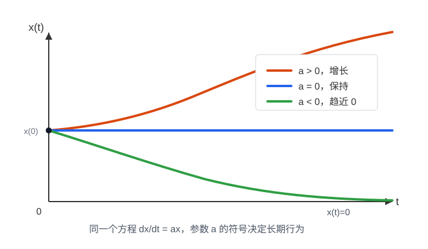

# 动力系统与自动控制原理：从演化到反馈

## 一、前言

本章讨论系统的长期行为，以及怎样通过输入和反馈影响这些行为。常微分方程的基础解法和场方程的背景，可先阅读[微分方程](../04-differential-equations/)。

阅读顺序是：先建立动力系统、稳定性和梯度流的直觉，再学习信号与系统中的输入输出、冲激响应和卷积，然后用傅里叶变换理解频率、用拉普拉斯变换理解暂态与传递函数，最后进入经典控制、非线性控制和最优控制。

不过，只会写出微分方程还不够。很多微分方程并不能轻易解出显式公式。更重要的是，即使我们得到了一个公式，也未必真正理解了系统。一个系统从不同初值出发会不会走向同一个地方？某个平衡点附近的轨迹会靠近它，还是远离它？系统会不会振荡？会不会爆炸？有没有某种能量一直下降？这些问题不再只是“求解微分方程”，而是进入了动力系统的视角。

动力系统关心的是演化的结构。它把微分方程看成一个产生轨迹的规则，然后研究这些轨迹在状态空间里的整体行为。平衡点、稳定性、相图、吸引子、周期轨道、Lyapunov 函数，都是为了回答同一个问题：给定变化规律以后，系统长期会怎样？

控制理论则更进一步。它不只观察系统怎样演化，也不只分析系统是否稳定，而是关心怎样影响这个系统。给系统加一个输入，系统会怎样响应？能不能把状态从一个地方带到另一个地方？能不能只通过有限的观测推断内部状态？反馈能不能让不稳定的系统稳定下来？外界扰动和建模误差会不会破坏系统行为？这些问题都属于控制理论。

所以，微分方程、动力系统和控制理论不是三块互不相干的知识。它们之间有一条很自然的内在关系：

$$
\text{微分方程描述演化规律}
\longrightarrow
\text{动力系统研究演化结构}
\longrightarrow
\text{控制理论设计干预方式}.
$$

换句话说，微分方程回答“系统怎么动”，动力系统回答“这样动会发生什么”，控制理论回答“怎样让系统按我们希望的方式动”。如果再接上优化理论，就会得到最优控制：不只是让系统可控、稳定或可调节，还要在代价、能量、时间、风险等指标下选出最好的控制过程。

这个视角比单独谈最优控制更宽。经典控制会讨论开环控制、闭环控制、反馈、可控性、可观测性、稳定化和鲁棒性；现代控制还会连接最优控制、动态规划、Hamilton-Jacobi-Bellman 方程、Pontryagin 最大值原理、模型预测控制和强化学习。最优控制很重要，但它更适合看成控制理论中的一条主线，而不是这部分内容的全部。

这条线索和机器学习的关系，其实也可以用很朴素的话说清楚。训练模型不是一次完成的，参数会一步一步改变；生成样本也不是凭空变出来的，很多方法会把噪声一步步变成有结构的数据；如果模型要预测天气、流体、材料、电磁场或者概率分布，它面对的输出本身就可能是一整个随时间和空间变化的函数。只要问题里出现了“不断更新”“连续演化”“长期是否稳定”“怎样施加干预让结果更好”，微分方程、动力系统和控制理论的语言就会自然出现。

所以这里真正要建立的是一种连续时间的视角：怎样从变化率理解状态，怎样从方程理解轨迹和场，怎样从稳定性理解长期行为，怎样从输入、反馈和控制变量理解“在演化中干预系统”。有了这层直觉，后面再遇到连续时间模型、扩散过程、梯度流、函数空间里的学习问题和强化学习里的控制问题，就不会觉得它们是散落在不同地方的技巧，而是同一套语言在不同问题上的展开。

## 二、动力系统：状态如何随时间演化

在[偏微分方程一章](../04-differential-equations/)中，我们关心的是一个场怎样随时间和空间变化。动力系统的视角稍微换了一下：它先把系统当前的状态看成一个点，然后研究这个点在状态空间里怎样运动。

如果系统只有一个变量，比如人口数量、温度、速度，那么状态就是一个数。如果系统有很多变量，比如一个机械系统的位置和速度、一个神经网络训练时的全部参数，那么状态就是一个高维向量。动力系统关心的不是单次求一个答案，而是整个演化过程：从不同初值出发，轨迹会走向哪里，会不会稳定，会不会振荡，会不会对初始条件特别敏感。

这和微分方程的关系很直接。微分方程给出变化规律，动力系统研究这个变化规律生成的整体结构。换句话说，ODE 是写出“怎么变”的语言，动力系统是在问“这样变下去会形成什么图像”。

### 自治和非自治系统

如果方程写成：

$$
\frac{dx}{dt}=f(x),
$$

右边不显式依赖 $t$，叫自治系统；如果写成：

$$
\frac{dx}{dt}=f(x,t),
$$

右边显式依赖 $t$，叫非自治系统。自治系统的规律不随时间改变，非自治系统则允许外部环境或规则本身随时间变化。

### 即便是 ODE，也常常求不出显式解

不过要注意，高等数学里反复练习的 ODE，很多是特意挑出来能算的标准题。真正遇到一般的 ODE，尤其是非线性 ODE，经常没有漂亮的初等函数解。比如

$$
y'=y^2+x
$$

就不像变量分离方程或一阶线性方程那样可以直接套公式。更复杂的非线性振子、三体问题、混沌系统，也常常不能靠写出显式解来理解。

三体问题其实就是一个 ODE 系统。设三个质点的位置分别是 $\mathbf r_1(t),\mathbf r_2(t),\mathbf r_3(t)$，质量分别是 $m_1,m_2,m_3$。牛顿第二定律和万有引力定律给出：

$$
m_i\mathbf r_i''(t)
=
G\sum_{j\ne i}m_im_j\frac{\mathbf r_j(t)-\mathbf r_i(t)}{|\mathbf r_j(t)-\mathbf r_i(t)|^3},
\qquad i=1,2,3.
$$

两边除以 $m_i$，也可以写成

$$
\mathbf r_i''(t)
=
G\sum_{j\ne i}m_j\frac{\mathbf r_j(t)-\mathbf r_i(t)}{|\mathbf r_j(t)-\mathbf r_i(t)|^3},
\qquad i=1,2,3.
$$

这个方程的意思很直接：第 $i$ 个质点的加速度，由另外两个质点对它的引力共同决定。它仍然只是关于时间 $t$ 的常微分方程，因为未知量 $\mathbf r_i(t)$ 只依赖时间，不依赖空间变量。

难点不在于方程写不出来，而在于一般情况下解不出简单公式，而且长期运动可能非常复杂。三体问题就是一个重要例子：它说明即便规律是确定的，系统行为也可能对初始条件非常敏感。

所以即便是 ODE，也会遇到“解不出来”的情况。这时我们就会自然转向动力系统的观点：不一定非要把 $x(t)$ 写成一个闭式公式，而是研究平衡点、稳定性、周期轨道、长期行为、是否发散、是否对初值敏感。

这一章更关心的正是这一层问题：即使一个微分方程没有漂亮的显式解，我们还能不能理解它的行为？

### 从求解方程到研究系统

前面这些解法，主要是在回答“这个方程怎么算”。但很多时候，我们真正关心的不是把解写成一个漂亮公式，而是想知道系统整体会怎样。

例如指数增长方程：

$$
\frac{dx}{dt}=ax.
$$

它的解是：

$$
x(t)=x(0)e^{at}.
$$

如果 $a>0$，状态会增长；如果 $a=0$，状态保持不变；如果 $a<0$，状态会衰减。这里真正重要的不只是公式，而是参数 $a$ 决定了系统长期行为。$a$ 的符号一变，系统的命运就变了。

动力系统看 ODE，核心就是这种视角：不只是求出 $x(t)$，还要研究轨迹会往哪里走。它会关心平衡点、稳定性、振荡、发散、长期极限这些问题。后面的稳定性、平衡点和 Lyapunov 方法会进一步展开这些问题。

再看一个和机器学习更近的例子：连续时间梯度下降。

$$
\frac{dx}{dt}=-\nabla f(x).
$$

它的意思是：状态 $x(t)$ 总是沿着函数 $f$ 下降最快的方向移动。普通梯度下降是一步一步更新：

$$
x_{k+1}=x_k-\eta \nabla f(x_k),
$$

而梯度流可以看成它的连续时间版本。这里也先把它当成例子，后面再用梯度流专门连接最优化、Lyapunov 方法和机器学习训练过程。

所以，这一小节只是完成一个转向：从“求解一个微分方程”，转向“把微分方程看成一个产生轨迹的系统”。下面从连续时间和离散时间两种形式继续展开。

### 连续时间动力系统

连续时间动力系统通常写成：

$$
\frac{dx}{dt}=f(x).
$$

这里 $x(t)$ 是系统在时间 $t$ 的状态，$f(x)$ 告诉我们：当系统处在状态 $x$ 时，接下来应该往哪个方向走、走多快。

如果 $x$ 是一维变量，$f(x)$ 就是一条函数曲线；如果 $x$ 是二维变量，$f(x)$ 就是在平面上每个点放一支箭头；如果 $x$ 是高维变量，虽然画不出来，但含义仍然一样：状态空间里的每个点都有一个速度向量。

这就是动力系统里的向量场。它不是物理空间里的风速场，而是状态空间里的“运动指示图”。状态点走到哪里，就看那里对应的箭头指向哪里。

前面的指数增长与衰减展示了一维系统的轨迹。

二维系统更能体现“相图”的意义。比如：

$$
\begin{cases}
\dot x=-y,\\
\dot y=x.
\end{cases}
$$

这个系统的解会绕着原点旋转。因为

$$
\frac{d}{dt}(x^2+y^2)=2x\dot x+2y\dot y=2x(-y)+2y x=0,
$$

所以 $x^2+y^2$ 保持不变。轨迹不是走向原点，也不是逃到无穷远，而是在圆周上转。这种图像就叫相图：它不是只画一条解，而是把很多初值出发的轨迹一起画出来，看整个状态空间的结构。

动力系统里还经常说“流”。如果从初始状态 $x_0$ 出发，经过时间 $t$ 到达的位置记作

$$
\Phi_t(x_0),
$$

那么 $\Phi_t$ 就把初始点送到未来点。它像一张随时间变化的地图：每过一段时间，状态空间里的点都会被这张地图推到新位置。

### 离散时间动力系统

不是所有演化都用连续时间表示。很多过程本来就是一步一步发生的，这时可以写成离散时间动力系统：

$$
x_{k+1}=F(x_k).
$$

这里 $k$ 表示第几步，$F$ 是更新规则。给定初始状态 $x_0$，不断套用 $F$，就得到一串状态：

$$
x_0,
\quad x_1=F(x_0),
\quad x_2=F(x_1),
\quad \ldots
$$

这串点叫轨道。离散动力系统最关心的问题也很自然：它会收敛吗？会发散吗？会来回振荡吗？会进入周期循环吗？

最简单的例子是：

$$
x_{k+1}=rx_k.
$$

如果 $|r|<1$，那么 $x_k\to 0$；如果 $|r|>1$，一般会发散；如果 $r=-1$，就在 $x_0$ 和 $-x_0$ 之间来回跳。这里没有微分，只有迭代，但它仍然是在研究状态怎样随步骤演化。

机器学习里的梯度下降就是一个非常重要的离散动力系统。设损失函数是 $L(\theta)$，参数是 $\theta$，梯度下降写成：

$$
\theta_{k+1}=\theta_k-\eta\nabla L(\theta_k).
$$

这里 $\eta$ 是学习率。每一步都根据当前位置的梯度更新参数，所以训练过程就是参数空间里的一条离散轨道。

如果学习率合适，参数可能逐渐靠近一个局部极小值；如果学习率太大，参数可能在谷底附近来回震荡，甚至直接发散。这个现象用动力系统语言看非常自然：学习率改变了更新映射 $F$，也就改变了轨道的稳定性。

ResNet 也可以从离散动力系统的角度理解。一个残差块可以写成类似

$$
h_{k+1}=h_k+F_k(h_k).
$$

这很像一步一步更新隐藏状态。普通神经网络是一层接一层地变换表示；从动力系统角度看，它就是让隐藏状态沿着层数这个“离散时间”演化。后面讲 Neural ODE 时，我们会看到：如果把层数推向连续时间，就会得到

$$
\frac{dh}{dt}=f(h,t).
$$

这就是神经网络、ODE 和动力系统之间很自然的一条桥。

### 从轨迹到结构

动力系统的重点不只是解出某一条轨迹。很多时候，单条轨迹反而不是最重要的，真正重要的是整体结构。

比如我们会问：

- 哪些点是平衡点？
- 平衡点附近的轨迹会靠近它，还是离开它？
- 有没有周期轨道？
- 不同初值会不会走向同一个吸引子？
- 参数变化时，系统行为会不会突然改变？

这些问题把微分方程从“求解技巧”变成了“几何图像”。ODE 给出局部速度，动力系统研究全局命运。一个点当下往哪里走由方程决定；所有点一起怎样组织成相图，则是动力系统真正关心的东西。

这个观点对机器学习也很重要。训练不是只看某一步梯度怎么算，而是看整个优化轨道怎样穿过参数空间；模型部署后的控制系统不是只看某一时刻输入输出，而是看长期是否稳定；生成模型里的连续变换也不是只看一个样本，而是看一整个分布怎样演化。动力系统提供的，就是这种“从一步变化看到整体结构”的语言。
## 三、稳定性、平衡点和 Lyapunov 方法

动力系统最关心的问题之一是：系统长期会变成什么样？小扰动会不会被放大？

### 平衡点和线性化

平衡点满足：

$$
f(x^\ast)=0.
$$

如果系统已经到达 $x^\ast$，它就不会继续移动。

这一节需要讲清楚：

- 平衡点；
- 稳定、不稳定和鞍点；
- 在平衡点附近做线性近似；
- Jacobian 矩阵；
- 特征值如何决定局部行为；
- 为什么线性化是理解非线性系统的第一步。

### Lyapunov 方法

Lyapunov 方法的核心思想是：不一定要显式解出轨迹，也可以通过一个能量函数判断系统是否稳定。

如果 $V(x)$ 像系统能量一样，并且沿着轨迹不增加：

$$
\frac{d}{dt}V(x(t))
=\nabla V(x)\cdot f(x)\le 0,
$$

那么系统就有可能是稳定的。

这一节需要讲清楚：

- Lyapunov 函数的直觉；
- 正定性；
- 沿轨迹导数非正；
- Lyapunov 稳定和渐近稳定；
- 为什么不用解出轨迹也能判断稳定；
- 梯度流中损失函数为什么会下降；
- 损失函数、能量函数和 Lyapunov 函数之间的联系；
- Lyapunov 思想在优化收敛分析中的作用。

### 长期行为

系统不一定只会收敛到一个点，也可能出现更复杂的长期结构。

这一节需要讲清楚：

- 收敛到平衡点；
- 周期轨道；
- 吸引子；
- 吸引域；
- 分岔的直觉；
- 混沌只做概念性介绍，不深入展开。

### 场的动力系统：守恒、耗散和平衡

把一个场在每个时刻的整体形状看作状态，就得到函数空间中的动力系统。守恒、耗散和平衡可以帮助我们研究它的长期行为。

守恒说的是某个总量不会凭空产生，也不会凭空消失。最典型的是质量守恒。如果 $\rho(x,t)$ 是密度，$\rho\mathbf{v}$ 是通量，那么连续性方程

$$
\frac{\partial \rho}{\partial t}+\nabla\cdot(\rho\mathbf{v})=0
$$

表达的就是局部守恒。某个小区域里的质量变少，不是凭空没了，而是从边界流出去了；质量变多，也不是凭空产生，而是从边界流进来了。

波动方程里常见的是能量守恒。以两端固定、没有外力的一维弦为例，取单位化后的能量；两项分别来自速度和空间斜率：

$$
E(t)=\frac12\int \left(u_t^2+c^2u_x^2\right)dx.
$$

在上述边界条件下，没有能量从边界流出，这个总能量不随时间变化，只是在动能和势能之间来回转换。弦某一刻可能形状弯得厉害，另一刻可能速度很大，但总量保持住。

耗散说的是某种量会随着时间减少。热方程就是最典型的例子。温度差异会被扩散抹平，尖锐结构会变钝，高频振荡会更快衰减。以长度为 $L$、两端温度固定为零的细杆为例，$\kappa>0$ 是热扩散系数。从 Fourier 模式看，

$$
\sin\frac{n\pi x}{L}
$$

会带着因子

$$
e^{-\kappa n^2\pi^2t/L^2}
$$

衰减。$n$ 越大，衰减越快。这就是“高频细节先消失”的数学表达。

平衡说的是系统不再随时间变化。求出平衡态以后，还需要另行判断轨迹是否趋向它。比如热方程

$$
\frac{\partial u}{\partial t}=\kappa\Delta u
$$

如果最后不再变化，就有

$$
\frac{\partial u}{\partial t}=0,
$$

于是平衡态满足

$$
\Delta u=0.
$$

所以，守恒、耗散和平衡不是三个孤立概念。它们经常在同一个问题里一起出现：守恒告诉你什么不能凭空改变，耗散告诉你什么会逐渐减少，平衡告诉你长期以后可能停在哪里。

#### 热与波的长期行为

抛物型方程和双曲型方程的长期行为也很不一样。热方程倾向于越来越平，局部细节会被扩散和耗散逐渐抹掉；波方程则可能持续振荡、反射、叠加。边界如果固定，波会来回反射；不同模式叠加在一起，会形成复杂振动。

#### 阻尼怎样影响长期行为

考虑波方程及其阻尼版本。如果系统没有阻尼，波动方程描述的是能量在场里传播和交换，通常会一直振荡下去，不一定收敛到静态解。如果系统有阻尼、摩擦、辐射损失，或者边界不断吸收能量，那么暂态波动会慢慢衰减。这个过程中，双曲型方程负责描述扰动怎样以有限速度传出去；阻尼项负责让振荡能量逐渐消失；等到时间变化项和速度项都可以忽略时，剩下的才是静态的空间方程。

比如带阻尼的波动可以粗略写成

$$
\frac{\partial^2 u}{\partial t^2}
+\gamma\frac{\partial u}{\partial t}
=c^2\Delta u.
$$

这里 $\gamma>0$ 是阻尼系数，$c>0$ 是波速，$\partial^2u/\partial t^2$ 表示惯性带来的振荡，$\gamma\partial u/\partial t$ 表示阻尼，$c^2\Delta u$ 表示空间相互作用。演化初期像波，会传播、反射、振荡；阻尼不断消耗运动，长时间以后如果真的达到静止，就有

$$
\frac{\partial u}{\partial t}=0,
\qquad
\frac{\partial^2u}{\partial t^2}=0,
$$

于是只剩下

$$
\Delta u=0.
$$

所以更准确的说法是：双曲型方程描述从一个状态到另一个状态的传播过程；椭圆型方程描述时间变化结束以后必须满足的静态约束。二者可以出现在同一个物理问题的不同阶段，但不能简单说“双曲型方程最后一定变成椭圆型方程”。

#### 持续输入怎样改变平衡值

对长度为 $L$、两端温度固定为零的细杆，如果热源为 $q_0\sin(\pi x/L)$，热方程第一模式的系数满足

$$
c_1'(t)+\alpha c_1(t)=q_0,\qquad \alpha=a^2(\pi/L)^2>0,
$$

其中 $a^2$ 是热扩散系数。它的平衡值是 $c_1^*=q_0/\alpha$。令 $z=c_1-c_1^*$，得到 $z'=-\alpha z$，所以任意初始误差都指数衰减。这个例子说明，持续输入会改变最终平衡值；若把输入作为可以选择的量，就进一步进入控制设计。

## 四、梯度流：优化和动力系统的桥

梯度流把最优化和动力系统直接连在一起。

### 梯度下降的连续时间版本

离散梯度下降写成：

$$
x_{k+1}=x_k-\eta\nabla f(x_k).
$$

当步长变得很小，可以得到连续时间梯度流：

$$
\frac{dx}{dt}=-\nabla f(x).
$$

这一节需要讲清楚：

- 梯度下降和梯度流的关系；
- 损失函数沿轨迹下降；
- 最优点对应平衡点；
- 鞍点和局部极小值；
- 连续时间分析为什么能帮助理解离散优化算法。

### 离散化怎样影响稳定性

将连续方程离散化后，步长会影响迭代的稳定性。设步长为 $h>0$，对测试方程 $x'=-\lambda x$（$\lambda>0$），真实解不断衰减，而显式 Euler 给出

$$
x_{n+1}=(1-h\lambda)x_n.
$$

只有 $0<h\lambda<2$ 时，这个离散近似才会衰减。隐式 Euler 则满足

$$
x_{n+1}=x_n-h\lambda x_{n+1}
\quad\Longrightarrow\quad
x_{n+1}=\frac{x_n}{1+h\lambda},
$$

对任意 $h>0$ 都衰减，但步长过大仍会损失精度。对于含有相差很大时间尺度的刚性问题，显式方法可能被迫取很小的步长，隐式方法因此很有价值。

这说明，连续系统的稳定性并不自动保证离散迭代稳定。学习率和积分步长都需要结合离散后的更新规律分析。

### 梯度流附近的局部形状

在欧氏空间的最优化问题中，负梯度给出最速下降方向，Hessian 矩阵给出目标函数在各个方向上的弯曲程度。一个点是不是局部极小、某个方向是不是很陡、某些方向是不是几乎平坦，都要靠二阶信息来判断。几何优化、自然梯度、Newton 方法这些思想，也都离不开“局部形状”这个层面的信息。

在梯度流 $x'=-\nabla f(x)$ 中，临界点附近的线性化矩阵是 $-\nabla^2 f$。因此，目标函数的二阶形状会直接影响该点附近轨迹的行为。

### 梯度下降与特征线更新的区别

[微分方程](../04-differential-equations/)中的特征线法把 PDE 化成关于参数 $s$ 的 ODE，再用 Euler 法等方法推进位置和函数值。它与梯度下降可以有相似的更新形式，但后者沿目标函数的负梯度更新，前者沿 PDE 给定的方向更新；特征线携带的函数值可以增大、减小或保持不变。

### 从有限维到函数空间

很多演化问题不是在移动一个有限维向量，而是在移动一个函数、一个密度或者一个分布。

这一节需要讲清楚：

- 变分法和梯度流的关系；
- 能量泛函；
- 函数的演化；
- 概率分布的演化；
- Wasserstein gradient flow 只做直觉介绍；
- mean-field limit 只做入口介绍。

### 和机器学习训练过程的关系

模型参数 $\theta(t)$ 在训练中不断变化。连续时间梯度流用负梯度规定参数变化率；离散梯度下降则用步长把这个方向变成一次更新。

这条线索也连接到优化和机器学习。损失函数下降可以看成一种耗散；约束优化里会有守恒或不变量；训练过程的稳定性和平衡点又会进入动力系统语言。这些概念把训练过程与前面的稳定性、Lyapunov 方法联系起来。

这一节需要讲清楚：

- 训练过程作为动力系统；
- 学习率和离散化；
- 梯度爆炸、梯度消失和稳定性；
- 非凸优化中的鞍点；
- 连续时间视角如何帮助理解深度学习训练。

## 五、信号与系统：从状态轨迹到输入输出

前面主要研究状态怎样运动。进入控制原理以前，还需要换一个观察角度：外界给系统什么信号，系统返回什么信号？比如给电路一个电压，测量流过它的电流；给电机一个驱动输入，测量转速；给温度系统一个加热功率，测量温度。

信号是随时间变化的量，系统是把输入信号变成输出信号的规则。本节用 $u(t)$ 表示输入、$y(t)$ 表示输出，用 $\mathbf{x}(t)$ 表示内部状态；单位阶跃另记为 $H(t)$，避免和控制输入混淆。

### 状态空间和输入输出是同一个系统的两种描述

线性连续时间系统常写成

$$
\dot{\mathbf{x}}=A\mathbf{x}+Bu,
\qquad y=C\mathbf{x}+Du.
$$

状态方程解释内部怎样演化，输出方程解释我们能测到什么。信号与系统则进一步问：给定整条输入 $u(t)$，能不能直接描述整条输出 $y(t)$？这并没有丢掉动力系统，而是在内部状态之外建立输入输出的语言。

需要区分两种响应：**零输入响应**来自非零初始状态，即使之后不再输入，系统仍可能运动；**零状态响应**来自外部输入，假定初始状态为零。对线性系统，总响应是二者之和。后面用卷积和传递函数描述输入输出时，默认讨论零状态响应。

### 线性、时不变、因果和稳定分别在说什么

设系统算子为 $T$，即 $y=T[u]$。线性要求满足叠加原理：

$$
T[\alpha u_1+\beta u_2]
=\alpha T[u_1]+\beta T[u_2].
$$

时不变要求：输入整体延迟，输出也只发生相同延迟。如果 $T[u(t)]=y(t)$，那么 $T[u(t-t_0)]=y(t-t_0)$。这里比较的是相同的零状态输入输出规则。线性且时不变的系统简称 LTI 系统。

因果性表示当前输出不依赖未来输入。BIBO 稳定性则表示“有界输入产生有界输出”。它和前面讨论的内部状态稳定性有关，但关注对象不同；某些内部模态如果无法被输入激发或无法从输出观察到，就可能不体现在输入输出关系里。

### 冲激响应：用一次瞬时激励认识系统

单位冲激 $\delta(t)$ 可以直观理解为越来越窄、越来越高、面积始终为一的脉冲极限。它严格来说是分布，不是某个点上取无穷大的普通函数。最关键的性质是筛选：

$$
\int_{-\infty}^{\infty}f(\tau)\delta(t-\tau)\,d\tau=f(t).
$$

这个式子也可以看成把信号分解成一串加权、平移的冲激。若零状态 LTI 系统对 $\delta(t)$ 的输出是 $h(t)$，那么它对 $\delta(t-\tau)$ 的输出就是 $h(t-\tau)$；再利用线性叠加，就得到

$$
y(t)=(h*u)(t)
=\int_{-\infty}^{\infty}h(t-\tau)u(\tau)\,d\tau.
$$

这就是卷积。$u(\tau)$ 表示过去某一刻施加了多少输入，$h(t-\tau)$ 表示这次输入经过一段时间以后还留下多少影响，积分把这些影响加起来。对因果系统、从零时刻开始的输入，在 $t\geq0$ 时可写成 $\int_0^t h(t-\tau)u(\tau)\,d\tau$。

对于具有普通函数冲激响应的连续时间 LTI 系统，BIBO 稳定的充要条件是

$$
\int_{-\infty}^{\infty}|h(t)|\,dt<\infty.
$$

因为此时 $|y(t)|\leq\|u\|_\infty\int|h(\tau)|\,d\tau$。这说明系统对过去输入的影响必须在绝对值意义下可积。含直接馈通的系统还可能有 $D\delta(t)$ 项，它单独产生 $Du(t)$，应与普通函数部分分别处理。

### 一个贯穿后面的例子：一阶惯性系统

考虑

$$
\dot y+ay=bu(t),\qquad a>0,\quad b>0.
$$

由积分因子法，在 $t\geq0$ 时有

$$
y(t)=e^{-at}y(0^-)
+b\int_0^t e^{-a(t-\tau)}u(\tau)\,d\tau.
$$

这里假定原点处没有冲激输入，因此 $y(0^-)=y(0^+)$。第一项是初始状态留下的自由响应，第二项是输入经过系统后的响应。与卷积公式比较，可以读出冲激响应

$$
h(t)=be^{-at}H(t).
$$

其中 $H(t)$ 在 $t<0$ 时为零、$t>0$ 时为一。若初始状态为零、输入为单位阶跃，便得到

$$
y(t)=\frac{b}{a}(1-e^{-at}),\qquad t\geq0.
$$

输出逐渐靠近 $b/a$，时间尺度由 $1/a$ 决定。接下来会看到，同一个系统在时域表现为指数衰减，在频域表现为低通滤波，在复频域表现为一个位于 $s=-a$ 的极点。

## 六、积分变换：傅里叶变换与拉普拉斯变换

积分变换的做法，是用一族已知函数作为“探针”，对原函数做加权积分，得到另一种表示。一般形式为 $F(\lambda)=\int f(t)K(\lambda,t)\,dt$，其中 $K$ 叫变换核。选择合适的核，可以让原本复杂的微分或卷积运算变成乘法。

傅里叶变换用纯振荡的复指数分析频率，拉普拉斯变换则同时引入指数加权和振荡。它们的价值不只是换一个记号，而是让系统的某些结构直接显现出来。

### 傅里叶变换：信号由哪些频率组成

由 Euler 公式，$e^{i\omega t}=\cos\omega t+i\sin\omega t$。复指数同时容纳正弦和余弦，因而可以同时记录振幅和相位。这里 $i^2=-1$，控制教材也常用 $j$；$\omega$ 是角频率，单位为弧度每秒，与普通频率的关系是 $\omega=2\pi f$。

本章采用如下连续时间傅里叶变换约定：

$$
\widehat f(\omega)
=\int_{-\infty}^{\infty}f(t)e^{-i\omega t}\,dt,
\qquad
f(t)=\frac{1}{2\pi}\int_{-\infty}^{\infty}
\widehat f(\omega)e^{i\omega t}\,d\omega.
$$

后一式是逆变换，在相应的可积性与反演条件下成立。直觉上，正变换测量信号与各个频率的匹配程度，逆变换把所有频率重新叠加成原信号。$|\widehat f(\omega)|$ 给出幅度谱，$\arg\widehat f(\omega)$ 给出相位谱；仅保留幅度通常不足以重建原信号。

频谱一般是复数，也不一定非负，因此不能把它直接当作概率分布。相位记录各频率分量怎样对齐：即使幅度相同，对齐方式不同，时域形状也可以完全不同。

### 从傅里叶级数到傅里叶变换

周期为 $T$ 的信号可以用离散的谐波展开：

$$
f(t)=\sum_{k\in\mathbb Z}c_k e^{ik\omega_0t},
\qquad \omega_0=\frac{2\pi}{T},
\qquad
c_k=\frac1T\int_0^T f(t)e^{-ik\omega_0t}\,dt.
$$

这就是傅里叶级数：允许的频率是基频的整数倍。对于非周期信号，傅里叶变换改用连续频率积分。可以把这个联系直观理解为观察周期变得越来越长，频率间隔越来越小；严格的极限需要额外条件。

此前 PDE 分离变量法中的正弦级数也属于这种模式分解，但那里常常分解的是空间变量，频率表示空间上振荡得有多快。本节主要对时间做变换，频率表示每秒振荡得有多快。

普通积分并不适用于所有信号。$f\in L^1(\mathbb R)$ 保证正变换积分绝对收敛；平方可积信号可以在 $L^2$ 意义下处理；无限持续的正弦和常数则通常需要分布意义的傅里叶变换。例如

$$
\mathcal F[\cos(\omega_0t)]
=\pi\bigl[\delta(\omega-\omega_0)+\delta(\omega+\omega_0)\bigr],
\qquad \omega_0>0.
$$

两条谱线表示这个实信号只有一对正负频率。负频率来自复指数表示，并不表示时间倒流。

### 算一个频谱：衰减指数为什么含有许多频率

令 $f(t)=e^{-at}H(t)$，其中 $a>0$，则

$$
\widehat f(\omega)
=\int_0^\infty e^{-(a+i\omega)t}\,dt
=\frac1{a+i\omega}.
$$

它的幅度和相位分别为

$$
|\widehat f(\omega)|=\frac1{\sqrt{a^2+\omega^2}},
\qquad
\arg\widehat f(\omega)=-\arctan\frac\omega a.
$$

这个信号不是单一正弦，所以频谱不是一条谱线。相对于零频幅度，它在 $|\omega|=a$ 处降到 $1/\sqrt2$；$a$ 越大，信号在时间上衰减越快，相对频谱越宽。这是时间尺度与频率尺度相互对应的一个具体例子。

### 为什么傅里叶变换适合研究系统

在交换积分、分部积分等操作成立的条件下，有

$$
\mathcal F[f'](\omega)=i\omega\widehat f(\omega),
\qquad
\mathcal F[h*u](\omega)=\widehat h(\omega)\widehat u(\omega).
$$

第一式在经典推导中要求边界项消失，第二式就是卷积定理。微分变成乘以 $i\omega$，卷积变成逐频率相乘，因此 LTI 系统满足

$$
\widehat y(\omega)=\widehat h(\omega)\widehat u(\omega).
$$

为什么能够逐频率处理？把 $u(t)=e^{i\omega t}$ 代入卷积，在 $h$ 绝对可积时得到

$$
y(t)=\int_{-\infty}^{\infty}h(\tau)e^{i\omega(t-\tau)}\,d\tau
=\widehat h(\omega)e^{i\omega t}.
$$

复指数经过 LTI 系统以后，频率保持不变，只乘上一个复数。这说明复指数是卷积算子的特征函数，$\widehat h(\omega)$ 就是对应的特征值，也叫频率响应。对实系统和正弦输入，它的模决定幅度变化，辐角决定相位变化。

对前面的一阶系统，

$$
\widehat h(\omega)=\frac{b}{a+i\omega}.
$$

若从零时刻施加 $\cos\omega t$，初始阶段还包含衰减暂态；暂态消失后，输出趋向

$$
y_{\mathrm{ss}}(t)=\frac{b}{\sqrt{a^2+\omega^2}}
\cos\left(\omega t-\arctan\frac\omega a\right).
$$

慢变化输入比较容易通过，快变化输入受到更强衰减，因此它是低通系统。后面的 Bode 图，就是把这种幅度与相位随频率变化的关系画出来。

### 拉普拉斯变换：给傅里叶积分加上指数权重

控制系统不仅有稳定振荡，还可能有增长、衰减和非零初始状态。此时引入复变量

$$
s=\sigma+i\omega,
\qquad e^{-st}=e^{-\sigma t}e^{-i\omega t}.
$$

双边拉普拉斯变换定义为

$$
F_{\mathrm b}(s)=\int_{-\infty}^{\infty}f(t)e^{-st}\,dt.
$$

固定 $\sigma$ 后，它就是加权信号 $e^{-\sigma t}f(t)$ 的傅里叶变换。$\omega$ 分析振荡，$\sigma$ 调整不同时间位置的权重，让某些原本不收敛的积分变得收敛。这个权重是分析工具，并没有把真实系统的增长变成衰减。

对于因果初值问题，控制教材常用单边拉普拉斯变换。本章采用从 $0^-$ 开始的约定，将原点冲激也计入：

$$
F(s)=\mathcal L_+[f](s)=\int_{0^-}^{\infty}f(t)e^{-st}\,dt.
$$

对于原点没有冲激的普通函数，下限可按零处理。单边变换只记录零时刻及以后的信号，初始状态通过导数公式进入方程；对因果信号，它与双边变换一致。

### 收敛域：为什么只有一个分式还不够

仍取 $f(t)=e^{-at}H(t)$，则

$$
F(s)=\int_0^\infty e^{-(s+a)t}\,dt
=\frac1{s+a},\qquad \operatorname{Re}s>-a.
$$

这里 $\operatorname{Re}s>-a$ 叫收敛域，不能省略为无关细节。例如 $e^{ct}H(t)$ 在 $c>0$ 时增长，却仍有拉普拉斯变换 $1/(s-c)$，收敛域为 $\operatorname{Re}s>c$。所以“有拉普拉斯变换”并不表示系统稳定。

对双边变换，$-e^{-at}H(-t)$ 也产生分式 $1/(s+a)$，但其收敛域为 $\operatorname{Re}s<-a$。相同的代数表达式，配上不同收敛域，可以对应不同信号。控制中给定因果性，就选择右边信号对应的收敛域。

当双边拉普拉斯变换的收敛域包含虚轴时，可以直接取

$$
\widehat f(\omega)=F_{\mathrm b}(i\omega).
$$

这才是“傅里叶变换是拉普拉斯变换在虚轴上的取值”的适用条件。对增长信号直接把分式中的 $s$ 换成 $i\omega$，虽然能算出一个数，却不代表原信号的傅里叶积分存在。某些边界情形可以用极限或分布处理，需要另行说明。

### 导数变成代数：初始条件去了哪里

单边拉普拉斯变换的关键公式是

$$
\mathcal L_+[f'](s)=sF(s)-f(0^-),
$$

$$
\mathcal L_+[f''](s)=s^2F(s)-sf(0^-)-f'(0^-).
$$

在所需正则性和增长条件下，第一式可以由分部积分得到：无穷远的边界项因指数权重消失，零时刻的边界项留下初值。如果原点存在跳跃，导数中的冲激也按上述 $0^-$ 约定处理。对没有跳跃的普通初值问题，$f(0^-)$ 就是熟悉的 $f(0)$。

因此“把导数换成 $s$”只适用于零初始条件，不能在一般初值问题里直接丢掉初值项。对因果信号，卷积定理也成立：$\mathcal L_+[h*u]=H_L(s)U(s)$，这里用 $H_L$ 表示冲激响应的拉普拉斯变换，以区别单位阶跃 $H(t)$。

常用的几个变换对是：

| 因果信号 | 单边拉普拉斯变换 | 收敛域 |
| --- | --- | --- |
| $\delta(t)$ | $1$ | 整个复平面 |
| $H(t)$ | $1/s$ | $\operatorname{Re}s>0$ |
| $e^{-at}H(t)$，$a>0$ | $1/(s+a)$ | $\operatorname{Re}s>-a$ |
| $\sin(\omega_0t)H(t)$，$\omega_0>0$ | $\omega_0/(s^2+\omega_0^2)$ | $\operatorname{Re}s>0$ |

### 完整解一次初值问题，再读出传递函数

对 $\dot y+ay=bu$，设初始值为 $y_0=y(0^-)$。做单边拉普拉斯变换：

$$
sY(s)-y_0+aY(s)=bU(s),
$$

于是

$$
Y(s)=\underbrace{\frac{y_0}{s+a}}_{\text{零输入响应}}
+\underbrace{\frac{b}{s+a}U(s)}_{\text{零状态响应}}.
$$

取单位阶跃输入，$U(s)=1/s$。将第二项做部分分式分解：

$$
\frac{b}{s(s+a)}=\frac{b}{a}\left(\frac1s-\frac1{s+a}\right).
$$

再按变换对逐项反演，就得到

$$
y(t)=y_0e^{-at}+\frac{b}{a}(1-e^{-at}),\qquad t\geq0.
$$

这与时域解一致，但微分方程的求解被整理成了代数运算。更一般的逆变换可以用复积分表示；对于入门控制问题，查变换对和部分分式分解往往已经够用。

在零初始条件下，输入到输出的乘法因子

$$
G(s)=\frac{b}{s+a}=\mathcal L[h](s)
$$

就是传递函数。它由系统决定，不依赖某次具体输入；$Y(s)=G(s)U(s)$ 是更基本的关系，$G=Y/U$ 是在可作此比值时的写法。由于 $a>0$，冲激响应的收敛域包含虚轴，故

$$
G(i\omega)=\frac{b}{a+i\omega}=\widehat h(\omega).
$$

现在三种描述接起来了：$h(t)$ 描述一次冲激怎样随时间消退，$G(i\omega)$ 描述各频率怎样被放大或延迟，$G(s)$ 的极点 $-a$ 描述指数模态的衰减率。

### 两种变换怎样分工，怎样进入控制原理

| 比较维度 | 傅里叶变换 | 拉普拉斯变换 |
| --- | --- | --- |
| 变换核 | $e^{-i\omega t}$，纯振荡 | $e^{-st}$，指数加权与振荡 |
| 主要变量 | 实频率 $\omega$ | 复频率 $s=\sigma+i\omega$ |
| 典型问题 | 频谱、滤波、稳态频率响应 | 初值问题、暂态、传递函数与极点 |
| 初始条件 | 全时间信号描述中没有单边初值项 | 单边导数公式显式保留初值 |
| 收敛问题 | 普通积分、$L^2$ 或分布需区分 | 需注明收敛域及单边、双边约定 |

两种方法有重叠，也能相互连接。傅里叶变换同样可以研究暂态信号，拉普拉斯变换也可以给出频率响应；表格强调的是各自最方便的入口。

进入控制原理以后，传递函数用于组织输入输出关系，极点位置用于分析自然模态，根轨迹研究反馈增益怎样移动闭环极点，Bode 图和 Nyquist 方法则沿频率轴研究幅度、相位与闭环稳定性。它们建立在本节的时域、频域和复频域联系之上。

数字信号还会用到离散时间傅里叶变换、DFT 和 Z 变换。FFT 是快速计算 DFT 的算法；它与连续时间傅里叶变换之间还隔着采样和有限观测窗口，不能直接把有限数组的 FFT 当成连续信号的精确频谱。这些内容可以在后续数字控制与信号处理里展开。

## 七、经典控制理论：传递函数、根轨迹和频率响应

控制理论可以看成动力系统的主动版本。动力系统问：给定变化规律以后，系统会怎样走？控制理论问：如果我们可以给系统加入输入，怎样让它按希望的方式走？

经典控制理论最常见的对象是单输入单输出系统。它不一开始就画高维状态空间，而是先问一个更工程的问题：给系统一个输入信号，输出信号会怎样响应？这种思路特别适合电路、机械振动、伺服系统、飞行控制、温度调节等问题。

### 从微分方程到传递函数

一个简单的质量-弹簧-阻尼系统可以写成：

$$
m\ddot y+b\dot y+ky=u(t).
$$

这里 $y(t)$ 是位移，$u(t)$ 是外力输入。这个方程本来就是一个 ODE：左边描述系统自身的惯性、阻尼和弹性，右边是外界施加的控制输入。

沿用前面的单边 Laplace 变换，对这个方程逐项变换。在初始位移和初始速度都为零时，有：

$$
(ms^2+bs+k)Y(s)=U(s).
$$

于是输出和输入的比值是：

$$
G(s)=\frac{Y(s)}{U(s)}=\frac{1}{ms^2+bs+k}.
$$

这个 $G(s)$ 就叫传递函数。它把“微分方程”变成了“复变量 $s$ 上的代数函数”。这一步非常关键：系统的动态性质被压缩进分母多项式里，分母的根决定系统的自然模态，也就是没有外力时系统自己会怎样运动。

所以传递函数背后的动力系统含义很清楚：它不是抛开微分方程，而是把线性微分方程换一种语言来研究。ODE 里的解是时间轨迹；传递函数看的是输入输出之间的整体关系。

### 极点、零点和稳定性

传递函数通常写成

$$
G(s)=\frac{N(s)}{D(s)}.
$$

使 $D(s)=0$ 的点叫极点，使 $N(s)=0$ 的点叫零点。极点最重要，因为它们决定系统的自然响应。

比如一阶系统

$$
G(s)=\frac{1}{s+a}
$$

对应的自然响应含有

$$
e^{-at}.
$$

如果 $a>0$，极点在 $s=-a$，响应会衰减；如果极点跑到右半平面，响应会增长，系统就不稳定。

这和动力系统里的特征值是同一件事。线性系统

$$
\dot x=Ax
$$

的稳定性由矩阵 $A$ 的特征值决定；传递函数里的极点，本质上也是这些模态在输入输出语言里的表现。

### 根轨迹法：看反馈增益怎样移动极点

控制系统最核心的动作是反馈。比如把输出 $y$ 测出来，再根据误差调节输入：

$$
u=K(r-y).
$$

这里 $r$ 是目标，$K$ 是反馈增益。增益变大，系统可能反应更快，也可能振荡更强，甚至变得不稳定。根轨迹法研究的就是：当 $K$ 从小到大变化时，闭环极点在复平面里怎样移动。

典型闭环传递函数可以写成：

$$
\frac{KG(s)}{1+KG(s)}.
$$

闭环极点由

$$
1+KG(s)=0
$$

决定。根轨迹就是把这些极点随着 $K$ 变化的路径画出来。

从动力系统角度看，根轨迹法是在研究反馈如何改变系统的特征值。原来的系统可能慢、可能振荡、可能不稳定；加入反馈以后，等于修改了系统的闭环动力学。极点的位置变了，轨迹的长期行为也变了。

### Nyquist 方法：从频率响应判断稳定性

Nyquist 方法属于频率响应法。它不直接追踪时间域轨迹，而是问：如果输入一个正弦信号，系统输出的幅值和相位会怎样变化？

把传递函数放到虚轴上：

$$
G(i\omega),
$$

就得到系统对频率 $\omega$ 的响应。低频输入、高频输入，系统可能放大程度不同，相位滞后也不同。Bode 图和 Nyquist 图都是在看这个频率响应。

Nyquist 判据的核心，是用开环频率响应判断闭环系统是否稳定。它背后用到复分析里的绕数思想：曲线怎样绕过某个关键点，会告诉我们闭环极点有没有跑到不稳定区域。

这和动力系统的关系仍然是极点和稳定性。只不过根轨迹是看增益改变时极点怎样动，Nyquist 是通过频率响应间接判断闭环极点在哪里。两者都是在回答同一个控制问题：反馈之后，系统会不会稳定？稳定得够不够好？

### 背后的 PDE 和动力系统

经典控制最常写的是 ODE，因为很多工程系统先被简化成有限维模型。但真实对象常常来自 PDE。比如柔性梁的振动是位移场的波动，热控制是温度场的演化，流体控制是速度场和压强场的演化。

工程上常做的一件事，是把 PDE 模型降维成有限维 ODE 模型。比如把一个连续振动结构分解成若干个模态，只保留前几个主要模态；或者把温度场离散成若干个网格点。这样一来，原来的场方程就变成了有限维动力系统，经典控制工具才可以直接使用。

所以，经典控制和[偏微分方程](../04-differential-equations/)的关系可以这样理解：PDE 描述连续介质，降维或离散化后得到 ODE 动力系统，传递函数、根轨迹、Nyquist 方法则在输入输出层面分析和设计反馈。

## 八、非线性控制：Lyapunov 函数和反馈稳定化

经典控制理论大量依赖线性系统。但真实系统经常是非线性的：机器人关节有三角函数，飞行器姿态有非线性耦合，流体和化学反应也常常非线性。非线性控制的第一件事，不是立刻寻找传递函数，而是先回到状态方程：

$$
\dot x=f(x,u).
$$

这里 $x$ 是状态，$u$ 是控制输入。没有输入时，系统是一个动力系统；加入输入以后，它就变成一个可以被干预的动力系统。

### 平衡点、线性化和局部控制

如果希望系统停在某个目标状态 $x^*$，通常要先找到一个输入 $u^*$，使得

$$
f(x^*,u^*)=0.
$$

这表示在这个状态和输入下，系统不再运动。然后可以在平衡点附近做线性化：

$$
\dot z=Az+Bv.
$$

这里 $z=x-x^*$，$v=u-u^*$。线性化之后，就可以用线性控制里的极点配置、LQR、观测器等方法做局部设计。

但线性化只能说明平衡点附近发生什么。离平衡点远一点，非线性项可能主导行为，系统可能出现多个平衡点、极限环、饱和、分岔，甚至混沌。因此非线性控制不能只靠线性近似。

### Lyapunov 函数：不用解出轨迹也能判断稳定

Lyapunov 方法是非线性控制里的核心工具。它的思想非常像能量法：如果能找到一个函数 $V(x)$，它在目标点附近像“能量”一样非负，并且沿着系统轨迹不断下降，那么轨迹就会靠近目标。

对无控制系统

$$
\dot x=f(x),
$$

沿轨迹的导数是：

$$
\dot V(x)=\nabla V(x)\cdot f(x).
$$

如果

$$
V(x)>0\quad (x\ne 0),
\qquad
V(0)=0,
$$

并且

$$
\dot V(x)\le 0,
$$

那么系统至少有稳定的可能；如果还能得到更强的下降条件，通常可以证明渐近稳定。

看一个简单例子：

$$
\dot x=-x^3.
$$

取

$$
V(x)=\frac12x^2.
$$

则

$$
\dot V=x\dot x=-x^4\le 0.
$$

所以状态不会越跑越远，而是被拉向原点。这里我们没有显式解出 $x(t)$，但已经判断了稳定性。

### 控制 Lyapunov 函数：把稳定性变成设计原则

有控制输入时，方程是

$$
\dot x=f(x,u).
$$

这时我们不只是问某个 $V(x)$ 是否下降，而是问：能不能选择 $u$，让 $V(x)$ 下降？如果可以，$V$ 就有可能成为控制 Lyapunov 函数。

比如一个简单系统

$$
\dot x=x+u.
$$

如果不加控制，$x$ 会按 $\dot x=x$ 发散。取

$$
V(x)=\frac12x^2.
$$

如果选择反馈

$$
u=-2x,
$$

则闭环系统变成

$$
\dot x=x-2x=-x.
$$

于是

$$
\dot V=x\dot x=-x^2<0\quad (x\ne 0).
$$

这说明反馈控制把原来不稳定的系统变稳定了。非线性控制里的很多方法，比如反馈线性化、反步法、滑模控制、无源性方法，都可以看成围绕“怎样设计反馈让系统稳定或跟踪目标”这个问题展开。

### 和 PDE 的关系

非线性控制也会遇到 PDE。一个来源是无限维系统：热方程、波方程、流体方程本身就是场的动力系统。如果要控制边界温度、抑制弦振动、控制流体流动，状态就不是有限维向量，而是一个函数或场。

另一个来源是控制设计本身。比如 Hamilton-Jacobi-Bellman 方程是最优控制里的 PDE；某些非线性反馈设计也会遇到偏微分方程或一阶方程。也就是说，控制理论不是只在 ODE 里发生。有限维控制是最容易入门的版本，PDE 控制则是它在连续介质和函数空间里的推广。

## 九、最优控制：变分法、Pontryagin 最大值原理和 HJB 方程

前面讲控制时，主要问的是能不能控制、能不能稳定。最优控制再往前走一步：不仅要让系统达到目标，还要让整个过程在某个指标下最好。

典型问题可以写成：

$$
\dot x=f(x,u),
$$

并且最小化代价

$$
J(u)=\Phi(x(T))+\int_0^T L(x(t),u(t),t)\,dt.
$$

这里 $\Phi(x(T))$ 是终端代价，表示最后状态好不好；积分项是运行代价，表示整个过程中耗费了多少能量、时间、风险或误差。

### 从变分法到最优控制

变分法研究的是“在很多函数里找一个最优函数”。比如最短路径、最小能量曲线、最小作用量原理，都是变分问题。最优控制和变分法很近，因为控制 $u(t)$ 本身就是一个函数，我们要在所有可能的控制函数里找最好的那一个。

如果没有控制输入，变分法常写成找曲线 $x(t)$ 使

$$
\int_0^T L(x,\dot x,t)\,dt
$$

最小。它会导出 Euler-Lagrange 方程。最优控制则把约束写成状态方程

$$
\dot x=f(x,u),
$$

于是问题变成：曲线 $x(t)$ 不能随便选，它必须由某个控制 $u(t)$ 推出来。

### Pontryagin 最大值原理

Pontryagin 最大值原理给出最优控制必须满足的必要条件。它的做法是引入一个新的变量，叫协态变量，常记作 $p(t)$。然后定义 Hamiltonian：

$$
H(x,u,p,t)=p\cdot f(x,u)-L(x,u,t).
$$

最优轨迹需要同时满足状态方程和协态方程：

$$
\dot x=\frac{\partial H}{\partial p},
\qquad
\dot p=-\frac{\partial H}{\partial x}.
$$

同时，最优控制还要让 Hamiltonian 在允许的控制集合里取最大值：

$$
H(x^*,u^*,p,t)=\max_u H(x^*,u,p,t).
$$

这就是“最大值原理”这个名字的来源。大白话说，PMP 把“在所有控制函数里找最优”这个无限维问题，转化成一组类似 Hamilton 系统的微分方程，再加上一个逐点选择最优控制的条件。

### 一个最简单的直觉例子

考虑系统

$$
\dot x=u,
$$

我们希望从 $x(0)=x_0$ 走到目标附近，同时控制不要太费力。代价可以取成

$$
J(u)=\frac12x(T)^2+\frac12\int_0^T u(t)^2\,dt.
$$

这里第一项惩罚最后离目标太远，第二项惩罚控制太大。这个问题的意义很清楚：不是猛推系统就一定好，因为猛推要付出代价；也不是完全不控制就好，因为最后误差可能很大。最优控制要在“到达目标”和“控制成本”之间折中。

PMP 会告诉我们：最优控制不只是看当前误差，还要看未来代价通过协态变量怎样反映回来。这就是最优控制和普通瞬时反馈的差别：它天然带有“整条轨迹最优”的视角。

### HJB 方程和动态规划

Pontryagin 最大值原理从轨迹和协态变量出发；HJB 方程则从价值函数出发。价值函数 $V(x,t)$ 表示：从时间 $t$、状态 $x$ 出发，未来最小还能付出多少代价。

动态规划的思想是：最优策略有一种自洽性。今天的最优选择，加上明天继续最优，整体才是最优。把这个思想写成连续时间形式，就会得到 Hamilton-Jacobi-Bellman 方程：

$$
-\frac{\partial V}{\partial t}
=
\min_u\left\{L(x,u,t)+\nabla V(x,t)\cdot f(x,u)\right\}.
$$

这个式子是一个 PDE，因为未知量 $V$ 是定义在状态空间和时间上的函数。它也解释了为什么最优控制会和 PDE 联系这么紧：一旦你不只问一条轨迹，而是问“从任意状态出发的最优代价是多少”，未知量就变成了一个场。

### LQR、MPC 和强化学习

线性二次型调节器，也就是 LQR，是最优控制里最重要的可解模型之一。系统是线性的，代价是二次型：

$$
\dot x=Ax+Bu,
$$

$$
J=\int_0^\infty (x^TQx+u^TRu)\,dt.
$$

它的最优反馈通常写成

$$
u=-Kx.
$$

这里的 $K$ 来自 Riccati 方程。LQR 重要，是因为它把稳定性、能量代价、反馈设计统一在一个清楚模型里。

MPC，也就是 model predictive control，思想更工程：每一步都往未来看一小段时间，解一个有限时域优化问题，只执行第一步控制；下一时刻再重新观测、重新优化。它把最优控制和反馈结合起来，很适合有约束的系统。

强化学习也可以放在这条线上看。RL 里的 value function、policy、Bellman equation，和 HJB、动态规划有明显亲缘关系。区别在于，控制理论通常从模型方程出发，而强化学习常常面对模型未知或只能通过数据学习的环境。

### 三条控制线索怎样合在一起

经典控制给我们输入输出、频率响应和反馈稳定性的工程语言；非线性控制给我们 Lyapunov 函数、相图和反馈稳定化；最优控制给我们变分法、Hamiltonian、PMP、HJB 和动态规划。

这三条线索看起来不同，其实都围绕同一个问题：系统会动，而我们希望影响它的运动。微分方程给出系统规律，动力系统分析长期行为，控制理论设计输入和反馈，最优控制再把“怎样控制”变成“怎样控制最好”。

## 十、动力系统与控制在机器学习中的应用

### Neural ODE

- 神经网络层数变成连续时间；
- 隐状态按照 ODE 演化；
- ResNet 和 Neural ODE 的关系；
- adjoint method 的直觉；
- 连续深度模型的优点和限制。

### Normalizing Flow 和连续可逆变换

- 可逆动力系统；
- 概率密度随变换变化；
- 连续 normalizing flow；
- change of variables 公式的连续时间版本；
- 和 ODE 的联系。

扩散模型、Neural Operator 和 PINN 等场与分布演化方向，见[偏微分方程一章](../04-differential-equations/)。最优控制与强化学习的联系见本章的“LQR、MPC 和强化学习”小节。

## 十一、先不展开的高级内容

半群理论与无限维动力系统、严格的控制理论和最优控制存在性理论更适合作为后续方向展开。等状态空间、稳定性、反馈和最优控制的直觉建立起来以后，再深入这些理论。
