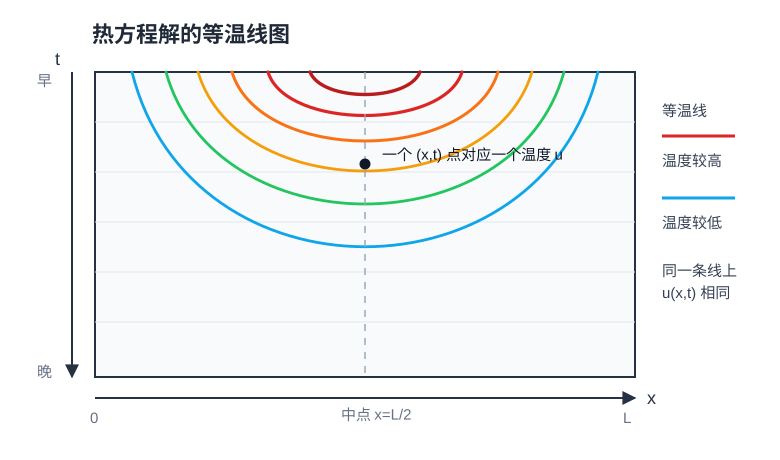
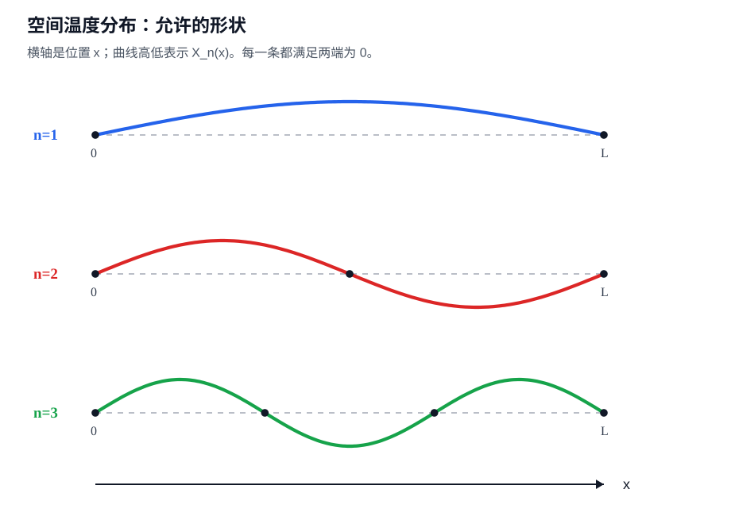
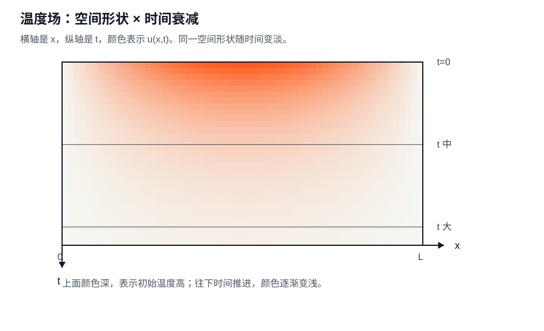
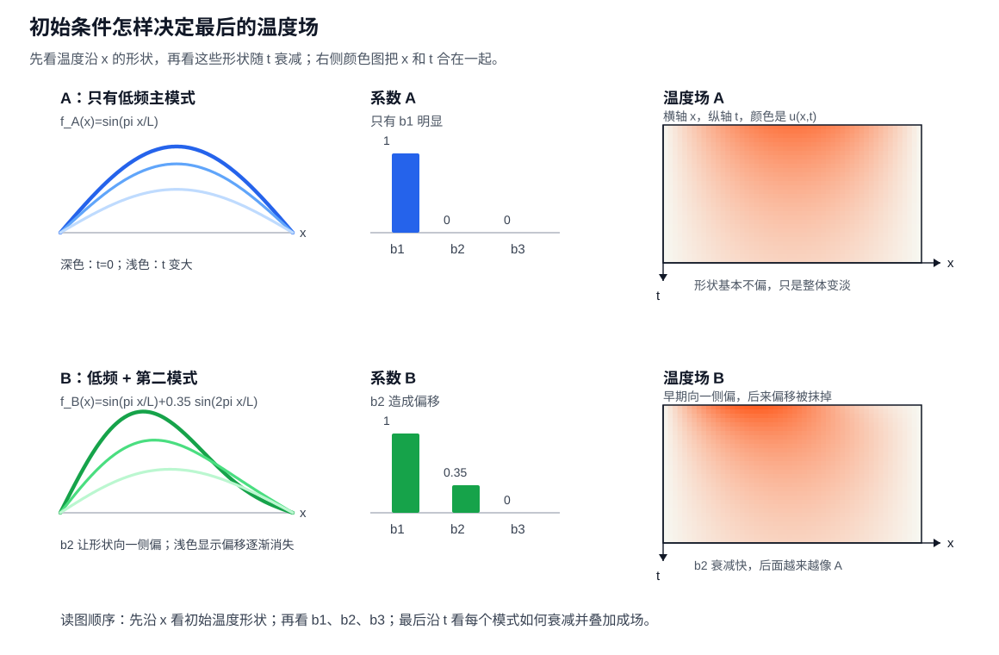
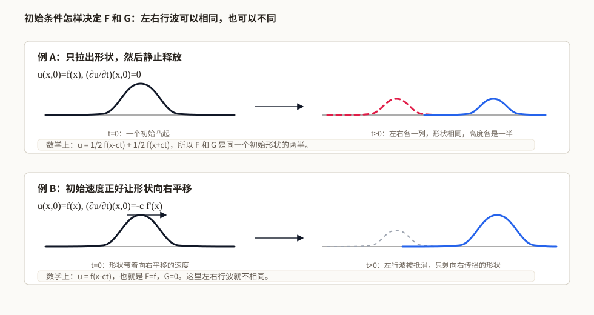
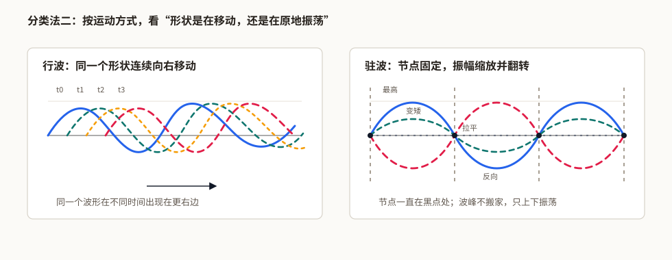
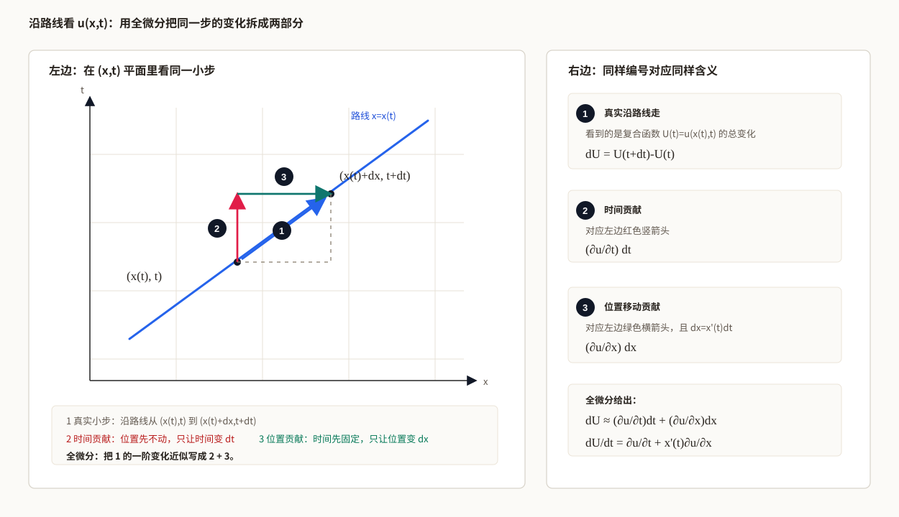

# 偏微分方程（PDE）

## 一、前言：偏微分方程研究什么

一根杆上的温度怎样扩散，一根弦上的扰动怎样传播，一片区域中的电势怎样达到平衡？这些问题需要同时描述空间中不同位置的量，并说明它们怎样相互影响。偏微分方程就是研究这些连续分布及其变化规律的数学语言。

例如温度 $u(x,t)$ 同时依赖位置和时间。热方程 $u_t=\kappa u_{xx}$ 把温度随时间的变化与空间分布的弯曲程度联系起来；波方程 $u_{tt}=c^2u_{xx}$ 描述振动和传播；Laplace 方程 $\Delta u=0$ 则刻画一类平衡状态。这些方程的未知量都是定义在一个区域上的函数。

### 未知量：空间中的场

在空间的每个位置分配一个温度、位移或速度，就得到一个场。场可以随时间演化，也可以不含时间变量，例如静态电势 $u(x,y,z)$。温度场在每个位置给出一个数，速度场在每个位置给出一个向量；偏微分方程既可以研究标量场，也可以研究向量场和相互耦合的场。

空间导数描述相邻位置之间的变化。正因为不同位置通过方程联系在一起，求解时必须关心整个区域的形状，以及区域边缘施加了什么约束。对于演化问题，还需要说明场最初是什么样子。

### 历史脉络：从数学物理到泛函分析与弱解

**数学物理的起点：描述振动、传热和势场。** 偏微分方程的发展与弦振动、热传导、流体运动和电磁现象紧密相连。研究者从局部受力、守恒规律或平衡条件出发，建立空间中的场方程。空间区域和边界条件也随之进入问题：同样的内部规律，在不同形状的区域或不同边界约束下，会产生不同的解。

**函数展开与边值问题：把复杂的场分解成简单模式。** Fourier 的热传导研究使三角级数与偏微分方程求解紧密联系起来。分离变量、特征值问题、积分变换和 Green 函数等方法逐步发展，让人们能够利用区域的对称性、边界条件和方程结构构造解。研究重点也从写出形式上的表达式，扩展到证明展开是否收敛、是否确实满足方程。

**泛函分析：把解放到函数空间中研究。** 随着存在性、收敛性和极限过程变得重要，逐点计算导数已经不足以处理所有问题。泛函分析提供了新的语言：把函数看成空间中的元素，用范数度量大小，用算子表示微分关系，在函数空间中研究连续性、紧致性与收敛。偏微分方程的问题推动了这些工具的发展，这些工具也反过来帮助建立偏微分方程的理论。

**Sobolev 空间与弱解：让较粗糙的函数进入理论。** 二十世纪，弱导数、Sobolev 空间和弱解理论逐步成为重要工具。Sobolev 空间把函数及其一定阶数的弱导数放在同一套可积性要求下；弱解则通过积分关系表达方程，使一些不能按经典方式逐点求导的函数也能成为研究对象。此后还要追问：弱解是否唯一，在什么条件下更光滑，能否恢复为经典解？这就连接到正则性理论。

**数值计算与现代应用：从规则模型走向复杂问题。** 有限差分、有限元和有限体积等方法，使复杂区域和耦合系统中的场能够被近似计算。函数空间、变分形式和误差分析也为这些方法提供理论依据。今天，偏微分方程继续连接物理建模、工程计算与科学机器学习；无论采用哪种工具，方程、区域、边界条件和解的性质仍是理解问题的基础。

本文先介绍经典模型与求解直觉，再概述函数空间和弱解的作用；Sobolev 空间及严格的存在性、正则性理论留作后续学习方向。

### 本文的学习路线

本文先建立场与空间耦合的直觉，再学习经典方程和求解方法：

- **说明一个完整的问题。** 辨认未知场、定义域、初始条件和边界条件，并从弦振动理解场方程怎样产生。
- **认识三种经典类型。** 通过 Laplace 算子和典型模型，理解椭圆型的平衡、抛物型的扩散与双曲型的传播。
- **学习具体求解方法。** 展开分离变量法、行波法和特征线法，再介绍变换法、Green 函数与有限元等工具。
- **连接数学物理与机器学习。** 理解守恒、能量、变分和弱解的基本含义，再看扩散模型、神经算子和 PINN 中的相关问题。

阅读求解方法前，可先掌握[常微分方程](../04-ordinary-differential-equations/)中的线性方程、数值方法和特殊函数。本文会在需要时使用这些工具，重点讨论它们怎样与空间结构、初值和边界条件共同确定一个场。

## 二、PDE 的未知量：从轨迹到场

### 先看一个 PDE 问题由什么组成

要把一个 PDE 问题说完整，通常需要说明以下几项：

- **未知函数**：要求哪个场，例如温度 $u(x,t)$ 或电势 $u(x,y)$。
- **方程**：未知函数与偏导数满足什么关系。
- **定义域**：在哪个空间区域、哪个时间范围内求解；全空间也是明确的定义域。
- **边界条件**：在空间边缘规定函数值、法向导数或它们的组合。
- **初始条件**：如果问题含时间演化，规定初始时刻的函数值；二阶时间方程通常还需要初始时间导数。

不是每个问题都同时需要初值和空间边界条件。全空间问题没有有限位置的边界，时间无关的边值问题也不需要时间初值。具体要给哪些数据，由方程、区域和所求解的类型决定。

#### 初值问题、边值问题和初边值问题

PDE 不只是一个方程，还要配上适当的条件。条件给少了，解可能不唯一；条件给错了，问题可能根本没有解；条件给得不合适，解还可能对数据误差十分敏感。

最常见的第一类是初值问题。它关心的是：系统一开始是什么样，后面怎样演化。比如热方程：

$$
\frac{\partial u}{\partial t}=\kappa\Delta u,
\qquad
u(x,0)=u_0(x).
$$

这里 $u_0(x)$ 是初始场。它不是一个数，而是整个空间上的函数：每个位置一开始的温度是多少，都要给出来。之后方程负责把这个初始场往后推进。

第二类是边值问题。它关心的是：区域边界上已经规定好了，内部应该是什么样。比如：

$$
\Delta u=0\quad \text{在 }\Omega\text{ 内},
\qquad
u=g\quad \text{在 }\partial\Omega\text{ 上}.
$$

这里边界函数 $g$ 把区域外框固定住，方程再决定内部怎样填进去。电势问题就是这种图像：导体边界电压被固定以后，内部电势场由边界和方程共同决定。

第三类是初边值问题。它同时给时间起点和空间边界。比如一根有限长细杆上的热传导：

$$
\frac{\partial u}{\partial t}=\kappa\frac{\partial^2u}{\partial x^2},
\qquad 0<x<L,
$$

$$
u(x,0)=u_0(x),
\qquad
u(0,t)=A,
\qquad
u(L,t)=B.
$$

这时既要知道一开始整根杆的温度分布，也要知道两端温度怎样被外界给定。

#### 三种常见边界条件

边界条件本身也有几种常见形式。Dirichlet 条件给函数值：

$$
u=g\quad \text{在 }\partial\Omega\text{ 上}.
$$

物理上可以理解成“边界上的温度、电压、位移已经被固定”。

Neumann 条件给法向导数：

$$
\frac{\partial u}{\partial n}=h\quad \text{在 }\partial\Omega\text{ 上}.
$$

这里 $n$ 是边界的外法向方向。物理上它常常对应通量，比如热量从边界流出去多少，或者电势沿法向变化有多快。如果绝热边界没有热量流出，常写成

$$
\frac{\partial u}{\partial n}=0.
$$

Robin 条件把函数值和法向导数混在一起：

$$
a u+b\frac{\partial u}{\partial n}=h\quad \text{在 }\partial\Omega\text{ 上}.
$$

它常用来描述和外界交换的边界，比如物体表面和空气发生热交换：边界温度越高，向外散热越强。

所以，读一个 PDE 问题时，不要只盯着方程本身。方程告诉你内部规律，初值告诉你从哪里开始，边界条件告诉你外界怎样约束这个系统。三者合起来，才是一个完整的问题。

### 偏微分方程的解是一个场

要理解为什么很多物理方程的解是“场”，可以先从牛顿力学里的质点说起。

牛顿力学最基本的对象是质点。假设只看一维运动，一个质点的位置是 $x(t)$，受力是 $F(x,t)$，牛顿第二定律可以写成：

$$
m\frac{d^2x}{dt^2}=F(x,t).
$$

这里未知量是 $x(t)$。解出来以后，我们得到的是这个质点在每个时刻的位置，也就是一条轨迹。哪怕位置本身是三维向量 $\mathbf{x}(t)$，它描述的仍然是“一个物体随时间怎么走”。这就是 ODE 最典型的物理图像：一个对象，一个状态，一条轨迹。

但真实世界里很多对象不是孤立质点，而是由大量相邻的小部分组成的整体。比如一根弦可以想成很多小质点连在一起，一块金属板可以想成很多小块互相传热，空气和水可以想成很多小团流体互相挤压和流动。每一个小部分当然也可以用牛顿方程描述，但如果小部分太多，我们就不会逐个写出每个质点的位置，而是改用一种连续的描述。

这个连续描述就是场。场的意思是：不是只给一个质点分配一个状态，而是给空间里的每个位置都分配一个量。温度场给每个位置分配温度，速度场给每个位置分配速度，电场给每个位置分配电场强度，概率密度场给每个位置分配概率密度。

#### 一个简单的场解：温度慢慢变平

为了看清楚 PDE 的解到底是什么样，先看一个最简单的热方程例子。设一根细杆两端温度固定为 $0$，杆内部的温度记作：

$$
u(x,t).
$$

这里 $x$ 表示杆上的位置，$t$ 表示时间，$u(x,t)$ 表示“位置 $x$ 在时间 $t$ 的温度”。热方程大致说的是：

$$
\frac{\partial u}{\partial t}=\kappa\frac{\partial^2u}{\partial x^2}.
$$

它的意思是：温度怎么变，取决于周围温度分布弯不弯、平不平。

如果一开始温度分布像一个山包：

$$
u(x,0)=\sin\frac{\pi x}{L},
$$

那么它后来的形状可以写成：

$$
u(x,t)=e^{-\kappa(\pi/L)^2t}\sin\frac{\pi x}{L}.
$$

这个公式不用急着推导。只看它的结构就够了：

$$
\text{随时间变小的系数}\times \text{空间中的正弦形状}.
$$

也就是说，空间形状还是一个正弦山包，但前面的系数会随着时间越来越小。在每个给定的时刻，乘上这个系数就得到对应的温度分布。

下面这张图改成二维的等温线图。横轴是位置 $x$，纵轴是时间 $t$。图里每一条曲线都是一条等温线，意思是：沿着同一条曲线走，$u(x,t)$ 的值相同。

这张图的读法和地图上的等高线类似。靠近上方、靠近中间的等温线表示较高温度，因为一开始细杆中间最热；越往下，时间越晚，同样的温度线会向两边展开，表示热量向周围扩散。到更晚的时候，高温区域消失，只剩下较低温度的等温线。这样看就更像“场”了：我们不是追踪一个点的运动，而是在整张 $x$-$t$ 平面上给每个点都填上一个温度值。ODE 的解像一条时间轨迹，而 PDE 的解是在“空间 + 时间”这张底板上铺开的一个场。

### 弦的振动：从牛顿第二定律到场方程

弦的振动正好能把“质点”和“场”这两个视角连起来。先不要一上来就把弦看成连续的线，而是把它想成很多小质点连在一起。

这里要先分清两个符号：$x$ 表示“在弦上的哪个位置”，$u$ 表示“这个位置偏离平衡位置多少”。也就是说，$x$ 是位置标签，$u$ 是位移大小。为了简单起见，我们假设弦主要做上下振动，质点沿弦方向的位置不变，只是竖直方向的位移在变。

离散情况下，第 $i$ 个小质点的平衡位置记作 $x_i$，它在时间 $t$ 的竖直位移记作：

$$
u_i(t).
$$

对这个小质点，最基本的力学规律还是牛顿第二定律：

$$
\text{质量}\times \text{加速度}=\text{合力}.
$$

写成公式就是：

$$
m\frac{d^2u_i}{dt^2}=F_i.
$$

左边是第 $i$ 个小质点的惯性项。关键是右边的合力 $F_i$ 从哪里来。弦上的小质点不是孤立的，它会被左右相邻的小质点拉扯。如果第 $i$ 个点比左右邻居高很多，它就会被往下拉；如果它比左右邻居低很多，它就会被往上拉；如果它和左右邻居几乎在一条直线上，合力就比较小。

可以把左右两边的拉扯分开看。右边邻居对第 $i$ 个点的拉力，和二者位移差有关：

$$
F_{i,\text{right}}\approx k\bigl(u_{i+1}(t)-u_i(t)\bigr).
$$

左边邻居对第 $i$ 个点的拉力，也和二者位移差有关：

$$
F_{i,\text{left}}\approx k\bigl(u_{i-1}(t)-u_i(t)\bigr).
$$

所以合力大约是：

$$
F_i
\approx F_{i,\text{right}}+F_{i,\text{left}}
=k\bigl(u_{i+1}(t)-u_i(t)\bigr)
+k\bigl(u_{i-1}(t)-u_i(t)\bigr).
$$

也就是说，第 $i$ 个点的受力来自“右边拉它”和“左边拉它”这两部分。于是离散的牛顿方程可以粗略写成：

$$
m\frac{d^2u_i}{dt^2}
\approx
k\bigl(u_{i+1}(t)-u_i(t)\bigr)
+k\bigl(u_{i-1}(t)-u_i(t)\bigr).
$$

如果把右边合并，才会得到常见的差分形式：

$$
k\bigl(u_{i+1}(t)-2u_i(t)+u_{i-1}(t)\bigr).
$$

这个量衡量的是第 $i$ 个点相对左右邻居的弯曲程度。到这里为止，我们仍然是在写很多个 ODE：每个小质点一个方程，每个方程描述一个位移 $u_i(t)$ 怎么随时间变化。

到这里为止，我们还是在把弦看成一串离散的小质点。每个质点有一个编号 $i$，相邻两个质点之间的距离记作 $\Delta x$。如果从左到右数，第 $i$ 个质点在平衡线上的位置可以记成：

$$
x_i=i\Delta x.
$$

现在想象我们把质点取得越来越密，也就是让 $\Delta x$ 越来越小。这样一来，弦就不再像一串分开的点，而越来越像一条连续的线。于是我们也不再主要用离散编号 $i$ 来标记质点，而是用连续的位置 $x$ 来标记弦上的点。

在这个过程中，离散位移：

$$
u_i(t)
$$

变成连续位移场。它的意思是：弦上位置 $x$ 处的点，在时间 $t$ 偏离平衡位置多少。

$$
u(x,t).
$$

更准确地说，可以把 $u_i(t)$ 看成 $u(x_i,t)$ 在离散点上的取值：

$$
u_i(t)\approx u(x_i,t).
$$

同时，相邻质点之间的差分在除以 $(\Delta x)^2$ 后，会变成空间二阶导数：

$$
\frac{u_{i+1}(t)-2u_i(t)+u_{i-1}(t)}{(\Delta x)^2}
\longrightarrow
\frac{\partial^2 u}{\partial x^2}.
$$

为什么可以这么做？可以用 Taylor 展开看一下。连续化以后，$u_i(t)$ 可以看成 $u(x_i,t)$。左右两个邻居分别是 $x_i+\Delta x$ 和 $x_i-\Delta x$，所以：

$$
u(x_i+\Delta x,t)
\approx u(x_i,t)+\Delta x\frac{\partial u}{\partial x}(x_i,t)
+\frac{(\Delta x)^2}{2}\frac{\partial^2u}{\partial x^2}(x_i,t),
$$

$$
u(x_i-\Delta x,t)
\approx u(x_i,t)-\Delta x\frac{\partial u}{\partial x}(x_i,t)
+\frac{(\Delta x)^2}{2}\frac{\partial^2u}{\partial x^2}(x_i,t).
$$

把这两个式子相加，再减去 $2u(x_i,t)$，中间的一阶导数项会互相抵消，剩下的主要就是：

$$
u(x_i+\Delta x,t)-2u(x_i,t)+u(x_i-\Delta x,t)
\approx
(\Delta x)^2\frac{\partial^2u}{\partial x^2}(x_i,t).
$$

所以：

$$
\frac{u(x_i+\Delta x,t)-2u(x_i,t)+u(x_i-\Delta x,t)}{(\Delta x)^2}
\approx
\frac{\partial^2u}{\partial x^2}(x_i,t).
$$

这一步的直觉是：离散差分描述“中间点比左右邻居弯多少”，而二阶导数描述连续曲线在某个位置“弯多少”。它们说的是同一件事，只是一个在离散质点链上说，一个在连续弦上说。

于是，原来很多个小质点各自满足的牛顿方程，在连续极限下合并成一个关于位移场 $u(x,t)$ 的偏微分方程：

$$
\frac{\partial^2 u}{\partial t^2}
=c^2\frac{\partial^2 u}{\partial x^2}.
$$

这就是一维波方程。左边是场在时间上的加速度，右边是场在空间上的弯曲程度。它说的是：弦上每个位置的加速度，由这个位置附近的弯曲情况决定。

所以这不是三条孤立的公式，而是一条清楚的过渡链条：

$$
\text{单个质点的牛顿方程}
\longrightarrow
\text{很多相邻质点的耦合 ODE}
\longrightarrow
\text{连续介质的 PDE}.
$$

波也正是在这个意义上把质点和场联系起来。微观上，每个小质点只是在附近上下振动；宏观上，许多相邻质点的振动互相传递，形成了沿着弦传播的波。单个质点给出轨迹，连续介质给出场，波则是这个场随时间传播的形状。

这就是很多数学物理方程里 PDE 出现的原因：我们研究的不是单个质点，而是连续介质；不是一个位置 $x(t)$，而是每个空间位置上的状态 $u(x,t)$；不是一条轨迹，而是一个场随时间演化。

所以，从 ODE 到 PDE，关键变化不是公式变长了，而是未知量的性质变了：

$$
\text{一个质点的轨迹 } x(t)
\longrightarrow
\text{整个空间上的场 } u(x,t).
$$

ODE 问的是：这个状态点沿时间怎么走？PDE 问的是：空间中每个位置上的量，怎样一边受周围位置影响，一边随时间变化？

### 场的几种基本类型

场这个词本身并不规定“每个点上放什么”。真正重要的是：空间里的每个位置，都有一个对应的量。这个量可以是一个数，也可以是一个向量，甚至可以是更复杂的对象。第一遍先分清三种最常见的情况。

最简单的是一维标量场。所谓标量，就是一个数。比如后面弦振动会出现的位移：

$$
u(x,t).
$$

如果先固定时间 $t$，那么 $u(x,t)$ 就是在一条线上给每个位置 $x$ 放一个数：这个位置偏离平衡线多少。前面的温度例子也一样：固定某个时间以后，细杆上每个位置都有一个温度值。曲线上的每个点都有一个高度，这就是最朴素的“场”的图像。

再往上是二维标量场。温度场就是标量场：给定一个位置 $(x,y)$，温度 $u(x,y)$ 只回答一个问题：这里多少度？它没有方向，只是一个数。电势、电压、高度、密度、压强，也常常是这种二维或三维标量场。地图上的地形高度也是标量场：每个经纬度位置对应一个海拔高度。

二维标量场可以用等高线、等温线、等势线来画。比如地形图里，一条等高线上的高度相同；温度图里，一条等温线上的温度相同；电势图里，一条等势线上的电势相同。这样画的好处是，我们不用真的画三维曲面，也能看出这个场哪里高、哪里低、哪里变化快。

另一类是二维向量场。风速场就是向量场：给定一个位置 $(x,y)$，风速不只要回答“多快”，还要回答“往哪里吹”。所以这个点上放的不是一个数，而是一支箭头。箭头有方向，也有大小。流体速度场、力场、电场，也经常用向量场来描述。

所以，温度场和风速场都是场，但它们不是同一种场。温度场每个点给一个数，风速场每个点给一个箭头。区分这一点，是为了后面看公式时不混淆：有些方程研究的是数值怎样分布，有些方程研究的是方向和流动怎样变化。

## 三、PDE 的三种经典类型

这一章先用拉普拉斯算子建立一个核心直觉：PDE 不是只看一个点的数值，而是在研究一个点和周围空间的关系。然后再解释二阶 PDE 为什么会分成椭圆型、抛物型和双曲型：它们的差别来自最高阶导数，也就是主部的结构。最后分别看三类典型方程，并把容易混淆的地方集中比较。

### 拉普拉斯算子：一个点和周围相比有多突出

#### 先从标量场讲起

拉普拉斯算子并不是只能用于标量场。这里先从标量场讲起，只是因为它最容易看清核心直觉。温度场 $u(x,y)$、电势场 $u(x,y)$、高度场 $u(x,y)$ 都是标量场：每个空间位置上放一个数。

对这样的场，拉普拉斯算子写成：

$$
\Delta u.
$$

它最核心的问题不是“这个点的数值是多少”，而是“这个点和周围位置相比怎么样”。换句话说，$\Delta u$ 描述的是局部关系：当前位置相对附近平均水平是高了、低了，还是差不多。

比如温度场里，某个点温度很高，但周围也同样高，那么这个点并不突出；另一个点温度未必最高，但如果它比周围明显高出一截，它就是一个局部热峰。拉普拉斯算子看的正是这种局部对比。

#### 一维、二维、三维里的写法

一维时，只有左右两个方向，拉普拉斯算子就是二阶空间导数：

$$
\Delta u=\frac{\partial^2u}{\partial x^2}.
$$

二维时，除了左右，还要看上下，所以把 $x$、$y$ 两个方向的二阶变化加起来：

$$
\Delta u
=
\frac{\partial^2u}{\partial x^2}
+
\frac{\partial^2u}{\partial y^2}.
$$

三维时再加上 $z$ 方向：

$$
\Delta u
=
\frac{\partial^2u}{\partial x^2}
+
\frac{\partial^2u}{\partial y^2}
+
\frac{\partial^2u}{\partial z^2}.
$$

这些公式看起来只是把二阶偏导数加在一起，但背后的意思是同一个：在每个空间方向上，都拿当前位置和附近位置比较，然后把这些比较合成一个局部量。

离散地看，一维情况下相邻三个点的值是：

$$
u_{i-1},\quad u_i,\quad u_{i+1}.
$$

中间点和左右邻居的关系可以写成：

$$
\bigl(u_{i+1}-u_i\bigr)+\bigl(u_{i-1}-u_i\bigr)
=u_{i+1}-2u_i+u_{i-1}.
$$

再除以网格间距的平方，就得到一维离散拉普拉斯：

$$
\frac{u_{i+1}-2u_i+u_{i-1}}{(\Delta x)^2}.
$$

前面在弦振动的连续极限里已经看过这个过程：点越来越密、$\Delta x$ 越来越小时，离散差分会变成连续的二阶空间导数：

$$
\frac{u_{i+1}-2u_i+u_{i-1}}{(\Delta x)^2}
\longrightarrow
\frac{\partial^2u}{\partial x^2}
=\Delta u.
$$

所以无论一维、二维还是三维，拉普拉斯算子的核心都不是维度本身，而是“一个点和周围其它位置的关系”。
#### 回看前面的两个例子

现在可以用拉普拉斯算子重新理解前面的两个例子。

第一个例子是细杆上的温度场。我们写 $u(x,t)$，意思是位置 $x$、时间 $t$ 的温度。固定时间 $t$ 后，$u$ 就是一维标量场。热方程里出现的

$$
\frac{\partial u}{\partial t}=\kappa\Delta u
$$

可以读成：一个位置的温度怎样随时间变化，取决于这个位置相对周围温度是否突出。如果这里比周围热，热量会向旁边扩散；如果这里比周围冷，周围会把它补上；如果这里和周围差不多，变化就小。所以热方程里的 $\Delta u$，抓住的是温度场的局部不均匀。

第二个例子是弦的振动。弦上的位移场写成 $u(x,t)$，意思是位置 $x$、时间 $t$ 的竖直位移。波方程可以写成：

$$
\frac{\partial^2u}{\partial t^2}=c^2\Delta u.
$$

这里左边是时间上的加速度，右边的 $\Delta u$ 是空间上的弯曲程度。也就是说，弦上某个点为什么会加速？不是因为它自己有一个绝对位移，而是因为它和附近的点相比形成了弯曲。局部弯得越明显，张力带来的恢复作用越明显。

所以这两个例子里，拉普拉斯算子都在做同一件事：它不看一个点孤立的数值，而看这个点和周围组成的局部形状。对温度场，这种局部形状决定扩散；对弦的位移场，这种局部形状决定振动的加速度。

#### 二阶导数给的是几何信息

二阶导数提供的信息往往是几何的。一阶导数告诉我们函数在某个方向上是上升还是下降；二阶导数告诉我们局部形状是弯上去、弯下去，还是比较平。

在 PDE 中，Hessian 矩阵记录了函数的各个二阶偏导数，拉普拉斯算子是这个矩阵的迹。它不像完整 Hessian 矩阵那样保留所有方向之间的细节，而是把各个空间方向上的二阶弯曲加总起来，得到一个总体的局部弯曲量。

#### 符号和历史地位

拉普拉斯算子通常写成 $\Delta u$，也常写成 $\nabla^2u$。这两个写法表示的是同一个东西。$\Delta$ 是希腊字母大写 Delta，在数学里常和差异、变化有关；$\nabla^2$ 的写法来自向量分析，表示这个算子也可以写成：

$$
\Delta u=\nabla\cdot(\nabla u).
$$

这里的散度就是散度，不需要在这一节展开。对现在的读者来说，只要记住：$\Delta u$ 处理的是标量场；$\nabla^2u$ 和 $\Delta u$ 是同一个拉普拉斯算子的两种写法。

历史上，拉普拉斯算子和势函数问题关系很深。十八、十九世纪研究引力、电势、流体和热传导时，人们经常遇到这样的问题：空间里每个点都有一个势函数或温度函数，它在没有源、没有汇、没有外部注入的地方，应该怎样达到局部平衡。这个平衡条件可以写成：

$$
\Delta u=0.
$$

这里要分清楚：$\Delta$ 是拉普拉斯算子，$\Delta u=0$ 才是拉普拉斯方程，也叫 Laplace 方程。

那它到底是谁提出的？如果问“类似形式最早由谁写出”，答案并不单一。Euler、d’Alembert 等人在研究流体和复变函数早期问题时，已经遇到过这类方程。如果问“为什么它叫 Laplace 方程”，答案更明确：Pierre-Simon Laplace 在十八世纪后期研究引力势等问题时系统使用了这个方程，使它在势理论中变成核心方程。因此后人把 $\Delta u=0$ 称为 Laplace 方程。后来人们又把方程里的核心空间算子 $\Delta$ 单独拿出来，称为 Laplace operator，也就是拉普拉斯算子。

它的历史地位很高，是因为它把很多物理问题里的同一种结构抽象了出来：一个标量场在某个点的状态，受周围邻近位置约束。引力势、电势、稳态温度、不可压流体的势函数，背后都会出现类似的空间平衡关系。换句话说，拉普拉斯算子不是某个方程里的偶然符号，而是“局部和周围如何相互约束”的核心语言。

所以最后可以用一句话收住：拉普拉斯算子就是把“一个标量场里的某个点和周围相比有多突出”这件事，用微分的语言写出来。

### 为什么二阶 PDE 会分成三类

椭圆型、抛物型、双曲型这三个名字，主要是在给二阶 PDE 分类。这里的“二阶”很关键：因为二阶导数天然会形成二次型，而二次型本来就有同号、退化、异号这几种基本形状。PDE 的三分类，背后看的正是这个结构。

#### 先看主部

判断一个二阶 PDE 的类型时，最重要的通常不是低阶项，也不是右边有没有外部源，而是最高阶导数部分。这个最高阶部分叫方程的主部。

以两个变量的二阶线性 PDE 为例，主部常写成：

$$
A\frac{\partial^2u}{\partial x^2}
+2B\frac{\partial^2u}{\partial x\partial y}
+C\frac{\partial^2u}{\partial y^2}.
$$

主部决定了方程最基本的性格：它更像是在约束一个平衡场，还是在描述扩散过程，还是在描述传播过程。低阶项会影响具体解，但通常不改变这种最核心的分类。

#### 主部对应一个二次型

上面这三个系数 $A,B,C$ 可以组成一个对称矩阵：

$$
M=
\begin{pmatrix}
A & B\\
B & C
\end{pmatrix}.
$$

这个矩阵对应一个二次型。完整写出来是：

$$
Q(\xi,\eta)
=
\begin{pmatrix}\xi & \eta\end{pmatrix}
\begin{pmatrix}
A & B\\
B & C
\end{pmatrix}
\begin{pmatrix}\xi\\ \eta\end{pmatrix}.
$$

展开以后就是：

$$
Q(\xi,\eta)=A\xi^2+2B\xi\eta+C\eta^2.
$$

这里的 $\xi,\eta$ 可以先理解成方向变量。二次型问的是：沿着不同方向看，主部表现出来的是同号、退化，还是异号。

为什么矩阵里交叉项位置写 $B$，而不是 $2B$？因为矩阵二次型展开时，中间项会出现两次：一次是 $B\xi\eta$，一次是 $B\eta\xi$，合起来就是 $2B\xi\eta$。

#### 从二次型到判别式

二维时，二次型的性质可以用矩阵行列式判断：

$$
\det M
=
\det
\begin{pmatrix}
A & B\\
B & C
\end{pmatrix}
=AC-B^2.
$$

PDE 教材里常写的判别式是：

$$
B^2-AC.
$$

它正好是 $\det M$ 的相反数。所以 $B^2-AC$ 不是从二次曲线那里随便借来的符号，而是在判断主部矩阵的行列式符号；行列式符号又反映二次型是同号、退化还是异号。

如果把主部矩阵的两个特征值记成 $\lambda_1,\lambda_2$，那么：

$$
\det M=\lambda_1\lambda_2.
$$

因此二维判别式也可以写成：

$$
B^2-AC=-\lambda_1\lambda_2.
$$

这样看，判别式和特征值其实是同一套判断。$B^2-AC<0$ 等价于 $\lambda_1\lambda_2>0$，两个特征值同号；$B^2-AC=0$ 等价于至少一个特征值为 $0$，出现退化方向；$B^2-AC>0$ 等价于两个特征值异号。

#### 椭圆型：二次型同号

椭圆型对应的二次型是同号的。最简单的例子是：

$$
Q(\xi,\eta)=\xi^2+\eta^2.
$$

只要方向 $(\xi,\eta)$ 不是零方向，$Q$ 就总是正的。也就是说，不管往哪个方向看，它都给出同一种符号。这种结构没有特别偏爱的传播方向，各个方向一起约束场的形状。

在二维判别法里，椭圆型对应：

$$
B^2-AC<0.
$$

典型代表是 Laplace 方程。它不是沿某个方向推进时间，而是在一个区域里让各个方向共同达到平衡。

#### 抛物型：二次型退化

抛物型对应的二次型有退化方向。最简单的例子是：

$$
Q(\xi,\eta)=\xi^2.
$$

这个二次型在 $\eta$ 方向上没有二阶贡献。也就是说，有一个方向被漏掉了。

在二维判别法里，抛物型对应：

$$
B^2-AC=0.
$$

典型代表是热方程。热方程里没有二阶时间导数，只有一阶时间导数和二阶空间导数；从最高阶结构看，它正好处在椭圆型和双曲型之间的退化情形。它描述的是一个初始场随着时间扩散、耗散、变平。

#### 双曲型：二次型异号

双曲型对应的二次型是异号的。最简单的例子是：

$$
Q(\xi,\eta)=\xi^2-\eta^2.
$$

有些方向上它是正的，有些方向上它是负的，还有一些方向上它等于零。比如 $\xi=\eta$ 或 $\xi=-\eta$ 时，$Q=0$。这些零方向和双曲型方程里的特征方向有关。

在二维判别法里，双曲型对应：

$$
B^2-AC>0.
$$

典型代表是波方程。它会形成传播方向，信息可以沿着特征方向传递，所以常常描述波动、信号、输运和有限速度传播。

#### 多个变量时看特征值

二维时，$B^2-AC$ 已经可以用两个特征值的乘积来理解。到了多个变量，就不能只看一个乘积了，因为特征值不止两个。一般做法是把主部的二阶导数系数放进一个对称矩阵，然后直接看这个矩阵的全部特征值符号。

为什么特征值能判断？因为对称矩阵总可以通过旋转坐标把交叉项消掉。换到特征向量坐标以后，二次型会变成：

$$
Q=\lambda_1z_1^2+\lambda_2z_2^2+\cdots+\lambda_nz_n^2.
$$

这里 $\lambda_1,\lambda_2,\ldots,\lambda_n$ 就是主部矩阵的特征值。于是符号结构直接由特征值决定：所有非零特征值同号，二次型同号；出现零特征值，二次型退化；既有正特征值又有负特征值，二次型异号。

所以多变量二阶 PDE 的分类，本质上仍然是同一件事：看主部二次型的符号结构。二维时可以用 $B^2-AC$ 快速判断；更高维时就看主部矩阵的特征值。

#### 这套分类主要针对二阶 PDE

还要注意，这里讲的椭圆型、抛物型、双曲型判别法，主要针对二阶 PDE。原因不是历史习惯，而是结构本身：二阶 PDE 的主部自然对应二次型，所以可以用二次型、矩阵、特征值来分类。

更高阶 PDE 当然也可以研究类型，但要看更高阶的主符号，不能直接套用 $B^2-AC$。初学时先抓住这条主线就够了：椭圆型讲平衡，抛物型讲扩散演化，双曲型讲传播波动。
### 椭圆型方程：平衡与稳态

椭圆型方程最重要的直觉是：它描述的通常不是“一个场怎样随时间变化”，而是“一个场在平衡时应该长什么样”。

#### Laplace 方程：没有内部源的平衡

最典型的例子是 Laplace 方程：

$$
\Delta u=0.
$$

这里没有 $\partial u/\partial t$，也没有 $\partial^2u/\partial t^2$。也就是说，方程里没有显式的时间演化。它不是在问“下一秒会怎样”，而是在问：如果系统已经达到平衡，那么空间里的每个点和周围应该满足什么关系？

为什么这里没有时间？因为 Laplace 方程不是演化方程，而是稳态方程。比如温度问题真正的时间演化是热方程：

$$
\frac{\partial u}{\partial t}=\kappa\Delta u.
$$

这里的未知量应该写成 $u(x,y,t)$，表示温度随空间和时间变化。如果只求与时间无关的温度分布，就令：

$$
\frac{\partial u}{\partial t}=0.
$$

代回热方程，就得到：

$$
\Delta u=0.
$$

这时我们研究的是稳态温度 $u(x,y)$，而不是随时间变化的温度 $u(x,y,t)$。

静电势问题更典型。静电场里的电势 $u(x,y,z)$ 本来就不是在描述“电势随时间怎么变”，而是在描述“空间里每个点的电势是多少”。如果区域内部没有电荷源，电势就满足 Laplace 方程。

根据前面对拉普拉斯算子的解释，$\Delta u$ 衡量的是一个点相对周围是否突出。所以

$$
\Delta u=0
$$

可以读成：在没有外部源的地方，每个点都不应该比周围平均水平更突出。它既不是局部山峰，也不是局部谷底，而是和附近点保持一种平衡关系。

#### 为什么 Laplace 方程是椭圆型

二维 Laplace 方程可以写成：

$$
\frac{\partial^2u}{\partial x^2}+\frac{\partial^2u}{\partial y^2}=0.
$$

把它和一般二阶 PDE 的主部比较：

$$
A\frac{\partial^2u}{\partial x^2}
+2B\frac{\partial^2u}{\partial x\partial y}
+C\frac{\partial^2u}{\partial y^2},
$$

就能看出：

$$
A=1,\qquad B=0,\qquad C=1.
$$

所以它的主部矩阵是：

$$
M=
\begin{pmatrix}
1 & 0\\
0 & 1
\end{pmatrix}.
$$

对应的二次型是：

$$
Q(\xi,\eta)
=
\begin{pmatrix}\xi & \eta\end{pmatrix}
\begin{pmatrix}
1 & 0\\
0 & 1
\end{pmatrix}
\begin{pmatrix}\xi\\ \eta\end{pmatrix}
=\xi^2+\eta^2.
$$

这个二次型除了零方向以外永远是正的，所以是同号二次型。按前面的分类，同号二次型对应椭圆型。

也可以直接用判别式看：

$$
B^2-AC=0^2-1\cdot 1=-1<0.
$$

所以 Laplace 方程是椭圆型方程。

直觉上说，Laplace 方程没有某个特殊的时间方向，也没有某个特殊的传播方向。$x$ 和 $y$ 两个方向同等地约束内部场，所以它描述的是平衡和稳态，而不是扩散过程或波的传播。
#### 边界决定内部

椭圆型方程最有代表性的现象是：边界条件决定区域内部。

想象一块薄金属板，边缘温度被固定住。若只考虑时间无关的温度分布，稳态温度场 $u(x,y)$ 往往满足：

$$
\Delta u=0.
$$

这句话的意思是：板内部没有新的热源，也没有新的冷源；内部每个点的温度都由周围温度牵制。真正外部给定的信息在边界上：边缘哪里热，哪里冷，内部温度场就会被这些边界条件“拉”成某种平衡形状。

这和 ODE 的初值问题很不一样。ODE 常常是给一个初始状态，然后沿时间往前走；椭圆型 PDE 常常是给一圈边界条件，然后问区域内部怎样填满。它更像是在解一个空间拼图：边界已经固定，内部要以最平滑、最平衡的方式接上去。

#### 调和函数的直觉

“调和”这个词在数学里出现过很多次。比如调和平均、调和级数、调和不等式、调和分析、调和函数。它们不是同一个概念，不能简单混在一起，但背后有一条相通的气质：都和某种“协调关系”有关。

调和平均强调的是一种特殊的平均方式，常出现在速率、比例这类问题里；调和不等式比较的是不同平均之间的关系；调和分析研究的是怎样把复杂函数分解成正弦、余弦这类基本振动成分。这里的“调和”，最早和音乐里的泛音、振动、频率有关，后来逐渐变成数学里描述平均、平衡、周期结构的一类语言。

PDE 里的调和函数，是这个词在势理论和 Laplace 方程里的用法。满足

$$
\Delta u=0
$$

的函数叫调和函数。它最重要的直觉是平均性：一个点的值，和它周围一小圈的平均值相等。

这句话非常深。它说明调和函数内部不会凭空冒出一个孤立的尖峰，也不会凭空出现一个孤立的深坑。如果内部某个点突然比周围高很多，那它就不是平衡；如果某个点比周围低很多，也不是平衡。真正的最大值和最小值通常由边界决定。

这也是为什么 Laplace 方程常常和“平滑”“均衡”“没有内部源”这些词联系在一起。它不是把场往某个方向推，而是要求整个场在空间中达成一种局部协调。

#### Poisson 方程：有源的平衡

如果区域内部有热源、电荷、质量分布，平衡方程就不再是 $\Delta u=0$，而会变成 Poisson 方程：

$$
\Delta u=f.
$$

这里的 $f$ 表示内部的源项。比如在静电问题里，$u$ 可以表示电势，$f$ 和电荷密度有关；在引力问题里，$u$ 可以表示引力势，$f$ 和质量分布有关；在稳态热传导里，$f$ 可以表示内部热源。

所以 Laplace 方程和 Poisson 方程的区别可以这样理解：

$$
\Delta u=0
\quad\text{表示没有内部源的平衡，}
$$

$$
\Delta u=f
\quad\text{表示有内部源的平衡。}
$$

一个是“内部只由边界牵制”，一个是“内部还受到源项影响”。

### 抛物型方程：扩散与耗散

抛物型方程最重要的直觉是：一个场先有一个初始状态，然后这个状态会随着时间不断扩散、变平、丢失尖锐细节。它通过初始条件和偏微分方程确定各个时刻的场。

#### Fourier 热方程：最典型的抛物型方程

最典型的例子是热方程。它也常叫**热传导方程**；如果把温度换成浓度、概率密度或别的会扩散的量，同一类方程也常被叫作**扩散方程**。从历史上看，它和法国数学物理学家 Joseph Fourier 关系非常深：Fourier 研究热传导时系统使用了这类方程，并由此发展出 Fourier 级数的思想。有些语境里也会说 Fourier heat equation 或 Fourier 方程，但中文教材里更常见的名字还是热方程、热传导方程或扩散方程。这里先用热方程这个名字，因为它来自最经典的热传导模型：

$$
\frac{\partial u}{\partial t}=\kappa \Delta u.
$$

这里 $u(x,t)$ 是温度场，$\kappa>0$ 是扩散系数。左边 $\partial u/\partial t$ 表示温度随时间怎么变；右边 $\Delta u$ 表示当前位置和周围相比是否突出。于是热方程可以读成一句话：一个地方温度变化的速度，取决于它和周围温度的差异。

如果某个位置比周围热，它会把热量传给周围，自己降下来；如果某个位置比周围冷，周围会把它补上；如果局部已经很平，变化就很小。这就是扩散。

#### 为什么热方程是抛物型

以一维热方程为例：

$$
\frac{\partial u}{\partial t}=\kappa\frac{\partial^2u}{\partial x^2}.
$$

为了和前面的二阶 PDE 判别法对上，可以把它移到一边：

$$
\kappa\frac{\partial^2u}{\partial x^2}-\frac{\partial u}{\partial t}=0.
$$

这里变量是 $x$ 和 $t$，但主部只看二阶导数。它有 $\frac{\partial^2u}{\partial x^2}$，没有 $\frac{\partial^2u}{\partial x\partial t}$，也没有 $\frac{\partial^2u}{\partial t^2}$。如果把一般主部写成：

$$
A \frac{\partial^2u}{\partial x^2}+2B \frac{\partial^2u}{\partial x\partial t}+C \frac{\partial^2u}{\partial t^2},
$$

那么热方程对应：

$$
A=\kappa,\qquad B=0,\qquad C=0.
$$

所以判别式是：

$$
B^2-AC=0^2-\kappa\cdot 0=0.
$$

因此热方程是抛物型方程。

从二次型角度看，它的主部矩阵是：

$$
M=
\begin{pmatrix}
\kappa & 0\\
0 & 0
\end{pmatrix},
$$

对应二次型是：

$$
Q(\xi,\tau)=\kappa\xi^2.
$$

这个二次型在 $\tau$ 方向上退化，也就是时间方向没有二阶导数。直觉上，这正好对应热方程的结构：空间方向负责二阶扩散，时间方向负责一阶演化。所以它不是像 Laplace 方程那样直接求稳态，也不是像波方程那样有二阶时间振动，而是描述一个初始场怎样随时间扩散、耗散、变平。

#### 初值驱动时间演化

抛物型方程通常要给初值。比如一根细杆上的温度满足：

$$
\frac{\partial u}{\partial t}=\kappa\frac{\partial^2u}{\partial x^2},
$$

初始温度是：

$$
u(x,0)=u_0(x).
$$

这里 $u_0(x)$ 不是一个数，而是一整个函数：它告诉我们初始时刻每个位置的温度。之后热方程负责把这个初始温度场往后推进。

这和椭圆型方程的味道很不一样。椭圆型方程通常把边界条件、外在源项或约束条件固定住，然后问：在这些条件一直存在的情况下，内部场最终应该是什么平衡形状？抛物型方程则先给一个初始场，然后问：这个场在扩散、耗散和相互平均的作用下，时间往后会怎样变化？椭圆型问题求满足空间方程和边界条件的函数，抛物型问题还需要求出时间依赖。

#### 扩散会平滑尖锐结构

抛物型方程有一个很强的特点：它会平滑初始状态。

如果一开始温度场很尖锐，比如某个地方突然很热，热方程会立刻把这个尖峰摊开。时间越往后，尖峰越矮，影响范围越宽，整个场越来越平滑。前面画过的等温线图，就是这种现象：高温区域不是保持原样移动，而是不断扩散、变淡、变宽。

这也是抛物型方程和很多机器学习直觉发生联系的地方。所谓平滑，不只是物理里的热传导，也可以理解成信息在邻近点之间传播、尖锐差异被平均化。图上的扩散、随机游走、某些正则化方法，都有类似味道。

#### 耗散和不可逆

抛物型方程还有一个关键词：耗散。

热传导会让温度差变小。一个热峰扩散开以后，我们通常不能只看最后平滑的温度场，就唯一地倒推出最初那个尖峰到底在哪里、形状怎样。很多细节已经被扩散过程抹掉了。

所以抛物型方程常常带有不可逆的味道。时间往前走，场越来越平滑；如果强行往回倒推，解对测量误差往往十分敏感。热方程正向很好算，反向却很敏感：最后状态里一点点误差，倒回去都可能被放大成很大的差别。

### 双曲型方程：传播与波动

双曲型方程最重要的直觉是：场里的扰动会沿着一定方向传播出去，而不是只在原地扩散、变平。

这类方程最关心的问题是：信息从哪里来，沿哪里走，以什么速度到达远处。声波、弦波、水波、电磁波、弹性波，都有这种传播图像。它们背后的物理机制可以不同，但数学上常常共享一个特点：局部变化不会只是被平均掉，而会作为信号向外传递。

#### d'Alembert 波方程：最典型的双曲型方程

最典型的双曲型 PDE 是波方程。特别是在一维情形里，标准形式常叫**达朗贝尔方程**：

$$
\frac{\partial^2 u}{\partial t^2}=c^2\frac{\partial^2u}{\partial x^2}.
$$

这里 $u(x,t)$ 可以表示弦的位移、声压扰动，或者某种波动量。左边是时间上的加速度，右边是一维空间上的弯曲程度。它说的是：场在某个位置怎样加速，取决于这个位置附近的空间形状。

如果推广到多维空间，右边的一维二阶导数就换成 Laplace 算子：

$$
\frac{\partial^2 u}{\partial t^2}=c^2\Delta u.
$$

所以更准确地说：d'Alembert 方程通常指一维波方程的经典形式；多维情形一般直接叫波方程。

前面弦振动的例子正是这个意思。弦上某个点如果和左右邻居几乎在一条直线上，局部恢复力很小；如果这里弯得很厉害，张力就会把它拉回去。这种局部恢复作用一层层传给邻近位置，就形成了波的传播。

在经典物理的入门层面，最常见的波可以先分成两类：机械波和电磁波。

机械波需要介质。弦波、声波、水波、地震波、弹性波都属于这一类。它们本质上是介质内部的位移、压强、密度或形变扰动在传播。前面从离散质点和牛顿第二定律推导弦振动方程，其实就是机械波最典型的来源：介质中的一小部分受力、加速，再通过弹性作用影响旁边的部分。声波也可以放在这个图像里；宏观上，它可以由牛顿第二定律、质量守恒和介质的状态关系一起推出波方程。

电磁波不需要机械介质。光、无线电波、微波、X 射线都属于电磁波。它们不是“小质点拉动小质点”，而是电场和磁场按照 Maxwell 方程组互相演化。

在真空、没有电荷和电流的情况下，Maxwell 方程组可以写成：

$$
\nabla\cdot \mathbf{E}=0,
$$

$$
\nabla\cdot \mathbf{B}=0,
$$

$$
\nabla\times \mathbf{E}=-\frac{\partial \mathbf{B}}{\partial t},
$$

$$
\nabla\times \mathbf{B}=\mu_0\varepsilon_0\frac{\partial \mathbf{E}}{\partial t}.
$$

前两条说真空里没有电荷源和磁单极子；后两条说变化的磁场会产生旋转的电场，变化的电场会产生旋转的磁场。正是后面这种互相激发，使电磁扰动可以自己传播下去。

这个推导不算太复杂。先对 Faraday 方程两边取旋度：

$$
\nabla\times(\nabla\times\mathbf{E})
=-\frac{\partial}{\partial t}(\nabla\times\mathbf{B}).
$$

把 Maxwell 方程里的

$$
\nabla\times\mathbf{B}=\mu_0\varepsilon_0\frac{\partial\mathbf{E}}{\partial t}
$$

代进去，右边变成：

$$
-\mu_0\varepsilon_0\frac{\partial^2\mathbf{E}}{\partial t^2}.
$$

左边用一个向量恒等式：

$$
\nabla\times(\nabla\times\mathbf{E})
=\nabla(\nabla\cdot\mathbf{E})-\Delta\mathbf{E}.
$$

而真空中 $\nabla\cdot\mathbf{E}=0$，所以左边只剩下：

$$
-\Delta\mathbf{E}.
$$

于是得到：

$$
-\Delta\mathbf{E}
=-\mu_0\varepsilon_0\frac{\partial^2\mathbf{E}}{\partial t^2}.
$$

整理一下：

$$
\frac{\partial^2\mathbf{E}}{\partial t^2}
=\frac{1}{\mu_0\varepsilon_0}\Delta\mathbf{E}.
$$

这就是电场的波动方程。磁场 $\mathbf{B}$ 也可以用同样方法推出：

$$
\frac{\partial^2\mathbf{B}}{\partial t^2}
=\frac{1}{\mu_0\varepsilon_0}\Delta\mathbf{B}.
$$

如果记

$$
c=\frac{1}{\sqrt{\mu_0\varepsilon_0}},
$$

那么两者都可以写成标准波方程形式：

$$
\frac{\partial^2 \mathbf{E}}{\partial t^2}=c^2\Delta \mathbf{E},\qquad
\frac{\partial^2 \mathbf{B}}{\partial t^2}=c^2\Delta \mathbf{B}.
$$

这个 $c$ 就是真空中的光速。所以电磁波也属于波动现象，也和双曲型 PDE 有关，但它的物理来源不是牛顿质点链，而是 Maxwell 场方程。

更现代的物理里还会出现物质波、引力波等概念，它们不完全落在上面这个入门分类里，这里先不展开。对这一章来说，最重要的不是穷尽所有波的分类，而是看到：不同物理机制都可能导向双曲型 PDE，因为它们都描述扰动以有限速度传播。

#### 为什么波方程是双曲型

以一维波方程为例：

$$
\frac{\partial^2u}{\partial t^2}=c^2\frac{\partial^2u}{\partial x^2}.
$$

把它移到一边：

$$
\frac{\partial^2u}{\partial t^2}-c^2\frac{\partial^2u}{\partial x^2}=0.
$$

如果按照变量 $x,t$ 来写一般主部：

$$
A \frac{\partial^2u}{\partial x^2}+2B \frac{\partial^2u}{\partial x\partial t}+C \frac{\partial^2u}{\partial t^2},
$$

那么波方程对应：

$$
A=-c^2,\qquad B=0,\qquad C=1.
$$

所以判别式是：

$$
B^2-AC=0^2-(-c^2)\cdot 1=c^2>0.
$$

因此波方程是双曲型方程。

从二次型角度看，它的主部矩阵是：

$$
M=
\begin{pmatrix}
-c^2 & 0\\
0 & 1
\end{pmatrix},
$$

对应二次型是：

$$
Q(\xi,\tau)=-c^2\xi^2+\tau^2.
$$

这个二次型有正有负，是异号的。更重要的是，它有零方向：

$$
\tau^2-c^2\xi^2=0.
$$

也就是：

$$
\tau=\pm c\xi.
$$

这些零方向和波方程的特征方向有关。直觉上，这就是为什么波方程会出现向左、向右传播的结构，而不是像热方程那样把局部尖峰原地抹平。

#### 为什么要给初始形状和初始速度

波方程含有二阶时间导数，所以只给初始形状还不够，还要给初始速度。典型条件是：

$$
u(x,0)=u_0(x),
$$

$$
\frac{\partial u}{\partial t}(x,0)=v_0(x).
$$

第一条告诉我们一开始弦是什么形状，第二条告诉我们每个位置一开始往哪里动、动得多快。

这和牛顿力学很像。牛顿第二定律给出的通常是二阶方程：

$$
m\frac{d^2x}{dt^2}=F(x,t),
$$

或者更一般地，力也可能和速度有关：

$$
m\frac{d^2x}{dt^2}=F(x,\dot{x},t).
$$

因为它是二阶方程，所以要求解一条具体轨迹，通常要同时给出初始位置和初始速度：

$$
x(0)=x_0,\qquad \dot{x}(0)=v_0.
$$

如果只知道一个小球现在在哪里，却不知道它现在是静止、向左运动还是向右运动，后面的轨迹就不能唯一确定。波方程也是这个道理，只不过未知量不再是一个质点的位置 $x(t)$，而是一整根弦或一片空间里的位移场 $u(x,t)$。

### 一阶双曲型方程：输运和连续性方程

除了二阶波方程，一阶输运方程也是双曲型 PDE 里非常重要的一类。它通常属于一阶双曲型方程，所以单独放在这里讲。

这里要特别注意：一阶输运方程不是用前面的 $B^2-AC$ 来判别的。那套判别式主要针对二阶 PDE，因为二阶主部对应二次型。输运方程是一阶 PDE，没有二阶主部，也就谈不上用二次型判别。

那为什么它也叫双曲型？原因是它有清楚的实特征方向，信息沿着这些方向传播。也就是说，它和波方程共享的是“双曲型”的核心行为：不是原地扩散，而是沿着某些路线把信息传出去。

最简单的输运方程是：

$$
\frac{\partial u}{\partial t}+c\frac{\partial u}{\partial x}=0.
$$

这个方程的物理意义是“搬运”。这里的 $u(x,t)$ 可以表示传送带上某种标记的分布、道路上的车流密度，或者河面上一排漂浮物的位置密度。$c$ 是搬运速度。如果 $c>0$，整个图像向右移动；如果 $c<0$，整个图像向左移动。

从公式上看，$\partial u/\partial t$ 表示某个固定位置上的值随时间怎样变化，$c\partial u/\partial x$ 表示这个变化来自空间图像的平移。两项加起来等于 $0$，意思是：如果你站在固定位置看，数值会变；但如果你跟着速度 $c$ 一起走，就会看到同一个值被一路带过去。

它的解可以写成：

$$
u(x,t)=u_0(x-ct).
$$

这句话非常直观：初始形状 $u_0$ 没有被抹平，只是以速度 $c$ 向右移动。

所以双曲型方程的第一印象可以概括为：它描述扰动、信号和波的传播；信息有传播方向和传播速度；系统往往带有守恒、振荡和反射这些现象。连续性方程、最优传输这些更复杂的推广，后面放到数学物理方程和应用背景里再谈。

### 不同 PDE 之间的比较

前面分别看了椭圆型、抛物型和双曲型 PDE。这里把比较性的内容集中放在一起：它们有的求稳态，有的追踪扩散过程，有的描述传播和振荡；即使方程形式看起来相近，背后的问题也可能完全不同。

#### 抛物型和椭圆型：时间变量与稳态方程

热方程包含时间导数：

$$
\frac{\partial u}{\partial t}=\kappa\Delta u.
$$

如果要求的是与时间无关的特解 $u(x,t)=v(x)$，代入后 $\frac{\partial u}{\partial t}=0$，便得到

$$
\Delta v=0.
$$

前者是抛物型初边值问题，后者是椭圆型边值问题。这里做的是对未知函数增加“与时间无关”的要求，然后化简方程。

#### 双曲型和椭圆型：波动方程与静态约束

对波方程

$$
\frac{\partial^2u}{\partial t^2}=c^2\Delta u,
$$

同样可以代入时间无关的函数 $u(x,t)=v(x)$，得到 $\Delta v=0$。这说明波动方程的静态特解满足一个椭圆型方程。求波动解需要初始位移和初始速度；求静态特解则按空间区域和边界条件处理。

**达朗贝尔方程**通常指一维波动方程；**达朗贝尔公式**是它在整条直线上的解公式。方程、特解的要求和求解公式是三个不同的概念。

重力势函数就是一个很好的例子。在牛顿引力里，如果质量分布不随时间变化，重力势 $\phi$ 通常满足 Poisson 方程：

$$
\Delta \phi=4\pi G\rho.
$$

在没有质量源的区域，$\rho=0$，它就变成 Laplace 方程：

$$
\Delta \phi=0.
$$

这类方程描述的是静态约束：源在哪里，边界怎样，空间里的势函数就怎样分布。它不是在描述“扰动怎样传过去”，而是在描述“已经达到静态关系以后，场应该满足什么空间方程”。

如果空间几何形状或质量分布真的随时间改变，变化怎么传递？这就不是 Laplace 方程本身能回答的问题。Laplace 方程和 Poisson 方程是静态方程，没有时间变量，所以它们不描述传播速度。

在更完整的物理理论里，场的变化通常以波的方式传播。电磁场的变化由 Maxwell 方程描述，可以推出电磁波，传播速度是光速。引力在广义相对论里也不是瞬间传递；质量分布和时空几何的变化会以引力波的形式传播，速度也是光速。也就是说，**静态场的形状**常由椭圆型方程刻画；**场的改变如何传到远处**通常是双曲型传播问题，而不是扩散问题。

扩散方程适合描述热量、浓度、概率密度这类东西的平滑化过程。空间几何或引力场的改变，不应该直接类比成热扩散。更合适的区分是：椭圆型方程讲静态约束，抛物型方程讲耗散扩散，双曲型方程讲扰动以有限速度传播。

#### 输运和热方程：搬运不是扩散

它和热方程看起来有点像，因为两者左边都有时间导数，都在描述一个场随时间变化：

$$
\text{输运方程：}\quad \frac{\partial u}{\partial t}+c\frac{\partial u}{\partial x}=0,
$$

$$
\text{热方程：}\quad \frac{\partial u}{\partial t}=\kappa\frac{\partial^2u}{\partial x^2}.
$$

但右边的空间结构完全不同。输运方程里出现的是一阶空间导数 $\partial u/\partial x$，它描述的是图像的斜率。这个斜率告诉我们：如果整个图像往右平移，固定位置上的数值会怎样变化。所以输运方程表达的是“形状被搬走”。

热方程里出现的是二阶空间导数 $\partial^2u/\partial x^2$，它描述的是一个点和周围相比是凸出来还是凹下去。这个局部不平衡会驱动高处往低处扩散，所以热方程表达的是“形状被抹平”。

所以两者的差别可以很直观地记：输运方程搬运形状，热方程平滑形状。你可以想象传送带上的一段彩色条纹：如果只是输运，条纹会整体移动；如果有扩散，条纹边缘会慢慢变模糊。
#### 初始条件的个数由时间阶数决定

需要给几个初始条件，主要看方程对时间的阶数，而不是只看它是不是双曲型。

热方程

$$
\frac{\partial u}{\partial t}=\kappa\Delta u
$$

对时间是一阶，所以通常只需要给一个初始场：

$$
u(x,0)=u_0(x).
$$

一阶输运方程

$$
\frac{\partial u}{\partial t}+c\frac{\partial u}{\partial x}=0
$$

对时间也是一阶，所以也只需要给一个初始场：

$$
u(x,0)=u_0(x).
$$

波方程需要初始形状和初始速度，不是因为所有双曲型方程都必须给两个初始条件，而是因为这个波方程对时间是二阶的。双曲型 PDE 常常和传播有关，但“要给几个初始条件”这件事，首先由时间导数的阶数决定。

#### 有限传播速度

双曲型方程和抛物型方程有一个很重要的差别：一个地方的扰动，怎样影响远处？

对双曲型方程来说，影响通常不是同时传遍整个空间，而是以有限速度向外传播。离扰动点近的地方先发生变化，远的地方后发生变化，中间会形成一个传播前沿。所谓“波”，说的正是这种有方向、有速度、有到达时间的场的运动。

机械波最容易看出这个直觉。想象一根弦，或者一排用弹簧连起来的小质点。你拨动其中一个质点，远处的质点不会立刻动起来；这个质点先拉动旁边的质点，旁边的质点再拉动更远的质点，影响是一层一层传过去的。传播速度取决于局部相互作用有多强、介质有多“重”。弦波速度由张力和线密度决定，声波速度由介质的弹性和密度决定。

波方程把这种机制压缩成一个参数 $c$。如果波速是 $c$，那么距离很远的地方不会马上知道这里发生了什么。扰动只能以有限速度沿着空间传出去。这就是双曲型方程的“传播”味道：它不是把尖峰直接抹平，而是把局部变化传给远处。

抛物型方程的典型代表是热方程：

$$
\frac{\partial u}{\partial t}=\kappa\Delta u.
$$

热方程描述的是扩散。高温的地方把热量传给低温的地方，局部差异不断被平均，尖锐结构慢慢变钝。经典热方程在数学上有一个理想化性质：只要时间稍微往后走一点，一个局部温度扰动就会对任意远处产生极小影响。这常被称为“无限传播速度”。

这句话不要按字面理解成真实热量可以瞬间传到宇宙另一边，更不是说热量可以超光速传递。它说的是经典热方程这个连续介质模型的数学性质。更精细的物理模型会考虑微观粒子碰撞、声子传播、相对论限制等因素。

电磁场也不是“瞬间传播”的例子。电磁波是典型的有限速度传播，在真空中的速度就是光速。在相对论物理里，真实的因果信号不能超过光速。一般数学 PDE 里的速度参数 $c$ 则只是模型中的传播速度：它可以是弦波速度、声速、水波近似速度，也可以是抽象模型里的速度，不一定就是光速。

## 四、分离变量法：用乘积形式把 PDE 拆成各变量的 ODE

分离变量法从一个简单的问题出发：能不能先找到形如 $u(x,t)=X(x)T(t)$ 的解，让空间依赖和时间依赖各自满足一个 ODE？找到这些乘积型特解以后，再利用线性方程的叠加原理，把它们组合成符合初值和边界条件的解。

这里有两步，不能混为一谈：**先把方程分开，再用分离得到的解构造所求的解。**第一步依赖方程结构，第二步还依赖区域、边界条件以及函数展开是否成立。

### 一个完整例子：两端温度为零的细杆

设细杆长度为 $L$，热扩散系数为 $\kappa>0$。温度满足

$$
\begin{cases}
\frac{\partial u}{\partial t}=\kappa \frac{\partial^2u}{\partial x^2},&0<x<L,\quad t>0,\\
u(0,t)=u(L,t)=0,\\
u(x,0)=f(x).
\end{cases}
$$

这三行分别给出方程及求解区域、边界条件、初始条件。我们要求的是整个函数 $u(x,t)$。先假设数据足够光滑，并与边界条件相容，随后再说明一般初值应怎样理解。

#### 第一步：乘积形式把偏导数变成普通导数

设

$$
u(x,t)=X(x)T(t).
$$

因为 $X$ 只依赖 $x$，$T$ 只依赖 $t$，所以

$$
\frac{\partial u}{\partial t}=XT',\qquad \frac{\partial^2u}{\partial x^2}=X''T.
$$

代回热方程，得到 $XT'=\kappa X''T$。在 $XT\ne0$ 的地方，两边相除：

$$
\frac{T'(t)}{\kappa T(t)}=\frac{X''(x)}{X(x)}.
$$

左边只依赖 $t$，右边只依赖 $x$；它们要在乘积区域内对所有 $x,t$ 相等，就必须等于同一个常数。记这个常数为 $-\lambda$，得到

$$
X''+\lambda X=0,\qquad T'+\kappa\lambda T=0.
$$

这就是从 PDE 到 ODE 的关键一步。负号只是记号选择；$\lambda$ 是否为正，要由边界条件判断。相除只是推导手段，最后得到的乘积解仍要直接代回原方程，因此 $X$ 在个别点为零并不会使最终解失效。

#### 第二步：边界条件筛选空间解

对于非零的时间因子，边界条件要求

$$
X(0)=X(L)=0.
$$

因此空间问题是一个带参数的 ODE 边值问题：

$$
X''+\lambda X=0,\qquad X(0)=X(L)=0.
$$

分三种情况求解：

- $\lambda=0$ 时，$X=A+Bx$，两个端点条件迫使 $A=B=0$。
- $\lambda=-\mu^2<0$ 时，$X=A\cosh(\mu x)+B\sinh(\mu x)$。由 $X(0)=0$ 得 $A=0$，再由 $X(L)=0$ 得 $B=0$。
- $\lambda=\mu^2>0$ 时，$X=A\cos(\mu x)+B\sin(\mu x)$。左端条件给出 $A=0$；要让 $B\ne0$，右端条件要求 $\sin(\mu L)=0$。

于是，允许非零解的参数和对应函数为

$$
\lambda_n=\left(\frac{n\pi}{L}\right)^2,\qquad
X_n(x)=\sin\frac{n\pi x}{L},\qquad n=1,2,\ldots.
$$

$\lambda_n$ 叫特征值，$X_n$ 叫特征函数。它们满足 $-X_n''=\lambda_nX_n$：空间微分算子作用后，函数形状不变，只乘上一个数。这是矩阵特征向量关系 $Av=\lambda v$ 在函数上的对应形式。

图中的每条曲线都在两端为零，但内部起伏次数不同。算子、区间和边界条件共同决定这些模式；如果改成两端绝热的 $X'(0)=X'(L)=0$，就会得到包含常数模式在内的余弦函数族。

#### 第三步：求时间因子

把 $\lambda_n$ 代入时间 ODE：

$$
T_n'+\kappa\lambda_nT_n=0,
$$

得到

$$
T_n(t)=C_ne^{-\kappa\lambda_nt}.
$$

因此每个乘积型解都具有

$$
u_n(x,t)=e^{-\kappa(n\pi/L)^2t}\sin\frac{n\pi x}{L}
$$

的形式。常数幅度留到叠加时统一确定。

图中横轴是位置，纵轴是时间，颜色是温度。同一空间模式乘上各时刻的时间因子，就形成了一个二元函数。

#### 第四步：由初值确定叠加系数

单个正弦模式一般不能表示给定的 $f(x)$。因为热方程和这里的边界条件都是线性的、齐次的，可以尝试将各个模式叠加：

$$
u(x,t)=\sum_{n=1}^{\infty}b_n
 e^{-\kappa(n\pi/L)^2t}\sin\frac{n\pi x}{L}.
$$

在 $t=0$ 处，要求

$$
f(x)=\sum_{n=1}^{\infty}b_n\sin\frac{n\pi x}{L}.
$$

正弦函数的正交性给出

$$
b_n=\frac2L\int_0^L f(x)\sin\frac{n\pi x}{L}\,dx.
$$

这样，初值就转化成一组明确的系数。对 $f\in L^2(0,L)$，正弦函数族在这个空间中完备，展开可以按 $L^2$ 意义理解；对 $t>0$，指数因子使级数具有更好的收敛与光滑性。如果要求解在初始时刻和边界交界处也光滑，还需要相应的相容条件。

这也解释了为什么“有限个解可以相加”还不够：写成无穷级数后，要说明级数怎样收敛，能否逐项求导，以及初值按什么意义还原。

### 初值改变时，具体怎样算

若 $f(x)=\sin(\pi x/L)$，则只有 $b_1=1$，其余系数为零。若

$$
f(x)=\sin\frac{\pi x}{L}+0.35\sin\frac{2\pi x}{L},
$$

则 $b_1=1$、$b_2=0.35$，其余为零，解为

$$
u(x,t)=e^{-\kappa(\pi/L)^2t}\sin\frac{\pi x}{L}
+0.35e^{-4\kappa(\pi/L)^2t}\sin\frac{2\pi x}{L}.
$$

第二模式在左半段为正、右半段为负，所以它会改变温度分布的左右形状。给定某个时刻，分别计算两个时间因子，再把对应曲线相加，就得到该时刻的温度。

如果初值不是有限个正弦函数的组合，例如 $f(x)=x(L-x)$，仍然使用同一个系数公式。积分得到

$$
b_n=\frac{4L^2}{n^3\pi^3}\bigl(1-(-1)^n\bigr).
$$

因此只有奇数模式出现：

$$
u(x,t)=\sum_{\substack{n\ge1\\n\text{ 为奇数}}}
\frac{8L^2}{n^3\pi^3}e^{-\kappa(n\pi/L)^2t}\sin\frac{n\pi x}{L}.
$$

这个初值满足 $f(0)=f(L)=0$。若取 $f(x)=x$，它在右端与零边界不相容，便不能要求解在 $(L,0)$ 连续地同时满足两份数据；但仍可按 $L^2$ 初值等较弱意义研究该问题。

### 非齐次条件：先处理边界，再处理源项

#### 非零边界值用辅助函数消去

若边界改为 $u(0,t)=0$、$u(L,t)=U_0$，先取

$$
w(x)=\frac{U_0}{L}x,\qquad u(x,t)=w(x)+v(x,t).
$$

因为 $w''=0$，原来的热方程变成

$$
\begin{cases}
\frac{\partial v}{\partial t}=\kappa \frac{\partial^2v}{\partial x^2},\\
v(0,t)=v(L,t)=0,\\
v(x,0)=f(x)-w(x).
\end{cases}
$$

现在可以对 $v$ 使用正弦展开，最后加回 $w$。如果辅助函数还依赖时间，或者它的空间二阶导数不为零，代入后就会产生源项，不能直接省掉。

#### 非零源项转化成系数的非齐次 ODE

考虑齐次边界下的

$$
\frac{\partial u}{\partial t}=\kappa \frac{\partial^2u}{\partial x^2}+q(x,t).
$$

将未知解和源项使用同一组空间特征函数展开：

$$
u(x,t)=\sum_{n\ge1}c_n(t)\sin\frac{n\pi x}{L},\qquad
q(x,t)=\sum_{n\ge1}q_n(t)\sin\frac{n\pi x}{L}.
$$

通过正交投影，得到每个系数满足的 ODE：

$$
c_n'(t)+\kappa\lambda_nc_n(t)=q_n(t),\qquad c_n(0)=b_n.
$$

积分因子法给出

$$
c_n(t)=b_ne^{-\kappa\lambda_nt}
+\int_0^t e^{-\kappa\lambda_n(t-s)}q_n(s)\,ds.
$$

因此，有源项时通常不再是一个固定时间因子乘空间函数，而是先求一组受迫 ODE，再重建 $u$。例如 $q(x,t)=Q\sin(\pi x/L)$ 时，记 $\alpha=\kappa(\pi/L)^2$，便有

$$
c_1(t)=b_1e^{-\alpha t}+\frac Q\alpha(1-e^{-\alpha t}),
$$

其余系数满足 $c_n(t)=b_ne^{-\kappa\lambda_nt}$。

### 分离变量法可以求解哪些方程

#### 波方程：空间特征函数相同，时间 ODE 不同

对两端固定的弦，$\frac{\partial^2u}{\partial t^2}=c^2\frac{\partial^2u}{\partial x^2}$ 配上 $u(0,t)=u(L,t)=0$。代入 $u=XT$，得到

$$
X''+\lambda X=0,\qquad T''+c^2\lambda T=0.
$$

空间条件仍选出 $\lambda_n=(n\pi/L)^2$。记 $\omega_n=cn\pi/L$，时间函数为

$$
T_n(t)=A_n\cos(\omega_nt)+B_n\sin(\omega_nt).
$$

若初始位移和速度的正弦系数分别是 $f_n$、$g_n$，则

$$
u(x,t)=\sum_{n\ge1}\left[f_n\cos(\omega_nt)
+\frac{g_n}{\omega_n}\sin(\omega_nt)\right]\sin\frac{n\pi x}{L}.
$$

两个初始函数分别确定时间 ODE 的两个常数。下一章会从行波变量出发，给出另一种求解波方程的方法。

#### Laplace 方程：分离的是两个空间变量

在矩形 $0<x<L$、$0<y<H$ 上考虑

$$
\frac{\partial^2u}{\partial x^2}+\frac{\partial^2u}{\partial y^2}=0,
$$

并给定左右和下边界为零、上边界为 $g(x)$。设 $u=X(x)Y(y)$，得到

$$
X''+\lambda X=0,\qquad Y''-\lambda Y=0.
$$

左右边界选出正弦函数，下边界要求 $Y(0)=0$，因此 $Y_n$ 与 $\sinh(n\pi y/L)$ 成比例。将 $g$ 展开为正弦级数，系数为 $g_n$，得到

$$
u(x,y)=\sum_{n\ge1}g_n
\frac{\sinh(n\pi y/L)}{\sinh(n\pi H/L)}\sin\frac{n\pi x}{L}.
$$

这里没有时间变量。分离变量法拆开的是自变量之间的依赖，而不一定是“空间与时间”。角点处是否连续，仍取决于相邻边界数据是否相容。

#### 一阶线性 PDE 也可以分离变量吗

可以。比如对一阶线性 PDE

$$
\frac{\partial u}{\partial t}+c\frac{\partial u}{\partial x}=0,
$$

代入 $u(x,t)=X(x)T(t)$，得到

$$
XT'+cX'T=0.
$$

当 $XT\ne0$ 时，两边除以 $cXT$，可以写成

$$
\frac{X'}X=-\frac1c\frac{T'}T.
$$

左边只依赖 $x$，右边只依赖 $t$，所以它们都等于同一个常数 $\mu$。于是 PDE 被拆成两个一阶 ODE：

$$
X'=\mu X,\qquad T'=-c\mu T.
$$

这里先看到“把 PDE 化成 ODE”这一步就够了。如何直接从任意初始函数构造输运方程的解，将在特征线法一章完整推导。

#### 没有有限区间，也能分离变量

如果空间取整个实线 $\mathbb R$，就没有有限端点；这仍然是一个明确的定义域。它与“题目完全没有说明在哪求解”不同。

对全实线上的热方程，仍可分离出

$$
X''+\xi^2X=0,\qquad T'+\kappa\xi^2T=0.
$$

取 $X=e^{i\xi x}$、$T=e^{-\kappa\xi^2t}$，得到

$$
u_\xi(x,t)=e^{i\xi x-\kappa\xi^2t}.
$$

没有端点条件要求 $\xi=n\pi/L$，这里的频率连续取值。对光滑且快速衰减的初值 $f$，定义

$$
\widehat f(\xi)=\int_{\mathbb R}f(x)e^{-i\xi x}\,dx,
$$

连续叠加这些模式就得到

$$
u(x,t)=\frac1{2\pi}\int_{\mathbb R}\widehat f(\xi)
 e^{-\kappa\xi^2t}e^{i\xi x}\,d\xi.
$$

有限区间例子使用离散求和，全实线例子使用 Fourier 积分。单个复指数不属于 $L^2(\mathbb R)$，但可作为积分中的广义模式；解的允许范围还要结合可积性或增长条件说明。后面的 Fourier 变换法会从变换规则解释同一个公式。

### 方程能分开，为什么仍可能解不完

能否使用这个方法，要分别检查以下三个环节。

**方程能否分开。**例如

$$
\frac{\partial u}{\partial t}=\frac{\partial^2u}{\partial x^2}+\sin(xt)u
$$

代入 $u=XT$，得到

$$
\frac{T'}T=\frac{X''}X+\sin(xt).
$$

混合项 $\sin(xt)$ 使这种乘积假设无法按前面的方式分离。换坐标有时能改善结构，但不是每个方程都有合适的分离坐标。“二阶”“齐次”或“线性”都不能单独保证可分离。

**分离解能否满足边界。**热方程本身允许许多乘积型解，但区域边界若不是坐标线，边界条件可能继续把各变量耦合在一起。圆盘问题常改用极坐标，正是为了让区域与坐标配合。

**分离解能否组合成所求的解。**线性方程允许叠加，但无穷展开还需要完备性与收敛论证。非线性 PDE 有时也存在分离变量特解，然而这些特解通常不能任意相加。

实际求解时，应把“找到一族特解”和“解决给定的初边值问题”分开验证。最后检查方程、边界、初值以及展开的意义，才能判断答案是否完整。

## 五、行波法：用行波变量把 PDE 化成 ODE

行波法把多个自变量合成一个变量。例如设

$$
z=x-vt,\qquad u(x,t)=F(z),
$$

意思是同一个波形 $F$ 以速度 $v$ 平移：$v>0$ 向右，$v<0$ 向左。未知量从二元函数 $u$ 变成一元函数 $F$，代入 PDE 后就能得到关于波形的 ODE，或者得到行波速度必须满足的条件。

### 链式法则怎样完成降维

对 $u(x,t)=F(x-vt)$，各偏导数为

$$
\frac{\partial u}{\partial t}=-vF',\qquad \frac{\partial u}{\partial x}=F',\qquad
\frac{\partial^2u}{\partial t^2}=v^2F'',\qquad \frac{\partial^2u}{\partial x^2}=F''.
$$

所有导数都变成了对 $z$ 的普通导数。例如，对

$$
\frac{\partial u}{\partial t}=\kappa \frac{\partial^2u}{\partial x^2}+R(u),
$$

代入后得到

$$
\kappa F''+vF'+R(F)=0.
$$

这里 $R$ 是给定的函数。原来的 PDE 已经变成关于 $F(z)$ 的二阶 ODE，但是否存在满足边界或远处条件的波形、哪些速度允许出现，仍需要继续求解。

这种降维预先限定了解的形状。任意初值未必能由一个固定波形的平移表示，所以单个行波通常只是一类特殊解。

### 波方程的特殊之处：正确速度下，波形可以任意

看一维波方程

$$
\frac{\partial^2u}{\partial t^2}=c^2\frac{\partial^2u}{\partial x^2},\qquad c>0.
$$

代入行波形式，得到

$$
(v^2-c^2)F''=0.
$$

如果 $v\ne\pm c$，便只能得到 $F''=0$ 的仿射波形。如果 $v=\pm c$，方程化为恒等式，任意足够光滑的 $F$ 都满足它。因此，向右与向左传播的解分别为

$$
F(x-ct),\qquad G(x+ct).
$$

这里有个容易忽略的区别：行波代换在一般 PDE 中产生波形 ODE；在波方程的传播速度下，这个 ODE 退化为恒等式，波形将由初值决定。

### 为什么左右行波能表示一般解

单靠叠加原理，只能知道 $F(x-ct)+G(x+ct)$ 是解，还不能说明所有解都能这样写。为此，同时引入两个坐标

$$
\xi=x-ct,\qquad \eta=x+ct,\qquad u(x,t)=U(\xi,\eta).
$$

链式法则给出

$$
\frac{\partial}{\partial x}=\frac{\partial}{\partial \xi}+\frac{\partial}{\partial \eta},\qquad
\frac{\partial}{\partial t}=-c\frac{\partial}{\partial \xi}+c\frac{\partial}{\partial \eta}.
$$

于是

$$
\frac{\partial^2u}{\partial t^2}-c^2\frac{\partial^2u}{\partial x^2}=-4c^2\frac{\partial^2U}{\partial\xi\partial\eta}=0.
$$

由 $\frac{\partial^2U}{\partial\xi\partial\eta}=0$ 积分，得到

$$
U(\xi,\eta)=F(\xi)+G(\eta),
$$

所以在适当的定义域内，足够光滑的解确实具有

$$
u(x,t)=F(x-ct)+G(x+ct)
$$

的形式。这里做了两件不同的事：单一行波变量寻找特殊波形，两个传播坐标则给出一维波方程的完整解结构。

### 用初始位移和初始速度确定左右行波

在整个实线上给定

$$
u(x,0)=\varphi(x),\qquad \frac{\partial u}{\partial t}(x,0)=\psi(x).
$$

代入左右行波形式：

$$
F(x)+G(x)=\varphi(x),\qquad
-cF'(x)+cG'(x)=\psi(x).
$$

第一式求导后，与第二式联立，得到

$$
F'(x)=\frac12\varphi'(x)-\frac1{2c}\psi(x),\qquad
G'(x)=\frac12\varphi'(x)+\frac1{2c}\psi(x).
$$

分别积分，再把 $x-ct$ 和 $x+ct$ 代入，常数在相加时抵消，得到达朗贝尔公式：

$$
u(x,t)=\frac12\bigl[\varphi(x-ct)+\varphi(x+ct)\bigr]
+\frac1{2c}\int_{x-ct}^{x+ct}\psi(s)\,ds.
$$

第一项来自初始位移，第二项来自初始速度。积分变量用 $s$，因为 $x,t$ 已经是当前要求值的位置和时刻。公式也说明：$(x,t)$ 处的解只依赖初始区间 $[x-ct,x+ct]$ 内的数据。

两个例子可以直接检验它：

- 静止释放，即 $\psi=0$，得到两列各占一半初始幅度的左右行波。
- 若 $\psi=-c\varphi'$，积分项与初始位移项合并，得到 $u(x,t)=\varphi(x-ct)$，只剩向右的行波。

### 行波、驻波与分离变量解

行波的形状沿空间平移；驻波则可以写成空间形状乘时间因子，节点位置固定。对单一正弦模式，恒等式

$$
\sin(kx)\cos(ckt)
=\frac12\sin\bigl(k(x-ct)\bigr)
+\frac12\sin\bigl(k(x+ct)\bigr)
$$

说明：一列驻波可以由方向相反的两列行波叠加而成。

这也连接了前一章的分离变量解。有限长弦的端点条件筛选出 $k=n\pi/L$；每个正弦空间模式配上振荡时间因子，可以改写成左右行波。两种表达都要求满足同一组初值和边界条件。

“简谐波”描述正弦或余弦波形，“脉冲”描述局部集中的波形；它们与行波、驻波的分类角度不同。例如 $\sin(kx-\omega t)$ 是简谐行波，代入本章的波方程给出 $\omega^2=c^2k^2$。机械波、电磁波等物理来源已在前面的 PDE 类型中介绍，这里只讨论求解所需的波形结构。

### 边界和维数对公式的限制

达朗贝尔公式直接适用于一维全实线问题。对半直线 $x>0$，若边界是 $u(0,t)=0$，可把初始位移和速度都作奇延拓；若边界是 $\frac{\partial u}{\partial x}(0,t)=0$，则作偶延拓。对足够光滑且相容的数据，在全实线上应用公式，再限制回 $x>0$，就得到相应的半直线解。

在有限区间 $[0,L]$ 上，两端为零的条件可以用奇延拓再作 $2L$ 周期延拓来处理。这与正弦级数解对应，也把边界反射包含在延拓后的初始数据中。

高维波方程仍可有平面行波，例如 $F(k\cdot x-c|k|t)$，但一般解不能只用两列相反方向的行波表示。三维公式涉及球面上的初始数据，二维公式涉及圆盘内的数据；具体求解要使用相应维数的公式。

## 六、特征线法：沿曲线把 PDE 化成 ODE

特征线法直接利用一阶 PDE 中偏导数的组合。我们寻找一条曲线，让沿曲线的普通导数恰好等于方程中的这个组合。这样，需要求解的就变成了曲线本身与沿线函数值组成的 ODE 方程组。

它不要求未知函数预先具有乘积形式，也不要求波形固定地平移。下面先完整求解常系数输运方程，再推广到一般一阶拟线性方程。

### 输运方程：用链式法则选出曲线

考虑

$$
\frac{\partial u}{\partial t}+c\frac{\partial u}{\partial x}=0,\qquad u(x,0)=f(x),\qquad x\in\mathbb R.
$$

先取一条尚未确定的曲线 $x=x(t)$，并记沿线函数值为

$$
U(t)=u(x(t),t).
$$

链式法则给出

$$
\frac{dU}{dt}=\frac{\partial u}{\partial t}+x'(t)\frac{\partial u}{\partial x}.
$$

为了让它和 PDE 左边一致，选择 $x'(t)=c$。于是方程变成

$$
x'(t)=c,\qquad U'(t)=0.
$$

这一步不是猜出特征线再验证，而是通过比较导数前的系数，用 PDE 决定曲线方向。

图中沿线的一次变化，同时包含时间改变和观察位置改变的贡献；链式法则把这两部分合成一个普通导数。

从初始位置 $r$ 出发，数据为 $x(0)=r$、$U(0)=f(r)$，积分得到

$$
x(t)=r+ct,\qquad U(t)=f(r).
$$

对当前点 $(x,t)$，倒推出 $r=x-ct$，因此

$$
u(x,t)=f(x-ct).
$$

例如 $f(x)=e^{-x^2}$，便有 $u(x,t)=e^{-(x-ct)^2}$。每一条特征线携带一个由初值决定的函数值，所有初始位置对应的特征线一起给出整片区域上的解。

### 一般一阶方程的特征 ODE

考虑一阶拟线性 PDE

$$
a(x,y,u)\frac{\partial u}{\partial x}+b(x,y,u)\frac{\partial u}{\partial y}=d(x,y,u).
$$

这里用 $d$ 表示右端，避免与前面的传播速度 $c$ 混淆。取参数曲线 $(x(s),y(s))$，沿线记

$$
U(s)=u(x(s),y(s)).
$$

由链式法则，

$$
U'=\frac{\partial u}{\partial x}x'+\frac{\partial u}{\partial y}y'.
$$

让两个系数分别匹配，得到

$$
\begin{cases}
x'=a(x,y,U),\\
y'=b(x,y,U),\\
U'=d(x,y,U).
\end{cases}
$$

三个未知函数现在只依赖一个参数 $s$。参数不一定是物理时间；它只是用来描述沿曲线走到了哪里。

这组方程通常称为 Lagrange 或 Monge–Lagrange 特征方程。有些教材把它压缩写成

$$
\frac{dx}{a}=\frac{dy}{b}=\frac{dU}{d}.
$$

分母为零时应回到 ODE 写法，不能把比例式当成处处可相除的等式。系数沿曲线取值，也未必是常数。这里的 Monge–Lagrange 是特征线方法的名称，与最优传输中的 Monge 问题不同。

### 从一条初始曲线构造一个解面

一条特征线只能给出线上信息。要求一个二元函数，需要一族特征线。设数据给在曲线

$$
x=x_0(r),\qquad y=y_0(r),\qquad u=g(r)
$$

上。对每个 $r$，把这些数据作为 $s=0$ 时的初值，求解上一节的 ODE，就得到

$$
x=x(r,s),\qquad y=y(r,s),\qquad U=U(r,s).
$$

$r$ 标记哪条特征线，$s$ 标记线上位置。如果能从 $(x,y)$ 局部反解出 $(r,s)$，便能定义

$$
u(x,y)=U(r(x,y),s(x,y)).
$$

局部可逆性的关键是 Jacobian 不为零。在初始曲线上，它要求

$$
\det\begin{pmatrix}
x_0'(r)&a(x_0,y_0,g)\\
y_0'(r)&b(x_0,y_0,g)
\end{pmatrix}
=x_0'b-y_0'a\ne0.
$$

这叫非特征条件：初始曲线的切向不能与特征方向平行。系数和数据足够光滑时，ODE 的局部存在唯一性配合这个条件，就能在初始曲线附近构造唯一的局部经典解。

### 例子：从特征 ODE 回到显式函数

求解

$$
x\frac{\partial u}{\partial x}+y\frac{\partial u}{\partial y}=u,\qquad u(1,y)=g(y),\qquad x>0.
$$

以 $r$ 标记初始直线上的点 $(1,r)$。特征方程和初值为

$$
x'=x,\quad y'=y,\quad U'=U;\qquad
x(0)=1,\quad y(0)=r,\quad U(0)=g(r).
$$

分别积分得到

$$
x=e^s,\qquad y=re^s,\qquad U=g(r)e^s.
$$

由前两式解出 $s=\log x$、$r=y/x$，于是

$$
u(x,y)=xg\left(\frac yx\right).
$$

初始曲线切向是 $(0,1)$，特征方向是 $(1,r)$，行列式为 $-1$，所以数据确实给在非特征曲线上。

最后直接检查。令 $z=y/x$，则

$$
\frac{\partial u}{\partial x}=g(z)-zg'(z),\qquad \frac{\partial u}{\partial y}=g'(z),
$$

因此 $x\frac{\partial u}{\partial x}+y\frac{\partial u}{\partial y}=xg(z)=u$，而 $u(1,y)=g(y)$。这个例子包含了完整流程：解 ODE、反解参数、重建函数、核对方程和数据。

### 不能显式积分时，怎样沿线计算

特征 ODE 不一定有简单公式。记 $Z=(x,y,U)$、$F(Z)=(a,b,d)$，可以使用[常微分方程一篇](../04-ordinary-differential-equations/)第八章介绍的数值方法。例如显式 Euler 更新为

$$
Z_{j+1}=Z_j+hF(Z_j).
$$

对 $2\frac{\partial u}{\partial x}+\frac{\partial u}{\partial y}=3$，从已知点 $(x,y,U)=(0,0,1)$ 出发，取 $h=0.1$，第一步到达 $(0.2,0.1,1.3)$，第二步到达 $(0.4,0.2,1.6)$。这里右端是常数，所以这些点恰好落在精确特征线上；一般情形会有离散误差。

为了重建解面，需要从初始曲线上多个点分别积分，并检查这些曲线能否覆盖所求区域。数值积分只替代了“解 ODE”这一步，不能替代初始曲线的非特征条件和参数可逆性检查。

### 特征线法什么时候不能继续

#### 数据给在特征方向上

对 $\frac{\partial u}{\partial x}=0$，特征线是水平线。如果把数据给在 $y=0$ 上，要求 $u(x,0)=g(x)$，这条初始线本身就是特征线。

方程要求沿它的函数值不变，所以 $g$ 非常数时没有经典解；即使 $g$ 是常数，也只固定了 $u(x,y)=H(y)$ 中的 $H(0)$，不能确定其它位置的值。这说明特征数据可能不相容，也可能不足以确定唯一解。

#### 方程在某点退化

例如

$$
x\frac{\partial u}{\partial x}+y\frac{\partial u}{\partial y}=1.
$$

在原点，两个导数的系数都为零，左边只能是零，右边却是一。因此不存在包含原点邻域的经典解。此时障碍来自方程本身的不相容，不能靠继续积分解决。

#### 特征线相交，参数表示失去可逆性

非线性输运方程提供了一个具体例子：

$$
\frac{\partial u}{\partial t}+u\frac{\partial u}{\partial x}=0,\qquad u(x,0)=f(x).
$$

沿特征线有 $x'=U$、$U'=0$，所以

$$
x=r+tf(r),\qquad U=f(r).
$$

要反解 $r$，需要

$$
\frac{\partial x}{\partial r}=1+tf'(r)\ne0.
$$

如果某处 $f'(r)<0$，这个导数可能在有限时间变为零。在可逆的区域内还有

$$
\frac{\partial u}{\partial x}=\frac{f'(r)}{1+tf'(r)},
$$

分母趋于零时，导数可能变得无界。继续延伸的特征线可能相交，并给同一个 $(x,t)$ 指定不同函数值；此时光滑解的表示失效。若要继续研究相交之后的解，就需要弱解和熵条件等理论。

上面的三条 ODE 适用于一阶拟线性方程。对一般全非线性方程 $F(x,y,u,\frac{\partial u}{\partial x},\frac{\partial u}{\partial y})=0$，还需要引入导数变量，不能直接照搬同一组公式。

### 三种方法分别改变了什么

| 方法 | 对未知量的处理 | 得到的 ODE | 还要解决的问题 |
| --- | --- | --- | --- |
| 分离变量法 | 尝试 $u=XT$ 等乘积形式 | 各变量的因子分别满足 ODE | 边界筛选、展开完备性与收敛、初值匹配 |
| 行波法 | 尝试 $u=F(x-vt)$ | 关于波形 $F$ 的 ODE；特殊速度下可能退化为恒等式 | 波速、波形条件，以及这种特殊形状能否满足数据 |
| 特征线法 | 沿曲线观察未知函数 | 曲线坐标和沿线函数值满足 ODE 组 | 初始曲线非特征、参数可逆，以及解的光滑性 |

常系数输运方程的特征线恰好是直线，所以得到的解也具有行波形式。更一般的方程中，特征线可以弯曲，沿线函数值也可以改变。三种方法可能在同一道题中得到等价表达式，但各自所作的假设和需要核对的条件不同。

## 七、PDE 求解方法的工具箱

前面已经分章介绍了分离变量法、行波法和特征线法。接下来再看 PDE 求解方法的工具箱：空间无限延伸时想到 Fourier 变换；时间初值很突出时想到 Laplace 变换；方程里有源项时想到 Green 函数；区域和边界复杂时，往往要转向有限元、有限差分、有限体积等数值方法。

下面这些方法先作为地图来讲。重点不是一次把所有技术细节都推到底，而是知道它们各自解决什么问题，和前面的分离变量法、行波法、特征线法有什么关系。

### 柱坐标、球坐标和特殊函数

[常微分方程一篇](../04-ordinary-differential-equations/)第七章已经介绍了用标准 ODE 刻画特殊函数的思路。这里看这些 ODE 怎样从 PDE 的分离变量中出现。它适用于圆盘、圆柱、球、球壳这类有旋转对称性的区域，也常用于圆膜振动、圆柱导热、球形电势、球形波动、量子力学中的中心势问题。当区域是圆柱、圆盘、球、球壳时，直角坐标往往不是最自然的选择。换成柱坐标或球坐标以后，分离变量会导出一些新的 ODE，这些 ODE 的解就是数学物理方程里常见的特殊函数。

比如圆盘上的问题常用极坐标 $(r,\theta)$。二维 Laplace 方程写成：

$$
\frac{\partial^2u}{\partial r^2}
+\frac1r\frac{\partial u}{\partial r}
+\frac1{r^2}\frac{\partial^2u}{\partial \theta^2}=0.
$$

如果设

$$
u(r,\theta)=R(r)\Theta(\theta),
$$

就会把角度方向和半径方向分开。角度方向通常给出 $\sin n\theta$、$\cos n\theta$，半径方向给出 $r^n$ 或 $r^{-n}$ 这样的函数。

更复杂一点，如果是圆膜振动或圆柱区域里的热传导，径向方程常常会变成 Bessel 方程：

$$
x^2y''+xy'+(x^2-n^2)y=0.
$$

它的解叫 Bessel 函数，也叫柱函数。它们在圆形、圆柱形问题里扮演的角色，类似正弦函数在区间问题里的角色。

如果区域是球形，分离变量会遇到 Legendre 方程：

$$
\frac{d}{dx}\left((1-x^2)\frac{dy}{dx}\right)+l(l+1)y=0.
$$

当 $l$ 为非负整数时，合适的正则性与规范化条件会选出 Legendre 多项式 $P_l$；方程的一般解还包含另一个独立解。更一般的球面角向问题会出现关联 Legendre 函数和球谐函数。它们在球面和球域问题里非常重要，比如球形电势、引力势、量子力学里的角动量问题。

### Fourier 变换法

Fourier 变换法适用于全空间、半空间或无限长区域上的问题，尤其适合常系数线性 PDE。热方程、波动方程、Poisson 方程、Schrodinger 方程、Fokker-Planck 方程的很多基本解法都会用到 Fourier 变换。Fourier 级数适合有限区间和周期结构；Fourier 变换更适合无限区域。它的核心作用是把空间微分变成频率变量里的乘法。

看全空间上的热方程：

$$
\frac{\partial u}{\partial t}=a^2\frac{\partial^2u}{\partial x^2},
\qquad -\infty<x<\infty,
$$

$$
u(x,0)=f(x).
$$

对 $x$ 做 Fourier 变换，记

$$
\hat u(\xi,t)=\int_{-\infty}^{\infty}u(x,t)e^{-i\xi x}\,dx.
$$

因为二阶空间导数在 Fourier 变换下会变成乘以 $-\xi^2$，所以原方程变成：

$$
\frac{\partial \hat u}{\partial t}=-a^2\xi^2\hat u.
$$

这已经是关于 $t$ 的 ODE，解是：

$$
\hat u(\xi,t)=\hat f(\xi)e^{-a^2\xi^2t}.
$$

最后再做 Fourier 反变换，就得到 $u(x,t)$。这说明 Fourier 变换法的核心是：把空间里的微分问题，变成频率空间里的乘法和 ODE。

### Laplace 变换法

Laplace 变换通常用来处理时间变量，尤其适合从 $t=0$ 开始、有初始条件、并且在时间方向上只向前演化的问题。热传导、波动、电路方程、振动系统、半空间或半直线上的边界输入问题，都经常用它。它把时间导数变成复变量 $s$ 里的代数表达式。

设

$$
U(x,s)=\mathcal{L}\{u(x,t)\}
=\int_0^\infty e^{-st}u(x,t)\,dt.
$$

如果对时间导数做 Laplace 变换，就有：

$$
\mathcal{L}\{\frac{\partial u}{\partial t}\}=sU(x,s)-u(x,0).
$$

看一个半直线上的热传导例子：

$$
\frac{\partial u}{\partial t}=a^2\frac{\partial^2u}{\partial x^2},
\qquad x>0,
$$

$$
u(x,0)=0,
\qquad
u(0,t)=g(t).
$$

对时间 $t$ 做 Laplace 变换，得到：

$$
sU=a^2\frac{\partial^2U}{\partial x^2}.
$$

原来的 PDE 变成了关于 $x$ 的 ODE：

$$
a^2\frac{\partial^2U}{\partial x^2}-sU=0.
$$

再结合边界条件的变换 $U(0,s)=G(s)$，可以先求出 $U(x,s)$，最后再做 Laplace 反变换回到 $u(x,t)$。这个方法的直觉是：时间上的演化先被“压缩”到 $s$ 空间里，问题会变得更像常微分方程。

### Green 函数法

Green 函数法适用于线性方程，尤其适合有源项、有边界条件、并且可以利用叠加原理的问题。Poisson 方程、Laplace 方程的边值问题、热方程、波动方程都可以发展出相应的 Green 函数。它的核心问题是：如果只有一个点源，它会产生什么响应？一旦知道点源的响应，一般源项就可以看成无数点源的叠加。

看 Poisson 方程：

$$
-\Delta u=f\quad \text{在 }\Omega\text{ 内},
\qquad
u=0\quad \text{在 }\partial\Omega\text{ 上}.
$$

如果能找到 Green 函数 $G(x,\xi)$，满足

$$
-\Delta_x G(x,\xi)=\delta(x-\xi),
\qquad
G(x,\xi)=0\quad \text{当 }x\in\partial\Omega,
$$

那么解可以写成：

$$
u(x)=\int_\Omega G(x,\xi)f(\xi)\,d\xi.
$$

这个公式的意思是：$f(\xi)$ 表示 $\xi$ 处有多强的源，$G(x,\xi)$ 表示这个源对 $x$ 处的影响。把所有位置 $\xi$ 的影响加起来，就得到 $x$ 处的解。

热传导方程也有 Green 函数。全空间上的热核是：

$$
K(x,t)=\frac{1}{\sqrt{4\pi a^2t}}e^{-x^2/(4a^2t)}.
$$

如果初始温度是 $f(x)$，那么解可以写成卷积：

$$
u(x,t)=\int_{-\infty}^{\infty}K(x-y,t)f(y)\,dy.
$$

这个公式把热扩散说得很清楚：初始时每个位置的温度，都会按照热核的形状向周围摊开，最后叠加成新的温度场。

### 有限元法

有限元法适用于复杂区域、复杂边界和工程计算问题。它可以处理 Poisson 方程、弹性力学方程、热传导方程、波动问题、流体问题、电磁场问题等。前面的方法很多都依赖规则区域、整齐条件或可以写出合适的展开；工程问题里区域常常很复杂，比如桥梁结构、机翼外形、发动机部件、人体组织。这时最常见的工具之一就是有限元法。

有限元法的基本步骤是：先把区域剖分成很多小单元，比如三角形、四面体；再在每个小单元上用简单函数近似未知解；最后把所有小单元拼起来，得到一个大型线性或非线性代数方程组。

还是看 Poisson 方程：

$$
-\Delta u=f,
\qquad
u=0\quad \text{在边界上}.
$$

有限元法通常不会直接在每个点上强行满足这个方程，而是先把它写成积分形式。取一个测试函数 $v$，可以得到：

$$
\int_\Omega \nabla u\cdot\nabla v\,dx
=
\int_\Omega fv\,dx.
$$

然后把 $u$ 近似成有限个基函数的线性组合：

$$
u_h(x)=\sum_{j=1}^N U_j\phi_j(x).
$$

未知量从一个函数 $u(x)$，变成有限多个系数 $U_1,
\ldots,U_N$。最后求这些系数，就得到近似解。有限元法的强项是适应复杂几何和复杂边界，所以在工程计算里非常重要。

### 其它方法：先知道它们的位置

除了上面几类，数学物理方程和工程计算里还会遇到很多方法。

有限差分法把区域切成规则网格，把导数替换成差分。它直观、容易编程，适合先理解数值求解的基本思想。

有限体积法把区域切成一个个小体积单元，重点追踪每个小区域里的流入和流出。它特别适合总量守恒的问题。

谱方法把解展开到一组全局基函数上，比如 Fourier 基、多项式基。它在解很光滑、区域比较规则时精度很高。

摄动法适合含有小参数的问题。先解一个简单问题，再把小参数带来的影响一阶一阶修正。

变分法和能量方法通过积分估计研究解的存在性、唯一性和对数据的连续依赖，也可以把某些椭圆型边值问题写成能量泛函的极小化问题。

概率方法会把某些 PDE 和随机过程联系起来。比如热传导可以和随机游走、Brown 运动联系起来，Fokker-Planck 方程可以描述概率密度怎样随时间演化。

所以，这一章的重点不是把所有方法都算到熟练，而是建立一张求解地图：遇到规则区域，先想分离变量和 Fourier；遇到无限区域，想 Fourier 变换；遇到时间初值，想 Laplace 变换；遇到点源和叠加，想 Green 函数；遇到复杂几何，想有限元和数值方法。
## 八、数学物理方程里的基本概念

这一节不追求严密 PDE 理论，而是把读 PDE 时经常遇到的基本语言说清楚。
### 推广到数学物理方程

前面讲三种 PDE 类型时，主要用的是标量场：温度 $u(x,t)$、电势 $u(x,y)$、弦的竖直位移 $u(x,t)$。这样做是为了先看清楚最基本的结构。但真正的数学物理方程，经常不只是一个标量函数，而是一组相互耦合的场。

#### 向量场和 PDE 系统

标量场是在每个位置放一个数，向量场是在每个位置放一个向量。比如流体力学里的速度场，每个位置都有一个速度向量；电磁学里的电场、磁场，每个位置也都有方向和大小；弹性力学里的位移场，可以描述物体中每个点往哪个方向移动。

以二维速度场为例，可以写成：

$$
\mathbf{v}(x,y,t)=\bigl(v_1(x,y,t),v_2(x,y,t)\bigr).
$$

这里 $v_1$ 是水平方向速度，$v_2$ 是竖直方向速度。未知量不再是一个函数，而是两个函数一起组成的向量场。如果是三维流体，速度场就有三个分量。

这类问题通常不是一个方程管一个未知函数，而是一组方程共同约束多个未知量，所以常叫 PDE 系统。不同分量之间还会耦合：一个方向的速度变化，可能影响另一个方向；速度场还会和压强、密度、温度等量一起出现。

如果拉普拉斯算子作用在向量场上，常见做法是按分量作用。例如二维时：

$$
\Delta \mathbf{v}
=
\bigl(\Delta v_1,\Delta v_2\bigr).
$$

所以前面从标量场开始，并不是说 PDE 只能处理标量场，而是先建立“一个点和周围如何相互约束”的基本直觉。到了向量场和 PDE 系统里，这种直觉会按分量推广，同时分量之间还会通过方程相互影响。

#### 连续性方程：守恒和搬运的通用语言

前面在一阶双曲型方程里见过输运方程。把它放到数学物理的语言里，就会自然遇到连续性方程。它不是在描述一个孤立数值怎么变化，而是在描述某种“总量”怎样随着速度场移动。

如果 $\rho(x,t)$ 表示密度，比如质量密度、概率密度、人群密度，$\mathbf{v}(x,t)$ 表示速度场，那么连续性方程写成：

$$
\frac{\partial \rho}{\partial t}+\nabla\cdot(\rho \mathbf{v})=0.
$$

它说的是：东西没有凭空产生，也没有凭空消失，只是在速度场 $\mathbf{v}$ 的推动下从一个地方流到另一个地方。某个区域里的密度变少，是因为它流出去了；某个区域里的密度变多，是因为别处流进来了。

如果速度场是常数，并且只看一维情形，这个方程就退化成最简单的输运方程：

$$
\frac{\partial u}{\partial t}+c\frac{\partial u}{\partial x}=0.
$$

所以输运方程可以看成连续性方程的最简单版本。它负责建立一个基本图像：场不一定总是在扩散、变平，也可能是在某个速度场中被整体搬运。

连续性方程也解释了它和 Monge 传输、最优传输的关系。Monge 问题最初关心的是怎样把一堆土从原来的位置搬到新的位置，并且让搬运代价尽可能小。现代最优传输把这个问题写成分布到分布的变换：一开始有一个密度，最后要变成另一个密度，中间需要某种搬运方式。连续性方程正好提供了这种连续搬运的微分方程语言：密度 $\rho$ 怎么变，速度场 $\mathbf{v}$ 怎么推。

所以，最优传输不是简单等于某一个双曲型 PDE；更准确地说，它和输运方程、连续性方程共享同一种核心图像：质量、概率或信息沿着速度场移动。

#### Euler 方程：理想流体的运动方程

流体力学里的 Euler 方程就是一个典型的 PDE 系统。它描述的是没有粘性的理想流体怎样运动。不可压缩 Euler 方程常写成：

$$
\frac{\partial \mathbf{v}}{\partial t}
+(\mathbf{v}\cdot\nabla)\mathbf{v}
=-\frac{1}{\rho}\nabla p,
$$

$$
\nabla\cdot\mathbf{v}=0.
$$

这里 $\mathbf{v}(x,t)$ 是速度场，$p(x,t)$ 是压强场，$\rho$ 是密度。第一条方程像是流体版本的牛顿第二定律：速度场随时间变化，同时流体自己会把速度带到别的位置；压强梯度则推动流体加速。第二条 $\nabla\cdot\mathbf{v}=0$ 表示不可压缩：流体不会在某个点凭空聚成一团，也不会凭空稀掉。

这已经不是一个标量 PDE 了。未知量至少包括速度场和压强场，方程也不止一条。它展示了数学物理方程的一个重要特点：真正的物理系统往往由多个场共同决定。

#### Navier-Stokes 方程：加入粘性的流体方程

如果流体有粘性，就会得到 Navier-Stokes 方程。不可压缩 Navier-Stokes 方程常写成：

$$
\frac{\partial \mathbf{v}}{\partial t}
+(\mathbf{v}\cdot\nabla)\mathbf{v}
=-\frac{1}{\rho}\nabla p+
\nu\Delta\mathbf{v},
$$

$$
\nabla\cdot\mathbf{v}=0.
$$

和 Euler 方程相比，多出来的是

$$
\nu\Delta\mathbf{v}.
$$

这里 $\nu>0$ 是运动粘性系数。这一项表示粘性带来的扩散和耗散。它会把速度场里的尖锐差异慢慢抹平，很像热方程里的 $\kappa\Delta u$。所以 Navier-Stokes 方程里同时有几种味道：时间演化、非线性输运、压强约束、粘性扩散。正因为这些机制耦合在一起，它才会这么重要，也这么难。

#### Maxwell 方程组：电磁场的运动规律

电磁学里的未知量不是一个标量，而是两个向量场：电场 $\mathbf{E}(x,t)$ 和磁场 $\mathbf{B}(x,t)$。在真空中，没有电荷和电流时，Maxwell 方程组可以写成：

$$
\nabla\cdot\mathbf{E}=0,
\qquad
\nabla\cdot\mathbf{B}=0,
$$

$$
\nabla\times\mathbf{E}=-\frac{\partial \mathbf{B}}{\partial t},
\qquad
\nabla\times\mathbf{B}=\mu_0\varepsilon_0\frac{\partial \mathbf{E}}{\partial t}.
$$

这里出现的不只是拉普拉斯算子，还有散度 $\nabla\cdot$ 和旋度 $\nabla\times$。散度描述一个向量场在局部有没有源头或汇聚，旋度描述一个向量场有没有局部旋转。Maxwell 方程组的深刻之处在于：变化的电场会产生磁场，变化的磁场又会产生电场。由这组方程可以推出电场和磁场都满足波动方程，所以光本身就是电磁场的波动。

#### 弹性方程：固体里的位移场

流体会流动，固体也会变形。弹性力学里常用位移场 $\mathbf{u}(x,t)$ 描述材料中每个点偏离原来位置的程度。一个简化的线性弹性场方程可以写成：

$$
\rho\frac{\partial^2\mathbf{u}}{\partial t^2}
=\nabla\cdot\sigma+\mathbf{f}.
$$

这里 $\sigma$ 是应力张量，$\mathbf{f}$ 是外力。左边是质量密度乘以加速度，右边是内部应力和外力，所以它仍然是牛顿第二定律的连续介质版本。弦振动是一维的简化模型；弹性方程则把这种思想推广到二维、三维固体。

#### Schrodinger 方程：量子态的演化

数学物理里还有一类非常重要的 PDE 来自量子力学。Schrodinger 方程常写成：

$$
i\hbar\frac{\partial \psi}{\partial t}
=-\frac{\hbar^2}{2m}\Delta\psi+V(x)\psi.
$$

这里 $\psi(x,t)$ 是波函数，通常是复值场；$V(x)$ 是势能。这个方程看起来也有时间演化和拉普拉斯算子，但它既不是普通热扩散，也不是普通机械波。它描述的是量子态怎样随时间变化。把它放在这里，是为了提醒我们：真实的数学物理方程不会总是干净地落在初学分类的一格里；三种经典类型提供的是基本结构和直觉，不是全部世界。

从这里可以看到，数学物理方程不是只研究某一个孤立的 PDE 类型。真实方程常常把椭圆型、抛物型、双曲型的结构混在一起：压强可能带来椭圆型约束，粘性项带来抛物型扩散，速度场的输运项又有双曲型传播的味道。这也是为什么理解三种基本 PDE 类型很重要：它们是更复杂物理方程里的基本部件。

### 能量、变分和第一变分

某些椭圆型边值问题可以由能量泛函的极小化问题导出。这里用 Dirichlet 能量说明这种变分表述，以及它怎样给出 Laplace 方程。

椭圆型方程和能量最小化的关系尤其直接。还是看稳态电势或稳态温度。如果一个场在空间里剧烈起伏，意味着相邻位置差别很大，通常对应较高的能量。平衡态往往会选择一种更平滑的配置，使整体能量尽可能低。Laplace 方程可以看成这种平衡条件的微分形式。

这和机器学习里的某些思想也能对上。比如图 Laplacian、半监督学习和平滑正则化里，经常会鼓励相邻节点或相似样本有接近的函数值。背后的直觉并不神秘：如果两个点在结构上很接近，那么预测值不应该突然跳变。这里出现的仍然是“一个点和周围如何相互约束”的思想。

现在换一个角度，不直接从方程出发，而是从能量出发，看看怎样用第一变分推出 Laplace 方程。对 Laplace 方程来说，平衡解可以看成让下面这个 Dirichlet 能量最小的函数：

$$
E(u)=\frac12\int_\Omega |\nabla u|^2\,dx.
$$

这个能量惩罚剧烈变化。如果一个函数在空间里抖得很厉害，$|\nabla u|^2$ 就大，能量就高；平衡解倾向于在满足边界条件的前提下尽量平滑。所以从能量角度看，椭圆型方程的平衡解就是：在所有满足边界条件的函数里，找一个最不乱、最平滑的场。

为什么最小化这个能量会得到 Laplace 方程？这就是第一变分原理。假设 $u$ 是能量最小的函数，我们给它一个很小的扰动：

$$
u+\varepsilon \varphi.
$$

这里 $\varphi$ 是一个测试函数，并且在边界上取 $0$，这样扰动不会破坏原来的边界条件。因为 $u$ 已经是最小点，所以当 $\varepsilon=0$ 时，能量的一阶变化应该为 $0$：

$$
\left.\frac{d}{d\varepsilon}E(u+\varepsilon\varphi)\right|_{\varepsilon=0}=0.
$$

把能量代进去：

$$
E(u+\varepsilon\varphi)
=\frac12\int_\Omega |\nabla u+\varepsilon\nabla\varphi|^2\,dx.
$$

对 $\varepsilon$ 求导，并令 $\varepsilon=0$，得到：

$$
\int_\Omega \nabla u\cdot \nabla\varphi\,dx=0.
$$

再用分部积分，把导数从 $\varphi$ 挪到 $u$ 上。因为 $\varphi$ 在边界上为 $0$，边界项消失，于是得到：

$$
-\int_\Omega (\Delta u)\varphi\,dx=0.
$$

这个式子对所有这样的 $\varphi$ 都成立，所以只能是：

$$
\Delta u=0.
$$

这就是从能量最小化推出 Laplace 方程。大白话说：平衡态就是能量的一阶变化为零的状态；把这个条件写成微分方程，就是 $\Delta u=0$。

### PDE 中的解：函数空间、边界与正则性

[常微分方程一篇](../04-ordinary-differential-equations/)第九章区分了解的表达方式、经典解、光滑解和数值解。来到 PDE，还要考虑空间区域、边界和较低正则性的解，下面进一步引入弱解。

#### 经典解需要哪些方向的导数

Laplace 方程 $\Delta u=0$ 通常要求区域内部的解属于 $C^2$。热方程需要时间一阶导数和空间二阶导数，波方程则需要相应的时间、空间二阶导数；边界与初始数据也必须按所选解的意义满足。

正则性还与方程的类型有关。在适当条件下，热方程会在正时间产生平滑效应；波方程则可能传播初始数据中的尖锐结构。这些性质不是由“已经写出公式”自动保证的。

#### 弱解：用积分恒等式表达方程

如果数据不够光滑，逐点的高阶导数可能不存在。这时可以尝试把导数通过分部积分转移到测试函数上，用积分恒等式定义解。不同方程需要指定各自的函数空间、测试函数和边界条件。

先看一个一维边值问题：

$$
-y''=f,\qquad 0<t<L,\qquad y(0)=y(L)=0.
$$

暂时假设 $y$ 足够光滑。乘上一个满足 $\varphi(0)=\varphi(L)=0$ 的光滑测试函数，再分部积分：

$$
\int_0^L f\varphi\,dt
=-\int_0^L y''\varphi\,dt
=-[y'\varphi]_0^L+\int_0^L y'\varphi'\,dt
=\int_0^L y'\varphi'\,dt.
$$

最后一个等式不再直接出现 $y''$。因此当 $f\in L^2(0,L)$ 时，可以在具有平方可积弱一阶导数、且端点迹为零的空间 $H_0^1(0,L)$ 中寻找 $y$，要求

$$
\int_0^L y'\varphi'\,dt=\int_0^L f\varphi\,dt
\qquad\text{对所有 }\varphi\in H_0^1(0,L).
$$

这就是这个问题的弱形式。这里的导数可以按弱导数理解，而不必先要求 $y$ 有连续二阶导数。初读时先掌握“分部积分降低对未知函数的求导要求”；Sobolev 空间的细节可以随后再学。

常微分方程一篇把连续右端的初值问题积分一次，得到的是与经典解等价的积分方程，并没有自动扩大解的范围。弱解则是在说明积分关系的同时，允许未知函数具有更低的正则性。任何足够光滑的经典解都满足相应弱形式；弱解能否恢复成经典解，还需要额外的正则性结论。

#### 从一维弱形式推广到空间区域

上面的一维例子说明了分部积分怎样降低对解的求导要求。对齐次 Dirichlet 问题

$$
-\Delta u=f\quad\text{在 }\Omega\text{ 内},\qquad
u=0\quad\text{在 }\partial\Omega\text{ 上},
$$

对应的弱形式是：在适当的有界区域上，对 $f\in L^2(\Omega)$，寻找 $u\in H_0^1(\Omega)$，使

$$
\int_\Omega\nabla u\cdot\nabla\varphi\,dx
=\int_\Omega f\varphi\,dx
\qquad\text{对所有 }\varphi\in H_0^1(\Omega).
$$

$H_0^1$ 在这里同时规定了弱一阶导数的平方可积性和零边界条件。若换成 Neumann 或非齐次边界条件，函数空间和弱形式也要相应调整。不能只写一个积分等式而不说明允许哪些解、哪些测试函数。

有限元法就是从这样的弱形式中选择有限维近似空间。有限差分法则常把场表示成网格值 $u_i^n\approx u(x_i,t_n)$。无论怎样表示，都需要在指定的范数下检验近似误差与收敛性。

#### 有公式也不一定适定：逆向热传导

在通常的函数空间和边界条件下，正向热方程的解连续依赖于初始温度。但从后来的温度倒推初始温度时，高频数据误差可能被严重放大。

例如一个空间频率为 $\xi$ 的模式，经过时间 $T$ 后被乘以 $e^{-\kappa\xi^2T}$。逆向恢复需要乘以 $e^{\kappa\xi^2T}$，频率越高，误差放大得越强。因此，即使能写出形式上的逆向公式，也不能据此断定恢复问题在所选范数下稳定。这正是适定性需要独立于公式来讨论的原因。

## 九、PDE 在机器学习中的应用

这一节把前面的概念收束到机器学习中的具体方向。

### 扩散模型

- 正向扩散；
- 反向去噪；
- 热方程、Fokker-Planck 方程和 score 的直觉联系；
- 概率密度如何随时间演化；
- 为什么扩散模型可以看成连续时间生成过程。

### Neural Operator 和 PDE 学习

- 学习函数到函数的映射；
- 不只是预测一个标签，而是预测整个解函数；
- Fourier Neural Operator 等方向只做概念介绍；
- 数据驱动 PDE 求解；
- operator learning 和普通监督学习的区别。

### Physics-Informed Neural Networks

- 用神经网络近似 PDE 解；
- 把方程残差放进损失函数；
- 初值、边界条件如何进入训练目标；
- PINN 的直觉优点；
- 方程残差、边界误差与解的近似误差之间的区别。

## 十、先不展开的高级内容

这一章第一遍不深入讲：

- Sobolev 空间；
- 弱解；
- 分布意义导数；
- 椭圆正则性；
- viscosity solution；
- Navier-Stokes 方程的专门理论；
- 严格的 PDE 存在唯一性证明。

这些内容更适合作为后续方向单独展开。等前面的直觉建立起来以后，再回头学习 Sobolev 空间、弱解、正则性理论，会更容易看清它们为什么需要出现。
