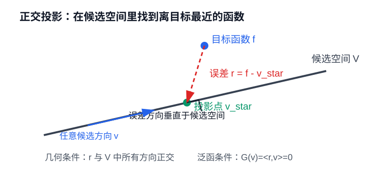

# 普通工科生也能看懂的泛函分析：把函数看成空间里的点

## 一、先把泛函说清楚

### **什么是泛函**

先把话说白：泛函就是“以函数为输入的函数”。

普通函数吃进去一个数，吐出来一个数。比如 f(x)=x^2，输入 3，输出 9。

泛函吃进去的是一个函数，吐出来的通常是一个数。也就是说，它不是评价某一个点，而是在评价整个函数。

放到机器学习里，模型 `f` 本身就是一个函数：输入一个样本 `x_i`，它会输出预测结果 `f(x_i)`，比如类别、价格或者概率。这个输出仍然只是普通函数在某个点上的取值。

但训练时我们还会问另一个问题：整个模型 `f` 在一批训练数据上表现得好不好？这个问题不是评价某一个输入点，而是在评价整条模型函数。于是损失就可以看成一个泛函 `L`：它把完整的模型函数 `f` 当作输入，最后输出一个数。比如经验损失可以写成：

$$
L(f)=\frac{1}{n}\sum_{i=1}^{n}\ell(f(x_i),y_i)
$$

这里 L 的输入不是某个 x，而是整个模型 f。所以 L 就是一个泛函。

正则项也是同一个逻辑。损失是在问“模型预测得准不准”，正则项则是在问“这个模型函数是不是太复杂、太大、太不平滑”。它同样不是看某一个输入 `x` 上的输出，而是把整个函数 `f` 拿来评价，最后给出一个复杂度分数。可以写成：

$$
R(f)=\Omega(f)
$$

这里的 `R` 输入的是完整的模型函数 `f`，输出的是一个数，所以它也是泛函。训练时写的“最小化 损失 + 正则项”，大白话就是：在一堆函数里，找一个既预测准，又不要太复杂的函数。

再看几个更像数学里的例子。
如果一个规则吃进去的是整条函数，吐出来的是一个数，那么它就是泛函。可以把它想成：

$$
F:\mathcal{F}\to\mathbb{R}
f\mapsto F(f)
$$

泛函的本质是：把整条函数当作输入，再把它评价成一个数字。后面讲函数空间时，我们还会换一种说法：一条函数可以看成函数空间里的一个点，而泛函就是在评价这个点。

两个函数 f 和 g 差多少，可以用一个积分型泛函来算：

$$
D(f,g)=\int (f(x)-g(x))^2\,dx
$$

它吃进去两个函数，输出一个数。这个数越小，说明两个函数越像。

概率论里的例子要稍微换一个视角看。
大学课本里，我们通常是先给定一个函数 p(x)，再去算它能不能归一化、期望是多少。比如：

$$
\int p(x)\,dx=1
$$

或者：

$$
\mathbb{E}_p[X]=\int x p(x)\,dx
$$

这个时候，我们做的是“给定 p，算出一个数”。这当然没问题，也是最常见的计算方式。
但泛函视角会把这件事反过来看：这个积分公式本身，是一个吃进整条函数 p，再吐出一个数的机器。
比如可以定义：

$$
A(p)=\int p(x)\,dx
$$

它输入的是密度函数 p，输出的是总质量。我们平时说“检查 p 有没有归一化”，其实就是在算这个泛函 A(p) 的值是不是 1。
期望也类似。关键不是这个积分长得像不像公式，而是当 p 换成另一条密度函数时，结果也会跟着变。也就是说，M 是一个规则：它把每一条密度函数 p 映射成一个平均值。可以写成：

$$
M(p)=\int x p(x)\,dx
$$

它输入整条密度函数 p，输出这个分布下的平均读数。注意，这里不是问某一个 x 的输出，而是问整个 p 这条函数最终给出什么整体指标。
所以很多我们熟悉的公式，其实都可以换一种读法：以前我们盯着积分号，说“给定函数，算出结果”；泛函视角会先问“这个规则的输入是谁”。归一化检查的输入是密度函数 p，期望的输入也是密度函数 p。它们都不是在问某一个点上的函数值，而是在评价整条函数给出的整体性质。

总结一下，泛函不是某一种特定公式，而是一种“输入和输出的关系”：输入是一整条函数，输出是一个数。积分之所以经常出现，是因为它很适合把整条函数压缩成一个整体数值，比如总量、平均值、能量或者差异。但积分只是常见形式，不是判断标准。判断一个规则是不是泛函，关键还是看它是不是把函数当输入、把数字当输出。

### **泛函分析研究什么**

有了“泛函”这个概念以后，很自然会继续问：如果泛函要评价一整条函数，那么这些函数本身应该怎样组织起来？哪些函数可以放在同一个集合里比较？比较时用什么标准？一列函数越来越接近时，它的极限还在不在原来的集合里？

这就进入了泛函分析。泛函分析不是只研究“泛函”这个词，也不是只研究怎么求最优函数。更准确地说，它研究的是带有结构的函数空间，以及这些空间上的映射。

如果说数学分析更常关心单个函数的局部性质，比如连续性、可导性、积分和极限，那么泛函分析更关心函数组成的空间结构。它会问：

- 应该把哪些函数放进同一个空间？
- 这个空间里怎样定义距离、范数和内积？
- 函数序列按什么标准收敛？极限是否仍然留在空间里？
- 一个把函数变成函数的规则，也就是算子，会不会连续、稳定、可逆？
- 一个把函数变成数字的规则，也就是泛函，会不会连续、有没有可能取得最优值？

所以泛函分析的重点不是把函数画得更细，而是把函数当成空间里的对象来研究。它关心的范围大概可以分成几块：函数空间、范数和内积、收敛和完备性、线性算子，以及把函数映射成数字的泛函。
后面谈 Banach 空间、Hilbert 空间、Lebesgue 空间，其实都是在讲不同的函数空间和度量方式；谈 Banach 不动点，是在讲某些算子为什么会让迭代稳定；谈函数逼近，是在讲能不能用一个候选函数族去接近目标函数。

### **从评价函数到寻找函数**

到这里可以看到一条很自然的线：泛函负责评价函数，但很多问题真正关心的不是“给定一个函数，算出它的泛函值”，而是反过来问：在一堆候选函数里，哪一个函数让这个泛函最小？

变分法就是这个方向上的传统语言。它通常从一个泛函出发，比如能量、长度、作用量或者整体误差，然后问：什么样的函数能让这个泛函取到最优值？经典的最短路径、最小能量曲线、物理里的最小作用量，都有这种味道。

机器学习也可以看成这个问题的现代版本。模型是一类候选函数，损失函数是评价模型好坏的泛函，训练就是在模型函数族里找一个让损失尽可能小的函数。

这里说“候选函数族由参数化模型给出”，意思是：我们不是直接在所有可能函数里搜索，而是先选定一个模型形式，再通过调参数得到不同函数。比如线性模型固定了“线性”这种形状，参数变了，就得到不同的直线、平面或超平面；神经网络固定了网络结构，参数变了，就得到不同的非线性函数。所有这些由同一种模型形式生成的函数，合在一起就是候选函数族。

这里说“目标泛函来自数据、经验风险和正则化”，意思是：机器学习通常不知道真实规律本身，只能用训练数据来构造一个评价规则。经验风险就是把模型在训练样本上的错误汇总成一个数；正则化则再加一个复杂度惩罚，防止函数太大、太抖或者太复杂。于是训练目标常常长这样：

$$
\text{训练目标}=\text{经验风险}+\text{正则项}
$$

这整个训练目标就是一个泛函：它输入一个模型函数，输出一个分数。训练要做的，就是在候选函数族里找一个分数尽可能低的函数。

所以变分法和机器学习虽然方法不同、场景不同，但它们共享一个核心画面：不是只计算某个函数的值，而是在函数之间比较，寻找最好的那个函数。本文先讲泛函分析这块地基：函数应该放进什么空间，函数之间怎么比较，函数序列怎样收敛，算子为什么可能稳定，以及模型族为什么能逼近目标函数。至于“怎样具体求出最优函数”，后面写变分法和优化时再展开。

## 二、把函数当成空间里的点

### **把函数放进空间里**

泛函分析的第一步，是把“空间”这个词放大。

以前我们说空间，常常想到二维平面、三维空间，或者 n 维向量空间。一个点就是一串坐标：

$$
(x_1,x_2,\ldots,x_n)
$$

但这个想法可以继续往外推。只要一堆对象能相加、能乘一个数，我们就可以把它们看成某种线性空间。

向量当然可以放进空间。多项式可以。函数也可以。

比如两个函数可以相加：

$$
(f+g)(x)=f(x)+g(x)
$$

函数也可以乘一个数：

$$
(af)(x)=a f(x)
$$

既然函数也能做这些操作，那我们就可以把“所有函数”看成一个空间。这个空间里的每一个点，不再是一个普通坐标点，而是一整个函数。

这一步很重要：我们不是先盯着某个函数公式看，而是先把函数放进一个更大的空间里看。机器学习里的模型族，也可以理解成某个函数空间里的一个子集：它不是所有可能的函数，而是当前模型结构能够表示出来的那一部分函数。

这里可以先把“模型函数空间”说清楚。机器学习里的模型不是单独一个函数，而通常是一整个函数族。比如线性回归模型只允许我们选择这种形式的函数：

$$
f(x)=w^\top x+b
$$

当参数 `w` 和 `b` 变化时，我们会得到很多不同的线性函数。这些函数合在一起，就是线性回归的模型函数族。训练时，我们不是在所有可能函数里随便找，而是在这个线性函数族里找一个让损失最小、也就是最接近数据规律的函数。

CNN 也是一样。一个 CNN 架构固定以后，比如卷积层怎么接、通道数是多少、激活函数是什么，这些结构就限定了它能表示的函数类型。参数不同，对应不同的图像分类函数：

```text
图片 -> 类别概率
```

所有这些由同一个 CNN 架构、不同参数产生的函数，组成这个 CNN 的模型函数族。RNN 或 Transformer 也类似：架构固定以后，它们能表示的是一类“序列到序列”或“序列到概率分布”的函数。

所以从泛函分析视角看，训练模型可以理解成：真实规律可能在一个很大的函数空间里，但我们只能在当前模型架构允许的函数族里搜索。这个函数族越丰富，越可能逼近复杂目标；但它也不能无限大，否则容易过拟合、难优化、难分析。后面谈范数、内积、投影和函数逼近时，说的就是怎样在这个函数族里比较函数、限制函数，并寻找最接近目标的那一个。

### **函数是空间里的点**

空间广义化以后，第二步就是换视角：一个函数，就是这个空间里的一个点。

听起来怪，其实很自然。二维点需要两个坐标，三维点需要三个坐标，n 维点需要 n 个坐标。

那一个函数 f(x) 需要多少个坐标？

如果 x 只取 1,2,3 三个位置，那函数只需要三个值：

$$
(f(1),f(2),f(3))
$$

这时候它就像一个三维向量。

如果 x 取 1 到 1000 的离散位置，那它就像一个 1000 维向量。

如果 `x` 在连续区间 `[0,1]` 上取值，那情况就变了。`[0,1]` 里有无穷多个点。你想完整描述 `f`，就要知道每个 `x` 上的 `f(x)`。

所以，一个连续函数可以粗略理解成“有无穷多个坐标”的点。这就是为什么函数通常需要无穷维空间来定义。

如果把函数看成空间里的一个点，那么这个空间里的“基向量”又是什么？
先回到普通向量。一个 n 维向量可以写成：

$$
v=c_1e_1+c_2e_2+\cdots+c_ne_n
$$

这里的意思很简单：一个点可以拆成若干个基本方向上的分量，每个系数说明它沿着对应方向走了多少。
函数也可以用类似的办法来想。以 Taylor 展开为例，如果 `f` 在点 `x_0` 附近足够规整，并且 Taylor 级数真的收敛到 `f`，那么可以写成：

$$
f(x)=\sum_{k=0}^{\infty}\frac{f^{(k)}(x_0)}{k!}(x-x_0)^k
$$

把它和向量公式对比一下，就很像了。
其中

$$
n_k(x)=(x-x_0)^k
$$

是一个关于 x 的函数。它扮演的角色，就像普通向量里的第 k 个基向量。
而

$$
c_k=\frac{f^{(k)}(x_0)}{k!}
$$

是一个数。它扮演的角色，就像第 k 个坐标。
所以 Taylor 展开其实是在说：函数 `f` 可以沿着一组基本函数 `1`、`(x-x_0)`、`(x-x_0)^2` 等展开，每个方向前面都有一个坐标。
为什么这些 `n_k(x)` 可以叫“基函数”？直白地说，因为它们提供了一组基本方向。我们用这些方向的线性组合去拼出函数：

$$
f(x)=c_0n_0(x)+c_1n_1(x)+c_2n_2(x)+\cdots
$$

在多项式空间里，这件事最严格：任意一个次数不超过 n 的多项式，都能唯一写成

$$
p(x)=a_0+a_1x+a_2x^2+\cdots+a_nx^n
$$

这里的 `1, x, x^2, ..., x^n` 就是一组基函数。所谓“基”，核心有两点：第一，空间里的每个对象都能用这些基本方向拼出来；第二，拼法是唯一的，也就是每个对象对应一组确定的系数。
但要注意，Taylor 展开不是说所有函数都能这样展开。它需要函数在 `x_0` 附近足够好，也需要这个无穷和真的收敛到原来的函数。这里真正要借用的是它的图像：函数可以像向量一样，用“基函数 + 坐标”的方式来表示。
同时，我们也能看出来：要表示一个函数，常常需要可数多个甚至无穷多个基函数。因此，函数空间通常是无穷维的。
只不过现代泛函分析不一定总是强调“具体是哪一组基”。很多时候，我们更关心这个空间有没有距离、有没有内积、是不是完整、函数序列会不会收敛。基很重要，但不是每次都要把基写出来。

### **从泛函分析角度定义函数**

从最朴素的角度看，定义一个函数要说清楚三件事：输入从哪里来，输出到哪里去，输入怎么变成输出。
比如 `f(x)=x^2`，只写公式还不算完整。你还要知道 `x` 是实数、整数，还是别的东西。输入范围不一样，函数性质也会变。
机器学习里的模型也是这样：

$$
f:\text{图片}\to\text{类别概率}
$$

$$
f:\text{token 序列}\to\text{下一个 token 的概率分布}
$$

这仍然是普通意义上的函数定义：它讲的是映射关系。
但泛函分析看函数，会再往前问一层：这个函数住在哪个空间里？
也就是说，它不只是问“f 把 x 变成什么”，还会问：f 属于哪一类函数？连续函数？平方可积函数？有界函数？可微函数？还是某个模型族里的函数？
比如同样写 `f(x)`，它可能属于不同空间。

#### 连续函数空间

如果写成：

$$
f\in C[0,1]
$$

意思是 `f` 是 `[0,1]` 上的连续函数。这里强调的是：函数在每个点附近都不能突然断开。

#### 平方可积函数空间

如果写成：

$$
f\in L^2[0,1]
$$

意思是 `f` 的平方积分有限，也就是满足：

$$
\int_0^1 \lvert f(x)\rvert^2\,dx<\infty
$$

这里强调的不是每个点都规整，而是整条函数的“平方总量”有限。

这时我们关心的就不是某一个点上的 `f(x)`，而是整条函数在区间上的整体表现。
所以从泛函分析角度看，定义一个函数，通常不只是给出公式，而是要说明它作为“空间里的一个点”有什么性质。

- 它有没有长度？

但是对于向量空间，我们常常不直接定义两点之间的距离，而是先定义“一个向量有多长”。这个长度就叫范数。

- 它和别的函数有没有距离？比如函数 `f` 和函数 `g` 之间的距离能不能定义。
- 它能不能和别的函数做内积？也就是能不能谈相似、正交、投影。
- 一列函数 `f_1, f_2, f_3, ...` 会不会收敛到它？如果收敛，按什么尺子收敛？
- 它是不是连续、可积、可微、有界？

这些性质决定它能不能放进某个函数空间。

这就是泛函分析的视角：函数不是孤零零的一条公式，而是函数空间里的一个对象。我们研究它，不只是研究它在某个 `x` 上输出多少，还研究它的整体大小、形状、稳定性、收敛性，以及它和其他函数之间的关系。
更完整地说，泛函分析会同时看三类东西。

- 空间里的点，也就是函数本身。它属于哪个空间？有没有长度？能不能收敛？
- 空间到空间的映射，也就是算子。比如微分、积分、神经网络里的某些变换，都可以看成把一个函数变成另一个函数的操作。
- 空间到数字的映射，也就是泛函。比如损失、风险、正则项，都是在评价整个函数。

机器学习里也一样。一个模型 `f` 不只是“输入图片输出概率”的程序。理论上我们还会问：这个 `f` 属于哪个模型空间？它的复杂度多大？它和真实函数距离多远？训练过程中得到的一串函数会不会收敛？损失泛函在这个空间上有没有好性质？这些问题，才是泛函分析真正关心的地方。

## 三、Banach 空间：距离、范数和完整性

把函数看成空间里的点以后，下一步就要问：两个点离得远不远？一个点本身有多大？

### **距离和度量**

先说距离。这里的 d 更准确地说叫度量，也叫距离函数。它的形式是：

$$
d:X\times X\to \mathbb{R}
$$

它输入空间 `X` 里的两个对象，输出一个数，表示这两个对象离得多远。
如果 `X` 里的对象是普通点，那么 `d` 就是在量两个点离得多远。如果 `X` 里的对象是函数，那么 `d(f,g)` 就是在量两条函数离得多远。

$$
d(f,g)=\sqrt{\int_0^1 \lvert f(x)-g(x)\rvert^2\,dx}
$$

这个公式的意思很朴素：在区间 `[0,1]` 上，把两条函数每个位置的差距 `f(x)-g(x)` 看一遍，再合成一个整体距离。从泛函的视角看，`d(f,g)` 也可以算作一个二元泛函，因为它输入两条函数，输出一个数。不过在这一节里，我们更强调它的身份：它是用来定义空间距离的度量。
一个 `d` 如果想当“距离”，至少要满足三件事。

第一，不能是负数，而且只有同一个点到自己，距离才是 0：

$$
d(a,b)\ge 0, \quad d(a,b)=0 \Longleftrightarrow a=b
$$

第二，从 a 到 b 和从 b 到 a，距离一样：

$$
d(a,b)=d(b,a)
$$

第三，绕路不会更短：

$$
d(a,c)\le d(a,b)+d(b,c)
$$

满足这些条件的 d，就叫距离函数，也叫度量。带着这种距离的集合，就叫度量空间。
比如在平面上，我们可以用这种距离：

$$
d(a,b)=|a_x-b_x|+|a_y-b_y|
$$

它不是我们最熟悉的欧几里得距离，但它也满足距离的三条规则，所以也是一个合法的距离。

### **范数和赋范空间**

但是对于向量空间，我们常常不直接定义两点之间的距离，而是先定义“一个向量有多长”。这个长度就叫范数。
范数要满足四个性质。
第一，正定性。长度不能是负数，而且只有零向量长度是 0：

$$
\|v\|\ge 0,\quad \|v\|=0\Longleftrightarrow v=0
$$

第二，对称性。反方向长度一样：

$$
\|-v\|=\|v\|
$$

第三，三角不等式。两个向量相加以后，长度不会超过两个长度相加：

$$
\|u+v\|\le \|u\|+\|v\|
$$

第四，绝对一次齐次性。向量放大 m 倍，长度也放大 |m| 倍：

$$
\|mv\|=|m|\,\|v\|
$$

严格来说，第二条可以由第四条取 m=-1 推出来。这里单独写，是为了让“长度不看方向”更直观。

有了范数，就自然有了距离：

$$
d(u,v)=\|u-v\|
$$

所以关系是这样的：范数比距离多了一层结构。距离只关心两个点隔多远；范数还关心空间里的加法、数乘和长度怎么配合。
一个线性空间，如果上面定义了范数，就叫赋范空间。大白话说，就是这个空间里的对象既能像向量一样相加、缩放，又能被量出长度。
先看有限维向量里的例子。假设有一个向量：

$$
a=(a_1,a_2,\ldots,a_n)
$$

这里的 `a_i` 表示向量 `a` 的第 `i` 个坐标。常见的 `L_p` 范数可以写成：

$$
\|a\|_p=\left(\sum_{i=1}^{n}\lvert a_i\rvert^p\right)^{1/p}
$$

当 `p=2` 时，就是我们熟悉的欧几里得长度：

$$
\|a\|_2=\left(\sum_{i=1}^{n}\lvert a_i\rvert^2\right)^{1/2}
$$

这个例子要说明的是：同一个向量，可以用不同的尺子量长度。函数也可以这样量。
在函数空间里，选不同范数，就等于选不同的比较方式：有的范数关心整体大小，有的范数关心最坏位置，有的范数更偏向稀疏或鲁棒。这里先记住这件事就够了：范数不是单纯的记号，它决定了我们怎样说“两个函数接近”。后面谈 Lebesgue 空间时，会专门讲 `L^1`、`L^2` 和无穷范数分别对应什么机器学习偏好。

### **Banach 空间：完整的赋范空间**

有了赋范空间，还不够。我们还希望这个空间别“漏”。
什么叫漏？
比如有一列函数 `f_1, f_2, f_3, ...`，它们彼此越来越接近。按直觉，它们应该慢慢靠近某个最终的函数 `f`。可有些空间会出现尴尬情况：这列函数看起来快收敛了，但极限函数不在这个空间里。
这就像你在一个房间里走路，越走越接近某个地方，结果那个地方在墙外面。空间不完整，理论就容易出问题。
Banach 空间解决的就是这件事。
一个赋范空间，如果所有 Cauchy 序列都能在空间内部收敛，那它就是 Banach 空间。
这里要注意，Banach 空间本身不规定只能用哪一种范数。它的定义是：先选定一种范数，再看这个范数下空间是不是完整。
常见例子是 L^p 范数。后面谈 Lebesgue 空间时会专门展开。这里先记住一句话：Banach 空间看的是“给定某个范数以后，这个空间是不是完整”。

这里可以先埋一个伏笔：后面谈逼近定理时，Banach 空间会再次出现。因为“逼近”说到底是在说一列候选函数越来越接近目标函数；而 Banach 空间的完整性保证的是，如果这些函数已经在某种范数下越来越靠近，那么它们的极限不会跑到空间外面去。也就是说，Banach 空间给逼近问题提供了一个可靠的落点。

这里的 Cauchy 序列可以粗略理解成：序列后面的项彼此越来越近，近到你想要多近都可以。写成公式就是：

$$
\forall \varepsilon>0,\ \exists N,\ \forall m,n>N,\quad \|f_m-f_n\|<\varepsilon
$$

如果这样的序列最后一定收敛到空间里的某个对象，这个空间就是完整的。
所以关系很清楚：Banach 空间不是另一种和赋范空间并列的东西，而是“完整的赋范空间”。先要有范数，再谈 Banach。
在机器学习里，这个思想很重要。我们经常说模型训练会越来越好，迭代会越来越稳定，函数序列会靠近某个目标。如果空间本身不完整，很多“极限存在”的话就站不住。

## 四、Hilbert 空间：内积、正交和投影

### **内积空间：先把角度说清楚**

但是，只有范数还不够。范数和内积看起来都在描述“几何”，但它们回答的问题不一样。

范数处理的是一个对象。放到函数空间里，就是输入一个函数对象，输出一个非负数。它回答的是：这个函数本身有多大？

$$
f\mapsto \|f\|
$$

有了范数以后，我们可以定义距离，比如先看两个函数的差，再量这个差函数有多大。所以范数主要给出的是长度和距离。

内积处理的是两个对象。放到函数空间里，就是输入两个函数对象，输出一个数。它回答的是：这两个函数在方向上有什么关系？

$$
(f,g)\mapsto \langle f,g\rangle
$$

这个数不只是大小信息，还包含方向信息。两个对象是否同向、是否相互抵消、是否正交，都要靠内积来表达。
所以关系要分清楚：内积可以推出范数，因为可以让一个对象和自己做内积，再开平方得到长度；但范数一般不能反推出内积。很多范数只能告诉我们“多长”和“多远”，却不能自然告诉我们“夹角是多少”“是否正交”“投影到哪里”。

放到函数空间里，“方向”可以理解成一种函数形状，或者一种变化模式。两个函数像不像，不只是看它们的数值是否接近，还要看它们的整体形状是不是朝着类似的方向变化。比如两个信号可能幅度不同，但起伏节奏很像；两个特征函数可能取值不同，但都在表达同一种变化趋势。

“正交”在函数空间里也不只是几何图里的垂直。它表示两种函数成分彼此不重叠、互不解释。一个函数如果和另一个函数正交，就可以理解成：前者里面没有后者那个方向上的成分。傅里叶分析里用正弦、余弦分解信号，就是把复杂函数拆成很多互相正交的基本方向。

“投影”则是在问：如果我只能用某个较简单的函数空间来表达目标函数，那么这个空间里哪一个函数最接近它？这正是最小二乘、线性回归、核方法和很多函数逼近问题背后的几何图像。模型训练时，我们常常不是直接找到真实函数，而是在模型空间里找一个投影意义下最接近真实规律的函数。

这就要引入内积。
在欧几里得空间里，如果两个向量分别是：

$$
a=(a_1,a_2,\ldots,a_n)
$$

$$
b=(b_1,b_2,\ldots,b_n)
$$

那么它们的内积是：

$$
\langle a,b\rangle=\sum_{i=1}^{n}a_i b_i
$$

它输入两个向量，输出一个数。这个数不只是长度信息，还包含方向信息。
更一般地，在一个实向量空间 M 里，内积可以看成一个映射：

$$
\langle \cdot,\cdot\rangle:M\times M\to \mathbb{R}
$$

它要满足几个性质。
第一，线性性：

$$
\langle m a+n b,c\rangle=m\langle a,c\rangle+n\langle b,c\rangle
$$

第二，正定性：

$$
\langle a,a\rangle\ge 0,\quad \langle a,a\rangle=0\Longleftrightarrow a=0
$$

第三，对称性：

$$
\langle a,b\rangle=\langle b,a\rangle
$$

如果是在复向量空间里，第三条要改成共轭对称：

$$
\langle a,b\rangle=\overline{\langle b,a\rangle}
$$

有了内积，就能定义范数：

$$
\|a\|=\sqrt{\langle a,a\rangle}
$$

这个公式的意思是：先用内积把 `a` 和它自己配对，得到 `a` 在自身方向上的“平方长度”；再开平方，就得到 `a` 的长度，也就是范数。前面的正定性保证这个数不会是负的，所以它真的可以当作长度来用。

所以说“范数来自内积”，不是说范数和内积是同一个东西，而是说：只要空间里有内积，我们就可以自动得到一套与这个内积匹配的长度和距离。距离也可以进一步写成：

$$
d(a,b)=\|a-b\|=\sqrt{\langle a-b,a-b\rangle}
$$

但反过来不一定成立。有些空间只有范数，能量长度和距离可以定义，却没有合适的内积来定义角度、正交和投影。

内积还能定义夹角。对于非零向量 `a`、`b`，可以写成：

$$
\cos\theta=\frac{\langle a,b\rangle}{\|a\|\,\|b\|}
$$

所以内积比范数多给了一层几何：它让我们可以谈方向、正交、相似度和投影。

具体说，方向相似可以通过夹角或者归一化后的内积来衡量。两个对象的内积越大，通常表示它们在同一个方向上的成分越多；内积越接近 0，说明它们越不相关。
正交可以直接用内积定义：如果两个非零对象的内积等于 0，就说它们正交。写成公式就是：

$$
\langle a,b\rangle=0
$$

投影也是由内积定义出来的。把一个对象 `a` 投影到另一个方向 `b` 上，本质上是在问：`a` 里面有多少成分沿着 `b` 的方向。内积给出的就是这个“沿着某个方向的分量”。如果 `b` 不是零向量，投影可以写成：

$$
P_b(a)=\frac{\langle a,b\rangle}{\langle b,b\rangle}b
$$

这个公式里的分数部分，就是 `a` 在 `b` 这个方向上的系数。它告诉我们要拿多少个 `b`，才能得到 `a` 沿着 `b` 方向的那一部分。

在更大的函数空间里，投影会变成：从一个子空间里找出最接近目标函数的那个函数。数学上，如果“最佳近似函数”是 `a` 在子空间 `V` 上的投影，那么“原对象减去最佳近似函数”得到的误差，要和子空间 `V` 里的每个方向都正交：

$$
\langle a-v_{\mathrm{opt}},v\rangle=0,\quad \forall v\in V
$$

函数空间里也可以定义内积。比如常见的 L^2 内积是：

$$
\langle f,g\rangle=\int f(x)g(x)\,dx
$$

这个公式可以先按直觉理解：把两个函数在同一个位置上的取值相乘，然后把所有位置的乘积加总起来。
如果两个函数经常同向变化，乘出来的值会倾向于累加得更大；如果它们经常相互抵消，内积就会变小，甚至可能是 0。这就是为什么内积能表达“相似”和“正交”。

更一般地，如果讨论的是复值函数，内积里要把其中一个函数取共轭，通常写成：

$$
\langle f,g\rangle=\int_X f(x)\overline{g(x)}\,d\mu(x)
$$

这时内积推出的范数就是：

$$
\|f\|_2=\sqrt{\langle f,f\rangle}=\left(\int_X \lvert f(x)\rvert^2\,d\mu(x)\right)^{1/2}
$$

这里最关键的是把 `g` 换成 `f`。也就是让函数和它自己做内积。一个函数和自己相乘，就得到平方；再把平方积分起来，就得到平方意义下的整体大小。最后开平方，就是 `L^2` 范数。
所以 `L^2` 范数不是和内积并排放着的另一个孤立定义。在 Hilbert 空间里，它正是由内积产生的长度。

所以关系可以这样看：内积空间一定是赋范空间，因为内积能推出范数；但赋范空间不一定能升级成内积空间。原因是，有些范数只告诉我们“长度”和“距离”，却没有办法来自某个内积，因此也就不能自然地定义角度、正交和投影。
这一步很关键。只有范数时，我们能说两个函数离得远不远、误差大不大；有了内积以后，我们还能进一步说误差主要沿着哪些方向，哪些成分彼此正交，目标函数在模型空间里的投影是什么。
所以内积带来的不是另一种“距离说法”，而是一整套几何语言：它让“最接近真实规律的函数”不只是一个优化目标，还可以被理解成投影问题；让“残差”不只是剩下的误差，还可以被理解成和模型空间正交的部分。最小二乘、核方法和 Hilbert 空间里的最佳逼近，靠的正是这层结构。

### **Hilbert 空间：完整的内积空间**

先把关系说清楚：Banach 空间强调“有范数，而且完整”；Hilbert 空间强调“有内积，而且由内积得到的范数是完整的”。

所以 Hilbert 空间可以理解成：一个既能量长度、又能谈角度和正交、并且极限不会跑出去的空间。它像是欧几里得空间的函数版本。只不过欧几里得空间里的点是有限维向量，Hilbert 空间里的点可以是一整条函数。

这就是它比一般 Banach 空间多出来的东西。Banach 空间能告诉我们两个函数离多远；Hilbert 空间还可以告诉我们：误差朝哪个方向，哪些方向彼此正交，一个函数投影到某个子空间后是什么样子。

为什么这对机器学习有用？因为训练模型常常可以看成“在模型函数族里找一个最接近真实规律的函数”。
假设真实规律是一个函数 `f`，模型能表达的函数只在某个函数集合 `V` 里。训练模型就像是在 `V` 里面找一个函数 `v`，让它离 `f` 最近：

$$
v_{\mathrm{opt}}=\arg\min_{v\in V}\|f-v\|
$$

如果只有范数，我们只能说哪个 `v` 离 `f` 最近。
但在 Hilbert 空间里，这个“最近”还能被解释成投影：从 `f` 往模型集合 `V` 上投下去，落到的那个点就是最佳近似。

为什么能这么说？因为 Hilbert 空间里的距离来自内积。函数差 `f-v` 的长度可以写成：

$$
\|f-v\|=\sqrt{\langle f-v,f-v\rangle}
$$

这个公式把“距离”和“方向”连在了一起。于是最佳近似不只是一个最小化问题，还会满足一个几何条件：找到最佳近似以后，剩下的误差不应该再含有模型空间 `V` 里的方向。否则说明还能沿着那个方向继续改进。

数学上，如果某个函数是 `f` 在 `V` 里的最佳近似，那么“目标函数减去这个最佳近似”得到的误差，应该和 `V` 里的所有方向都正交：

$$
\langle f-v_{\mathrm{opt}},h\rangle=0,\quad \forall h\in V
$$

这句话的大白话是：模型已经把它能解释的部分都解释掉了，剩下的误差和模型能表达的方向没有重叠。

最小二乘法就是这个图像。线性回归在由特征张成的空间里找最近点；最佳解出现时，残差和每个特征方向正交，所以会得到正规方程。
核方法也是这个味道。支持向量机背后的再生核 Hilbert 空间，名字里就带着 Hilbert。它的核心想法不是简单地“把数据映射到更大空间”，而是把模型看成某个 Hilbert 空间里的函数，在那里用内积、范数、距离和间隔来做分类。

## 五、Lebesgue 空间：最常见的一类函数空间

### **它一般化的是什么**

接下来谈 Lebesgue 空间，也就是常见的 L^p 空间。
先回答一个容易误会的问题：Lebesgue 空间是不是最一般化的函数空间？
不是。
函数空间有很多种。比如连续函数空间、可微函数空间、Sobolev 空间、Hilbert 空间、Banach 空间、RKHS，都可以是函数空间。Lebesgue 空间不是把所有函数空间都包住的“最大空间”。
它真正一般化的是另一件事：怎样用积分来量一整条函数的大小。
以前我们看函数，常常盯着某个点：f(x) 在这里是多少，那里是多少。但很多时候，单个点并不重要，重要的是函数在一整片区域上的整体表现。
比如误差函数 e(x) 在某个点很大，不一定说明整体很差；但如果它在很多地方都大，那就真的差。Lebesgue 空间就是用积分把这种“整体大小”说清楚。

### **测度：先说清楚哪里算重要**

Lebesgue 空间背后有一个词叫测度。先不要把它想得太抽象，可以把测度理解成：在计算整体大小时，哪些地方占多少分量。

如果函数定义在一段区间上，测度通常就是长度。某一小段区间越长，它对整体积分的贡献就越大。
如果函数定义在一片二维区域上，测度可以理解成面积。面积大的区域，对整体平均或整体误差的影响更大。
如果函数定义在一个概率空间上，测度就像概率权重。更常出现的样本、更重要的情况，在计算期望风险时占的权重更大。

这和机器学习很接近。我们常常不是问模型在某一个输入点上表现怎样，而是问它在整个数据分布上表现怎样。不同输入区域出现的概率不同，重要性就不同；测度就是在告诉积分：每一块区域应该按多大权重算进去。

所以 Lebesgue 空间比普通积分更一般的地方在于：它不只是在实数轴上积分，而是允许我们在“带权重的输入空间”上讨论函数。图像、信号、概率密度、随机变量，都可以放进这个语言里。

### **L^p 空间：用哪把尺子量函数**

当 `p` 不小于 1、并且不是无穷大时，`L^p` 范数通常写成：

$$
\|f\|_p=\left(\int_X \lvert f(x)\rvert^p\,d\mu(x)\right)^{1/p}
$$

对应的 L^p 空间就是：

$$
L^p(X,\mathcal{F},\mu)=\{f:\int_X \lvert f(x)\rvert^p\,d\mu(x)<\infty\}
$$

大白话说，`L^p` 空间就是：所有按这把 `p` 号尺子量出来大小有限的函数。
这里 `p` 的作用很重要。`p` 不同，尺子的脾气就不同。
`L^1` 看的是总量：

$$
\|f\|_1=\int_X \lvert f(x)\rvert\,d\mu(x)
$$

它像是在问：这个函数整体累计起来有多大？所以 `L^1` 常常和稀疏、总误差、概率密度的总质量联系在一起。
`L^2` 看的是能量：

$$
\|f\|_2=\left(\int_X \lvert f(x)\rvert^2\,d\mu(x)\right)^{1/2}
$$

平方会放大大误差，所以 `L^2` 对异常大的偏差更敏感。最小二乘、均方误差、能量、Hilbert 空间，都和 `L^2` 关系很深。
无穷范数看的是几乎处处的最大幅度：

$$
\|f\|_\infty=\sup_{x\in X}\lvert f(x)\rvert
$$

它像是在问：最坏情况下，函数能大到什么程度？机器学习里的对抗扰动、鲁棒控制、最大误差，经常会碰到这种想法。

### **为什么说“几乎处处”**

Lebesgue 空间还有一个很反直觉但很重要的特点：它不太在意单个点上的变化。
如果两个函数只在一个测度为 0 的集合上不同，比如只在有限个点上不同，那么在 L^p 空间里，我们通常把它们看成同一个元素。
也就是说，`L^p` 里的“函数”，严格说不是某一条具体函数曲线，而是一类几乎处处相等的函数。
这听起来怪，但很合理。因为 `L^p` 是靠积分来量大小的。如果你只改一个点，积分通常感觉不到这个变化。既然这把尺子量不出来差异，那在这个空间里就把它们当成一样。
这也是 Lebesgue 空间和很多初等函数空间不一样的地方。连续函数空间关心每个点都连续，点点都不能乱；`L^p` 更关心整体可积，允许函数在少数地方不规整。

### **它和 Banach、Hilbert 的关系**

关系可以这样记：当 `p` 不小于 1 时，常见的 `L^p` 空间都是 Banach 空间。
也就是说，它们不只是有范数，而且在这个范数下是完整的。你在 `L^p` 里拿一列越来越靠近的函数，只要它按 `L^p` 范数形成 Cauchy 序列，最后就会收敛到 `L^p` 里面的某个函数。
其中 `L^2` 更特殊。为什么偏偏是 `L^2`？因为 `L^2` 的范数看的是平方积分，而内积把一个函数和它自己配对时，正好也会得到平方积分。也就是说，下面这个内积和 `L^2` 范数是配套的：

$$
\langle f,g\rangle=\int_X f(x)g(x)\,d\mu(x)
$$

如果把 `g` 换成 `f`，就得到：

$$
\langle f,f\rangle=\int_X f(x)^2\,d\mu(x)
$$

而 `L^2` 范数正是：

$$
\|f\|_2=\sqrt{\langle f,f\rangle}
$$

所以 `L^2` 的“2”不是偶然的。它刚好让“平方积分的长度”和“自己与自己的内积”对上了。对上以后，`L^2` 空间里就不只能谈距离，还能谈角度、正交和投影。
这不是说“看到 `L^2` 范数就自动推出内积”，而是说：在通常的 `L^2` 空间里，我们有一个标准内积，而这个标准内积诱导出来的范数正好就是 `L^2` 范数。两者是配套的，不是逻辑上完全等价的。

如果是复函数，通常写成：

$$
\langle f,g\rangle=\int_X f(x)\overline{g(x)}\,d\mu(x)
$$

所以 `L^2` 不只是 Banach 空间，还是 Hilbert 空间。
而 `L^1`、一般的 `L^p`、以及无穷范数对应的空间，在 `p` 不等于 2 的时候，通常不像 `L^2` 那样天然带有好用的内积几何。直白地说，它们能谈距离和收敛，但不一定能自然地谈角度、正交和投影。

### **和损失函数、正则化的关系**

Lebesgue 空间的意义不是“换一种高级记号写函数”。它是在告诉我们：你到底用什么尺子来量函数。

这里要把范数和泛函的关系说清楚。范数本身就可以看成一种特殊的泛函：它输入一个函数，输出一个非负数，用来表示这个函数有多大。

$$
N(f)=\|f\|
$$

所以范数不是泛函之外的另一套东西。更准确地说，范数是一类很重要的泛函；而损失函数、风险函数、正则项这些更复杂的泛函，经常会用范数来构造。比如正则项不是只写一个范数，而是把范数乘上权重、平方，或者和损失项加在一起。

这件事一放到机器学习里，就会直接变成两个问题。
第一个问题：损失函数怎么选？
模型预测错了，会产生一个误差函数 `e`。你怎么把这整条误差函数变成一个数？这首先是一个泛函问题：它输入一整条误差函数，输出一个损失数值。
但这个泛函怎么设计，常常取决于你选择哪种范数，也就是你想用哪把尺子度量误差。
如果用 `L^2` 思路，就会得到平方损失的味道：

$$
\int \lvert e(x)\rvert^2\,d\mu(x)
$$

平方会放大大误差。所以 `L^2` 更像是在说：大错要重罚，小错可以相对轻一点。均方误差、最小二乘、很多回归问题，都在用这个想法。
如果用 `L^1` 思路，就会得到绝对值损失的味道：

$$
\int \lvert e(x)\rvert\,d\mu(x)
$$

`L^1` 不会像平方那样猛烈放大离群点，所以它往往更鲁棒。数据里有异常值时，`L^1` 损失常常比 `L^2` 损失更稳。
如果用无穷范数的思路，就是关心最大误差：

$$
\sup_{x\in X}\lvert e(x)\rvert
$$

这时你不是问平均错多少，而是问最坏能错到什么程度。鲁棒优化、对抗样本、防守最坏情况时，经常会有这种味道。
第二个问题：正则化怎么选？
损失函数是在量“预测错多少”，正则化是在量“模型复杂不复杂”。如果模型是一个函数 `f`，那么正则项也是泛函：它输入整个模型函数 `f`，输出一个复杂度分数。
很多常见正则项，正是用范数构造出来的泛函。也就是说，泛函是它的类型，范数是它常用的构造方式。
比如 `L^2` 正则化常写成：

$$
\lambda\|f\|_2^2
$$

它的意思是：不要让函数整体能量太大。在线性模型里，这就对应 Ridge 的味道，会让参数整体变小、模型更平滑。
`L^1` 正则化常写成：

$$
\lambda\|f\|_1
$$

它的味道是：鼓励很多地方变成 0。在线性模型里，这就对应 Lasso 的稀疏性：不是所有特征都要用，能不用的就压掉。
无穷范数正则化则更像是在限制最大幅度：

$$
\lambda\|f\|_\infty
$$

它关心的是模型在最坏位置不要太夸张。这个思路在鲁棒控制、对抗扰动约束里很常见。
所以不同范数不是数学家的记号偏好，而是在表达不同的建模偏好。
`L^2` 偏向平滑、能量小、惩罚大误差。
`L^1` 偏向稀疏、鲁棒、少用东西。
无穷范数偏向控制最坏情况。
因此，选择损失函数和选择正则项，本质上都是在选择怎样构造评价函数的泛函。很多时候，这个选择会落到范数上：尺子不同，模型最后学出来的函数就会不一样。
所以 Lebesgue 空间不是最一般的函数空间，但它是机器学习理论里非常常见的一类函数空间。因为机器学习经常要问：误差函数整体有多大？模型函数复杂不复杂？概率密度整体是否合法？两个函数按某种积分意义差多少？这些问题一旦出现，`L^p` 空间就会自然冒出来。

## 六、算子：把函数变成函数的规则

前面说过，泛函是把函数变成数字的规则。现在还要补上另一个很重要的对象：算子。

算子可以先理解成“以函数为输入、以函数为输出的规则”。如果泛函是在评价一整条函数，那么算子就是在改造一整条函数。可以写成：

$$
T:\mathcal{F}\to\mathcal{G}
$$

这里的意思是：输入一个函数 `f`，经过规则 `T` 以后，输出另一个函数 `T(f)`。

### **算子和泛函有什么区别**

区别主要看输出。

泛函的输出是一个数：

$$
L:\mathcal{F}\to\mathbb{R}
$$

比如损失 `L(f)`、正则项 `R(f)`，都是把完整函数 `f` 评价成一个数字。

算子的输出还是函数：

$$
T:\mathcal{F}\to\mathcal{G}
$$

比如微分算子把一个函数变成它的导数：

$$
D(f)=f'
$$

积分算子可以把一个函数变成另一个函数：

$$
(Tf)(x)=\int K(x,t)f(t)\,dt
$$

这里的 `K(x,t)` 可以理解成一种权重规则。它告诉我们，在位置 `x` 上，输出函数应该怎样综合输入函数在各个位置 `t` 上的值。

所以，泛函像是在给函数打分，算子像是在把函数加工成另一条函数。

### **为什么算子重要**

泛函分析不只关心函数本身，也关心函数之间的变换。很多数学和机器学习问题，本质上都可以写成“不断对函数做某个操作”。

先拿最简单的微分算子做例子。它的规则很直接：输入一条函数，输出这条函数的导数。

$$
D(f)=f'
$$

如果输入的是：

$$
f(x)=x^2
$$

那么输出就是：

$$
D(f)(x)=2x
$$

注意这里发生的不是“输入一个数，输出一个数”，而是“输入一整条函数，输出另一整条函数”。这就是算子的核心味道：它研究的是函数到函数的变换。

机器学习训练也可以用这种语言理解。一次参数更新表面上是在改参数，但从函数空间看，它是在把“当前这一步的模型函数”变成“下一步的模型函数”。如果把这个更新过程记作 `T`，就可以写成：

$$
f_{n+1}=T(f_n)
$$

这时我们关心的问题就变成：这个算子会不会让函数越来越稳定？不同初始函数经过反复更新，会不会走向同一个结果？更新过程会不会把函数带出原来的空间？

这些问题会在后面的 Banach 不动点原理里再次出现。那里真正研究的就是：当一个算子不断压缩函数之间的距离时，为什么反复迭代会收敛到一个稳定函数。

## 七、Banach 不动点原理：为什么反复迭代会稳定

### **从迭代算子到稳定函数**

上一章说过，算子是把函数变成函数的规则。Banach 不动点原理研究的，就是一类特别重要的算子：反复作用以后会走向稳定结果的算子。
有了函数空间、有了距离、也有了算子，下一步自然会问：如果我不断对一个函数做同一个更新，它会不会稳定下来？
这里的“点”不要理解成平面上的小点。在函数空间里，一个点就是一整条函数。比如一个价值函数、一个模型函数、一个概率密度，都可以看成空间里的点。
所谓迭代，就是先随便拿一个函数 `f_0`，然后不断套同一个规则 `T`：

$$
f_1=T(f_0)
$$

$$
f_2=T(f_1)
$$

$$
\cdots
$$

$$
f_{n+1}=T(f_n)
$$

所以 `T` 不是普通函数 `f(x)` 里的那个 `f`。`T` 是一个“把函数变成函数”的操作，也叫算子。它吃进去一条函数，吐出来另一条函数：

$$
T:\mathcal{F}\to\mathcal{F}
$$

比如在强化学习里，Bellman 算子吃进去一个价值函数，吐出来一个更新后的价值函数。

### **不动点**

那什么叫稳定？稳定就是有一个函数，你再用 `T` 更新它，它已经不变了：

$$
T(p)=p
$$

这个稳定函数就叫不动点。大白话说，它就是更新规则最后想停下来的那个函数。
关键问题是：为什么反复更新一定会停到那里？

### **压缩映射**

Banach 不动点原理给出的条件叫压缩映射。意思是：`T` 每更新一次，任意两个函数之间的距离都会被压小。写成公式就是：

$$
d(T(f),T(g))\le c\,d(f,g)
$$

$$
0<c<1
$$

这里 `d(f,g)` 是两个函数之间的距离，`c` 是一个小于 1 的常数。比如 `c=0.9`，就表示每更新一次，差距最多剩下原来的 90%；如果 `c=0.5`，就表示最多剩下一半。
这件事为什么强？因为它不只是说“某一步变近了”，而是说“不管你拿哪两个函数，只要同时丢进 `T`，它们都会变近”。这说明 `T` 本身有一种把整个空间往稳定答案收拢的力量。
可以这样想。你从 `f_0` 出发，得到一列函数 `f_1, f_2, f_3, ...`。因为 `T` 是压缩的，后面的函数彼此会越来越近：

$$
d(f_{n+1},f_n)\le c^n d(f_1,f_0)
$$

这个 `c^n` 会越来越小，所以更新幅度会越来越小。函数序列就像一步一步往某个位置靠。
但这里还差一个条件：空间要完整。完整的意思前面说过，就是 Cauchy 序列不会跑到空间外面去。既然 `f_0, f_1, f_2, ...` 越来越靠近，它就应该在这个空间里真的收敛到某个稳定函数。如果空间不完整，它可能“看起来要收敛”，但极限却不在这个空间里，那就麻烦了。
所以 Banach 不动点原理要放在完整的度量空间里讲。Banach 空间正好提供了这个地基。
它还有一个很漂亮的地方：不动点是唯一的。为什么？假设有两个稳定函数，记作 `p` 和 `q`，它们都满足：

$$
T(p)=p,\quad T(q)=q
$$

因为 T 是压缩映射，所以：

$$
d(p,q)=d(T(p),T(q))
$$

$$
d(T(p),T(q))\le c\,d(p,q)
$$

但 `c` 小于 1。一个非负距离如果小于等于自己的 `c` 倍，只能说明这个距离是 0。于是两个稳定函数其实是同一个函数。这就是唯一性。
所以这条原理真正说的是三件事。
第一，只要 `T` 是压缩的，反复迭代就会收敛。
第二，收敛到的函数就是不动点。
第三，这个不动点只有一个，不会有多个答案互相打架。
强化学习里的 Bellman 算子就是一个经典例子。
在折扣因子小于 1 的情况下，Bellman 算子会把两个价值函数之间的最大差距压小。更具体地说，它会把差距压到原来的 `gamma` 倍以内：

$$
\|T(V)-T(W)\|_\infty\le \gamma\|V-W\|_\infty
$$

所以价值迭代：

$$
V_{n+1}=T(V_n)
$$

会收敛到唯一的最优价值函数。这时我们不是在说一个数字慢慢稳定，而是在说一整张“每个状态值多少钱”的函数慢慢稳定。
机器学习里很多迭代算法都可以用这个图像理解：先定义一个函数空间，再定义一个更新算子 T。如果 T 能不断压缩函数之间的距离，那么从粗糙的初始函数出发，反复更新也会走向唯一的稳定函数。

## 八、函数逼近：模型训练是在找一个够像的函数

### **先说用处：判断模型族有没有表达能力**

函数逼近这个工具，最直接解决的问题是：我们手里的函数族够不够用。

机器学习真正想学到的东西，很多时候是一条从输入到输出的规律。这个规律可以看成目标函数，但真实规律通常很复杂，我们并不知道它的公式。于是我们只能先选一个模型族，比如线性模型、多项式、核方法、决策树、神经网络，然后在这个模型族里找答案。

函数逼近理论关心的就是：这个模型族有没有能力接近目标函数？能接近到什么程度？用什么标准说“接近”？最接近的那个函数是否真的存在？

所以函数逼近在机器学习里的用处很具体：它解释模型表达能力，解释为什么多项式、核方法、神经网络可以拟合复杂规律，也提醒我们一件事：模型族能逼近目标函数，只说明“好函数可能存在”，不等于训练算法一定能找到它。

先分清楚：函数逼近是一类问题，不是某个空间。

从泛函分析角度看，函数逼近研究的是这样一个问题：在一个大的函数空间里，目标函数可能很复杂；我们能不能用某个更简单、更可控的函数族去接近它？

这里有三个对象。

第一个是目标函数，也就是我们想要逼近的对象。

第二个是候选函数族，也就是我们允许使用的函数集合。它可以是多项式、三角函数、样条函数，也可以是某个模型架构能表示出来的函数族。

第三个是距离标准，也就是用什么范数判断“够不够近”。

所以函数逼近不是一句模糊的“差不多像”。它必须说清楚：在哪个函数空间里逼近？用哪一类函数去逼近？用哪种范数衡量误差？

比如：用多项式逼近连续函数，用直线逼近抛物线，用神经网络逼近真实规律，用核方法里的函数去逼近分类边界。这些都叫函数逼近。

如果不说清距离标准，“像不像”就是一句感性的描述。泛函分析要做的，是把它变成可以计算、可以讨论极限、可以讨论最优解的问题。

### **无限逼近：不是找到一个差不多，而是任意近**

函数逼近里最重要的一句话是：候选函数族能不能把目标函数逼得任意近。

假设目标函数是 `f`，模型族记作 `H`。如果对任意小的正误差，都能在 `H` 里找到一个函数 `h`，使得：


$$
\|f-h\|<\varepsilon
$$


那就可以说，`H` 能够逼近 `f`。

这句话的大白话是：你给我一个误差标准，不管要求多细，只要候选函数族足够丰富，我总能在里面找到一个函数，离目标函数比这个标准还近。

这里的“近”，通常靠范数来定义。用 `L^1` 范数，就是总偏差意义下接近；用 `L^2` 范数，就是平均能量意义下接近；用无穷范数，就是每个位置都不能差太多。

为什么说 `L^2` 是“平均能量意义下接近”？先看误差函数：


$$
e(x)=f(x)-h(x)
$$


如果直接把误差积分起来：


$$
\int e(x)\,dx
$$


会有一个问题：正误差和负误差会互相抵消。某些地方预测高了，某些地方预测低了，最后积分可能接近 0，但这不代表模型真的很好。

所以要衡量误差大小，通常不能直接加误差本身，而要先把正负号去掉。`L^1` 的办法是取绝对值：


$$
\|e\|_1=\int |e(x)|\,dx
$$


这样正负不会抵消，得到的是总偏差。`L^2` 的办法是平方：


$$
\|e\|_2=\left(\int |e(x)|^2\,dx\right)^{1/2}
$$


这里的 `|e(x)|^2` 可以理解成每个位置上的误差能量。平方也会消掉正负号，所以误差不会互相抵消；同时，误差越大，平方以后惩罚越重。比如误差从 1 变成 2，绝对值只变成 2 倍，但平方会从 1 变成 4。

把 `|e(x)|^2` 在整个区间上积分，就是把所有位置上的误差能量加起来。如果再除以区间长度，就得到平均误差能量。很多时候区间长度固定，所以大家会直接把平方积分叫作能量大小。

这就是为什么均方误差 `MSE`、最小二乘法、信号能量、Hilbert 空间里的长度，都天然喜欢 `L^2`。它关心的不是误差正负相互抵消，而是误差整体有多“有能量”。

所以函数逼近一定要回答：用什么函数族逼近？在哪个函数空间里逼近？用什么范数衡量接近？

### **Banach 空间和最佳逼近：最近的函数是否真的存在**

这时 Banach 空间就出现了。

Banach 空间不是“函数逼近”本身。更准确地说，Banach 空间是一个有范数、而且完备的空间。它给逼近问题提供一个可靠的环境。

为什么需要这个环境？因为逼近问题经常会出现一列函数：


$$
h_1,h_2,h_3,\ldots
$$


它们越来越接近目标函数，或者彼此越来越接近。我们当然希望这列函数最后真的收敛到某个函数，而且这个极限还留在原来的空间里。

Banach 空间的完备性就是在处理这件事。它保证 Cauchy 序列不会在极限处跑到空间外面去。大白话说，Banach 空间给逼近过程铺了一块结实的地面：你一路往极限走，至少不用担心最后一步踩空。

所以 Banach 空间不是“函数可以逼近的最低要求”。最低要求其实更弱：你至少要有某种误差标准，才能说“接近”。但如果想认真讨论收敛、极限、最优解是否存在，Banach 空间就很重要。

函数逼近还有一个更强的问题，叫最佳逼近。

普通函数逼近先问：候选函数族能不能靠近目标函数？能不能越逼越近？

最佳逼近再往前走一步，问的是：在当前候选函数族里，是否真的存在一个最接近目标函数的函数。

可以写成：


$$
h_{\mathrm{opt}}=\arg\min_{h\in H}\|f-h\|
$$


这里的重点是“取得最小值”。它不是只说误差可以越来越小，而是说真的存在某个最优函数，让它和目标函数的距离达到最小。

这两件事不一样。函数逼近的问题就在这里：我可以让一列候选函数越来越逼近目标函数，但这并不保证“最优的那个函数”也在候选空间里。

比如一列候选函数的误差可以越来越接近某个下界，但这个下界不一定真的由某个候选函数取到。大白话说，就是“越找越好”不等于“真的有最好”。

所以可以这样区分。

普通函数逼近关心的是：能不能靠近目标函数。

Banach 空间中的最佳逼近关心的是：在什么条件下，最近的那个函数真的存在。

最佳逼近不是只有 Banach 空间里才能谈。只要你有一个距离或者误差标准，就可以问“谁离目标最近”。比如在普通二维平面里，也可以问一个点到一条直线的最近点。

但如果要严肃讨论“这个最近的函数是否一定存在”，Banach 空间就很有用。因为 Banach 空间有范数，也有完备性。它能帮助我们处理这种情况：一列候选函数的误差越来越小，看起来快要到最优了，那么它们的极限会不会还留在空间里？

很多教材里讲 Banach 空间中的最佳逼近，大方向就是在处理这种存在性问题。它通常不是给你一种类似“求导等于 0”的具体计算方法，而是先给一个保证：在什么样的空间里、什么样的候选集合上，最优逼近不会只是“看起来快到了”，而是真的能被某个函数取到。

比如，在一个赋范空间里，如果候选集合 `H` 足够规整，比如是有限维子空间，或者是闭的、满足某些紧性或凸性条件的集合，那么最佳逼近就有机会存在。注意，这里的结论重点是“存在”，不是“马上算出来”。

这和微积分求极值不太一样。微积分里常见套路是：写出一个可导函数，求导，令导数等于 0，然后解出极值点。Banach 空间的最佳逼近更像是在说：你先别急着求，我先告诉你这个最优点有没有资格存在。

所以函数逼近和 Banach 空间里的逼近不是完全一回事。函数逼近是问题本身；Banach 空间里的逼近，是把这个问题放进一个有范数、有完备性的空间里，重点研究极限是否可靠、最优函数是否真的存在。

### **Hilbert 空间：用正交投影理解最佳逼近**

前面 Banach 空间主要回答的是：最近的函数是否真的存在。到了 Hilbert 空间，问题又多了一层几何味道：如果最近的函数存在，我们还能不能用“投影”和“正交”把它描述出来？

这要从内积的几何意义说起。

在普通二维或三维空间里，内积不只是一个乘法公式。它可以告诉我们两个向量是不是垂直，也可以告诉我们一个向量在另一个方向上有多少分量。

如果 `b` 不是零向量，那么 `a` 在 `b` 方向上的投影长度可以写成：

$$
\frac{\langle a,b\rangle}{\|b\|}
$$

如果要得到投影向量，也就是 `a` 落在 `b` 这个方向上的那一段，可以写成：

$$
\mathrm{proj}_{b}(a)=\frac{\langle a,b\rangle}{\langle b,b\rangle}b
$$

这里要把“向量”和“点”的关系说清楚。在几何里，一个向量既可以看成从原点出发的一根箭头，也可以看成这根箭头的终点。比如向量 `a` 可以看成一个方向和长度，也可以看成空间里的一个点。后面说“目标点”，其实也可以理解成“目标向量”。

所以，把 `a` 投影到 `b` 上，并不是投影到 `b` 这个孤零零的点上，而是投影到 `b` 代表的方向上。这个方向会张成一条过原点的直线，也就是一个一维子空间：

$$
\mathrm{span}\{b\}=\{tb:t\in\mathbb{R}\}
$$

这里的 `t` 可以任意变化，所以这条直线包含所有和 `b` 同方向的点。于是“投影到一个向量方向上”，更准确地说，就是“投影到这个向量张成的一维子空间上”。

换成函数空间，也是同一件事。一个函数 `g` 不只是一个公式，它也可以看成函数空间里的一个方向。这个方向张成的一维函数子空间是：

$$
\mathrm{span}\{g\}=\{tg:t\in\mathbb{R}\}
$$

如果我们问函数 `f` 在函数 `g` 这个方向上有多少分量，本质上就是在问：把 `f` 投影到 `g` 张成的一维函数子空间上，会落在哪里。

几何意义上，投影是在找 `g` 这个方向上最接近 `f` 的那一条函数：

$$
\mathrm{proj}_{g}(f)=\frac{\langle f,g\rangle}{\langle g,g\rangle}g
$$

泛函意义上，固定 `g` 以后，规则：

$$
F_g(f)=\langle f,g\rangle
$$

就是一个泛函。它输入一整个函数 `f`，输出一个数。这个数可以理解成：用 `g` 这个方向去测量 `f`，看 `f` 沿着 `g` 有多少分量。也就是说，同一个内积公式，几何上是在说投影，泛函上是在说“用某个固定函数方向去评价另一个函数”。

接下来从直线推广到平面。一个方向张成一条直线；两个不共线的方向可以张成一个平面；更多方向可以张成更高维的子空间。所谓子空间，不是随便一堆点，而是一组方向能撑起来的全部位置。

先在三维空间里看点到平面的投影。假设平面由两个不共线的方向 `u` 和 `v` 张成，那么平面里的点都可以写成：

$$
p=\alpha u+\beta v
$$

现在有一个平面外的点 `x`。我们想在这个平面里找一个点，让它离 `x` 最近。把这个最近点记作：

$$
p_{\mathrm{opt}}
$$

这个点就是 `x` 在平面上的投影。几何上看，就是从 `x` 向平面作垂线，垂足就是这个最近点。

剩下的那段误差是：

$$
r=x-p_{\mathrm{opt}}
$$

它不是随便剩下来的。因为这个最近点已经是平面里离 `x` 最近的点，所以误差向量 `r` 必须和平面里的每一个可移动方向都垂直。特别地，它要同时垂直于张成平面的两个方向：

$$
\langle r,u\rangle=0,\qquad \langle r,v\rangle=0
$$

这句话的意思是：如果误差 `r` 还沿着 `u` 或 `v` 有分量，那我们就还能沿着平面挪一挪这个最近点，让距离更短。只有当误差和平面内所有方向都正交时，才说明已经找到了最近点。

函数空间里也是同一个意思。一个函数可以看成函数空间里的一个点，也可以看成从零函数出发的一根向量。为了让图像更清楚，我们先只取两个基础函数：

$$
\phi_1,\phi_2
$$

如果这两个基础函数不是同一个方向，它们就会张成一个二维候选函数空间：

$$
V=\mathrm{span}\{\phi_1,\phi_2\}
$$

也就是说，`V` 里的每个候选函数都可以写成这两个基础函数的线性组合：

$$
v=c_1\phi_1+c_2\phi_2
$$

这时就可以把 `V` 想成一个“函数平面”。它不是真正画在纸上的二维平面，而是在函数空间里由两个函数方向撑起来的平面。目标函数 `f` 是大空间里的一个点，如果 `f` 不在这个函数平面上，函数逼近要做的，就是把 `f` 投影到这个平面上，找到平面里离它最近的那个函数。

如果基础函数更多，那候选空间就会变成更高维的子空间。逻辑不变：都是由一组允许移动的函数方向张成一个候选空间，再把目标函数投影进去。



现在回到 Hilbert 空间本身。Hilbert 空间适合谈函数逼近，是因为它既有范数，也有内积。范数让我们能谈距离，内积让我们能谈角度、正交和投影。这里的距离仍然来自范数，只不过这个范数可以由内积自然给出来：

$$
\|f-g\|=\sqrt{\langle f-g,f-g\rangle}
$$

假设候选空间 `V` 是一个合适的闭子空间，目标函数 `f` 可能不在 `V` 里。我们要做的，就是在 `V` 里找一个离 `f` 最近的函数。这个最近函数就是投影点，也就是把 `f` 投影到候选空间 `V` 上得到的结果。

这里先解释一下“闭子空间”。它可以类比实数里的闭区间。比如 `[0,1]` 是闭的，意思是：一列数只要一直待在 `[0,1]` 里，并且最后收敛了，那么它的极限也还在 `[0,1]` 里。

闭子空间也是这个味道，只不过对象从“数”变成了“向量或函数”。如果一列候选函数都在某个子空间里，并且这列函数收敛了，那么极限函数也仍然留在这个子空间里。这一点很重要，因为最佳逼近最怕的就是：候选函数越来越接近目标，但最后那个极限跑到候选空间外面去了。

设目标函数是 `f`，候选空间是 `V`，最优函数记作：

$$
v_{\mathrm{opt}}
$$

目标函数和投影点之间剩下的误差，记作：

$$
r=f-v_{\mathrm{opt}}
$$

这里的 `r` 不是另一个“空间外的点”，而是一条差向量：它从投影点指向目标函数，表示候选空间还没有解释掉的那部分误差。它仍然属于整个 Hilbert 大空间。

候选空间里的元素首先是函数，也就是空间里的点。只是因为候选空间是线性空间，所以从零函数出发看，里面的每个函数也可以看成一个允许移动的方向。就像三维空间里一个过原点的平面，上面的点也可以表示沿着这个平面移动的方向。

所以更准确地说：误差向量 `r` 和候选空间里的每一个可移动方向都正交。也就是说，对每一个属于候选空间的函数 `v`，都有：

$$
\langle r,v\rangle=0
$$

这就是正交投影的核心条件。

从泛函意义上看，这句话还可以再翻译一层。固定误差函数 `r`，然后定义一个规则：

$$
G(v)=\langle r,v\rangle
$$

这个 `G` 就是一个泛函。它输入候选空间里的一个函数 `v`，输出一个数。因为候选空间是线性的，这个 `v` 也可以看成一个允许调整的方向；`G(v)` 表示误差 `r` 在这个方向上的分量。

正交投影说的就是：对候选空间里的每一个允许调整的方向 `v`，这个泛函的值都等于 0。

$$
G(v)=0
$$

也就是说，最优函数已经把候选空间里能解释的部分都解释掉了，剩下的误差在候选空间所有允许调整的方向上都没有分量。大白话说：你再沿着候选空间里的任何方向微调，都不能继续减少误差了。

所以 Hilbert 空间发展了函数逼近的地方在于：Banach 空间先让我们讨论“最佳逼近是否存在”，Hilbert 空间进一步把“最佳逼近是什么”变成几何上的正交投影，又把“误差正交”变成泛函条件 `G(v)=0`。这就让函数逼近从“找一个最近的函数”，变成了“检查误差是否对所有允许调整的候选方向都没有分量”。

可以这样记：Banach 空间让逼近问题站得住；Hilbert 空间让逼近问题看得见，并且把“最近”变成“误差正交”这种可检查条件。

### **机器学习里的意思**

机器学习正好可以放进这个框架。真实世界里“输入到输出”的规律很复杂，我们通常不知道它长什么样。我们只能选一个模型族，比如线性模型、决策树、核方法、神经网络，然后在里面找一个尽量像的函数。

不同模型不是同一盒彩笔，而是不同类型的笔。线性模型像直尺，擅长画直线和平面；决策树像把空间切成一块一块，擅长画分段规则；核方法像换一种坐标系统，再去画更复杂的边界；神经网络则像很多层可调的变换叠在一起，擅长拼出复杂的非线性形状。

所以模型选择不是随便换工具，而是在问：这个工具擅长逼近哪一类函数？

先看最小二乘法。它很适合放在 Hilbert 空间的正交投影里理解。

最小二乘问的是：在一个给定的模型空间里，最接近数据的那个函数怎么找？如果这个模型空间带有 Hilbert 空间的内积几何，答案就可以写成正交投影。

它做的事情，本质上是在一个模型空间里找离数据最近的预测函数。比如线性回归只能在“所有线性函数”组成的空间里找答案。这个线性函数族就是候选空间，训练出来的那条直线，就是把数据关系投影到这个候选空间上的结果。

为什么最小二乘天然和 Hilbert 空间贴得很近？因为最小二乘用的是平方误差，也就是 `L^2` 味道的距离。平方误差对应内积诱导出来的范数，于是“误差最小”就可以翻译成“正交投影”。

这时就能看出闭式解和正交条件的关系。在线性回归里，把所有特征列放成矩阵 `X`，标签向量记作 `y`，模型预测是：

$$
\hat y=Xw
$$

最小二乘要最小化：

$$
\|y-Xw\|^2
$$

如果最优参数记作：

$$
w_{\mathrm{opt}}
$$

那么残差就是：

$$
r=y-Xw_{\mathrm{opt}}
$$

Hilbert 空间的正交投影条件说：残差必须和模型空间里的每一个方向正交。在线性回归里，模型空间就是 `X` 的列空间，也就是由特征列张成的空间。所以残差要和 `X` 的每一列都正交，可以写成：

$$
X^T r=0
$$

把残差代进去：

$$
X^T(y-Xw_{\mathrm{opt}})=0
$$

整理一下，就得到最小二乘的正规方程：

$$
X^T Xw_{\mathrm{opt}}=X^T y
$$

如果 `X^T X` 可逆，就得到熟悉的闭式解：

$$
w_{\mathrm{opt}}=(X^T X)^{-1}X^T y
$$

所以这个闭式解不是一个孤立公式。它背后的几何意义是：把 `y` 投影到 `X` 的列空间上；它背后的泛函/内积意义是：残差对每一个候选方向的内积都等于 0。

最后剩下的误差，也就是残差，不是随便剩下来的。它是从投影点指向目标函数的差向量，并且和模型空间里所有允许调整的方向正交。直白地说，如果残差还沿着某个模型方向有分量，那我们就还能顺着这个方向再调一下模型，让误差变小。既然已经是最小二乘意义下的最优解，残差就不能再含有任何模型空间能解释的方向。

再看神经网络。它的理论吸引力，更适合放在 Banach 空间和函数逼近里谈。

最小二乘更像是在问“给定一个模型空间以后，最近的函数怎么算”；神经网络这边先问的是“模型族够不够大，有没有能力逼近复杂函数”。

一个重要原因就是万能近似定理。经典说法可以追到 Cybenko 1989 年的论文：在合适条件下，带 sigmoid 激活的单隐层网络，可以在紧区域上均匀逼近任意连续函数。后来 Hornik、Stinchcombe、White 1989 年从多层前馈网络角度强调了这种普适逼近能力；Leshno 等人在 1993 年进一步说明，很多常见激活函数之所以可以做到万能逼近，关键在于激活函数不是多项式。

把这件事放到 Banach 空间里看，会更清楚。假设输入只看一个紧集 `K`，目标函数是连续函数。所有定义在 `K` 上的连续函数可以组成一个空间，记作：

$$
C(K)
$$

如果用无穷范数衡量两个函数的距离：

$$
\|f-g\|_{\infty}=\sup_{x\in K}|f(x)-g(x)|
$$

那么 `C(K)` 就是一个 Banach 空间。这里的“完整”很重要：如果一列连续函数在无穷范数下越来越接近某个极限，那么这个极限仍然是连续函数，还留在 `C(K)` 里。

万能近似定理说的，正是神经网络函数族在这个 Banach 空间里的稠密性。设神经网络能表示的函数族是 `H`。稠密性的意思是：对任意目标函数 `f` 和任意小的误差，都可以在 `H` 里找到一个神经网络函数 `h`，使得：

$$
\|f-h\|_{\infty}<\varepsilon
$$

这句话的大白话是：只要允许网络足够宽，目标函数又属于这类连续函数，那么不管你把误差要求得多小，理论上都能找到一个神经网络把它贴近。

但这里一定要和 Banach 空间里的最佳逼近区别开。

万能近似定理回答的是“能不能无限逼近”。它说明神经网络函数族足够丰富，在 `C(K)` 这个 Banach 空间里很稠密。

最佳逼近问的是另一件事：在当前允许的候选集合里，最近的那个函数是否真的存在。也就是能不能找到：

$$
h_{\mathrm{opt}}=\arg\min_{h\in H}\|f-h\|
$$

这两个问题不一样。万能近似定理说的是：我可以让误差越来越小。最佳逼近说的是：这个最小误差有没有被某个具体函数取到。

神经网络里尤其要注意这个区别。万能近似定理通常允许网络宽度增加，所以它讨论的是一个越来越大的函数族；但实际训练时，我们往往固定网络结构、固定参数规模、还受到优化算法影响。理论上“有网络能逼近”，不等于“这个固定网络一定有最佳逼近”，也不等于“梯度下降一定能找到它”。

所以函数逼近原理说的不是“模型能不能记住训练集”，而是在问一个更基础的问题：在某个函数空间里，我们选的候选函数族到底有多大的表达能力，能不能把我们关心的函数逼到足够近；如果要谈最佳逼近，还要继续问最近的函数是否真的存在；如果空间还有 Hilbert 几何，那最佳逼近还能进一步变成正交投影和可计算的方程。

## 九、Riesz 表示定理：泛函也可以看成方向

### **为什么有用：泛函也能变成方向**

Riesz 表示定理这个工具，最直接解决的问题是：一个抽象的泛函，能不能变成一个具体的几何对象。

前面我们一直说，泛函是把函数变成数字的规则。比如损失、正则项、积分平均值、在某个点取函数值，都是输入一整条函数，输出一个数。它们看起来像一堆不同的评价规则，好像没有统一形状。

Riesz 表示定理回答的就是这个问题里最漂亮的一种情况。它告诉我们：在 Hilbert 空间里，很多规整的连续线性泛函，其实都可以看成“和某个固定函数做内积”。

也就是说，泛函不一定只是一个飘在外面的抽象规则。在 Hilbert 空间里，它常常可以由空间里的某个具体方向来代表。

为什么内积可以表示泛函？直观上可以这样想。

在普通几何里，内积可以测量一个向量在另一个方向上的分量。固定一个方向 `g`，然后对任意向量 `f` 做内积：

$$
\langle f,g\rangle
$$

这就变成了一个“测量规则”：输入 `f`，输出一个数。这个数告诉我们，`f` 沿着 `g` 这个方向有多少分量。

换到函数空间也一样。固定一个函数 `g`，然后定义：

$$
F_g(f)=\langle f,g\rangle
$$

这个 `F_g` 就是一个泛函。它输入一整条函数 `f`，输出一个数。几何上，它是在看 `f` 沿着 `g` 这个函数方向有多少分量；泛函上，它是在用固定函数 `g` 去评价另一个函数 `f`。

Riesz 表示定理说的更强一点：在 Hilbert 空间里，只要 `F` 是一个连续线性泛函，那么总能找到某个固定函数 `g`，使得对所有函数 `f`，都有：

$$
F(f)=\langle f,g\rangle
$$

这就是“表示”两个字的意思：一个抽象的评价规则 `F`，可以由一个具体的函数方向 `g` 表示出来。

这件事的机器学习用处很大。它让抽象的函数评价变成内积计算。很多训练问题里，我们会遇到损失的一阶变化、约束条件、梯度方向、模型函数的线性评价。Riesz 表示定理给我们的直觉是：这些线性评价规则，往往可以被看成空间里的某个方向。

先不要被定理名字吓住。这里先记住一句话就够了：在 Hilbert 空间里，很多泛函不是凭空来的，它们背后都有一个可以做内积的方向。

### **固定权重，给数据打分**

我们先不急着看抽象定理，只看一个最朴素的例子。

假设我们只研究区间 `[0,1]` 上的函数。这里可以把 `f` 理解成一个连续版的样本，把 `w` 理解成一条连续版的权重函数。现在 `w` 是提前固定好的，`f` 是要被评价的对象。

可以把 `w` 想成一把权重尺子。它不是普通尺子，而是一把“函数尺子”：哪里 `w(x)` 大，就更重视样本函数 `f(x)` 在那里的取值；哪里 `w(x)` 小，就少看一点。

于是我们定义一个规则：

$$
F_w(f)=\int_0^1 f(x)w(x)\,dx
$$

这个 `F_w` 就是一个泛函。原因很简单：它吃进去的不是某一个数，而是一整条函数 `f`；吐出来的是一个数，也就是这个积分值。

这里最关键的是：固定的是权重函数 `w`，变化的是样本函数 `f`，被评价的是整条样本函数 `f`。你换一条函数 `f`，积分结果就变了。所以 `F_w` 不是在研究某个点上的函数值，而是在用固定的权重 `w` 去评价整条样本 `f`。

如果我们在下面这个 Hilbert 空间里看它：

$$
L^2[0,1]
$$

它的标准内积正好可以写成：

$$
\langle f,w\rangle=\int_0^1 f(x)w(x)\,dx
$$

于是上面的泛函就变成：

$$
F_w(f)=\langle f,w\rangle
$$

这就是 Riesz 表示定理的味道。

表面上看，`F_w` 是一个抽象规则：输入函数，输出数字。换个角度看，它其实就是拿 `f` 和固定函数 `w` 做内积。几何上，它在问：`f` 沿着 `w` 这个方向有多少分量。泛函上，它在说：`w` 代表了这个评价规则。

所以这个例子可以这样记：泛函 `F_w` 像一个打分规则，而 Riesz 表示定理告诉我们，在 Hilbert 空间里，很多这样的打分规则背后，其实都有一条固定函数 `w` 在负责打分。

### **固定数据，给权重打分**

机器学习里经常碰到同一个结构，只是对象换成了有限维向量。

最简单的是线性模型。不过这里先看的是离散的、有限维的版本：输入 `x` 是一串特征组成的向量，权重 `w` 也是一串参数组成的向量。

比如一套房子的输入特征可以写成：

$$
x=(x_1,x_2,\ldots,x_n)
$$

这里的 `x_1` 可能是面积，`x_2` 可能是楼层，`x_3` 可能是到地铁的距离，后面还有更多特征。模型的权重也可以写成：

$$
w=(w_1,w_2,\ldots,w_n)
$$

每个 `w_i` 表示模型给第 `i` 个特征多大的权重。线性模型做的事情，就是把每个特征和它对应的权重相乘，再全部加起来：

$$
f_w(x)=\langle x,w\rangle=x_1w_1+x_2w_2+\cdots+x_nw_n
$$

这就是有限维向量里的内积。离散情况下，这个内积是求和；前面函数空间里的内积，则把求和换成了积分。

现在看互为反过来的地方。

在前面的函数例子里，我们固定 `w`，让 `f` 变化：

$$
F_w(f)=\langle f,w\rangle
$$

这里一定要看清楚：固定的是连续版权重 `w`，变化的是连续版样本 `f`，被评价的是样本 `f`。

在线性模型的训练视角里，输入样本 `x` 往往是给定的，真正要调整的是权重 `w`。这时固定的是样本 `x`，变化的是权重 `w`，被评价的是权重 `w`。于是就得到一个关于权重的泛函：

$$
F_x(w)=\langle w,x\rangle
$$

它输入一整个权重向量 `w`，输出一个数。这个数表示：当前这组权重 `w` 被样本 `x` 评价以后，会给出多高的分数。

所以这两个例子是一对反过来的读法。

前一个例子是：固定权重 `w`，让样本 `f` 变化，评价的是样本 `f`。

后一个例子是：固定样本 `x`，让权重 `w` 变化，评价的是权重 `w`。

内积本身没有变，变的是我们把谁看成“固定尺子”，把谁看成“被评价的对象”。这就是泛函视角最有用的地方：同一个内积公式，既可以是几何上的投影，也可以是一个输入对象、输出数字的评价规则。

换到函数空间里，Riesz 表示定理给的是同一种图像：一个抽象的线性评价规则，也可以由某个代表元素来表示。以前我们只知道 `F` 会给函数打分；现在我们知道，在 Hilbert 空间里，很多这样的 `F` 背后都有一个方向 `g`，使得：

$$
F(f)=\langle f,g\rangle
$$

很多时候，我们会写一个目标函数、损失的一阶变化、约束条件，或者某种对模型函数的评价。它们表面上是规则：输入一个函数，输出一个数。Riesz 表示定理给我们的直觉是：如果这个规则足够线性、足够规整，那么它不只是一个抽象规则，它可以对应到函数空间里的某个方向。

大白话说，就是：评价一个函数，有时等价于拿它和某个固定方向做内积。

这件事很重要，因为它把“抽象的评价”变成了“空间里的方向”。一旦变成方向，我们就可以继续谈投影、正交、梯度、最优条件这些几何语言。

不过这篇文章不继续展开。这里先记住一句话就够了：Riesz 表示定理把抽象的线性泛函，变成了 Hilbert 空间里的内积和方向。

## 十、一个最简单的应用：逼近一个函数

这篇文章先抓住最核心、也最贴近机器学习的一件事：函数逼近。

也就是：目标函数太复杂，我们先选一个更简单的函数空间，然后在里面找一个最接近目标函数的函数。

### **用直线逼近抛物线**

看一个只需要微积分就能算的例子。

假设目标函数是：

$$
f(x)=x^2
$$

我们只允许用直线去逼近它：

$$
h(x)=ax+b
$$

问题是：在区间 `[0,1]` 上，哪一条直线最接近这个目标函数？

这里必须先说清楚“最接近”是什么意思。我们用平方积分意义下的距离，也就是让下面这个误差最小：

$$
\int_0^1 (x^2-(ax+b))^2\,dx
$$

这就是一个泛函。它输入一条候选直线 `h`，输出一个整体误差。

这个例子里，候选函数空间就是所有直线：

$$
V=\{ax+b:a,b\in\mathbb{R}\}
$$

这个空间由两个最简单的方向张成：

$$
1,\quad x
$$

也就是说，任何一条直线都可以写成这两个方向的线性组合：

$$
h(x)=b\cdot 1+a\cdot x
$$

Hilbert 空间的几何图像告诉我们：最佳逼近出现时，误差函数应该和候选空间里的所有方向正交。

设最佳直线是：

$$
h(x)=ax+b
$$

误差函数就是：

$$
r(x)=x^2-(ax+b)
$$

因为候选空间由 `1` 和 `x` 两个方向张成，所以最佳直线出现时，误差要同时和这两个方向正交。

也就是：

$$
\int_0^1 r(x)\,dx=0
$$

以及：

$$
\int_0^1 x r(x)\,dx=0
$$

把误差函数代进去，就得到：

$$
\int_0^1 (x^2-ax-b)\,dx=0
$$

$$
\int_0^1 x(x^2-ax-b)\,dx=0
$$

把积分算出来：

$$
\frac{1}{3}-\frac{a}{2}-b=0
$$

$$
\frac{1}{4}-\frac{a}{3}-\frac{b}{2}=0
$$

解这个二元一次方程组，可以得到：

$$
a=1,\quad b=-\frac{1}{6}
$$

所以在平方积分意义下，区间 `[0,1]` 上最接近目标函数的直线是：

$$
h(x)=x-\frac{1}{6}
$$

这个例子把前面的概念串起来了。

函数空间：所有直线组成一个小空间：

$$
h(x)=ax+b
$$

泛函：整体误差在评价每条直线好不好：

$$
\int_0^1 (x^2-h(x))^2\,dx
$$

内积：下面这个积分用来判断误差 `r` 和方向 `q` 是否正交：

$$
\int_0^1 r(x)q(x)\,dx
$$

投影：最佳直线就是把下面这个目标函数投影到直线空间里：

$$
x^2
$$

这就是泛函分析在这篇文章里最该抓住的用处：它把“找一个最像的函数”，变成了空间、距离、内积、投影和泛函的问题。机器学习里的最小二乘、线性回归、函数逼近，背后都有这个图像。

