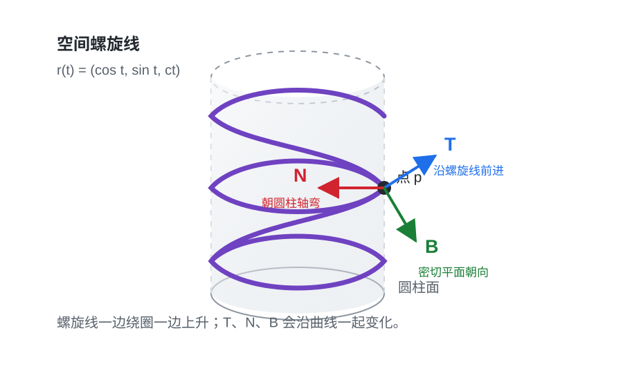
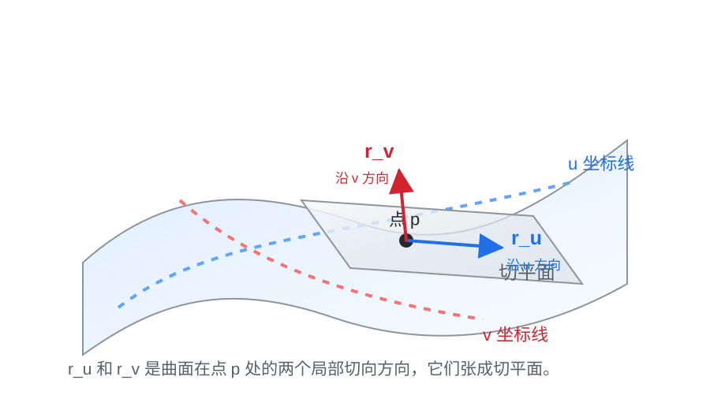

# 普通工科生也能看懂的微分几何：在弯曲空间上做微积分

## 一、先用几何直觉看曲线：线元和曲率

在进入公式之前，可以先抓住一个最朴素的画面：微分几何首先是在问，能不能不用外面的直尺，而是沿着曲线自己来量曲线。

普通几何里，我们很习惯用直线距离量两点之间有多远。但曲线不是直线。如果要量一条弯曲道路有多长，不能直接拿两端点之间的直线距离代替，而要沿着道路本身一点点量。

这就是线元的直觉。

线元通常记作：

$$
ds
$$

它可以先理解成“曲线自己的一小段长度”。微分几何里很多事情都从这个小东西开始：不是问横坐标变了多少，也不是问某个参数变了多少，而是问沿着曲线本身走了多长。

所以可以说，微分几何有一种很重要的视角：用曲线自己的小长度来量曲线。这把尺子就是线元 `ds`。

有了 `ds`，曲率也可以用非常直观的方式理解。

想象你沿着一条曲线往前走。你每走一小段，前进方向可能会稍微转一点。如果你走了很短一段，方向就转了很多，说明这条曲线弯得很急；如果你走了很长一段，方向只转了一点，说明这条曲线比较平缓。

所以曲率的核心就是：方向角变化除以弧长微元。

更数学一点，如果用 `θ` 表示切线方向的角度，那么：

$$
\kappa=\left|\frac{d\theta}{ds}\right|
$$

这句话已经很接近微分几何的核心了。它不是用横坐标 `dx` 来衡量方向变化，而是用曲线自己的小长度 `ds` 来衡量方向变化。也就是说，曲率是在问：沿曲线自己每走一小段，方向转得有多快？

还可以从圆来理解曲率。

圆是最容易理解的弯曲曲线。半径越小，圆弯得越急；半径越大，圆越接近直线。所以圆的曲率定义成：

$$
\kappa=\frac{1}{R}
$$

这里 `R` 是圆的半径。半径为 `1` 的圆，曲率是 `1`；半径为 `10` 的圆，曲率是 `1/10`；直线可以看成半径无限大的圆，所以曲率趋近于 `0`。

微分几何本质上有一种“以圆代曲”的味道。对一条一般曲线来说，我们在某个点附近找一个最贴近它的圆。这个圆越小，说明曲线在这个点弯得越急；这个圆越大，说明曲线在这个点越平缓。这个最贴近曲线的圆，通常叫密切圆。

所以曲率也可以理解成：最贴近曲线的圆的曲率。

这就是为什么曲率既可以从方向变化来理解，也可以从圆来理解。

- 从方向变化看：曲率是 `dθ/ds`。
- 从圆来看：曲率是 `1/R`。

这两个说法其实是一件事。圆走过弧长 `ds` 时，切线方向会转过一个小角度 `dθ`，而它们满足：

$$
ds=R\,d\theta
$$

所以：

$$
\frac{d\theta}{ds}=\frac{1}{R}
$$

这就把“方向角变化除以弧长”和“圆的半径倒数”连起来了。

这章先不急着算公式。先记住三件事：

- 线元 `ds` 是沿曲线自己的小长度，是微分几何里的尺子。
- 曲率看的是方向角相对于 `ds` 变化得有多快。
- 一般曲线可以在局部用最贴近它的圆来理解，这就是“以圆代曲”的直觉。

后面再看弧长公式时，就不会只是看到一个微积分公式，而是能看到它背后的几何视角：我们是在用曲线自己的线元 `ds` 来测量曲线。

## 二、从弧长公式看视角变化

上一节先从几何直觉说：曲线应该用自己的小长度 `ds` 来量，曲率也应该看方向角相对于 `ds` 变化得多快。

这一节换一个角度：回到微积分里的弧长公式，看看那个熟悉公式其实是在把 `ds` 用坐标写出来。

如果一条平面曲线写成：

$$
y=f(x),\quad a\le x\le b
$$

那么它的弧长公式是：

$$
L=\int_a^b \sqrt{1+(f'(x))^2}\,dx
$$

这个公式看起来是在对 `x` 积分，但它真正累加的不是横轴上的 `dx`，而是曲线上的小长度 `ds`。

为什么？

把曲线切成很多很小的小段。每一小段都可以近似看成一条小直线。对其中一小段来说，横向变化是 `dx`，纵向变化是 `dy`。这一小段就像一个很小的直角三角形，所以曲线上的小长度满足：

$$
ds=\sqrt{dx^2+dy^2}
$$

而曲线写成 `y=f(x)` 时，导数告诉我们：

$$
dy=f'(x)\,dx
$$

代回去，就得到：

$$
ds=\sqrt{1+(f'(x))^2}\,dx
$$

这一步最关键：右边是用坐标 `x` 写出来的表达式，左边的 `ds` 才是曲线自己的线元。

把所有线元加起来，就得到弧长：

$$
L=\int_C ds
$$

如果刚好用横坐标 `x` 来算，这个式子就展开成：

$$
L=\int_a^b \sqrt{1+(f'(x))^2}\,dx
$$

所以，微积分里的弧长公式并不是另一套东西。它只是把几何线元 `ds` 翻译成了 `x` 坐标下的计算公式。

如果你换成另一个参数 `t`，曲线写成：

$$
r(t)=(x(t),y(t))
$$

同一个 `ds` 又会写成：

$$
ds=|r'(t)|\,dt
$$

这里的 `t` 不一定是横坐标，它只是描述曲线位置的参数。当 `t` 增加一点点 `dt` 时，曲线上的点移动的速度大小是 `|r'(t)|`，所以曲线上的小长度就是速度大小乘以参数小变化。

于是同一条曲线的长度也可以写成：

$$
L=\int |r'(t)|\,dt
$$

注意这里的重点：表达式会随着参数改变，但它们都在表示同一个 `ds`。

用 `x` 描述曲线时：

$$
ds=\sqrt{1+(f'(x))^2}\,dx
$$

用 `t` 描述曲线时：

$$
ds=|r'(t)|\,dt
$$

公式不同，几何量相同。这就是微分几何想强调的地方：几何量本身和描述它的坐标公式，不是同一件事。

从这个角度看，微积分弧长公式和微分几何并不矛盾。微积分更常从某个具体表达式出发，问“怎么算”；微分几何更强调曲线本身，问“这个长度是不是不依赖坐标和参数的几何量”。

这就是视角变化：不是抛弃微积分，而是把微积分公式读成几何量的坐标表达。

到这里，可以把前两章的思想简单统一一下。

计算弧长时，我们做的是“以直代曲”：把曲线切成很多很短的小段，每一小段先当成直线段来量。这样得到的是曲线的线元 `ds`，也就是沿着曲线自己走出来的小长度。

讨论曲率时，我们做的是另一种局部比较：用圆来理解弯曲。直线小段能告诉我们曲线在这一点往哪里走，但还不能告诉我们它弯得多厉害。圆正好适合描述“弯得多急”：半径越小，弯得越急；半径越大，越接近直线。

所以可以先把这两个思想分开记：

- 以直代曲：帮助我们理解弧长和线元 `ds`。
- 以圆代曲：帮助我们理解曲率和弯曲程度。

它们并不是两套互相独立的东西。二者都在做同一件事：用简单对象理解复杂曲线的局部几何。直线回答“局部怎么走”，圆回答“局部怎么弯”。而无论量长度还是比较方向变化，最后都要回到曲线自己的小长度 `ds`。

因为一旦你承认曲线有自己的长度，就会继续问：曲线有没有自己的弯曲程度？曲面有没有自己的面积？如果只能在曲面上走，什么叫方向、距离和最短路径？如果对象本身是弯的，我们还能不能在它上面建立一套微积分？

这就是微分几何的入口：把曲线和曲面从“坐标里的图形”，变成“可以在上面测量、运动、积分和做微积分的空间”。

接下来我们先从最简单的曲线开始。曲线有长度，也有弯曲程度。把这两件事说清楚，再推广到曲面和高维流形，就会自然很多。

## 三、先看曲线：弧长、曲率和挠率

在正式推广到曲面和高维流形之前，先看曲线最合适。曲线是一维的，直觉最清楚，但它已经能展示微分几何的核心味道：我们不只关心曲线被写成什么公式，还关心哪些量真正描述了曲线自己的几何。

比如同一条曲线，可以用不同参数写出来。

你可以让参数走得快一点，也可以走得慢一点；可以从左往右走，也可以从右往左走。公式会变，参数会变，但曲线本身并没有变。

所以微分几何会自然问：哪些量不依赖你怎么给曲线取参数，也不依赖你把坐标系怎么平移、旋转？这些量才更像是曲线自己的几何性质。它们常常叫不变量。

### 弧长

最直观的不变量是弧长。

算面积时，我们会把复杂区域切成很多小矩形；算弧长时，思路很像，只是近似对象换了。传统微积分讲弧长，通常从一个朴素想法开始：把一条弯曲的线切成很多很短的小段，每一小段都用直线段近似。切得越细，折线就越贴近原来的曲线。最后让这些小直线段长度的和取极限，就得到曲线长度。

如果曲线写成参数形式：

$$
r(t)=(x(t),y(t)),\quad a\le t\le b
$$

当 `t` 变化一点点 `dt` 时，曲线上的点也移动一点点。这一小段真实长度记作 `ds`。

这里的 `ds` 不是简单的横向小变化 `dx`，也不是纵向小变化 `dy`，而是沿着曲线走出来的小长度。它表示“曲线上这一小段到底有多长”。

在这个参数 `t` 下，微积分告诉我们：

$$
ds=|r'(t)|\,dt
$$

也就是说，曲线上一小段长度，等于“参数变化量”乘以“沿曲线运动的速度大小”。于是弧长可以算成：

$$
L=\int_a^b |r'(t)|\,dt
$$

到这里，传统微积分解决的是计算问题：给定一种参数写法，怎样把曲线长度算出来。

微分几何关心的不是另一套算法，而是这个公式背后的几何意义。它会先把弧长看成曲线自己的量：曲线 `C` 上有一个小长度元素 `ds`，整条曲线的长度就是把这些小长度沿着曲线加起来：

$$
L=\int_C ds
$$

然后，如果为了计算需要选一个参数 `t`，才把 `ds` 写成：

$$
ds=|r'(t)|\,dt
$$

所以两者的差别可以这样说：微积分更常从参数公式出发，问“怎么算”；微分几何更强调曲线本身，问“这个长度是不是不依赖参数选择的几何量”。参数只是描述方式，曲线才是研究对象。

最简单的例子是单位圆的四分之一圆弧。它可以写成：

$$
r(t)=(\cos t,\sin t),\quad 0\le t\le \frac{\pi}{2}
$$

传统微积分会用弧长公式：

$$
L=\int_0^{\pi/2}|r'(t)|\,dt
$$

这里它的导数是：

$$
r'(t)=(-\sin t,\cos t)
$$

这个导数向量表示圆弧上点的运动速度。它的长度是：

$$
|r'(t)|=\sqrt{(-\sin t)^2+(\cos t)^2}
$$

利用恒等式 `sin^2 t + cos^2 t = 1`，可以得到：

$$
|r'(t)|=1
$$

所以弧长就是：

$$
L=\int_0^{\pi/2}1\,dt=\frac{\pi}{2}
$$

同一段圆弧也可以换一种参数写。比如把 `s` 理解成时间，让 `s` 从 `0` 走到 `1`，表示用一秒钟走完整段四分之一圆弧。角度就可以写成：

$$
t=\frac{\pi}{2}s
$$

于是同一段圆弧可以写成：

$$
\gamma(s)=\left(\cos(\pi s/2),\sin(\pi s/2)\right),\quad 0\le s\le 1
$$

为什么这还是同一段圆弧？因为当 `s=0` 时，角度是 `0`；当 `s=1` 时，角度是 `pi/2`。所以点还是从 `(1,0)` 走到 `(0,1)`，走过的还是那段四分之一单位圆弧。只是现在参数 `s` 更像“时间进度”，不是角度本身。

这时速度大小变成：

$$
|\gamma'(s)|=\frac{\pi}{2}
$$

所以：

$$
L=\int_0^1 \frac{\pi}{2}\,ds=\frac{\pi}{2}
$$

如果从传统微积分视角看，我们做的是两次具体计算：第一种参数写法下，参数就是角度，速度大小是 `1`，积分区间长度是 `pi/2`；第二种参数写法下，参数像时间，速度大小变成 `pi/2`，积分区间长度变成 `1`。两次套弧长公式，结果都得到 `pi/2`。

如果从微分几何视角看，重点不是“碰巧两次算出来一样”，而是它本来就应该一样。因为这两种参数写法描述的是同一段圆弧，而弧长是这段圆弧自己的几何量。参数走得快，速度项会变大；参数区间会相应变短。两者正好抵消，说明公式真正积分的是曲线上的小长度 `ds`，不是某个参数本身。

### 曲率

只知道长度还不够。两条曲线可以一样长，但形状完全不同。一条可能几乎是直的，另一条可能绕来绕去。于是我们还要问：曲线弯得厉不厉害？

这就引出曲率。

曲率描述的是曲线方向变化得有多快。

这里的“方向”，最直观地说，就是曲线上某一点的切线方向。

可以想象一辆车沿着一条弯路开。车在某一瞬间朝哪里开，就是这条曲线在这一点的切线方向。直路上，车头方向几乎不变；急弯处，车头方向变得很快。所以曲线弯不弯，本质上是在看这个切线方向变得快不快。

所以曲率的核心想法可以先写成一句话：曲率就是“切线方向的变化量”除以“曲线上走过的长度”。

在平面曲线里，描述切线方向有一个很方便的办法：看这条切线和横轴之间的夹角。这个角在公式里通常记作希腊字母 θ。

比如水平向右的切线，角度是 `0`；斜着向上的切线，角度变大；如果沿着曲线往前走时，这个角度变化很快，就说明曲线转弯很急。

如果用 `s` 表示弧长，用这个角表示切线和横轴的夹角，那么曲率可以先理解成：

$$
\kappa=\left|\frac{d\theta}{ds}\right|
$$

这句话比具体公式更重要。它说的是：曲率不是看坐标 `x` 变化了多少，而是看你沿着曲线真实走了一小段 `ds` 以后，切线方向转了多少。

不过，用一个角度描述方向，有一个限制：它特别适合平面曲线，因为平面里有一个固定的横轴可以拿来比较。到了空间曲线、曲面和更高维空间，方向不一定适合只用一个角度来描述。

所以微分几何更常用向量来记录方向。

曲线在每个点都有一个切向量，它指向“沿曲线往前走”的方向。如果我们只关心方向，不想让速度快慢影响判断，就把这个切向量除以自己的长度，变成长度为 `1` 的向量。这个向量叫单位切向量，通常记作 `T`。

也就是说，`T` 只负责记录方向，不负责记录走得快慢。

曲率就是这个单位切向量沿着曲线变化得有多快：

$$
\kappa=\left|\frac{dT}{ds}\right|
$$

这才是微分几何更关心的写法。它先看曲线自己的方向变化，再把它翻译成某个坐标里的计算公式。

直线的方向一直不变，所以曲率是 `0`。圆的方向一直在变，所以有曲率。圆越小，转弯越急，曲率越大；圆越大，转弯越缓，曲率越小。

最简单的例子是直线和圆。直线完全不拐弯，所以：

$$
\kappa=0
$$

半径为 `R` 的圆，曲率是：

$$
\kappa=\frac{1}{R}
$$

半径越小，圆越紧，转弯越急；半径越大，圆越平缓，转弯越慢。

再看抛物线之前，先看平面曲线 `y=f(x)` 的曲率公式是怎么来的。

曲线写成 `y=f(x)` 时，在点 `x` 附近，它的切线斜率是 `f'(x)`。如果用下面这个角表示切线和横轴的夹角，那么斜率和角度的关系是：

$$
\tan\theta=f'(x)
$$

也就是说，`f'(x)` 描述的是切线方向。可是曲率关心的不是方向本身，而是方向变得有多快。因此我们要看这个夹角怎么随着 `x` 变化。

从：

$$
\tan\theta=f'(x)
$$

开始，对两边同时对 `x` 求导。左边要用链式法则，因为这个夹角本身也是 `x` 的函数：

$$
\frac{d}{dx}\tan\theta
=
\frac{1}{\cos^2\theta}\frac{d\theta}{dx}
$$

右边就是：

$$
\frac{d}{dx}f'(x)=f''(x)
$$

所以：

$$
\frac{1}{\cos^2\theta}\frac{d\theta}{dx}=f''(x)
$$

也就是：

$$
\frac{d\theta}{dx}=f''(x)\cos^2\theta
$$

接下来把这个余弦平方项换成 `f'(x)` 表达。因为：

$$
\tan\theta=f'(x)
$$

所以：

$$
\cos^2\theta=\frac{1}{1+\tan^2\theta}
=
\frac{1}{1+(f'(x))^2}
$$

代回去，就得到：

$$
\frac{d\theta}{dx}=\frac{f''(x)}{1+(f'(x))^2}
$$

这表示：当横坐标 `x` 变化一点时，切线角度变化多少。

但曲率要除以的不是横坐标变化 `dx`，而是曲线上真实走过的小长度 `ds`。这正是和普通坐标微积分最不一样的地方：如果只看 `dθ/dx`，我们得到的是“横坐标每变化一点，方向变多少”；如果看 `dθ/ds`，我们得到的才是“沿曲线自己每走一小段，方向变多少”。

前面已经看到：

$$
\frac{ds}{dx}=\sqrt{1+(f'(x))^2}
$$

所以：

$$
\frac{d\theta}{ds}
=
\frac{d\theta/dx}{ds/dx}
=
\frac{f''(x)}{\left(1+(f'(x))^2\right)^{3/2}}
$$

取绝对值以后，就得到平面曲线 `y=f(x)` 的曲率公式：

$$
\kappa(x)=\frac{|f''(x)|}{\left(1+(f'(x))^2\right)^{3/2}}
$$

这个公式里，`f''(x)` 反映方向变化的快慢；分母是在修正“用横坐标 `x` 走”和“沿曲线真实走”的差别。

所以它看上去确实像微积分公式，因为它就是把微分几何的曲率定义，翻译到 `y=f(x)` 这个坐标表达以后得到的计算版本。几何定义关心的是 `ds` 和切线方向；具体公式只是坐标里的展开。

现在再看抛物线：

$$
y=x^2
$$

对 `f(x)=x^2` 来说，`f'(x)=2x`，`f''(x)=2`，所以：

$$
\kappa(x)=\frac{2}{(1+4x^2)^{3/2}}
$$

这说明抛物线在 `x=0` 附近弯得最明显，越往右走，曲线变得越平缓，曲率也越小。这个例子让曲率从一句“弯得厉不厉害”，变成一个真的能随着位置变化的量。

### 挠率

所以对曲线来说，可以先抓住三件事。不过在平面曲线里，前两件最重要：

- 弧长：沿着曲线自己的 `ds` 累加，得到曲线有多长。
- 曲率：沿着曲线自己的 `ds` 前进，看切线方向变化得有多快。
- 挠率：如果曲线在三维空间里，还要看它有没有从当前弯曲平面里扭出去。

挠率的具体定义需要先引入 Frenet-Serret 标架，也就是曲线上的 `T`、`N`、`B` 三个方向。下一章会专门讲。

这就是这一节真正想强调的视角变化：我们不再只问 `x` 变了多少、参数变了多少，而是问沿着曲线本身走过了多少 `ds`。弧长是在累加 `ds`，曲率是在比较切线方向相对于 `ds` 的变化。到了空间曲线，挠率继续比较“曲线所在的局部弯曲平面”相对于 `ds` 的变化。

平面曲线始终待在同一个平面里，所以挠率可以先放在后面。可是一旦曲线不只是画在平面里，而是在三维空间里运动，挠率就变得重要了。要把弧长、曲率和挠率统一起来，就需要单独讲 Frenet-Serret 标架。

## 四、Frenet-Serret 标架：空间曲线怎样弯、怎样扭

平面曲线只需要问两件事：走了多长，转弯多快。因为它始终待在同一个平面里，切线方向怎么转，基本就能描述它的弯曲。

空间曲线多了一件事：它可能从一个平面里扭出去。比如螺旋线，它不只是转弯，还在三维空间里不断上升或下降。为了描述这种曲线，光有弧长和曲率还不够，还需要一套跟着曲线移动的局部坐标架。这套坐标架就是 Frenet-Serret 标架。

### 从圆看三根方向

先拿平面圆来类比。圆虽然是平面曲线，但如果把它放在三维空间里看，每个点附近已经能看到三类方向。

- 第一根方向：沿切线，表示在这一点正往哪里走。
- 第二根方向：指向圆心，表示曲线正在往哪边弯。
- 第三根方向：垂直于圆所在平面，表示这个弯曲平面朝哪里。

在 Frenet-Serret 标架里，这三根方向分别记作：

- `T`：单位切向量，对应“往哪里走”。
- `N`：单位法向量，对应“往哪边弯”。
- `B`：副法向量，对应“弯曲平面朝哪里”。

对平面圆来说，`T` 会变，因为前进方向一直在转；`N` 也会变，因为指向圆心的方向跟着转；但 `B` 始终不变，因为圆所在的平面没有变。所以平面圆没有真正的空间扭转。

真正的空间曲线不同。它的 `B` 可能沿着曲线不断转动。这个“弯曲平面转得多快”，就是挠率要描述的事情。

最简单的空间曲线例子是螺旋线。比如：

$$
r(t)=(\cos t,\sin t,ct)
$$

这里前两个坐标 `cos t`、`sin t` 让点绕着圆转，第三个坐标 `ct` 让点一边转一边往上走。可以把它想成绕着圆柱表面向上爬的一条线。

如果 `c=0`，它就退化成平面圆：

$$
r(t)=(\cos t,\sin t,0)
$$

这时曲线一直待在同一个平面里，`B` 不变，所以挠率是 `0`。

但当 `c` 不等于 `0` 时，曲线一边绕圈一边上升。它不再待在一个固定平面里，当前最贴近曲线的弯曲平面会沿着曲线不断转动。这个转动速度，就是挠率要刻画的东西。

所以可以这样对比：

- 平面圆：`T` 和 `N` 在转，`B` 不转。
- 空间螺旋线：`T`、`N`、`B` 都会随着曲线变化。

### T、N、B 是什么

所谓标架，可以先理解成绑在曲线每个点上的一套“随身三维坐标系”。普通三维坐标系有固定的 `x`、`y`、`z` 三根轴；Frenet-Serret 标架也有三根两两正交、长度为 `1` 的轴，只是它们会跟着曲线一起移动和旋转。

先看图：

图里的黑点是曲线上的某一点。蓝色的 `T` 是前进方向，红色的 `N` 是主要弯曲方向，绿色的 `B` 是垂直于 `T` 和 `N` 张成平面的第三个方向。

如果曲线用弧长 `s` 做参数，写成 `r(s)`，那么单位切向量是：

$$
T(s)=r'(s)
$$

这里用弧长做参数有一个好处：沿曲线每走一单位长度，参数 `s` 就增加一单位。这样 `r'(s)` 的长度正好是 `1`，所以它只记录方向，不混入速度快慢。

`N` 来自 `T` 的变化方向。前面圆的例子已经给了直觉：圆的 `T` 沿着圆转，`N` 指向圆心，也就是 `T` 正在转过去的方向。一般曲线也是这样，`N` 表示曲线主要弯过去的方向。

如果曲率不为 `0`，`N` 可以写成：

$$
N(s)=\frac{T'(s)}{|T'(s)|}
$$

因为 `T` 是单位向量，长度始终是 `1`，所以 `T` 的变化只能改变方向，不能沿着自己伸长。因此 `T'` 和 `T` 正交，`N` 也和 `T` 正交。

这一步可以看成把圆上的直觉推广到一般曲线。对圆来说，切线方向和指向圆心的方向垂直，这是画图就能看出来的。对一般曲线来说，原因仍然一样：`T` 是单位方向，长度不变，所以它的变化方向只能垂直于 `T`。

用公式压缩成一句就是：

$$
\langle T,T\rangle=1
\quad\Longrightarrow\quad
\langle T',T\rangle=0
$$

最后，`B` 是由 `T` 和 `N` 补出来的第三根正交轴：

$$
B=T\times N
$$

`T` 和 `N` 张成的平面叫密切平面，它是在这一点最贴近曲线弯曲方向的平面。`B` 垂直于这个平面，所以它记录的是当前弯曲平面的朝向。

总结一下：`T` 告诉我们曲线往哪里走，`N` 告诉我们曲线往哪边弯，`B` 告诉我们当前弯曲平面朝哪里。

### Frenet-Serret 方程

Frenet-Serret 方程描述的，就是这套随身坐标系沿着曲线走时怎样变化：

$$
\frac{dT}{ds}=\kappa N
$$

$$
\frac{dN}{ds}=-\kappa T+\tau B
$$

$$
\frac{dB}{ds}=-\tau N
$$

这三行分别在说三件事。

第一行：

$$
\frac{dT}{ds}=\kappa N
$$

它定义了曲率和主法向方向。`T` 是前进方向，`dT/ds` 表示前进方向沿着曲线变化得多快。这个变化方向就是 `N`，变化大小就是曲率 `kappa`。

第二行：

$$
\frac{dN}{ds}=-\kappa T+\tau B
$$

它说明法向量 `N` 自己怎样变化。`N` 的变化可以分成两部分：一部分回到 `T` 的反方向，来自曲线本身的弯曲；另一部分跑到 `B` 的方向，来自空间曲线的扭转。所以这一行把曲率和挠率同时放在一起。

第三行：

$$
\frac{dB}{ds}=-\tau N
$$

它是最简洁的挠率公式。`B` 表示密切平面的朝向，`dB/ds` 表示这个平面沿着曲线转得多快。这个变化由挠率 `tau` 控制。如果 `B` 不变，密切平面不转，曲线就是平面曲线；如果 `B` 在变，曲线就在三维空间里扭出去。

不用急着背这组公式。它真正重要的是把空间曲线的局部几何组织成一个清楚的结构：

- `s` 负责记录沿曲线走了多长。
- `κ` 负责记录曲线弯得多快。
- `τ` 负责记录曲线扭得多快。
- `T`、`N`、`B` 负责记录曲线在每个点附近的局部姿态。

这就是古典曲线论的核心味道：不是只把曲线当成一个参数方程，而是沿着曲线自己走，用 `ds`、曲率、挠率和移动标架来描述它的几何。

有了这个感觉，再看曲面就自然多了。曲线有 `ds`，曲面就会有自己的面积元素；曲线有移动的局部标架，曲面也会有切平面、法向量和更复杂的弯曲方式。

## 五、切空间：在弯曲对象上谈局部方向

这一章是在把前面的“以直代曲”推广开来。

前面算弧长时，我们把曲线切成很多很短的小段，每一小段用直线近似。现在我们不只是用直线段来算长度，而是进一步问：在一个弯曲对象的某一点附近，能不能用一个平直空间来描述局部方向？

这就引出切空间。

### 切空间是什么

先从最熟悉的切线开始。

微积分里讲函数局部近似时，会用切线近似函数。比如在点 `x=a` 附近，函数 `f(x)` 可以近似写成：

$$
f(x)\approx f(a)+f'(a)(x-a)
$$

这句话的意思不是说函数真的变成了直线，而是说：如果只看足够靠近 `a` 的地方，切线抓住了函数在这一点附近最重要的一阶变化。

对曲线来说也是这样。曲线整体可能弯来弯去，但在某一点附近，它最直接的一阶近似就是切线。切线告诉我们：如果从这一点沿着曲线出发，最开始会往哪里走。

这就是最简单的切空间。曲线是一维的，所以它在一点处的切空间就是一条直线方向。

曲面上就不只是一条切线了。

站在球面上的一点，你可以沿着表面往东走，也可以往北走，也可以沿着两者之间的任意方向走。这些“贴着曲面出发的方向”合在一起，形成一个平面，这就是切平面。

切平面不是曲面本身。它只是曲面在这一点附近的局部平直近似。

所以可以这样对比：

- 曲线是一维的，局部像一条直线。
- 曲面是二维的，局部像一个平面。
- 更高维的流形，局部像某个高维欧氏空间。

这就是切空间的直觉：在一个弯曲对象的某一点，收集所有“贴着这个对象出发”的合法方向。

切空间的重要性在于：它让我们在弯曲对象上重新使用线性代数。

曲面整体不是平面，高维流形整体也不一定是普通向量空间。但在某一点附近，切空间是线性的。于是方向、速度、局部变化、投影、梯度这些概念，都可以先放在切空间里理解。

所以微分几何不是抛弃线性代数，而是在说：整体空间可以是弯的，但每个点附近仍然可以用一个线性空间来近似。

但切空间只是一阶近似。它告诉我们曲面在某一点附近最像哪个平面，却还没有告诉我们曲面离这个平面偏离得有多快。这个偏离速度，才是后面曲率要回答的问题。

这一章的重点可以收束成一句话：切空间是在近似空间本身。

普通微积分常常是在近似函数；微分几何在这里是在近似空间本身。

## 六、流形：把曲线和曲面推广到高维

有了切空间以后，就可以谈流形。

这一章分两层来看。第一层是几何里的流形：什么样的空间可以叫流形？第二层是机器学习里的数据流形：为什么我们会说高维数据可能集中在某个低维结构附近？

这两件事有关，但不是一回事。流形先是一个几何概念；数据流形则是把这个几何概念拿来理解数据结构的一种视角。

### 什么是流形

流形这个词听起来很抽象，但入口很朴素：有些空间整体可以是弯的、绕的、闭合的，可是每个足够小的局部又像普通欧氏空间。

圆周是最简单的例子。

从外面看，圆周画在二维平面里。但如果你是一只只能沿着圆周运动的点，你的世界其实是一维的：你只能顺着圆周往前或往后走。圆周整体绕成一圈，不像一条无限长直线；但如果只看圆周上很小一段，它又几乎像一小段直线。

球面也是类似。

球面嵌在三维空间里，但球面本身是二维的。站在球面上的人不能往地球内部走，只能沿着表面移动。局部看，脚下附近像一个平面；整体看，球面是弯曲闭合的。

流形就是对这类对象的推广。粗略说：

流形就是局部像欧氏空间的空间。

也可以先把它理解成“高维曲面”。曲线是一维流形，曲面是二维流形，更高维的流形就是把曲线和曲面继续推广。这个说法不是严格定义，但很适合建立直觉。

如果每个小地方像直线，它是一维流形；如果每个小地方像平面，它是二维流形；如果每个小地方像 `n` 维欧氏空间，它就是 `n` 维流形。

这里要注意一个容易混淆的点：流形的“维度”，说的是它内部需要多少个自由方向，不是它被画在哪个外部空间里。

圆周画在二维平面里，但圆周本身是一维的。球面画在三维空间里，但球面本身是二维的。地球表面嵌在三维空间里，但如果一个人只能沿着地表行走，他真正的运动自由度也是二维的：可以沿着表面往东、西、南、北走，却不能自由地往地心或天空方向走。

这就是“高维空间里的低维流形”这句话真正想说的东西。

所谓“高维空间”，说的是外部描述空间很大；所谓“低维流形”，说的是对象内部真正能自由变化的方向很少。球面放在三维空间里，但球面上的运动只有两个自由方向，所以它是三维空间里的二维流形。类似地，一个更复杂的对象可以放在 `100` 维、`10000` 维甚至更高维的外部空间里，但它内部真正有意义的变化方向可能只有几个。

所以流形最重要的直觉不是“它看起来有多弯”，而是这两句话：

- 整体上，它可以有复杂形状。
- 局部看，它又像普通直线、平面或更高维欧氏空间。

上一章的切空间，就是这个局部欧氏空间的线性版本。流形告诉我们“空间本身是什么”，切空间告诉我们“在某一点附近有哪些合法方向”。

### 高维数据为什么可能藏在低维形状里

机器学习里说“数据流形”，是在借用上面的几何直觉。

很多数据表面上维度很高，但真正有意义的变化方向可能没有那么多。也就是说，数据点可能没有填满整个高维空间，而是集中在一个更低维、更有结构的区域附近。如果这个区域不是平的，而是弯曲的，我们就会用“数据流形”来描述这种直觉。

这里的“高维空间”通常来自数据的表示方式。比如有多少个特征，就可以把一个样本看成多少维空间里的一个点。但“低维流形”说的是另一件事：这些特征虽然很多，却可能被少数更根本的因素共同控制，所以真实数据只能沿着少数有效方向变化。

一维数据流形，最直观就是高维空间里的一根曲线。

比如，画面里有一个小圆点，它在二维平面上沿着单位圆运动。这个小圆点不是数学上没有大小的点，而是照片里占有一小块像素区域的圆点。它的位置可以由一个角度决定。把这个角度记作 `t`，圆点中心的位置就是：

$$
(\cos t,\sin t)
$$

也就是说，这个小圆点看起来在二维平面里运动，但它真正的自由度只有 `1`：角度 `t`。只要知道 `t`，圆点中心的位置就确定了，整张照片里那一小块亮起来的像素位置也就跟着确定了。

现在不要直接记录它的二维坐标，而是每隔一点角度拍一张照片。照片数据肯定是高维的：如果一张小灰度图有 `10000` 个像素，把这些像素排成一列，它就是一个 `10000` 维向量。

于是，每个角度 `t` 都会对应一张照片，也就对应一个 `10000` 维向量：

$$
t\longmapsto x(t)\in \mathbb{R}^{10000}
$$

这里 `x(t)` 是角度 `t` 下拍到的照片向量。随着小圆点绕单位圆运动，`t` 连续变化，照片也连续变化。于是这些照片向量会在 `10000` 维空间里连成一根曲线。

这就是“高维空间里的一维流形”的直觉：照片数据本身在 `10000` 维空间里，但它背后的真实变化只有一个角度，所以本质上是一维的。

这不是说只有一个像素在变。恰恰相反，角度稍微变一点，小圆点覆盖的那一组像素都会一起移动：原来亮的地方可能变暗，新的位置会变亮。但这些像素不是独立乱变，而是被同一个变量 `t` 统一控制。如果你随便改某个像素，得到的向量虽然还在 `10000` 维空间里，却未必对应“这个小圆点绕单位圆运动时拍到的一张真实照片”。

如果有两个隐藏因素，比如点不只沿圆周运动，还能沿另一个独立参数变化，那么数据就可能扫出一张二维曲面。再多几个隐藏因素，就会得到更高维的低维结构。但核心没有变：外部坐标很多，内部自由度很少。

如果这个低维结构刚好是平直的，那它就像一个平面；如果它是弯的，就更像曲线、曲面或更高维的流形。数据流形强调的是后一种更一般的直觉：外部表示维度很高，但真实变化可能沿着一个低维形状发生。

这就是流形假设想说的事情：高维数据的有效变化，可能发生在一个低维但有结构的形状附近。这里说的“形状”，不一定真的是我们能画出来的二维表面；它只是强调外部空间很大，但真实数据只占其中很小一部分，而且变化方向受到现实结构约束。

这个说法不等于“数据真的严格躺在某个完美流形上”。现实数据有噪声，也有复杂分布。但它提供了一个很有用的视角：不要只看外部维度有多高，还要问数据内部真正的自由度是什么。

这一节先只抓住直觉：外部维度很高，不代表内部自由度也高；真正重要的是数据可以沿哪些方向自然变化。

## 七、度量：在弯曲空间里怎样量长度、角度和面积

前面说流形是“局部像欧氏空间的空间”。但只知道“局部像平面”还不够。我们还要知道：在这个空间内部，怎么量长度？怎么量角度？怎么量面积？两点之间的距离又应该怎么算？

这就是度量要回答的问题。

### 度量是什么：坐标不是尺子

可以先抓住一个区别：坐标负责给点编号，度量负责告诉我们这些编号变化对应的真实长度。

在普通平面里，这个区别不明显。一个很小的位移如果写成：

$$
(dx,dy)
$$

它的长度平方就是：

$$
ds^2=dx^2+dy^2
$$

我们太熟悉这个公式，所以容易以为“坐标差”和“真实距离”天然是一回事。但在弯曲空间里，这件事不再自动成立。

微分几何里更基本的做法，是先在每个点附近放一把局部尺子，也就是度量。它先回答局部问题：

- 往某个很小方向走一步，到底有多长？
- 两个很小方向之间的夹角是多少？
- 一个很小面积片到底有多大？

然后再把这些局部信息累加起来：沿一条曲线把小长度加起来，得到曲线长度；在所有连接两点的曲线里找最短的长度，得到两点之间的内在距离。

这就是“内蕴量”的意思：只生活在这个空间内部的人，也能通过测量得到的量。长度、角度、面积、沿曲面走的距离，都是内蕴量。

### 第一基本形式：局部尺子的公式

第一基本形式就是把这把局部尺子写成公式。

假设曲面上一小块区域可以用两个局部坐标 `u`、`v` 描述。

这里说的切向量，和微积分里的切向量本质上是一回事。

在微积分里，如果一条曲线写成：

$$
r(t)
$$

那么它的导数：

$$
r'(t)
$$

就是曲线在这一点的切向量。它可以理解成：参数 `t` 每增加一点，曲线上的点往哪里动、动得多快。也就是说，切向量本质上是“沿着某个参数方向移动时的速度向量”。

到了曲面上，情况只是多了一个参数。曲线只有一个参数，所以只有一个基本切向量；曲面有两个局部坐标，所以可以沿两个坐标方向移动，也就会得到两个基本切向量。

这里要把三件事分清楚。

第一，`u`、`v` 是局部坐标。它们像地图上的横纵坐标，只是在给曲面上一小块区域里的点编号。

第二，`r(u,v)` 是把这对坐标放回曲面上的规则。给定一对数字 `u`、`v`，`r(u,v)` 就对应曲面上的一个点。

第三，沿 `u` 方向和沿 `v` 方向各有一个局部切向量。

先用最熟悉的二维平面直角坐标系来比喻。在平面上，一个点可以写成：

$$
(x,y)
$$

如果只让 `x` 变一点、`y` 不变，点就沿水平方向走；如果只让 `y` 变一点、`x` 不变，点就沿竖直方向走。平面里这两个方向通常记作两个单位方向向量：

$$
e_{x},\quad e_{y}
$$

它们很特别：长度都是 `1`，而且互相垂直。所以平面里的小位移可以写成：

$$
dr=e_{x}\,dx+e_{y}\,dy
$$

曲面上的 `u`、`v` 也是类似。只不过曲面是弯的，所以“只改一个坐标”的方向不再是固定的水平或竖直方向，而是曲面在当前点附近的局部切向方向。

可以把这两个局部切向量理解成曲面坐标里的“坐标方向向量”。它们的角色类似平面里的两个坐标方向单位向量，但有一个重要区别：它们不一定是单位长度，也不一定互相垂直。

于是这两个局部切向量来自下面两个问题：

- 只让 `u` 变一点，`v` 不变，曲面上的点会往哪里动？
- 只让 `v` 变一点，`u` 不变，曲面上的点会往哪里动？

数学上可以写成：

$$
r_{u}=\frac{\partial r}{\partial u},\quad r_{v}=\frac{\partial r}{\partial v}
$$

所以第一个是沿 `u` 坐标线走时的切向量，第二个是沿 `v` 坐标线走时的切向量。它们一起张成这一点附近的切平面。

现在关键来了：坐标变化怎样对应到曲面上的真实小位移？

坐标里的 `(du,dv)` 只是两个数字的变化。它本身还不是曲面上的真实位移。要把它放回曲面上看，就要问：`u` 变一点会让曲面上的点朝哪个方向动？`v` 变一点又会让曲面上的点朝哪个方向动？

前面已经说过，这两个方向分别由两个局部切向量给出。所以曲面上一小步的真实位移，可以在切平面里近似写成：

$$
dr=r_{u}\,du+r_{v}\,dv
$$

这句话的意思是：如果 `u` 变了 `du`，就沿 `u` 方向切向量走一小步；如果 `v` 变了 `dv`，就沿 `v` 方向切向量走一小步。两个贡献加起来，就是曲面上这一小步在切平面里的近似位移。

有了这个真实小位移以后，才轮到内积出场。

真实小长度就是这个位移向量的长度，而向量长度可以用内积来算：

$$
ds^2=\langle dr,dr\rangle
$$

把 `dr` 展开：

$$
\begin{aligned}
ds^2
&=\langle r_{u}\,du+r_{v}\,dv,\ r_{u}\,du+r_{v}\,dv\rangle\\
&=\langle r_{u},r_{u}\rangle du^2
+2\langle r_{u},r_{v}\rangle dudv
+\langle r_{v},r_{v}\rangle dv^2
\end{aligned}
$$

展开以后可以看到，真正需要知道的只有三件事：`u` 方向切向量自己的长度平方，`v` 方向切向量自己的长度平方，以及这两个方向之间的内积。

把这三个量分别记成 `E`、`F`、`G`，就得到第一基本形式：

$$
ds^2=E\,du^2+2F\,dudv+G\,dv^2
$$

其中：

$$
E=\langle r_{u},r_{u}\rangle,\quad F=\langle r_{u},r_{v}\rangle,\quad G=\langle r_{v},r_{v}\rangle
$$

可以这样读：

先记住一个几何直觉：切向量可以理解成“某个坐标每增加 `1` 个单位时，曲面上的点真实移动得有多快、往哪里动”。

- `E` 是第一个坐标方向切向量和自己的内积，也就是它的长度平方。几何上，它衡量的是：`u` 坐标每增加 `1` 个单位，曲面上的点沿 `u` 方向真实移动得有多快。只沿 `u` 方向走时，公式变成：

$$
ds^2=E\,du^2
$$

所以真实小长度是：

$$
ds=\sqrt{E}\,|du|
$$

这就是“换算”的意思：`du` 只是坐标数字变化了多少，`sqrt(E)` 才是把坐标变化换成真实长度的局部比例尺。

- `G` 是第二个坐标方向切向量和自己的内积，也就是它的长度平方。几何上，它衡量的是：`v` 坐标每增加 `1` 个单位，曲面上的点沿 `v` 方向真实移动得有多快。只沿 `v` 方向走时，同理有：

$$
ds^2=G\,dv^2
$$

所以真实小长度是：

$$
ds=\sqrt{G}\,|dv|
$$

也就是说，`sqrt(G)` 是 `v` 方向上的局部比例尺。

- `F` 是两个坐标方向切向量之间的内积。几何上，它衡量的是：`u` 方向的真实移动和 `v` 方向的真实移动之间有多“斜”。如果两个方向垂直，`F=0`；如果不垂直，就会在长度公式里出现交叉项。

如果 `F=0`，说明两个局部方向正交；如果 `F` 不为 `0`，说明这两个方向不是直角。

但要注意，正交只说明交叉项消失，不等于 `E` 和 `G` 自动变成 `1`。

`E=1` 的意思是：沿 `u` 方向，局部比例尺是 `1`。坐标变化 `du` 就对应真实长度 `|du|`，没有被放大或缩小。

`G=1` 的意思是：沿 `v` 方向，局部比例尺也是 `1`。坐标变化 `dv` 就对应真实长度 `|dv|`，也没有被放大或缩小。

所以普通平面的公式：

$$
ds^2=du^2+dv^2
$$

其实同时用了三件事：

- `u` 和 `v` 方向正交，所以 `F=0`。
- 第一个坐标方向切向量是单位长度，所以 `E=1`。
- 第二个坐标方向切向量是单位长度，所以 `G=1`。

有了第一基本形式，很多内蕴量就可以继续定义出来。

第一，局部长度。

如果曲面上一小步在局部坐标里写成：

$$
(du,dv)
$$

那么这一步的长度平方定义为：

$$
ds^2=E\,du^2+2F\,dudv+G\,dv^2
$$

第二，夹角。

第一基本形式不只给长度，也给内积。原因是：在这一点的切平面里，任意切向量都可以用两个坐标方向切向量拼出来。

假设两个切向量分别写成：

$$
a=a_1r_{u}+a_2r_{v},\quad b=b_1r_{u}+b_2r_{v}
$$

也就是说，`a_1`、`a_2` 表示向量 `a` 在 `u`、`v` 两个局部方向上的分量；`b_1`、`b_2` 也是同理。

现在把它们做内积：

$$
\langle a,b\rangle
=E\,a_1b_1+F(a_1b_2+a_2b_1)+G\,a_2b_2
$$

为什么还是这三个系数？因为展开以后只会遇到三类基本内积：

$$
\langle r_{u},r_{u}\rangle,\quad \langle r_{u},r_{v}\rangle,\quad \langle r_{v},r_{v}\rangle
$$

它们正好就是 `E`、`F`、`G`。

有了内积和长度以后，夹角就可以定义为：

$$
\cos\alpha=\frac{\langle a,b\rangle}{|a|\,|b|}
$$

所以夹角和第一基本形式的关系很直接：第一基本形式先给出切向量之间的内积，再由内积定义夹角。

第三，面积。

曲面上一小块真实面积定义为：

$$
dA=\sqrt{EG-F^2}\cdot du\cdot dv
$$

第四，曲线长度。

如果一条曲线在曲面上走，曲线长度就是把一路上的小长度加起来：

$$
L=\int ds
$$

第五，内在距离。

曲面上两点之间的距离，不是外部空间里的直线距离，而是在曲面上所有连接这两点的曲线里，取长度最短的那条：

$$
d(p,q)=\inf L(\gamma)
$$

这里 `gamma` 表示所有从 `p` 走到 `q` 的曲线，`inf` 可以先理解成“所有可能长度里的最小值”。

所以这一节的重点是：坐标只是地图上的编号，度量才是空间内部的尺子。

### 具体例子：经纬度坐标里的度量

现在用地球表面做一个具体例子。重点不是站在外面写球面参数方程，而是看：生活在地球表面的人怎样建立坐标，又怎样在这套坐标下写出第一基本形式。

先说坐标从哪里来。

第一步，是确定南北方向。

人类可以通过天文现象发现一个稳定方向。白天看太阳的运动，晚上看星空的旋转，会发现天空好像绕着某条轴在转。北半球可以用北极星附近的方向作为北方参考；更一般地，也可以通过星空旋转的中心确定天极方向。这个方向投到地面上，就给出了南北。

第二步，是确定赤道。

有了南北轴，就可以想象一条与这根轴垂直的大圈，这就是赤道。赤道不是随便画的一条线，而是由地球自转轴决定出来的基准线。它把地表分成北半球和南半球。

第三步，是定义纬度。

纬度可以理解成一个地点相对于赤道的南北位置。古人可以通过测量天体高度来估计纬度。比如在北半球，北极星离地平线的高度大致等于当地纬度。航海时使用六分仪，就是测量天体和地平线之间的夹角：你站在船上，量出北极星或正午太阳的高度，就能推断自己大概在多靠北或多靠南的位置。

所以纬度不是上帝视角下的三维坐标，而是地表居民通过“地平线、天体高度、南北方向”建立出来的地表编号。

第四步，是定义经度。

光知道纬度还不够。同一条纬线上有很多点，还要知道你在东西方向上绕到了哪里。为此，人们需要选一条基准南北线作为零经线。今天常用的是经过格林尼治的本初子午线。

经度的困难在于：东西方向没有像北极星那样直接给出的位置标记。它和时间密切相关。地球自转一圈是 `360` 度，大约 `24` 小时，所以每差 `1` 小时，对应经度大约差 `15` 度。航海中如果你知道当地正午时刻，又知道基准地点此刻的时间，就能通过时间差推算经度。可靠航海钟的重要性就在这里。

这样，经纬度就成了一套地球表面内部可以建立的坐标系统：

- 纬度回答：这个点在赤道以北还是以南，离赤道多少。
- 经度回答：这个点相对零经线，向东或向西转到了哪里。

这套坐标不是把地球放进三维空间以后读出来的 `x,y,z`。它是生活在地表上的人借助方向、地平线、太阳、星空、六分仪和时间测量，给地表位置建立的一套编号系统。

但经纬度仍然只是坐标。它告诉你“点在哪里”，还没有直接告诉你“两个坐标差对应多远”。第一基本形式要做的事情，就是把经纬度变化换算成地表上的真实小长度。

假设地球半径近似为：

$$
R
$$

纬度记作：

$$
\lambda
$$

经度记作：

$$
\phi
$$

在这套坐标里，一小步可以分成两个方向：一个是南北方向，也就是纬度方向；另一个是东西方向，也就是经度方向。

先看纬度方向。纬度变化一点点，就是沿经线往北或往南走一小段。

为什么纬度方向的长度比例是地球半径 `R`？

因为经线可以看成地球上的一个大圆。沿经线从赤道走向北极，本质上是在半径为 `R` 的圆上走弧长。圆上的弧长满足：

$$
ds=R\cdot d\lambda
$$

这里的意思是：纬度这个角度变化了一点点。角度变化同样多时，半径越大，走过的弧长越长；地球半径就是这个比例尺。

所以纬度每变化一个很小的角度，对应的地表长度比例是：

$$
R
$$

这正是“纬度方向切向量长度”的意思。切向量可以理解成：坐标每增加 `1` 个单位时，曲面上的点真实移动得有多快。这里纬度每增加一个单位角度，沿地表走过的长度比例就是：

$$
R
$$

因此纬度方向切向量的长度是 `R`。它和自己的内积，也就是长度平方，是：

$$
E=\langle r_{\lambda},r_{\lambda}\rangle=R^2
$$

再看经度方向。经度变化一点点，就是沿当前纬线往东或往西走一小段。这里不能直接用赤道的尺度，因为不同纬度处的纬线圈大小不一样。

在纬度为：

$$
\lambda
$$

的地方，纬线圈半径是：

$$
R\cos\lambda
$$

所以经度方向的切向量长度是：

$$
R\cos\lambda
$$

它和自己的内积是：

$$
G=\langle r_{\phi},r_{\phi}\rangle=R^2\cos^2\lambda
$$

最后看交叉项。纬度方向是南北，经度方向是东西。在经纬度坐标里，这两个方向互相垂直，所以：

$$
F=\langle r_{\lambda},r_{\phi}\rangle=0
$$

也可以把它写成一次非常简单的计算。前面已经知道两个方向的长度。

$$
|r_{\lambda}|=R
$$

$$
|r_{\phi}|=R\cos\lambda
$$

两个方向的夹角是直角：

$$
\alpha=\frac{\pi}{2}
$$

内积可以写成“长度乘长度乘夹角余弦”：

$$
\begin{aligned}
F
&=\langle r_{\lambda},r_{\phi}\rangle\\
&=|r_{\lambda}|\cdot |r_{\phi}|\cdot \cos\alpha\\
&=R\cdot R\cos\lambda\cdot \cos\frac{\pi}{2}\\
&=0
\end{aligned}
$$

所以 `F=0` 不是随便说的。它的意思是：经线方向和纬线方向对应的两个切向量互相正交。

把这三个系数放回第一基本形式：

$$
ds^2=E\,du^2+2F\,dudv+G\,dv^2
$$

并把局部坐标换成经纬度：

$$
u=\lambda,\quad v=\phi
$$

就得到地球表面在经纬度坐标下的第一基本形式：

$$
ds^2=R^2\,d\lambda^2+R^2\cos^2\lambda\,d\phi^2
$$

这就是前面抽象公式的具体样子。它告诉我们：同样改变一点经度，在赤道附近走得很远，在高纬度地区走得更短，靠近两极时几乎只绕很小一圈。原因不在经度坐标本身，而在经度方向切向量的长度平方，也就是第一基本形式系数 `G`，会随纬度变化。

有了这个公式，就可以继续算很多内蕴量。

第一，算局部长度。给定一个很小的经纬度变化：

$$
(d\lambda,d\phi)
$$

把它代入 `ds^2`，就能得到这一步在地表上的真实小长度。

第二，算面积。一般的面积公式是：

$$
dA=\sqrt{EG-F^2}\cdot du\cdot dv
$$

在经纬度坐标里：

$$
u=\lambda,\quad v=\phi
$$

前面已经算出：

$$
E=R^2,\quad F=0,\quad G=R^2\cos^2\lambda
$$

把它们代入面积公式：

$$
\begin{aligned}
dA
&=\sqrt{EG-F^2}\cdot d\lambda\cdot d\phi\\
&=\sqrt{R^2\cdot R^2\cos^2\lambda-0^2}\cdot d\lambda\cdot d\phi\\
&=R^2\cos\lambda\cdot d\lambda\cdot d\phi
\end{aligned}
$$

所以经纬度坐标里一小块面积可以写成：

$$
dA=R^2\cos\lambda\cdot d\lambda\cdot d\phi
$$

这说明同样大小的一格经纬度，在赤道附近面积大，在高纬度地区面积小。原因还是第一基本形式里的局部尺子：纬度方向的比例尺是 `R`，经度方向的比例尺是：

$$
R\cos\lambda
$$

两个方向又正交，所以小面积就是这两个方向的小长度相乘。

第三，算曲线长度。比如一条航线如果写成随时间变化的经纬度路径，就可以沿路径把每一小段 `ds` 加起来：

$$
L=\int ds
$$

第四，算两点之间的内在距离。地球表面上两点之间有很多条路径，内在距离就是其中最短路径的长度。在球面上，这条最短路径通常是大圆的一段。

先看一个最简单的例子：从赤道上的一个点，走到赤道上向东相差 `90` 度的另一个点。

这条路沿着赤道走，所以纬度一直是：

$$
\lambda=0
$$

纬度不变，也就是：

$$
d\lambda=0
$$

经度从 `0` 变到：

$$
\frac{\pi}{2}
$$

把这些代入地球表面的第一基本形式：

$$
ds^2=R^2\,d\lambda^2+R^2\cos^2\lambda\,d\phi^2
$$

因为：

$$
\lambda=0,\quad d\lambda=0,\quad \cos 0=1
$$

所以：

$$
ds^2=R^2\,d\phi^2
$$

也就是：

$$
ds=R\cdot d\phi
$$

把一路上的小长度加起来：

$$
\begin{aligned}
L
&=\int_0^{\pi/2} R\cdot d\phi\\
&=\frac{\pi R}{2}
\end{aligned}
$$

这就是赤道上相差 `90` 度的两个点之间沿地表走的最短距离，也就是四分之一个大圆的长度。

如果把地球半径粗略取成 `6371` 公里，那么：

$$
\frac{\pi R}{2}\approx 10007\text{ 公里}
$$

这个例子说明：内在距离不是穿过地球内部的直线距离，而是被限制在地球表面上走出来的最短长度。飞机航线常常看起来在平面地图上弯了，但在地球表面上，它反而更接近真正的最短路。

所以这一章可以压缩成一句话：坐标告诉我们位置，度量告诉我们这套坐标下怎么量长度、角度、面积和距离。

## 八、曲率：空间到底弯在哪里

有了度量以后，我们才能认真谈曲率。

前面讲曲线时，曲率是“沿着 `ds` 前进时，切线方向变化得多快”。这是一维曲线的弯曲。

到了曲面，弯曲会变得更丰富。因为在曲面上的一个点，你可以沿很多不同方向切一刀。不同方向看到的弯曲程度可能不一样。

### 第二基本形式：曲面怎样向外弯

古典曲面论里，描述曲面弯曲的一个核心工具叫第二基本形式。

前面说的第一基本形式负责测量曲面内部的长度和角度。第二基本形式则更关心曲面在外部空间里怎样弯。直观地说，它在看：当你沿着曲面走一点点时，曲面的法向量变化得有多快。

为什么看法向量？因为平面上每一点的法向量都一样，不会变；球面上不同点的法向量指向不同方向，变化很明显。法向量变化得越快，曲面就弯得越明显。

如果曲面写成 `r(u,v)`，单位法向量记作 `n`，第二基本形式常写成：

$$
II=L\,du^2+2M\,dudv+N\,dv^2
$$

这里的 `L`、`M`、`N` 不是长度，而是描述曲面二阶弯曲的系数。它们来自曲面二阶变化和法向量之间的关系：

$$
L=\langle r_{uu},n\rangle,\quad M=\langle r_{uv},n\rangle,\quad N=\langle r_{vv},n\rangle
$$

可以先把它理解成：第一基本形式告诉我们曲面上怎么量，第二基本形式告诉我们曲面在外部空间里怎么弯。

### 等距变换：内部尺子没有变

这时再谈等距变换会更自然。因为第一基本形式和第二基本形式的区别，正是在提醒我们：内部怎么量，和外部怎么弯，不完全是一回事。

所谓等距变换，不是说两个对象从外面看形状一样，而是说它们的第一基本形式一样，也就是内部度量一样。度量一样，曲线长度就不变；曲线长度不变，两点之间的内在距离也不变。

更进一步，所有只由度量决定的内蕴量也会保持不变。比如角度、面积、测地距离，以及后面会谈到的高斯曲率，都属于这种意义下的内部几何量。

可以用平面和圆柱面来理解。

一张平纸当然是平的。在纸面内部，长度和角度按普通平面规则测量。如果把这张纸卷成圆柱面，只要不拉伸、不压缩、不撕裂，纸面内部的小长度和小角度其实没有变。纸上的人只在纸面上量距离、量角度，他感觉不到“纸被卷起来了”。

所以平面卷成圆柱时，外部形状变了，第二基本形式会变；但内部尺子没有变，第一基本形式保持不变。这就是等距变换的直觉。

球面就不同。你不能把一块球面完整摊平成平面而不拉伸或撕裂。地图投影总会变形，就是这个原因。球面内部的长度、角度和面积规则，和普通平面不是一回事。

这两套基本形式放在一起，就能写出很多古典曲面论里的曲率量。比如高斯曲率 `K` 可以写成：

$$
K=\frac{LN-M^2}{EG-F^2}
$$

这个公式先不用展开计算。它只是在告诉我们：曲面的曲率同时牵涉“怎么量”和“怎么弯”。其中 `E`、`F`、`G` 来自第一基本形式，`L`、`M`、`N` 来自第二基本形式。

先看三个直觉例子。

平面没有弯曲。你在平面上画一个小三角形，内角和是 180 度；画一个小圆，周长大约是 `2 pi r`；两条平行线不会突然相交。

球面是正曲率的典型例子。在球面上，经线在赤道附近可以看成彼此平行地出发，但往北走会在北极相交。球面三角形的内角和可以大于 180 度。这些现象都说明：球面内部的几何规则和普通平面不同。

马鞍面则像负曲率。它沿一个方向向上弯，沿另一个方向向下弯。直觉上，附近的路径更容易发散，小三角形的内角和可能小于平面里的 180 度。

圆柱面比较有意思。它看起来弯了，但可以沿着侧面剪开并摊平成平面，而且不需要拉伸或压缩。纸卷成圆柱以后，纸面内部的小长度和小角度没有变。从曲面内部的角度看，圆柱的某种内在曲率和普通平面一样是零。

这说明一件重要的事：微分几何里的曲率不只是“从外面看弯不弯”。它更关心空间内部的测量规则是否和普通平面一样。这正好接上上一章的内蕴量：如果内部的长度、角度和距离规则没有变，那么很多内部几何性质也不应该变。

这里就会遇到古典微分几何里非常漂亮的一个结论：高斯绝妙定理。

它说的事情可以先用大白话理解：高斯曲率虽然在上面的公式里用到了第二基本形式，看起来像是在描述曲面怎样弯在三维空间里，但它其实可以只由曲面内部的度量决定。也就是说，只要知道曲面上的长度、角度和距离怎样测量，就能知道高斯曲率；不需要站到外面去看这张曲面怎样嵌在三维空间里。

这也是为什么圆柱面很有启发性。圆柱从外面看是弯的，但它可以不拉伸地展开成平面，所以它的内部测量规则和一张平纸一样。高斯绝妙定理告诉我们：这种内部测量规则已经决定了高斯曲率，因此圆柱的高斯曲率和普通平面一样是 `0`。

球面就不同。你无法把一块球面完整摊平成平面而不拉伸或撕裂。它的内部距离和角度规则已经不同于平面，所以它有正的高斯曲率。

可以把曲率理解成对局部平直近似的误差说明。

切空间告诉我们：每个点附近可以先当成平的。曲率接着问：这个“当成平的”的近似能维持多远？如果走远一点，平面直觉会怎样失效？

曲率会影响很多几何问题：

- 最短路径会怎样走。
- 两条一开始很接近的路径会靠近还是远离。
- 一个小区域摊到平面上会不会被拉伸。
- 局部线性近似在多大范围内还可靠。

所以曲率不是只用来描述曲面好不好看。它在问：这个空间的内部几何，和我们熟悉的平坦空间到底差在哪里。

## 九、测地线：弯曲空间里的最短路径

有了度量和曲率以后，就可以问路径问题。

在普通平面上，两点之间直线最短。这个事实太熟悉了，以至于我们很容易把“最短路径”和“直线”混在一起。

但在弯曲空间里，普通直线可能根本不是允许的路径。

比如从北京到纽约，如果只看三维空间里的直线，它可能穿过地球内部。可是现实中飞机要沿着地球表面附近飞。于是有意义的路径不是“穿过去的直线”，而是球面上的最短路径，也就是大圆航线。

测地线就是这种弯曲空间里的“直线”。

更准确地说，测地线是在这个空间内部尽量不自己拐弯的路径。它不一定全局最短，但在足够小的一段上，它通常是局部最短、最自然的路径。

平面上的测地线就是普通直线。球面上的测地线是大圆。圆柱面上的测地线如果把圆柱剪开摊平成平面，就会变成展开图上的直线。

为什么还要说“尽量不自己拐弯”？因为在弯曲空间里，一条路径看起来弯，有时不是它自己在拐，而是空间本身弯了。

比如赤道画在球面上，从三维空间外面看是一条圆；但如果你只能生活在球面上，沿赤道一直走，你并没有在球面内部左右转向。它就是球面上的一条测地线。

这再次体现了微分几何的视角：不要只从外面的欧氏空间看，要问空间内部的人会怎样测量和运动。

测地线可以用长度泛函来理解。给定一条路径 `gamma`，它的长度可以写成：

$$
L(\gamma)=\int_\gamma ds
$$

测地线问题就是在很多条连接两点的路径里，寻找让这个长度尽可能短的路径。

这已经带有一点变分法的味道：输入不再是一个数字，而是一整条路径；目标是找一条最好的路径。

所以测地线要回答的问题是：当空间本身有形状时，什么才叫“最直接地从 A 到 B”。

## 十、向量场、微分形式和 Stokes 定理：把积分统一起来

前面一直在谈长度、方向、距离和最短路径。微分几何还有另一条重要主线：怎样在弯曲空间上继续做积分。

这条线其实也来自工科微积分。

你可能见过几类不同的积分：

- 沿曲线积分：沿着一条路径累加。
- 曲面积分：贴着一张曲面累加。
- 通量积分：看一个向量场穿过曲面多少。
- 环流积分：看一个向量场沿着边界绕了多少。

这些东西在微积分课里常常分章节出现：Green 公式、Gauss 公式、Stokes 公式，各有各的样子。微分几何想做的是把它们放进同一种语言里。

先说向量场。

向量场就是在每个点放一个箭头。风场、流体速度场、力场都可以这样想：空间中每个位置都有一个方向和大小。如果你沿着某条曲线走，向量场可能有一部分沿着你的前进方向，这就会形成曲线积分；如果它穿过某个曲面，就会形成通量。

再说微分形式。

微分形式可以先理解成“为了积分而设计的对象”。它会自动关心你是在沿曲线积分、在曲面上积分，还是在更高维对象上积分。更重要的是，它很适合放在流形上，因为它不那么依赖某个固定坐标系。

一个最简单的一维形式可以长得像：

$$
\omega=P(x,y)\,dx+Q(x,y)\,dy
$$

沿曲线积分时，它会把曲线每一小段的方向变化考虑进去。你可以先把它理解成：它不是只给每个点一个数，而是给每个小方向一个可以累加的贡献。

Stokes 定理则把这些积分公式统一起来。它的核心思想可以用一句话说：边界上的积分，等于内部变化的积分。

比如二维平面里的 Green 公式，说的是一个区域边界上的环流，等于区域内部旋转变化的累积。三维里的 Gauss 公式，说的是穿过边界曲面的总通量，等于内部源汇的总量。普通 Stokes 公式，说的是边界曲线上的环流，等于曲面内部旋转的累积。

微分几何会把它们统一写成：

$$
\int_{\partial M}\omega=\int_M d\omega
$$

这里不用急着掌握符号细节。可以先抓住意思：左边是在边界上积分，右边是在内部积分；`d` 表示把一个积分对象变成描述内部变化的对象。

它提醒我们：微分几何不只是研究空间形状，也研究怎样在这些空间上做微积分。

