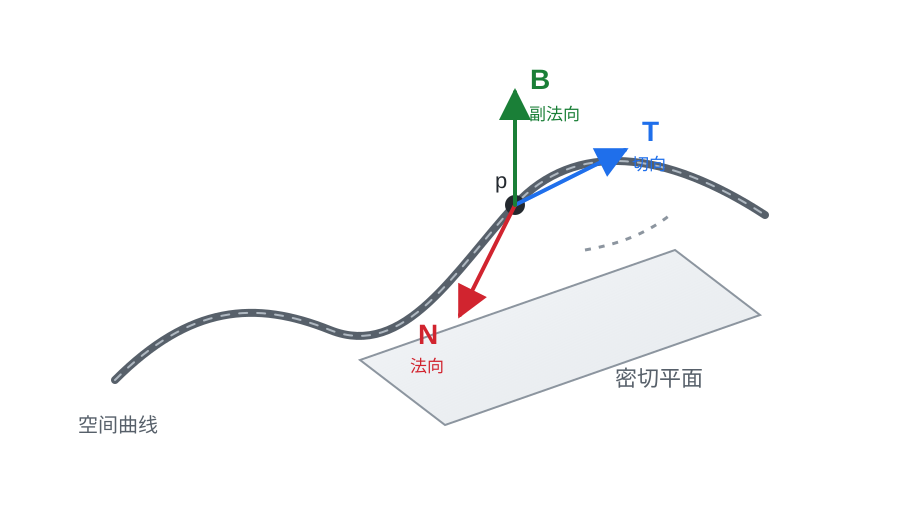
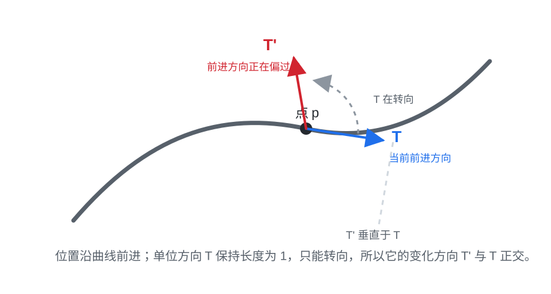
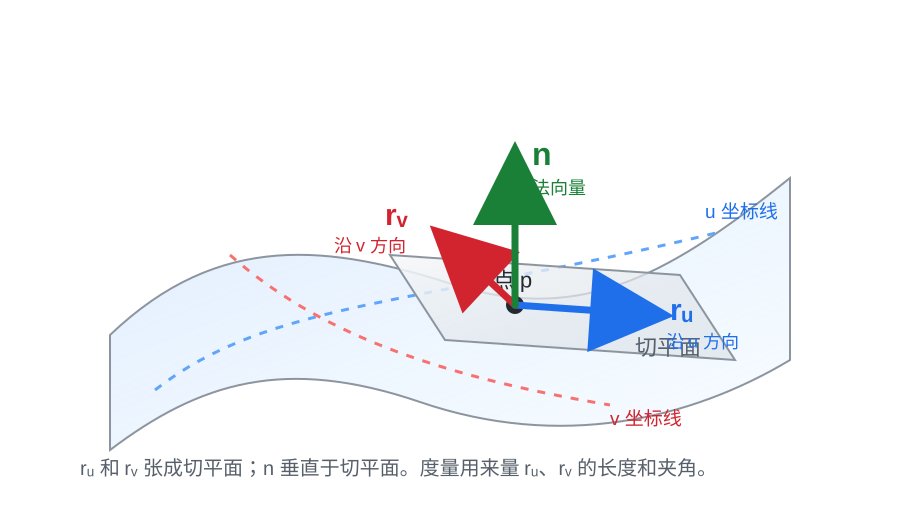

# 普通工科生也能看懂的微分几何：在弯曲空间上做微积分

## 一、从弧长公式看视角变化

微分几何不是从天上掉下来的。对工科生来说，最自然的入口其实就是微积分里的弧长公式。

先看传统微积分怎么写。

如果一条平面曲线写成：

$$
y=f(x),\quad a\le x\le b
$$

那么它的弧长公式是：

$$
L=\int_a^b \sqrt{1+(f'(x))^2}\,dx
$$

这个公式大多数人可能已经忘了，但它的来源很朴素：把曲线切成很多很小的小段，每一小段用直线近似。对其中一小段来说，横向变化是 `dx`，纵向变化是 `dy`。这一小段就像一个很小的直角三角形，所以曲线上的小长度满足：

$$
ds=\sqrt{dx^2+dy^2}
$$

而曲线写成 `y=f(x)` 时，导数告诉我们：

$$
dy=f'(x)\,dx
$$

代回去，就得到：

$$
ds=\sqrt{1+(f'(x))^2}\,dx
$$

把所有小段长度加起来，就得到弧长。

这就是微积分的视角：给定一个坐标表达式 `y=f(x)`，把曲线长度算出来。

微分几何会把同一件事换一种读法。它会先说：曲线 `C` 本身应该有长度，而长度应该来自曲线上的小长度元素 `ds`。所以更几何的写法是：

$$
L=\int_C ds
$$

这里的 `ds` 可以理解成“曲线上一小段真实长度”。它不是横轴上的 `dx`，也不是某个参数本身，而是沿着曲线走出来的小长度。

这就是从微积分走向微分几何时最关键的一步：我们不再只盯着 `dx`、`dy`、`dt` 这些坐标或参数上的小变化，而是引入曲线自己的小长度 `ds`。`ds` 一出现，视角就变了：它提醒我们，真正要测量的是曲线本身，而不是某个坐标轴上的投影。

所以你会发现：微分几何里的弧长公式看上去并没有脱离微积分。它仍然要积分，仍然要算小段长度。区别不在于计算动作完全变了，而在于问题的重心变了。

微积分里，我们通常从一个具体公式出发，比如 `y=f(x)` 或 `r(t)`，然后问：“这条曲线长度怎么算？”

微分几何里，我们更想先说：“曲线本身应该有一个长度，这个长度不应该依赖我用什么参数描述它。”至于 `x`、`t` 或别的参数，只是为了把这个几何量算出来。

如果你刚好用 `x` 来描述曲线，那么这个 `ds` 会写成：

$$
ds=\sqrt{1+(f'(x))^2}\,dx
$$

这句话的意思是：我们把横坐标 `x` 当成描述曲线的位置参数。`x` 增加一点点 `dx` 时，曲线上的点不只是横着走了一点，还会因为 `y=f(x)` 的变化而上下移动一点。所以曲线上的真实小长度 `ds`，要同时考虑横向变化 `dx` 和纵向变化 `dy`。导数 `f'(x)` 只是告诉我们，在这个位置附近，`dy` 和 `dx` 的比例是多少。

如果你换成另一个参数 `t`，曲线写成：

$$
r(t)=(x(t),y(t))
$$

那么同一个 `ds` 又会写成：

$$
ds=|r'(t)|\,dt
$$

这里的 `t` 不一定是横坐标，它可以理解成“沿着曲线走的进度条”。当 `t` 增加一点点 `dt` 时，曲线上的点会从 `r(t)` 移到附近的 `r(t+dt)`。`r'(t)` 描述的是这个点随着 `t` 变化的速度向量，`|r'(t)|` 就是速度大小。因此，曲线上的小长度就是“速度大小乘以参数小变化”，也就是 `ds=|r'(t)|dt`。

所以这里要分清两层东西。

第一层是曲线上的真实小长度 `ds`。这是几何对象本身的一小段长度。

第二层是我们为了计算，把这个 `ds` 用某种坐标或参数写出来。用横坐标 `x` 描述曲线时，表达式里会出现斜率 `f'(x)`；用一般参数 `t` 描述曲线时，表达式里会出现速度大小 `|r'(t)|`。

表达式会随着描述方式改变，但它们都在表示同一个 `ds`。这正是微分几何想强调的地方：几何量本身和描述它的坐标公式，不是同一件事。

也可以说，`ds` 就是这里的微分几何视角。它把问题从“横坐标变了多少、参数变了多少”，改成“沿着曲线本身走了多长”。后面讨论曲率、面积、度量和测地线，本质上都在延续这个视角。

注意这里的重点：微积分公式和微分几何公式不是两套互相竞争的算法。它们算的是同一件事。差别在于，微积分更常从某个坐标或参数表达式出发，问“怎么算”；微分几何更强调曲线本身，问“这个长度是不是不依赖坐标和参数的几何量”。

这样一看，弧长公式已经把我们带到微分几何的门口了。

因为一旦你承认曲线有自己的长度，就会继续问：曲线有没有自己的弯曲程度？曲面有没有自己的面积？如果只能在曲面上走，什么叫方向、距离和最短路径？如果对象本身是弯的，我们还能不能在它上面建立一套微积分？

这就是微分几何的入口：把曲线和曲面从“坐标里的图形”，变成“可以在上面测量、运动、积分和做微积分的空间”。

接下来我们先从最简单的曲线开始。曲线有长度，也有弯曲程度。把这两件事说清楚，再推广到曲面和高维流形，就会自然很多。

## 二、先看曲线：弧长和曲率

在正式推广到曲面和高维流形之前，先看曲线最合适。曲线是一维的，直觉最清楚，但它已经能展示微分几何的核心味道：我们不只关心曲线被写成什么公式，还关心哪些量真正描述了曲线自己的几何。

比如同一条曲线，可以用不同参数写出来。

你可以让参数走得快一点，也可以走得慢一点；可以从左往右走，也可以从右往左走。公式会变，参数会变，但曲线本身并没有变。

所以微分几何会自然问：哪些量不依赖你怎么给曲线取参数，也不依赖你把坐标系怎么平移、旋转？这些量才更像是曲线自己的几何性质。它们常常叫不变量。

最直观的不变量是弧长。

算面积时，我们会把复杂区域切成很多小矩形；算弧长时，思路很像，只是近似对象换了。传统微积分讲弧长，通常从一个朴素想法开始：把一条弯曲的线切成很多很短的小段，每一小段都用直线段近似。切得越细，折线就越贴近原来的曲线。最后让这些小直线段长度的和取极限，就得到曲线长度。

如果曲线写成参数形式：

$$
r(t)=(x(t),y(t)),\quad a\le t\le b
$$

当 `t` 变化一点点 `dt` 时，曲线上的点也移动一点点。这一小段真实长度记作 `ds`。

这里的 `ds` 不是简单的横向小变化 `dx`，也不是纵向小变化 `dy`，而是沿着曲线走出来的小长度。它表示“曲线上这一小段到底有多长”。

在这个参数 `t` 下，微积分告诉我们：

$$
ds=|r'(t)|\,dt
$$

也就是说，曲线上一小段长度，等于“参数变化量”乘以“沿曲线运动的速度大小”。于是弧长可以算成：

$$
L=\int_a^b |r'(t)|\,dt
$$

到这里，传统微积分解决的是计算问题：给定一种参数写法，怎样把曲线长度算出来。

微分几何关心的不是另一套算法，而是这个公式背后的几何意义。它会先把弧长看成曲线自己的量：曲线 `C` 上有一个小长度元素 `ds`，整条曲线的长度就是把这些小长度沿着曲线加起来：

$$
L=\int_C ds
$$

然后，如果为了计算需要选一个参数 `t`，才把 `ds` 写成：

$$
ds=|r'(t)|\,dt
$$

所以两者的差别可以这样说：微积分更常从参数公式出发，问“怎么算”；微分几何更强调曲线本身，问“这个长度是不是不依赖参数选择的几何量”。参数只是描述方式，曲线才是研究对象。

最简单的例子是单位圆的四分之一圆弧。它可以写成：

$$
r(t)=(\cos t,\sin t),\quad 0\le t\le \frac{\pi}{2}
$$

传统微积分会用弧长公式：

$$
L=\int_0^{\pi/2}|r'(t)|\,dt
$$

这里它的导数是：

$$
r'(t)=(-\sin t,\cos t)
$$

这个导数向量表示圆弧上点的运动速度。它的长度是：

$$
|r'(t)|=\sqrt{(-\sin t)^2+(\cos t)^2}
$$

利用恒等式 `sin^2 t + cos^2 t = 1`，可以得到：

$$
|r'(t)|=1
$$

所以弧长就是：

$$
L=\int_0^{\pi/2}1\,dt=\frac{\pi}{2}
$$

同一段圆弧也可以换一种参数写。比如把 `s` 理解成时间，让 `s` 从 `0` 走到 `1`，表示用一秒钟走完整段四分之一圆弧。角度就可以写成：

$$
t=\frac{\pi}{2}s
$$

于是同一段圆弧可以写成：

$$
\gamma(s)=\left(\cos(\pi s/2),\sin(\pi s/2)\right),\quad 0\le s\le 1
$$

为什么这还是同一段圆弧？因为当 `s=0` 时，角度是 `0`；当 `s=1` 时，角度是 `pi/2`。所以点还是从 `(1,0)` 走到 `(0,1)`，走过的还是那段四分之一单位圆弧。只是现在参数 `s` 更像“时间进度”，不是角度本身。

这时速度大小变成：

$$
|\gamma'(s)|=\frac{\pi}{2}
$$

所以：

$$
L=\int_0^1 \frac{\pi}{2}\,ds=\frac{\pi}{2}
$$

如果从传统微积分视角看，我们做的是两次具体计算：第一种参数写法下，参数就是角度，速度大小是 `1`，积分区间长度是 `pi/2`；第二种参数写法下，参数像时间，速度大小变成 `pi/2`，积分区间长度变成 `1`。两次套弧长公式，结果都得到 `pi/2`。

如果从微分几何视角看，重点不是“碰巧两次算出来一样”，而是它本来就应该一样。因为这两种参数写法描述的是同一段圆弧，而弧长是这段圆弧自己的几何量。参数走得快，速度项会变大；参数区间会相应变短。两者正好抵消，说明公式真正积分的是曲线上的小长度 `ds`，不是某个参数本身。

只知道长度还不够。两条曲线可以一样长，但形状完全不同。一条可能几乎是直的，另一条可能绕来绕去。于是我们还要问：曲线弯得厉不厉害？

这就引出曲率。

曲率描述的是曲线方向变化得有多快。

这里的“方向”，最直观地说，就是曲线上某一点的切线方向。

可以想象一辆车沿着一条弯路开。车在某一瞬间朝哪里开，就是这条曲线在这一点的切线方向。直路上，车头方向几乎不变；急弯处，车头方向变得很快。所以曲线弯不弯，本质上是在看这个切线方向变得快不快。

所以曲率的核心想法可以先写成一句话：曲率就是“切线方向的变化量”除以“曲线上走过的长度”。

在平面曲线里，描述切线方向有一个很方便的办法：看这条切线和横轴之间的夹角。这个角在公式里通常记作希腊字母 θ。

比如水平向右的切线，角度是 `0`；斜着向上的切线，角度变大；如果沿着曲线往前走时，这个角度变化很快，就说明曲线转弯很急。

如果用 `s` 表示弧长，用这个角表示切线和横轴的夹角，那么曲率可以先理解成：

$$
\kappa=\left|\frac{d\theta}{ds}\right|
$$

这句话比具体公式更重要。它说的是：曲率不是看坐标 `x` 变化了多少，而是看你沿着曲线真实走了一小段 `ds` 以后，切线方向转了多少。

不过，用一个角度描述方向，有一个限制：它特别适合平面曲线，因为平面里有一个固定的横轴可以拿来比较。到了空间曲线、曲面和更高维空间，方向不一定适合只用一个角度来描述。

所以微分几何更常用向量来记录方向。

曲线在每个点都有一个切向量，它指向“沿曲线往前走”的方向。如果我们只关心方向，不想让速度快慢影响判断，就把这个切向量除以自己的长度，变成长度为 `1` 的向量。这个向量叫单位切向量，通常记作 `T`。

也就是说，`T` 只负责记录方向，不负责记录走得快慢。

曲率就是这个单位切向量沿着曲线变化得有多快：

$$
\kappa=\left|\frac{dT}{ds}\right|
$$

这才是微分几何更关心的写法。它先看曲线自己的方向变化，再把它翻译成某个坐标里的计算公式。

直线的方向一直不变，所以曲率是 `0`。圆的方向一直在变，所以有曲率。圆越小，转弯越急，曲率越大；圆越大，转弯越缓，曲率越小。

最简单的例子是直线和圆。直线完全不拐弯，所以：

$$
\kappa=0
$$

半径为 `R` 的圆，曲率是：

$$
\kappa=\frac{1}{R}
$$

半径越小，圆越紧，转弯越急；半径越大，圆越平缓，转弯越慢。

再看抛物线之前，先看平面曲线 `y=f(x)` 的曲率公式是怎么来的。

曲线写成 `y=f(x)` 时，在点 `x` 附近，它的切线斜率是 `f'(x)`。如果用下面这个角表示切线和横轴的夹角，那么斜率和角度的关系是：

$$
\tan\theta=f'(x)
$$

也就是说，`f'(x)` 描述的是切线方向。可是曲率关心的不是方向本身，而是方向变得有多快。因此我们要看这个夹角怎么随着 `x` 变化。

从：

$$
\tan\theta=f'(x)
$$

开始，对两边同时对 `x` 求导。左边要用链式法则，因为这个夹角本身也是 `x` 的函数：

$$
\frac{d}{dx}\tan\theta
=
\frac{1}{\cos^2\theta}\frac{d\theta}{dx}
$$

右边就是：

$$
\frac{d}{dx}f'(x)=f''(x)
$$

所以：

$$
\frac{1}{\cos^2\theta}\frac{d\theta}{dx}=f''(x)
$$

也就是：

$$
\frac{d\theta}{dx}=f''(x)\cos^2\theta
$$

接下来把这个余弦平方项换成 `f'(x)` 表达。因为：

$$
\tan\theta=f'(x)
$$

所以：

$$
\cos^2\theta=\frac{1}{1+\tan^2\theta}
=
\frac{1}{1+(f'(x))^2}
$$

代回去，就得到：

$$
\frac{d\theta}{dx}=\frac{f''(x)}{1+(f'(x))^2}
$$

这表示：当横坐标 `x` 变化一点时，切线角度变化多少。

但曲率要除以的不是横坐标变化 `dx`，而是曲线上真实走过的小长度 `ds`。这正是和普通坐标微积分最不一样的地方：如果只看 `dθ/dx`，我们得到的是“横坐标每变化一点，方向变多少”；如果看 `dθ/ds`，我们得到的才是“沿曲线自己每走一小段，方向变多少”。

前面已经看到：

$$
\frac{ds}{dx}=\sqrt{1+(f'(x))^2}
$$

所以：

$$
\frac{d\theta}{ds}
=
\frac{d\theta/dx}{ds/dx}
=
\frac{f''(x)}{\left(1+(f'(x))^2\right)^{3/2}}
$$

取绝对值以后，就得到平面曲线 `y=f(x)` 的曲率公式：

$$
\kappa(x)=\frac{|f''(x)|}{\left(1+(f'(x))^2\right)^{3/2}}
$$

这个公式里，`f''(x)` 反映方向变化的快慢；分母是在修正“用横坐标 `x` 走”和“沿曲线真实走”的差别。

所以它看上去确实像微积分公式，因为它就是把微分几何的曲率定义，翻译到 `y=f(x)` 这个坐标表达以后得到的计算版本。几何定义关心的是 `ds` 和切线方向；具体公式只是坐标里的展开。

现在再看抛物线：

$$
y=x^2
$$

对 `f(x)=x^2` 来说，`f'(x)=2x`，`f''(x)=2`，所以：

$$
\kappa(x)=\frac{2}{(1+4x^2)^{3/2}}
$$

这说明抛物线在 `x=0` 附近弯得最明显，越往右走，曲线变得越平缓，曲率也越小。这个例子让曲率从一句“弯得厉不厉害”，变成一个真的能随着位置变化的量。

所以对曲线来说，可以先抓住三件事。不过在平面曲线里，前两件最重要：

- 弧长：沿着曲线自己的 `ds` 累加，得到曲线有多长。
- 曲率：沿着曲线自己的 `ds` 前进，看切线方向变化得有多快。
- 挠率：如果曲线在三维空间里，还要看它有没有从当前弯曲平面里扭出去。

挠率的具体定义需要先引入 Frenet-Serret 标架，也就是曲线上的 `T`、`N`、`B` 三个方向。下一章会专门讲。

这就是这一节真正想强调的视角变化：我们不再只问 `x` 变了多少、参数变了多少，而是问沿着曲线本身走过了多少 `ds`。弧长是在累加 `ds`，曲率是在比较切线方向相对于 `ds` 的变化。到了空间曲线，挠率继续比较“曲线所在的局部弯曲平面”相对于 `ds` 的变化。

平面曲线始终待在同一个平面里，所以挠率可以先放在后面。可是一旦曲线不只是画在平面里，而是在三维空间里运动，挠率就变得重要了。要把弧长、曲率和挠率统一起来，就需要单独讲 Frenet-Serret 标架。

## 三、Frenet-Serret 标架：空间曲线怎样弯、怎样扭

平面曲线只需要问两件事：走了多长，转弯多快。因为它始终在同一个平面里，切线方向怎么转，基本就能描述它的弯曲。

空间曲线更复杂。

想象一条螺旋线。它不只是像平面曲线那样左拐右拐，还会不断向空间里扭出去。只知道曲率还不够，因为曲率只告诉我们切线方向变化得多快，却没有完全说清楚这条曲线怎样在三维空间里摆放。

古典微分几何里，回答这个问题的一套标准工具叫 Frenet-Serret 标架。

所谓标架，可以先理解成“跟着曲线一起移动的小坐标架”。在普通三维空间里，我们习惯用三根固定坐标轴来描述方向，比如 `x`、`y`、`z` 三个互相垂直的方向。Frenet-Serret 标架做的事情很像，只不过它不是固定在整个空间里，而是绑在曲线的每一个点上，随着曲线一起移动。

也就是说，曲线上的每一个点，都配一组三维正交单位基：

- `T`：单位切向量。
- `N`：单位法向量。
- `B`：副法向量。

这里“正交单位基”有两层意思：第一，三根向量两两垂直；第二，每根向量长度都是 `1`。所以它们真的可以看成这一点附近的一组局部坐标轴。

先看一张图会更直观：

图里的黑点是曲线上的某一点。可以把三根箭头想成绑在这个点上的一套“随身三维坐标系”。普通三维坐标系有固定的 `x`、`y`、`z` 三根轴，它们两两正交；这里的 `T`、`N`、`B` 也是三根两两正交、长度为 `1` 的轴，只是它们会跟着曲线一起移动和旋转。

先定蓝色的 `T`：它是切向量，指向曲线前进方向。接着找红色的 `N`：它是和 `T` 正交的法向量，并且指向 `T` 正在变化的方向，所以它描述曲线在这一点主要往哪边弯。最后绿色的 `B` 是补出来的第三根正交轴，它同时垂直于 `T` 和 `N`，也就是垂直于它们张成的密切平面。

先看 `T`。

`T` 表示曲线在这一点“正往哪里走”。如果曲线用弧长 `s` 做参数，写成 `r(s)`，那么单位切向量就是：

$$
T(s)=r'(s)
$$

这里用弧长做参数有一个好处：沿曲线每走一单位长度，参数 `s` 就增加一单位。这样 `r'(s)` 的长度正好是 `1`，所以它只记录方向，不混入速度快慢。

再看 `N`。

可以继续用车沿路开的画面来理解。`T` 像车头当前朝向，表示这一刻沿曲线往哪里走。车如果走在直路上，往前开一点以后，车头朝向几乎不变；车如果进入弯道，往前开一点以后，车头朝向就会开始偏转。

`T` 的变化，说的不是车的位置往哪里移动，而是车头朝向正在怎样改变。这个朝向改变的方向，就是曲线在这一点主要弯过去的方向。把这个方向单位化，就得到单位法向量 `N`。

可以先看一张二维图：

这里有一个关键点：`T` 和 `N` 为什么会正交？

原因是 `T` 是单位向量，它的长度始终是 `1`。沿着曲线往前走时，`T` 可以转向，但不能变长。如果一个长度固定为 `1` 的箭头发生变化，它的变化只能是“转过去”，而不是“沿着自己方向伸长”。所以 `T` 的变化方向必然和 `T` 本身垂直。

用公式说，就是：

$$
\langle T,T\rangle=1
$$

两边对弧长 `s` 求导：

$$
2\langle T',T\rangle=0
$$

所以：

$$
\langle T',T\rangle=0
$$

这说明 `T'` 和 `T` 正交。`N` 又是把 `T'` 单位化以后得到的方向，所以 `N` 也和 `T` 正交。

如果曲率不为 `0`，可以写成：

$$
N(s)=\frac{T'(s)}{|T'(s)|}
$$

所以 `N` 不是随便找的一根垂直向量。它有明确含义：它指向曲线转弯的那一侧。

最后看 `B`。

有了 `T` 和 `N`，第三个方向就被确定了。`B` 同时垂直于 `T` 和 `N`，可以理解成由 `T` 和 `N` 张成的那个“当前弯曲平面”的法向方向：

$$
B=T\times N
$$

这个由 `T` 和 `N` 张成的平面，叫密切平面。名字听起来有点硬，但意思很直观：它是在这一点最贴近曲线弯曲方向的平面。

现在三根向量的意义就清楚了：

- `T` 告诉我们曲线往哪里走。
- `N` 告诉我们曲线往哪边弯。
- `B` 告诉我们当前弯曲平面朝哪里。

换句话说，`T/N/B` 不是三个孤立的概念，而是一套局部坐标系统。普通坐标轴是固定不动的；Frenet-Serret 标架会沿着曲线移动，并且随着曲线弯曲和扭转而旋转。后面的 Frenet-Serret 方程，描述的正是这组三维正交基沿着 `ds` 怎样变化。

曲率 `kappa` 描述的是 `T` 沿着 `ds` 变化得多快：

$$
T'=\kappa N
$$

这句话说：切线方向的变化，指向法向量 `N`，变化速度就是曲率。

但空间曲线还有一个新量：挠率，通常记作 `tau`。

挠率描述的是密切平面本身转得多快。换句话说，它看的是曲线有没有从当前弯曲平面里扭出去。平面曲线始终待在一个平面里，所以挠率是 `0`；螺旋线会不断扭出当前平面，所以挠率不是 `0`。

可以用一句话抓住区别：曲率看 `T` 怎么变，挠率看 `B` 怎么变。`T` 是前进方向，`B` 是密切平面的朝向。前进方向变得快，说明曲线弯得厉害；密切平面的朝向变得快，说明曲线扭得厉害。

Frenet-Serret 方程把这三根向量的变化统一写成：

$$
\frac{dT}{ds}=\kappa N
$$

$$
\frac{dN}{ds}=-\kappa T+\tau B
$$

$$
\frac{dB}{ds}=-\tau N
$$

这三行分别在说三件事。

第一行：

$$
\frac{dT}{ds}=\kappa N
$$

它定义了曲率和主法向方向。`T` 是前进方向，`dT/ds` 表示前进方向沿着曲线变化得多快。这个变化方向就是 `N`，变化大小就是曲率 `kappa`。

第二行：

$$
\frac{dN}{ds}=-\kappa T+\tau B
$$

它说明法向量 `N` 自己怎样变化。`N` 的变化可以分成两部分：一部分回到 `T` 的反方向，来自曲线本身的弯曲；另一部分跑到 `B` 的方向，来自空间曲线的扭转。所以这一行把曲率和挠率同时放在一起。

第三行：

$$
\frac{dB}{ds}=-\tau N
$$

它是最简洁的挠率公式。`B` 表示密切平面的朝向，`dB/ds` 表示这个平面沿着曲线转得多快。这个变化由挠率 `tau` 控制。如果 `B` 不变，密切平面不转，曲线就是平面曲线；如果 `B` 在变，曲线就在三维空间里扭出去。

不用急着背这组公式。它真正重要的是把空间曲线的局部几何组织成一个清楚的结构：

- `s` 负责记录沿曲线走了多长。
- `kappa` 负责记录曲线弯得多快。
- `tau` 负责记录曲线扭得多快。
- `T`、`N`、`B` 负责记录曲线在每个点附近的局部姿态。

这就是古典曲线论的核心味道：不是只把曲线当成一个参数方程，而是沿着曲线自己走，用 `ds`、曲率、挠率和移动标架来描述它的几何。

有了这个感觉，再看曲面就自然多了。曲线有 `ds`，曲面就会有自己的面积元素；曲线有移动的局部标架，曲面也会有切平面、法向量和更复杂的弯曲方式。

## 四、局部线性化：弯曲空间也可以在小范围里看成平的

前面讲曲线时，我们一直在用一个思想：曲线整体是弯的，但足够小的一段可以先用直线近似。弧长公式里的 `ds`，本质上就是把曲线切成很多小段以后，在每一小段上用直线长度来近似。

这个思想继续往前走，就是局部线性化。

微积分里最熟悉的局部线性化，是用切线近似函数。比如在点 `x=a` 附近，函数 `f(x)` 可以近似写成：

$$
f(x)\approx f(a)+f'(a)(x-a)
$$

这句话的意思不是说函数真的变成了直线，而是说：如果只看足够靠近 `a` 的地方，切线抓住了函数在这一点附近最重要的一阶变化。

微分几何把这件事推广到曲线、曲面和更高维空间上。

先看曲线。曲线上的一个点，可以有一个切方向。这个切方向告诉我们：如果从这一点沿着曲线出发，最开始会往哪里走。曲线整体可以弯来弯去，但在这个点附近，它最直接的一阶近似就是一条切线。

再看曲面。曲面上的一个点，通常不只有一个切方向，而是有一整个切平面。站在球面上一点，你可以沿着表面往东走，也可以往北走，也可以沿着两者之间的任意方向走。这些“允许你贴着曲面出发的方向”，共同组成这个点的切平面。

所以曲线和曲面的区别可以这样看：

- 曲线是一维的，局部像一条直线。
- 曲面是二维的，局部像一个平面。
- 更高维流形，局部像某个高维欧氏空间。

这就是切空间的直觉。

切空间不是原来的弯曲对象本身，而是站在某一点看到的“局部平直版本”。它只描述这一点附近的一阶变化，不负责描述整个空间的弯曲形状。

这一步很重要。因为只要有了切空间，我们就可以把线性代数重新拿回来：向量、方向、速度、梯度、内积、投影，都可以先在切空间里讨论。微分几何不是抛弃线性代数，而是在说：整体空间可能是弯的，但每个点附近仍然可以用一个线性空间来近似。

机器学习里也常有这种局部视角，但这里一定要分清楚：不是所有梯度优化都需要微分几何。

如果参数就是普通向量：

$$
\theta\in \mathbb{R}^n
$$

损失函数只是定义在普通欧氏空间上的一个函数，那么用梯度下降训练模型，基本上多元微积分就够了。梯度告诉你函数在当前位置附近往哪个方向下降最快，更新可以写成：

$$
\theta_{k+1}=\theta_k-\eta \nabla L(\theta_k)
$$

这类问题当然也可以画成“损失地形”，但它本质上还是普通微积分和优化：我们在一个平坦向量空间里优化一个函数。

微分几何真正出场，是当“变量所在的空间本身”不再是普通平坦空间的时候。

也就是说，问题不只是“损失函数怎么变”，而是“参数、表示或分布本身能待在哪里、能往哪里走”。这时，空间本身有约束、有形状，不能再默认所有方向都是合法方向。

如果参数空间就是普通欧氏空间，这样做很自然。因为在普通欧氏空间里，从一个点出发，朝任何方向走一小步，通常还在这个空间里。

但如果参数带有约束，情况就不同了。比如参数必须落在球面上，那么当前位置是球面上的一个点。你不能随便朝三维空间里的任意方向走：朝球外走会离开球面，朝球内走也会离开球面。真正“合法”的瞬时方向，只能是贴着球面走的方向，也就是这个点处的切平面方向。

这就是“方向要先落在切空间里”的意思。切空间收集的是：从当前点出发，哪些方向在一阶近似下仍然贴着这个弯曲空间。

黎曼优化就是从这里开始的。它不会直接把普通梯度当成最终更新方向，而是先在当前位置的切空间里找一个合法下降方向；走完这一步以后，再用某种方式把新点放回原来的弯曲空间上。大白话说，就是：先在局部平面里算方向，再沿着曲面本身移动。

所以，这里真正的微分几何思想不是“用 Hessian 看损失函数弯不弯”。那更接近多元微积分和优化。微分几何关心的是：如果参数、表示或分布本身生活在一个有约束的空间上，那么我们要先看这个空间在当前点附近的切空间，再在这个局部线性空间里谈方向和更新。

换句话说，普通微积分常常是在近似函数；微分几何在这里是在近似空间本身。

所以这一章的重点是：微分几何把“以直代曲”的微积分直觉系统化了。曲线有切线，曲面有切平面，流形有切空间。我们先在局部用线性空间理解变化，再把这些局部信息拼回整体的弯曲空间。

## 五、流形：把曲线和曲面推广到高维

有了局部线性化以后，就可以谈流形。

流形这个词听起来很抽象，但它的入口其实很朴素：有些空间整体不是平的，可是每个小地方看起来又像普通欧氏空间。

圆周是最简单的例子。

从外面看，圆周画在二维平面里。但如果你是一只只能沿着圆周运动的点，你的世界其实是一维的：你只能顺着圆周往前或往后走。圆周整体绕成一圈，不像一条无限长直线；但如果只看圆周上很小一段，它又几乎像一小段直线。

球面也是类似。

球面嵌在三维空间里，但球面本身是二维的。站在球面上的人不能往地球内部走，只能沿着表面移动。局部看，脚下附近像一个平面；整体看，球面是弯曲闭合的。

流形就是对这类对象的推广。粗略说，流形就是“局部像欧氏空间的空间”。

如果每个小地方像直线，它是一维流形；如果每个小地方像平面，它是二维流形；如果每个小地方像 `n` 维欧氏空间，它就是 `n` 维流形。

这里要注意一个容易混淆的点：流形的“维度”，说的是它内部需要多少个自由方向，不是它被画在哪个外部空间里。

圆周画在二维平面里，但圆周本身是一维的。球面画在三维空间里，但球面本身是二维的。一个高维数据流形可能嵌在几万维像素空间里，但它内部真正有意义的变化方向可能远少于几万维。

这正是机器学习里“流形假设”的直觉来源。

可以先用球面和平面来类比。

地球表面嵌在三维空间里，但地球表面本身可以看成一个二维流形。一个人如果只能在地球表面行走，他的有效运动其实是二维的：可以沿着表面往东、西、南、北走，却不能自由地往地心或天空方向走。

也就是说，外部空间是三维的，但真正允许运动的空间，是嵌在其中的一个二维流形。流形的维度说的是“在这个空间内部有多少个独立运动方向”，不是它被放在几维外部空间里。

再看一个更接近机器学习入门的例子：房价线性回归。

假设我们用很多特征描述一套房子，比如面积、卧室数量、楼层、房龄、到市中心距离、附近学校评分、社区收入、税率、通勤时间等等。如果有 `d` 个特征，那么每套房子都可以看成 `d` 维向量空间里的一个点。

这个 `d` 维空间非常大。理论上，每一个特征都可以随便取值，于是会出现无数种组合。但真实房子不会填满整个 `d` 维空间。

原因是很多特征组合在现实中根本不合理。比如：

- 面积很小，但卧室特别多。
- 房龄极老，但装修评分极高。
- 到市中心距离很远，但通勤时间极短。
- 学校评分很高，但社区收入和房价都极低。

这些组合不是绝对不可能，但它们不会像随机点一样均匀出现。真实房子背后有一些更深的因素在共同约束这些特征，比如地段、城市规划、建筑类型、收入水平、交通条件、开发年代。

也就是说，表面上我们有很多特征维度，但这些维度并不是独立乱动的。一个真实因素改变时，往往会同时带动好几个特征一起变。

比如“离市中心更近”可能同时影响通勤时间、土地价格、房屋面积、楼层密度和社区收入；“建筑年代更早”可能同时影响房龄、户型、装修情况和所在区域。数据真正的变化，不是每个特征单独拉一个滑杆，而是由少数现实因素一起牵动很多特征。

这时可以想象一个简单版本：虽然我们记录了 `10` 个房屋特征，但真正主要的变化可能由 `2` 到 `3` 个因素驱动，比如“地段”“房屋类型”“新旧程度”。那么真实房屋数据就不会铺满整个 `10` 维空间，而更像是集中在一个低维结构附近。

如果这些关系是线性的，这个低维结构可能接近一个平面。比如某些特征几乎可以由另外几个特征线性组合出来。

但现实关系通常不是完全线性的。市中心附近和郊区的关系可能不一样，老城区和新城区的房屋结构可能不一样，房价随面积增长也可能不是一条直线。于是这个低维结构可能会弯曲。

所以，虽然我们把数据写成高维向量，但有效的数据点可能集中在一个更小、更有结构、甚至弯曲的区域附近。

这里说的“区域”，不一定真的是我们能画出来的二维表面。它只是借用球面的类比：外部空间很大，但真正有意义的点只占其中一部分；而且这些点的变化方向不是任意的，而是受到现实结构约束的。

模型真正需要理解的，不是所有特征任意乱动的方向，而是那些会把一套现实中的房子变成另一套现实中的房子的有效变化方向。

换句话说，高维数据可能集中在一个低维但弯曲的形状附近。

这就是流形假设想说的事情：高维数据的有效变化，可能发生在一个低维流形附近。

这时上一章的局部线性化就重新出现了：如果数据真的靠近某个弯曲形状，那么在某一套房子附近，小范围的变化可能可以用几个局部方向近似。

比如在一套具体房子附近，合理的小变化可能是：

- 同一小区里，面积稍微大一点。
- 同一地段里，房龄稍微新一点。
- 同一价格带里，离地铁稍微近一点。

这些变化不是任意乱改特征，而是在现实约束下的局部方向。它们就像数据流形在这一点的切空间。

这个说法不等于“数据真的严格躺在某个完美流形上”。现实数据有噪声，也有复杂分布。但它提供了一个很有用的视角：不要只看外部维度有多高，还要问数据内部真正的自由度是什么。

降维、表示学习、生成模型、对比学习、图神经网络和几何深度学习，都可以从这个问题出发：模型有没有学到数据所在空间的内部结构？

## 六、度量：在弯曲空间里怎样量长度、角度和面积

前面说流形是“局部像欧氏空间的空间”。但只知道“像欧氏空间”还不够。我们还要知道：在这个空间里，怎么量长度？怎么量角度？怎么量面积？

这就是度量要回答的问题。

可以先用地图来理解。地图告诉你有哪些城市、道路怎样连接，但如果地图没有比例尺，你就不知道两地相距多远。流形也类似：流形先告诉我们空间有哪些点、局部像什么；度量则给这个空间一把尺子，告诉我们在里面怎么测量。

在普通平面里，这把尺子默认存在。一个很小的位移如果写成：

$$
(dx,dy)
$$

那么它的真实小长度满足：

$$
ds^2=dx^2+dy^2
$$

这就是熟悉的勾股定理。这里的 `ds` 还是前面那条主线：它表示空间内部真实走过的小长度。

可是到了弯曲空间，事情就不再这么简单。关键不是“有没有坐标”，而是“坐标变化和真实长度之间是什么关系”。

比如在地球表面上，经纬度可以当作坐标。你把经度改 `1` 度，在赤道附近走过的实际距离很长；但在靠近北极的地方，同样改 `1` 度经度，实际走过的距离就短得多。坐标变化看起来一样，真实长度却不一样。

这就是为什么需要度量。度量记录的就是：在空间的每个位置，坐标上变化一点点，对应的真实长度是多少。

所以可以先把度量理解成一句话：

度量就是弯曲空间里的局部尺子。

它放在每个点的切空间里，告诉我们三件事：

- 一个切向量有多长。
- 两个切向量之间夹角是多少。
- 怎样把很多局部小长度、小面积加起来，得到整体长度和面积。

要把这把局部尺子写成公式，我们先得有办法在曲面上定位一个点。

曲线是一维的，所以只需要一个参数，比如 `s` 或 `t`。曲面是二维的，所以需要两个局部参数。可以把这两个参数记作 `u`、`v`，它们就像曲面上的局部坐标，类似地图上的经度和纬度。

如果一张曲面写成：

$$
r(u,v)
$$

意思就是：给定一对参数 `u`、`v`，就能找到曲面上的一个点。

当 `u` 变一点、`v` 不变时，你沿着曲面上的一个方向走；当 `v` 变一点、`u` 不变时，你沿着另一个方向走。这两个方向会产生曲面上的两个切向量，并张成这一点的切平面。

先看一张图：

这里可以和前面的 `T/N/B` 对比一下。`T/N/B` 是空间曲线上的一组三维正交标架，用来描述曲线怎么走、怎么弯、怎么扭。

曲面这里不是一根前进方向，而是两个局部方向：

$$
r_u,\quad r_v
$$

它们分别表示沿 `u` 坐标线和沿 `v` 坐标线在曲面上走时的切向方向。这两个切向量一起张成曲面在这一点的切平面。曲面还会有一个法向量：

$$
n
$$

它垂直于这个切平面。

有了这两个切向量，我们就能问三个最基本的测量问题：

- 沿 `u` 方向走一点，到底有多长？
- 沿 `v` 方向走一点，到底有多长？
- 这两个方向是不是垂直？如果不垂直，夹角是多少？

这些问题合在一起，就是古典曲面论里的第一基本形式：

$$
ds^2=E\,du^2+2F\,dudv+G\,dv^2
$$

其中：

$$
E=\langle r_u,r_u\rangle,\quad F=\langle r_u,r_v\rangle,\quad G=\langle r_v,r_v\rangle
$$

它们的意思是：

- `E`：沿 `u` 方向的小长度怎样计算。
- `G`：沿 `v` 方向的小长度怎样计算。
- `F`：`u` 方向和 `v` 方向之间有没有夹角关系。

如果这是普通平面，并且 `u`、`v` 两个方向互相垂直、尺子也没有被拉伸，那么：

$$
ds^2=du^2+dv^2
$$

但在一般曲面上，`E`、`F`、`G` 可能随着位置变化。这就是说：空间里的尺子不是到处一样的。

更一般的微分几何会把同一件事写成：

$$
ds^2=g_{11}du^2+2g_{12}dudv+g_{22}dv^2
$$

这里的 `g` 就是度量系数。它和 `E`、`F`、`G` 是同一个意思，只是记号更一般。

为了让第一基本形式更具体，来看单位球面的例子。

单位球面指的是半径为 `1`、中心在原点的球面。球面本身是二维的，所以只需要两个坐标就能描述球面上的一个点。

一种常见做法是用两个角。

第一个角记作 `theta`。它表示从北极往下转了多少。北极对应 `theta=0`；走到赤道时，`theta=pi/2`；继续走到南极时，`theta=pi`。

第二个角记作 `phi`。它表示绕着竖直轴转到了哪个方向。你可以把它想成经度方向：`phi` 变了，点就在同一条纬线圈上绕着球转。

所以 `theta` 决定“从北到南的位置”，`phi` 决定“绕轴转到哪个方向”。用这两个角，球面上的点可以写成：

$$
r(\theta,\phi)=
(\sin\theta\cos\phi,\sin\theta\sin\phi,\cos\theta)
$$

这个公式可以这样看。

先看竖直方向，也就是 `z` 坐标。单位球面半径是 `1`，`theta` 是从北极往下量的角。点离北极越近，`z` 越接近 `1`；点走到赤道，`z` 变成 `0`；点到南极，`z` 变成 `-1`。这正好是：

$$
z=\cos\theta
$$

再看水平截面。固定一个 `theta`，相当于固定从北极往下走到哪一圈纬线。这个纬线圈在水平平面里的半径是：

$$
\sin\theta
$$

比如在北极，`theta=0`，这个半径是 `0`；在赤道，`theta=pi/2`，这个半径是 `1`。

最后用 `phi` 决定在这一圈纬线上绕到了哪个方向。一个半径为 `sin theta` 的水平圆上，平面坐标就是：

$$
x=\sin\theta\cos\phi
$$

$$
y=\sin\theta\sin\phi
$$

所以合在一起就是：

$$
(x,y,z)=(\sin\theta\cos\phi,\sin\theta\sin\phi,\cos\theta)
$$

这里 `theta` 和 `phi` 就是这一节里的两个局部坐标。它们的角色和前面的 `u`、`v` 一样。

先看沿 `theta` 方向的切向量：

$$
r_\theta=(\cos\theta\cos\phi,\cos\theta\sin\phi,-\sin\theta)
$$

它的长度平方是：

$$
\langle r_\theta,r_\theta\rangle=1
$$

再看沿 `phi` 方向的切向量：

$$
r_\phi=(-\sin\theta\sin\phi,\sin\theta\cos\phi,0)
$$

它的长度平方是：

$$
\langle r_\phi,r_\phi\rangle=\sin^2\theta
$$

两个方向的内积是：

$$
\langle r_\theta,r_\phi\rangle=0
$$

所以单位球面的第一基本形式是：

$$
ds^2=d\theta^2+\sin^2\theta\,d\phi^2
$$

这个公式很有解释力。沿 `theta` 方向走，真实长度就是 `dtheta`；但沿 `phi` 方向绕圈走，真实长度还要乘上 `sin theta`。

这正好解释了前面经纬度的例子。在赤道附近，`sin theta` 接近 `1`，改变一点经度会走过比较长的距离；靠近北极时，`sin theta` 接近 `0`，同样改变一点经度，实际走过的距离很短。坐标变化一样，真实长度不一样，这就是度量在起作用。

所以这一章可以压缩成一句话：流形告诉我们空间在哪里，度量告诉我们在这个空间里怎么量。

这件事和机器学习也有关系。很多算法默认使用欧氏距离，好像表示空间里的尺子到处一样。但如果数据、表示或概率分布本身有弯曲结构，普通欧氏距离就不一定是最合适的测量方式。

解决思路不是简单地“换一个距离公式”，而是先回答：这个空间里什么变化才是自然的？回答清楚以后，再选择相应的度量。

第一，如果关心数据流形上的距离，就不要只看外部向量空间里的直线距离，而要看沿着数据流形走的距离。比如两套房子的特征向量欧氏距离可能不远，但如果中间经过一堆现实中不合理的房屋组合，那么这条直线距离就不一定有意义。更合理的是沿着真实数据附近的结构来比较距离。

第二，如果关心参数更新，就要看参数空间本身有没有约束。如果参数在球面、正定矩阵空间、概率单纯形这类空间上，更新方向应该先放在切空间里，再根据这个空间的度量来定义“最陡下降方向”。这就是黎曼梯度或黎曼优化的思路。

第三，如果关心概率分布之间的距离，就不能总把分布参数当成普通向量。信息几何会用 Fisher 信息给概率分布空间定义局部度量。自然梯度的思想就是：用分布空间自己的尺子来决定哪个方向是真正自然的更新方向。

所以度量在机器学习里的作用可以概括成一句话：先选对空间里的尺子，再谈距离、相似度和更新方向。

## 七、曲率：空间到底弯在哪里

有了度量以后，我们才能认真谈曲率。

前面讲曲线时，曲率是“沿着 `ds` 前进时，切线方向变化得多快”。这是一维曲线的弯曲。

到了曲面，弯曲会变得更丰富。因为在曲面上的一个点，你可以沿很多不同方向切一刀。不同方向看到的弯曲程度可能不一样。

古典曲面论里，描述曲面弯曲的一个核心工具叫第二基本形式。

前面说的第一基本形式负责测量曲面内部的长度和角度。第二基本形式则更关心曲面在外部空间里怎样弯。直观地说，它在看：当你沿着曲面走一点点时，曲面的法向量变化得有多快。

为什么看法向量？因为平面上每一点的法向量都一样，不会变；球面上不同点的法向量指向不同方向，变化很明显。法向量变化得越快，曲面就弯得越明显。

如果曲面写成 `r(u,v)`，单位法向量记作 `n`，第二基本形式常写成：

$$
II=L\,du^2+2M\,dudv+N\,dv^2
$$

这里的 `L`、`M`、`N` 不是长度，而是描述曲面二阶弯曲的系数。它们来自曲面二阶变化和法向量之间的关系：

$$
L=\langle r_{uu},n\rangle,\quad M=\langle r_{uv},n\rangle,\quad N=\langle r_{vv},n\rangle
$$

可以先把它理解成：第一基本形式告诉我们曲面上怎么量，第二基本形式告诉我们曲面在外部空间里怎么弯。

这两套基本形式放在一起，就能写出很多古典曲面论里的曲率量。比如高斯曲率 `K` 可以写成：

$$
K=\frac{LN-M^2}{EG-F^2}
$$

这个公式先不用展开计算。它只是在告诉我们：曲面的曲率同时牵涉“怎么量”和“怎么弯”。其中 `E`、`F`、`G` 来自第一基本形式，`L`、`M`、`N` 来自第二基本形式。

先看三个直觉例子。

平面没有弯曲。你在平面上画一个小三角形，内角和是 180 度；画一个小圆，周长大约是 `2 pi r`；两条平行线不会突然相交。

球面是正曲率的典型例子。在球面上，经线在赤道附近可以看成彼此平行地出发，但往北走会在北极相交。球面三角形的内角和可以大于 180 度。这些现象都说明：球面内部的几何规则和普通平面不同。

马鞍面则像负曲率。它沿一个方向向上弯，沿另一个方向向下弯。直觉上，附近的路径更容易发散，小三角形的内角和可能小于平面里的 180 度。

圆柱面比较有意思。它看起来弯了，但可以沿着侧面剪开并摊平成平面，而且不需要拉伸或压缩。纸卷成圆柱以后，纸面内部的小长度和小角度没有变。从曲面内部的角度看，圆柱的某种内在曲率和普通平面一样是零。

这说明一件重要的事：微分几何里的曲率不只是“从外面看弯不弯”。它更关心空间内部的测量规则是否和普通平面一样。

这里就会遇到古典微分几何里非常漂亮的一个结论：高斯绝妙定理。

它说的事情可以先用大白话理解：高斯曲率虽然在上面的公式里用到了第二基本形式，看起来像是在描述曲面怎样弯在三维空间里，但它其实可以只由曲面内部的度量决定。也就是说，只要知道曲面上的长度、角度和距离怎样测量，就能知道高斯曲率；不需要站到外面去看这张曲面怎样嵌在三维空间里。

这也是为什么圆柱面很有启发性。圆柱从外面看是弯的，但它可以不拉伸地展开成平面，所以它的内部测量规则和一张平纸一样。高斯绝妙定理告诉我们：这种内部测量规则已经决定了高斯曲率，因此圆柱的高斯曲率和普通平面一样是 `0`。

球面就不同。你无法把一块球面完整摊平成平面而不拉伸或撕裂。它的内部距离和角度规则已经不同于平面，所以它有正的高斯曲率。

可以把曲率理解成对局部平直近似的误差说明。

切空间告诉我们：每个点附近可以先当成平的。曲率接着问：这个“当成平的”的近似能维持多远？如果走远一点，平面直觉会怎样失效？

曲率会影响很多几何问题：

- 最短路径会怎样走。
- 两条一开始很接近的路径会靠近还是远离。
- 一个小区域摊到平面上会不会被拉伸。
- 局部线性近似在多大范围内还可靠。

机器学习里也有两个常见层面。

第一个层面是优化。损失函数可以看成一个地形。梯度告诉你当前位置最陡的下降方向，曲率则告诉你这个方向变化得快不快。曲率大的地方，损失地形很尖，步子太大容易震荡；曲率很小的地方，地形很平，训练可能走得慢，也可能存在很多差不多的解。

第二个层面是数据和表示。数据如果分布在弯曲形状附近，普通直线距离可能不能反映真实邻近关系。比如两张图片在像素欧氏距离上可能很远，但在“姿态逐渐变化”的数据流形上可能很近。曲率越明显，越需要小心“直线近”和“沿数据形状近”是不是一回事。

所以曲率不是只用来描述曲面好不好看。它在问：这个空间的内部几何，和我们熟悉的平坦空间到底差在哪里。

## 八、测地线：弯曲空间里的最短路径

有了度量和曲率以后，就可以问路径问题。

在普通平面上，两点之间直线最短。这个事实太熟悉了，以至于我们很容易把“最短路径”和“直线”混在一起。

但在弯曲空间里，普通直线可能根本不是允许的路径。

比如从北京到纽约，如果只看三维空间里的直线，它可能穿过地球内部。可是现实中飞机要沿着地球表面附近飞。于是有意义的路径不是“穿过去的直线”，而是球面上的最短路径，也就是大圆航线。

测地线就是这种弯曲空间里的“直线”。

更准确地说，测地线是在这个空间内部尽量不自己拐弯的路径。它不一定全局最短，但在足够小的一段上，它通常是局部最短、最自然的路径。

平面上的测地线就是普通直线。球面上的测地线是大圆。圆柱面上的测地线如果把圆柱剪开摊平成平面，就会变成展开图上的直线。

为什么还要说“尽量不自己拐弯”？因为在弯曲空间里，一条路径看起来弯，有时不是它自己在拐，而是空间本身弯了。

比如赤道画在球面上，从三维空间外面看是一条圆；但如果你只能生活在球面上，沿赤道一直走，你并没有在球面内部左右转向。它就是球面上的一条测地线。

这再次体现了微分几何的视角：不要只从外面的欧氏空间看，要问空间内部的人会怎样测量和运动。

测地线可以用长度泛函来理解。给定一条路径 `gamma`，它的长度可以写成：

$$
L(\gamma)=\int_\gamma ds
$$

测地线问题就是在很多条连接两点的路径里，寻找让这个长度尽可能短的路径。

这已经带有一点变分法的味道：输入不再是一个数字，而是一整条路径；目标是找一条最好的路径。

在机器学习里，测地线常出现在表示空间和生成模型里。

如果我们在潜空间里从一个样本插值到另一个样本，最简单的做法是走欧氏直线：

$$
z(t)=(1-t)z_0+tz_1
$$

但如果有意义的样本主要集中在一个弯曲区域附近，直线插值可能穿过低概率区域，生成出不自然的中间样本。几何视角会问：能不能沿着潜空间里更自然的路径走？也就是更贴近数据流形的路径。

所以测地线要回答的问题是：当空间本身有形状时，什么才叫“最直接地从 A 到 B”。

## 九、向量场、微分形式和 Stokes 定理：把积分统一起来

前面一直在谈长度、方向、距离和最短路径。微分几何还有另一条重要主线：怎样在弯曲空间上继续做积分。

这条线其实也来自工科微积分。

你可能见过几类不同的积分：

- 沿曲线积分：沿着一条路径累加。
- 曲面积分：贴着一张曲面累加。
- 通量积分：看一个向量场穿过曲面多少。
- 环流积分：看一个向量场沿着边界绕了多少。

这些东西在微积分课里常常分章节出现：Green 公式、Gauss 公式、Stokes 公式，各有各的样子。微分几何想做的是把它们放进同一种语言里。

先说向量场。

向量场就是在每个点放一个箭头。风场、流体速度场、力场都可以这样想：空间中每个位置都有一个方向和大小。如果你沿着某条曲线走，向量场可能有一部分沿着你的前进方向，这就会形成曲线积分；如果它穿过某个曲面，就会形成通量。

再说微分形式。

微分形式可以先理解成“为了积分而设计的对象”。它会自动关心你是在沿曲线积分、在曲面上积分，还是在更高维对象上积分。更重要的是，它很适合放在流形上，因为它不那么依赖某个固定坐标系。

一个最简单的一维形式可以长得像：

$$
\omega=P(x,y)\,dx+Q(x,y)\,dy
$$

沿曲线积分时，它会把曲线每一小段的方向变化考虑进去。你可以先把它理解成：它不是只给每个点一个数，而是给每个小方向一个可以累加的贡献。

Stokes 定理则把这些积分公式统一起来。它的核心思想可以用一句话说：边界上的积分，等于内部变化的积分。

比如二维平面里的 Green 公式，说的是一个区域边界上的环流，等于区域内部旋转变化的累积。三维里的 Gauss 公式，说的是穿过边界曲面的总通量，等于内部源汇的总量。普通 Stokes 公式，说的是边界曲线上的环流，等于曲面内部旋转的累积。

微分几何会把它们统一写成：

$$
\int_{\partial M}\omega=\int_M d\omega
$$

这里不用急着掌握符号细节。可以先抓住意思：左边是在边界上积分，右边是在内部积分；`d` 表示把一个积分对象变成描述内部变化的对象。

这条线和机器学习的关系没有流形假设、度量、测地线那么直接，但在一些方向会很重要：物理启发模型、连续场建模、PDE、神经 ODE、扩散过程、最优传输、几何深度学习，都可能用到这种语言。

它提醒我们：微分几何不只是研究空间形状，也研究怎样在这些空间上做微积分。

## 十、回到机器学习：微分几何在看什么问题

最后把这些概念拉回机器学习。

这篇文章不是要把机器学习改写成一堆几何术语，而是想建立一个视角：当数据、表示、参数或概率分布不适合被看成普通平坦空间里的点时，微分几何就会变得有用。

第一，数据是否靠近某个低维流形？

高维数据常常不是均匀散在整个空间里，而是集中在某个更低维、更有结构的形状附近。图片、语音、文本 embedding 都可能有这种特点。流形假设就是用几何语言表达这件事：外部维度很高，但有效变化方向可能少得多。

第二，表示空间里的距离是否真的有意义？

模型学到的 embedding 常常被拿来算相似度。但两个向量欧氏距离近，是否真的表示语义上接近？如果表示空间有弯曲结构，普通欧氏距离可能只是方便，不一定是最合适的尺子。几何视角会追问：这个空间自己的 `ds` 是什么？真正沿着表示空间移动的距离应该怎样定义？

第三，模型参数空间是否适合用普通欧氏梯度下降？

很多参数空间带有结构。比如归一化向量在球面上，概率分布在概率单纯形上，正定矩阵也有自己的几何。你不能随便往任何方向走，因为一步走出去可能就离开了合法空间。黎曼优化关心的就是：在当前位置的切空间里找下降方向，再沿着参数空间本身更新。

第四，概率分布组成的空间能不能有自己的几何结构？

信息几何会把概率分布看成空间里的点，并用 Fisher 信息等工具定义局部度量。这样一来，分布之间的差异、统计模型的参数变化、自然梯度，都可以用几何语言理解。

第五，生成模型的潜空间插值为什么有时不该只走直线？

如果潜空间里真正有意义的样本集中在某个弯曲区域附近，那么两个样本之间的直线插值可能经过低概率、没有意义的区域。几何视角会问：有没有更贴着数据形状的路径？这就会自然引出测地线、流形距离和潜空间几何。

第六，几何深度学习为什么要关心图、曲面和群？

有些数据本来就不是规则网格上的向量。社交网络是图，分子结构是图，三维形状是曲面，姿态和旋转带有群结构。几何深度学习关心的是：模型能不能尊重这些空间本身的结构，而不是把所有东西都硬塞进普通欧氏向量空间。

所以这一篇的重点不是记住一串名词，而是形成一条主线：

- 从 `ds` 开始，我们把注意力从坐标变化转向对象自己的小长度。
- 从切线、切平面、切空间开始，我们把局部线性化推广到弯曲空间。
- 从流形开始，我们允许空间整体弯曲，但局部仍然像欧氏空间。
- 从度量开始，我们给每个局部一把尺子，用来量长度、角度和面积。
- 从曲率开始，我们描述空间内部几何和普通平面差在哪里。
- 从测地线开始，我们在弯曲空间里重新理解最短路径。
- 从微分形式和 Stokes 定理开始，我们把曲线、曲面和高维空间上的积分统一起来。

拉回机器学习，这些问题分别对应着：数据是否贴在低维形状附近，表示空间里的距离是否合理，优化路径是否尊重参数空间结构，概率分布能否组成几何空间，生成模型和几何深度学习为什么需要关心空间本身的形状。

更深的内容，比如联络、协变导数、曲率张量、纤维丛、黎曼优化的具体算法、信息几何和最优传输，可以放到后面的专题文章里继续展开。

